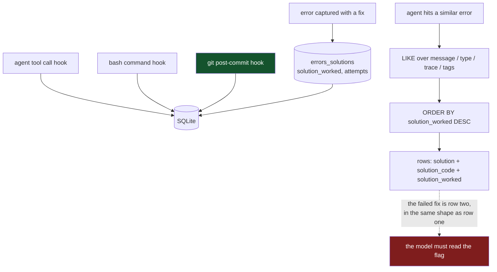

## 1. Executive Summary

EAN AgentOS is a shared memory across four coding CLIs — Claude Code, Gemini CLI,
Codex and Kimi — installed by merging hooks into each one's settings file. MIT
licensed, 37,791 lines of Python, 51 commits between 16 and 19 March 2026. It has
not been touched since; read everything below as a snapshot of a four-day burst.

The pitch is *"AI agents forget. AgentOS remembers"*, and the concrete version of
that is the `errors_solutions` table:

```sql
CREATE TABLE IF NOT EXISTS errors_solutions (
    error_type TEXT NOT NULL, error_message TEXT NOT NULL, stack_trace TEXT,
    file_path TEXT, line_number INTEGER, language TEXT, framework TEXT,
    solution TEXT, solution_code TEXT, solution_worked BOOLEAN,
    attempts INTEGER DEFAULT 1, resolved_at TIMESTAMP, ...
);
```

An error, where it happened, what was tried, whether it worked, and how many
attempts it took. That is the right shape for the problem the project names —
stop re-fixing the same bug — and very few systems in this atlas model the
*attempt* rather than the conclusion.

**And a fix that did not work is returned anyway.** Both recall paths sort on the
flag rather than filtering it:

```sql
ORDER BY solution_worked DESC, resolved_at DESC LIMIT ?     -- scripts/error_db.py:52
ORDER BY resolved DESC, solution_worked DESC LIMIT ?        -- scripts/universal_api.py:843
```

**But those are the paths a person invokes, and they are not the paths that feed
the model.** Both of the daemon's automatic injections filter the flag rather
than sorting on it:

```sql
WHERE solution IS NOT NULL AND solution_worked = 1                  -- memory_daemon.py:1159, session-start context
WHERE error_message LIKE ? AND solution IS NOT NULL AND solution_worked = 1
                                                                    -- memory_daemon.py:1822, first-prompt pre-fetch
```

`get_memory_context` is called once per session at `memory_daemon.py:1292` and
its output is `print`ed as the hook's response, which is how memory reaches the
agent at all. So the accurate statement is narrower than the one this report
made: a failed fix is excluded from everything the agent is handed
automatically, and demoted one position in the two searches a person or a tool
runs on purpose — `mem search` and the HTTP endpoint. `WHERE solution_worked`
also appears in `dashboard_api.py:1281`, `error_db.py:162` and
`auto_summarizer.py:322`; the earlier claim that `web_server.py:498` held the
only one was wrong.

The pre-fetch is worth one more sentence, because it does nothing. It runs the
query, builds a `hints` list of the three matches — and then logs the count.
`hints` is assigned at `memory_daemon.py:1828`, appended to at `:1830`, and read
nowhere; the block's own comment calls it a *"PROACTIVE CONTEXT PRE-FETCH"* and
the context is discarded before it reaches the prompt.

That is defensible — *"we tried this and it did not work"* is genuinely useful,
and often more useful than silence — and it is worth stating as a design choice
rather than a defect. The risk is in the output shape, not the ordering: the
result row carries `solution` and `solution_code` beside `solution_worked`, and
nothing guarantees a model reads the boolean before copying the code. A system
whose stated purpose is preventing repetition returns the thing to repeat, one
row lower, in the same shape as the thing that worked.

**The capture path is the part worth taking.** Memories arrive from hooks, not
from a model deciding what mattered: agent tool calls, bash commands with exit
codes and durations, file versions, and a git `post-commit` hook that writes each
commit into the store. Deterministic capture has a known failure mode — volume —
and a known virtue: what is recorded does not depend on an extraction pass
noticing. Most of this atlas pays an LLM to decide what to remember; this pays a
hook.

## 2. Mental Model

There is no single memory unit. The schema is a set of tables for different kinds
of durable trace, and the agent's context is assembled from several of them:

| Table | What it holds |
| --- | --- |
| `errors_solutions` | an error, a fix, whether it worked, attempt count |
| `patterns` | reusable code with a `usage_count` and a `quality_score` |
| `bash_history` | command, working directory, exit code, output, duration |
| `file_versions` | file state over time |
| `messages`, `tool_calls`, `sessions` | the raw trace |
| `content_summaries`, `session_summaries` | derived, by the summarizer |
| `embeddings` | vectors for the semantic path |

Fifteen migrations sit on top, including `012_memory_branches.sql` —
*"Git-like branching for memory entities"*, with a branch registry carrying a
`parent_branch` defaulting to `main` — and `014_cross_agent_learning.sql` and
`015_memory_intelligence.sql`. Branching memory is an idea nothing else in this
atlas has; whether it is wired to anything at this commit is in section 14.



Green is deterministic capture. Red is the gap between demoting a failure and
withholding it.

## 3. Architecture

One SQLite database, a local HTTP API on a fixed port, an MCP server, a web
dashboard, and a memory daemon. `scripts/ean_memory.py` is 1,659 lines and is
mostly an *installer*: it detects the environment, builds hook configurations for
Claude and Gemini, merges them into the user's settings while marking its own
entries so they can be removed again, and backs up the file first.

That merge-and-mark discipline is worth noting on its own. `_is_our_hook` and
`_is_our_gemini_hook` identify the entries this tool added, so `uninstall`
removes exactly those and leaves a user's other hooks intact. Software that
edits another program's config and can cleanly undo it is rarer than it should
be.

The rest of the moving parts: `memory_daemon.py` (2,128 lines),
`dashboard_api.py` (1,589), `transcript_reconciler.py` (1,349),
`universal_api.py` (1,134), `context_builder_v2.py` (984). Comments and CLI
output are largely in Romanian; the schema and API surface are in English.

## 4. Essential Implementation Paths

| Path | Location |
| --- | --- |
| The error/fix/outcome table | `scripts/init_db.py:145` |
| Error search, ordered not filtered | `scripts/error_db.py:41`–`:52` |
| The API's error search, same ordering | `scripts/universal_api.py:839`–`:843` |
| The one `WHERE solution_worked` — a dashboard filter | `scripts/web_server.py:498` |
| Reusable patterns with a quality score | `scripts/init_db.py:167` |
| Git commits captured by post-commit hook | `scripts/git_memory_hook.py` |
| Hook install, marked for clean removal | `scripts/ean_memory.py:257`, `:287` |
| Memory branching schema | `migrations/012_memory_branches.sql` |

## 5. Memory Data Model

`errors_solutions` is described above. Two fields deserve attention beyond it.

`attempts INTEGER DEFAULT 1` records how many tries a fix took, which is the
closest thing here to a difficulty signal and is stored by nothing else in this
atlas. It is written and, as far as the recall paths go, never read.

`patterns.quality_score` is documented as *"0-100, based on successful uses"* and
sits beside `usage_count` and `last_used_at`. It is the same shape as
[Agentic Context Engine](../agentic-context-engine/)'s outcome counters, and
like those it is advisory: no retrieval path filters on it.

There is no status field, no supersession pointer and no record of a rejected
value, so `tombstone`, `trust_state` and `bitemporal` are all withheld.
`solution_worked` is the nearest miss and it is a genuinely close one — a durable
boolean recording that a specific fix failed, attached to the error it failed on.
What it lacks is any read path that treats `false` as *withhold* rather than as
*rank lower*, which is the whole distinction the `trust_state` definition turns
on.

## 6. Retrieval Mechanics

Error recall is `LIKE '%query%'` across `error_message`, `error_type`,
`stack_trace` and `tags`, optionally narrowed by `language`, ordered by
`solution_worked` then `resolved_at`, limited. There is an `embeddings` table and
a `cognitive_search.py` for the semantic path, so substring matching is the
error-specific route rather than the whole retrieval story.

Substring matching over a stack trace is better than it sounds for this use case:
error messages are near-verbatim across recurrences, so exact-ish matching has
high precision where an embedding would blur two different failures with similar
wording. The cost is the usual one — a rephrased or localised error message
misses entirely.

**`scope_enforced` is withdrawn.** The first reading granted it on the strength
of the columns; tracing the key through the reads finds it on almost none of
them. `project_path` is written on the `errors_solutions` row at capture, and
five paths read that table:

| Read path | project filter |
| --- | --- |
| `scripts/dashboard_api.py:1276` — `GET /api/errors` | yes, `AND project_path = ?`, and only when the caller passes `?project=` |
| `scripts/universal_api.py:842` — the HTTP search | no |
| `scripts/error_db.py:44` — `search_error`, behind `mem search` | no |
| `scripts/memory_daemon.py:1159` — the session-start context | no |
| `scripts/memory_daemon.py:1822` — the first-prompt pre-fetch | no |

One of five, optional, on the dashboard. The three paths that feed a model —
`mem search`, the HTTP search and the session context — return solved errors from
every project on the machine.

The one leg that does scope widens as it goes. `get_memory_context`'s message
query is `WHERE project_path = ? OR project_path LIKE ?` with the second
parameter built as `f"{project_path}%"`, so a session in `/home/u/app` also
matches `/home/u/app-private`. A prefix on a filesystem path is not a
partition. Its sibling statistics line — sessions, messages and solved-error
counts — is computed with no filter at all, so every session opens by announcing
the size of every project's memory.

The mark certifies that a stored scope key is applied as a filter on the read
path rather than merely carried as a tag. On the table this system is built
around, it is carried as a tag.

## 7. Write Mechanics

Writes are hook-driven and synchronous. Agent tool calls, bash commands and file
edits are captured by the installed hooks; commits are captured by
`git_memory_hook.py`, which can be installed globally at
`~/.config/git/hooks/post-commit` or per project, and also exposes
`save`, `list`, `search` and `stats` subcommands for manual use.

Errors and their solutions are recorded explicitly — `error_db add --error ... --solution ...`
is the documented path, and the CLI prints exactly that invitation when a search
finds nothing. So the outcome signal that drives the ordering is human-entered,
which is both its strength (a person knows whether the fix worked) and its
ceiling (it is entered only when someone bothers).

`attempts` increments and `solution_worked` is set; nothing is ever retired,
superseded or deleted from `errors_solutions`. The store only grows.

## 8. Agent Integration

Four CLIs through their own hook mechanisms, plus an MCP server
(`mcp-server/kimi_memory_server.py` is Kimi-specific at 427 lines) and a local
HTTP API. The claim that matters is *"one shared memory, all agents, all
sessions"*, and the schema supports it: `session_id` and `project_path` are on
the rows, so a Codex session and a Claude session against the same project write
into the same tables.

`human_review` is withheld. There is a web dashboard with an error browser and a
`solution_worked` filter, which is inspection; nothing in it adjudicates a memory
before or after it takes effect, and the dashboard's filter changes what a person
sees rather than what the agent gets.

## 9. Reliability, Safety, and Trust

The deterministic capture path is the reliability story and it is a good one: what
is in the store does not depend on a model having judged a moment important. The
corresponding risk is `bash_history`, which stores `command`, `output` and
`error_output` verbatim — a shell history with outputs is one of the more
sensitive artifacts on a developer machine, and no secret scanning was found on
the capture path.

The hook installer's backup-and-mark behaviour is the other reliability
strength: it backs up the settings file before editing, marks its own entries,
and can remove exactly those.

The store has no retention policy visible in the schema, no deletion path for
errors, and no trust state, so it accumulates. Over months of hook-driven capture
that is a real operational question the repository does not answer, and one the
four-day development window would not have surfaced.

## 10. Tests, Evals, and Benchmarks

**The suite is roughly eight times the size the first reading reported.** There
are 59 `def test_` functions, which is what that reading counted — and 458
`run("name", fn)` invocations, which is where the substance is. Each file is an
executable script: it creates its own SQLite database, starts a Flask app on its
own port where the endpoints need one, runs its numbered cases through a `run`
wrapper that tallies pass and fail, and 21 of the 22 files end with
`if failed: sys.exit(1)`. So they do fail properly — but `pytest tests/` collects
almost none of them, because the cases are named `t26_empty_project`, not
`test_...`. The README badge's number and the suite's real extent are measuring
different things.

That also corrects the claim that no test is named for the recall path: the
`run` names include `mem search`, `create_resolution`, `compare resolutions
differences` and `GET /api/events?type=agent_error filters correctly`.

**`negative_eval` is earned.** `tests/test_phase_10b.py` asserts at T13 that
`/api/branches/replay?branch=feature-ui` returns a non-empty event list, and at
T15 that the same endpoint with `branch=empty-branch` returns
`len(events) == 0` — one store, one endpoint, two keys, so the empty result is a
refusal rather than an empty index. `tests/test_phase_12a.py` adds T26 and T28,
which assert `count == 0` for a nonexistent project path and a nonexistent
branch against a database the script seeds itself.

What no case asserts is the one this system most needs: that another project's
errors stay out of a result set. That absence is the same one that costs it
`scope_enforced` in section 6, and the two are the same defect seen from the two
ends — no filter, and nothing that would have noticed.

No benchmark, no eval, no committed retrieval result.

## 11. For Your Own Build

### Steal

**Capture from hooks, not from judgement.** Commits, commands with exit codes,
tool calls and file versions arrive because a hook fired, not because a model
decided they mattered. That removes the most common silent failure in this atlas
— an extraction pass that quietly captures nothing — and replaces it with a
volume problem you can measure.

**Model the attempt, not just the conclusion.** `solution_worked` and `attempts`
together say *what was tried, whether it worked, and how hard it was*. A store
that only records successful fixes cannot tell you that the obvious fix has
already failed twice.

**Mark the config you inject so you can remove it.** `_is_our_hook` identifies
this tool's own entries in another program's settings, so uninstall is exact and
a user's other hooks survive. Back the file up first, which it also does.

### Avoid

**Do not rank a failure when you mean to withhold it.** `ORDER BY
solution_worked DESC` puts the failed fix second and hands it over in the same
shape as the successful one. If the point is not repeating it, the read path has
to say so — filter it, or return it under a different key so the model cannot
mistake it for a recommendation.

**Do not store shell output without scanning it.** `bash_history` keeps
`command`, `output` and `error_output` verbatim, and a developer's terminal is
full of tokens.

**Do not name test files after build phases.** `test_phase_12b` guards
something; a reader cannot tell what, and neither can the next contributor.

### Fit

Take the capture architecture: hooks into several CLIs, a git post-commit hook,
one SQLite file, a schema that models errors and attempts rather than just
outcomes. That combination is unusual and the parts are separable.

Do not take it as maintained software. Fifty-one commits over four days in March
2026 and nothing since, a schema with fifteen migrations including features whose
wiring is unclear, and no test named for the mechanism the product is about.
Read it for the schema and the hook discipline.

## 12. Antipatterns / Risks

- **Failed fixes are ordered, not filtered**, and returned in the same shape as
  successful ones.
- **`attempts` is written and never read** on any recall path.
- **`bash_history` stores command output verbatim** with no secret scanning
  found.
- **No retention, no deletion path, no trust state** — the store only grows.
- **Dormant since 19 March 2026**, four days after the first commit.
- **Phase-numbered tests** guard unnamed properties.

## 13. Build-vs-Borrow Takeaways

Borrow the schema for `errors_solutions` and the hook installer's
mark-and-restore discipline. Both are small, both are copyable, and both solve
problems that recur outside this project.

Build the read path differently. The distance between this and a system that
actually stops the repetition is one `WHERE` clause and a decision about what to
do with the failures instead — surfacing them under a "already tried, did not
work" heading would keep their value and remove the ambiguity.

## 14. Open Questions

- **Is memory branching wired to anything?** `012_memory_branches.sql` creates a
  branch registry with a `parent_branch`; whether any code path reads it was not
  established, and it is the most distinctive idea in the schema.
- **What do `014_cross_agent_learning` and `015_memory_intelligence` implement?**
  Both are late migrations in a four-day window.
- **How large does the store get?** Hook-driven capture of commands, outputs and
  file versions, with no retention policy in the schema.
- **Was the project abandoned or paused?** 51 commits, four days, then nothing
  for over four months at the time of this review.

## 15. Appendix: File Index

| File | Role |
| --- | --- |
| `scripts/init_db.py` | The base schema, including `errors_solutions` and `patterns` |
| `migrations/` | Fifteen migrations, including memory branches and cross-agent learning |
| `scripts/error_db.py` | Error search — the ordering that this report turns on |
| `scripts/universal_api.py` | The HTTP API, same ordering |
| `scripts/web_server.py` | Dashboard, and the only `WHERE solution_worked` |
| `scripts/git_memory_hook.py` | Commits into memory, global or per project |
| `scripts/ean_memory.py` | Installer: environment detection, hook merge, clean uninstall |
| `scripts/memory_daemon.py`, `transcript_reconciler.py` | Background capture and reconciliation |
| `mcp-server/kimi_memory_server.py` | MCP surface |

## History

**2026-09-18** — [`0c5e0ecfdb971f8b38c9ffc0848ef9e33fec6da6`](https://github.com/eanai-ro/ean-agentos/commit/0c5e0ecfdb971f8b38c9ffc0848ef9e33fec6da6) — re-read at the same commit, and it moved a mark in each direction.

**`scope_enforced` withdrawn.** The first reading granted it on the columns. `project_path` is written on every `errors_solutions` row and applied by one of the five paths that read the table — the dashboard, and only when the caller passes `?project=`. The three paths that feed a model return every project's errors. The one message query that does scope uses `project_path LIKE '<path>%'`, so a session in `/home/u/app` also matches `/home/u/app-private`, and the statistics line beside it counts every project's sessions and messages with no filter at all.

**`negative_eval` awarded.** `test_phase_10b.py` asserts that the branch replay endpoint returns events for `feature-ui` and an empty list for `empty-branch` over the same seeded store, and `test_phase_12a.py` asserts a count of zero for a nonexistent project path and a nonexistent branch. The suite is also much larger than reported: 458 `run()` cases beside the 59 `def test_` functions the first reading counted, in executable scripts that start their own database and API and exit non-zero on failure.

The report's thesis was corrected rather than dropped. Both of the daemon's automatic injections — the session-start context at `memory_daemon.py:1159` and the first-prompt pre-fetch at `:1822` — filter `solution_worked = 1`, so a failed fix never reaches the agent automatically; the demotion-not-removal behaviour belongs to `mem search` and the HTTP search, which a person or a tool invokes on purpose. The claim that `web_server.py:498` held the only `WHERE solution_worked` was wrong; there are four more. And the pre-fetch builds its `hints` list and logs only the count, so the proactive context is assembled and discarded before it reaches a prompt. `stack_source` goes from seeded to reviewed.

**2026-08-02** — [`0c5e0ecfdb971f8b38c9ffc0848ef9e33fec6da6`](https://github.com/eanai-ro/ean-agentos/commit/0c5e0ecfdb971f8b38c9ffc0848ef9e33fec6da6) — first reading.
