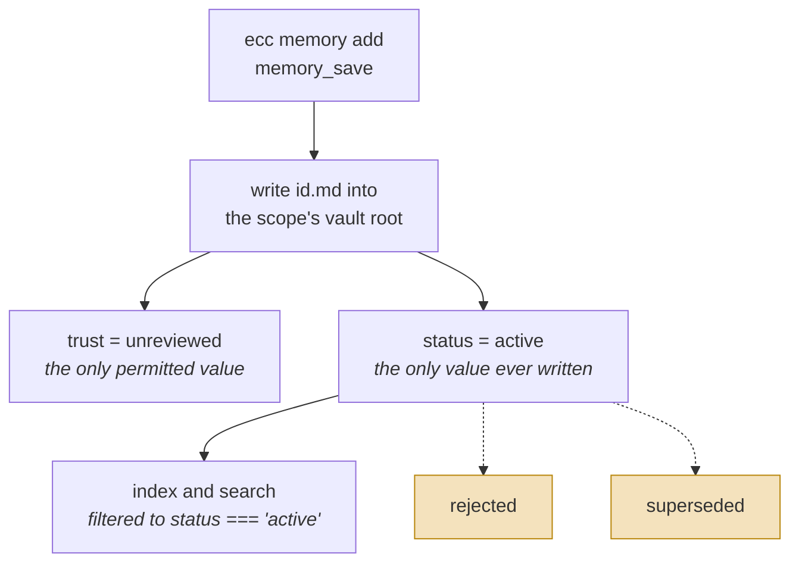
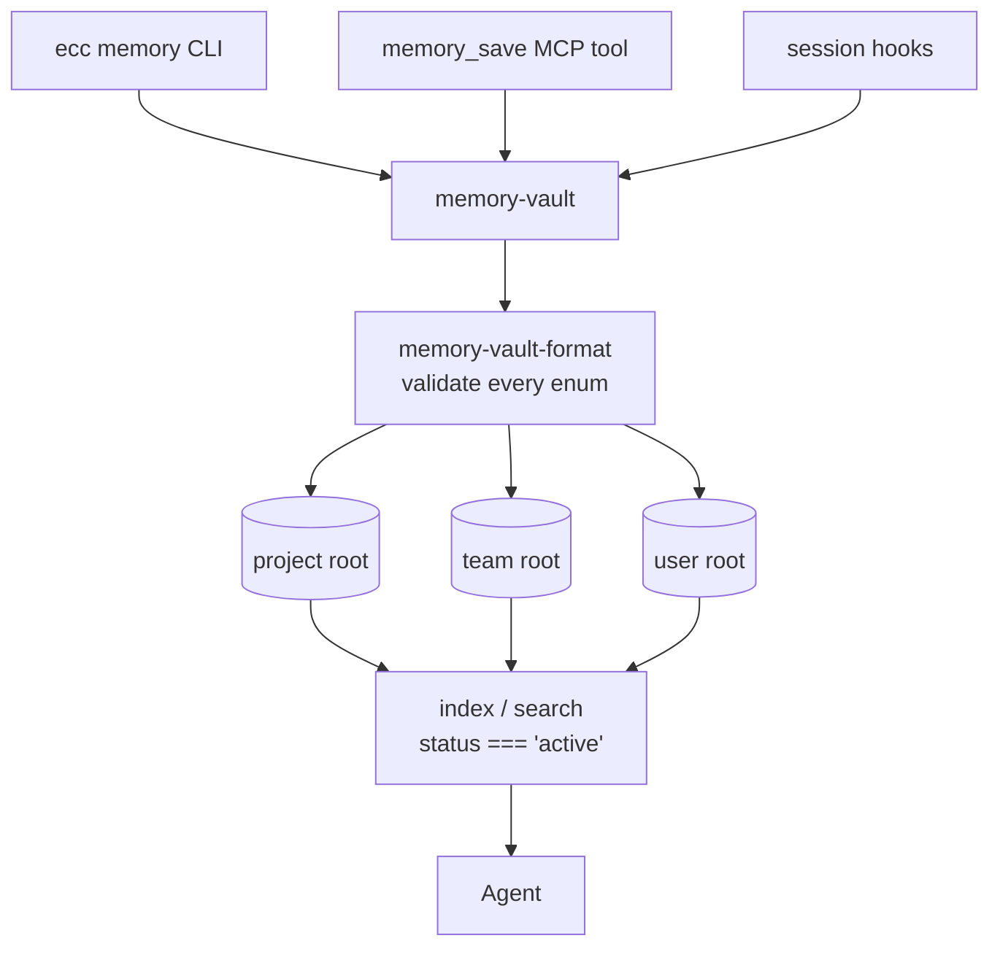

## 1. Executive Summary

ECC is a large agent-harness toolkit — skills, hooks, instincts and security
tooling for Claude Code, Codex, OpenCode and Cursor. This report covers only its
memory vault, which is a small and unusually opinionated part of it.

The opinion is in the type system. `trust` is an enum with **exactly one
member**, `unreviewed`, and the schema's own description explains why: *"Vault
memories remain unreviewed context. Governed truth is promoted into a
canonical…"* The skill documentation completes it — *"Tool-created memories are
always `trust: "unreviewed"` and writes are create-only. In the first release,
all vault entries remain unreviewed: review promotes verified knowledge into a
governed project artifact rather than changing memory frontmatter."*

That is a coherent and rare epistemic architecture: **the vault is permanently
non-authoritative, and truth lives somewhere else.** It is
[Aukora](../aukora-kernel/)'s "memory navigates, it does not authorize" expressed
as a single-valued enum rather than a runtime banner, and it is the honest answer
to a question most systems here dodge — if you cannot verify a memory, do not
ship a field that implies you did.

The finding sits directly beside it. `status` is a validated enum of
`active | rejected | superseded`, and both read paths filter it:
`memory-vault.js:602` and `:663` keep only `status === 'active'`. So the
retrieval half of a correction mechanism is implemented and working. The write
half is not — line 308 of `scripts/lib/memory-vault.js` sets `status: 'active'` on every create, and **no code
path anywhere sets `rejected` or `superseded`.** Because the vault is Markdown
with frontmatter, hand-editing a file *would* be honoured by the filter, which
makes rejection an operator gesture the tooling neither performs nor documents.

Scope has two layers. `project | team | user` are separate vault roots, each
requiring a configured boundary policy, with `assertWithinTrustedRoot` on every
read — so a traversal out of a scope is an exception rather than a leak. And on
the MCP server, the harness the server was started as filters every read: a
memory targeted at Hermes is invisible to a Claude server, and the caller cannot
name a different harness.

## 2. Mental Model

A memory is a Markdown file whose frontmatter is a validated record: `id`,
`title`, `kind`, `scope`, `trust`, `status`, `sourceHarness`, `targetHarnesses`,
`tags`, `links`, `createdAt`, `updatedAt`, `body`.

`kind` is the interesting axis — `context | decision | fact | handoff | lesson |
note | preference | runbook` — because it separates things this atlas usually
sees conflated. A decision, a lesson and a runbook have different lifetimes and
different reasons to be retrieved, and `handoff` being a first-class kind matches
[ai-memory](../ai-memory/)'s observation that an interrupted task leaves behind a
specific shape.

The state machine, as implemented:

The dotted transitions are the finding: `rejected` and `superseded` are **validated
by the schema and honoured on the read path, and set by nothing**. The vocabulary
for correction exists and no code reaches it, so the read path filters for a state
transition that never happens.

Writes are **create-only**. There is no update verb and no delete verb; a memory
is written once and read thereafter. Combined with the single-valued `trust`,
that makes the vault an append-only pile of unreviewed context — which is a
defensible thing to be, and exactly what the documentation claims it is.

## 3. Architecture

JavaScript, MIT, a very large repository of which memory is one module. The
vault itself is about 1,100 lines:

- `scripts/lib/memory-vault.js` (778) — roots, boundary assertions, create,
  index, search.
- `scripts/lib/memory-vault-format.js` (309) — frontmatter parse and validate,
  `MEMORY_TRUST_STATES`, `MEMORY_STATUSES`.
- `schemas/memory.schema.json` (129) — the published record shape.
- `scripts/memory.js` (504) and `scripts/memory-mcp.mjs` — CLI and MCP surfaces.
- `skills/unified-memory/SKILL.md` — the agent-facing instructions.
- `hooks/memory-persistence/` — lifecycle hooks.

### Deployment and ergonomics

- **What has to run:** nothing. Markdown files on disk and a Node CLI.
- **Local and offline: entirely.** No model is required to store or retrieve.
- **No API key is required.**
- **Hand-repairable: completely** — and this matters more here than usual, since
  editing frontmatter is the only way to reach two thirds of the state machine.
- `ensureProjectScopeIgnored` handles the project-scope vault's relationship with
  git, so project memories are not committed by accident.

## 4. Essential Implementation Paths

**Schema.** `schemas/memory.schema.json` — `trust` with `enum: ["unreviewed"]`
and a description stating the promotion-out-of-vault policy; `status` with
`enum: ["active","rejected","superseded"]`; `scope` with
`["project","team","user"]`; `kind` with eight values.

**Validation.** `scripts/lib/memory-vault-format.js:17-18` freezes
`MEMORY_TRUST_STATES = ['unreviewed']` and
`MEMORY_STATUSES = ['active','rejected','superseded']`; lines 185–186 run both
through `validateEnum`, so a file with an out-of-vocabulary value fails to load
rather than flowing through as an unchecked string.

**Write.** `scripts/lib/memory-vault.js:294` — the created record carries
`trust: 'unreviewed'` and `status: 'active'`. Line 319 writes `${memory.id}.md`
into the scope directory.

**Scope boundary.** `assertMemoryRootSafe(roots, scope)` (97) requires both a
configured root *and* a configured boundary policy for the scope, throwing if
either is missing. `assertWithinTrustedRoot(filePath, options.trustedRoot, …)`
runs on reads (131, 152). Scope enforced by path containment rather than by a
query predicate.

**Read filter.** `memory-vault.js:602` —
`.filter(({ memory }) => memory.status === 'active')`; `:663` —
`.filter(entry => entry.memory.status === 'active')`.

**Agent surface.** `skills/unified-memory/SKILL.md`, `scripts/memory-mcp.mjs`
(`memory_save`), `scripts/memory.js` (`ecc memory add`, `handoff`, search).

**Tests.** `tests/scripts/memory.test.js`, `memory-mcp.test.js`,
`tests/ci/unified-memory-surface.test.js`, `tests/hooks/observer-memory.test.js`.

## 5. Memory Data Model

The frontmatter is the model, and two fields carry the design.

**`trust: ['unreviewed']`** — a single-member enum, and a statement rather than a
stub: the schema description and the skill documentation both say verified
knowledge leaves the vault for a governed artifact instead of being upgraded in
place. A field that can hold one value is normally a smell; here it is a contract
that the store will never claim authority.

**`status: [active, rejected, superseded]`** — validated, filtered on read, and
written only as `active`. Two of the three values are unreachable through the CLI
and the MCP tool.

**`sourceHarness` and `targetHarnesses`** deserve a mention. A memory records
which harness produced it and which are meant to consume it, so in a toolkit
whose premise is one developer moving between four agent tools, provenance
becomes routing. On the MCP path the routing is enforced: the server's own
`ECC_MEMORY_HARNESS` is passed as `targetHarness` to search, read and the
backlink walk, and records not addressed to it or to `all` are dropped before
ranking and before the response cap.

Missing: no validity interval (not bi-temporal), no confidence, no evidence link
beyond a free `links` array, and no tombstone.

## 6. Retrieval Mechanics

An index over the vault plus lexical search, scope-selected by root and filtered
to active. No embedding model appears in the memory path read here, which is
consistent with a store meant to hold a few hundred deliberate notes rather than
a conversation history.

The status filter is well placed: it runs in **both** the index and the search
path rather than one of them, which is the mistake that usually makes a status
field decorative. The problem is upstream — nothing produces a non-active status
for it to exclude.

## 7. Write Mechanics

**Create-only, model-free and validated.** `ecc memory add` or `memory_save`
constructs a record, the format layer validates every enum, and the file lands in
the scope root. There is no extraction, no consolidation, no deduplication and no
background rewriting.

That combination — create-only plus permanently-unreviewed trust — means the
vault cannot overstate its own reliability. It also means it cannot correct
itself: a wrong `decision` memory stays active and retrievable until a human
opens the file.

### Operational cost

- **Writes are a file write.** No model, no network.
- **Lag before a memory is retrievable:** none beyond reindexing.
- **No background pass rewrites the store.**
- **On the read path** the vault bounds nothing; the caller decides what to
  inject.

## 8. Agent Integration

Three surfaces over one vault: a CLI, an MCP tool (`memory_save`), and harness
skills installed for Claude Code, Codex, OpenCode and Cursor, plus session hooks
under `hooks/memory-persistence/`.

The agent can create and read. It cannot update, delete, reject or supersede,
because those verbs do not exist — a narrower grant than any framework contract
in this atlas and, given `trust: unreviewed`, an internally consistent one. A
store that never claims authority does not need the agent to arbitrate it.

## 9. Reliability, Safety, and Trust

**The trust design is the strength, and it is a design rather than a mechanism.**
Pinning `trust` to `unreviewed` and documenting that promotion happens outside
the vault is the clearest statement in this atlas that a memory store is not a
truth store. Most systems here imply authority with a `confidence` float nothing
revises; this one declines to imply it at all. `trust_state` is nonetheless
**withheld**: a field with one possible value cannot distinguish candidate from
verified from rejected, which is what the mark requires.

**The status filter is a working read path over an unreachable state.** This is
the atlas's recurring shape and a clean instance of it. `rejected` and
`superseded` are validated by the schema, honoured by both read paths, and set by
nothing. The near-miss is genuinely near: writing `status: rejected` into a
file's frontmatter by hand works at this commit and removes that memory from
retrieval. The mechanism exists end to end except for a verb — and nothing in the
CLI, the MCP tool or the skill mentions that the file can be edited to that
effect.

**Scope is enforced on the harness, and contained on the roots.** Separate roots
per scope, a *required* boundary policy per scope, and `assertWithinTrustedRoot`
on reads make a path traversal an exception rather than a cross-scope read — a
real boundary, and a partition, which on its own is not what `scope_enforced`
counts. The mark rests on the MCP server's harness filter: a stored
`targetHarnesses` key compared on every read against an identity the server
fixes at startup and the caller cannot override. The `user` root is refused on
that server unless `ECC_MEMORY_ALLOW_USER_SCOPE=1`. The CLI applies the harness
filter only when given `--target-harness`.

**Reads fail closed when the vault walk is incomplete.** If a directory cannot
be opened or read, the walk hits the 5,000-file cap, or any file fails
validation, `readMemoryById` raises `ECC_MEMORY_INCOMPLETE` and the MCP tool
answers `MEMORY_READ_INCOMPLETE` rather than reporting a record missing that may
simply have been unreadable. The same-file identity check, which compares the
inode and device of the opened descriptor against the path, compares the device
only when both stats report one, because some Node 22 and 24 releases on
Windows leave it unset on path-based stats.

**No mutation audit.** Files are created and never updated, so the file tree is
its own history in the way a git log is — by this atlas's rule a different
mechanism, noted rather than marked.

**No human review surface**, by explicit design: review happens outside the vault
in the first release.

## 10. Tests, Evals, and Benchmarks

Memory-specific tests inside a large repository-wide suite:
`tests/scripts/memory.test.js`, `memory-mcp.test.js`,
`tests/lib/memory-vault.test.js`, `memory-schema.test.js`,
`memory-read-completeness.test.js`, `tests/ci/unified-memory-surface.test.js`,
`tests/hooks/observer-memory.test.js`, and an example evidence validator under
`examples/unified-memory/` with its own test.
The surface test is the notable one — asserting the shape of the unified memory
API is what stops four harness integrations drifting apart.

No memory benchmarks, and none would be meaningful for a lexical vault of
deliberate notes.

The negative cases are there, and they earn `negative_eval`.
`memory-vault.test.js` writes three records matching `authentication` — an
active decision, a Hermes-targeted note, and a hand-written `status: superseded`
note — and asserts search returns exactly the two active ids, then that a
Claude-targeted search returns only the decision; a backlink test asserts a
`status: rejected` follow-up is left out of a record's backlinks while the active
one is kept. `memory-mcp.test.js` saves a Hermes-only handoff from a Claude
server and asserts search returns nothing and read fails, and asserts twenty
Hermes-only backlinks are filtered before the response cap while the one Claude
backlink survives. The `status` filter is therefore pinned by tests even though
no tool can set the statuses it filters.

## 11. For Your Own Build

### Steal

- **Pin `trust` to a single value if your store cannot verify anything, and say
  so in the schema.** More honest than a confidence float nothing revises, and it
  tells every consumer exactly how much weight to give a hit.
- **Promote verified knowledge out of the vault rather than upgrading it in
  place.** Separating "things noticed" from "things decided" into different
  artifacts avoids a memory store having to arbitrate truth — and it is why this
  design can get away with create-only writes.
- **Record `sourceHarness` and `targetHarnesses`.** When one person uses four
  agent tools, provenance becomes routing, and a note that knows where it should
  be read is worth more than one that does not.
- **Enforce scope by path containment.** Separate roots plus an assertion that a
  resolved path lies inside the expected one turns a scope leak into an
  exception.
- **Validate every enum at load.** A frontmatter value outside the vocabulary
  should fail the read, not flow through as a string nobody checks.

### Avoid

- **Filtering on a status your write path cannot produce.** It reads as a
  correction mechanism in review and does nothing in practice. Either implement
  the verb or drop the values from the enum so the gap is visible.
- **Create-only as a permanent position.** Fine for a first release; it means a
  wrong `decision` memory is retrievable forever unless someone edits a file. If
  the vault is genuinely append-only, the read path needs a way to demote — which
  is what `status` was for.

### Fit

This suits a developer who moves between several agent harnesses and wants one
Markdown vault of deliberate notes all of them can read. That is a real problem
and a well-judged answer to it: the kind vocabulary, the harness routing and the
honesty about trust are all worth having, and the whole thing is files you own.

It is not a memory system in the sense most of this atlas is. Nothing is
extracted, nothing is consolidated, nothing is corrected, and the store is
explicitly not authoritative. Treat it as a shared notebook with a schema, and
expect to open a text editor when something in it turns out to be wrong.

## 12. Open Questions

- **Is anything intended to set `status: rejected`?** The enum, the validator and
  both read filters exist; the verb does not. Whether that is a planned release
  or an abandoned direction is not stated anywhere read here.
- **What is the "governed project artifact"** that verified knowledge is promoted
  into, and does anything link a vault memory to its promoted form? The
  documentation names the policy without naming the destination.
- **Does the index honour a hand-edited `status` immediately**, or is there a
  cache that would keep a rejected memory retrievable until reindex?
- **Should the CLI apply a harness filter by default?** The MCP server always
  does; the CLI does only when given a target harness.
- **What do the per-scope boundary policies look like in a real deployment**,
  particularly for team scope?

## Appendix: File Index

**Schema and validation**

- `schemas/memory.schema.json`
- `scripts/lib/memory-vault-format.js` — `MEMORY_TRUST_STATES` (17),
  `MEMORY_STATUSES` (18), `validateEnum` (185–186)

**Vault**

- `scripts/lib/memory-vault.js` — `assertMemoryRootSafe` (97),
  `ensureProjectScopeIgnored` (229), create (294), write (319),
  active filters (602, 663)

**Surfaces**

- `scripts/memory.js` — CLI
- `scripts/memory-mcp.mjs` — `memory_save`
- `skills/unified-memory/SKILL.md`
- `hooks/memory-persistence/`

**Tests**

- `tests/scripts/memory.test.js`, `tests/scripts/memory-mcp.test.js`
- `tests/ci/unified-memory-surface.test.js`
- `tests/hooks/observer-memory.test.js`

## History

**2026-09-15** — [`8321021c54d670126ce3b2969d5deb880b4b0c2a`](https://github.com/affaan-m/ECC/commit/8321021c54d670126ce3b2969d5deb880b4b0c2a) — 365 commits on, 2026-09-12; eight touch memory. Screened before reading: eight auto-run surfaces (`.claude-plugin/`, `.cursor/rules/`, `.github/copilot-instructions.md`, `.mcp.json`, `.opencode/`, `.vscode/settings.json`, `hooks/`, `hooks/hooks.json`), two build-time execution points, seven unpinned surfaces and seven dependency surfaces inside the seven-day cooldown; nothing was installed or run. `negative_eval` is added and was missed: at the previous pin `memory-vault.test.js` already asserted a superseded record and an other-harness record are absent from search beside the active ones, and `memory-mcp.test.js` already asserted Hermes-only memories are invisible to a Claude server with a visible backlink as control. `scope_enforced` stands on a corrected basis: the first reading rested it on separate vault roots, which is containment the atlas does not count alone, and left open whether `targetHarnesses` affected retrieval — on the MCP server it filters every read against a harness identity fixed at startup. Since the pin: reads raise `ECC_MEMORY_INCOMPLETE` instead of reporting a record missing when the vault walk is truncated, unreadable or finds an invalid file; the same-file identity check compares device numbers only when both stats have one (a Windows libuv workaround); the MCP server accepts the reserved `_meta` parameter; and an example evidence validator was added.

**2026-07-29** — [`591ab5cbd3f2f65860ea91c226e410b1502c8e2e`](https://github.com/affaan-m/ECC/commit/591ab5cbd3f2f65860ea91c226e410b1502c8e2e) — first reading.
