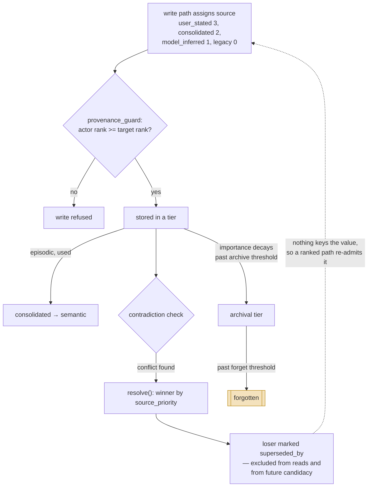

## 1. Executive Summary

Echo Agent is a **self-hostable long-running agent** with memory as a
first-class subsystem: 76,594 lines of Python in the package, 360 test files,
MIT, bilingual documentation with the Chinese README as the primary one. The
memory layer alone has eighteen modules with names that read like this atlas's
table of contents — `contradiction.py`, `forgetting.py`, `consolidator.py`,
`eligibility.py`, `reviewer.py`, `tiers.py`.

**The idea worth the whole report is `provenance_guard`.** Every memory carries
a `source` word recording *which write path created it*, ranked:

```python
_SOURCE_PRIORITY = {"user_stated": 3, "consolidated": 2, "model_inferred": 1}

def provenance_guard(actor_source: str, target: "MemoryEntry") -> bool:
    return source_priority(actor_source) >= source_priority(target.source)
```

A write is permitted only when the actor's provenance ranks at or above the
target's. **A model-inferred claim cannot overwrite or delete a fact the user
stated.** Unknown words, including `legacy` for pre-provenance rows, rank zero,
so the guard fails closed on anything it does not recognise.

The comment above it matters as much as the code: *"the writing PATH decides the
label, the model never free-chooses"*. The model cannot nominate its own output
as `user_stated`, because the label is a property of how the row arrived rather
than a field the extraction fills in. That is the
[governed write gateway](../../patterns/governed-write-gateway/) and
[evidence before belief](../../patterns/evidence-before-belief/) arriving
together, in about fifteen lines, and it is the cleanest answer in this corpus
to *whose claim wins*.

**Contradiction adjudicates rather than flags.** `ContradictionChecker.resolve`
(`echo_agent/memory/contradiction.py:171`) picks a winner and a loser using the
same `source_priority` rank, then marks the loser superseded through a
maintenance channel described in the source as unified invalidation plus audit.
The pre-filter excludes already-superseded rows from being contradiction
candidates, so a value that changed twice does not keep re-litigating its own
history. This is [resolve, don't just detect](../../patterns/resolve-not-just-detect/)
implemented, not gestured at.

**The gap is the same one the corpus keeps having.** Supersession is
**record-keyed**: `superseded_by` points at a winner and the loser drops out of
reads. Nothing keys the rejected *value*, so a later extraction that rediscovers
the losing claim writes a fresh row with a fresh id and the adjudication that
already happened is invisible to it. The provenance guard limits *who* may
overwrite; it does not stop the same wrong value returning through a path with
adequate rank.

## 2. Mental Model

A memory is a `MemoryEntry` with a **tier** and a **type** and a **provenance
word**, and those three axes do different jobs.

`MemoryTier` is `working | episodic | semantic | archival` — where a memory
lives in its lifecycle. `MemoryType` is `user | environment` — what it is about.
`source` is `user_stated | consolidated | model_inferred | legacy` — how it got
here, and it is deliberately a string rather than an enum so "future write paths
add a word for free".

The lifecycle runs on a forgetting curve. `ForgettingCurve.effective_importance`
(`echo_agent/memory/forgetting.py:47`) decays raw importance over a half-life,
with pinned memories exempt and held at their raw value. `should_archive` and
`should_forget` are separate predicates, so archival and removal are separate
thresholds rather than one cliff, and `run_decay_pass` applies them in the
background.

### How a thing becomes a belief, and how it stops being one



The diamond at the top is the design. Most systems in this atlas let any writer
overwrite any memory and then try to sort out the mess downstream; this one
refuses the write. The dashed edge is what the guard does not cover.

## 3. Architecture

A Python package with SQLite underneath and no external service required:
embeddings and reranking are both local (`local_embed.py`, `local_rerank.py`),
so the memory layer runs offline. The schema is a numbered migration list in
`echo_agent/storage/sqlite.py` — `memories`, `sessions`, `tasks`, `workflows`,
`logs`, `files`, `vectors`, then `memory_episodes` at migration 4 and
`memory_graph_nodes`/`memory_graph_edges` at 6 and 8, so the graph layer was
added to a running schema rather than designed in.

A separate `evolution/` subsystem carries its own tables — trajectories,
candidates, runs — which is the agent improving its own behaviour rather than
memory, and is out of scope for this report beyond noting it exists.

### Deployment and ergonomics

Self-hosting is the stated goal and the dependencies support it: SQLite, local
embedding, local rerank, a web UI in-repo. The cost is that the package is large
and the memory layer is not separable — adopting the memory means adopting the
agent.

## 4. Essential Implementation Paths

- **Provenance and guard:** `echo_agent/memory/types.py` — `MemoryTier`,
  `MemoryType`, `_SOURCE_PRIORITY`, `source_priority`, `provenance_guard`.
- **Contradiction:** `echo_agent/memory/contradiction.py` — `check` (`:79`),
  `_pre_filter` (`:108`), `store_contradiction` (`:150`), `resolve` (`:171`).
- **Forgetting:** `echo_agent/memory/forgetting.py` — `effective_importance`
  (`:47`), `half_life_days` (`:70`), `should_archive` (`:73`), `should_forget`
  (`:77`), `prune_lineage` (`:98`), `run_decay_pass` (`:140`).
- **Service and audit:** `echo_agent/memory/service.py` — `mark_superseded`,
  `_append_audit` (`:405`).
- **Retrieval:** `echo_agent/memory/retrieval.py` — visibility filter at
  `:126`.
- **Review:** `echo_agent/memory/reviewer.py` — `MemoryReviewer.review`
  (`:92`).

## 5. Memory Data Model

The `memories` table is deliberately thin — `id`, `type`, `key`, `data`,
`created_at`, `updated_at` — with the structured fields living in the
`MemoryEntry` dataclass and serialised into `data`. That keeps migrations cheap
and means the schema cannot enforce much: the provenance guard is application
code, not a constraint.

`key` is the identity that makes supersession work: a changed fact reuses the
key, and `_pre_filter` uses key equality plus id inequality to find the previous
version. Two memories about the same subject with different keys are not
contradictions as far as this system is concerned.

There is **no discrete trust state**. The atlas's definition wants at least
candidate versus verified versus rejected as a field, and what exists instead is
`source` — which is stronger than a confidence float and answers a different
question. `source` says *who may overwrite this*, not *how much do we believe
it*. A `user_stated` memory outranks a `model_inferred` one on write authority
whether or not either is true.

## 6. Retrieval Mechanics

Vector search over locally-computed embeddings, a local reranker, and a
**visibility filter applied before ranking**: `retrieval.py:126` filters the
candidate list through `self._visibility_fn(e, memory_scope)` rather than
post-filtering results, so a scoped read and an unscoped one do not silently
differ in how many rows a limit returns.

`memory_scope` and `episode_session_key` are both parameters on the retrieval
path. The caveat belongs beside the mark: `MemoryStore` takes a `scope_policy`
that **defaults to `"legacy"`** (`store.py:160`), so what the visibility
function enforces depends on configuration, and the default is the backward
-compatible one. The mechanism is on the read path; whether it is strict is an
operator's decision.

## 7. Write Mechanics

Three write paths, and the provenance word is how they are told apart. A memory
tool the model calls, with a constrained enum so the model's choices are
bounded. A background `MemoryReviewer` that reads the conversation and proposes
entries, labelled `model_inferred`. And sleep-time consolidation that promotes
from episodic to semantic, labelled `consolidated`.

Writes are refused, not silently downgraded, when the guard fails —
`reviewer.py` has a `_map_reject` that turns a refusal into a message naming the
target and the operation, so a rejected write is visible rather than lost.

**Background passes rewrite the store.** The decay pass changes effective
importance and moves entries between tiers; consolidation promotes and distils;
the contradiction pass supersedes. `prune_lineage` exists to stop supersession
chains growing without bound.

## 8. Agent Integration

This is an agent, not a library with an agent binding, so the integration story
is inward: the memory service is consumed by the agent pipeline, a skills
directory, and a web UI in-repo. There is no MCP server and no documented HTTP
memory API, so using this memory from another harness means importing the Python
package and accepting the rest of the agent alongside it.

## 9. Reliability, Safety, and Trust

**The audit trail is append-only JSONL with rotation.** `_append_audit`
(`service.py:405`) records op, entry id, memory type, source, reason and an `ok`
flag — and it is called on both the success and the failure path (`:390`,
`:402`), so a *refused* write is recorded as well as a completed one. Most audit
implementations in this corpus log what happened; this one also logs what was
prevented, which is the half that tells you the guard is working.

**Contradiction resolution is idempotent and defensive.** `resolve` treats a
missing or already-superseded loser as done rather than erroring, with a comment
explaining that the alternative is a permanently stuck row. The supersession
write goes through the service maintenance channel for unified invalidation and
audit, with a direct `UPDATE memories SET superseded_by = ?` as the fallback.

**The reviewer is an LLM, not a person.** `MemoryReviewer.__init__` takes a
`provider: LLMProvider`, and `review()` reads a conversation and executes memory
operations. This is why the human-review mark is withheld: there is no surface
where a person inspects or approves. The provenance guard is what stands in for
human authority, and it does so structurally — a reviewer write is
`model_inferred` and therefore cannot touch anything the user stated.

**Correction is record-keyed.** `superseded_by` hides the loser. No rejected-
value record exists, so the guard's protection is asymmetric: it stops a
low-ranked path from *overwriting* a high-ranked memory, and does nothing to
stop a high-ranked path from re-writing a value that was already adjudicated
wrong. A user who restates a claim they previously corrected gets it stored at
priority 3.

## 10. Tests, Evals, and Benchmarks

360 test files against 76,594 lines of package source, and the memory modules
have dedicated suites. I did not run them.

**No committed case asserts that particular material must not be retrieved.**
Searching for negative-assertion vocabulary returned only generic
`not in result`-style checks in unrelated suites — which, given how much of this
design is about *refusing* writes and *excluding* superseded rows, is the gap
worth naming: the guard and the pre-filter are both properties a negative
assertion expresses naturally, and neither has one.

No benchmark harness and no committed retrieval numbers.

## 11. For Your Own Build

### Steal

- **`provenance_guard`, verbatim.** Fifteen lines: rank your write paths, refuse
  a write whose actor ranks below its target, and make unknown sources rank
  zero so the guard fails closed.
- **The label belongs to the path, not the payload.** "The writing PATH decides
  the label, the model never free-chooses" is the sentence that makes the guard
  trustworthy; a model that can label its own output `user_stated` has no guard
  at all.
- **Audit the refusals.** Logging the blocked write beside the completed one is
  what turns a guard into something you can verify is running.
- **Separate `should_archive` from `should_forget`.** Two thresholds rather than
  one cliff, so decay has a reversible stage.

### Avoid

- **Assuming the guard covers correction.** It governs authority, not truth. A
  wrong `user_stated` fact outranks everything and can be re-asserted freely.
- **Shipping `scope_policy: "legacy"`** without deciding what your policy should
  be. The filter runs either way; the default is the permissive one.

### Fit

This suits someone **adopting the whole agent**, not someone shopping for a
memory library — the memory layer is eighteen modules deep inside a 76,000-line
package with no MCP or HTTP surface of its own. Read it if you want the single
best worked example in this atlas of *provenance as write authority*, which is
portable as an idea even where the code is not.

Poor fit if you need correction that survives re-assertion, or if you cannot
read Chinese comments — the primary documentation and many of the load-bearing
inline comments are Chinese, and the most important ones (the write guard, the
supersession channel) are among them.

## 12. Open Questions

- **What happens when a user restates a claim they previously corrected?** It
  arrives as `user_stated`, outranks everything, and no record of the earlier
  adjudication is consulted. No test covers the sequence.
- **How often does the guard actually refuse?** The refusal is audited, so an
  install could answer this, and no aggregate is published.
- **What does `scope_policy` do in each mode?** The default is `legacy` and the
  strict modes were not traced.
- **Does `prune_lineage` lose adjudication history?** Supersession chains are
  pruned to bound growth; what that removes, and whether anything depended on
  it, was not established.

## Appendix: File Index

**Storage and schema**
- `echo_agent/storage/sqlite.py` — numbered migrations for every table
- `echo_agent/memory/store.py` — the store and its scope policy

**Epistemics and governance**
- `echo_agent/memory/types.py` — tiers, types, provenance ranks, the write guard
- `echo_agent/memory/contradiction.py` — detection, pre-filter, adjudication
- `echo_agent/memory/eligibility.py` — what may be written at all

**Lifecycle**
- `echo_agent/memory/forgetting.py` — the curve, archive and forget thresholds
- `echo_agent/memory/consolidator.py`, `tiers.py` — promotion between tiers
- `echo_agent/memory/reflection.py`, `prefetch.py`

**Retrieval**
- `echo_agent/memory/retrieval.py` — visibility filter then ranking
- `echo_agent/memory/vectors.py`, `local_embed.py`, `local_rerank.py`

**Service and audit**
- `echo_agent/memory/service.py` — `mark_superseded`, `_append_audit`
- `echo_agent/memory/reviewer.py` — the LLM reviewer and its rejection mapping

**Tests**
- `tests/` — 360 files

## History

**2026-08-04** — [`29a19f4dd86ae2aeabab97df2b9bea3ae718460e`](https://github.com/fuyuxiang/echo-agent/commit/29a19f4dd86ae2aeabab97df2b9bea3ae718460e) — first reading.
