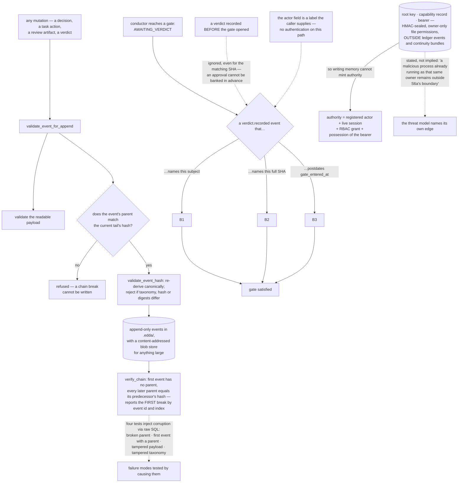

## 1. Executive Summary

Edda is "a local, tamper-evident ledger for coding agents: decisions that survive
sessions, and coordination that survives agents" — MIT or Apache-2.0, Rust,
version 0.6.2, 213,521 lines across a dozen crates with 3,518 test functions, on
crates.io, working with Claude Code, Cursor, Codex, OpenClaw and any MCP client.

It names the two failures it exists for precisely. "The session dies, and the
decisions die with it" — one session settles on SQLite, the next one
proposes Postgres again, "[t]he reasoning died with the transcript, and
compaction can't bring it back." And "[t]he agent dies, and the work state dies
with it" — one of three parallel sessions crashes mid-task and you reconstruct by
hand what it had finished. Both get the same primitive: append-only state in
`.edda/` that outlives any session, agent or tool.

**The chain is enforced on append, not just verified afterwards.** Every insert
runs `validate_event_for_append`: validate the payload, read the current tail's
hash, refuse the event if its parent does not match, then re-derive the event
canonically and reject it if its taxonomy, hash or digests differ from what the
content implies. A broken chain cannot be written. `verify_chain` then walks the
whole log — first event must have no parent, every later parent must equal its
predecessor's hash — and reports "the first break found" with the event id and
index.

The tests do the part that makes this checkable rather than claimed. Four inject
real corruption through raw SQL against a live store and assert detection: a
broken parent hash, a first event that has a parent, a tampered payload, and a
tampered taxonomy. A hash chain whose failure modes are tested by breaking it is
a different artifact from one that is only computed.

**Capability material is deliberately not in the ledger.** The authority module
opens with its threat model, and it is the right one for a memory system:

> "Threat model: issue text, manifests, events, environment values, and
> portable/imported bytes are untrusted. Authority requires a registered actor, a
> live registered session at issuance/use, an explicit RBAC grant, and possession
> of this local HMAC-sealed capability's private bearer. The root key, capability
> record, and bearer are outside ledger events and continuity bundles."

Because the bearer lives outside the events, an agent that can write memory
cannot write itself authority — the same separation [Anda DB](../anda-db/) states
as "[c]ognitive content may describe authority. Only this plane can grant it."
Edda adds file-permission enforcement before any secret byte moves, a
fail-closed Windows path "until a reviewed safe owner-only storage abstraction is
available", and — the mark of a real threat model — the thing it does not cover:
"[a] malicious process already running as that same owner remains outside S6a's
boundary".

**An approval cannot be banked before the gate opens.** A verdict binds three
ways. To the subject and to the full commit SHA — "a verdict recorded for one SHA
remains findable but never matches a query for another SHA" — and to time:

> "a verdict only satisfies a gate if it postdates the gate's `gate_entered_at`.
> Approving a subject BEFORE its gate opens (a pre-recorded verdict) therefore
> does not work — the gate ignores any verdict recorded before it entered
> `AWAITING_VERDICT`, even for the matching SHA."

Pre-recording approvals is exactly what an agent with a shell would do to get
past a gate it expects to meet, and the freshness rule closes it. Subject, commit
and window: three bindings, and the conductor prints the exact command to run so
the human step is one paste rather than a lookup.

What the gate does not have is an identity. `edda verdict approve|reject` records
an `actor` string the caller supplies, with no authentication on that path and no
requirement to hold the sealed capability the authority module went to such
lengths over. So the gate blocks the conductor until something outside it
responds, and what responded is self-asserted — which is why this report claims
the audit-log mark and not a human-review one. The binding and freshness halves
are the best in this corpus; the identity half is not there.

Two smaller notes. Blob tombstones are keyed on the content hash and carry the
deletion reason, the last known class and whether it was pinned — but their only
reader is `edda blob tombstones`, an inspection command, so they are a record of
what was deleted rather than a rule consulted when the same bytes return. And
nothing in the ledger is epistemic: no status, confidence or provenance class, so
a decision and the later one reversing it are two events whose only
relation is order.

The other half of the product is `edda review`: run a *second* provider over the
committed branch — "after authoring with Claude Code, use pi with an OpenAI
reviewer" — and record the reviewed SHA, the reviewer session, the observed
model, the findings, and "measured or unmeasured cost". That last distinction is
the kind this atlas looks for: a cost field that admits when it was not measured
beats one that guesses.

## 2. Mental Model

An **event** is the unit, and it knows its own hash and its parent's.

A **verdict** is about one subject, at one commit, after one moment.

**Authority** is not something the ledger can contain.

A **tombstone** says what left and why, and is read by a person.

## 3. Architecture

| Crate | Role |
| --- | --- |
| `edda-cli` | The commands, including review, verdict, gc and blob (80,675 lines) |
| `edda-ledger` | Events, the chain, tombstones, verdicts, control authority (22,560) |
| `edda-conductor` | Phases, gates, and coordination across parallel agents (22,736) |
| `edda-bridge-claude` | The harness bridge (33,629) |
| `edda-core` | Event types, policy, guided execution (11,411) |
| `edda-serve`, `edda-ask`, `edda-search-fts`, `edda-postmortem` | Serving, asking, search, postmortems |

## 4. Essential Implementation Paths

`crates/edda-ledger/src/sqlite_store/events.rs:16-49` — the append-time check.

`crates/edda-ledger/src/sqlite_store/events.rs:951-993` — the after-the-fact
walk, and what it reports.

`crates/edda-ledger/src/control_authority.rs:1-14` — a threat model that names
its own edge.

`crates/edda-cli/src/cmd_verdict.rs:1-15` — three bindings on an approval.

## 5. Memory Data Model

An event with a family, a level, a payload, digests, its hash and its parent's.
Decisions, tasks, verdicts and review artifacts are event kinds rather than
tables, so the ledger is the state and the projections are folds over it. Large
payloads go to a content-addressed blob store with a class and a pin flag, and a
size threshold decides which.

## 6. Retrieval Mechanics

Full-text search over the ledger plus projections. Retrieval is not where this
system's thinking went; durability and coordination are.

## 7. Write Mechanics

One path, checked before it lands. The payload validation includes secret
redaction on the `verdict.recorded` write path, which is the right place for it —
a verdict quotes findings, and findings quote code.

## 8. Agent Integration

A CLI and MCP surface across four harnesses, plus a conductor for parallel
sessions and a second-provider review flow. The review command records what it
measured and marks what it did not, and `--spec` and declared `--gate` evidence
qualify the verdict rather than decorating it.

## 9. Reliability, Safety, and Trust

Covered above. The summary a reader needs: the integrity of the log is strong and
tested; the identity of whoever approves is not established; and the ledger holds
no epistemic state, so "which of these two decisions is current" is a question
the reader answers from order alone.

## 10. Tests, Evals, and Benchmarks

3,518 test functions, including the four fault-injection tests on the chain.
Nothing was built or run for this reading.

## 11. For Your Own Build

Check the chain when you append, not only when you audit. Reading the tail and
refusing a mismatched parent costs one query and turns a detectable corruption
into an impossible one.

Break your own chain in a test. Four tests that corrupt a payload, a parent, a
taxonomy and a first event through raw SQL are what separate a hash chain from a
hash column.

Keep the capability outside the log. If authority material can be written by the
thing that writes memory, then memory is an authority-granting surface, whatever
the policy says.

Bind an approval to a subject, a content hash *and* a moment. Two of the three
lets an agent pre-record the approval it knows it will need.

And when you record a cost, record whether you measured it. "Measured or
unmeasured" is one extra field and the difference between a number and a guess.

## 12. Open Questions

Whether a verdict's actor can be established. The authority module has the
machinery — registered actors, sessions, RBAC, a sealed bearer — and the verdict
path does not use it.

Whether anything consults a blob tombstone on write. The record is keyed on the
content hash, which is what such a check would need, and only an inspection
command reads it.

How a contradicted decision is found. Events are ordered and nothing relates one
decision to the one it reverses.

## Appendix: File Index

| Path | What to read it for |
| --- | --- |
| `crates/edda-ledger/src/sqlite_store/events.rs:16-49` | A chain break that cannot be written |
| `crates/edda-ledger/src/sqlite_store/tests.rs:1575-1890` | Four ways to corrupt it, all asserted |
| `crates/edda-ledger/src/control_authority.rs:1-14` | What is untrusted, and what is not covered |
| `crates/edda-cli/src/cmd_verdict.rs:1-15` | Subject, SHA, and the freshness rule |
| `crates/edda-ledger/src/tombstone.rs:6-41` | A deletion record, and its one reader |

## History

**2026-09-16** — [`ce8b98e0b41b832da71b46a6d87289184a158f6a`](https://github.com/fagemx/edda/commit/ce8b98e0b41b832da71b46a6d87289184a158f6a) — first reading, at a commit dated 16 September 2026. Screened before opening, from a shallow clone: forty-three files scanned, no auto-run surfaces, two build-time execution points, two unpinned surfaces and thirty-two dependency files inside the seven-day cooldown. Nothing was installed, built or run.
