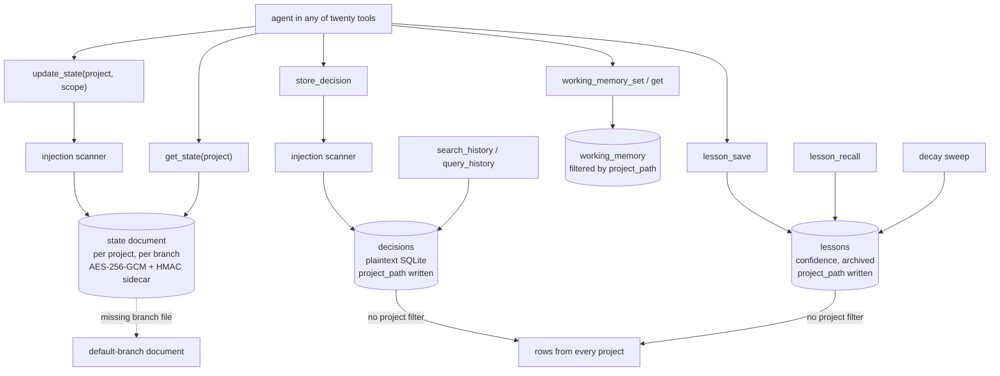

## 1. Executive Summary

EGC (Extended Global Context) is a local runtime for AI coding tools, published
as `@egchq/egc` version 1.1.21, Apache-2.0, with 1,124 commits since 6 May 2026
and 272 test files. `egc install` detects the coding tools on a machine (the
README lists twenty, Cursor, Claude Code, Codex, Copilot and Aider among them)
and registers two MCP servers in each. It writes a memory protocol into their
instruction files and installs four faculties:

- **Memory** — the `egc-memory` MCP server, about 5,500 lines of TypeScript
- **Guardian** — a command and write guard
- **Token Crusher** — an output filter
- **Session Mesh** — a bus that lets open sessions see and message each other

The repository also ships a large library of skills, agents and commands.

The README promises that memory "lives in `~/.egc`, encrypted with AES-256-GCM,
kept per project and branch". That is true of one of the memory server's
stores. **State documents** — a project's context, decisions, things to avoid,
preferences and next steps — are Markdown files per project and per git branch,
encrypted, with an HMAC sidecar for tamper warnings and a read that falls back
to the default branch. They are well built.

**Decisions and lessons** live elsewhere: one plaintext SQLite database for the
whole machine. Each row records the project it was written from, through
migrations whose comments say "for per-project scoping", and no read uses it.
`query_history`, `search_history` and `lesson_recall` return rows from every
project. Lessons are also the one free-text write path the injection scanner
does not cover.

No marks.

## 2. Mental Model

An agent in any installed tool sees one memory server with three kinds of
memory:

- **Project state** — the document `get_state` returns at session start and
  `update_state` merges into at the end, per branch.
- **History** — decisions stored one at a time and searched with BM25, and
  lessons with a confidence that rises when reinforced and decays when unused.
- **Working memory** — short-lived keys per project with a TTL, 24 hours by
  default.

Beside memory sits the **session bus**: sessions announce themselves, claim
paths, send events and wait for replies, stored in the same SQLite file.

## 3. Architecture

| Component | Location |
| --- | --- |
| Memory server | `mcp/servers/egc-memory/src/index.ts` (tools, migrations, handlers), `search.ts` (FTS5), `branch-state.ts`, `encryption.ts`, `integrity.ts`, `sanitize.ts`, `working-memory.ts`, `compress.ts`, `patterns.ts`, `propagate.ts`, `session-bus.ts`, `mesh-transport.ts`, `sync/` |
| Guardian | `mcp/servers/egc-guardian/` with a prompt-injection scanner the memory sanitizer mirrors |
| CLI and installer | `scripts/egc.js`, `scripts/install-*.js`, per-tool hook writers in `scripts/lib/` |
| CLI state store | `scripts/lib/state-store/` at `~/.egc/egc/state.db`, holding telemetry and its own lesson queries |
| Dashboard | `dashboard/`, a local server for replay and cost summaries |
| Content | `skills/`, `agents/`, `commands/`, `rules/`, `translations/` |

### Deployment and ergonomics

- **Install:** `npm install -g @egchq/egc && egc install`; the installer writes
  MCP configuration, hooks and instruction files into each detected tool.
- **Storage:** everything under `~/.egc`, with an encryption key and an integrity
  key at mode 0600.
- **Two databases.** The memory server opens `~/.egc/memory/state.db` and the
  CLI opens `~/.egc/egc/state.db`; a comment calls this a known divergence
  (`index.ts:459-463`) and `doctor` warns when they differ.
- **Hand-repairable:** the SQLite store yes; the state documents only through the
  server, since they are encrypted.

The screen of this checkout found seven auto-run surfaces (Cursor rules,
`.githooks/`, Copilot instructions, `.mcp.json`, `.opencode/`, `hooks/` and its
manifest), three build-time execution points, six unpinned surfaces and sixteen
dependency files inside the seven-day cooldown, and read `AGENTS.md`,
`CLAUDE.md` and `GEMINI.md` as data. Nothing was installed, built or run.

## 4. Essential Implementation Paths

- **Database** — `index.ts:466-500`: one file under `~/.egc/memory`, WAL,
  migrations under a PID-checked lock (`:328-430`).
- **State read** — `handleGetState` (`index.ts:1335-1370`): detect the branch,
  resolve the branch file or the default-branch fallback, decrypt, verify the
  HMAC and warn on mismatch.
- **State write** — `handleUpdateState` with `withStateMergeLock`
  (`index.ts:310-326`): read, merge, encrypt, write; an undecryptable file aborts
  the write unless `force` quarantines it.
- **Decisions** — `index.ts:1874-1898`: sanitize, insert with
  `resolveProjectPath()`, then `SELECT * FROM decisions ORDER BY timestamp DESC`
  for `query_history` and `searchDecisions` (`search.ts:166-192`) for
  `search_history`.
- **Lessons** — `handleLessonSave` (`index.ts:1196-1223`),
  `handleLessonRecall` (`:1225-1263`, through `searchLessons`,
  `search.ts:128-164`), `handleLessonReinforce` (`:1265-1282`),
  `runLessonDecaySweep` (`:771-785`).
- **Working memory** — `working-memory.ts:73` and `:85`, both filtered by
  `project_path`.

## 5. Memory Data Model

**State documents** are Markdown with a header naming the project, stored at a
path derived from a project slug and a hashed branch name, encrypted with a
random IV and an `EGC1:` magic prefix, and paired with an HMAC-SHA256 sidecar.
`update_state` accepts `scope: global` for a machine-wide document.

**Decisions** (`index.ts:339`, `:407`): `id`, `context`, `decision`,
`timestamp`, `project_path`. Nothing updates or deletes them.

**Lessons** (`index.ts:366-376`, `:400`, `:429`): `id`, `content`, `context`,
`confidence` (0.7 by default), `last_reinforced`, `last_recalled`,
`created_at`, `tags`, `archived`, `project_path`, `author`. Reinforcing adds
0.15 and unarchives. The sweep removes 0.05 per week after 30 days without
recall and archives below 0.2. Confidence is a weight and `archived` a
lifecycle flag, so `trust_state` is withheld.

**The producer test on `project_path`.** Both tables gained the column in
migrations 6 and 7. `store_decision` and `lesson_save` write it
(`index.ts:1884`, `:1216-1218`). Across the server, the column is read only by
the working-memory and session-bus queries. No decision or lesson read has a
`WHERE project_path`, so `scope_enforced` is withheld. State documents are
separate files per project, a partition rather than a predicate.

There is no validity axis, no rejection record and no mutation log in the
memory server, so `bitemporal`, `tombstone` and `audit_log` are withheld.

## 6. Retrieval Mechanics

**Session start** reads the state document for the current branch. A branch
without its own file reads the default branch's, so a feature branch starts
from main's context.

**Decision search** sanitises the query into an FTS5 match, ranks by BM25 and
normalises scores to [0, 1] against the best hit (`search.ts:166-192`).
`query_history` pages through all decisions by time.

**Lesson recall** matches FTS5 over content, context and tags, keeps rows with
`archived = 0` and confidence above the minimum, and stamps `last_recalled`. The
substring fallback does the same over the top rows by confidence
(`index.ts:1238-1249`).

**Every project, every time.** None of these three reads is given the project.
An agent in one repository asking what was decided about authentication
receives decisions from every repository on the machine, in BM25 order, and the search result carries no field naming the project (`searchDecisions` selects id, content, context, date and score); `query_history` returns the column but does not filter on it. Lessons are the same. The
README's promise that "what one agent learns, every agent knows" holds across
tools. It also holds across projects, which the migrations meant to prevent.

## 7. Write Mechanics

**Sanitisation.** `sanitize.ts` scans free text for prompt-override and command-injection patterns, mirroring the Guardian
scanner, because what passes "is later written into the instruction files every
AI tool loads as trusted context". It is applied to `update_state`,
`store_decision` and `working_memory_set`. `handleLessonSave` parses the schema
and inserts without calling it (`index.ts:1196-1219`). A lesson is returned
verbatim by `lesson_recall`, so an injection phrase refused as a decision is
accepted as a lesson.

**Dedup.** A lesson identical in content and context to a live one reinforces
it instead of inserting.

**Arbitration.** SQLite writes go through a single in-process queue; state merges
take a file lock so two server processes cannot drop each other's merge.

**Observations and patterns.** Hooks record runtime events;
`compress_observations` turns recent raw observations into typed summaries by
rule without deleting them, and `detect_patterns` counts repeated commands and
error signatures.

## 8. Agent Integration

- **24 memory tools:** project state, decisions, the session bus
  (announce, claim and release paths, peers, send, events, wait), working memory,
  lessons, patterns, compression, and team init, sync and status.
- **Instruction files** in each tool carry a memory protocol telling the agent
  when to read and update state.
- **Team sync** pushes and pulls through a git remote with a shared team key,
  merging only files that verify as team envelopes for their path.
- **Session mesh** lets parallel sessions claim files and hand work over.

## 9. Reliability, Safety, and Trust

**The encrypted path is careful.** Keys are read fresh per call because a
frozen `$HOME` once encrypted a file under one key and read it under another;
an undecryptable file aborts a write rather than being overwritten; `force`
renames it to a timestamped backup; HMAC mismatches warn without blocking.

**The plaintext path undercuts the promise.** Decisions and lessons are the
parts of memory most likely to hold a project's specifics, and they sit
unencrypted in one file that every project reads.

**Isolation between projects** exists for state documents and working memory
and is missing for history, as above. On a machine with client and personal
work in separate repositories, recall mixes them.

**Human review.** The dashboard shows counts of decisions, lessons and patterns,
replays and costs, and has no view that edits or removes memory; there is no
CLI command for memory rows. `human_review` is withheld.

## 10. Tests, Evals, and Benchmarks

272 test files cover the installer across tools, encryption and integrity,
branch resolution, the session bus under chaos, mesh transport, team sync,
hooks and the Guardian. None was run for this report.

`tests/lib/lessons-decay.test.js:160` asserts that `listLessons` excludes an
archived lesson while returning an active one. `listLessons` belongs to the CLI
state store in `scripts/lib/state-store/queries/lessons.js`, and nothing in the
tree calls it outside the store's own export; the MCP `lesson_recall` path has
no equivalent test. No test asserts that one project's decisions or lessons stay
out of another's recall. `negative_eval` is withheld.

No retrieval benchmark is committed.

## 11. For Your Own Build

### Steal

- **Branch-aware project state** with a default-branch fallback, so a new branch
  inherits context and diverges from there.
- **Encryption with explicit failure modes:** abort on undecryptable, quarantine
  only when asked, warn on HMAC mismatch.
- **One injection scanner shared by the command guard and the memory writer.**

### Avoid

- **A scope column written and never read.** Add the predicate in the same change
  as the migration, with a test from a second project.
- **Two storage tiers with different privacy properties behind one promise.**
- **A sanitizer applied per handler** instead of at the write layer, where a new
  tool cannot skip it.

### Fit

EGC suits a developer who works in several AI coding tools at once and wants
them to share project state and coordinate edits, and who values the guard and
output filter as much as memory. For decisions and lessons that must stay within
their project, or stay encrypted, the history tables need scoping and the same
at-rest protection as the state documents first.

## 12. Open Questions

- **Should `search_history`, `query_history` and `lesson_recall` filter on
  `project_path` by default,** with an explicit cross-project option?
- **Will the SQLite store move under the same encryption** as the state
  documents?
- **Will the two state databases be merged,** as the divergence note suggests?

## Appendix: File Index

- `mcp/servers/egc-memory/src/index.ts`, `search.ts`, `working-memory.ts`, `sanitize.ts`, `encryption.ts`, `integrity.ts`, `branch-state.ts`, `sync/TeamSync.ts`
- `scripts/lib/state-store/`, `scripts/egc.js`, `dashboard/server.js`
- `tests/egc-memory-*.test.js`, `tests/lib/lessons-decay.test.js`
- `README.md`

**Searches behind the absence claims**

- `grep -rn "project_path" mcp/servers/egc-memory/src` — written for decisions and lessons, read only in `working-memory.ts` and `session-bus.ts`
- `grep -n "sanitize" mcp/servers/egc-memory/src/index.ts` — `update_state`, `store_decision`, `working_memory_set`; not `handleLessonSave`
- `grep -rn "listLessons" scripts` — exported by the state store, no caller
- `grep -n "DELETE\|UPDATE" dashboard/ops.js` — none

## History

**2026-09-15** — [`f24f53c2ca1ce2bb1f5120f20dff2b98780f90ee`](https://github.com/Fmarzochi/EGC/commit/f24f53c2ca1ce2bb1f5120f20dff2b98780f90ee) — first reading, at a commit dated 14 September 2026. Screened before opening: seven auto-run surfaces, three build-time execution points, six unpinned surfaces, sixteen dependency files inside the cooldown, and three agent-instruction files read as data. Nothing was installed, built or run.
