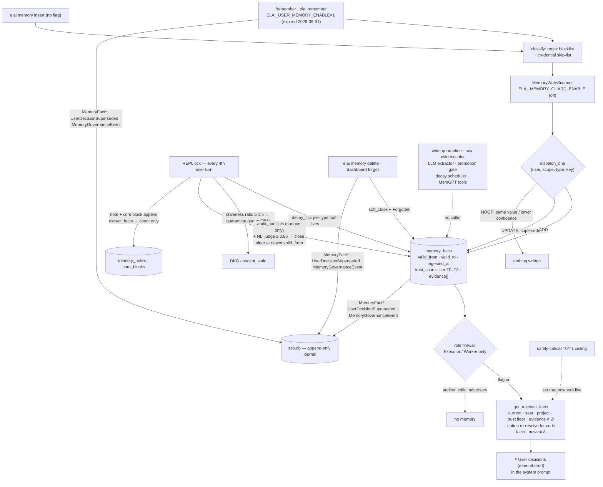

## 1. Executive Summary

ELAI is an **abandoned agent harness** published as a research archive on
5 September 2026: a Rust workspace of twenty-four crates — orchestrator,
reasoning engine, code-retrieval graph, sandboxing, a Svelte and Tauri
dashboard, a REPL — beside a Python inference sidecar and a 659-entry plan
catalogue. MIT, 889 commits between 5 April and 6 September 2026 under
one normalised author, *ELAI contributors*, because the maintainer
rewrote the history for privacy before publishing: identities and
trailers removed, source bytes sanitised, every hash changed, 433 of
6,889 historical paths omitted. The README opens with a warning that
this is not a working product and that no claim in it has been
revalidated; the postmortem's lesson is *"build software you want to use
that solves your problems, not all the problems you know about."*
2,221 Rust files and 936,482 lines under `.elai_cc/crates`, the largest
of them a 25,612-line task runner and a 22,384-line journal payload
enum.

Its memory is `crates/memory`, 10,933 lines of Rust with 1,148 lines of
integration tests, written between 20 May and 12 August 2026 as plan
E-5 and extended by plans C-48, E-1, F-5, F-12, H-31, H-32, H-33, I-13,
J-21, J-59 and J-93. The centre is one SQLite table, `memory_facts`
(`store.rs:22-51`): a fact is a typed key–value pair with an extractor
confidence, a `trust_score` that decays exponentially at a per-type
rate, a bi-temporal `valid_from`/`valid_to`/`ingested_at` triple, a
non-empty list of evidence pointers enforced at insert
(`fact.rs:240-244`), a `superseded_by` link, a provenance tier T0–T3 and
a last-validated stamp. Around it: a regex blocklist and credential
skip-list that run before any write (`defense.rs`), an
ADD/UPDATE/DELETE/NOOP dispatcher keyed on `(user, scope, type, key)`
(`mem0_dispatcher.rs:151-222`), a tier-driven and NLI-judged
contradiction pass, a staleness quarantine that broadcasts to the code
graph, a citation validator that re-resolves a code-grounded fact's
symbol before injection and excludes it when the index is missing, and
a compile-time role firewall (`user_memory_firewall.rs:50-103`) under
which only the executor and worker roles ever receive a fact — an
auditor, critic or adversary gets none, and a new role variant fails
the build until someone decides.

**What reaches a prompt is narrower than the crate.** Facts are written
on exactly two live paths. `/remember <text>` and `elai remember`
(`user_memory_capture.rs`) run the guards, build one `Preference` fact
at trust 1.0 with T0 provenance, and call `dispatch_one` — its only
production caller (`:274`) — but only when
`ELAI_USER_MEMORY_ENABLE=1`, a flag registered as an experiment with an
expiry of 1 September 2026 (`wire-dark-allowlist.toml:163-168`), four
days before the archive was created. `elai memory insert`
(`memory_cmd.rs:255-326`) writes a T0 fact through the same guards with
no flag at all. Everything else is declared and reaches nothing: the
reflection that runs every fourth user turn extracts fact candidates
and returns their count without storing one (`chat_memory_reflect.rs:129-132`);
the LLM-backed extractor, the project-to-global promotion gate and the
adjudication drawer were deferred on 23 May 2026 and never landed; the
tokio decay scheduler has no caller; the safety-critical tier ceiling
that the prompt-injection test defends is set by no code outside tests;
the write quarantine is an in-memory vector nobody constructs; the
raw-evidence tier is built empty on each read; and the two MemGPT tools
are schema definitions registered nowhere.

Four marks: `scope_enforced`, `bitemporal`, `audit_log`,
`negative_eval`. `trust_state`, `tombstone` and `human_review` withheld,
each for a stated reason in section 9. No paper of its own; the crate
cites fourteen.

## 2. Mental Model

A memory is a fact a person stated or a heuristic matched: eight types
— voice style, expertise, risk tolerance, opinion, preference, domain
knowledge, session pattern, mistake — each with a stable key and a JSON
value. It becomes one by passing two gates (a regex blocklist for
shell-shaped payloads and a skip-list for credentials, then an optional
scan for invisible Unicode and confusable command names) and one
decision by the dispatcher: no current row for the key is ADD; a
current row with a different value and no lower confidence is UPDATE,
which closes the old row and links it; the same value or a lower
confidence is NOOP; a `{"tombstone": true}` candidate is DELETE, which
closes without replacement. Trust starts where the writer sets it — 1.0
for a typed `/remember` — and falls exponentially from the last time
the fact was read, at a rate the type fixes: a mistake halves in 138
days, a session pattern in 69, a preference in 1.9 years, an opinion or
risk tolerance in 3.8, voice and expertise in 19 (`decay.rs:29-40`).
Reading a fact resets its clock (`retrieval.rs:253-260`).

It stops being believed four ways. It falls below its type's retrieval
floor — 0.7 for an opinion, 0.4 for a mistake, 0.5 for the rest
(`fact.rs:81-92`) — and is skipped, not closed. It is superseded: by a
same-key write, by a same-key row of a strictly higher tier when the
audit runs with that option, or by a cross-key row a deterministic
lexical judge calls a contradiction at 0.85 confidence, in which case
the older row closes at the newer row's start time
(`semantic_contradiction.rs:379-391`). It is forgotten — `elai memory
delete`, the dashboard button — which closes it and journals a
`Forgotten` event. Or, for a code-grounded fact, its cited symbol no
longer resolves in the code graph, and it is excluded at read and
reported; when the index is missing every such fact is excluded, because
the design treats absent evidence as failure. A closed row stays
forever and is listed under `superseded`; nothing consults it when the
same key arrives again.

Whether a fact reaches a prompt is decided before any query. The role
assembling the prompt must be the executor (agent dispatch) or the
worker (consensus pass) — the match is exhaustive and has no wildcard —
and the capture flag must be on. Then the eight newest-observed facts of
the preference class are listed under *# User decisions (remembered)*
with the instruction *"Honour them; do not re-ask,"* and domain
knowledge and mistakes follow only if their citations still resolve.



## 3. Architecture

The archive keeps the code under `.elai_cc/`: a Cargo workspace at
version `0.1.0` with crates `agent`, `arch_gate`, `cli`, `contracts`,
`core`, `dashboard-v2`, `eval-corpus`, `ipc-types`, `knowledge`,
`memory`, `orchestrator`, `plugins`, `providers`, `reasoning`, `rules`,
`safety`, `sarif_ingest`, `scaffold`, `ssb-otel-export`, `tools`,
`web_search` and `web_validator`, a `python/` inference and optimiser
sidecar, `benchmarks/` with committed artifacts, and 611 contract test
files under `crates/contracts/tests`. The archive's own guides say no
application build and no historical benchmark was rerun for
publication, and that sanitisation changed source bytes, so line
offsets and hashes recorded in the historical documents describe the
private originals; the citations in this report are to the published
tree.

The memory crate depends on `core`, `rusqlite`, `blake3`, `tokio` and
`rustc-hash`, and optionally on `ort` and `tokenizers` behind a
default-off `nli-onnx` feature that no model on disk exercises
(`Cargo.toml`). Its consumers are the CLI, the orchestrator, the
reasoning crate, the contracts crate and the dashboard's Tauri backend.

- `crates/memory/src/fact.rs` (384 lines) — `FactType`, `Scope`,
  `MemoryFact`, `validate`.
- `store.rs` (550) — `FactStore`: create, get, `list_current`,
  `list_including_closed` (benchmark-only by its own comment),
  `supersede`, `update_trust`, `soft_close`, `update_validated_at`,
  `iter_current`, and the `memory_fact_g1_taint` side table.
- `trust.rs` (155), `view.rs` (108) — the T0–T3 tier, `Provenance`,
  the safety-critical query types and the tier ceiling.
- `decay.rs` (135), `decay_scheduler.rs` (248), `activation_decay.rs`
  (834) — the curve, the batch tick, an unspawned tokio loop, and an
  activation score that demotes fixed TTL to a 180-day guardrail.
- `defense.rs` (380) — the two write gates.
- `extractor.rs` (307), `mem0_dispatcher.rs` (396) — the heuristic
  candidate builder and the four-way dispatcher.
- `contradiction.rs` (296), `semantic_contradiction.rs` (519),
  `binary_grounding_judge.rs` (94), `nli_onnx.rs` (238, feature-gated)
  — same-key audit, cross-key lexical judge, and the ONNX judge that
  needs a model the tree does not carry.
- `retrieval.rs` (348), `citation_validity.rs` (494),
  `semantic_validation.rs` (646), `retrieval_authorization.rs` (916),
  `raw_evidence/` (1,080) — the read chain from the plain filter to
  the J-21 authorisation facade.
- `quarantine_broadcast.rs` (230), `persist_provenance.rs` (137),
  `notes.rs` (383), `hippo_rag.rs` (363), `evolution.rs` (339),
  `core_block.rs` (285), `tools.rs` (158).
- Outside the crate: `cli/src/user_memory_capture.rs` (944),
  `cli/src/user_memory_admission.rs`, `cli/src/memory_cmd.rs` (535),
  `cli/src/report_fns.rs:1290-1470`, `cli/src/live_cli.rs:2066-2460`,
  `orchestrator/src/user_memory_firewall.rs`,
  `orchestrator/src/memory_guard.rs`,
  `orchestrator/src/handoff_digest/memory_taint.rs`,
  `orchestrator/src/benchmarks/staleness_runner.rs`,
  `reasoning/src/chat_memory_reflect.rs`,
  `dashboard-v2/src-tauri/src/commands_e5.rs` and
  `dashboard-v2/src/lib/drawers/MemoryFactsDrawer.svelte` (588).

The journal the memory writes to is the orchestrator's *session state
board*: one SQLite file per project under the sessions directory, a
typed `SsbPayload` enum with a schema version and a variant count the
contract tests pin, and a writer connection that installs an update
hook panicking on any UPDATE or DELETE to the `ssb` table
(`ssb/store.rs:339-351`) — under `#[cfg(debug_assertions)]`, so a
release binary relies on discipline rather than the hook.

### Deployment and ergonomics

Nothing beyond the binary and a writable project directory: three
SQLite files appear under the project's memory directory on first use,
the journal under its sessions directory. No embedding model, no
service, no network. The flags an operator would set are environment
variables listed in `wire-dark-allowlist.toml` with an owner, a type, an
expiry date, a promotion plan and a named smoke test: `ELAI_USER_MEMORY_ENABLE`
(experiment, expired 2026-09-01), `ELAI_MEMORY_GUARD_ENABLE`
(experiment, 2026-12-01), `ELAI_MEMORY_PIN_ENABLE` (experiment,
2026-12-07), `ELAI_FACT_VALIDATION_KILL` (kill switch, 2026-12-07) and
`ELAI_MEMORY_TAINT_PERSIST_ENABLE`. Two more kill switches the tick reads,
`ELAI_STALENESS_CASCADE_KILL` and `ELAI_SEMANTIC_CONTRADICTION_KILL`,
are not registered in that file. The whole design is the maintainer's
*wire-dark* discipline: a substrate ships with tests before any
production path calls it, and a later plan *activates* it behind a
default-off flag with a smoke test named in the allowlist.

## 4. Essential Implementation Paths

- **Capture.** `capture_remember` (`user_memory_capture.rs`): empty
  text is an error; `classify` returns `Block` or `SkipSensitive` for a
  shell-shaped or credential-shaped payload and the text is never
  stored (`CaptureError::SecretRejected`); `MemoryWriteScanner::scan`
  runs the aho-corasick pass when `ELAI_MEMORY_GUARD_ENABLE` is set and
  a `PoisonBlocked` verdict is a hard error (`memory_guard.rs:31-40`
  draws the composition); `extract_facts` is tried for a stable
  `prefers_X` key and free text falls back to `remembered_<blake3>`;
  `dispatch_one` runs against `memory_facts.sqlite` with `user_id
  "default"`, `scope global`, `seat_id` from `ELAI_SEAT_IDENTITY` or
  `"local"`, trust 1.0, T0; the `DispatchOp` becomes a
  `UserDecisionSuperseded` journal row carrying the fact-id pair, type
  and key and never the value (`:401-442`). DELETE is refused on this
  path by design.
- **Admin write.** `elai memory insert --fact-type … --key … --value
  …` (`memory_cmd.rs:255-326`): the same two guards
  (`classify` at `:302`, the scanner at `:311-318`), then
  `store.insert` with `Provenance::user_direct("cli")`, T0, `valid_from
  = now`. No flag.
- **Dispatch.** `dispatch_one` (`mem0_dispatcher.rs:151-222`):
  `find_matching_current` over rows with `valid_to IS NULL`; the four
  arms above; `build_fact_from_candidate` (`:265-287`) sets
  `ingested_at`, `valid_from` and `last_observed_at` all to `now` and
  the decay rate from the type.
- **Reflection tick.** `dispatch_chat_memory_reflect`
  (`live_cli.rs:2078`), called on every REPL input (`:1969`) and firing
  when the turn count is a multiple of four: `reflect`
  (`chat_memory_reflect.rs:111-153`) summarises the one-turn window by
  head-truncation, runs `extract_facts` and keeps only the count,
  inserts a `memory_notes` row, appends to the core block and runs
  `decay_tick`; the tick then runs `decay_tick` again with the pin set
  when `ELAI_MEMORY_PIN_ENABLE` is set (`:2175-2181`), collects rows
  past the 1.5 staleness ratio into a 256-slot queue drained by the
  code-graph rebuild (`:2222-2260`), runs `audit_conflicts` with
  `auto_supersede_by_tier = false` (`:2330`), and feeds cross-key pairs
  to `adjudicate_semantic` with the deterministic judge at 0.85
  (`:2371-2376`), journaling one `MemoryConflictDetected` per outcome.
- **Read into the prompt.** `report_fns.rs:1290-1470`: firewall first
  (`agent_role_gets_user_memory`, `:1318`), then the flag (`:1322`),
  then `FactStore::open`; Tier-B preferences through
  `get_authorized_facts` with a `NullValidator` and
  `NullSemanticValidator` that its own comment says never run for
  this class, `k = 8`, seat-scoped; Tier-A domain knowledge and mistakes
  through `DkgCitationValidator::open` or, when the index is absent,
  `NullValidator`, which excludes every Tier-A fact; an in-memory
  `RawEvidenceStore::new()` per read; rendered under
  `# User decisions (remembered)` (`:1109`).
- **Retrieval.** `get_relevant_facts` (`retrieval.rs:104-263`):
  candidates `k × 4` (at least 64) from `list_current`; the
  safety-critical partition when the filter asks (`:120-126`); seat,
  project, trust floor, non-empty evidence and readout-verdict filters
  (`:154-185`); sort by `last_observed_at` and truncate (`:190-191`);
  the citation gate on the slice with `last_validated_at` stamped on
  success (`:199-248`); `update_trust` to bump `last_observed_at`
  (`:253-260`).
- **Forget, pin.** `elai memory delete --fact-id` → `soft_close` and a
  `Forgotten` beacon (`memory_cmd.rs:225-252`); dashboard `memory_forget`
  (`commands_e5.rs:350-390`) does the same; `pin`/`unpin` and
  `memory_pin` write only a beacon — no column exists, and the decay
  path rebuilds the pin set from the journal when its flag is on.
- **Agent tasks.** `emit_memory_note_constraints`
  (`task_runner.rs:20196-20300`): personalised PageRank over
  `memory_notes` seeded with the step id, notes of four types, a
  600-byte block journaled as a finding for the step.
- **Handoff taint.** `memory_taint.rs`: when
  `ELAI_MEMORY_TAINT_PERSIST_ENABLE` is set, the handoff digest lists
  each journaled fact id with its persisted label, `untrusted` when
  none.

## 5. Memory Data Model

```sql
CREATE TABLE IF NOT EXISTS memory_facts (
    fact_id TEXT PRIMARY KEY, user_id TEXT NOT NULL, seat_id TEXT NOT NULL DEFAULT 'local',
    project_id TEXT, scope TEXT NOT NULL, fact_type TEXT NOT NULL, key TEXT NOT NULL,
    value TEXT NOT NULL, confidence REAL NOT NULL, trust_score REAL NOT NULL,
    ingested_at_ms INTEGER NOT NULL, valid_from_ms INTEGER NOT NULL, valid_to_ms INTEGER,
    decay_rate_per_day REAL NOT NULL, last_observed_at_ms INTEGER NOT NULL,
    evidence_pointers TEXT NOT NULL, superseded_by TEXT,
    trust_tier TEXT NOT NULL DEFAULT 'T3', provenance TEXT NOT NULL DEFAULT '',
    last_validated_at_ms INTEGER
);
```

with indexes on `(user_id, scope, fact_type)`, on `user_id` where
`valid_to_ms IS NULL`, and on `(seat_id, user_id)` where current
(`store.rs:45-50`); two `ALTER TABLE` statements whose errors are
ignored migrate older files (`:79-87`); and `memory_fact_g1_taint
(fact_id, g1_trust)` beside it (`:88`). The tier defaults to T3, the
most pessimistic, so a row written before the tier existed is treated
as model-emitted. `Scope` is `project` or `global`; a project row
without a `project_id` fails validation. `evidence_pointers` is a JSON
list of session, message, artifact or `dkg:<name>@<file>:<line>`
pointers, and the comment on it names the paper the rule comes from.
`last_validated_at_ms` is the validity axis for code-grounded facts —
distinct from `last_observed_at_ms`, which is recency — and the
28-day unused TTL counts from whichever is later.

`memory_notes` (`notes.rs`) holds free-text bodies with `tags`,
`links`, a type and a trust score and a single `valid_to_ms` flag;
`core_blocks` (`core_block.rs`) holds one mutable, head-truncated block
per user and scope, capped at 6,000 bytes (`:24`), edited in place with
no history. The journal's memory rows are `MemoryFactExtracted`,
`MemoryFactSuperseded`, `MemoryEvolutionRun`, `MemoryNoteInserted`,
`MemoryNoteEvolved`, `MemoryConflictDetected`, `MemoryGovernanceEvent`,
`UserDecisionSuperseded`, `MemoryTierAssigned` and
`MemoryQueryFiltered`; the last two have no producer outside the
journal's own tests.

## 6. Retrieval Mechanics

There is no search over facts. Retrieval is a filter chain over the
current rows of one user, and the ranking is recency of observation.
The chain, in order: `valid_to IS NULL`; the seat, as a structural
exclusion when the caller passes one; project rows only for the
caller's project, global rows always; `trust_score` at or above the
type's floor or the caller's override; non-empty evidence; a
`staleness_verdict:` marker in the evidence list of `STALE` or
`UNKNOWN` excludes the row — a marker that no code in the tree writes,
so the branch is inert; then the newest eight. For domain knowledge and
mistakes a second gate runs on those eight: the `dkg:` pointer is
re-resolved against the code graph's name index, `Valid` stamps
`last_validated_at`, `Stale` or `Unknown` drops the row and reports it,
and an unavailable index is `Unknown` for every row. The read then
writes: each returned row's `last_observed_at` becomes now, which is
what slows its decay.

The J-21 facade on top of this — `authorize_for_injection`, a
`Claim`/`Evidence` split, `ClaimAuthorization` with `Authorized`,
`ExistenceStale`, `SemanticStale` and `Unknown`
(`retrieval_authorization.rs:117-129`), sufficiency-gated escalation to
a raw-evidence tier, and an activation score with 14-day use and 30-day
validation half-lives and a 180-day guardrail (`activation_decay.rs:80-101`)
— is what the live assembler calls, and its own comment records what
that buys on the live path: for preferences the validators are nulls
that short-circuit, so *"the authorized set equals the H-32 candidate
set and the exclusions list is always empty here"*; for Tier-A the
semantic validator is a null and the raw-evidence store is constructed
empty on each read (`report_fns.rs:1421-1428`), so escalation can never
return a record. Notes are retrieved differently: a single personalised
PageRank pass at damping 0.5 over link edges and tag-Jaccard edges
(`hippo_rag.rs`), seeded with lower-cased tokens of the task id, eight
notes, four types, 600 bytes.

## 7. Write Mechanics

The write is synchronous and blocks the REPL turn: `/remember` opens the
store, runs both guards and the dispatcher and writes the journal row
before returning its one-line outcome to the person. A fact is
retrievable on the next prompt assembly; there is no queue and no
embedding. The reflection tick is also inline — every fourth user turn
pays for a note insert, a core-block append, two decay passes over every
current row, the staleness scan, the same-key audit for three types and
the lexical judge over every cross-key pair of those types — and its
errors are logged and swallowed so the turn continues. The background
scheduler that would take this off the turn exists in
`decay_scheduler.rs` with a one-hour default and a one-second minimum,
and a comment in the tick says it is *"wired into the orchestrator
task_runner separately"*; `rg spawn_decay_scheduler` outside the crate
finds that comment and nothing else.

Two passes rewrite the store. `decay_tick` (`decay.rs:95-135`) updates
every current row whose score moved by more than a millionth, skipping
pinned ids, and deliberately does not touch `last_observed_at` — decay
is not an observation. The contradiction passes close rows: the
same-key audit only surfaces pairs on the live path, because the tick
passes `false` for tier supersession; the cross-key judge closes the
older row of any pair it calls a contradiction at 0.85 or above, with
`valid_to` set to the newer row's `valid_from`, and surfaces everything
else, including a judge error — *"a judge failure NEVER auto-closes."*
The judge is a lexical opposition heuristic; the cross-encoder that
would replace it is behind a feature with no model.

Provenance is enforced twice: `validate` refuses an empty evidence list
at insert, and retrieval refuses an empty one again. The defence
against a poisoned write is the regex set — force-push directives,
shell evaluation, `curl | sh`, `rm -rf /`, `.env` content, SSH keys — a
credential and JWT skip-list that is policy rather than an attack
signal, and the optional homoglyph scan; the module's own comment says
the small-model classifier that was to confirm the regex decision was
deferred and *"Stage 1 is load-bearing on its own."*

### Operational cost

Nothing runs unless a person types into the REPL. A `/remember` is a
handful of SQLite statements and one journal row; a reflection tick is
proportional to the number of current facts squared for the cross-key
pass over three types, bounded by the 512-row candidate limit the audit
reads. The store is three files a person can open with any SQLite
client, and `elai memory list --json` prints the rows with their
superseded flags.

## 8. Agent Integration

The person's surfaces are the REPL (`/remember`), the CLI (`elai
remember`, `elai memory list | inspect | insert | delete | pin | unpin |
provenance`) and the dashboard's facts drawer: rows grouped by type with
a trust band, a *show history* toggle for superseded rows, a pin and a
forget button per row (`MemoryFactsDrawer.svelte:301-310`), and a
contradictions list read from the journal's `MemoryConflictDetected`
rows (`commands_e5.rs:262-295`). The model's surface is the prompt
section, and only in two roles. The `core_memory_replace` and
`archival_search` tool schemas (`tools.rs:24-27`) that would give a
model a hand on the core block and the note graph are defined and
registered by nothing; the core block is written by the reflection
tick and shown in the dashboard's chat-memory state.

The firewall is the design's centre and its best idea. Personalisation
in an evaluative role is treated as a bias, so user memory is allowed to
`AgentRole::Executor` and `ConsensusRole::Worker` and denied to every
auditor, critic, injection classifier, verifier, adversary and reflector
by name, in a match with no wildcard arm; the retrieval site checks it
before opening the store, and a denied role journals a
`FirewallBlocked` event under a seat. The comment grounds the choice in
one paper and records two citations it rejected while writing it,
including a number it calls fabricated.

## 9. Reliability, Safety, and Trust

**Scope — awarded.** `user_id` in SQL, seat and project as hard filters
in Rust, seat passed by the live assembler, and a role allowlist in
front of all of it; the cross-seat contract test reads back an empty
set from a populated store.

**Bitemporal — awarded, narrowly.** Three timestamps, one of them
immutable; supersession and the judged close write `valid_to` as an
event time, and the judged close uses the newer row's start rather
than the tick's clock. No live writer sets `valid_from` to anything but
the write time, so validity start and record time never differ, and
the closed row's record of *when it was closed* is the journal's, not
the table's.

**Audit — awarded, with the hook's scope stated.** Every live mutation
journals a typed row in the session state board, including the ones
that do nothing to the table (pin, unpin); the append-only guard is a
debug-build update hook, and the two tier beacons have no producer.

**Negative evaluation — awarded, with the caveat that matters.** The
prompt-injection fixture is the shape this atlas asks for: a malicious
T2 row and a legitimate T0 row in one store, the T2 row absent from the
safety-critical result and present in the open one, the T0 row present
in both. The `safety_critical` filter it exercises is `true` in no
non-test code. The superseded-value and cross-seat cases are on paths
the live assembler does take.

**Trust state — withheld.** The tier is a provenance class fixed at
write and the one read that would withhold on it has no live caller.
`ClaimAuthorization` is derived at read and stored nowhere. The
persisted `trusted`/`recallable`/`untrusted` label is read back only
to register taint on the injected text and filters nothing —
`capability_gate_on_retrieved_taint` returns its argument
(`persist_provenance.rs:81-83`). The `staleness_verdict` readout that
would block a row as a premise has no writer. Closing a row is
supersession, not a state.

**Tombstone — withheld.** `TOMBSTONE_MARKER` names a delete operation:
a candidate carrying it soft-closes the matching current row. The
dispatcher matches on current rows only, so the next candidate with the
same key is an ADD, and `elai memory delete` followed by the same
`/remember` restores the value. Nothing records that a value was
refused.

**Human review — withheld.** A person can forget and pin, and can read
the contradiction pairs the tick journaled; the same-key audit leaves
both rows current *"until the user resolves,"* and resolution is a
forget. Nothing marks a row reviewed, pending or approved, the
adjudicate/promote drawer was deferred on 23 May 2026 and never landed,
and both rows of a surfaced pair are injected meanwhile.

**Fail-closed where it counts, and where it costs.** A missing code
index excludes every code-grounded fact; a missing seat directory does
not stop the CLI mutation; a journal failure is a warning. The flag that
gates capture expired before the archive existed, so a reader running
the binary as archived gets a memory that reads and never writes unless
they set an expired experiment flag or use the admin insert.

**The archive's own caveats apply.** The README, the archive guide and
the postmortem say that *shipped*, *verified* and *DONE* in the
historical documents are claims made at the time, that some paths were
incomplete, optional or disabled, and that no build was rerun. The
memory crate is one of the better-evidenced corners — the contract
tests pin the schema version and the action-type bijection — and the
gap between what is declared and what is wired is the finding this
report keeps returning to.

## 10. Tests, Evals, and Benchmarks

The memory crate carries 211 inline test functions across its modules
and 28 integration tests in `tests/`; five contract files in
`crates/contracts/tests` add 43 more, and the reasoning crate's smoke
test covers `reflect`. The inline tests are the cold-wiring kind — codec
round trips, validator rejections, threshold constants, the tier
ceiling predicate — and the integration and contract tests are where
behaviour lives:

- `bi_temporal_round_trip.rs` — supersede sets `valid_to` and links,
  and supersede of a missing row errors.
- `prompt_injection_fixture.rs` — the T2/T0 case described above.
- `extract_and_retrieve_smoke.rs` — extract, persist, decay 30 days,
  retrieve above the floor with `last_observed_at` advanced; empty
  evidence rejected; project isolation.
- `semantic_contradiction_smoke.rs`, `trust_tdd.rs`,
  `quarantine_broadcast_cascade.rs`, `quarantine_queue_bounded.rs`
  (300 pushes into a 256 cap drop the oldest 44), `decay_curves.rs`.
- `h31_user_memory_contract.rs` — capture adds, a contradicting
  preference supersedes with the soft-close invariant, a topic-keyed
  contradiction supersedes rather than double-adds, retrieval surfaces
  the fresh value and never the superseded one, the firewall allows
  only executor and worker, secrets are rejected and not stored.
- `h33_memory_governance_contract.rs` — pinned rows skip decay, an
  empty pin set decays everything, `list_including_closed` returns the
  superseded row.
- `i13_memory_guard_contract.rs` — guard disabled by default,
  invisible Unicode and confusable shell names blocked at chokepoint 1,
  a clean fact and an emoji fact allowed.
- `j59_per_seat_memory_contract.rs` — two seats, cross-seat read
  empty, dispatch stamps the seat, the firewall under a seat.
- `untrusted_memory_write_contract.rs` — user prompt and operator
  approval are trusted sources for a memory write; an external tool, an
  untrusted file and assistant output are not.

Each can fail; the negatives sit beside positives in the same store.
What is not tested is the wiring the tests assume: no case runs the
REPL tick end to end, no case sets `safety_critical` from a live query
type, and the `live_producer_contradiction_supersedes_with_soft_close_invariant`
test that the allowlist names as the capture flag's smoke test sets the
flag itself.

**The staleness instrument is committed with its results.**
`staleness_runner.rs` drives an isolated in-memory store over a labeled
supersession fixture and computes two rates from the STALE paper's
definitions — recognition (the audit closed the stale row) and
application (retrieval served the replacement and never the stale row)
— with the invariant that application cannot exceed recognition, and a
negative-control arm that reads through `list_including_closed`. Seven
JSON artifacts under `.elai_cc/benchmarks/staleness/` record four cases
each: recognition 0.75 and application 0.75 on the real arm, with zero
stale facts reaching a prompt; recognition 0.75 and application 0.0 on
the broken arm, with three of four retrievals serving a stale fact. The
gap on the broken arm is the point of the instrument; the 0.75
recognition on both is one fixture case the same-key audit does not
recognise, and the fixture is four cases, which is a smoke test with a
control, not a benchmark. The runner's header is unusually careful
about numbers it does not own: it names a literature figure it declines
to present as its own and a token percentage it calls fabricated.

The workspace benchmarks the README lists — code retrieval, routing,
gate tax, safety delta — do not measure memory. The crate cites
fourteen papers and is the subject of none; the E-5 plan records nine
citations it removed as stale.

## 11. For Your Own Build

### Steal

- **Make the injection allowlist a closed match.** A role gets memory
  only if a line of code says so, and a new role variant breaks the
  build until it has one; leak by omission becomes a compile error.
- **Refuse an empty evidence list at insert and again at read.** Two
  cheap checks that make provenance a schema invariant rather than a
  convention.
- **Close at the event time, not the tick.** A contradicted row's
  validity ends when the contradicting row began, which is what a later
  as-of query needs.
- **Fail closed on a missing index.** A code-grounded fact whose
  citation cannot be checked is excluded, and the exclusion is
  reported; *unknown* is not *valid*.
- **Commit the instrument with a control arm.** The staleness runner's
  broken arm is the same pipeline minus one filter, and the two result
  files sit next to each other.
- **Register every flag with an owner, an expiry and a smoke test.**
  The allowlist is a governance surface most projects keep in their
  heads.

### Avoid

- **A substrate whose only live writer is behind an expired flag.**
  Wire-dark discipline is defensible; a memory that reads and never
  writes unless a reader sets an experiment flag past its expiry is a
  demo.
- **An extractor that counts.** `facts_extracted` in a telemetry row is
  not a memory, and a comment saying the caller stores them is not a
  caller.
- **A quarantine that is a `Vec`.** A hold-back store that no
  production path constructs holds nothing back.
- **Tests that defend a filter nothing sets.** The prompt-injection
  fixture proves the T0/T1 ceiling; the ceiling has no live caller, so
  the injection it blocks is not blocked.
- **A delete that forgets it deleted.** With current-row matching, a
  forgotten key returns on the next write.

### Fit

Nobody should deploy this: the maintainer says so on the first line of
the README, the history is filtered, the bytes are sanitised, and the
capture flag expired before publication. It is worth reading for two
things. The role firewall is the cleanest answer in this atlas to *who
may see a user's preferences*, and it costs one exhaustive match. And
the crate as a whole is a worked example of a memory designed from the
literature — fourteen papers, each cited at the line it shaped — with
the wiring between design and product left unfinished at nearly every
seam, and a maintainer honest enough to say so in the postmortem. A
team building a trust-tiered, bi-temporal fact store will find the
schema, the decay table, the dispatcher and the contract tests reusable
under MIT, and should expect to write the callers.

## 12. Open Questions

- Was `ELAI_USER_MEMORY_ENABLE` ever promoted, or set, in the private
  original? The allowlist says experiment, expiry 2026-09-01, and the
  filtered history cannot show configuration.
- Which live query type was meant to set `safety_critical`? Four are
  named in `view.rs`; nothing maps a turn to one of them.
- Does the semantic judge's lexical opposition ever fire on real
  preferences at 0.85, or only on the fixture's antonym pairs? No
  artifact records a live outcome.
- What happens to a `memory_facts.sqlite` written before the C-48 and
  J-59 migrations? The `ALTER TABLE` errors are ignored, and a row from
  before the tier column reads as T3.

## Appendix: File Index

| Path | Lines | What it holds |
| --- | --- | --- |
| `.elai_cc/crates/memory/src/retrieval_authorization.rs` | 916 | Claim/evidence split, `ClaimAuthorization`, in-memory `QuarantineStore` |
| `.elai_cc/crates/memory/src/activation_decay.rs` | 834 | Activation score, TTL as a 180-day guardrail |
| `.elai_cc/crates/memory/src/semantic_validation.rs` | 646 | Commit-aware symbol identity check |
| `.elai_cc/crates/memory/src/store.rs` | 550 | `memory_facts` DDL and the `FactStore` queries |
| `.elai_cc/crates/memory/src/semantic_contradiction.rs` | 519 | Cross-key candidates, `DeterministicNliJudge`, `adjudicate_semantic` |
| `.elai_cc/crates/memory/src/citation_validity.rs` | 494 | `dkg:` pointer re-resolution, 28-day unused TTL |
| `.elai_cc/crates/memory/src/mem0_dispatcher.rs` | 396 | ADD/UPDATE/DELETE/NOOP on `(user, scope, type, key)` |
| `.elai_cc/crates/memory/src/fact.rs` | 384 | `FactType`, `Scope`, `MemoryFact`, `validate` |
| `.elai_cc/crates/memory/src/defense.rs` | 380 | Regex blocklist and credential skip-list |
| `.elai_cc/crates/memory/src/retrieval.rs` | 348 | The filter chain and the citation gate |
| `.elai_cc/crates/memory/src/contradiction.rs` | 296 | Same-key audit, tier supersession |
| `.elai_cc/crates/memory/src/decay.rs`, `decay_scheduler.rs` | 135, 248 | Per-type half-lives, the batch tick, the unspawned loop |
| `.elai_cc/crates/memory/src/trust.rs`, `view.rs` | 155, 108 | T0–T3, `Provenance`, the tier ceiling |
| `.elai_cc/crates/memory/src/quarantine_broadcast.rs` | 230 | Staleness ratio and the 256-slot queue |
| `.elai_cc/crates/memory/src/persist_provenance.rs` | 137 | Persisted taint labels behind a flag |
| `.elai_cc/crates/memory/src/notes.rs`, `hippo_rag.rs`, `core_block.rs`, `tools.rs` | 383, 363, 285, 158 | Notes, PageRank, the core block, two unregistered tool schemas |
| `.elai_cc/crates/cli/src/user_memory_capture.rs` | 944 | `/remember`: guards, dispatch, journal row, the flag |
| `.elai_cc/crates/cli/src/memory_cmd.rs` | 535 | `elai memory` list, inspect, insert, delete, pin, unpin, provenance |
| `.elai_cc/crates/cli/src/report_fns.rs:1290-1470` | — | Firewall, flag, Tier-B and Tier-A assembly into the prompt |
| `.elai_cc/crates/cli/src/live_cli.rs:2066-2460` | — | The every-fourth-turn tick |
| `.elai_cc/crates/orchestrator/src/user_memory_firewall.rs` | — | The closed role allowlist |
| `.elai_cc/crates/orchestrator/src/memory_guard.rs` | — | Stage-2 invisible-Unicode and confusable scan |
| `.elai_cc/crates/orchestrator/src/benchmarks/staleness_runner.rs` | — | Recognition and application rates with a control arm |
| `.elai_cc/crates/reasoning/src/chat_memory_reflect.rs` | — | `reflect`: note, core block, decay, and the count that is not a write |
| `.elai_cc/crates/dashboard-v2/src-tauri/src/commands_e5.rs` | — | Facts, trust score, contradictions, forget, pin, history |
| `.elai_cc/crates/dashboard-v2/src/lib/drawers/MemoryFactsDrawer.svelte` | 588 | The drawer with forget and pin buttons |
| `.elai_cc/crates/contracts/tests/{h31_user_memory,h33_memory_governance,i13_memory_guard,j59_per_seat_memory,untrusted_memory_write}_contract.rs` | 401, 385, 381, 328, 119 | The contract suites |
| `.elai_cc/wire-dark-allowlist.toml:153-168,:1509-1515,:1751-1760,:2439` | — | The memory flags, their expiries and smoke tests |
| `.elai_cc/benchmarks/staleness/*.json` | 7 files | The committed instrument results |
| `docs/thefinalglance/E-plan/E-5_user_modeling_and_memory.md`, `workflow/reasoning/E-5-decisions.md`, `workflow/reasoning/H-31-decisions.md` | — | The plan, its 23 May 2026 status, the 6 June activation record |

Searches behind the absence claims above, run from `.elai_cc/crates`:

```sh
rg -n 'dispatch_one\(|dispatch_batch\(' --glob '*.rs' --glob '!memory/**' --glob '!**/tests/**'      # one caller: user_memory_capture.rs:274
rg -n 'safety_critical: true|safety_critical = |TierCeiling::T0T1Only|is_safety_critical\(' --glob '*.rs' --glob '!memory/**' --glob '!**/tests/**' --glob '!**/benchmarks/**'   # none
rg -n 'spawn_decay_scheduler' --glob '*.rs' --glob '!memory/**' --glob '!**/tests/**'               # one comment in live_cli.rs, no call
rg -n 'staleness_verdict' --glob '*.rs' | rg -v 'memory/src/retrieval.rs'                             # no writer
rg -n 'core_memory_replace|archival_search' --glob '*.rs' --glob '!memory/**' --glob '!**/tests/**'  # none
rg -n 'QuarantineStore::new|RawEvidenceStore::new' --glob '*.rs' --glob '!memory/**' --glob '!**/tests/**'  # RawEvidenceStore::new() once, empty, per read
rg -n 'MemoryTierAssigned|MemoryQueryFiltered' --glob '*.rs' --glob '!**/tests/**' | rg -v 'action_type.rs|payloads.rs|schema.rs|ssb.rs'  # none
rg -n -i 'promot' memory/src/*.rs                                                                     # no promotion gate
rg -n -i 'arxiv|bibtex|citation|doi' ../../README.md ../../BENCHMARKS.md                              # no paper of its own
```

## History

**2026-09-06** — [`26bf2bc72d030a2d5ec022f04e1f9603bb285ae1`](https://github.com/DITlieD/ELAI-archive/commit/26bf2bc72d030a2d5ec022f04e1f9603bb285ae1) — first reading, at the head of `main`, one day after the archive was created. Screened first: no auto-run surface; four build-time execution paths (a fixture `Makefile`, the Tauri `build.rs`, a `setup.py`, a pytest `conftest.py`); six unpinned surfaces (four Python manifests without lockfiles, unpinned transformer requirements, twenty-two floating ranges behind the dashboard's lockfile); two agent-instruction files treated as data; the Cargo lockfile unchanged for 27 days and the npm lockfile for 69, so nothing was inside the seven-day cooldown; nothing installed, built or run. Four marks awarded and three withheld on the producer test: the safety-critical tier ceiling, the write quarantine, the raw-evidence escalation, the readout verdicts, the LLM extractor, the promotion gate, the decay scheduler and the MemGPT tools are each present in the crate and reach no live path, and the capture flag that gates the one fact-writing path had expired four days before the archive existed. The archive's history is privacy-filtered with every hash changed, so the pin is to the published tree and the commit count is the archive's.
