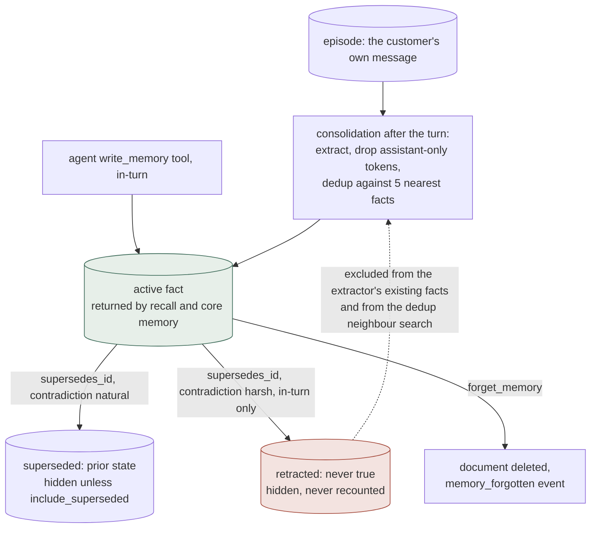

> **Naming.** This system calls itself *Atlas*, and this site is the *Agent
> Memory Atlas*. They are unrelated projects: this Atlas is a memory system,
> the site is a review of memory systems.

## 1. Executive Summary

`atlas-memory-demo` is a research demo of agent memory on Elasticsearch:
episodic messages, semantic facts and procedural playbooks in three indices,
recalled by RRF over BM25 and a semantic query, then reranked. Its correction
model is more developed than its README says. A contradicted fact is stamped
superseded and withheld from every default read, a denial marks it `retracted`,
and validity dates sit beside record time. The weak point is the write path:
nothing there consults a retracted value, so re-extraction can bring it back.

It is published under its author's personal account, MIT-licensed in his name,
and built on Elastic Cloud: embedding, reranking and both chat models run as
Elastic Inference Service endpoints. Three synthetic personas carry months of
generated history, and the same memory layer is exposed over MCP.

It ships more measurement than a demo needs. A recall eval matches on document
`_id`, so Recall@k and MRR are arithmetic rather than a judge's opinion, and it
fails the run on any cross-persona hit. A stress harness asserts that a
superseded fact is absent and its replacement present in the same recall. Both
need a live cluster, and neither was run for this report.

Consolidation is gated in code, not only in the prompt. After one extraction
call, `_drop_ungrounded` discards a fact containing distinctive tokens that only
the assistant said, a nearest-neighbour check drops duplicates and attaches
missed supersessions, and retraction is reserved for the in-turn agent. The
extractor's own `supersedes_id` is taken unchecked, and the supersede update
has no owner check.

## 2. Mental Model

A memory becomes a belief in one of two ways. The agent writes a semantic fact
through `write_memory` during the turn, or consolidation extracts it afterwards
from the customer's episodes. Either way it is active on arrival: there is no
candidate state and no review. Confidence is a number the model sees and is
told to hedge on below 0.7; nothing filters on it.

A fact stops being believed by supersession. The new fact names the old one in
`supersedes_id`; the old document gains `superseded_by` and `superseded_at`,
and recall excludes it. A `natural` contradiction means the fact was true and
stopped being true, and it stays retrievable as history. A `harsh` one, observed
in-turn, adds `retracted`: it was never true and must not be recounted.

`forget_memory` is the other exit: a hard delete of one document, with a
`memory_forgotten` event written to the episodic index. The prompt reserves it
for an explicit request to forget; contradictions go through supersession.

Episodes are the evidence tier. Only the customer's messages are stored there;
the assistant's replies are handed to consolidation as transient context and
never indexed, so model output cannot harden into something the customer said.



The dotted edge is the finding. Every read that could stop a denied value
returning filters out the row that records the denial.

## 3. Architecture

A FastAPI backend (`backend/app/main.py`) mounts three routers: the SSE chat
loop (`atlas/routes/chat.py`), REST memory routes (`atlas/routes/memory.py`),
and an MCP JSON-RPC endpoint (`atlas/routes/mcp.py`). The memory logic is
`atlas/memory/operations.py` (1,024 lines), `atlas/consolidate.py` (591),
`atlas/dedup.py` (228), `atlas/agent.py` (419) and `atlas/tools.py` (368).

Storage is five Elasticsearch indices: three memory indices, a shared
`atlas_catalog` of product documents with no `user_id`, and
`atlas_memory_state`, one watermark document per user. The mappings are
`atlas/memory/mappings/*.json`; text fields copy into a `semantic_text` field
with `inference_id: .jina-embeddings-v5-text-small`, so the cluster embeds on
write and the backend makes no embedding call.

`app/elasticsearch/retriever_builder.py` (985 lines) and its 1,097-line test
are template code from a search demo. `RetrieverBuilder` is imported only by
its package `__init__` and its test; the memory path builds its own retriever
in `operations.py`.

### Deployment and ergonomics

The operator needs an Elastic Cloud project with Inference Service endpoints
for the Jina embedder and reranker and two Claude chat models; the compose file
builds only the frontend and backend. Nothing runs offline. Per-user DLS keys
are optional, minted by `scripts/atlas/bootstrap_users.py`; without them
isolation rests on the application filter. Setup is `./setup.sh` plus two seed
scripts. Documents are JSON in Kibana and repairable by hand.

## 4. Essential Implementation Paths

### Turn and write path

`run_turn` (`agent.py:156`) writes the customer's message as an episode
(:181-190), loads core memory into the system prompt (:202-208), and injects a
pre-recall on the verbatim message with `include_catalog=true` as a synthetic
tool call (:223-267). The model then loops over the three tools for up to five
iterations, and every call goes through `dispatch` with the session's
`user_id` (`tools.py:234`).

`write_memory` (`operations.py:93`) builds the document per type, indexes it,
and on a semantic write with `supersedes_id` updates the old document with
`superseded_by`, `superseded_at` and, for a harsh contradiction with
`allow_retraction`, `retracted` (:193-236). That update is keyed on the id
alone. `forget_memory` (:941-943) and `update_procedural` (:988-990) read the
owner first and refuse a mismatch.

### Consolidation

After the reply, `run_turn` calls `consolidate` inline (`agent.py:378-419`).
It reads episodes past the user's watermark (`consolidate.py:353-361`), up to
12 earlier episodes as synthesis context, and up to 200 active facts, then
makes one extraction call. Three code gates follow:

- `_drop_ungrounded` (:229-273) drops a fact sharing a version-like token, or
  two distinctive words, with the assistant's prose and not the customer's.
  Facts that say "the assistant advised" are kept.
- `deduplicate` (`dedup.py:156`) recalls the five nearest active facts per
  candidate, drops near-identical text at Jaccard 0.85 without a call, and asks
  one batched judge call for the rest. A judged supersession is attached only
  to a neighbour it retrieved (:212-221).
- Consolidation passes `allow_retraction=False` (:520), and new playbooks need
  model confidence of at least 0.8 (:532-537).

The extractor's own `supersedes_id` is read at :494 and passed to
`write_memory` at :511 without a check against the ids it was shown. The dedup
module guards its own attachment against exactly that case; the extractor's
path has no equivalent.

The watermark advances to the newest processed episode after the writes
(:574-580). If `atlas_memory_state` is unavailable, consolidation falls back to
the 30 most recent episodes on every turn.

### Retrieval

`recall_memory` (`operations.py:633`) is described in section 6. `core_memory`
(:848) selects up to 24 active `identity` and `constraint` facts through one
multi-search with three orderings, and fills 6 slots by recency, 6 by
`use_count`, and the rest by age (:795-845).

## 5. Memory Data Model

Every memory document carries `user_id`. Episodic documents add `session_id`,
`event_type`, `role` and `timestamp`. Semantic facts add `fact_type` (one of
`preference`, `identity`, `constraint`, `world`, coerced by `_clean_fact_type`),
`confidence`, `source_episodes`, `created_at`, `last_used_at`, `use_count`, and
optionally `supersedes`, `superseded_by`, `superseded_at`, `retracted`,
`pending_outcome`, `valid_from` and `valid_to`. Procedural playbooks carry
`name`, `trigger_text`, `steps`, `version`, and success and failure counts.

Two clocks exist on a semantic fact. `created_at` and `superseded_at` record
when the store learned and retired it; `valid_from` and `valid_to` record when
it was true, set only when the customer's words date it
(`consolidate.py:113-118`). The consolidation prompt tells the extractor to
date only the new fact on a supersession, so the old fact's validity end is
implied rather than written.

`pending_outcome` marks a `world` fact recording advice whose result was never
confirmed; the prompt asks the model to open by asking whether it worked, and
consolidation supersedes it when the customer answers. It is surfaced, not
filtered.

`fact_type` is a genre fixed at write. It decides core-memory membership, not
belief.

## 6. Retrieval Mechanics

`_hybrid_retriever` (`operations.py:360`) builds two `standard` legs: a
`multi_match` over `text^2`, `title^2`, `name`, `description` and
`trigger_text`, and a `semantic` query on `semantic_content`. Both legs share
one filter list, the user term plus `must_not exists superseded_by`
(:388-401). Each is wrapped in a `function_score` whose Painless script
applies Gaussian decay to episodic `timestamp` and semantic `last_used_at`
(scale 1,825 days, offset 180 days), a `1 + log10(1 + use_count) * 0.2`
boost on semantic facts, and a 0.85 prior on catalog documents.

RRF fuses the legs with `rank_constant` 30 over a window of at least 80
(:456-464). `_rerank` sends up to 80 candidates to the Jina reranker v2 and
keeps the top k, falling back to RRF order on failure (:468-535).

On the agent path, recall bumps `last_used_at` and `use_count` on the returned
semantic and procedural hits with `refresh=False` (:538-591). The bump is not
atomic, and it feeds both the decay script and core memory's salience quota,
so a fact that is recalled ranks higher next time. The eval leaves it off.

The model sees each hit's `confidence`, the supersession flags, `retracted`,
`pending_outcome` and validity dates (`tools.py:260-321`).

## 7. Write Mechanics

Writes are hot-path. The episode write takes no forced refresh; agent tool
writes and consolidation writes use `refresh=True`, so a fact is retrievable as
soon as the call returns.

### Operational cost

Consolidation runs inside the SSE generator after the `done` event, so the
reply streams first and the stream closes when consolidation finishes. Each turn
stores the customer's message before consolidation runs, so the chat path
normally reaches the extraction call rather than the no-episode early return
(`consolidate.py:397-400`). A turn therefore costs one extraction call on
`LLM_INFERENCE_ID_FAST` with up to 4,096 output tokens, one reranked recall per
candidate, and at most one judge call.

No pass rewrites the store. Core memory is fetched per turn and placed in the
system prompt after the date, so any change to it changes the prompt prefix.
It is capped at 24 facts.

## 8. Agent Integration

The agent has three tools: `recall_memory` (with `include_catalog` and
`include_superseded`), `write_memory` (with `supersedes_id`, `contradiction`,
validity dates and playbook fields), and `forget_memory`. The MCP endpoint at
`/api/atlas/mcp/{user_id}` exposes the same three with no authentication; the
path segment is the scope, and the docs say a bearer check belongs there in
production. When a DLS key exists for the user, MCP reads use it.

The REST routes accept `user_id` in the body. `/api/memory/write` does not
forward `contradiction` or validity dates. `/api/memory/recall` treats
`user_id` as optional, and without one it searches every user's documents.

`ATLAS.md` describes a consolidate button in the inspector and an agent that
forgets the contradicted fact. At this commit `consolidateMemory` in
`frontend/src/atlas/api.ts` has no caller, consolidation runs after every turn,
and the system prompt forbids `forget_memory` for contradictions.

## 9. Reliability, Safety, and Trust

Strengths:

- **A grounding filter in code.** The source comments measure the prompt rule
  against assistant-sourced facts holding about a third of the time; the token
  filter is the enforcement, with tests.
- **Retraction reserved for first-hand evidence.** Consolidation infers intent
  second-hand, so it may lower confidence and may not set `retracted`.
- **The chat path never stores assistant replies as episodes.**
- **A hallucinated dedup id cannot hide a fact**; the judge's id must be one of
  the retrieved neighbours.
- **Scope on every model-facing read**, with a structural test that the user
  term survives `include_superseded`.

Gaps:

- **A retracted value can return.** The consolidation comparison set
  (`consolidate.py:386-394`) and the dedup neighbour search both exclude
  superseded rows, so a re-extracted denied value is judged distinct and
  written active. `tombstone` is withheld: `retracted` is keyed on the
  document, and no write path reads it.
- **The supersede update checks no owner.** A write naming another user's fact
  id hides it from that user's recall.
- **REST recall without `user_id` is unscoped**, and nothing in the backend
  authenticates the REST or MCP routes; the deployment guide puts the service
  behind IAP.
- **No mutation log.** Supersession stamps the old row; `forget_memory` writes a
  best-effort event into the episodic index, which consolidation reads as an
  episode and `forget_memory` can delete. Writes and playbook updates record
  nothing. `audit_log` is withheld.
- **No review surface.** The inspector displays; `dry_run` on the consolidate
  route is a caller flag. `human_review` is withheld.

## 10. Tests, Evals, and Benchmarks

The pytest suite is 179 functions in 12 files and runs in CI with no cluster.
Sixty-six test `RetrieverBuilder`, which the memory path does not use. The
memory tests are structural or run against fakes: the supersession and user
filters in the built query, validity-date storage and prompt wording,
`fact_type` coercion, the grounding filter, dedup outcomes, and the watermark.

Six harnesses under `backend/scripts/atlas` run against a live cluster.
`stress_test.py` (692 lines) exits non-zero on any failed scenario. B5 is the
value-level negative case: supersede a fact, recall, pass only if the old id is
absent and the new id present (:233-245). C1 asserts no document of user A in
user B's recall and passes on an empty result (:266-276).

`eval_recall.py` samples 84 documents across three personas, has an LLM write
two questions per document, and matches on `_id`. Its isolation sweep runs one
question per owner and memory type as each other persona and exits 2 on any
hit (:364-403, :564-566); the Recall@10 and Recall@5 gates in the same run keep
an empty retriever from passing. `eval_extraction.py` measures the other half,
whether consolidation writes what was said, on `dry_run`.

No run artifact is committed; `backend/data/atlas_eval/` is ignored.
`docs/improvements/RELEASE-1.md` states R@10 0.869, R@5 0.804, R@1 0.524 and
MRR 0.598 with zero cross-tenant hits. A blog draft states R@10 near 0.87 over
168 questions and calls the eval gated in CI; the CI workflow runs `pytest` and
does not run the eval. I ran nothing: nothing was installed, built or executed.

## 11. For Your Own Build

### Steal

- **Match a retrieval eval on document id** and gate it together with an
  isolation sweep, so one run shows both that the owner finds the document
  and that nobody else does.
- **Split "no longer true" from "never true".** One supersession mechanism
  asked to represent both narrates a denied fact back as history.
- **Enforce a grounding rule in code** once a prompt rule is measured failing:
  a token diff between the assistant's prose and the customer's words is cheap
  and testable.
- **Keep the model's replies out of the evidence tier**, and pass them to the
  extractor as context only.
- **Store validity dates only when the source dates the fact**, and tell the
  model which clock answers which question.

### Avoid

- **Hiding the correction from the writer.** A filter that keeps superseded
  rows out of recall is right; the same filter on the extractor's comparison
  set removes the one record that could stop re-extraction.
- **An ownership check on some mutations and not others.** Delete and playbook
  update check the owner; supersede, which also hides a fact, does not.
- **An optional scope key on a read route.** Absence should fail, not widen.

### Fit

This is a reference for building memory on an Elasticsearch deployment you
run, and a compact example of correction handled with care at the
prompt and schema level. It is not a product: routes are unauthenticated,
isolation depends on callers passing `user_id`, and it assumes Elastic-hosted
inference. Read `consolidate.py`, `dedup.py` and the two harnesses before the
README and `ATLAS.md`, which describe a consolidate button and a
forget-on-contradiction flow the code does not have.

## 12. Open Questions

- How often does a retracted value come back through consolidation on a live
  corpus? The mechanism allows it; nothing measures it.
- Does the stat bump's feedback loop entrench early facts in core memory?
- How do the stated benchmark figures move when the question generator and the
  reranker differ from the ones that built the index?
- Is `forget_memory`'s audit event meant to reach the extractor as an episode?

## Appendix: File Index

- Memory operations, schema and retrieval:
  `backend/app/atlas/memory/operations.py`, `backend/app/atlas/memory/constants.py`,
  `backend/app/atlas/memory/mappings/semantic.json`,
  `backend/app/atlas/memory/state.py`, `backend/app/atlas/memory/user_keys.py`.
- Agent loop and tools: `backend/app/atlas/agent.py`, `backend/app/atlas/tools.py`.
- Consolidation: `backend/app/atlas/consolidate.py`, `backend/app/atlas/dedup.py`.
- Routes: `backend/app/atlas/routes/chat.py`, `backend/app/atlas/routes/memory.py`,
  `backend/app/atlas/routes/mcp.py`.
- Tests: `backend/tests/test_supersession_filter.py`,
  `backend/tests/test_validity_time.py`, `backend/tests/test_attribution_guard.py`,
  `backend/tests/test_dedup.py`, `backend/tests/test_consolidation_watermark.py`.
- Harnesses: `backend/scripts/atlas/stress_test.py`,
  `backend/scripts/atlas/eval_recall.py`, `backend/scripts/atlas/eval_extraction.py`,
  `backend/scripts/atlas/accuracy_test.py`, `backend/scripts/atlas/agent_stress_test.py`.
- Not on the memory path: `backend/app/elasticsearch/retriever_builder.py`.

### Recorded searches

Run from the repository root at the pinned commit.

```sh
# RetrieverBuilder has no caller outside its package __init__ and its test
rg -n 'RetrieverBuilder|retriever_builder' backend --glob '!backend/app/elasticsearch/retriever_builder.py'
# retracted is set in operations.py and read only by the recall payload in tools.py; no write path reads it
rg -n 'retracted' backend/app --type py
# the extractor's comparison set and the dedup neighbours both exclude superseded rows
rg -n 'include_superseded|recall_memory\(' backend/app/atlas/consolidate.py backend/app/atlas/dedup.py
# the supersede update checks no owner; forget and update_procedural do
rg -n 'owner != user_id|es.update\(' backend/app/atlas/memory/operations.py
# nothing filters on validity dates
rg -n 'range.{0,40}valid_|valid_(from|to).{0,40}range' backend
# confidence and pending_outcome are written and surfaced, never used in a query
rg -n '"(confidence|pending_outcome)"' backend/app --type py
# the only mutation event is forget_memory's memory_forgotten
rg -n 'event_type=|"event_type":' backend/app --type py
# no request authentication in the backend
rg -n -i 'HTTPBearer|APIKeyHeader|Security\(|verify_token' backend/app --type py
# the chat path writes no assistant-role episode
rg -n 'role=.assistant' backend/app --type py
# the inspector has no consolidate caller
rg -n 'consolidateMemory' frontend/src
# the CI workflow runs pytest and no eval script
rg -n 'eval_recall|stress_test|pytest' .github/workflows
# no run artifact committed
git ls-files backend/data
# no paper or citation
rg -n -i 'arxiv|bibtex|@article|@misc|CITATION|doi\.org' --glob '!frontend/yarn.lock' .
```

## History

**2026-09-26** — [`d84f9235a69d45a4fe326aaa691ad024699d0daa`](https://github.com/noamschwartz/atlas-memory-demo/commit/d84f9235a69d45a4fe326aaa691ad024699d0daa) — an audit at an unchanged pin: `main` has not moved. Screened again from a full clone: three build-time execution surfaces, two unpinned, nothing inside the cooldown. Nothing installed, built or run. Three marks added, each present at both earlier pins: `bitemporal` on `valid_from`/`valid_to`, `trust_state` on the supersession stamp and `retracted` that every default read excludes, and `negative_eval` on stress scenario B5 and the gated isolation sweep ([section 10](#10-tests-evals-and-benchmarks)). Corrected: supersession, retraction and validity dates exist; consolidation runs after every turn, gated in code; the retrieval module cited was unused template code; benchmark figures are stated in committed docs; the author, not Elastic, publishes it. Added: a retracted value is invisible to the write path, and the supersede update checks no owner ([section 9](#9-reliability-safety-and-trust)).

**2026-09-13** — [`d84f9235a69d45a4fe326aaa691ad024699d0daa`](https://github.com/noamschwartz/atlas-memory-demo/commit/d84f9235a69d45a4fe326aaa691ad024699d0daa) — re-read, three commits past the previous pin, all of them on the memory path. The mark stands and its evidence is now recorded. Two additions are worth naming. `fact_type` gained validation on write, and the test file states the gap it closed exactly: facts typed `identity` or `constraint` are *"injected into the system prompt on every future turn"*, and while the agent's tool schema constrains the value with a JSON enum, consolidation handed `write_memory` the extractor's raw JSON, so *"an invented or misspelled type reached the index unchallenged"* — one gate on one caller, and a second write path around it. And consolidation gained retrieval-backed deduplication, whose reasoning is the useful part: the recency slice it previously compared against is a window, so *"the fact one position past it is invisible to the extractor"*; checking each candidate against its nearest existing facts by meaning rather than age removes that cliff and *"catches contradictions that share no vocabulary with the fact they contradict"*. The pass returns dropped duplicates and facts it attached a `supersedes_id` the extractor missed — supersession rather than a rejected-value record, so `tombstone` stays withheld, and `fact_type` is a genre rather than an epistemic status, so `trust_state` does too. Screened again first; nothing was installed and no suite was run.

**2026-07-28** — [`0bd36a7b177a09aad97dc78efeb5fb43b9322f6d`](https://github.com/noamschwartz/atlas-memory-demo/commit/0bd36a7b177a09aad97dc78efeb5fb43b9322f6d) — first reading.
