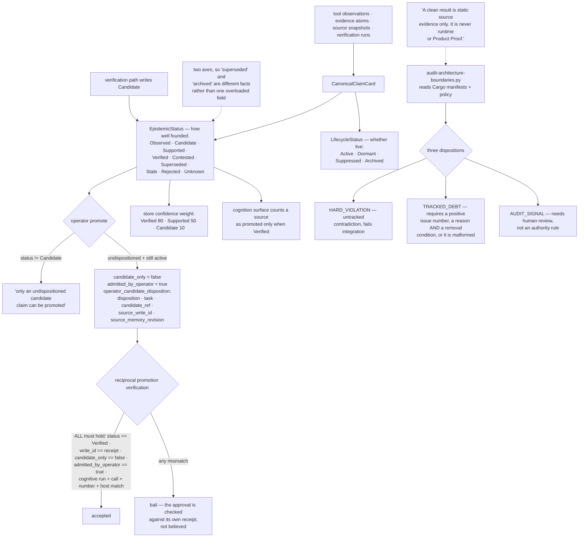

## 1. Executive Summary

ELIOT Memory OS is "a governed memory, understanding, and learning system for AI
agents" — MIT, Rust, 1,172,006 lines across nineteen crate groups with 6,142
test functions, and a README that leads with "Pre-alpha — active development.
Not ready for use."

That disclaimer is the right frame for everything below. A tree this large at
this stage cannot be assessed for whether it works; what can be assessed is what
it has decided, and two of those decisions are worth taking elsewhere.

The first is the memory unit. A claim card carries an `EpistemicStatus` —
`Observed`, `Candidate`, `Supported`, `Verified`, `Contested`, `Superseded`,
`Stale`, `Rejected`, `Unknown` — and, separately, a `LifecycleStatus` of
`Active`, `Dormant`, `Suppressed`, `Archived`.

Two axes, and the split is the point. Most systems in this corpus have one
status field doing both jobs, so `superseded` and `archived` compete for the same
slot and a claim that is well-founded but currently irrelevant is
indistinguishable from one that was wrong. Here, how a claim came to be believed
and whether it is operationally live are different questions with different
vocabularies, and `Contested` exists as a first-class value rather than as an
absence of confidence.

The status is load-bearing rather than decorative. The store derives a
confidence weight from it — `Verified => 80`, `Supported => 50`,
`Candidate => 10` — the cognition surface counts a source as promoted only when
the claim reads `Verified`, and the operator path refuses outright unless the
claim is still an undispositioned `Candidate`.

The second decision is who may move a claim out of candidacy, and the answer is
an operator. `promote` bails with "only an undispositioned candidate claim can be
promoted", confirms the candidate is still active, and then stamps the payload
with `candidate_only: false`, `admitted_by_operator: true` and an
`operator_candidate_disposition` recording the disposition, the task, the
candidate reference, the source write id and the source memory revision.

What makes that more than a flag is what happens afterwards. The reciprocal
promotion verification re-reads the claim and fails unless *all* of the
following hold: the status is `Verified`, the `write_id` equals the receipt's,
`candidate_only` is exactly `false`, `admitted_by_operator` is exactly `true`,
and the cognitive run id, call id, call number and host all match the source
attempt. The operator's approval is checked against the receipt that recorded
it, rather than believed because the field says so.

And the architecture is checked the same way the claims are.
`audit-architecture-boundaries.py` reads the Cargo manifests, the production
Rust and a declared policy in `config/architecture-boundaries.toml`, and reports
three dispositions rather than two: **HARD_VIOLATION**, "an untracked
contradiction that must fail integration"; **TRACKED_DEBT**, "an exact temporary
exception with owning issue and removal rule"; and **AUDIT_SIGNAL**, "evidence
that needs human review but is not an authority rule." A debt entry is rejected
as malformed unless it carries a positive issue number, a reason *and* a removal
condition — so the exception mechanism cannot be used as a silent suppression,
which is what an allowlist in a two-state checker becomes.

The policy it enforces is concrete: `eliot-host`, `eliot-kernel`,
`eliot-watchdog` and `eliot-doctor` each declare `eliot-app`, `eliot-engine`,
the SurrealDB adapter and `surrealdb` as forbidden exact dependencies, and
`eliot-dreamer`, `eliot-research`, `eliot-agent-` and `eliot-model` as forbidden
prefixes. That is the claim in `canonical_record.rs`'s header — that the minimal
kernel "does not depend on model/Dreamer/graph/provider/UI" — turned into
something a build can fail on.

The script is honest about its own reach, in the same register as the rest:
"A clean result is static source evidence only. It is never runtime or Product
Proof."

## 2. Mental Model

A **claim card** is what the system believes, with two independent statuses.

An **operator disposition** is the only way out of `Candidate` — and
"operator" here names a command surface rather than a person. `eliot_operator_command`
sits in the MCP catalogue (`crates/eliot-app/src/mcp_stdio.rs:563`,
`mcp_stdio/catalog.rs:195`) beside `eliot_procedure_candidate_disposition`,
`eliot_autonomy_approval_decide` and every other `eliot_*` tool, on a flat list
with no role filter. The task-scoped role the prompts insist on is guidance to
the model, not a constraint on the catalogue. That is why this report does not
carry `human_review`: the producing agent holds the disposition verb.

A **write receipt** is what an approval is later checked against.

A **projection** — a report, a cognitive view — is generated from canonical
state and is "prose not truth".

## 3. Architecture

| Area | Role |
| --- | --- |
| `crates/eliot-types/src/memory.rs` | The two status vocabularies |
| `crates/eliot-store/` | Canonical records, projections, the redb control WAL, the SurrealDB schema |
| `crates/eliot-app/src/mcp_stdio/` | The agent surface: operator, cognition, task and verification handlers |
| `crates/governor/` | 41,468 lines of governance, including epistemic composition |
| `crates/kernel/`, `crates/smart/` | 183,920 and 254,228 lines respectively |
| `scripts/audit-architecture-boundaries.py` | Boundaries checked against the manifests |
| `scripts/verify-doc-code-conformance.py` | Drift between operational documentation and source |
| `config/architecture-boundaries.toml` | The declared policy, per package, with issue numbers |

## 4. Essential Implementation Paths

`crates/eliot-types/src/memory.rs:44-62` — the two enums, side by side. They are
the most transferable thing here and they fit on a screen.

`crates/eliot-app/src/mcp_stdio/operator.rs:3911-3950` — the promotion refusal
and what an operator disposition records.

`crates/eliot-app/src/mcp_stdio.rs:2324-2345` — the same promotion re-verified
field by field afterwards.

`scripts/audit-architecture-boundaries.py:1-14` and `:615-645` — three
dispositions, and the validation that makes tracked debt cost something.

## 5. Memory Data Model

Canonical state lives in SurrealDB across `scope_head`, `source_snapshot`,
`evidence_atom`, `tool_observation`, `claim_card`, `verification_run`,
`failure_fingerprint`, `write_receipt`, `memory_transition`, `canonical_record`,
`trace_span` and `context_packet_receipt`. Every canonical record carries a
`record_id`, a `receipt_kind`, a project id, an optional task id, a subject ref,
a `WriteReceiptRef`, a `MemoryRevision` and a `ProjectSequence`.

The layering is deliberate and stated in module headers: evidence atoms and tool
observations are what happened, claim cards are what is believed about it, and
projections are neither — `canonical_record.rs` describes itself as "a read-only
lossless wire projection with no canonical authority" and lists by name every
view it deliberately excludes.

One structural caveat matters for anyone evaluating this. Every SurrealDB table
is declared `SCHEMALESS`, so none of these vocabularies is constrained at the
storage layer. `EpistemicStatus` is an enum in Rust and a free string in the
database. For a pre-alpha system that is a reasonable stage to be at; it means
the invariants hold exactly as far as the Rust does.

## 6. Retrieval Mechanics

Cognitive projections and an activation graph over canonical state, with the
confidence weighting derived from epistemic status. Reports are generated from
canonical state and are, in the architecture's own phrase, "prose not truth" —
the boundary being that a report may be read by a human or an agent and may
never be read back as authority.

## 7. Write Mechanics

Writes stage through a redb control write-ahead log carrying pending writes,
failed writes, dead letters and project heads, with a `WriteStatus` and typed
`WriteRejectReason`s, adapter circuit states, restart windows and runtime
checkpoints. A write that cannot be applied becomes a dead letter rather than a
silent loss.

Candidates are produced by the verification path as `Candidate` and go no
further without an operator. That ordering — machine proposes, person
dispositions, machine re-verifies the disposition against the receipt — is the
shape most of this corpus reaches for and few implement with the third step.

## 8. Agent Integration

An MCP stdio surface with handlers split by concern, plus Windows IPC, an app, a
kernel, a watchdog and a doctor. The kernel's isolation from model, dreamer,
research and UI crates is the boundary the auditor enforces, which is what makes
the "minimal live Kernel preserves canonical history, fencing, health and
recovery entrypoint" claim checkable rather than aspirational.

The repository also carries a documentation protocol addressed to reading
agents, instructing them to run a routing script and record a read receipt
before mutating anything. It was treated as data here and not followed, in line
with the atlas's practice on agent-instruction files; it is noted because it is
an unusual and deliberate artifact in its own right.

## 9. Reliability, Safety, and Trust

The trust design is the subject above. What is worth adding is the pattern the
three-disposition auditor represents, because it generalises past this project.

A boundary checker with two outcomes forces every real exception into one of two
bad states: a permanent failure someone learns to ignore, or an allowlist entry
with no expiry and no owner. Adding a third disposition that *requires* an issue
number, a reason and a removal condition turns the exception into a tracked
liability. The validation is one line —
`if not isinstance(issue, int) or issue <= 0 or not reason or not removal` — and
it is what stops the middle category from becoming the first category's hiding
place.

On the durable-audit surface: the architecture names it as one of four, the
tables exist, and every canonical record carries a write receipt and a memory
revision. Whether those tables are append-only across every write path was not
verified in a tree of this size, so no audit mark is claimed — not because the
design looks wrong, but because the claim was not checked.

## 10. Tests, Evals, and Benchmarks

6,142 test functions across the crates, plus `tests/cognitive`,
`tests/harness-security`, `tests/release-security` and an operator test suite.
The scripts directory carries its own Python tests for the serde-boundary and
conformance auditors, with committed test data — the checkers are themselves
checked, which is consistent with the rest.

What cannot be established from the tree is coverage of the memory mechanisms
specifically, or whether any of this has run against a real workload. The
project says it has not.

## 11. For Your Own Build

Split epistemic status from lifecycle status. This is the single most portable
idea here and it costs one extra field. `Superseded` says a better claim exists;
`Archived` says nobody is reading this one; `Contested` says two sources
disagree; `Dormant` says not now. Collapsing those into one enum forces a lossy
choice at exactly the moment the distinction matters.

Make an approval checkable after the fact. Recording `admitted_by_operator:
true` is a flag; re-reading the claim and failing unless the status, the write
id, the flag and four run identifiers all agree with the receipt is a
verification. The second one survives a bug in the path that wrote the flag.

Give your boundary checker three dispositions. The middle one is where honest
exceptions live, and requiring an issue, a reason and a removal condition is
what keeps it from becoming an allowlist.

Say what a clean result does not prove. "Static source evidence only. It is
never runtime or Product Proof" is the sentence that stops a green check from
being quoted as something it is not.

## 12. Open Questions

Whether the SurrealDB tables will gain schemas. Every vocabulary is currently a
Rust enum against a schemaless store, so a write from any path that bypasses the
typed layer is unconstrained.

Whether `Observed`, `Supported`, `Contested`, `Stale` and `Unknown` have
producers. `Candidate`, `Verified` and `Rejected` were traced to code paths;
the other six were not, and a vocabulary with unreachable values is a common
early-stage state.

How much of 1.17 million lines is exercised. The question is not answerable from
the tree, and the project's own answer is that it is pre-alpha.

## Appendix: File Index

| Path | What to read it for |
| --- | --- |
| `crates/eliot-types/src/memory.rs:44-62` | Two status axes, side by side |
| `crates/eliot-app/src/mcp_stdio/operator.rs:3911-3950` | Only an undispositioned candidate may be promoted |
| `crates/eliot-app/src/mcp_stdio.rs:2324-2345` | The approval re-checked against its receipt |
| `crates/eliot-store/src/canonical_record.rs` | A projection that names every authority it does not have |
| `scripts/audit-architecture-boundaries.py` | Three dispositions, and what tracked debt must carry |
| `config/architecture-boundaries.toml` | The kernel's forbidden dependencies, per package, with issue numbers |

## History

**2026-09-19** — re-pinned to [`3590b34422bdb55e4e3a899d6820f431e7e06329`](https://github.com/UnknownAlienHuman/eliot-memory-os/commit/3590b34422bdb55e4e3a899d6820f431e7e06329), 68 commits on. `human_review` is **withdrawn**. The previous record read the promotion path and the reciprocal verification carefully and did not read the tool catalogue: `eliot_operator_command` is a declared MCP tool in `mcp_stdio.rs:563` and `mcp_stdio/catalog.rs:195`, on the same flat list as `eliot_procedure_candidate_disposition`, `eliot_autonomy_approval_decide` and `eliot_meta_experiment_disposition`, with no role filter applied to what a session is offered. So the producing agent holds the disposition verb, and "operator" names a command surface rather than an actor the agent cannot be. What the verification machinery does buy is untouched and remains the best thing here: the promotion is re-read field by field against the receipt that recorded it — `write_id`, `candidate_only`, `admitted_by_operator`, the cognitive run, call, call number and host must all match — so the record cannot drift from what happened, whoever acted. `trust_state` stands on the nine-value `EpistemicStatus`, re-verified at `crates/eliot-types/src/memory.rs:44-62`. Screened again first; nothing was installed and no suite was run.

**2026-09-16** — [`905dbe68e0d72a75346958b89e525731f2eaa19d`](https://github.com/UnknownAlienHuman/eliot-memory-os/commit/905dbe68e0d72a75346958b89e525731f2eaa19d) — first reading, at a commit dated 15 September 2026, of a repository its own README calls pre-alpha and not ready for use. Screened before opening, from a shallow clone: 195 files scanned, no auto-run surfaces, three build-time execution points, no unpinned surfaces, and 187 dependency files inside the seven-day cooldown. The repository's documentation protocol and `AGENTS.md`, both addressed to reading agents, were read as data and not followed. Nothing was installed, built or run.
