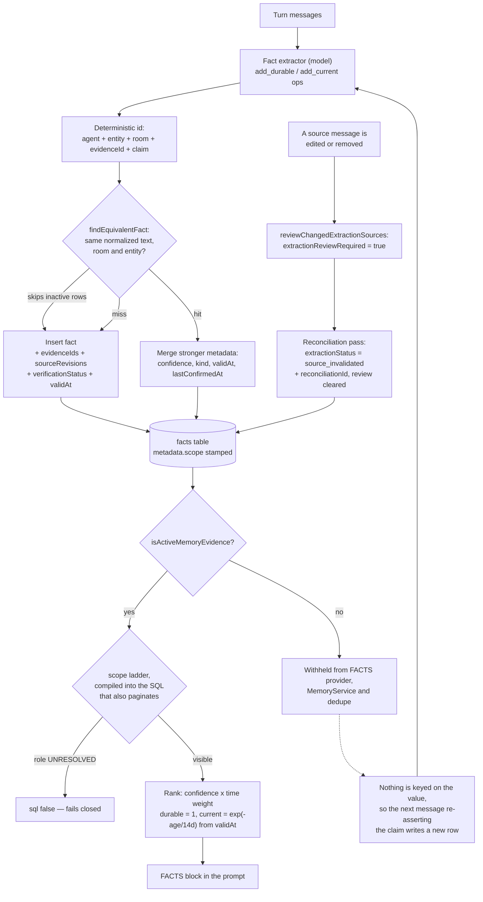

## 1. Executive Summary

elizaOS is a TypeScript agent framework and product stack — MIT, 29,010 tracked
files across a runtime, an agent package, a CLI, a desktop app, cloud services
and 108 first-party plugins, with a git history opening on 9 July 2024 under
its former owner and a default branch of `develop`. Almost none of that is
memory. The parts that are, are among the most carefully built in this corpus.

The memory model is two stores side by side. `Memory` rows live in named tables
(`messages`, `facts`, `documents`) carrying content, an entity, a room, a world,
an optional embedding and a `metadata.scope`. `LongTermMemory` records are a
separate typed shape — `episodic` / `semantic` / `procedural`, with confidence,
source and access counters — behind a `MemoryStorageProvider` interface that a
database plugin registers and `MemoryService` discovers at init, disabling
storage-backed features gracefully when none is present.

Three things make it worth reading.

**Facts are linked to their evidence and retired when it changes.** Every
extracted fact stores `extractionEvidenceIds` and `extractionSourceRevisions` —
which messages produced it, at which revision. When a later turn observes that
one of those messages was edited or removed, `reviewChangedExtractionSources`
flips the fact to `extractionReviewRequired: true`, and the reconciliation pass
sets `extractionStatus: "source_invalidated"` and queues the source for
reprocessing. `isActiveMemoryEvidence` then removes it from the FACTS provider,
from `MemoryService.getLongTermMemories` and from the write-time dedupe pool.
The atlas sees plenty of systems that extract beliefs from messages; this is the
first in a while that notices when the message stops saying what it said.

**The scope predicate is compiled into the query, not applied after it.**
`memoryAccessContextConditions` returns SQL — agent equality, an authorized-room
`inArray`, a scope-validity guard and a per-role visibility clause over seven
scope values — and the comment names the failure it exists to prevent:
*"Every condition returned here is pushed into the same query that orders/ranks
and paginates so ineligible rows can neither leak nor starve an authorized
page."* An unresolved actor pushes `sql\`false\``. An unstamped row defaults to
`private`. Beside it, `provenance-envelope.ts` refuses to recall an item whose
source, account or room cannot be derived from what the connectors stamped —
*"nothing defaults to `global`."*

**And one absence is the sharpest thing on the page.** `memory_access_logs` is
declared as an *"append-only log of reads/writes against `long_term_memories`"*
in `plugin-sql`, declared a **second** time in the cloud package with different
columns, exported, listed among the tables the backup service copies, named in a
retention-service comment — and written by nothing. There is no insert, no
helper, no `accessType` producer anywhere in 29,010 files. The design was
understood twice and wired zero times.

Four marks: `trust_state`, `bitemporal`, `scope_enforced`, `negative_eval`.
Withheld: `tombstone`, `audit_log`, `human_review`, each for a reason worth more
than the dash.

## 2. Mental Model

A claim becomes a belief by being extracted from a message, and stops being one
when that message changes.

That is the loop the whole design turns on. An evaluator runs after a turn and
asks a model for operations over a two-store fact model: `add_durable` for
identity-level claims that do not decay, `add_current` for states that do
(`feeling`, `physical_state`, `working_on`, `going_through`,
`schedule_context`). `insertFact` mints a **deterministic id** when extracting —
`stringToUuid("fact:<agentId>:<entityId>:<roomId>:<evidenceId>:" + stableStringify(args))`
— so re-extracting the same claim from the same evidence resolves to the same
row rather than a duplicate, and stamps `confidence`, `lastConfirmedAt`, `kind`,
`category`, `keywords`, `verificationStatus` and, for current facts, `validAt`.

Two status fields then decide whether the fact is read, and the interesting
thing is which one does the work. `verificationStatus` is the epistemic-sounding
one — `self_reported` / `confirmed` / `contradicted` — and it *protects*:
`isProtectedMemoryEvidence` returns true for `confirmed`, which exempts a fact
from retirement. `extractionStatus` is the boring lifecycle one, with a single
value `source_invalidated`, and it is what actually filters: combined with
`extractionReviewRequired`, it is the predicate three separate read paths
consult before a fact can reach a prompt. A `confidence` float sits beside both
and only ever weights a ranking.

The exit is where the design stops short. Retirement is keyed on the *record*.
`findEquivalentFact`, the write-time dedupe, opens its candidate loop with
`if (!isActiveMemoryEvidence(candidate)) continue;` — so a retired fact does not
block a new row carrying identical normalized text. Delete is real and
reachable, by id, from the runtime, an agent action and an HTTP route. Neither
one is keyed on the *value*, so the next message that re-asserts the claim
writes it back as a new fact with a new id.



## 3. Architecture

The memory is spread across three layers and an operator has to stand up all
three.

`packages/core` owns the contracts and the policy: `types/memory.ts` re-exports
the shared shapes from `@elizaos/common`, `types/long-term-memory.ts` and
`types/memory-storage.ts` define the `LongTermMemory` record and the
`MemoryStorageProvider` interface, `utils/extraction-evidence.ts` (47 lines) is
the read-side status predicate, `runtime/fact-write-dedupe.ts` (175) the
write-time guard, and `access-control/` (4,707 lines across eight modules and
their tests) the scope ladder, the provenance envelope and the audience
disclosure rules.

`plugins/plugin-sql` is the production store: Drizzle over Postgres or PGlite,
with `base.ts` at 7,872 lines carrying the adapter and the SQL scope predicate,
and a schema directory of 38 tables. `plugins/plugin-inmemorydb` is the
alternative, and it matters for this report because it reimplements the same
ladder through `filterMemoryReadByAccessContext` at four read sites rather than
skipping it.

`plugins/plugin-assistant` is where extraction lives:
`advanced-capabilities/evaluators/reflection-items.ts` (1,947 lines) holds the
operation applier and `insertFact`, `extraction-reconciliation.ts` (220) the
retirement pass, `providers/facts.ts` (585) the read path that assembles the
FACTS block, and `advanced-memory/services/memory-service.ts` (571) the
long-term store's service. None of this is in `core`; an adopter who takes the
runtime alone gets the contracts, the scope ladder and the dedupe, and no
extraction at all.

Running it needs Bun and Node at the versions `package.json` pins, plus a
Postgres or PGlite database and an embedding model for the vector arm. The
repository declares two submodules — `elizaOS/llama.cpp` for local inference and
`elizaOS/electrobun` for the desktop shell — neither of which touches memory;
both were left uninitialised for this reading, and every absence claim below is
scoped to the superproject.

## 4. Essential Implementation Paths

**Extraction.** An evaluator hands the turn to a model against the schema in
`factExtractor.schema.ts`, which declares the operation union and its fields —
including `valid_at`, documented as *"ISO timestamp of when the state began"*,
and `verification_status` over the three-value enum. `applyAddDurable` and
`applyAddCurrent` look for a dedupe target in the candidate pool plus anything
inserted this run, strengthen it if found, and otherwise call `insertFact`.

**Evidence stamping.** `extractionEvidenceMetadata` attaches
`extractionEvidenceIds` and `extractionSourceRevisions` — a map from source
message id to the revision that was read. This is what makes retirement
possible, and it is the field the whole invalidation loop keys on.

**Write-time dedupe.** `findEquivalentFact` canonicalizes the text
(`toLowerCase`, strip everything that is not a letter or number, collapse
whitespace), pulls the same 120-row window the FACTS provider reads, and returns
the first active row with the same key, room and entity.
`mergeStrongerFactMetadata` then folds in whatever the new occurrence carries
that is stronger — a higher `confidence`, a `kind` where there was none, a more
recent `validAt` or `lastConfirmedAt` — so *"a dedupe hit never drops new
information."* A backfill marked `extractionBackfill` attaches provenance but is
explicitly not treated as reconfirmation.

**Retirement.** `reviewChangedExtractionSources` compares each fact's stored
source revisions against the current ones, skips anything `isProtectedMemoryEvidence`
(a `confirmed` fact, or one sourced from `MEMORY`), and marks the rest
`extractionReviewRequired: true` with the changed ids. `reconcileFactEvidence`
then writes `extractionStatus: "source_invalidated"`, clears the review flag,
records `extractionReconciliationId` and `extractionChangedSourceIds`, and adds
the source to a reprocess set — and it throws a typed `ElizaError` when the
update fails rather than continuing.

**Reading.** `providers/facts.ts` pulls a room pool and a per-entity pool,
dedupes by id, filters on `isActiveMemoryEvidence` (and drops private facts on
turns where `shouldMinimizePrivateFactsForTurn`), partitions durable from
current, and ranks each by keyword relevance times a prior of
`confidence × timeWeight`. Durable facts get a weight of 1; current facts decay
`exp(-ageDays / 14)` from their effective timestamp, which is `validAt` where
present and `createdAt` otherwise.

**The storage predicate.** Underneath all of it,
`memoryAccessContextConditions` compiles the scope ladder into the same SQL the
adapter uses to order and paginate.

## 5. Memory Data Model

Two record shapes, and they do not share a table.

**`Memory`** — `id`, `entityId`, `agentId`, `createdAt`, `content`, `embedding`,
`roomId`, `worldId`, `unique`, `similarity`, `sessionId`, `sessionKey`, and a
`metadata` union whose base carries `type`, `source`, `scope` and `timestamp`.
Facts extend that metadata with `FactMetadata`: `confidence`, `lastReinforced`,
`sourceTrajectoryId`, `kind`, `category`, `structuredFields`, `keywords`,
`validAt`, `lastConfirmedAt`, `verificationStatus`.

**`LongTermMemory`** — `id`, `agentId`, `entityId`, `category` over the
episodic/semantic/procedural enum, `content`, `metadata`, `embedding`,
`confidence`, `source`, `createdAt`, `updatedAt`, `lastAccessedAt`,
`accessCount`, `similarity`. Its `MemoryStorageProvider` contract has store,
get, update and **delete**, and an optional `supportsIdempotentWrites` flag
whose comment is precise: *"Supplied IDs are insert-once identities; replay
returns the original row."*

The fact vocabulary is closed on both axes. `FactKind` is `durable` or
`current`; `DurableFactCategory` is seven values from `identity` to `goal`;
`CurrentFactCategory` is five from `feeling` to `schedule_context`. The
categories are not decoration — the prompt renders current facts as
`[factId] (current.category, since validAt) claim`, so the model sees the kind,
the category and the validity date of each one.

Two things about the scope field are worth stating. It is a seven-value union,
not a boolean, and the ladder distinguishes `private` from `user-private`,
`owner-private` and `agent-private` — different answers to *whose* privacy. And
`filter.ts` resolves the row's scoped entity through a `COALESCE` over
`metadata.scopedToEntityId`, `metadata.addedBy` and the row's own `entityId`, so
a row stamped by one party on another's behalf still resolves to a subject.

## 6. Retrieval Mechanics

Two arms and a ladder under both.

The vector arm runs over the embeddings table; the lexical arm is keyword
scoring in `providers/facts.ts` and `packages/retrieval/src/search.ts` (2,024
lines) with a reranker beside it. What distinguishes the implementation is the
ordering of the gates.

`searchCanonicalConversationMemories` runs, in its own documented order:
provenance validation, then the mandatory scope ladder, then destination
containment — and the adapter's vector scan is **constrained by the attested
room before ranking**, with the reason stated: *"so a global top-K cannot starve
eligible same-room rows."* That is the same starvation problem the SQL predicate
addresses on the pagination side, answered twice in two different layers.

Ranking of facts is `relevance × confidence × timeWeight`, with ties broken on
the prior. Durable facts do not decay by construction. Current facts decay with
a 14-day exponential from `validAt`, which is the one place in this system where
the valid-time axis changes an outcome rather than a label.

The failure modes are handled rather than swallowed. An adapter error or an
access-context lookup failure propagates as a typed `unavailable` availability —
*"never an empty 'complete' result"* — which is the distinction between "nothing
matched" and "the store did not answer" that most systems in this corpus
collapse. A retrieval whose provenance cannot be derived is withheld and the
item is reported in a `withheld` list rather than silently dropped.

## 7. Write Mechanics

**Extraction runs after the turn, as an evaluator, and does not block the
reply.** The reconciliation pass runs in the same place. There is no queue and
no separate worker: an evaluator background service drives them.

**A write is idempotent by identity on the extraction path** — the deterministic
id means re-running the same extraction over the same evidence resolves to the
same row — and **structurally deduped by text** on top of that, for the case the
ids cannot cover. The dedupe docstring names the live failure it closed: *"one
extraction turn persisted the same claim twice, milliseconds apart — a fact row
plus a relationship-echo row — and the FACTS reader surfaced both."* It also
names its own limits honestly: equivalence is text-and-scope equality after
canonicalization, *"not semantic similarity"*, and the candidate pool is bounded
to 120 rows so the check *"degrades to a plain insert (never an error) on rooms
with very deep fact history."*

**Nothing rewrites the whole store.** Reconciliation touches only facts whose
recorded source revisions no longer match, and it updates them in place rather
than rebuilding.

**Deletion is real and reachable three ways**: `runtime.deleteMemory(id)`, an
agent action in `packages/agent/src/actions/memories.ts`, and
`DELETE /api/memories/:id`. `deleteAllMemories(roomIds, tableName)` exists on
the adapter for bulk removal, and `runtime.ts` carries a comment about
`deleteMemory` racing a sweep and shifting pages — so the interaction was
thought about.

## 8. Agent Integration

The memory surfaces to the agent as the FACTS provider block and to a person as
an HTTP API and a UI. `packages/agent/src/api/memory-routes.ts` (1,473 lines)
exposes `POST /api/memory/remember`, `GET /api/memory/search`,
`GET /api/memories/feed`, `/browse`, `/by-entity/:id`, `/stats`, and
`DELETE`/`PATCH` on a memory id. `packages/agent/src/actions/memories.ts` (2,142
lines) is the model-facing side, and it renders an inactive memory with a marker
rather than hiding it, so a person browsing sees what was retired.

The adjacent machinery is where the interesting boundary sits. LifeOps ships a
persistent human-in-the-loop approval queue — `approval_requests` with `state`,
`requestedBy`, `subjectUserId` (*"Owner whose approval is required"*),
`resolvedBy`, `resolutionReason` and `resolvedAt` — and its action vocabulary is
a closed union of ten: `send_message`, `send_email`, `schedule_event`,
`modify_event`, `cancel_event`, `book_travel`, `make_call`, `sign_document`,
`execute_workflow`, `spend_money`. Every one is an act on the world. None is a
memory write. The queue is an egress gate, which is a good thing to have and a
different thing from reviewing what the agent believes.

## 9. Reliability, Safety, and Trust

**Provenance is an admission test, not a label.** `deriveCanonicalProvenance`
reads source, account, room, sender, timestamp, trust and scope from metadata
the connectors stamp; missing or conflicting required fields produce a typed
invalid result and *"the item is withheld from recall — nothing defaults to
`global`."* Sender attestation is recorded as the structural fact it is
(`sender-stamped`) and explicitly **not** labelled connector-verified, with the
reasoning written down: a nested metadata object at ingestion *"is not an
unforgeable attestation of the platform identity it carries."* That is an
unusually honest treatment of a field most systems would have called `verified`.

**The scope ladder fails closed and cannot be outrun by pagination.** Covered in
the frontmatter; the property worth repeating is that an `UNRESOLVED` role does
not fall back to a default tier, it pushes `false`.

**Where it stops.** `tombstone` is withheld and the reason is one line of code:
`findEquivalentFact` skips inactive candidates, so the retired row does not
block the identical claim being written again. This is defensible as a design —
a fact re-asserted by fresh evidence arguably *should* come back — but it means
"forget that" survives exactly until the next message says it again, and nothing
in the tree records the value as one that was rejected. The deterministic id
narrows the window rather than closing it: it collapses re-extraction from the
*same* evidence id, and a new message is new evidence.

**`audit_log` is withheld on an unwired mechanism, twice declared.**
`plugin-sql/src/schema/memoryAccessLogs.ts` defines `memory_access_logs` with
`memoryId`, `memoryType`, `agentId`, `accessType` and `accessedAt` under a
docstring calling it an *"append-only log of reads/writes against
`long_term_memories`."* `packages/cloud/shared/src/db/schemas/advanced-memory.ts`
defines a table of the same name with `roomId`, `relevanceScore` and `wasUseful`
and **no** `accessType`. The two disagree about their own columns. Both are
exported; the table name appears in the backup service's table list and in a
retention-service comment; and a search for an insert, for any
`logMemoryAccess`-shaped helper, and for an `accessType` producer returns
nothing in either package. Even had it been wired, the rubric would read it as
the retrieval half of the audit pattern rather than a record of mutations — but
it is not wired, and that is the more useful finding.

**`human_review` is withheld, and the machinery is on the other side of the
line.** `extractionReviewRequired: true` looks exactly like a review state: it
withholds the fact from every read path until something resolves it. What
resolves it is `extraction-reconciliation.ts`, an evaluator — the same class of
actor that produced the fact. No human is in that loop, and the approval queue
that does have a human in it accepts no memory action. The browse-and-delete API
is post-hoc curation, not a state a memory waits in.

**One more absence worth naming:** `verificationStatus: "contradicted"` can be
emitted by the model through the extractor schema and is read by nothing. A fact
the model believes is contradicted is stored, ranked and injected exactly like
one it believes is self-reported.

## 10. Tests, Evals, and Benchmarks

**I ran nothing.** The screen reported 170 dependency surfaces inside the
seven-day cooldown, which is an artifact of a `--depth 1` clone dating every
file to the tip rather than a fact about the repository, and 44 build-time
execution points including a root `postinstall` that patches three vendored
packages. Nothing was installed or built; every claim here is read from source
at the pinned commit, in a checkout whose two submodules were left
uninitialised.

The test coverage around the mechanisms this report credits is real. The
access-control directory is roughly half tests by line — `filter.test.ts` (413),
`artifact-disclosure.test.ts` (506), `audience-disclosure.test.ts` (542),
`audience-egress.test.ts` (220), `provenance-envelope.test.ts` (412),
`provenance-conflict-fields.test.ts` (192) and the 347-line PGlite integration
file that earns the `negative_eval` mark. The extraction side carries
`incremental-extraction.test.ts` and `evaluator-background.test.ts`, which
assert both directions of the retirement state: that a retired fact reads as
inactive, and — at `incremental-extraction.test.ts:864` — that an un-retired one
reads as active again. A suite that asserts the flag can be cleared as well as
set is rarer than it should be.

The one gap the report can name is the interaction between retirement and
re-assertion. `findEquivalentFact` skipping inactive candidates is a deliberate
line with no committed case pinning its consequence: nothing writes a fact,
retires it, feeds the same text through extraction again and asserts what the
store then holds.

There is no committed benchmark, no eval harness result, and **no paper**.
`arxiv`, `bibtex`, `@article`, `citation` and `doi` across every Markdown file
in the tree return an unrelated voice-pipeline research note and nothing else,
and there is no `CITATION.cff`. That is a statement about this artifact at this
commit, not about whether work was published elsewhere.

## 11. Patterns Worth Stealing

### Steal

**Store the revision of every source a belief was derived from.**
`extractionSourceRevisions` maps source message id to the revision that was
read, and it is the single field that makes the whole invalidation loop
possible. Most systems in this corpus store *that* a memory came from a
conversation; storing *which revision* is what lets you notice later that the
conversation changed underneath the belief.

**Compile the scope predicate into the ranking query.** Not "filter the results"
— return SQL conditions that go into the same statement as the ORDER BY and the
LIMIT. The docstring's phrasing is the reason: ineligible rows must not be able
to *starve* an authorized page, which post-filtering cannot prevent. The same
project applies the idea a second time by constraining the vector scan to the
attested room before ranking.

**Fail closed on an unresolved actor, and make the default the tightest tier.**
`UNRESOLVED` pushes `false`; a row with no stamped scope is treated as
`private`. Both defaults cost nothing and both point the failure in the safe
direction.

**Distinguish "no results" from "the store did not answer."** A typed
`unavailable` availability, *"never an empty 'complete' result"*. An empty array
that means two different things is how a retrieval outage becomes a confident
wrong answer.

**Refuse to call a structural fact an attestation.** `sender-stamped` rather
than `connector-verified`, with the comment explaining that a nested metadata
object at ingestion proves presence and not identity. A trust vocabulary is only
worth having if its strongest value is earned.

**Let a dedupe hit upgrade the kept row.** `mergeStrongerFactMetadata` folds a
higher confidence, a newly explicit kind and a fresher `validAt` into the
surviving row, so collapsing a duplicate never discards what the new occurrence
knew.

### Avoid

**Retiring a record without recording the value.** The retirement mechanism here
is good and it is keyed on the row. One `continue` in the dedupe loop is the
whole difference between "this claim was withdrawn" and "this row was
withdrawn", and only the first survives re-extraction.

**Declaring an audit table and never writing to it — twice, with different
columns.** If the two declarations had agreed, a reader might reasonably assume
one of them was live. They do not, and neither is.

**Shipping an enum value nothing reads.** `contradicted` is in the type, in the
Zod schema, in the prompt-facing JSON schema and in a test that the enum parses
it. A model that uses it is talking to nobody.

**A review flag whose resolver is another evaluator.** `extractionReviewRequired`
is a well-built quarantine. Naming it *review* invites the reading that a person
is involved, and none is.

### Fit

Take the access-control layer if you are building multi-party agent memory in
any language — the scope ladder, the fail-closed actor resolution, the SQL
compilation and the provenance admission test are four separable ideas and the
first three transplant cleanly. Take the evidence-revision pattern if your
memory is distilled from anything a user can edit: chat, documents, tickets.

Do not take the repository as a memory library. The extraction that makes the
fact store interesting lives in `plugin-assistant`, not in `core`, so adopting
the runtime gets you the contracts and the ladder and no facts; and the memory
itself is a small fraction of a 29,010-file monorepo carrying a desktop app, a
cloud service, local inference and 108 plugins. This is a framework you build an
agent inside, not a component you mount beside one.

## 12. Antipatterns / Risks

- **Retirement is record-keyed and the dedupe skips inactive rows**, so a
  retired claim returns as a new fact the next time a message asserts it.
- **`memory_access_logs` is declared twice, with different columns, and written
  by nothing.** The backup service copies a table that is always empty.
- **`verificationStatus: "contradicted"` has no reader**, in a schema the model
  is handed.
- **The human approval queue covers ten world-affecting actions and no memory
  operation**, so nothing a person approves governs what the agent comes to
  believe.
- **Extraction is model-driven with a confidence the model supplies**, and the
  only thing that later disputes a fact is a change to its source messages —
  not a contradiction from a later turn.
- **The scope guarantee is split across two layers**, `metadata.scope` here and
  Postgres RLS on `entity_id`/`server_id`; a deployment that skips RLS is
  relying on half the design, and `filter.ts` says so.
- **The dedupe window is 120 rows**, and the file states the degradation: on
  rooms with deep fact history the structural guard quietly stops firing.
- **`facts-and-relationships.ts` writes `validAt` as `now`**, so facts from that
  path carry a valid time equal to their record time and lose the axis the rest
  of the system maintains.

## 13. Build-vs-Borrow Takeaways

The transferable half of this system is small and does not depend on the rest of
it. Four ideas, in the order they pay off: stamp the source revision on every
derived belief; compile the scope predicate into the query that ranks and
paginates; resolve the actor before the predicate and fail closed when you
cannot; and treat underivable provenance as a reason to withhold rather than a
reason to default.

The half not to borrow is the exit. This system has a delete and a retirement
and neither is keyed on a value, which is the same gap the atlas keeps finding
and here it sits next to machinery good enough to have closed it — the
canonicalized fact key the dedupe already computes is, almost exactly, the key a
value-level tombstone would need. Writing that key into a rejected-values table
and consulting it in the same loop that already skips inactive rows is a small
change to a file that already exists.

If you are building from scratch: start from the evidence link, because
everything else here is downstream of it. A belief that knows which messages
made it can be retired automatically, explained to a user, and re-derived after
a correction. A belief that does not can only be deleted by hand.

## 14. Open Questions

- **Is the dedupe's skip of inactive rows deliberate?** It reads as a decision —
  fresh evidence should be able to revive a claim — but nothing states it, and
  the consequence for a user who asked the agent to forget something is not
  recorded anywhere.
- **Was `memory_access_logs` ever written?** Two schema definitions that
  disagree suggest two attempts. The git history behind this pin would say, and
  a shallow clone cannot.
- **What consumes `lastReinforced` and `sourceTrajectoryId`?** Both are declared
  on `FactMetadata` beside fields this report traced end to end; neither was
  followed here.
- **Does the in-memory adapter's ladder stay in lockstep with the SQL one?**
  They are two implementations of one policy, and `filter.ts` asks the documents
  plugin to keep in lockstep with it explicitly while saying nothing about the
  in-memory path.
- **What happens to a fact whose source message is deleted rather than edited?**
  `removedMessageIds` is handled in the review pass; whether the reprocess queue
  can then produce a replacement, or whether the claim simply disappears, was
  not traced.

## 15. Appendix: File Index

| Path | Lines | What it holds |
| --- | --- | --- |
| `plugins/plugin-sql/src/base.ts` | 7872 | The Drizzle adapter, and `memoryAccessContextConditions` — the scope ladder as SQL |
| `plugins/plugin-assistant/src/features/advanced-capabilities/evaluators/reflection-items.ts` | 1947 | The operation applier, `insertFact`, `reviewChangedExtractionSources` |
| `packages/agent/src/actions/memories.ts` | 2142 | The model-facing memory actions, including delete |
| `packages/retrieval/src/search.ts` | 2024 | Lexical search, with `rerank.ts` beside it |
| `packages/agent/src/api/memory-routes.ts` | 1473 | remember, search, feed, browse, by-entity, stats, DELETE/PATCH |
| `packages/core/src/access-control/provenance-envelope.ts` | 914 | Canonical provenance, the dedupe key, the gated conversation search |
| `plugins/plugin-assistant/src/features/advanced-capabilities/providers/facts.ts` | 585 | The FACTS block: pools, the active filter, kind partition, time-weighted ranking |
| `plugins/plugin-assistant/src/features/advanced-memory/services/memory-service.ts` | 571 | The long-term store's service and its `includeInactive` switch |
| `packages/common/src/memory.ts` | 583 | `Memory`, `MemoryMetadata`, `FactMetadata`, the fact and verification vocabularies |
| `packages/core/src/access-control/filter.ts` | 218 | `canReadScope`, `actorFromAccessContext`, the two filter helpers |
| `plugins/plugin-assistant/src/features/advanced-capabilities/evaluators/extraction-reconciliation.ts` | 220 | The retirement pass and the reprocess queue |
| `packages/core/src/runtime/fact-write-dedupe.ts` | 175 | `normalizeFactTextKey`, `findEquivalentFact`, `mergeStrongerFactMetadata` |
| `packages/core/src/utils/extraction-evidence.ts` | 47 | `isProtectedMemoryEvidence`, `isActiveMemoryEvidence` |
| `packages/core/src/types/memory-storage.ts` | 48 | The `MemoryStorageProvider` contract, including delete |
| `packages/core/src/types/long-term-memory.ts` | 52 | `LongTermMemoryCategory`, `LongTermMemory`, `MemoryConfig` |
| `plugins/plugin-sql/src/schema/memoryAccessLogs.ts` | 25 | The append-only access log nothing writes |
| `packages/cloud/shared/src/db/schemas/advanced-memory.ts` | — | A second `memory_access_logs`, with different columns, also unwritten |
| `packages/core/src/access-control/canonical-memory-pglite.integration.test.ts` | 347 | The recall/denial pair that earns `negative_eval` |

### Recorded searches

Commands run at the repository root, for the absence claims above. The checkout
is the superproject with both submodules uninitialised, so each is scoped to it.

```sh
# Nothing writes memory_access_logs, in either package (0 results each).
grep -rn "insert(.*memoryAccessLogs\|insert(memoryAccessLogs\|memoryAccessLogs)" --include='*.ts' .
grep -rniE "logMemoryAccess|recordMemoryAccess|trackMemoryAccess" --include='*.ts' .
# Every surviving reference: two schema files, an export, a native-module stub
# list, the backup table list, and one retention-service comment.
grep -rn "memoryAccessLogs\|memory_access_logs" --include='*.ts' .

# accessType has no producer in the memory sense — every hit is Google Workspace OAuth.
grep -rn "accessType" --include='*.ts' . | grep -v "schema/memoryAccessLogs"

# "contradicted" exists in the type union, the extractor's Zod enum, and a test
# that the enum parses it. No read path (3 results).
grep -rn '"contradicted"' --include='*.ts' --include='*.tsx' .

# No value-keyed suppression for memory: every tombstone hit is calendar sync or
# browser-companion revocation.
grep -rniE "forgetFact|forgetMemory|suppressedFact|factDenylist|neverExtract|doNotStore|redactedFact|tombstone" \
  --include='*.ts' --include='*.tsx' .

# The cited docs/architecture/fact-memory.md does not exist at this commit.
git ls-files | grep -iE "fact.memory|fact_memory"
git ls-files docs

# Every caller of the scope ladder, to establish it is on the read path.
grep -rn "canReadScope\|filterByAccessContext\|filterMemoryReadByAccessContext\|actorFromAccessContext" \
  --include='*.ts' --include='*.tsx' .

# Every consumer of the extraction status predicate.
grep -rn "isActiveMemoryEvidence\|isProtectedMemoryEvidence" --include='*.ts' --include='*.tsx' .

# No paper and no CITATION file: the only arXiv links are in an unrelated
# voice-pipeline research note.
grep -rniE "arxiv|CITATION" --include='*.md' .
```

## History

**2026-09-22** — [`a7e56b58354643655f258c269549fa939784c862`](https://github.com/elizaOS/eliza/commit/a7e56b58354643655f258c269549fa939784c862) — first reading, at the head of the default branch `develop`. Screened before anything was read: 1 auto-run surface (`.gitmodules`, declaring `elizaOS/llama.cpp` and `elizaOS/electrobun`; the clone used `--recurse-submodules=no` and both were left uninitialised, so every absence claim on this page is scoped to the superproject), 44 build-time execution points including a root `postinstall` that runs three vendored-package patch scripts, 155 unpinned dependency surfaces and 170 inside the seven-day cooldown — that last count is an artifact of a `--depth 1` clone dating every file to the tip, not a statement about the repository. `.gitattributes` carries `eol=lf` normalisation and no `filter=`. `AGENTS.md` and two `CLAUDE.md` files are present and were treated as data. Nothing was installed, built or executed. Marks: `trust_state`, `bitemporal`, `scope_enforced`, `negative_eval`.
