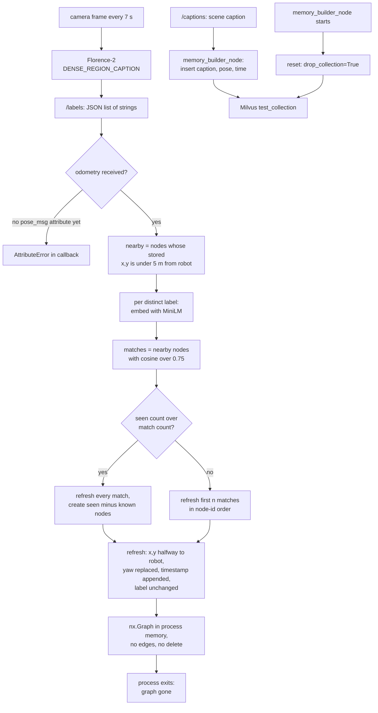

## 1. Executive Summary

EmbodiedLGR is the **code for a robotics paper**: *EmbodiedLGR: Integrating
Lightweight Graph Representation and Retrieval for Semantic-Spatial Memory in
Robotic Agents* by Paolo Riva, Leonardo Gargani, Matteo Frosi and Matteo
Matteucci ([arXiv:2604.18271](https://arxiv.org/abs/2604.18271), submitted 20
April 2026, v2 4 September 2026). A ROS 2 robot keeps two memories. A graph of
object labels, each at the pose the robot held when it saw them, answers
*where*, *when* and *what like this* through three services. A
[ReMEmbR](https://arxiv.org/abs/2409.13682) caption store in Milvus answers
richer scene questions as a fallback. A GPT-4o agent built on JPL's ROSA picks
between them.

What is notable is the graph's write rule: a label is matched to
existing nodes by embedding similarity only within a 5-metre radius, so
synonyms seen from one place converge. What is weak is everything around it:
the graph is an in-process NetworkX object with no edges, the vector store is
dropped at every builder start, and no test touches either.

**The repository is the paper's code, and the paper does not say so.** The
README's title is the paper's title, the repository description repeats the
paper's subtitle and names AirLAB at Politecnico di Milano, and the commits are
by the paper's first author. Neither the arXiv abstract page nor the v2 full
text links the repository. It was created on 19 November 2025; the pinned
commit, dated 10 April 2026, predates the paper's first version.

**Three things the paper describes are not what the code does.** The paper
says nodes are *"inserted and linked directly by spatial proximity and
embedding space distance"*; the code adds nodes to an `nx.Graph` and never adds
an edge. It says that when fewer objects are seen than are known, *"we update
the k-closest nodes with respect to the current position"*; the code updates
the first matches in node-id order. It says *"the pose's original yaw is
preserved"*; the code overwrites the yaw with the current one. Section 4 has
the anchors.

**The licence is split.** The repository is Apache-2.0, and `remembr/` is
NVIDIA's ReMEmbR under the NVIDIA License, whose section 3.3 limits the work
and its derivatives to non-commercial research or evaluation use. The memory
builder and the ReMEmbR server import from that tree, so a deployment of the
vector half inherits the restriction.

No capability mark. Section 9 names the seven withheld.

## 2. Mental Model

There are two memories and neither holds a belief in any stronger sense than
*the vision model said so*.

**A graph node is a label at a place, refreshed by re-sighting.** Every seven
seconds a camera frame goes to Florence-2 with the `<DENSE_REGION_CAPTION>`
task, and the labels it returns arrive on `/labels` as a JSON list of free-text
strings. For each distinct label the manager collects the existing nodes that
lie within 5 metres of the robot and sit above 0.75 cosine similarity to the
label's embedding. If the frame shows more instances than are known, every
known one is refreshed and the surplus become new nodes. Otherwise the first
*n* matches are refreshed. A refresh moves the node's x and y halfway to the
robot's current position, replaces its yaw and appends the timestamp. The node
keeps its original label: a later *mug* that matches a *cup* node refreshes
the *cup*.

**Nothing leaves the graph.** No path removes a node, lowers a score or marks
one stale. An object carried away keeps its node at the last place it was
seen, and its timestamp list stops growing. The graph dies whole when the
`graphmemory_manager` process exits, because it is never written anywhere.

**The node's position is the robot's.** The pose stored is the odometry pose
at the sighting, not an estimate of the object's location, and the paper says
the same. A *where is* answer is therefore where the robot stood, averaged over
sightings. The NaVQA scoring counts a position within 25 metres as correct,
which is loose enough for that to pass.

**A caption row is appended and never revised.** The ReMEmbR half stores one
row per caption with the robot's position, yaw and time, and never updates
one. It stops existing only when `memory_builder_node` starts, which drops the
whole collection.

**Retrieval is ordered by prompt, not by code.** The deployed agent's prompt
calls the graph *PRIMARY* and the vector store a fallback for richer visual
detail. The evaluator's prompt goes further: *"Always trust any POSITIVE answer
returned by the query_long_term_memory tool."* Neither memory carries a state
that could withhold a row from the model.

## 3. Architecture

The main container runs ROS 2 Jazzy with the `waffle_agent` package.
`objectdetection_node` and `captioner_node` post frames to a Florence-2 Flask
server on port 8001 in its own container (`captionerserver/`).
`graphmemory_manager` holds the graph and serves `search_by_label`,
`search_by_position` and `search_by_time`. `memory_builder_node` writes
captions into Milvus, which runs in a third container (`milvusserver/`).
`remembr_server.py` wraps the ReMEmbR agent in Flask on `0.0.0.0:8000` with one
`/query` route and no authentication.

The graph is a `networkx.Graph` with a sentence-transformer
(`all-MiniLM-L6-v2`) for label embeddings; every read is a Python loop over
every node (`graphmemory_manager.py:41-42`, `:319-467`). The vector store is
ReMEmbR's `MilvusMemory`: a 1,024-dimension `mxbai-embed-large-v1` text
embedding, a three-dimension position vector and a two-dimension time vector,
each with an IVF_FLAT index, in one collection
(`remembr/remembr/memory/milvus_memory.py:37-69`).

The `remembr/` tree is NVIDIA's upstream: 67 of its 68 files are
byte-identical to NVIDIA-AI-IOT/remembr `main`, compared by blob hash. The one
that differs, `agents/remembr_agent.py`, adds an OpenAI branch to
`llm_selector` and logging around the three retrieval tools. `src/rosa/` and
`tests/rosa/` are a copy of JPL's ROSA under its Apache-2.0 headers. The
Dockerfile installs `jpl-rosa` from PyPI without a version into the system
Python (`Dockerfile:152`, `:180`); the in-tree copy is installed only when
`DEVELOPMENT=true`, into a separate venv (`:143-150`).

### Deployment and ergonomics

Adopting this is standing up a robot stack: ROS 2 Jazzy, Gazebo Harmonic or a
real robot with odometry and a camera, a GPU for Florence-2, a Milvus
container, and an OpenAI key for the agent and for ReMEmbR. Nothing runs
offline, because both agents call GPT-4o. The install is a Docker build plus a
colcon build, then six terminals in the order the README gives. Neither store
is readable by hand: the graph exists only as Python objects, and the Milvus
rows are reached through its client.

## 4. Essential Implementation Paths

**Graph write.** `objectdetection_node.timer_callback` encodes the latest frame
and posts it with `task=<DENSE_REGION_CAPTION>`, then publishes the returned
`labels` list as JSON on `/labels` (`objectdetection_node.py:34`, `:96-130`).
`BatchSemanticGraph.labels_callback` decodes it and calls `process_batch` when
a pose has arrived (`graphmemory_manager.py:102-126`). `process_batch` gathers
nodes within `SPATIAL_THRESH = 5.0` of the robot (`:146-162`), then per label
embeds it and collects matches above `SEMANTIC_THRESH = 0.75` (`:168-185`), and
reconciles (`:211-222`). `create_node` stores label, embedding, pose and a
one-element timestamp list (`:273-283`); `update_node` averages x and y with
`alpha = 0.5`, writes the current yaw and appends the time (`:285-296`).

**Where the paper and the code part.** The only `add_edge` calls in the tree
are the LangGraph workflow inside ReMEmbR and a commented line under
`unused/`. The k-closest rule is `existing_matches[i]` for
`i in range(count_seen)`, with `existing_matches` built in graph iteration
order and never sorted by distance (`:178-185`, `:220-222`). The yaw is
`current_robot_pose[2]` (`:293`). The paper's position update is on
*{x, y, z}*; the node's `pos` tuple is (x, y, yaw) and holds no z (`:274`).
`ANGLE_THRESH` is declared and marked *UNUSED*, its check commented out
(`:37`, `:155-159`).

**Graph read.** Three service callbacks. `labelsearch_callback` embeds the
query, scores every node by cosine and returns the top `top_k_return`, default
60, with no floor (`:33`, `:319-343`). `positionsearch_callback` ranks by 2D
distance and returns the full (x, y, yaw) (`:358-392`).
`timesearch_callback` takes each node's closest sighting to the query time and
ranks by the absolute difference (`:432-467`).

**Vector write.** `MemoryBuilderNode` subscribes to `/odometry` and
`/captions`, constructs `MilvusMemory`, and calls `self.memory.reset()` in its
constructor, whose default is `drop_collection=True`
(`memory_builder_node.py:37-47`; `milvus_memory.py:139-144`). Each caption
becomes a `MemoryItem` with the pose's header time and is inserted with a
fresh embedding under `id = str(time.time())`
(`memory_builder_node.py:71-93`; `milvus_memory.py:122-134`).

**Vector read.** `remembr_server.py` constructs
`MilvusMemory("test_collection")`, whose own constructor resets with
`drop_collection=False`, and serves `ReMEmbRAgent(llm_type="gpt-4").query` at
`/query` (`remembr_server.py:11`, `:40-58`; `milvus_memory.py:119`). The
agent's three tools are text search through a LangChain retriever with `k=5`,
and position and time search through a nearest-vector call with `k=4` and no
filter expression (`milvus_memory.py:153`, `:173-227`, `:254-312`).

**Agent tools.** `tools/waffle.py` wraps the three services and the Flask call
as LangChain tools — `query_graph_memory_semantical`,
`query_graph_memory_positional`, `query_graph_memory_by_time` and
`query_long_term_memory` — beside `get_robot_pose` and `navigate_to_position`
(`tools/waffle.py:69-409`). `TurtleAgent` hands the module to ROSA as a tool
package beside ROSA's own ROS 2 tools (`waffle_agent.py:56-66`).

**Offline evaluation.** `json_memory_populator` replays a preprocessed CODa
caption file, publishing odometry, captions and dense labels for each frame
(`json_memory_populator.py:21-24`, `:39-72`). `evaluator_node` selects the
graph tools, the ReMEmbR tool or both from `memory_mode`
(`evaluator_node.py:58`, `:74-78`).

## 5. Memory Data Model

A graph node is a NetworkX node keyed by an incrementing integer with four
attributes: `label` (string), `embedding` (numpy vector), `pos` (x, y, yaw) and
`timestamps` (a list of floats) (`graphmemory_manager.py:276-282`). The
service response type `GraphResult` carries `node_id`, `label`, a float
`score` whose meaning differs per service — similarity, distance or seconds —
and `position` (`src/waffle_agent_msgs/msg/GraphResult.msg`).

A ReMEmbR row has `id`, `text_embedding`, `position`, `theta`, `time` as a
two-element vector with a fixed offset of 1,721,761,000 subtracted, and
`caption` (`milvus_memory.py:17`, `:37-45`, `:130`).

There is no scope key, no author or source, no status and no confidence on
either. The timestamp list is the one temporal field on a node and records
sightings; nothing records when the node was written or changed. There are no
edges, so there are no relations between objects.

## 6. Retrieval Mechanics

Retrieval is tool-mediated: the model decides which service to call and with
what. Each graph service is exhaustive and unthresholded, so a semantic query
for an object never seen still returns 60 nodes with their similarity, and the
model must judge from the numbers that none matches. The prompt's
*"If an object is not in your memory, state that clearly"* is the only defence
(`prompts.py:33`).

Label search compares the query against the label text Florence-2 produced,
which is often a phrase. Position search ignores yaw in the distance and
returns it. Time search returns every node with any sighting, ranked by the
nearest one, so a node seen once at the query time and a node seen constantly
tie at zero.

The ReMEmbR agent is its own LLM loop over Milvus, reached as one tool call
with a natural-language question. The evaluation prompt tells the outer model
to pass the user's full question through verbatim, with its position and the
current time (`evaluator_node.py:202-205`). Neither path budgets tokens: a
graph call returns 60 JSON objects and a ReMEmbR call returns whatever its
agent generates.

## 7. Write Mechanics

Writes are automatic, driven by perception timers, with no model in the graph
path beyond Florence-2 and the sentence embedder. Deduplication is the
radius-plus-similarity match. Two labels in one frame that both clear 0.75
against the same node each refresh it, so the node moves twice and gains two
timestamps for one frame (`graphmemory_manager.py:174-222`).

The match radius is measured from the robot's current position to the node's
stored position, which is itself an average of robot positions. An object seen
from two places more than 5 metres apart becomes two nodes.

Nothing filters input. A label is whatever the vision model returned, and any
process on the ROS domain can publish to `/labels` or `/captions`.

`labels_callback` reads `self.pose_msg`, which the constructor never assigns;
only `pose_callback` does (`:97-98`, `:120`). A label message arriving before
the first odometry raises `AttributeError` inside the callback rather than
reaching the *"No odometry received"* branch. `update_plot` guards the same
attribute with `hasattr` (`:472`); the callback does not.

### Operational cost

The agent does not block on writes; they happen in separate nodes as frames
arrive. A label is retrievable once Florence-2 returns and the manager's loop
finishes, bounded below by the 7-second timer. Each label is embedded and
compared against every nearby node, so a write is linear in the graph. No
background pass rewrites either store. On the read path a graph call returns
up to 60 nodes and is unbounded in characters, and ROSA accumulates chat
history across turns (`waffle_agent.py:64`).

## 8. Agent Integration

The deployed agent is ROSA on GPT-4o with the four memory tools and
navigation. The prompt fixes the routing: graph first for objects, positions,
counts and times; the vector store only for richer visual context or when the
graph fails (`prompts.py:27-36`). The model cannot write memory through these
tools; all six waffle tools read or move the robot.

ROSA's own ROS 2 tools sit in the same registry, with `master` and `docker`
blacklisted (`waffle_agent.py:41`, `:56-66`). In the in-tree ROSA copy those
tools build a command string and run it with `shell=True` after checking only
the first two tokens, and `ros2_service_call` places the model's `request`
argument inside double quotes (`src/rosa/tools/ros2.py:25-48`, `:329-342`).
Whether the PyPI release the image installs behaves the same was not checked.

The evaluator is a second integration: a LangChain `CHAT_ZERO_SHOT_REACT`
agent with at most eight iterations, then a second GPT-4o call that turns the
answer into JSON before scoring (`evaluator_node.py:351-362`, `:405-418`).

## 9. Reliability, Safety, and Trust

**Durability is the first gap.** The graph is lost on any restart of its node.
The vector store survives restarts of the ReMEmbR server and the agent, and is
dropped by the next start of `memory_builder_node`. A robot that reboots
forgets everything; a robot that restarts only its builder forgets its scene
descriptions and keeps its object graph, until that node restarts too.

**The collection name is composed twice.** The builder reads a `db_collection`
parameter defaulting to `test_collection`; the server hardcodes
`"test_collection"` (`memory_builder_node.py:18`; `remembr_server.py:11`).
Setting the parameter makes the builder write where the server never reads.

**Model output reaches `eval`.** The vendored ReMEmbR agent parses its LLM's
answer with Python `eval` whenever the answer lacks a JSON fence
(`remembr/remembr/agents/remembr_agent.py:458-461`, `:545-547`). That answer is
generated over retrieved captions, which are vision-model text about whatever
the camera saw. It runs in a Flask process listening on all interfaces without
authentication. Both lines are unchanged from NVIDIA's upstream.

**Provenance and correction.** A node records no source frame and no
confidence, so a wrong label cannot be traced to an image or told apart from a
right one. A wrong node can only be overwritten by re-sighting, which moves it
and never relabels it.

**Marks withheld, all seven.** `tombstone`: nothing records a rejected value,
and nothing rejects. `trust_state`: no status field on either store.
`bitemporal`: the timestamps are sighting times only, with no record time
beside them, and the Milvus `time` is the same capture time.
`scope_enforced`: no scope key on a node or a row and no `expr` on any Milvus
search; one graph per process is a physical partition. `audit_log`: `logs/`
holds interaction logs of queries and answers, not mutations, and nothing logs
a node update. `human_review`: no surface where a person inspects or admits a
node. `negative_eval`: the only tests are ROSA's, and none reads either store.

## 10. Tests, Evals, and Benchmarks

The 125 test functions in `tests/rosa/` are ROSA's unit tests for its
calculation, log, ROS 1, ROS 2 and system tools. None imports `waffle_agent`,
`remembr` or the graph manager. The graph write rule, the three services and
the Milvus path have no test.

The evaluation is a NaVQA harness. `coda_player` extracts captions, labels and
dense labels from CODa sequences, `form_question_jsons.py` builds questions,
`json_memory_populator` replays a sequence into both stores and
`evaluator_node` scores answers. A position counts as correct within 25 metres
and a time within 180 seconds, matching the paper's stated thresholds
(`evaluator_node.py:438`, `:453`). Preprocessed Florence-2 captions for six
sequences are committed under `utility/navqa-captions-processed/`; no result
file is. The README's evaluation command runs `rosa_navqa_evaluator`, which is
the node's name; the console-script entry point is `evaluator_node`
(`src/waffle_agent/setup.py:36`).

The paper reports on 120 NaVQA questions. With Florence-2-large, graph memory
alone averages 14.29% accuracy at 9.97 s per answer, ReMEmbR alone 29.11% at
19.79 s, and the two together 33.90% at 23.73 s, falling back to the vector
store on 80.83% of questions (its Tables I and II). The graph alone
underperforms the baseline it is paired with, and the combined system answers
most questions through that baseline. These are the paper's numbers; nothing
was run for this report and no committed artifact recomputes them.

Before trusting the graph I would want a replayed sequence asserting node
count and positions after known sightings, a test that an unseen object's
label search is distinguishable from a seen one, and a restart test for both
stores.

## 11. For Your Own Build

### Steal

- **Gate label deduplication by place before similarity.** Matching a new
  label only against nodes within a radius, then by embedding similarity,
  merges synonyms seen from one spot without merging two cups in two rooms. It
  is cheap and needs no model call.
- **Give the model typed query services, one per axis.** Separate semantic,
  positional and temporal lookups that return structured JSON let the model
  compose *near me* and *when* questions with coordinates it can navigate to,
  instead of parsing prose.
- **Make the backend set a run parameter.** One evaluator that loads graph
  tools, vector tools or both from a flag is the cheapest honest ablation of a
  hybrid memory.

### Avoid

- **A memory that lives only in a service process.** An in-process graph with
  no snapshot turns every crash, redeploy and reboot into total amnesia, and a
  robot is the platform where those happen most.
- **A reset in the writer's constructor.** Dropping the store whenever the
  ingest node starts makes a routine restart a deletion, and puts the
  destructive call where nobody reads it.
- **An unthresholded top-k as the only negative.** Returning 60 nodes for a
  query that matches none hands the *not in memory* decision to the model's
  reading of cosine scores.
- **Storing the observer's pose as the object's.** It is cheap and passes a
  loose metric, and it caps position accuracy at the camera's range.

### Fit

This is research code for one paper's experiment, and it reads that way: a
working pipeline for a NaVQA run, with commented-out earlier versions of most
functions left in place, an `unused/` directory and no tests. A robotics group
reproducing the paper, or comparing a place-gated object graph against ReMEmbR
on NaVQA, has what it needs here. Anyone wanting a robot memory to keep will
need persistence, edges, removal and a licence decision about the vector half
first, which is most of the work. For a durable object graph with an arbiter
and tests, [Chronotope](../tempomem/) is the closer starting point; for local
repair after the world changes, [DovSG](../dovsg/).

## 12. Open Questions

- Does an exception in `labels_callback` stop `rclpy.spin` for the manager, or
  is it logged and the node keeps serving? That decides whether the missing
  `pose_msg` initialisation is cosmetic or fatal.
- Which ROSA runs in the image as built at the pin date — the unpinned PyPI
  `jpl-rosa` at which version — and does its `ros2_service_call` quote
  arguments the same way?
- Was the real-robot deployment the paper describes run from this tree, or
  from a branch not pushed? The launch scripts in the tree target Gazebo and a
  Scout base.
- Were the paper's k-closest and preserved-yaw rules in the code that produced
  Tables I and II, at a commit not on `main`?

## Appendix: File Index

- **Graph memory:** `src/waffle_agent/waffle_agent/graphmemory_manager.py`,
  `src/waffle_agent_msgs/msg/GraphResult.msg`,
  `src/waffle_agent_msgs/srv/SearchByLabel.srv`, `SearchByPosition.srv`,
  `SearchByTime.srv`.
- **Perception writers:** `src/waffle_agent/waffle_agent/objectdetection_node.py`,
  `captioner_node.py`, `captionerserver/captioner_server.py`.
- **Vector memory:** `src/waffle_agent/waffle_agent/memory_builder_node.py`,
  `remembr_server.py`, `remembr/remembr/memory/milvus_memory.py`,
  `remembr/remembr/memory/memory.py`, `remembr/remembr/agents/remembr_agent.py`.
- **Agent:** `src/waffle_agent/waffle_agent/waffle_agent.py`,
  `tools/waffle.py`, `prompts.py`, `src/rosa/tools/ros2.py`.
- **Evaluation:** `src/waffle_agent/waffle_agent/evaluator_node.py`,
  `json_memory_populator.py`, `coda_player.py`,
  `utility/evaluation_scripts_patch/`, `utility/navqa-captions-processed/`.
- **Build:** `Dockerfile`, `src/waffle_agent/setup.py`, `LICENSE`,
  `remembr/LICENSE.md`.
- **Tests:** `tests/rosa/`.

### Recorded searches

Checked against the checkout at the pinned revision with `/usr/bin/git grep`.

- `git grep -n -E 'add_edge|add_edges_from|\.edges\('` — `remembr/remembr/agents/remembr_agent.py:526`, `:528` (LangGraph workflow) and a commented line in `unused/graph_test/graphtest.py:29`; no edge on the memory graph.
- `git grep -n -E 'pickle|gpickle|write_gml|node_link_data|nx\.write|open\(' -- src/waffle_agent/waffle_agent/graphmemory_manager.py` — no match; the graph is never written out.
- `git grep -n -E 'remove_node|remove_nodes_from'` — no match.
- `git grep -n -E 'self\.graph\.(add_node|nodes\[)' -- src/waffle_agent` — live writers at `graphmemory_manager.py:276`, `:286`, `:293`, `:296`; the rest are commented.
- `git grep -n -E 'create_service' -- src ':!src/rosa'` — the three search services at `graphmemory_manager.py:66`, `:72`, `:78`; no write or delete service.
- `git grep -n -E 'pose_msg' -- src/waffle_agent/waffle_agent/graphmemory_manager.py` — assigned only at `:98`, inside `pose_callback`.
- `git grep -n -E 'reset\(' -- src/waffle_agent remembr_server.py` — `memory_builder_node.py:46` live; `remembr_server.py:12` commented.
- `git grep -n -E 'expr' -- remembr/remembr/memory` — a commented `expr` at `milvus_memory.py:96` and the unused default parameter at `:259`, `:299`; no filter on any search.
- `git grep -n -i -E 'user_id|session_id|tenant|agent_id|namespace' -- src/waffle_agent remembr/remembr/memory remembr_server.py` — a commented Azure `tenant_id` in `llm.py:34` and a committed colcon build log; no scope key.
- `git grep -n -i -E 'status|verified|confidence|trust' -- src/waffle_agent/waffle_agent/graphmemory_manager.py src/waffle_agent/waffle_agent/tools remembr/remembr/memory` — only HTTP and Nav2 status codes in `tools/waffle.py`; no memory status.
- `git grep -n -i -E 'graph|milvus|remembr|memory' -- tests` — ROS 1 `rosgraph` tests only.
- `git grep -n -E 'rosa_navqa_evaluator'` — `README.md:124` and the node name at `evaluator_node.py:54`; not an entry point.
- `git ls-files | grep -E 'eval_results|evaluation_results|\.csv$'` — only `remembr/remembr/data/navqa/data.csv`, ReMEmbR's input; no result file.
- `git grep -n -i -E 'arxiv|bibtex|@article|@misc|doi\.org|CITATION' -- ':!remembr'` — no match; the only citation in the tree is in ReMEmbR's own README.

## History

**2026-09-28** — [`3593e6a459e5099704b4e5577e4d4339dd2bf8dc`](https://github.com/paolorv/lgr-agent/commit/3593e6a459e5099704b4e5577e4d4339dd2bf8dc) — first reading, at the head of `main`, a commit dated 10 April 2026. No mark. Confirmed as the code for [arXiv:2604.18271](https://arxiv.org/abs/2604.18271) by title, first author and method. Screened before reading: no auto-run surface, five build-time execution points (`setup.py` files, two under `unused/` and `utility/old_src/`), five unpinned dependency surfaces, nothing inside the cooldown; no `AGENTS.md` or `CLAUDE.md`. The vendored `remembr/` was compared with NVIDIA-AI-IOT/remembr by blob hash. Read with `git grep` and `sed`; nothing installed, built or run.
