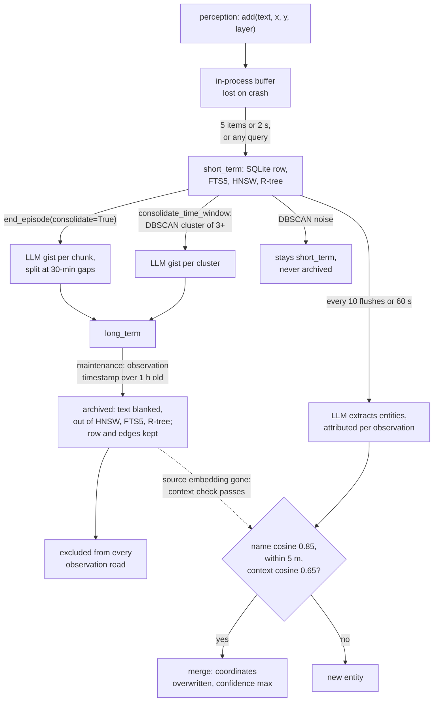

## 1. Executive Summary

eMEM is an **embedded spatio-temporal memory for robots**: a Python library in
which a perception stack records observations — a VLM caption, a detector's
object list, a battery reading — each with a position, a timestamp and a
perception layer, and an LLM agent reads them back through ten tools that
query by meaning, place and time. It is the code of *eMEM: A Hybrid
Spatio-Temporal Memory System For Embodied Agents*
([arXiv:2606.03374](https://arxiv.org/abs/2606.03374), submitted 2 June 2026,
v2 22 June 2026), and the memory layer of Automatika Robotics' EMOS stack.

What is notable is that the three axes share one filter set. A semantic search
can be restricted to a radius, a time window, a layer and an episode in the
same call, and `locate` turns a phrase such as *"kitchen"* into a centroid and
spread that `recall` then queries spatially. Entity extraction attributes each
entity to the observation it came from and refuses a merge when the two source
texts disagree.

What is weak is the lifecycle. Nothing can be deleted or corrected. Archival is
keyed on how old an observation is, not on how long it has been consolidated,
and observations DBSCAN calls noise are never archived at all. The benchmark's
two external baselines are eMEM with fewer tools.

The `LICENSE` file is MIT and so is the `pyproject.toml` classifier. The
README's last line reads *"All rights reserved. Copyright (c) 2024 Automatika
Robotics."* The file is the grant; the README line contradicts it.

The paper names the repository as `automatikarobotics/emem` in its footnote,
in both versions; that URL returns 404. The code is at
`automatika-robotics/emem`, created 7 March 2026, whose first commit reads
*"Initial public commit"*.

One mark: `negative_eval`, on two CI-run cases asserting an archived
observation stays out of a radius query and out of the BM25 arm, each after a
positive control. Section 9 names the six withheld.

## 2. Mental Model

A memory is an observation, and it is taken as true when it is written.
Perception is the only producer: the agent's tool surface has no write verb,
so the model can read memory and never author it (`emem/tools.py:674-685`).
There is no candidate state, no verification and no contradiction handling.
`confidence` is stored and never read by a filter.

An observation moves through tiers, and each move is triggered by a call, not
by a timer. `add` puts it in an in-process buffer; a flush writes it as
`short_term` to SQLite, FTS5, HNSW and the R-tree. `end_episode` summarises the
episode into gists, one per run of observations without a 30-minute gap, and moves its observations to `long_term`
(`emem/consolidation.py:225-255`). `consolidate_time_window` clusters old
`short_term` observations with DBSCAN and does the same per cluster
(`:257-292`). `maintenance` archives `long_term` rows: the text becomes `''`
and the row leaves every index, but the row, its coordinates and its edges
stay (`emem/store.py:534-564`).

**Archival is forgetting, and it is the only way a memory stops being one.**
Every observation read path filters `tier != 'archived'`, so an archived
observation survives only through the gist that summarised it. A gist or an
entity never dies: no path deletes, archives or supersedes either.

**Two parts of the lifecycle do not do what the configuration says.** The
archive query selects `long_term` rows whose observation `timestamp` is older
than the cutoff (`emem/store.py:1643-1646`, `emem/consolidation.py:294-314`),
while the setting is commented *"seconds in long_term before archival"*
(`emem/config.py:26`). No column records when a row was promoted, so all but the
last hour of a six-hour episode is archived by the first `maintenance()` after
the episode ends, and the two-phase interval the paper describes never happens
for it. And DBSCAN's noise points stay `short_term`
(`emem/consolidation.py:363-364`); archival never selects that tier, so an
isolated observation is searchable for as long as the file exists and is
re-clustered on every call.

**Entities are the one mutable belief.** An LLM names objects in a batch of
observations; each candidate merges into an existing entity when the name
embedding is within cosine 0.85, the position within 5 m, and the source
observation's text embedding within cosine 0.65 of the stored one
(`emem/store.py:701-800`). A merge overwrites the entity's coordinates with the
new sighting's and keeps the higher confidence
(`emem/consolidation.py:509-522`).

## 3. Architecture

`SpatioTemporalMemory` is a facade over four in-process parts: a
`WorkingMemory` buffer, a `MemoryStore`, a `ConsolidationEngine` and
`MemoryTools` (`emem/memory.py:36-69`). There is no server, worker or thread;
every operation runs on the caller's thread.

`MemoryStore` holds one SQLite connection in WAL mode with six tables and an
FTS5 virtual table over observation and gist text with the Porter tokenizer
(`emem/store.py:76-178`). One hnswlib cosine index holds vectors for
observations, gists and entities, with the integer-to-UUID map in the
`hnsw_mappings` table (`:53-70`, `:294-312`). The R-tree lives in memory and
is rebuilt from SQLite coordinates on every start (`:198-207`,
`emem/spatial.py`).

Embeddings come from a protocol: a sentence-transformers wrapper, a callable
wrapper for EmbodiedAgents' Ollama client, or a null provider that returns
zero vectors (`emem/embeddings.py`). The LLM is a protocol with `summarize`,
`synthesize` and `extract_entities`; without one, gists are the observations
joined with `|` and no entities are extracted (`emem/consolidation.py:179-195`).

### Deployment and ergonomics

- **Running:** nothing but the process. Dependencies are numpy, hnswlib, Rtree
  and scikit-learn; Rtree needs `libspatialindex`.
- **Offline:** fully, with a local embedder and LLM. With neither, the store
  keeps zero vectors and concatenated gists, and BM25 is the only working
  semantic arm.
- **API key:** none required to store anything.
- **Install:** `pip install emem`.
- **Repair by hand:** SQLite is readable. The HNSW file is binary and is
  written only by `save()` and `close()` (`emem/store.py:1686-1694`).

## 4. Essential Implementation Paths

**Capture.** `SpatioTemporalMemory.add` builds an `ObservationNode` with
`timestamp or self._get_time()` and hands it to `WorkingMemory.add`
(`emem/memory.py:102-145`). The buffer stamps the active episode, sets tier
`working`, updates `current_position` unless the source is interoception, and
flushes on five items or two seconds (`emem/working_memory.py:41-66`).
`add_body_state` is `add` with `source_type="interoception"`
(`emem/memory.py:147-193`).

**Flush.** `WorkingMemory.flush` sets tier `short_term` and calls
`add_observations_batch`, which embeds the batch, inserts rows, adds each
vector to HNSW, inserts FTS5 text, adds the R-tree point and writes a
`BELONGS_TO` edge, all under one lock and one commit (`emem/store.py:352-409`).
The flush callback feeds the entity buffer (`emem/memory.py:71-98`).

**Entity extraction.** `_extract_and_merge_entities` skips observations already
flagged `entities_extracted`, asks the LLM for a JSON array with a 1-based
`observation_index`, resolves each entity to its observation, calls
`find_matching_entity`, updates or inserts, writes `OBSERVED_IN` and
`COOCCURS_WITH` edges, and sets the flag (`emem/consolidation.py:422-579`).

**Consolidation.** `end_episode` flushes, drains the entity buffer, calls
`consolidate_episode`, and stores the joined gist text on the episode row
(`emem/memory.py:219-252`). `consolidate_episode` splits at gaps over 30 minutes,
writes one gist per chunk with `SUMMARIZES` edges, and promotes the
observations (`emem/consolidation.py:225-255`, `emem/store.py:472-519`).

**Retrieval.** `MemoryStore.semantic_search` runs `semantic_search_by_vector`
at twice the requested count, BM25 over observations and gists, a Python
re-filter of the BM25 hits, and `_rrf_merge` with k=60
(`emem/store.py:1039-1098`). The vector path over-fetches five times, splits
candidates by node type, and applies layer, time, episode and radius in SQL
per type (`:1152-1325`).

**Forgetting.** `archive_long_term` calls `update_observation_tiers` with
`drop_text=True`, which blanks the text, calls `mark_deleted` on the HNSW
label, deletes the FTS5 row and removes the R-tree point
(`emem/consolidation.py:294-314`, `emem/store.py:534-564`).

**Agent surface.** `get_tool_definitions` and `dispatch_tool_call`, which
checks the tool name and passes the model's arguments as keyword arguments
(`emem/tools.py:1149-1174`).

**Tests.** `tests/test_store.py`, `tests/test_consolidation.py`,
`tests/test_tools.py`, `tests/test_memory.py`, `tests/test_integration.py`;
the harness tests live under `tests/test_harness/`.

## 5. Memory Data Model

Four node tables and one edge table (`emem/store.py:76-178`,
`emem/types.py`):

- `observations`: text, `x y z`, `timestamp`, `layer_name`, `source_type`,
  `confidence`, `episode_id`, JSON `metadata`, `tier`, `has_embedding`,
  `entities_extracted`.
- `episodes`: name, start and end time, `status`, the joined gist text,
  `parent_episode_id`.
- `gists`: text, centre and radius, `time_start`, `time_end`, the source count
  and a JSON list of source ids, `layer_name` when every source shared one,
  `episode_id`.
- `entities`: name, `x y z`, `first_seen`, `last_seen`, `observation_count`,
  `confidence`, `entity_type`, `layer_name`.
- `edges`: `BELONGS_TO`, `SUBTASK_OF`, `SUMMARIZES`, `OBSERVED_IN` and
  `COOCCURS_WITH` have writers. `FOLLOWS` is declared and has none.

**Time is one axis.** `timestamp` is whatever the caller passes, defaulting to
now; there is no ingest time beside it. A gist's span is its sources' span.

**Scope is a physical file.** There is no user, agent or tenant column; one
instance is one SQLite file and one HNSW file. `layer_name` separates
perception sources and `episode_id` separates tasks, and both are optional
filters the caller chooses.

**The graph is written more than it is read.** On the live paths the only edge
query is the one `find_matching_entity` makes, joining the newest
`OBSERVED_IN` edge to find an entity's source observation
(`emem/store.py:969-990`). `get_cooccurring_entities` and
`get_entity_observations` have callers only in tests, and no tool traverses an
edge. The paper's example query *"what objects appear together with the red
chair?"* has no tool. Each extraction writes new `COOCCURS_WITH` rows under
fresh ids, so a pair seen often accumulates duplicate edges.

`EpisodeStatus.ABANDONED` has no writer; episodes are `active` or `completed`.

## 6. Retrieval Mechanics

Retrieval is tool-mediated: nothing is injected automatically. The ten tools
split into three kinds.

**Fused semantic search.** `semantic_search` returns observations, gists and
entities in one ranking, fused by reciprocal rank between a dense top-k and a
BM25 top-k. FTS5 is populated at every insert whatever the flag, so hybrid
retrieval can be switched per configuration without re-ingesting
(`emem/config.py:38-44`). The raw query is double-quoted with inner quotes
doubled before `MATCH`, so an FTS5 operator in a model's query is matched as
text (`emem/store.py:232-245`).

**The two arms do not filter gists the same way.** The dense arm drops a gist
whose `layer_name` differs from the requested layer (`emem/store.py:1251-1253`).
The BM25 re-filter for gists checks time, episode and radius and not layer
(`:1135-1149`). A layer-restricted search can therefore return a cross-layer
gist, or one from another layer, whenever BM25 matches it. The spatial test
also differs: the dense arm requires the gist centre inside the radius, while
the BM25 arm admits any gist whose disc overlaps it (`:1147`, `:1261-1270`).

**Structured queries.** `spatial_query` takes R-tree candidates and filters in
SQL; `temporal_query` falls back to gists overlapping the window when no
observation is left (`emem/tools.py:775-838`). `entity_query` is a `LIKE` on
the name. `body_status` returns the newest reading per interoception layer.

**Composed queries.** `locate` runs a semantic search and returns the centroid
and maximum spread of the hits' coordinates; `recall` runs `locate`, then a
radius query, `search_gists_by_area` and an entity query around the centroid
(`emem/tools.py:1001-1120`). `get_current_context` does the same around the
last non-interoception position, plus five minutes of recent observations and
the body status (`:879-933`).

**Area summaries come back oldest-first.** `search_gists_by_area` is `SELECT *
FROM gists WHERE` distance `LIMIT ?` with no `ORDER BY`
(`emem/store.py:1576-1587`). With no index on the centre columns, SQLite
returns rowid order, so a robot that patrols one room daily gets that room's
first five gists from `get_current_context` and `recall`, never the latest.

**Failure modes.** Filters apply after the vector over-fetch, so a narrow
radius or layer can return fewer hits than exist. `search_gists` sizes its
top-k from `get_current_count()`, which includes labels marked deleted by
archival, where `semantic_search_by_vector` sizes it from the live map
(`emem/store.py:1522-1524`, `:1179-1184`). Whether hnswlib raises when the live
set falls below that k was not run here. Recency weighting exists and is off by
default (`emem/config.py:46-48`).

## 7. Write Mechanics

Writes are explicit calls from the host application, never from the model.
Observations append; nothing updates an observation except the tier column and
the text blanking at archival. There is no dedup of observations.

**Entity merge is the only update, and it has three weaknesses.**

- A merge replaces the entity's coordinates with the new sighting's
  (`emem/consolidation.py:510`). The paper says merged coordinates are
  averaged. An object seen once in the wrong place moves there.
- Attribution maps `observation_index` to text and text back to an
  observation through a dict keyed on text (`:451-453`). Two observations in
  one batch with the same text, such as *"a red chair"* at two positions,
  collapse to the later one, and both entities anchor there.
- The context gate compares against the embedding of the entity's newest
  source observation and returns `True` when that embedding is missing
  (`emem/store.py:814-819`). Archival removes it from HNSW, so once an
  entity's latest sighting is archived, the gate stops applying and a generic
  name merges on name and distance alone.

**Consolidation can summarise an observation twice.** `consolidate_time_window`
selects `short_term` rows regardless of episode, and `consolidate_episode`
reads every observation of the episode regardless of tier
(`emem/store.py:1004-1009`). If the host runs the first during a long episode,
the episode's older observations get a time-window gist and then an episode
gist.

**Malicious input is not filtered.** Observation text reaches the gist prompt,
the entity prompt and every tool result verbatim. The FTS5 escaper is the only
sanitisation, and it protects the query, not the content.

### Operational cost

- **Blocking.** A flush embeds synchronously inside the `add` that triggers it.
  Every tenth flush or sixtieth second, that same `add` also runs entity
  extraction, one LLM call per 16 observations. `end_episode` runs one LLM
  summary per chunk before it returns.
- **Lag.** Every query flushes the buffer first, so an observation is
  retrievable by the next query. An entity appears after up to ten flushes or
  sixty seconds, checked only when a flush happens.
- **Background passes.** None run unless called. `consolidate_time_window`
  re-reads every old `short_term` row each call, including every noise point
  that will never leave that tier.
- **Injection.** Bounded per tool: ten results by default;
  `get_current_context` returns up to ten nearby observations, five gists, ten
  entities, ten recent observations and one line per body layer.

## 8. Agent Integration

The tools are OpenAI function schemas whose descriptions route the model
between them: *"Do NOT use for time-focused questions (use temporal_query)"*
(`emem/tools.py:21-474`). `get_tools_for_registration` wraps each as a callable
for EmbodiedAgents' `LLM.register_tool()` (`emem/memory.py:388-410`). The
relative-time parser accepts `-10m`, *"2 hours ago"* and *"last week"* so a
weak tool-caller does not spend steps on format (`emem/tools.py:477-590`).

The model has no write, no delete and no correction verb. That keeps a
hallucinated fact from entering memory through the tool surface; it also means
a wrong perception can be corrected by nobody, the operator included, because
the library has no delete either.

The surface would adapt to another agent as a read-only memory tool set with
little work. The write side assumes a perception pipeline that knows its own
position.

## 9. Reliability, Safety, and Trust

**Provenance** is the layer name, the source type, the observation id and, for
entities, the `OBSERVED_IN` edge to the source observation. A gist records its
source ids; after archival those ids point at rows with empty text.

**Crash behaviour.** The buffer is in process, so up to five observations or
two seconds of them are lost on a crash. HNSW is written only on `save()` or
`close()`, while the `hnsw_mappings` rows commit with every batch
(`emem/store.py:308-312`, `:1686-1694`). After a crash the index file lacks
every vector added since the last save; those observations keep their FTS5
entries and lose the dense arm permanently, with nothing reporting it.

**Concurrency.** One SQLite connection is shared across threads, with a lock
around writes and none around reads (`emem/store.py:44-47`).

**Delete semantics.** There are none to request. Archival blanks text and
removes vectors from the live index with `mark_deleted`, which leaves the
vector in the file. Coordinates, timestamps, layer, gists built from the text
and entities extracted from it all persist.

**The capability marks.**

- `negative_eval` — **awarded.** See the record above; it covers the radius
  query and the BM25 arm, not the dense arm.
- `tombstone` — withheld. Nothing records a rejected value; there is no
  rejection. Archival is keyed on the row and age.
- `trust_state` — withheld. `confidence` is a float no read filters on (see
  Recorded searches). The tier column does withhold archived rows from
  retrieval, but it is retention by age, not a judgement that a memory is
  false, and its text is erased rather than kept as unbelieved.
- `bitemporal` — withheld. One caller-supplied `timestamp`; no record time.
- `scope_enforced` — withheld. No scope key exists; one file is one memory, a
  physical partition. Layer and episode filters are optional and model-chosen.
- `audit_log` — withheld. Entity updates overwrite in place and nothing logs a
  mutation.
- `human_review` — withheld. There is no review surface. The agent has no
  write verb, which removes the question rather than answering it.

## 10. Tests, Evals, and Benchmarks

**Unit and integration tests.** 469 pytest functions; CI runs the suite with
the `ollama`, `gemini`, `minigrid`, `ai2thor` and `slow` markers excluded on
Python 3.8 to 3.12 (`.github/workflows/tests.yml`). The store tests cover
insert, the three query kinds, hybrid fusion, the FTS5 escaper, archival and
persistence. The consolidation tests cover chunking, DBSCAN noise, cross-layer
synthesis, per-observation attribution, and the context gate refusing a merge.

**What is asserted and what only looks asserted.** Two cases carry the mark
(record above). Three nearby ones assert less than they read. In
`tests/test_memory.py:162-171` a comment says `end_episode` archives the
observations and the test asserts only that a search returns something; the
observations are `long_term`. In `tests/test_integration.py:218-224` the
archived check is a loop over results in a store where nothing was archived.
`test_gists_survive_archival` states the observation's exclusion in a comment
and asserts only the gist (`tests/test_store.py:266-287`). No test has two
same-text observations in one extraction batch, merges an entity after its
source is archived, or asserts a layer filter on the BM25 gist path.

**The paper's evaluation.** eMEM-Bench v1 is eight cognitive-psychology
paradigms over 20 ProcTHOR-10K houses, 988 probes, scored 1 to 5 by
`gemma3:27b` and reported as 80.8 weighted
([arXiv:2606.03374](https://arxiv.org/abs/2606.03374), Table 4). The paradigm
generators, schedules, runner and scorer are committed under
`harness/benchmarks/academic/emem_bench_v1/`. No trajectory, probe set or
result file is committed, so no number recomputes from the tree. The README's
benchmark table describes a different eMEM-Bench: 492 questions over 12 scenes.

**The baselines are eMEM with fewer tools.** The paper describes Flat-RAG as
*"semantic search over a vector store and a timestamp filter and nothing
more"* and Gen-Agents as a recency-weighted stream. In the committed harness
both are `AblationConfig` entries over the same store
(`harness/benchmarks/academic/ablation.py:86-111`). The v1 runner builds each
from the same factory and reads only `available_tools` and
`mem_config_overrides` (`harness/run_benchmark.py:197-211`,
`harness/benchmarks/academic/emem_bench_v1/runner.py:143-150`,
`harness/benchmarks/academic/replay_runner.py:138-173`). It never reads
`use_consolidation` or `use_multi_layer`, and it runs `consolidate_time_window`
and `maintenance` for every ablation (`runner.py:230-242`).

So in v1 the baselines keep hybrid BM25 fusion, gists, archival and layer tags,
and recency weighting is a run-wide CLI flag applied to every ablation in the
sweep (`harness/run_benchmark.py:542-545`). The 19- and 8-point gaps measure
what removing tools costs a 27B model, not how eMEM compares with another
memory. The no-hybrid row is a real configuration ablation.

**Episode consolidation is not what the benchmark exercises.** Every v1
ingest phase ends its episode with `consolidate=False`
(`emem_bench_v1/runner.py:187-203`), so observations reach gists only through
the time-window path, and DBSCAN noise stays in `short_term`. The retention
paradigm's year of virtual time therefore never archives noise points, which
may be part of why it shows *"no measurable forgetting"*; that is an inference,
not a measurement.

**Paper against code.** The paper matches the code on the two-phase tiers:
`long_term` at episode end, archival by `maintenance()`. The README and the
`end_episode` docstring say the observations are archived at episode end, and
they are not (`README.md:81`, `emem/memory.py:219-229`). The paper's Table 6
describes `archive_after_seconds` as time in `long_term`, which the query does
not implement. It calls the merge threshold *learned*; it is the constant 0.85.
The repository does not cite the paper.

Nothing here was run.

## 11. For Your Own Build

### Steal

- **Put every axis behind one filter set.** A semantic query that can also be
  bounded by radius, time and source in the same call is what makes *"what did
  I see near here in the last hour"* one tool call instead of a plan.
- **Resolve a concept to a place before searching the place.** `locate`
  followed by a radius query is a small composition that turns a vague noun
  into a spatial cue without a place primitive.
- **Attribute each extracted entity to one source and gate the merge on the
  source text.** Two chairs in different rooms stay two chairs.
- **Populate the lexical index at every write, whatever the retrieval flag.**
  The hybrid arm can then be switched per run without re-ingesting.
- **Escape the query before FTS5 `MATCH`.** One function closes an operator
  injection.

### Avoid

- **Timing a tier from the wrong clock.** A retention rule that reads the
  event timestamp when it means time since promotion archives long episodes
  on arrival. Store the promotion time.
- **A clustering step whose rejects have no exit.** Whatever DBSCAN, a
  threshold or a quorum refuses needs its own path to archival, or it becomes
  the permanent residue of every pass.
- **Two retrieval arms with different filter code.** Fuse after filtering in
  one function, or assert filter parity per arm in a test.
- **A gate that fails open on missing evidence.** When the thing being compared
  can be deleted by another process, missing means refuse, or at least means
  log.
- **Calling a tool subset a baseline.** An external comparison needs an
  external system, or a configuration that removes the mechanism, not the menu.

### Fit

eMEM fits a single robot, or a simulated one, whose operator wants an agent to
answer where-and-when questions over its own perception, runs everything
locally and can tolerate a store that only grows and only forgets by age. It
does not fit a deployment where a wrong perception must be corrected, where two
robots or two users share a store, or where losing the vector index to a crash
must be noticed. Of the other spatial memories in the atlas,
[Chronotope](../tempomem/) fuses before it persists and rejects low-confidence
sightings, and [MagiCore](../magicore/) derives stale and missing beliefs by
replaying evidence. eMEM is the one with a retrieval surface built for an LLM
and the least machinery for being wrong.

## 12. Open Questions

- Were the paper's Table 5 runs made from this commit, and with
  `--recency-weight` set? The harness cannot say.
- Does hnswlib raise in `search_gists` once archival leaves fewer live labels
  than the requested k? Not run.
- After a crash, do stale `hnsw_mappings` rows make `live_count` exceed the
  loaded index and change `knn_query` behaviour? Not run.
- How large do stores grow in EMOS deployments, and does anything there call
  `maintenance()` on a schedule?
- Does the ROS-side Memory component the `add_body_state` docstring mentions
  pass real poses for every layer?

## Appendix: File Index

- **Storage and schema:** `emem/store.py`, `emem/types.py`, `emem/config.py`,
  `emem/spatial.py`, `emem/embeddings.py`.
- **Write path:** `emem/memory.py:71-252`, `emem/working_memory.py`,
  `emem/store.py:349-605`.
- **Consolidation and entities:** `emem/consolidation.py`,
  `emem/store.py:701-826`.
- **Retrieval:** `emem/store.py:1039-1629`, `emem/tools.py:667-1147`.
- **Agent surface:** `emem/tools.py:21-474`, `emem/tools.py:1149-1174`,
  `emem/memory.py:369-410`.
- **Benchmark:** `harness/benchmarks/academic/ablation.py`,
  `harness/benchmarks/academic/emem_bench_v1/runner.py`,
  `harness/run_benchmark.py:177-265`.
- **Tests:** `tests/test_store.py`, `tests/test_consolidation.py`,
  `tests/test_tools.py`, `tests/test_memory.py`, `tests/test_integration.py`,
  `.github/workflows/tests.yml`.

### Recorded searches

Run once each with `git grep` at the root of the checkout at the pinned revision.

- `git grep -n -i -E 'DELETE FROM (observations|entities|gists|episodes|edges)|def (delete|forget|remove)_'` — no match; the only `DELETE` statements target `fts_index` and `hnsw_mappings`.
- `git grep -n -E 'EdgeType\.FOLLOWS'` — one match, `tests/test_types.py:101`, asserting the enum's value; no writer.
- `git grep -n -E 'get_cooccurring_entities|get_entity_observations' -- emem harness examples` — the two definitions only; callers are in `tests/`.
- `git grep -n -E 'EpisodeStatus\.ABANDONED'` — no match.
- `git grep -n -E '\.save\(\)|save_index' -- emem` — `memory.py:439`, `store.py:1688`, `store.py:1693`; no periodic save.
- `git grep -n -E 'use_consolidation|use_multi_layer' -- harness` — `ablation.py` and `replay_runner.py:315,345`; nothing in `emem_bench_v1/`.
- `git grep -n -i -E 'confidence *(>|<|>=|<=)|confidence *[!=]=' -- emem` — no match; no read compares confidence.
- `git grep -n -i -E 'arxiv|bibtex|@article|@misc|doi\.org|CITATION'` — no match; the tree does not cite its paper.
- `git grep -n -E 'user_id|tenant|agent_id|namespace' -- emem` — no match.
- `git grep -n -i -E 'audit|history|event_log|journal' -- emem` — two matches, a WAL pragma and a tool description; no mutation log.

## History

**2026-09-28** — [`82e3da61cf710c4379e0cd7bf7a6a21710caaa96`](https://github.com/automatika-robotics/emem/commit/82e3da61cf710c4379e0cd7bf7a6a21710caaa96) — first reading, at the head of `main`, a commit dated 22 May 2026. One mark, `negative_eval`. Screened before reading: no auto-run surface, one build-time execution point (`tests/test_harness/conftest.py`, run at pytest collection), two unpinned dependency surfaces (`harness/requirements.txt`, `pyproject.toml` with no lockfile) and nothing inside the cooldown; no agent instruction files. Read with `git grep` and `sed`; nothing installed, built or run. The paper ([arXiv:2606.03374](https://arxiv.org/abs/2606.03374), v2) was read in full.
