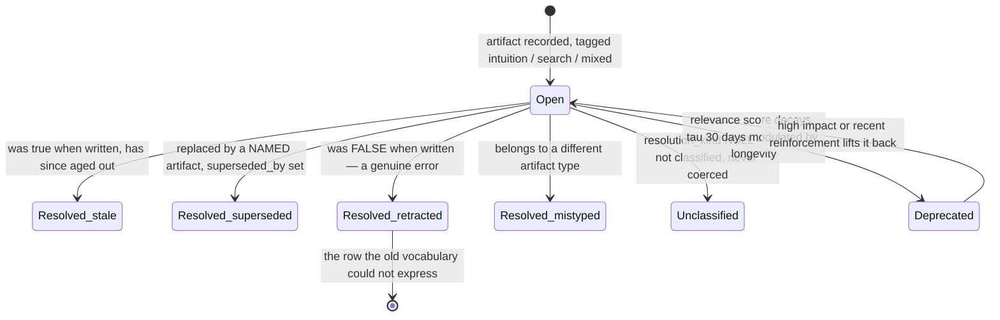

## 1. Executive Summary

Empirica is "epistemic infrastructure for AI — measurement, memory, and
calibration across sessions". MIT, roughly 303,000 lines of Python, with a
Sentinel gate that blocks code edits until the agent has demonstrated
understanding, a CHECK gate with domain-scaled thresholds, a three-vector
confidence model, and a four-layer memory of typed artifacts.

**The reason this earns a report is 47 lines of docstring in
`empirica/data/resolution_kind.py`, and they contain the best-argued trust
vocabulary in this atlas.**

The problem it solves is that resolving a finding used to write a boolean plus
free text. The module explains why that fails, in two sentences worth quoting
exactly:

> Free text cannot be queried — and, more importantly, cannot be *offered*. What
> the surface does not name, the practitioner does not reach for.

Then it produces the measurement. On the project's own store on 2026-07-30, "of
1268 resolved findings, **1267 resolve as stale/superseded/snapshot and exactly
1 as an error**. A true error rate of 1-in-4199 over six months is not
plausible, so errors were not being expressed rather than not occurring."

It then pre-empts the obvious rebuttal — "we simply had not gardened yet" —
by noting that this practice "HAS gardened 1268 findings. Gardening itself was
staleness-only, because staleness was the only available word."

And it states what the vocabulary is for: "The distinction that carries the
weight is `stale` vs `retracted`: *it aged* and *it was never true* are
different epistemic events, and collapsing them means a practice cannot tell
ageing from error in its own history."

The resulting `ResolutionKind` is `stale | superseded | retracted | mistyped`,
each with a one-line help string "surfaced in `--help` so the choice is made at
the point of resolving rather than looked up". `None` is a legitimate value
meaning not-classified, and the normaliser refuses to coerce an unknown value,
because "the misclassification that matters most is exactly the one being
measured, `retracted` recorded as `stale`."

Every part of that reasoning — the failure, the measurement, the rebuttal, the
distinction, the default, the surfacing — is a step this atlas argues for and
almost never finds written down.

## 2. Mental Model

Empirica does not model *memories*. It models **epistemic artifacts**: findings,
unknowns, mistakes, decisions, assumptions and dead-ends, each scoped to a
project, a session, a goal and a subtask.

Two orthogonal vocabularies attach to them.

**How the claim was arrived at** — `empirica/data/epistemic_source.py`:
`intuition` (from training data and already-loaded context, "no external
retrieval since the goal opened"), `search` ("produced or substantially shaped
by an external retrieval this session"), `mixed`, or `None` for untagged. The
module names the attack it exists to detect: "vectors asserted high `know` while
every artifact is `intuition`-tagged is exactly the gaming surface" — an agent
claiming to know things it never looked up.

**Why it stopped being current** — `resolution_kind`, above.

Tracking `project_unknowns` beside `project_findings` is the other structural
choice: what the agent knows it does not know is a first-class row with its own
resolution, so a session can hand over its open questions rather than only its
answers.

The bottom transition is the one the measurement was about: before the
vocabulary existed, that state had no name, so in 1,268 resolutions it was
reached once.

## 3. Architecture

SQLite with a dozen schema modules — `projects_schema`, `sessions_schema`,
`goals_schema`, `tracking_schema`, `epistemic_schema`, `verification_schema`,
`trajectory_schema`, `concept_graph_schema`, `codebase_model_schema` — plus a
migration runner and a dialect layer.

An **epistemic bus** carries events in-process, and `bus_persistence.py`
promotes it to durable storage through two observers: `SqliteBusObserver`,
described as "the guaranteed fallback (like journaling to disk)", writing to an
events table in `sessions.db`; and an optional `QdrantBusObserver` for semantic
event retrieval across nodes.

Around that sit the gates (`core/sentinel/`), calibration
(`calibration_config.py`, `bayesian_beliefs.py`, `epistemic_trajectory.py`), a
codebase model that auto-extracts functions, classes and imports from every file
edit, a terminal statusline, and an optional cross-agent mesh that the README is
careful to mark as standalone-optional.

## 4. Essential Implementation Paths

**Gate** — `core/sentinel/`: blocks edits until understanding is demonstrated;
CHECK applies "domain-aware thresholds scaled by criticality — cybersec/high is
stricter than default/low".

**Record** — the artifact repositories under `empirica/data/repositories/`,
each carrying `WHERE project_id = ?`.

**Resolve** — `resolution_kind.normalize_resolution_kind`, with
`RESOLUTION_KIND_HELP` reaching the CLI `--help`.

**Deprecate** — `core/findings_deprecation.py`: an exponential time decay with
`TIME_DECAY_TAU_DAYS = 30` (about a 21-day half-life), modulated by a longevity
term `tau = TAU * (1 + K*longevity)` with `K = 2.0`, combined with impact
weighting and N-step recursive loading "to prevent bootstrap bloat at scale".

**Persist events** — `core/bus_persistence.py` → SQLite always, Qdrant
optionally.

## 5. Memory Data Model

The artifact tables share a shape: an id, `project_id`, `session_id`, `goal_id`
and `subtask_id` foreign keys, a text body, a JSON blob, `subject`, `impact`
(defaulting to 0.5), a `transaction_id`, and resolution fields.

`mistakes_made` is the one worth naming on its own. Its columns are `mistake`,
`why_wrong`, `cost_estimate`, `root_cause_vector` and `prevention` — a schema
that forces a post-mortem shape rather than storing a sentence. Recording *what
would have prevented it* beside the mistake is the difference between a log and
a lesson, and `root_cause_vector` ties the failure back to the confidence vector
that produced it.

`project_findings` carries `is_resolved`, free-text `resolution`,
`resolved_timestamp`, `superseded_by` and `resolution_kind`, with the schema
comment pointing at the vocabulary module — so the closed set is documented at
the column, not only in the code that writes it.

## 6. Retrieval Mechanics

Retrieval here is **bootstrap**, not search: at session start, the system loads
the artifacts most likely to matter, using the deprecation engine's relevance
score rather than a similarity query. Recency decays exponentially, impact
weights, and longevity lengthens the decay constant so a finding that has
survived a long time fades more slowly.

That is the right shape for the problem — an agent starting a session does not
have a query, it has a goal — and it is why the deprecation engine's header
frames the whole thing as bloat prevention: "Not all findings are equally
relevant."

`project_id` reaches the repository queries as a predicate, which earns
`scope_enforced`; the foreign keys mean the scope is also enforced at insert.

## 7. Write Mechanics

Writes happen during work rather than at session end, which is what makes the
gates possible: the Sentinel can block an edit because the artifacts
demonstrating understanding either exist or do not.

Correction is resolution, and the design decision is that resolution is
*classified*. A finding is not deleted and not merely flagged — it is closed with
a reason from a closed set, and `superseded` requires a named successor
(`--superseded-by`), so the strongest resolution kind cannot be used vaguely.

What is absent is a rejected-value record. A `retracted` finding is a row saying
this was false; nothing keys on its content, so the same false finding can be
recorded again in a later session and will need retracting again. Given that the
whole vocabulary exists to make error *countable*, the recurrence would at least
be visible in the history — which is a weaker guarantee than a tombstone and a
more useful one than silence.

## 8. Agent Integration

An MCP server (`empirica-mcp`), a CLI with unified commands, a live terminal
statusline showing confidence vectors, Docker images, and an optional
cross-agent mesh where "peer AIs propose work, ECO accepts/declines, completion
handshakes carry commit SHAs".

The README's framing of the mesh is worth crediting: it is marked optional
twice, with "Empirica core works standalone without this" in bold. A feature
that says clearly when it is not required is rarer than it should be.

The README also carries an unusual disclaimer — that the project "has **no
cryptocurrency, token, coin, or blockchain component**" and that a token using
its name is unauthorised. That is a fact about the project's environment rather
than its design, and it belongs in a report only because a reader searching the
name will find the token first.

## 9. Reliability, Safety, and Trust

**Trust state — awarded, twice over.** `ResolutionKind` is a closed four-value
epistemic vocabulary with `retracted` explicitly meaning "was FALSE when
written — a genuine error, not ageing", persisted in a column, surfaced in the
CLI, and never coerced. `EpistemicSource` is a second orthogonal vocabulary about
provenance of belief. Two axes, both closed, both documented at the point of use.

**Scope — awarded.** `project_id` is a foreign key on every artifact table and a
predicate in the repositories.

**Audit log — awarded.** The epistemic bus persists every event to a SQLite
events table through an observer described as the guaranteed fallback, with an
optional Qdrant mirror. It is an event fabric rather than a mutation log, and it
is durable, append-shaped and in the system's own store.

**Human review — no.** The gates block an *agent*, not a person's approval of a
memory.

**Bitemporal, tombstone, negative eval — no** on what was inspected.

**The honest limitation is stated by the project.** `epistemic_source.py` ends:
"This is v0 — the data primitive only. The routing rule (gate route to
'investigate' when claims are high but evidence is all-intuition) is deferred
until calibration history accumulates." So the tag that would catch a gamed
confidence vector is recorded and not yet acted on. Declaring a mechanism as a
data primitive with the enforcement deferred, and saying what would unblock it,
is the correct handling — and a reader should not assume the gaming surface is
currently closed.

## 10. Tests, Evals, and Benchmarks

**No paper.** 431 test files, a `pytest.ini` and a separate skip config, plus
scripts for documentation health, prompt evaluation, freshness auditing, release
checking and a phase-0 calibration run.

**I ran nothing** — the tree was read.

The measurement that matters here is not a benchmark, and it is better than one:
the resolution-vocabulary argument is a statistic computed on the project's own
production store, with the date, the denominator, the implausibility argument and
the pre-empted rebuttal. It measures a *practice* rather than a retrieval metric,
which is the right instrument for the claim being made.

No retrieval-quality number is claimed anywhere, and for a system whose recall
path is decay-weighted bootstrap rather than search, that is consistent.

## 11. For Your Own Build

### Steal

- **Measure your own vocabulary before you defend it.** "Of 1268 resolved
  findings, exactly 1 as an error" is what turns "we should add a word" into a
  finding. Run the query against your own store; the shape of the answer will
  tell you which distinction you are failing to express.
- **Remember that a vocabulary is an interface.** "What the surface does not
  name, the practitioner does not reach for" is the whole argument for closed
  sets over free text, and it applies to humans and models equally.
- **Separate *it aged* from *it was never true*.** These are the two events a
  single `superseded` conflates, and a store that cannot tell them apart cannot
  measure its own error rate.
- **Put the one-line help beside each value and surface it at the choice
  point.** `RESOLUTION_KIND_HELP` reaching `--help` means the classification is
  made while the context is fresh.
- **Make `None` a real value and refuse to coerce.** "Not classified" is honest;
  defaulting an unknown to the common case silently manufactures the exact
  measurement error you are trying to detect.
- **Require a named successor for `superseded`.** `--superseded-by` stops the
  strongest resolution kind from being used as a synonym for "gone".
- **Tag how a claim was arrived at.** `intuition | search | mixed` is three
  values that expose an agent asserting confidence it never earned.
- **Give mistakes a post-mortem schema.** `why_wrong`, `cost_estimate`,
  `root_cause_vector`, `prevention` — five columns that make a mistake table
  worth reading.
- **Track unknowns as first-class rows.** Handing over open questions is at
  least as valuable as handing over answers.
- **Lengthen decay by longevity.** `tau = TAU * (1 + K*longevity)` means
  something that has already survived a long time fades more slowly, which is
  closer to how knowledge actually behaves than a flat half-life.

### Avoid

- **Do not ship the tag without the rule and let a reader assume otherwise.**
  The source tagging is v0 and the routing is deferred; the project says so, and
  anyone relying on it to catch a gamed vector today would be wrong.
- **Do not confuse gating an agent with review by a person.** The Sentinel is a
  strong mechanism and no human approves a memory anywhere in this system.
- **Do not expect a retraction to prevent a repeat.** `retracted` is a row about
  a row; the same false finding can be recorded again next session.

### Fit

This suits a developer or team who want their coding agent to be measurably more
careful — to investigate before editing, to say when it is guessing, and to hand
over its open questions. It is a practice as much as a tool, and the surface
(gates, vectors, statusline, mesh) is substantial.

The part to take even if you never run it is `empirica/data/resolution_kind.py`.
It is one file, it contains a vocabulary, a measurement and an argument, and it
is the clearest demonstration in this atlas that a trust vocabulary is a design
decision with evidence behind it rather than a taxonomy someone liked.

## 12. Open Questions

- **Has the source-aware routing landed since?** The gate rule is deferred
  "until calibration history accumulates"; whether that history has now
  accumulated is the question that decides if the gaming surface is closed.
- **What is the retraction rate now?** The vocabulary was added to make the
  number measurable; a follow-up measurement is the natural next artifact and is
  not in this tree.
- **Does anything use `mistyped`?** It is ordered last as the rare case; whether
  it fires at all would say something about the vocabulary's completeness.
- **What happens to a deprecated finding that is never resolved?** Relevance
  decays and bootstrap stops loading it; whether it is ever removed was not
  traced.

## Appendix: File Index

**The vocabulary and its argument** — `empirica/data/resolution_kind.py` (the
measurement `:6-12`, the stale-versus-retracted distinction `:14-17`,
`RESOLUTION_KINDS` `:24`, `RESOLUTION_KIND_HELP` `:29`,
`normalize_resolution_kind` `:37`)

**Source tagging** — `empirica/data/epistemic_source.py` (the vocabulary `:8-15`,
the gaming surface `:17-19`, the v0 deferral `:21-23`)

**Schema** — `empirica/data/schema/projects_schema.py:83` (`project_findings`
with `resolution_kind`), `:110` (`project_unknowns`),
`empirica/data/schema/tracking_schema.py:18` (`mistakes_made`), plus
`epistemic_schema.py`, `verification_schema.py`, `trajectory_schema.py`,
`concept_graph_schema.py`, `codebase_model_schema.py`, `goals_schema.py`,
`sessions_schema.py`

**Deprecation** — `empirica/core/findings_deprecation.py`
(`TIME_DECAY_TAU_DAYS`, `LONGEVITY_DECAY_K`)

**Events** — `empirica/core/epistemic_bus.py`, `bus_persistence.py`
(`SqliteBusObserver`, `QdrantBusObserver`), `dispatch_bus.py`,
`epistemic_rollup.py`

**Gates and calibration** — `empirica/core/sentinel/`,
`empirica/core/calibration_config.py`, `bayesian_beliefs.py`,
`epistemic_trajectory.py`, `epistemic_brief.py`, `claims.py`

**Repositories** — `empirica/data/repositories/` (`breadcrumbs.py` and siblings,
each scoped by `project_id`)

**Integration** — `empirica-mcp/`, `empirica/cli/`, `empirica/api/`,
`empirica/integrations/`, `empirica/core/ecosystem.py`

## History

**2026-08-09** — [`d64b6416e8850e867bff3ee5ed0402dc842128d2`](https://github.com/nubaeon/empirica/commit/d64b6416e8850e867bff3ee5ed0402dc842128d2) — first reading. Screened before reading; the tree was read, never installed, and no test was run.
