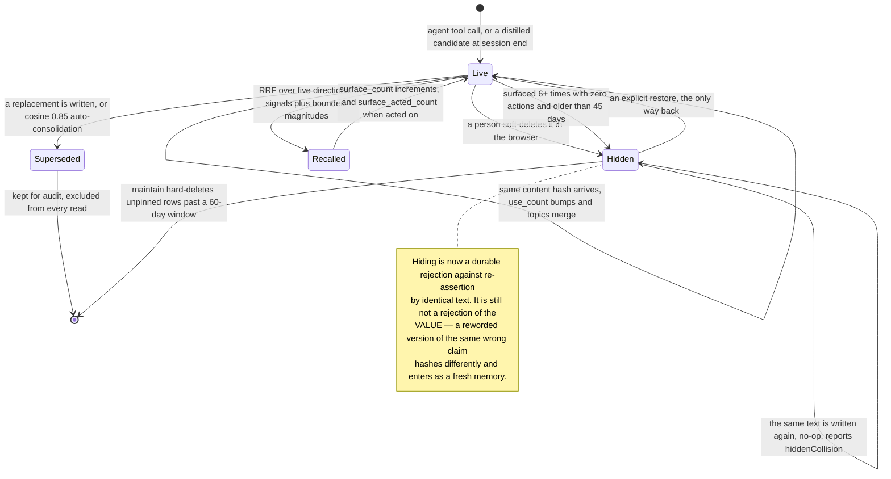

# Empryo Memory System Report

> **Source availability.** Empryo ships from a private development tree. The
> memory layer described here lives at `packages/memory/` in that tree at commit
> `aa963f28`; the public repository `proxysoul/Empryo` carries the older v2
> layout at `src/core/memory/`. Every path and line number below refers to the
> private tree and does not resolve against a public commit, so this report is
> maintainer-asserted rather than reader-verifiable until that tree is published.
> The reading was performed by the Empryo maintainers.

## 1. Executive Summary

Empryo is an AI coding agent with three surfaces — a desktop app, a terminal UI,
and a headless CLI — sharing one engine. Its memory layer is **4,292 lines under
`packages/memory/`**, extracted into a standalone workspace package, plus 543
lines of agent-facing tool surface in `packages/tools/src/memory.ts`, 177 lines
of end-of-session distillation in `packages/core/src/agents/memory-distill.ts`,
and a 1,030-line A/B benchmark harness under `bench/memory-ab/`.

**This report describes the public tree, and the project has moved past it.**
The maintainer reports that the memory layer has been extracted from
`src/core/memory/` into a standalone `packages/memory/` workspace package, that
the content-hash resurrection described in section 7 is closed there, and that a
retrieval-quality benchmark now exists with a CI floor gate. None of that is in
`proxysoul/Empryo`: at the time of writing the public repository is still at
`e6b5885d`, `packages/memory/` does not exist in it, and the commits named for
the fix are not present. Everything below was read at the pinned commit and
resolves against it. Treat the newer work as reported rather than reviewed until
it can be read.

**It was called SoulForge until 12 July 2026.** The refacing commit is
`ea9278e`, the README at the analyzed commit reads *"Empryo — previously
SoulForge"*, and the app ships a one-time announcement modal to match. The
rename is not complete in code: `package.json` still declares
`@proxysoul/soulforge`, and the licence, changelog and several docs still say
SoulForge, so both names appear in the tree. This report uses the one the
project presents to its users. `/systems/soulforge/` redirects here.

Three things make this worth reading.

**The ranking signals come from the repository, not just the text.** File
affinity, git co-change affinity and dependency blast radius are read from the
agent's code graph and fused into the same RRF as the two FTS lanes. Co-change
affinity — a memory attached to files that historically change together with the
file being edited surfaces without matching a single query token — is the signal
that most distinguishes the design.

**The scoring is calibrated against measured numbers and defended by a gate.**
The quadratic semantic term is tuned to the cosine ranges the embedder's
own docstring reports, and the A/B harness measures whether the tuning holds.
Overall hit@3 on the synthetic fixture moved **0.605 → 0.969** and MRR@10
**0.551 → 0.862** between the committed baseline and optimized runs; noisy-paste
queries moved **0.017 → 1.000** and file-scoped queries **0.008 → 0.857**.

**Recall has a feedback loop.** `surface_count` and `surface_acted_count` are
written when a memory is shown and when the agent acts on it. A memory surfaced
four or more times with zero follow-ups takes a bounded penalty of up to −0.12;
one that gets acted on earns a bounded bonus; and recency now anchors on
`last_acted_at` rather than `last_used_at`, because anchoring on the latter let
every surfacing refresh a noisy memory's own recency and entrench it forever.

**The weakness is provenance.** `source` distinguishes `user` from `agent` and
no read path consults it. There is no audit log and no trust state. A memory the
model invented during distillation ranks identically to one the user dictated,
and once its `auto-distilled` topic is edited away nothing records which was
which.

**Licensing.** BSL 1.1 — not an open-source licence; it restricts production use
until a change date, after which it converts. Read it for the design and check
the terms before adopting.

## 2. Mental Model

A memory is a **summary plus details, a four-value category, topics, and a set
of file paths it is about**. The file references are load-bearing: three of the
five directional signals read them.

Categories — `pref`, `decision`, `gotcha`, `context` — classify *what kind of
thing is being remembered*, not how much it should be believed. `source` records
`user` or `agent`. Nothing weights on either as trust; category drives hint
loudness only.

### How a thing becomes a belief

Two ways, and they are not distinguished after the fact.

**A tool call.** The agent writes a summary, details, topics and file paths.
`content_hash` is computed over normalized summary + details; the row is
inserted, or the existing row with that hash is bumped.

**An end-of-session distillation pass** (`memory.autoDistill`, default **off**).
One cheap model call converts the transcript into 0–3 candidates, strict-JSON
parsed against an allow-list, tagged `auto-distilled`, and written through the
same dedup path. The rationale in the file header is that explicit-write-only
memory systematically under-collects — the session solves something hard, nobody
says "remember this", the knowledge evaporates.

There is no candidate state, no review before the write, and no confidence
score. The write is immediately live, immediately embedded, and immediately
eligible for recall.

### How a belief stops being one

Four exits, and only the first two are reversible.

- **`hidden = 1`** on soft delete, restorable from the browser.
- **`superseded_by`** pointing at a replacement, row kept for audit and hidden
  at the same time. Fresh writes with cosine ≥ 0.85 against an existing unpinned
  row auto-supersede it.
- **`autoArchiveIgnored()`** hides unpinned rows surfaced ≥ 6 times with zero
  actions and older than 45 days. Decay by disuse, applied as archival.
- **`maintain()`** hard-deletes hidden unpinned rows whose `last_used_at`
  predates a 60-day retention window. This is the only path that reclaims bytes,
  and the only irreversible one.

Rejection holds in one direction: **a content-hash collision against a hidden row
is a no-op.** The row stays hidden, `use_count` is not bumped, topics are not
merged, and the caller is told `hiddenCollision` so it can offer an explicit
`restore()`. Until `6c32ef4c` (31 July 2026) that path cleared the hidden flag
instead, and a test named for the behaviour asserted the resurrection; saving a
deleted memory's exact text now leaves the deletion standing.

## 3. Architecture

**One SQLite database per scope, no service, no network on the memory path.**
Two scopes — `project` (`<project>/.empryo/memory.db`) and `global`
(`~/.empryo/memory.db`) — each a separate `MemoryDB` instance behind a
`MemoryManager` that owns both.

Four tables plus FTS shadow tables: `schema_version`, `memories`,
`memory_files`, and `memory_edges` — the last a similarity graph with
`kind IN ('similar','supersedes')` used by the browser's cleanup clustering.
Schema version 5, migrated forward by an idempotent `ALTER TABLE` ladder that
checks `PRAGMA table_info` before each add.

**Two full-text lanes.** FTS5 over a `unicode61` tokenizer and a `trigram`
tokenizer, external-content tables over `memories`, queried separately and fused
as two independent RRF inputs rather than one. The trigram lane survives
hyphenation and inflection drift when the unicode lane misses.

**Embeddings** are a little-endian `Float32Array` of 384 floats stored inline,
tagged with `embedding_model` so vectors from different providers never
cross-correlate. An in-process `embCache` mirrors `listEmbeddings(model)`
because semantic recall is a brute-force cosine scan; it is invalidated whenever
visibility or vectors change.

**Scope is two directions, not one.** `MemoryScopeConfig` carries `writeScope`
(`global | project | none`) and `readScope` (`global | project | all | none`)
separately. The default is `{ writeScope: "project", readScope: "all" }` — read
broadly, write narrowly, with a comment naming project as "safer than global".
`filterScopes` applies the read side by selecting which adapters participate,
rather than by a predicate a caller might forget.

**No background worker, and no scheduler.** Similarity edges compute on the
write path. `maintain()` and `autoArchiveIgnored()` are explicit calls.
Distillation is one model call at session end. Nothing re-reads the corpus on a
timer, so there is no token bill that scales with corpus size.

### Deployment and ergonomics

Nothing to run. SQLite on disk, an embedder with no dependencies, no API key
required for any part of memory. Fully functional offline; what degrades without
a provider is semantic recall quality, not availability — `hashbag-v2` still
produces vectors. The store is a plain SQLite file, inspectable with `sqlite3`
and repairable by hand, and the agent ships a browser over it.

The failure mode this design has already hit in production is worth stating: on
network-mounted workspaces, a database that simply could not be opened was being
quarantined as corrupt. Three commits (`8bcaab42`, `cfcdc1ca`, `151f6ca2`)
separate "cannot open" from "corrupt", retry the open, shed torn WAL sidecars,
and salvage rows from an already-quarantined file. `memory-db-open-failures.test.ts`
asserts an unwritable directory produces no `.corrupt-` quarantine.

The real cost of the design: **memory quality is bounded by the file references
attached to it.** Three of five directional signals do nothing for a memory that
names no file.

## 4. Essential Implementation Paths

**Schema and lifecycle** — `packages/memory/src/db.ts` (1,946 lines). Table
creation at `:306-402`, the `content_hash UNIQUE` constraint at `:326`, the
migration ladder at `:386-471`, `write()` at `:479`, the hidden-collision no-op
at `:526-534`, auto-supersede at `:620-646`, `softDelete` at `:790`, `restore`
at `:806`, `supersede` at `:834`, hint telemetry at `:1518-1535`,
`autoArchiveIgnored` at `:1542-1571`, `maintain` at `:1582-1621`.

**Retrieval** — `packages/memory/src/recall.ts` (574 lines).
`sanitizeRecallQuery` at `:87-114`, the `recall()` pipeline at `:147-270`,
per-scope candidate gathering at `:321-409`, co-change expansion at `:419-438`,
`computeSignals` at `:469`, `combineScore` at `:502`, semantic collection at
`:558-574`.

**Embedding** — `packages/memory/src/embedder.ts` (`EMBED_MODEL = "hashbag-v2"`,
`EMBED_DIM = 384`), provider selection in `embedder-resolver.ts` with
`PROVIDER_DEFAULTS` at `:38-52`.

**Agent surface** — `packages/tools/src/memory.ts` (543 lines), inline hints in
`packages/memory/src/hints.ts` (529 lines).

**Context assembly** — `packages/core/src/context/manager.ts`,
`buildMemoryRecallMessages` at `:301`, cached on
`(memGen, editEpoch, readScope, lastUserMessage, editedFiles)` so recall runs
once per user turn rather than once per step.

**Distillation** — `packages/core/src/agents/memory-distill.ts`, invoked from
`apps/cli/src/headless/run.ts:1861` via a bounded wrapper.

**Repo signals** — blast radius and co-change neighbours come from the genome's
dependency graph and mined git history, injected into recall as an `IntelLike`
interface so the memory package never depends on the graph directly.

**Human surface** — `apps/desktop/src/components/MemoryBrowser.tsx`.

**Benchmark** — `bench/memory-ab/run.ts` (727 lines), `fixture.ts` (303 lines),
committed results in `bench/memory-ab/results/`.

## 5. Memory Data Model

`memories` holds `id`, `category`, `summary`, `details`, `topics`, `source`,
`session_id`, `created_at`, `last_used_at`, `use_count`, `content_hash`
(`NOT NULL UNIQUE`), `pinned`, `hidden`, `superseded_by` (self-reference,
`ON DELETE SET NULL`), `embedding`, `embedding_model`, `embedding_dim`,
`surface_count`, `surface_acted_count`, and `last_acted_at`.

Every one of those columns is read by something. `use_count` and the
surfaced/acted pair feed magnitude terms; `pinned` adds 0.1 and exempts a row
from archival and purge; `hidden` and `superseded_by` gate every read;
`content_hash` enforces identity; `embedding_model` prevents cross-provider
vector comparison; `last_acted_at` anchors recency.

`memory_files` joins memories to paths and to genome file ids.
`memory_edges` stores `similar` edges (cosine ≥ 0.4, max 8 per row) and
`supersedes` edges.

**Scoping** is project and global, per-database, with no tenancy and no user
dimension. **Temporal fields are record time only** — there is no validity time,
so `bitemporal` is withheld. The recency term is a bounded penalty with a 14-day
half-life, capped so it never flips a strong directional match.

## 6. Retrieval Mechanics

**Query sanitization first.** `sanitizeRecallQuery` compresses a raw user
message before it reaches either lane. Inputs ≤ 240 chars pass through; then
fenced code blocks are stripped; then the sentence ending at the last `?` wins
if it is 12–260 chars; then the last prose-looking line (≥ 70% letters, ≥ 3
words); then the trailing 260 characters. The failure this exists for is a 3 KB
traceback with the actual question in the last line — which used to swamp FTS
(every token OR-matches something) and dominate the embedding vector. The
benchmark measures it: noisy-paste hit@3 is 0.017 without the sanitizer and
1.000 with it.

**Five directional signals**, fused by RRF with `K = 60`:

| Signal | Enters at | What it is |
|---|---|---|
| `fts_unicode` | its own rank | FTS5 over `unicode61`, 30 candidates |
| `fts_trigram` | its own rank | FTS5 over `trigram`, 30 candidates |
| `file_affinity` | rank 1 | the memory references a file being edited now |
| `cochange_affinity` | rank 5 | the memory's files are git co-change neighbours of an edited file |
| `semantic_rank` | rank, weighted 2× | rank among cosine matches above 0.18 |

Co-change is deliberately entered at rank 5 — roughly 3× weaker than a direct
file hit — and is suppressed entirely when the same memory already has a direct
hit, so it can only ever add breadth, never outrank precision. Expansion is
capped at 2 neighbours per file and 6 total.

**Nine bounded magnitude terms** are added on top: `use_count` (0.05·log),
`recency` (−0.05 with a 14-day half-life), `blast_radius` (0.05·log), `pinned`
(0.1), `ignored` (up to −0.12), `acted` (0.05·log), the quadratic semantic term
(1.5·cos² + 0.1·cos), normalized `bm25` (weight 0.12), and flat file/co-change
bonuses (0.25 / 0.08).

**The semantic magnitude is gated by a trust floor** — 0.3 for `hashbag-v2`,
0.18 for a provider embedder. Below the floor a cosine match earns rank credit
only and no magnitude, because ungated hash-bag noise was outscoring
file-affinity hits on vague queries.

**Directional gating.** `if (directional === 0) return 0` — a memory with no FTS
hit, no file affinity and no semantic rank scores zero regardless of its bonus
terms. `pinned` alone cannot surface anything.

**Budget.** Default limit 3, threshold 0.01, and a 2,400-character budget applied
to summaries only; details are excluded from the injected block and fetched on
demand via `memory(action:'get')`.

### Failure modes

- **A memory with no file references loses three of five directional signals**
  and competes on text alone.
- **Co-change affinity inherits git's noise.** Lockfiles and version constants
  are co-change neighbours of everything, and no exclusion list was found in the
  memory package. The genome's own PMI scoring damps this upstream, but the
  memory layer does not re-filter.
- **The hash-bag embedder has no world knowledge.** It matches morphology and
  co-occurrence, not meaning; `Postgres` and `the database` share no stream. The
  trust floor is calibrated to that, but a paraphrase with no shared tokens or
  characters is invisible.
- **No cross-scope deduplication.** Per-scope results are appended directly, so
  the same memory written to both project and global scope occupies two of the
  three slots.

## 7. Write Mechanics

Writes are **synchronous and involve no model** on the tool path — a hash, a
384-float vector of local arithmetic, and an insert. The agent does not block on
an LLM extraction, and a new memory is retrievable immediately. There is no lag
to state because there is no deferral.

**Deduplication is enforced at the storage layer.** `content_hash NOT NULL
UNIQUE` over normalized summary + details makes an exact duplicate impossible by
construction rather than by a pass that runs later. Topics merge on collision
when `merge_topics` is set.

**Near-duplicate consolidation** runs on fresh inserts: rows with cosine ≥ 0.85
that are unpinned are superseded under the new id and reported back to the agent.
Weaker similarity (≥ 0.55) and trigram overlap (≥ 0.6) are returned as advisory
`similarHints` for the agent to reconcile.

**Distillation is the one model-mediated write.** Gated off by default, capped
at 3 memories per session, 8,000 characters of digest, 500 characters per turn,
450 output tokens, strict-JSON with an allow-listed category, and skipped
entirely when the digest is under 400 characters. It never throws — the file
header calls it "an accelerant, not a dependency".

### Operational cost

- Write path: **synchronous, no model, no network.** Sub-millisecond.
- Read path: one recall per user turn, cached on the working set; **2,400
  characters injected**, bounded, summaries only.
- The injected block sits **after** the system prompt and genome, as a
  user/assistant message pair, so it does not invalidate the provider's
  prompt-prefix cache on the static portion.
- **No background pass re-reads the corpus.** `maintain()` and
  `autoArchiveIgnored()` are explicit, and `VACUUM` is capped at 512 MB and only
  fires when the freelist exceeds 15% of the file.

## 8. Agent Integration

**Memory tools plus inline hints**, which remains the distinctive move.
`hints.ts` surfaces relevant memory references *on tool results as the agent
works*, not only at recall time.

The hint system is more disciplined than the tool surface alone suggests:

- **Per-tab state** (`surfacedThisTurn`, `surfacedRecently`, `turnCounter`,
  `sessionBudgetUsed`, `agentActedThisTurn`) so two tabs in one process do not
  deduplicate against each other and silence valid hints.
- **Subagents inherit the parent's surfaced ids** through an
  `AsyncLocalStorage` scope, with their own 10-hint budget against the parent's
  60-hint session budget.
- **A 10-turn cooldown** per memory, which `pinned` and `pref` bypass because a
  user-stated rule should re-assert itself.
- **Loud/quiet bucketing** by category — `gotcha` loudest (it prevents damage),
  then `pref`, then `decision`, then `context` — with at most 3 loud lines and
  the rest collapsed into a `+N more` tail.
- **Footers are suppressed on edit and commit results**, where a warning would
  arrive too late to act on, and for the remainder of a turn once the agent has
  called `memory(search|get|list)` on its own.

The stated first design principle is a deliberate choice against a quality gate,
and worth quoting because most systems here choose the opposite:

> Any candidate that survives recall is surfaced (no quality gate). Memories are
> precious; users curate them. Treat them as relevant.

That is coherent given the browser: the system leans on human curation instead
of a confidence threshold, and ships the surface to curate with. The
surfaced/acted feedback loop is the hedge — a memory the model ignores decays out
of contention without anyone having to judge it.

Adapting this to another agent is a moderate job. `packages/memory` depends on
`bun:sqlite` and an injected `IntelLike` for repo signals; the hint layer assumes
a tab model and an `AsyncLocalStorage` subagent boundary.

## 9. Reliability, Safety, and Trust

**Scope is the strong column.** Separate read and write scopes, the write
defaulting to the narrower one, applied by selecting adapters.

**Human review is real and unusually complete.** The browser lists memories with
per-row pin/unpin and soft-delete/restore, plus a cleanup tab presenting
candidates in similarity clusters for bulk review with delete/pin/skip per
candidate. A review queue over an existing store, rather than approval before a
write, is the less common half of this pattern.

**Rejection is now durable against re-assertion by identical text**, which earns
`tombstone` at the definition this atlas uses — a durable record of a rejected
value, keyed on the value, that later extraction cannot re-assert. The honest
limit: the key is the content hash, so a *reworded* version of the same wrong
claim hashes differently and enters as a fresh memory. That is a narrower
tombstone than a semantic one, and the distillation pass is exactly the
component most likely to produce a reworded restatement.

**There is no audit and no trust state.** Four tables, none of them an event
log. `source` distinguishes `user` from `agent` and no read path consults it.
Distillation sharpens the cost, because it is a model-authored write path into
the same table: a distilled memory is marked only by an `auto-distilled` topic,
which is user-editable and carries no weight in ranking. A user-dictated
preference and a model's guess about one rank identically.

**Prompt injection is unmitigated.** Content from a tool result that reaches a
distillation digest can become a memory. The caps (3 per session, allow-listed
categories, 140-character summaries) bound the blast radius; nothing detects the
attempt, and the default-off gate is the real protection.

**Concurrency.** WAL mode with a busy timeout, and `memory-concurrency.test.ts`
covers concurrent writers. Quarantine-and-salvage recovery is tested against
unwritable directories and torn sidecars.

**Uncertainty cannot be represented.** There is no confidence field and no
candidate state. A memory is either live or it is not.

## 10. Tests, Evals, and Benchmarks

**131 memory-specific test cases across 13 files**, inside a suite of 3,928
tests across 177 files. All pass at the analyzed commit.

**A retrieval-quality benchmark exists and is committed.**
`bench/memory-ab/fixture.ts` generates a deterministic 643-memory corpus from 25
domains via a seeded LCG, with seven query kinds — `keyword`, `paraphrase`,
`noisy` (a 1,500–4,000-character noise block wrapped around the real question),
`file` (deliberately vague text plus `editedFiles`), `symbol`, `cjk`, `short`.
`run.ts` computes hit@3, hit@10, MRR@10, recall-latency percentiles, and
on-disk bytes before and after a churn pattern, and feature-detects `maintain()`
so one script drives both arms.

Committed results, baseline → optimized:

| Query kind | n | hit@3 | MRR@10 |
|---|---|---|---|
| keyword | 168 | 0.994 → 1.000 | 0.908 → 0.926 |
| paraphrase | 119 | 1.000 → 1.000 | 0.992 → 0.992 |
| noisy | 119 | 0.017 → 1.000 | 0.006 → 0.944 |
| file | 119 | 0.008 → 0.857 | 0.008 → 0.601 |
| symbol | 72 | 0.986 → 0.972 | 0.795 → 0.775 |
| cjk | 10 | 0.400 → 1.000 | 0.256 → 0.933 |
| short | 8 | 1.000 → 1.000 | 0.854 → 0.938 |
| **overall** | **615** | **0.605 → 0.969** | **0.551 → 0.862** |

On-disk size after identical churn fell from 20,057 to 10,243 bytes per memory,
and `maintain()` purged 272 rows. A second arm runs the same queries against a
**snapshot of the real project and global databases** (157 memories, 314
queries), where file-scoped recall is markedly worse than synthetic — hit@3
0.082 — which is the most useful number in the harness and the one worth
chasing next.

**The benchmark has CI teeth.** `memory-recall-quality.test.ts` runs the same
fixture through the production pipeline and asserts hit@3 floors per query kind
(keyword/paraphrase 0.97, noisy 0.95, file 0.75, symbol/cjk/short 0.9), set
under measured 2026-07-30 numbers so ordinary drift passes and a collapse fails
loudly.

**Negative assertions**, which is what `negative_eval` requires:

- a hidden memory is absent from recall after a dedup re-write —
  `memory-recall.test.ts:202`
- hidden rows never returned by prefix search — `memory-edge-cases.test.ts:329`
- pinned rows excluded from stale candidates — `memory-cleanup.test.ts:120`
- mismatched embedding models excluded from cosine scans —
  `memory-edge-cases.test.ts:595`
- unrelated memories not linked as similar — `memory-phase4.test.ts:87`
- the distill digest contains no `recalled_memories` or system scaffold —
  `memory-distill.test.ts:19-20`

The edge-case suite is the good kind — empty and one-character queries
against both FTS lanes asserted to return nothing, pinning the tokenizer's own
rules rather than the happy path.

**What is still missing.** Nothing measures the distillation pass: no eval
asserts that a distilled memory is worth keeping, and its default-off state
means it is the least exercised write path in the system. The real-corpus file
recall number (0.082 hit@3) is measured but not gated. I ran these tests; the
benchmark numbers are read from committed results.

## 11. For Your Own Build

### Steal

**Use the repository as a ranking signal, not just the query.** File affinity is
obvious once stated; **git co-change affinity is not**, and it surfaces a memory
about a file you are not looking at but are about to break. Enter it behind
direct hits — Empryo uses RRF rank 5, suppresses it when a direct hit already
exists, and says why in a comment.

**Sanitize the query before it reaches the index.** A long paste swamps FTS and
dominates an embedding vector, and the question is usually in the last line. A
five-step ladder — passthrough, strip fences, last question sentence, last prose
line, tail — moved noisy-paste hit@3 from 0.017 to 1.000 in this codebase. This
is the cheapest large win in the report.

**Close the loop on what the model ignores.** Counting surfacings and
follow-ups, penalising memories shown repeatedly with no action, and anchoring
recency on last-acted rather than last-shown, together stop noisy memories from
entrenching themselves through their own surfacing.

**Measure your embedder's range, then calibrate the score to it, then gate on
the floor.** State where paraphrases, topical matches and unrelated text fall;
choose the magnitude curve against those numbers; and give weak matches rank
credit but no magnitude.

**Ship a deterministic embedder when your corpus is short summaries.** No
provider, no key, no network, no cost, reproducible in CI. Know what it cannot
do: it has no world knowledge.

**Separate `readScope` from `writeScope`, and default the write narrower.**

**Give the human a cleanup queue, not just a list.** Similarity clusters with
delete/pin/skip per candidate is bulk curation; a table with a bin is not.

**Build the A/B harness before you tune the weights.** A five-signal fusion is a
hypothesis until something measures it; committed baseline/optimized results plus
a CI floor gate turn hand-tuned constants into a defended claim.

### Avoid

**Do not let dedup resurrect a deletion.** A unique content hash is an excellent
identity and a poor tombstone: if the upsert clears the hidden flag, every soft
delete is provisional and the user is never told. Empryo shipped that behaviour,
had a test asserting it, and closed it in `6c32ef4c` by making the collision a
no-op that reports itself — copy the report, not just the guard, because a silent
no-op is its own trap.

**Do not assume a content-hash tombstone is a semantic one.** Hashing the text
blocks the identical sentence, not the identical claim. If a model-mediated
write path can reword a rejected memory, the tombstone will not catch it.

**Do not add a model-authored write path without provenance that ranking
reads.** Once extraction writes into the same table as the user, a `source`
column nobody consults is decoration.

**Do not let per-scope results skip cross-scope dedup.** Reading `all` scopes
without deduplicating by record identity lets one memory occupy several of very
few injection slots.

### Fit

This suits a **single developer or a small team running a coding agent against a
repository they own**, who want memory that surfaces itself while they work
rather than only when asked, and who will occasionally spend five minutes in a
cleanup queue. The repo-derived signals are the reason to choose it and they only
pay off when memories name files — which in a coding agent they naturally do.

It does not suit a team memory or a service: scope is global-or-project on a
local SQLite file, there is no tenancy, no audit, and the BSL restricts
production use until the change date. It does not suit anyone who needs a
correction to stick *semantically* rather than *lexically*. And it does not suit
a system where memory must carry claims that arrive from untrusted input, because
nothing in the ranking can tell an invented memory from a dictated one.

## 12. Open Questions

- **Why is real-corpus file recall (hit@3 0.082) so far below synthetic
  (0.857)?** The fixture attaches clean single-file references; real memories
  attach several paths, some stale. This gap is measured, committed, and
  unexplained — it is the most interesting open number in the repository.
- **How noisy is co-change affinity in practice?** The genome damps hub files
  with PMI scoring upstream, but the memory layer applies no exclusion of its
  own, and nothing measures how often a lockfile-adjacent memory surfaces.
- **Does the distillation pass earn its keep?** Default-off, unmeasured, and the
  write path most likely to produce a reworded restatement of something a user
  already rejected.
- **What does blast radius do to recall on a hub file?** A memory about a widely
  imported module gets a permanent bonus, which may be correct or may simply
  favour infrastructure over intent.
- **How does `hashbag-v2` compare against a provider embedder on this corpus?**
  `optimized-hashbag.json` and `optimized-local.json` exist as separate arms;
  a head-to-head accuracy comparison is not summarized anywhere.

## Appendix: File Index

**Storage and lifecycle** — `packages/memory/src/db.ts` (schema `:306-402`,
migrations `:386-471`, `write` `:479`, hidden-collision no-op `:526-534`,
auto-supersede `:620-646`, `softDelete` `:790`, `restore` `:806`, `supersede`
`:834`, hint telemetry `:1518-1535`, `autoArchiveIgnored` `:1542-1571`,
`maintain` `:1582-1621`).

**Retrieval** — `packages/memory/src/recall.ts` (`sanitizeRecallQuery` `:87`,
`recall` `:147`, `gatherScope` `:321`, co-change expansion `:419`,
`computeSignals` `:469`, `combineScore` `:502`).

**Embedding** — `packages/memory/src/embedder.ts`, `embedder-resolver.ts`.

**Types and scope** — `packages/memory/src/types.ts`,
`packages/memory/src/manager.ts`.

**Agent surface** — `packages/tools/src/memory.ts`,
`packages/memory/src/hints.ts`.

**Context assembly** — `packages/core/src/context/manager.ts:301`.

**Distillation** — `packages/core/src/agents/memory-distill.ts`, called from
`apps/cli/src/headless/run.ts:1861`.

**Human surface** — `apps/desktop/src/components/MemoryBrowser.tsx`.

**Benchmark** — `bench/memory-ab/run.ts`, `bench/memory-ab/fixture.ts`,
`bench/memory-ab/results/`.

**Tests** — `apps/cli/tests/memory-{recall,recall-quality,edge-cases,cleanup,concurrency,db-open-failures,distill,embedder-provider,embedder-resolver,phase4,phase5,prefix-resolve,prepare-step}.test.ts`.

**Licence** — `LICENSE` (Business Source License 1.1).
