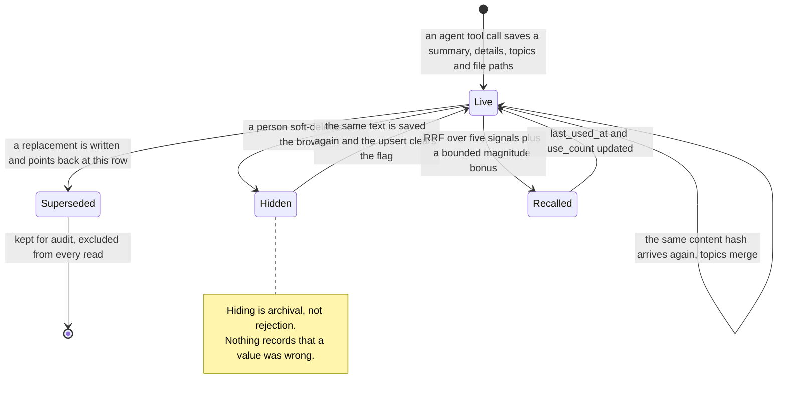

## 1. Executive Summary

Empryo is a terminal coding agent, and its memory layer is 4,159 lines under
`src/core/memory/` — one of the more carefully built retrieval models in this
atlas, and the one most thoroughly shaped by the fact that its subject is a
codebase.

**This report describes the public tree, and the project has moved past it.**
The maintainer reports that the memory layer has been extracted from
`src/core/memory/` into a standalone `packages/memory/` workspace package, that
the content-hash resurrection described in section 7 is closed there, and that a
retrieval-quality benchmark now exists with a CI floor gate. None of that is in
`proxysoul/Empryo`: at the time of writing the public repository is still at
`e6b5885d`, `packages/memory/` does not exist in it, and the commits named for
the fix are not present. Everything below was read at the pinned commit and
resolves against it. Treat the newer work as reported rather than reviewed until
it can be read.

**It was called SoulForge until 12 July 2026.** The refacing commit is
`ea9278e`, the README at the analyzed commit reads *"Empryo — previously
SoulForge"*, and the app ships a one-time announcement modal to match. The
rename is not complete in code: `package.json` still declares
`@proxysoul/soulforge`, and the licence, changelog and several docs still say
SoulForge, so both names appear in the tree. This report uses the one the
project presents to its users. `/systems/soulforge/` redirects here.

**Licensing note, because it decides what you can do with what you read.** The
repository is under the **Business Source License 1.1**, which is not an
open-source licence: it restricts production use until a change date, after
which it converts. Read it for the design and check the terms before adopting
it. The atlas records the same position for [ByteRover](../byterover/) under ELv2
and [Skales](../skales/) under BSL.

Two things make it worth reading.

**The embedder has no model and no network.** `hashbag-v2` is a deterministic
384-dimension embedder built from three hashed feature streams — word unigrams
after stop-word strip and light stemming, word bigrams, and character 4-grams
over the de-spaced text — weighted 1.0 / 0.7 / 0.4 and L2-normalised once. The
docstring states the measured cosine ranges it produces: *"exact paraphrases:
0.5–0.85, shared topic different wording: 0.25–0.5, unrelated short summaries:
0.0–0.15"*. Several systems here use a deterministic embedder in tests;
this one ships it as the embedder, and the char-gram stream exists for a stated
reason — catching `auto-extraction` against `auto extraction` and `extracting`
against `extraction`.

**The ranking signals come from the repository, not just the text.**
`combineScore` runs reciprocal rank fusion over five directional signals and
then adds a bounded magnitude term:

| Signal | What it is |
| --- | --- |
| `fts_unicode`, `fts_trigram` | two SQLite full-text lanes over different tokenizers |
| `file_affinity` | the memory references a file being edited now |
| `cochange_affinity` | the memory's files are **git co-change neighbours** of the file being edited |
| `semantic_rank` | rank among hash-bag cosine matches, weighted `2 / (RRF_K + rank)` |
| `blast_radius` | `0.05 × log(radius + 1)`, from the repo map's dependency graph |

Co-change affinity is the one nothing else here has: a memory attached to files
that *historically change together* with what you are touching now surfaces
without matching a single query token. It is deliberately ranked behind a direct
hit — entered at RRF rank 5, which the comment notes makes it *"~3× weaker than
a direct file hit, which is what we want"*.

The calibration is unusually explicit. The semantic magnitude term is quadratic
— `1.5 × cos² + 0.1 × cos` — with the comment working the numbers: `0.4² × 1.5 =
0.24; 0.7² × 1.5 = 0.74; 0.85² × 1.5 = 1.08`. Weak matches contribute little and
strong ones dominate, tuned to the range the embedder above was measured to
produce.

**The weakness is at the other end, and it is tested.** Soft delete sets
`hidden = 1`; supersession sets `superseded_by` and hides the row; and both are
correctly filtered on the read path — `WHERE hidden = 0 AND superseded_by IS
NULL`. But `content_hash` is `UNIQUE`, and the upsert path treats a hash
collision as an *update*, setting `hidden = 0`. So saving the same sentence
again un-hides a memory the user soft-deleted. There is a test named for it —
`"MemoryDB — dedup wakes hidden + topic merge"` — asserting `hidden` goes true
then false. That is intended behaviour, and it means hiding a wrong memory is
one agent write away from being undone.

## 2. Mental Model

A memory is **a summary with a body, some topics, and a set of files it is about**.
The file references are what make the rest of the design work: they are what
`file_affinity`, `cochange_affinity` and `blast_radius` all read.

Categories are `pref`, `decision`, `gotcha` and `context` — a taxonomy of what
kind of thing is being remembered, not of how much it should be believed.
`source` records `user` or `agent`, which is the only provenance field, and
nothing weights on it.

### How a thing becomes a belief

Through a tool call. The agent saves a memory with a summary, details, topics
and file paths; `content_hash` is computed and the row is inserted, or — if the
hash already exists — the existing row is updated in place, its topics merged
and its `hidden` flag cleared.

There is no candidate state, no review before the write, and no confidence. The
write is immediately live, immediately embedded, and immediately eligible for
recall.

### How a belief stops being one

`hidden = 1` on soft delete, restorable from the browser. `superseded_by`
pointing at a replacement, with the row kept — the comment says *"kept for
audit"* — and hidden at the same time. Both are excluded from every read.

That is a correct supersession model, applied on the read path, which is more
than several systems here manage. What it is not is a rejection: nothing records
*that a value was wrong*, and the unique-hash upsert actively reverses a hide
when the same content returns.

## 3. Architecture

A single SQLite database per scope, no service, no network on the memory path.
Four tables: `schema_version`, `memories`, `memory_files` and `memory_edges` —
the last a similarity graph used by the browser's cleanup clustering.

**Two full-text lanes.** SQLite FTS over a unicode tokenizer and a trigram
tokenizer, queried separately and fused as two independent RRF inputs rather
than one. The trigram lane is what survives hyphenation and inflection drift
when the unicode lane misses.

**Embeddings are stored as a little-endian `Float32Array`** of 384 floats
alongside the row. Because the embedder is deterministic and dependency-free,
re-embedding the corpus is a local loop with no cost and no provider.

**Scope is two directions, not one.** `MemoryScopeConfig` carries `writeScope`
(`global | project | none`) and `readScope` (`global | project | all | none`)
separately, with a comment stating the default: writes go to `project`,
described as *"safer than global"*. `filterScopes` applies the read side by
selecting which database adapters participate. Being able to read broadly while
writing narrowly is the [explicit write destination](../../patterns/explicit-write-destination/)
pattern, with the safe default chosen.

**There is no background worker.** Similarity edges and hint state are computed
on the write and read paths.

### Deployment and ergonomics

Nothing to run. SQLite on disk, an embedder with no dependencies, and no API key
required for any part of memory. The store is inspectable with `sqlite3` and the
agent ships a browser over it.

The cost is that the memory is only as good as the file references attached to
it, and three of the five ranking signals do nothing for a memory that names no
file.

## 4. Essential Implementation Paths

**Schema and persistence** — `src/core/memory/db.ts` (1,478 lines): table
creation, the `content_hash UNIQUE` constraint, `upsert` with the hash-collision
branch, `supersede`, and the read filters at `:807`.

**Retrieval** — `src/core/memory/recall.ts`: candidate gathering across scopes,
`buildSignals` (`:360`) and `combineScore` (`:379`).

**Embedding** — `src/core/memory/embedder.ts` (`hashbag-v2`, `EMBED_DIM = 384`),
with provider selection in `embedder-resolver.ts`.

**Agent surface** — `src/core/tools/memory.ts` (582 lines).

**Inline hints** — `src/core/memory/hints.ts`: surfacing memory references on
tool results, keyed per tab, with subagent scopes inheriting the parent's
surfaced ids.

**Human surface** — `src/components/modals/MemoryBrowser.tsx`.

**Repo signals** — `src/core/intelligence/repo-map.ts` (`getBlastRadius`) and
the co-change neighbours it derives from git history.

## 5. Memory Data Model

`memories` holds `id`, `category`, `summary`, `details`, `topics`, `source`,
`session_id`, `created_at`, `last_used_at`, `use_count`, `content_hash`
(`NOT NULL UNIQUE`), `pinned`, `hidden` and `superseded_by` (a self-reference
with `ON DELETE SET NULL`). `memory_files` joins memories to paths and file ids.

**Every one of those columns is read by something**, which is worth saying
plainly after several recent reports where that was not true: `use_count` and
`last_used_at` feed the magnitude term, `pinned` adds `0.1`, `hidden` and
`superseded_by` gate the read, `content_hash` enforces uniqueness, and
`topics` and file references drive two ranking signals.

**Temporal fields are record time.** `created_at` and `last_used_at` describe
the row; the recency term is a bounded penalty with a 14-day half-life, capped
so it *"never [goes] negative enough to flip a strong directional match"*.

## 6. Retrieval Mechanics

Described in section 1; the parts worth adding are the failure modes.

- **A memory with no file references loses three of five signals.** File
  affinity, co-change affinity and blast radius are all zero, so it competes on
  text alone against memories that do not have to.
- **Co-change affinity inherits git's noise.** Files that change together for
  release-engineering reasons — a lockfile, a version constant — are co-change
  neighbours of everything, and nothing here excludes them.
- **The hash-bag embedder has no world knowledge.** It matches morphology and
  co-occurrence, not meaning: `Postgres` and `the database` share no stream.
  The measured range in the docstring is honest about this, and the quadratic
  boost is calibrated to it, but a paraphrase with no shared tokens or characters
  is invisible.
- **Directional gating.** `if (directional === 0) return 0` — a memory with no
  FTS hit, no file affinity and no semantic rank scores zero regardless of its
  bonus terms. That is the right default and it means `pinned` alone cannot
  surface anything.

## 7. Write Mechanics

Writes are synchronous, agent-initiated, and involve no model — the embedder is
local arithmetic, so a save is a hash, a vector and an insert.

Deduplication is the strongest in this atlas at the storage layer: `content_hash
NOT NULL UNIQUE` makes an exact duplicate impossible by construction rather than
by a pass that runs later. Topics are merged on collision rather than
overwritten.

The cost of that design is the finding in section 1. Because the hash is the
identity and the upsert clears `hidden`, the same mechanism that guarantees no
duplicates guarantees that a soft-deleted memory returns the moment its text is
written again. Dedup and resurrection are the same code path.

Conflict handling is supersession, and it is manual: something must decide to
write a replacement and point it at the original.

## 8. Agent Integration

Memory tools plus **inline hints**, which is the distinctive integration move.
`hints.ts` surfaces relevant memory references on tool results as the agent
works, rather than only at recall time, with per-tab state so two tabs in one
process do not deduplicate against each other and silence valid hints — and
subagents inheriting the parent's surfaced ids through an `AsyncLocalStorage`
scope.

Its stated first design principle is worth quoting because it is a deliberate
choice against a quality gate:

> Any candidate that survives recall is surfaced (no quality gate). Memories are
> precious; users curate them. Treat them as relevant.

That is coherent given the browser: the system leans on human curation instead
of a confidence threshold, and provides the surface to curate with.

## 9. Reliability, Safety, and Trust

**Scope is the strong column.** Separate read and write scopes, the write
defaulting to the narrower one, applied by selecting adapters rather than by a
predicate a caller might omit.

**Human review is real and unusually complete.** The browser lists memories with
per-row pin/unpin and soft-delete/restore, and a **cleanup tab** that presents
candidates in similarity clusters for bulk review with delete/pin/skip per
candidate. A review queue over an existing store, rather than approval before a
write, is the less common half of this pattern.

**There is no audit and no trust state.** Four tables, none of them an event log;
`source` distinguishes user from agent and no read path consults it. A memory
the agent invented and one the user dictated rank identically.

**The resurrection behaviour is the safety-relevant one.** A user who hides a
memory because it is wrong has expressed a judgement the system does not record
and will overturn. The fix is small — treat a hash collision against a hidden row
as a no-op, or keep a rejection flag the upsert respects — and its absence is the
gap between a good lifecycle and a correction model.

## 10. Tests, Evals, and Benchmarks

**3,271 test cases across 100 files**, of which **eight files are
memory-specific**: recall, edge cases, cleanup, the embedder resolver, prefix
resolution, the prepare step, and two phase suites. That is a serious ratio and
the memory share of it is proportionate.

The edge-case suite is the good kind — empty and one-character queries against
both FTS lanes asserted to return nothing, which pins the tokenizer's own rules
rather than the happy path.

What is missing is an assertion that a hidden or superseded memory is absent from
recall. The read filter exists at `db.ts:807`; nothing tests it, so
`negative_eval` is withheld. And the test that does exist about hiding —
`"dedup wakes hidden"` — asserts the resurrection rather than guarding against
it.

No retrieval-quality benchmark, which for a five-signal fusion is the measurement
that would matter most. The weights were evidently tuned by hand against the
embedder's measured range; nothing in the repository lets a reader check the
result. I inspected these tests; I did not run them.

## 11. For Your Own Build

### Steal

**Use the repository as a ranking signal, not just the query.** File affinity is
obvious once stated; **git co-change affinity** is not, and it surfaces a memory
about a file you are not looking at but are about to break. Enter it into your
fusion behind direct hits — Empryo uses RRF rank 5 and says why.

**Measure your embedder's range, then calibrate the score to it.** The docstring
states where paraphrases, topical matches and unrelated text fall, and the
quadratic boost is chosen against those numbers with the arithmetic written out.
Most ranking constants in this atlas are unexplained.

**Ship a deterministic embedder when your corpus is short summaries.** No
provider, no key, no network, no cost, reproducible in CI — and for
morphological variants it does the job. Know what it cannot do: it has no world
knowledge.

**Separate `readScope` from `writeScope`, and default the write narrower.** Two
fields and a comment saying which is safer.

**Give the human a cleanup queue, not just a list.** Similarity clusters with
delete/pin/skip per candidate is bulk curation; a table with a bin is not.

### Avoid

**Do not let dedup resurrect a deletion.** A unique content hash is an excellent
identity and a terrible tombstone: if the upsert clears the hidden flag, then
every soft delete is provisional and the user is never told. Treat a collision
against a hidden row as a no-op, or record the rejection separately.

**Do not let a soft-delete flag stand in for a rejection.** Hiding says "not
now"; nothing here can say "not ever", and the two are different requirements
that look the same in a UI.

**Do not build a five-signal fusion without a way to measure it.** Hand-tuned
weights on hand-picked signals are a hypothesis; without a retrieval benchmark,
a regression in one signal is invisible.

### Fit

This suits a single developer running a terminal agent on a codebase they know,
who wants memory that surfaces itself while they work rather than only when
asked. The repo-derived signals are the reason to choose it and they only pay off
when memories name files — which in a coding agent they naturally do.

It does not suit a team or a service: scope is global-or-project on a local
SQLite file, there is no tenancy, no audit, and the BSL restricts production use
until the change date. And it does not suit anyone whose requirement is that a
correction sticks, because the one thing the design does not model is a value
being wrong.

## 12. Open Questions

- **Was the resurrection behaviour intended as resurrection, or as topic merge
  that happens to clear the flag?** The test name — *"dedup wakes hidden + topic
  merge"* — reads as deliberate, but the two effects are separable and only one
  of them is obviously wanted.
- **How well does `hashbag-v2` hold up against a real embedder on this corpus?**
  The measured ranges are stated; nothing compares them to a provider embedding
  on the same memories.
- **How noisy is co-change affinity in practice?** Lockfiles and version
  constants are co-change neighbours of everything, and no exclusion list was
  found.
- **What does blast radius do to recall on a hub file?** A memory about a widely
  imported module gets a permanent bonus, which may be correct or may simply
  favour infrastructure over intent.

## Appendix: File Index

**Storage and lifecycle** — `src/core/memory/db.ts` (schema at `:136`–`:250`,
upsert at `:298`, supersede at `:660`, read filters at `:807`).

**Retrieval** — `src/core/memory/recall.ts` (`buildSignals` `:360`,
`combineScore` `:379`).

**Embedding** — `src/core/memory/embedder.ts`, `embedder-resolver.ts`.

**Types and scope** — `src/core/memory/types.ts`.

**Agent surface** — `src/core/tools/memory.ts`, `src/core/memory/hints.ts`.

**Human surface** — `src/components/modals/MemoryBrowser.tsx`.

**Repo signals** — `src/core/intelligence/repo-map.ts`.

**Tests** — `tests/memory-recall.test.ts`, `memory-edge-cases.test.ts`,
`memory-cleanup.test.ts`, `memory-embedder-resolver.test.ts`,
`memory-phase4.test.ts`, `memory-phase5.test.ts`,
`memory-prefix-resolve.test.ts`, `memory-prepare-step.test.ts`.

**Licence** — `LICENSE` (Business Source License 1.1).
