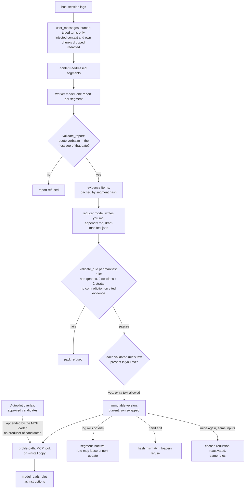

## 1. Executive Summary

Emulo reads the local session logs of Claude Code, Codex, Copilot CLI, OpenCode
and Antigravity, keeps only the messages the developer typed, and has the
developer's own coding agent distil them into rules about how that person works,
designs, writes and edits video. Every rule cites short quotes from those
messages, and the result is installed where an agent reads it. The README
insists this is *"Not memory"*; by this atlas's test it is a profile store that
persists across sessions and makes claims that can be false.

What is notable is the evidence discipline on the way in. A worker's quote must
appear verbatim in the message dated as it claims, an inferred rule needs two
sessions and two source-quarter strata, a rule citing contradicted evidence is
refused, and every artifact is content-addressed so an unchanged update costs
nothing.

What is weak is everything after admission. The served profile file is written
by the reducer model and checked only for containing the validated rules. A
wrong rule has no correction path short of re-mining, which reuses the cached
result.

The system has two halves. `emulo.py` is one stdlib file holding the extractor,
the redactor, the plugin runtime, the validators, the install adapters and the
MCP server. `emulo_autopilot/` is a second design — candidates, review
decisions, generations with rollback, end-to-end encrypted sync through a
Cloudflare worker — whose candidate queue nothing in the tree fills.

No mark is awarded; section 9 names each near-miss.

## 2. Mental Model

A memory here is a **rule**: a sentence, an operational implication, a `kind`
of `inferred` or `explicit`, and a list of evidence ids. An evidence item is a
worker's reading of one segment — an instruction, an implication, one or more
quotes of at most 200 characters, and any contradicting quotes. The quotes are
the only part Python can check against the source.

**A message becomes evidence** when a worker cites it and `validate_report`
finds the quoted text inside the message carrying the claimed date
(`emulo.py:2022-2031`, `:2086-2093`). **Evidence becomes a rule** when the
reducer writes it into `draft-manifest.json` and `validate_rule` accepts it: not
on a generic-phrase list, two distinct sessions and two strata for `inferred`,
one uncontradicted quote with `confidence: low-frequency` for `explicit`, and no
contradiction on any cited item (`:1096-1135`). **A rule becomes a belief**
when `plugin activate` swaps `current.json` to the new version, after which
every loader serves it as an instruction.

**How a rule stops being one.** A newer activation replaces the whole version.
A session log the host deletes — Claude Code's retention defaults to 30 days,
which the README's FAQ names — deactivates every segment that held it at the
next `sync_segments`, and nothing rebuilds a segment from a session that is gone
(`:946-962`). So the next full update reduces over less history and the rule
can lapse without anyone rejecting it. There is no path by which a person
rejects one rule.

The model never sees the evidence. `you.md` holds rules and implications; the
receipts live in a private `appendix.md` that no loader returns
(`:4023-4050`).

## 3. Architecture

`emulo.py` is a single stdlib-only file for Python 3.8 and later. Its
`plugin` subcommands are the runtime the host agent drives: `preflight` and
`prepare` build a plan and a run directory, `validate-report` and `cache-report`
gate worker output, `validate-pack` and `activate` gate the reducer's pack, and
`profile-path` resolves what to load (`emulo.py:3717-3793`, `:4387-4454`). The
model work is done by whatever agent runs the skill; Emulo makes no network
call and calls no model itself.

State lives in `~/.emulo` or `EMULO_HOME`. Segments are stored under their hash;
worker reports under `cache/` keyed by prompt schema and segment hash; a
reduction under the hash of its report set; and each profile version in
`profiles/default/versions/<version>/` with a `manifest.json` that pins every
file's SHA-256. `current.json` names the active version and its manifest hash,
and `active_profile_state` refuses any mismatch (`:3995-4021`).

The one-file path skips all of this: `emulo` writes `emulo-out/` with chunks and
a `RUN_ME.md` for the agent, the agent writes `you.md` on its own, and
`--install` copies it into place. Nothing validates that profile beyond the
separate `emulo verify` quote search (`:4886-4897`).

`emulo_autopilot/` is a second store under `~/.emulo/autopilot`: JSON
candidates, append-only decision files, immutable generations with parent
pointers and a `head.json`, a session scanner, and continuity code that
encrypts a generation and pushes it to a Cloudflare worker with D1. The
package installs as the `emulo-autopilot` CLI (`pyproject.toml:29`).

### Deployment and ergonomics

Nothing has to run. `pip install emulo` or a plugin install is the whole
setup, no API key is needed by Emulo, and mining is offline if the host agent
uses a local model. The cost is model passes: full history is the default, and
the plan prints worker and reducer counts before approval. The store is JSON
and Markdown, readable by hand, but not repairable by hand: an edited profile
file fails its manifest hash and the loaders stop serving it
(`docs/PROFILE-FLOW.md:221`).

## 4. Essential Implementation Paths

**Extraction.** `user_messages` (`emulo.py:396-461`) parses each log format,
keeps user turns that `is_human_turn` accepts (`:374-394`), strips Codex control
envelopes, and drops injected context, pasted stack traces and Emulo's own chunk
headers. `mine_files` (`:531-602`) deduplicates messages of 200 characters or
more across sessions, redacts, and emits one record per session with a content
hash.

**Segmentation.** `sync_segments` (`:910-986`) packs records into segments by
source and date, keyed by `segment_hash` over session ids and content hashes.
A session whose hash changed or vanished deactivates its segment; only sessions
still present are rebuilt (`:949-962`).

**Planning.** Full mode, the default, takes every active segment
(`build_deep_preflight`, `:2309-2355`). `--preview` selects four to eight
segments under a 160,000-token cap. `prepare` refuses to run unless the plan
hash equals the one the user approved (`:4302-4312`).

**Worker gate.** `validate_report` (`:2033-2100`) checks coverage against the
segment, four domain states, at most twelve evidence items, and the verbatim
receipt check for every quote and contradiction.

**Reducer gate.** `validate_profile_pack` (`:1251-1353`) requires four domain
states with `work` active, exact frontmatter names, `validate_rule` on every
manifest rule, each rule's text and implication present in its file, every
cited quote present in `appendix.md`, and card counts equal to distinct
sessions.

**Activation.** `activate_profile_pack` (`:1585-1677`) stages the version,
validates it, renames it into place, writes `current.json`, and on any failure
restores the previous pointer bytes. `activate_cached_reduction` (`:1679-1711`)
repoints to an existing version with no model call.

**Loading.** `resolve_profile_paths` (`:4023-4050`) returns the core file and
one domain file after re-hashing both. `mcp_load_profile_text` (`:4630-4647`)
concatenates them and appends the Autopilot overlay. `install_profile`
(`:3541-3634`) writes a marked block or a skill file.

**Autopilot.** `classify_candidate` (`emulo_autopilot/policy.py:23-44`),
`record_review` (`service.py:76-93`), and `AutopilotStore.activate` and
`rollback` (`store.py:630-701`).

## 5. Memory Data Model

| Artifact | Where | Holds |
| --- | --- | --- |
| session record | in memory during a run | session id (hash of the path), source, dates, message list, content hash |
| segment | `segments/1/<hash>.txt` plus an index | redacted typed messages under `===== session:… =====` headers |
| report | `cache/reports/2/<segment hash>.json` | evidence items: domain, kind, instruction, implication, quotes, contradictions, write register |
| pack | `runs/<id>/pack/` | `you.md` and up to three domain files, `appendix.md`, `card.json`, `draft-manifest.json` |
| version | `profiles/default/versions/<v>/` | the pack plus `manifest.json` with file hashes, report-set hash, segment hashes, source coverage |
| pointer | `profiles/default/current.json` | active version and manifest hash |

A manifest rule carries `text`, `implication`, `kind`, `evidence_ids`, and
optionally `confidence` and `register`. There is no status, no timestamp of its
own, no scope and no identity that survives a re-reduction: a rule is its text
inside a version.

**Provenance is real but private.** Each rule reaches its quotes through
evidence ids, and each quote names a session hash and a date. The appendix
holds them; the served file does not.

**Time.** Quotes carry the date the message was typed. Versions carry no
creation time beyond the filesystem. Strata are source and calendar quarter
(`:1137-1141`).

**Autopilot records** are richer: a candidate has `kind` from
`directive | correction | preference | workflow | retirement`, a `scope` list,
receipts with `observed_at`, a contradiction count and risk categories, and an
id that hashes all of it (`emulo_autopilot/contracts.py:15-17`, `:78-84`,
`:108-190`). A decision is `approve` or `reject` with a reason and a policy
class (`:193-222`).

## 6. Retrieval Mechanics

There is no retrieval. The loading skill for a domain returns two files and
the agent reads both whole; the MCP tool returns the same text; an install
writes the whole profile into a file the host loads at session start. The
skills carry the routing: `emulo:work` for execution and debugging,
`emulo:write` for copy, and so on, and `emulo:write` further picks a casual or
professional register section from the task.

Nothing bounds the size of what is injected. The reducer decides how many rules
to write, and no constant in `emulo.py` caps a profile file.

Whether it is loaded at all depends on the host. The README's support matrix,
from a host-by-host test on 25 September 2026, records a Codex `AGENTS.md`
install reaching the model end to end, OpenCode loading it into the system
prompt, and Claude Code not reliably opening the `you` skill without `/you`.

## 7. Write Mechanics

Writes are a batch the user starts. The agent runs `preflight`, shows the plan,
waits for approval, runs one worker per uncached segment and one reducer, then
`activate`. Nothing runs in the background, and a new rule is loadable the
moment `activate` returns.

**What the gates check, and what they do not.** The verbatim check binds a
quote to a message. Nothing binds the evidence item's `instruction` to its
quotes, or the rule's `text` to its evidence: both are model prose, constrained
only by the generic-phrase list and word counts (`:1096-1101`). A rule can cite
two real quotes and say something neither says.

**The served file is not the validated set.** `validate_profile_pack` asserts
`rule["text"] in profile` and the same for the implication (`:1323-1326`), so a
reducer that adds unvalidated rules to `you.md` passes. The function builds a
`validated_rules` dictionary that would support the reverse check and never
reads it (`:1290`, `:1341`). The experimental adaptive path renders the file
from the manifest with `render_domain_profile` (`:1371-1393`) and would not have
this gap; the release path lets the reducer write the file.

**Contradiction handling is refusal.** A worker records counter-quotes on the
evidence item; any rule citing that item is refused. The reducer is told to
discard such rules rather than resolve them (`MINING_PROMPT.md:86`, `:94`).

**Updates re-reduce everything.** Unchanged segments reuse cached reports, and
an identical report set reactivates the cached version with zero calls. Any
change reruns the reducer over every report.

### Operational cost

- Write: synchronous with the user's approval, model-heavy on first run, zero
  model calls on an unchanged update, one reducer pass plus affected workers
  otherwise.
- Background: none.
- Read: the whole core profile plus one domain file each time a skill or the
  MCP tool loads it; unbounded in code. An `AGENTS.md` install sits in the
  host's standing instructions, so it stays stable across turns.

## 8. Agent Integration

The Claude Code and Codex plugins register `emulo:mine`, `emulo:work`,
`emulo:design`, `emulo:write` and `emulo:video`; each loader skill runs
`plugin profile-path` and tells the agent to read every returned path
completely (`skills/work/SKILL.md`). The skills.sh bootstrap in
`.agents/skills/emulo/` fetches `emulo.py` and `MINING_PROMPT.md` at an exact
release tag and checks their SHA-256 against `runtime.json` before use.

The MCP server exposes one read tool, `load_emulo_profile`, over stdio
(`emulo.py:4603-4628`). No tool writes.

The agent orchestrates mining but cannot activate an unvalidated pack. It can
write a pack the validator accepts, which includes adding text to it
(section 7). Every step before model work stops for the user's approval of a
plan hash.

## 9. Reliability, Safety, and Trust

**Extraction is the strongest part.** Only human-typed turns are kept,
harness-injected text is dropped, and since 0.6.5 any message carrying Emulo's
own chunk header is dropped whole, because agents that were handed chunks in a
prompt logged them as the user's words (`docs/PROFILE-FLOW.md:344-348`).
Redaction runs before anything is written.

**Activation is fail-safe.** A failure after staging, after rename or after the
pointer write restores the previous pointer bytes, and a test injects each
failure (`tests/test_profile_store.py:396-417`). Loaders refuse any version
whose file hashes differ from its manifest.

**No uncertainty survives to the model.** `kind` and `confidence` stay in the
manifest. A profile migrated from a pre-plugin install is flagged
`legacy_unverified` and served with a trailing note, not withheld
(`emulo.py:4045-4049`, `:4640-4643`).

**Autopilot is built and not fed.** `put_candidate` and `SessionScanner` have
no caller outside tests, and `auto_activate_enabled` is `False` at both call
sites, so the `safe` class never occurs (`emulo_autopilot/service.py:10`,
`:78`). Activation appends each approved candidate's statement as a bullet
without reading `kind`, so an approved `retirement` would add a line rather
than remove one (`store.py:580-604`). A later `reject` does not remove an
active candidate; only `rollback` does. The MCP loader reads the overlay on
every call (`emulo.py:4644-4646`).

Capability marks:

- `tombstone` — none. The guide's answer to a wrong rule is "mine again", and
  the same inputs reactivate the same version. Autopilot's `reject` decision is
  keyed on a candidate id that hashes the whole candidate, and nothing produces
  candidates.
- `trust_state` — Autopilot's pending, approve and reject decisions do gate
  activation, which is a filter, but the queue has no producer. The mined
  profile has no status on a rule.
- `bitemporal` — quote dates are when a message was typed; nothing records
  when a rule held.
- `scope_enforced` — one person per store. Domains are separate files picked by
  the calling skill, with no key on a rule.
- `audit_log` — versions are immutable and retained, which is history; no event
  records an activation or a replaced pointer. Autopilot's decision files are
  append-only and have nothing to decide on.
- `human_review` — the approval gate prices model work, not content. The
  Autopilot `review` command is a person's verb over a queue nothing fills.
- `negative_eval` — `test_mcp_reflects_append_only_rollback` asserts a
  rolled-back rule is absent from the MCP text after asserting the kept rule is
  present (`tests/test_mcp_server.py:196-212`). It is a well-formed read-path
  exclusion, and the only writer of the material it excludes is the test's own
  fixture, so it tests a layer that is empty in any real install. The mined
  profile's exclusion tests are write-time refusals.

## 10. Tests, Evals, and Benchmarks

Nothing was built or run for this report; everything below is from reading the
tests at the pin. CI runs `python -m unittest discover -s tests -v` on Python
3.8 and 3.12, with the continuity tests skipping on 3.8 where the
`cryptography` extra is not installed (`.github/workflows/tests.yml:35`).

**The gates are tested on their refusals.** An invented quote is rejected
(`tests/test_plugin_runtime.py:586-590`), as are quotes from unknown sessions,
oversized reports and a missing domain state. `validate_rule` refuses a single
session, a contradiction and a generic rule
(`tests/test_profile_store.py:183-219`). No test gives `validate_profile_pack`
a `you.md` carrying a rule absent from the manifest.

**The update path is tested on a function it does not call.**
`test_update_selection_retains_history_and_marks_only_new_work` exercises
`select_run_segments` (`tests/test_plugin_runtime.py:467-480`), which has no
caller outside that test. The full-mode planner takes every active segment, and
no test removes a session between two syncs.

**Evaluation of effect is published, and says what it measures.** The
`site/fable/` tree commits a pre-registered study with its raw outputs, scoring
scripts and `data.json`. The README's figures recompute from it: the mined
profile separated from a same-length invented profile on 5 of 9 comparisons on
Fable 5.1 and 1 of 9 on Opus 5 (`H2` in `site/fable/data.json`). The
pre-registration predicted fewer than 2 of 9, so its `FAIL` verdict is the
pessimistic prediction failing. The metrics are border radius, saturation,
containers and length: whether output changed, not whether it improved.
`docs/proof/` describes a further benchmark as unexecuted. No paper or citation
block is in the tree.

## 11. For Your Own Build

### Steal

- **Bind a quote to the dated message, not the corpus.** The check that a quote
  sits inside the message carrying its claimed date is a few lines and stops a
  model inventing or relocating evidence.
- **Keep only what the human typed, and drop your own output on re-read.** A
  profile mined from logs that contain its previous chunks is mining itself.
- **Content-address every stage.** Segment, report and reduction hashes make
  an unchanged update free and a changed one proportional.
- **Swap an active version by pointer, with the old pointer restored on any
  failure, and inject failures at each step in a test.**

### Avoid

- **Validating a manifest and serving a file the model wrote.** Render the
  served file from the validated records, or assert set equality between them.
- **Treating source-log retention as the forgetting policy.** When evidence
  disappears upstream, decide on purpose whether the belief lapses.
- **A correction path that is "run it again".** When re-running is
  deterministic over cached inputs, it restores the rule the person wanted gone.
- **Shipping a review queue before its producer.** A policy, decisions,
  generations and encrypted sync around a queue nothing fills cost maintenance
  and read as a feature.

### Fit

This suits one developer who wants a standing description of their own habits
in several agents, is willing to spend model passes on a full history, and will
read the result before installing it. It does not suit anyone who needs to
retract a rule and have it stay retracted, anyone sharing a repository where an
`AGENTS.md` install would publish verbatim quotes, or a team: the store is one
person and the design has no second. The published evaluation shows the profile
changes output style, and the project states it has not shown the work gets
better.

## 12. Open Questions

- Does any shipped build, the Cloudflare worker's founding beta, or an
  unpublished client produce Autopilot candidates?
- How often does a reducer write text into `you.md` beyond the manifest rules,
  on real histories?
- After a log rolls off, how many rules lapse at the next update on a typical
  30-day Claude Code retention?
- Does the reducer, in practice, discard every rule whose evidence carries a
  contradiction, or re-cite uncontradicted items to keep it?

## Appendix: File Index

- **Extraction and redaction:** `emulo.py:96-600` (`redact`, `is_human_turn`,
  `user_messages`, `mine_files`).
- **Segments, caches, planning:** `emulo.py:820-1036`, `:2189-2355`,
  `:4285-4385`.
- **Validation and activation:** `emulo.py:1086-1711`, `:2010-2100`.
- **Loading and MCP:** `emulo.py:3995-4050`, `:4538-4712`; install at
  `:3520-3634`; verify at `:4799-4962`.
- **Contracts for the model:** `MINING_PROMPT.md`, `skills/*/SKILL.md`,
  `.agents/skills/emulo/`.
- **Autopilot:** `emulo_autopilot/contracts.py`, `policy.py`, `service.py`,
  `store.py`, `sessions.py`, `cli.py`, `continuity*.py`; worker in
  `cloud/worker/src/`.
- **Tests:** `tests/test_plugin_runtime.py`, `tests/test_profile_store.py`,
  `tests/test_mcp_server.py`, `tests/test_autopilot_store.py`,
  `tests/test_verify_receipts.py`.
- **Evaluation artifacts:** `site/fable/data.json`,
  `site/fable/method/PREREGISTRATION.md.txt`, `docs/proof/README.md`.

### Recorded searches

Checked against the checkout at the pinned revision.

- `grep -rn 'put_candidate\|SessionScanner(' --include='*.py' .` — the definitions in `emulo_autopilot/store.py:245` and `sessions.py:90`, otherwise only files under `tests/`.
- `grep -rn 'auto_activate_enabled=True' --include='*.py' .` — only `tests/test_autopilot_policy.py`.
- `grep -rn 'emulo-autopilot\|emulo_autopilot\|autopilot' README.md docs skills .agents SECURITY.md CHANGELOG.md MINING_PROMPT.md` — no match.
- `grep -n 'validated_rules' emulo.py` — lines 1290 and 1341 only; never read.
- `grep -rn 'select_run_segments' --include='*.py' .` — the definition and `tests/test_plugin_runtime.py:472`.
- `grep -n -iE 'blocklist|denylist|tombstone|forget|retire' emulo.py MINING_PROMPT.md` — no match.
- `grep -nE '^[A-Z_]*MAX[A-Z_]* =' emulo.py` — report, quote, scout and preview caps; none on a profile file.
- `grep -n -iE 'extra|unvalidated' tests/test_profile_store.py` — no match.
- `grep -rn '\["kind"\]\|retirement' emulo_autopilot/` — `contracts.py`, `policy.py` and `service.py`; `store.py` never reads a candidate's kind.
- `grep -rliE 'arxiv|bibtex|@article|@misc|doi\.org' . --exclude-dir=.git --exclude-dir=node_modules` — no match, and no `CITATION.cff`.

## History

**2026-09-26** — [`a8552916c5920c1a5ee16b8fa1c1857f6c1ad9b4`](https://github.com/ohad6k/emulo/commit/a8552916c5920c1a5ee16b8fa1c1857f6c1ad9b4) — first reading, at the head of `main`, a merge dated 25 September 2026. The project was named Ditto until v0.5.0. No mark awarded; section 9 names each near-miss. Screened before reading: three auto-run surfaces (`.claude-plugin/` manifests with no hooks, `server.json` and `smithery.yaml` declaring the MCP start command), no build-time execution point, three unpinned surfaces, and six dependency files inside the cooldown, every file in the depth-1 clone dating to the tip. Read with `grep`, `sed` and `awk`; nothing installed, built or run.
