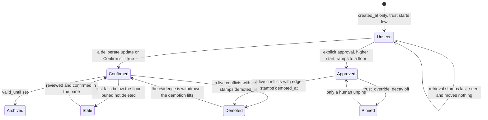

## 1. Executive Summary

Engram Alpha is graph memory for AI coding assistants: 25,521 lines of Rust
across `engram-core`, `engram-mcp` and `engram-http`, MIT, 66 commits since
3 July 2026, shipping as a JetBrains plugin and a VS Code extension on three
marketplaces with a browser demo of the real pane. **Not to be confused with
[Engram](../engram/) — a different project of the same name, already in this
atlas.**

A memory is a typed node — `Principle`, `Decision`, `Caution`, `Problem`,
`Resolution`, `Insight`, `Intent`, `Anchor` — joined by typed edges: `about`,
`because`, `answers`, `builds-on`, `replaces`, `conflicts-with`, `needs`.

**Its trust model states two principles the rest of this corpus mostly violates**,
and `crates/engram-core/src/policy.rs` names both:

> **Time doesn't validate.** `stable` knowledge holds its trust flat until a live
> `conflicts-with` edge (the judged-evidence event) stamps `demoted_at`; only
> then does it ramp down, and withdrawing the evidence withdraws the demotion.

> **Exposure doesn't validate.** Retrieval stamps `last_seen` for observability
> only — it proves a note was *findable*, not that it is true. Trust anchors on
> `confirmed_at`, which only deliberate acts refresh. Otherwise a broad recurring
> query would keep an attractive but wrong note alive forever — **retrieval
> certifying its own outputs.**

That second sentence is the exact failure this atlas records in
[Core Memory](../core-memory/) ("recall raises the class… still a use signal
feeding a trust field"), in [NOOA](../nooa-memory/)'s myelination, and in the
decay curves of [Mnemopi](../mnemopi/) and [PowerMem](../powermem/). Engram names
it and refuses it. The header adds that both principles were *"learned from
external feedback on v0.4.1"* — a trust model changed by review rather than
defended.

Drift is treated the same way: surfaced for review, never demoting, because it is
*"environment-dependent (wrong cwd, feature branches) and a sticky stamp from a
bad scan would mass-bury the graph."* A system that knows which of its own
signals are too noisy to act on is rare.

**The write path resolves instead of queueing.** `WriteOutcome::Created` returns
the look-alike pairs the write just queued, with the reason in the type:
*"returned so the writer judges them in the same turn instead of leaving them for
the next session's brief (PLAN §7: detection is local, judgment is the
assistant's)."* Deterministic local detection, model judgment, in one turn — the
shape [resolve, don't just detect](../../patterns/resolve-not-just-detect/) asks
for.

**And the benchmark data is the most self-incriminating in the corpus.**
`eval/results/bench-100.json` is a thirteen-row ablation with a full config stamp
(`"embeddings_are_fake": false`, seed, embedder, reranker), a corpus profile, and
a phrasing mix. The shipped configuration is labelled *in the data*:
`"kw 0.15 · reranker VOTES   <- ships today"`. And it does not win:

```text
rag (pure vectors)   weighted_recall 0.992   oblique 0.92   tokens_mean 2268.8
engram (shipped)     weighted_recall 0.989   oblique 0.89   tokens_mean  373.1
```

They publish the row where plain RAG beats them on recall, and let the six-fold
token reduction make the argument. `contradictions-500.json` separates the two
ways contradiction detection fails — *"missed_by_retrieval": 0,
"missed_by_judgment": 3* out of 100 — which is a diagnostic decomposition almost
nobody reports, and `floor-500.json` sweeps twenty-one score floors with
unanswerable **controls** at each point, so the precision gained is priced
against the answerable questions declined.

The limits are real and stated by the name: this is alpha, there is no scope key
of any kind, and every number above is measured on graphs the project generated
itself.


## 2. Mental Model

A node is a claim of a stated kind, and the kind carries the epistemics: a
`Decision` is not a `Caution` is not an `Insight`. Durability is separate —
`stable`, `episodic`, `volatile` — and decides whether time is allowed to erode
it at all.

Trust is **computed at read time** from durable anchors, so nothing depends on a
background pass having run. The anchor picks the starting value: `created_at`
alone starts at `TRUST_UNSEEN_START`; `confirmed_at` (a deliberate update, or
"Confirm still true") restarts the clock at `TRUST_CONFIRMED_START`;
`approved_at` starts higher and ramps to a floor. `trust_override` — the pane's
pin — short-circuits all of it: pinned nodes never decay, never auto-archive, and
evidence events skip them, because *"a human said 'forever', so only a human
unsays it"* — while contradictions still surface for review.

A node whose computed trust falls below `STALE_TRUST` is **stale**: still
searchable, buried by the multiplier, flagged to the assistant, and put in the
pane's review queue for a human decision. Nothing disappears silently.

The other half of the state machine is the `suspects` table: look-alike pairs
with a similarity, an optional local-NLI hint (`contradiction | entailment |
neutral`) and a score whose column comment reads *"models don't validate"*. A
suspect is `suspected`, then `confirmed` or `dismissed`, and the verdict
vocabulary is `conflict`, `replaces`, `dismiss`.



The self-loop at the bottom is the design. Retrieval touches the graph and
changes no trust, so a note cannot certify itself by being popular.


## 3. Architecture

**Runtime.** A Rust core (`engram-core`) with an MCP server (`engram-mcp`, 2,979
lines) and an HTTP surface (`engram-http`), a Vue frontend for the pane, and
editor integrations for JetBrains and VS Code published to the JetBrains
Marketplace, the VS Marketplace and Open VSX. There is a standalone browser demo
running the real pane over an invented project.

**Persistence.** SQLite (`store_sqlite.rs`) with a second backend
(`store_tepin.rs`) behind the same `store.rs` trait. Four tables: `nodes`,
`edges`, `suspects`, `audit`, plus a `meta` table holding the embedding model
identity and vector width so a store cannot be silently read with the wrong
embedder.

**Modules worth naming.** `nli.rs` runs a local natural-language-inference model
for contradiction hints; `policy.rs` holds the trust constants and their
rationale; `redact.rs` exists at all; `cortex.rs`, `digest.rs`, `rag.rs`,
`hub.rs` carry retrieval and briefing; `migrate.rs` handles schema movement.

**Background work.** Deliberately little. Trust is a read-time computation.
Drift scans surface for review without demoting. The suspects queue is filled
synchronously by the write that created the look-alike.

### Deployment and ergonomics

One binary and one SQLite file per project, plus optional local models — an
embedder (`bge-small-en-v1.5`), a reranker (`jina-reranker-v1-turbo-en`) and an
NLI model (`mobilebert-uncased-mnli`) — all small enough to run on a developer
machine, which is the point. No service to stand up and no API key required to
store anything.

The pane is the operating surface, and it is unusually complete for an alpha: a
live graph, a review queue, conflict judgement, retirement, pinning, and a theme
menu. The browser demo means a reader can exercise the correction flow without
installing anything, which is the best documentation decision in the repository.


## 4. Essential Implementation Paths

- **Schema:** `crates/engram-core/src/schema.rs` — `nodes` (`:6`), `edges`
  (`:27`), `suspects` (`:50`), the append-only `audit` journal (`:65`), `meta`.
- **Types and vocabularies:** `crates/engram-core/src/types.rs` — node kinds,
  edge verbs, durability, statuses, `WriteOutcome::Created` returning `suspects`.
- **Trust:** `crates/engram-core/src/policy.rs` — the two principles, the
  anchors, `STALE_TRUST`, `trust_override`.
- **Contradiction:** `crates/engram-core/src/nli.rs`;
  `hub.rs:104` gates on a live `conflicts-with` edge with `valid_until` unset.
- **Stores:** `store.rs`, `store_sqlite.rs`, `store_tepin.rs`, `migrate.rs`.
- **Retrieval:** `rag.rs`, `cortex.rs`, `digest.rs`.
- **Redaction:** `redact.rs`.
- **Surfaces:** `crates/engram-mcp/`, `crates/engram-http/`, `frontend/`,
  `engram-vscode/`, the JetBrains plugin.
- **Evaluation:** `eval/src/` and `eval/results/` — 71 committed files.


## 5. Memory Data Model

`nodes` carries `id`, `type`, `title`, `body`, `durability`, `source`,
`session_id`, `created_at`, **`valid_from`, `valid_until`**, `status`,
`code_refs`, `tags`, `last_seen`, `confirmed_at`, `approved_at`, `demoted_at`,
`trust_override`. `edges` carries the same temporal pair plus `confidence`,
`strength`, `note` and a `status`.

**Bi-temporality is real and used.** `valid_from` / `valid_until` are validity
time and `created_at` is record time; `hub.rs:104` treats an edge as live only
when `valid_until.is_none()`, and `types.rs:368` documents a neighbour as
*"superseded/archived (`valid_until` set)"*. Archival is closing an interval
rather than deleting a row.

**The trust anchors are three separate durable facts**, not one score:
`confirmed_at` (a deliberate act), `approved_at` (explicit approval), and
`demoted_at` (contradicting evidence landed). Keeping them apart is what lets the
policy say *withdrawing the evidence withdraws the demotion* — with one blended
number that operation is impossible.

**`code_refs` ties memory to the artifact it describes**, which is the property
[Magic Context](../magic-context/) is credited for here.

**There is no scope key.** No user, project or workspace column; isolation is one
graph per project directory. Coherent for an editor plugin, and it means the
schema cannot host two projects without a migration.


## 6. Retrieval Mechanics

Vectors from `bge-small-en-v1.5`, a keyword weight of 0.15, and a reranker
(`jina-reranker-v1-turbo-en`) that **votes rather than decides** — a distinction
the ablation measures rather than asserts. Across every keyword weight in
`bench-100.json`, `reranker VOTES` beats `reranker DECIDES` on weighted recall
(0.991 vs 0.980 at the shipped 0.15) and on oblique questions (0.91 vs 0.80). A
reranker allowed to overrule the retriever loses obliquely-phrased hits; one that
contributes a vote does not.

The score floor is a published tradeoff curve rather than a constant.
`floor-500.json` walks twenty-one floors and reports, at each, recall@5, oblique
recall, mean results returned, mean tokens, and two decline rates — for
answerable questions and for **unanswerable controls**. At floor 0 the system
returns 9.95 results and 512 tokens and declines nothing including the controls;
by floor ~0.62 it returns 1.03 results and 55 tokens, declines 62% of controls
and 38% of answerable questions. Every operating point is priced.

Trust multiplies the score, so a stale node is buried rather than filtered — it
stays findable, which is what makes the review queue meaningful.


## 7. Write Mechanics

A write is synchronous and returns more than an id. `WriteOutcome::Created`
carries the node, any `warnings`, and the `suspects` — look-alike pairs the write
just created — *"so the writer judges them in the same turn instead of leaving
them for the next session's brief."*

The division of labour is stated: **detection is local, judgment is the
assistant's.** Similarity and the NLI hint are computed by small local models;
the verdict — `conflict`, `replaces`, `dismiss` — is the assistant's, and the
column comment beside the NLI score says why: *"models don't validate."* A
probability is a hint, not a ruling.

Correction is a family of moves rather than a delete: a `replaces` edge, a
`conflicts-with` edge that stamps `demoted_at`, closing `valid_until` to archive,
approving, pinning, or dismissing a suspect. Every one of them appends to the
audit journal.

**The audit journal is the richest in this corpus.** One row per node or edge
mutation, insert-only, carrying `before_json` and `after_json` in full, the
`action` from an eleven-value vocabulary (`created | updated | approved |
unapproved | pinned | unpinned | demoted | undemoted | archived | deleted |
imported`), the `origin` surface (`pane | mcp | daemon | cli | library`), and the
writing process's `session_id`, `cwd`, `pid` and `version`. `title` is snapshotted
so it *"survives deletion"*.

Knowing which surface made a change — a human in the pane, an assistant over MCP,
a daemon — is the distinction most audit logs here collapse, and it is exactly
what you need when a memory is wrong and you are deciding whether to distrust the
model or the person.


## 8. Agent Integration

An MCP server for the assistant, an HTTP surface, a JetBrains plugin, a VS Code
extension, and a standalone pane. The screenshots show the intended loop: the
graph fills in live while Claude Code works in the terminal below.

The assistant's authority is broad on judgment and bounded on trust. It writes
nodes and edges, and it judges the suspects the write hands back — but approval
and pinning are human acts, retrieval moves nothing, and a pinned node ignores
the assistant's evidence entirely until a human unpins it.

The pane is a genuine review surface: stale nodes queue for a decision, conflicts
are judged there, decisions are retired there, and the browser demo lets a reader
do all three without installing anything.


## 9. Reliability, Safety, and Trust

**`audit_log` — earned, and it sets the bar.** Insert-only, one row per
mutation, full before and after JSON, an eleven-value action vocabulary, the
originating surface, and process context. Deletion-surviving titles.

**`bitemporal` — earned.** `valid_from` / `valid_until` on nodes and edges
against `created_at`, used on the read path to decide what is live.

**`trust_state` — earned.** `suspects.status` is a persisted
`suspected | confirmed | dismissed`; nodes carry a `status` and three distinct
durable epistemic stamps, `confirmed_at`, `approved_at` and `demoted_at`, which
the policy reads separately and which the audit journal names as actions.

**`human_review` — earned.** A review queue for stale nodes, conflict judgement,
retirement and pinning, with pinning explicitly reserved to humans.

**`negative_eval` — earned.** The floor sweep carries unanswerable **controls**
at every operating point and reports `controls_declined`, so the evaluation
asserts that material which should not be returned is not returned — and prices
the answerable questions lost at each threshold.

**`tombstone` — not found.** A `dismissed` suspect durably records that a pair
was judged not-a-conflict, and `replaces` records supersession, but both are
keyed on ids. Nothing is keyed on a rejected *value*, so a claim retired as wrong
can be re-authored from the next conversation that mentions it.

**`scope_enforced` — not found.** No scope key on either table.

Other observations:

- **`redact.rs` exists**, so redaction is a modelled concern rather than an
  afterthought; what drives it was not traced.
- **`meta` pins the embedding model identity and vector width**, so a store read
  with the wrong embedder is detectable rather than silently wrong.
- **Alpha, and the README says so first.** APIs may change between releases.
- **Every number is self-generated.** The graphs, questions and controls are the
  project's own synthetic corpora; nothing here is measured on an external
  benchmark, and the report should not be read as saying otherwise.


## 10. Tests, Evals, and Benchmarks

`eval/` is a first-class crate with 71 committed result files —
`bench-100.json`, `contradictions-500.json`, `floor-100/500/1500.json` and their
`.log` companions — and this is the part of the project most worth copying.

**The ablation labels its own shipped row.** `bench-100.json` holds thirteen
configurations with a runtime stamp (`"embeddings_are_fake": false`, seed,
embedder, reranker), a corpus profile down to the verb mix and code-ref
distribution, and a phrasing mix of 45% lexical, 45% paraphrase, 10% oblique. One
row reads `"kw 0.15 · reranker VOTES   <- ships today"`, and pure RAG beats it on
recall. Publishing the row you lose, beside the row you ship, in the machine-
readable artifact, is the strongest form of the discipline this atlas credits
[Perseus Vault](../perseus-vault/) and [memsem](../memsem/) for.

**Contradiction detection is decomposed, not scored.**
`contradictions-500.json`: 100 contradictions, 97 caught, `"missed_by_retrieval":
0`, `"missed_by_judgment": 3`; 100 entailments with 78 supported. Separating a
detector's retrieval failures from its judgment failures tells a maintainer which
half to fix, and almost nothing in this corpus reports it.

**The floor sweep has controls.** Unanswerable questions at every threshold, with
`controls_declined` rising as the floor rises — so precision is never claimed
without the recall it cost.

Nothing was run for this review: three dependency surfaces were inside the
seven-day cooldown and one auto-run surface was present.

What the evaluation does not establish: any of this on data the project did not
generate. The graphs, the questions, the phrasing mix and the controls are all
synthetic and self-authored, which makes the *relative* comparisons (VOTES vs
DECIDES, floor by floor) credible and the absolute numbers a statement about
their generator.


## 11. For Your Own Build

### Steal

- **"Exposure doesn't validate."** Stamp retrieval for observability and let it
  move nothing. A trust signal fed by recall is retrieval certifying its own
  outputs, and it keeps attractive wrong notes alive forever.
- **"Time doesn't validate" — for stable knowledge.** Decay episodic and volatile
  material; hold stable knowledge flat until judged evidence lands. Age is not
  disagreement.
- **Make demotion reversible.** `demoted_at` is set by a live `conflicts-with`
  edge and lifted when that edge is resolved, dismissed or deleted. A correction
  that cannot be withdrawn makes reviewers reluctant to correct.
- **Decide which of your own signals may not act.** Drift is surfaced and
  deliberately never demotes, because a bad scan would mass-bury the graph.
  Knowing a signal is too noisy to be trusted with a write is a design decision
  worth writing down.
- **Return the conflicts from the write that created them.** Detection local,
  judgment the model's, both in one turn — instead of a queue somebody reads
  next session.
- **Log the origin surface.** `pane | mcp | daemon | cli | library` on every
  audit row answers "was this the human or the assistant", which is the first
  question when a memory turns out wrong.
- **Label the shipped row in the benchmark file.** Not the README — the data.

### Avoid

- **Letting a reranker decide.** Measured here across every keyword weight:
  DECIDES loses oblique recall against VOTES. If you rerank, fuse.
- **A single blended trust number.** Three separate anchors are what make
  "withdraw the evidence, withdraw the demotion" expressible at all.
- **Treating an NLI score as a verdict.** The column comment is *"models don't
  validate"*; the score is a hint and the judgment is elsewhere.
- **Reading self-generated benchmark numbers as external validation.** Engram is
  scrupulous about publishing its config; a reader still has to notice that the
  corpus is its own.

### Fit

This suits a developer who wants project memory inside the editor, with a graph
they can see and correct, and small local models rather than an API key. The
editor integrations and the browser demo make it unusually easy to evaluate
before adopting.

It is alpha, single-project, and has no scope key — so it is not a fit for a
team store or anything multi-tenant, and the API is expected to move.

Take the policy module even if you take nothing else. It is a few hundred lines
of constants and rationale, and it is the clearest statement in this corpus of
which signals are allowed to change what an agent believes.


## 12. Open Questions

- **How does any of it perform on a corpus the project did not generate?** Every
  committed number is over synthetic graphs and questions of its own making.
- **What drives `redact.rs`?** The module exists; the policy that calls it was
  not traced.
- **How often does the local NLI hint disagree with the assistant's verdict?**
  Both are stored — `nli_label` beside the resolved `status` — so the repository
  could report it and does not.
- **Does the TepinDB backend match the SQLite one?** Two stores behind one trait,
  with no parity comparison found.
- **What happens to a pinned node that is genuinely wrong?** Evidence events skip
  it by design; contradictions surface for review, and nothing forces the review.


## Appendix: File Index

**Schema and types**
- `crates/engram-core/src/schema.rs`, `types.rs`, `id.rs`

**Trust and judgment**
- `crates/engram-core/src/policy.rs`, `nli.rs`, `hub.rs`

**Stores**
- `store.rs`, `store_sqlite.rs`, `store_tepin.rs`, `migrate.rs`, `registry.rs`

**Retrieval and briefing**
- `rag.rs`, `cortex.rs`, `digest.rs`, `engine.rs`, `harness.rs`

**Safety**
- `redact.rs`, `config.rs`, `error.rs`

**Surfaces**
- `crates/engram-mcp/`, `crates/engram-http/`, `frontend/`, `engram-vscode/`

**Evaluation**
- `eval/src/`, `eval/results/` — `bench-100.json`, `contradictions-500.json`,
  `floor-100.json`, `floor-500.json`, `floor-1500.json` and logs

## History

**2026-08-06** — [`5721848af9fe4adc28ff08dce5bda6cfc3f24a37`](https://github.com/techtheist/engram/commit/5721848af9fe4adc28ff08dce5bda6cfc3f24a37) — first reading. The slug is `engram-alpha` because `engram` is taken by [a different project of the same name](../engram/); the two are unrelated. Screened before reading: 1 auto-run surface, 0 build-time exec paths, 2 unpinned dependency surfaces and three inside the seven-day cooldown. Nothing was installed, built or run; the committed evaluation artifacts were read, not regenerated.
