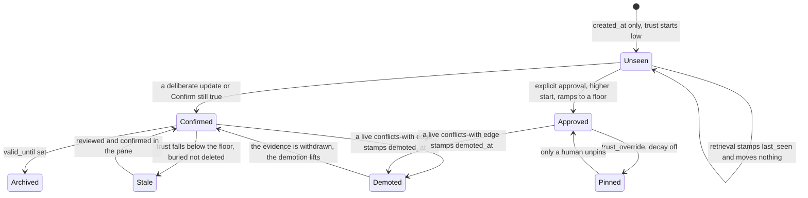

## 1. Executive Summary

Engram Alpha is graph memory for AI coding assistants: ~27,800 lines of Rust
across the crates (38,700 counting their test modules), MIT, release v0.8.9,
112 commits since
3 July 2026, shipping as a JetBrains plugin and a VS Code extension on three
marketplaces with a browser demo of the real pane. **Not to be confused with
[Engram](../engram/) — a different project of the same name, already in this
atlas.**

*Alpha* is part of the product's name, not a maturity label: the marketplace
identifier is `techtheist.engram-alpha`, the installed binary is
`engram-alpha`, and nothing in the README applies the word to the software's
state. The stability claim the repository does make is its own status line —
*"early development, heavily dogfooded, benchmark-driven — retrieval changes
cite a measured run or they don't ship"* — and the second half of that sentence
is the one this report can check.

A memory is a typed node joined by typed edges — but the vocabulary is
**per-graph configuration, not a closed enum**. `GraphConfig` (`config.rs`)
stores the ontology, the policy numbers and the brief shape as one document
inside the graph itself, travelling with `migrate` and riding along in exports.
The shipped preset is eight types — `Principle`, `Decision`, `Caution`,
`Problem`, `Resolution`, `Insight`, `Intent`, `Anchor` — over seven verbs:
`about`, `because`, `answers`, `builds-on`, `replaces`, `conflicts-with`,
`needs`. Two other presets ship beside it (`research`, `minimal`) and a graph
may define its own.

The rule that makes that safe is stated at the top of the module and enforced
throughout: **roles, never names.** Engine logic keys on the role flags a type
or verb carries — `worklist`, `supersession`, `contradiction` — never on the
strings, so a renamed or wholly replaced ontology keeps every behaviour.
`hub.rs:104` is the shape of it: the contradiction gate tests
`edge.edge_type.as_str() == contradiction_verb`, where the verb comes from the
graph's config, not from a literal. Two hard invariants hold across any
configuration — edges stay sentence-shaped, and exactly one supersession verb
plus one contradiction verb must exist, *"they are what make the graph active"*
— with `graph_config_validation_guards_hard_invariants` and
`shipped_presets_are_valid_and_complete` asserting both. There is deliberately
**no MCP write surface** for the ontology: reshaping it is a pane gesture,
*"like pin and delete"*.

**Its trust model states two principles the rest of this corpus mostly violates**,
and `crates/engram-core/src/policy.rs` names both:

> **Time doesn't validate.** `stable` knowledge holds its trust flat until a live
> `conflicts-with` edge (the judged-evidence event) stamps `demoted_at`; only
> then does it ramp down, and withdrawing the evidence withdraws the demotion.

> **Exposure doesn't validate.** Retrieval stamps `last_seen` for observability
> only — it proves a note was *findable*, not that it is true. Trust anchors on
> `confirmed_at`, which only deliberate acts refresh. Otherwise a broad recurring
> query would keep an attractive but wrong note alive forever — **retrieval
> certifying its own outputs.**

That second sentence is the exact failure this atlas records in
[Core Memory](../core-memory/) ("recall raises the class… still a use signal
feeding a trust field"), in [NOOA](../nooa-memory/)'s myelination, and in the
decay curves of [Mnemopi](../mnemopi/) and [PowerMem](../powermem/). Engram names
it and refuses it. The header adds that both principles were *"learned from
external feedback on v0.4.1"* — a trust model changed by review rather than
defended.

Drift is treated the same way: surfaced for review, never demoting, because it is
*"environment-dependent (wrong cwd, feature branches) and a sticky stamp from a
bad scan would mass-bury the graph."* A system that knows which of its own
signals are too noisy to act on is rare.

**The write path resolves instead of queueing.** `WriteOutcome::Created` returns
the look-alike pairs the write just queued, with the reason in the type:
*"returned so the writer judges them in the same turn instead of leaving them for
the next session's brief (PLAN §7: detection is local, judgment is the
assistant's)."* Deterministic local detection, model judgment, in one turn — the
shape [resolve, don't just detect](../../patterns/resolve-not-just-detect/) asks
for.

**And the benchmark data is the most self-incriminating in the corpus.**
`eval/results/bench-100.json` is a thirteen-row ablation with a full config stamp
(`"embeddings_are_fake": false`, seed, embedder, reranker), a corpus profile, and
a phrasing mix. The shipped configuration is labelled *in the data*:
`"kw 0.15 · reranker VOTES   <- ships today"`. And it does not win:

```text
rag (pure vectors)   weighted_recall 0.992   oblique 0.92   tokens_mean 2268.8
engram (shipped)     weighted_recall 0.989   oblique 0.89   tokens_mean  373.1
```

They publish the row where plain RAG beats them on recall, and let the six-fold
token reduction make the argument. `contradictions-500.json` separates the two
ways contradiction detection fails — *"missed_by_retrieval": 0,
"missed_by_judgment": 3* out of 100 — which is a diagnostic decomposition almost
nobody reports, and `floor-500.json` sweeps twenty-one score floors with
unanswerable **controls** at each point, so the precision gained is priced
against the answerable questions declined.

**And it runs on a corpus it did not write.** `eval/LONGMEMEVAL.md` reports the
full 500 questions of [LongMemEval](https://github.com/xiaowu0162/LongMemEval)-S
— real multi-session chat, ~115k tokens of haystack per question, evidence
sessions labelled, 30 questions deliberately unanswerable — ingested *as-is*,
one verbatim note per chat turn, with no extraction and no model anywhere in the
ingestion or grading path. Five arms over identical haystacks; the receipt is
`eval/results/longmemeval-s-full.json`:

```text
arm            R@1    R@5    MRR    tok/query
engram         0.909  0.953  0.929      207.5
rag            0.909  0.974  0.937    2,654.4
grep           0.706  0.864  0.775    4,761.0
curated-file   0.919  0.919  0.919    2,999.0
whole-file     1.000  1.000  1.000  122,515.5
```

No row is an outright win, and that is the point of publishing all five. Engram
matches pure vectors at R@1, gives up 0.02 at R@5, loses R@1 to a blind
3,000-token file dump — and delivers an eighth of rag's tokens doing it, with
both of its recall figures computed over the set calibrated delivery left rather
than over a fixed ten. The 30 unanswerable questions draw **2 empty deliveries,
28 warned, 0 unwarned**, with the weak line auto-fitted per store on 27 of 30
graphs.

The limits are real and the project states most of them itself: there is no
scope key of any kind, the external run grades retrieval at *session* level
(any turn from the right session counts, which flatters dumps), and the
harness never asks what the same warning line costs on the 470 answerable
questions — the offline suite, which does ask, answers 47% at 100 notes and 48%
at 1,500.


## 2. Mental Model

A node is a claim of a kind the graph's ontology declares, and the kind carries
the epistemics: under the shipped preset a `Decision` is not a `Caution` is not
an `Insight`, and the roles each kind carries are what the engine reads.
Durability is separate —
`stable`, `episodic`, `volatile` — and decides whether time is allowed to erode
it at all.

Trust is **computed at read time** from durable anchors, so nothing depends on a
background pass having run. The anchor picks the starting value: `created_at`
alone starts at `TRUST_UNSEEN_START`; `confirmed_at` (a deliberate update, or
"Confirm still true") restarts the clock at `TRUST_CONFIRMED_START`;
`approved_at` starts higher and ramps to a floor. `trust_override` — the pane's
pin — short-circuits all of it: pinned nodes never decay, never auto-archive, and
evidence events skip them, because *"a human said 'forever', so only a human
unsays it"* — while contradictions still surface for review.

A node whose computed trust falls below `STALE_TRUST` is **stale**: still
searchable, buried by the multiplier, flagged to the assistant, and put in the
pane's review queue for a human decision. Nothing disappears silently.

The other half of the state machine is the `suspects` table: look-alike pairs
with a similarity, an optional local-NLI hint (`contradiction | entailment |
neutral`) and a score whose column comment reads *"models don't validate"*. A
suspect is `suspected`, then `confirmed` or `dismissed`, and the verdict
vocabulary is `conflict`, `replaces`, `dismiss`.

The constants in that machine are per-graph, and two of them are fitted rather
than chosen. `Engine::auto_tune` runs at every session boundary: dial one
refits the conflict-suspect floor from the graph's own judged suspects by
maximising balanced accuracy over midpoint candidates, and dial two refits the
"likely not in memory" line. Each move is damped to half the distance to the fit
(`AUTO_TUNE_DAMPING = 0.5`), clamped into a stated range, suppressed below
`AUTO_TUNE_MIN_DELTA`, gated behind minimum volumes — 200 notes and 20
judgments with at least 3 on each side for dial one — and journalled as an
`auto_tuned` row. `policy.auto_tune = false` opts a graph out entirely. The
field lesson behind it is written down in the project's own chronicle:
*"register-dependent score scales — absolute thresholds don't transfer between
graphs, relative mechanisms do."*



The self-loop at the bottom is the design. Retrieval touches the graph and
changes no trust, so a note cannot certify itself by being popular.


## 3. Architecture

**Runtime.** One binary, and at runtime one heavy process per machine with any
number of deliberately light ones around it. The **machine core** holds every
open store and its locks, the three local models, the pane's web server and every
MCP session; it binds `127.0.0.1:8787`, runs as a hidden `core` subcommand, is
spawned detached by whichever command first needs it, and ends only on
`engram-alpha stop`. `serve` is a launcher that registers the repository and
exits. `engram-alpha mcp` is *always a bridge* — it never opens a store on any
backend, proxying the client's stdio session to the core over streamable HTTP,
and failing with an error in `.engram/mcp.log` rather than *"silently opening the
store in-process"*. `status`, `doctor`, `stop` and the hooks are one-shot REST
clients. Discovery is two JSON advertisements plus a `GET /health` check, so a
stale file is harmless, and `~/.engram/registry.json` lists which repositories
have graphs.

That consolidation is the change a reader of the previous release has to notice,
because it moves a guarantee. When each project directory ran its own process
over its own file, reading the wrong project's graph was not expressible. One
core holding every store makes it a routing decision — see the binding ladder in
section 8.

`engram-core` carries the engine, `engram-mcp` the tool surface, `engram-http`
the REST and SSE API, with a Vue frontend for the pane and editor integrations
for JetBrains and VS Code published to the JetBrains Marketplace, the VS
Marketplace and Open VSX. There is a standalone browser demo running the real
pane over an invented project.

**Persistence.** SQLite (`store_sqlite.rs`) with a second backend
(`store_tepin.rs`) behind the same `store.rs` trait. Four tables: `nodes`,
`edges`, `suspects`, `audit`, plus a `meta` table holding the embedding model
identity and vector width so a store cannot be silently read with the wrong
embedder.

**Modules worth naming.** `config.rs` holds `GraphConfig` — the ontology, the
policy numbers and the brief composition as one stored document, with the three
shipped presets and the validator for the hard invariants; `nli.rs` runs a local
natural-language-inference model for contradiction hints; `policy.rs` holds the
trust constants, the auto-tune bounds and their rationale; `onnx.rs` centralises
inference-session policy (arena, thread and batch-width knobs, read from
`ENGRAM_ONNX_*`); `redact.rs` exists at all; `cortex.rs`, `digest.rs`, `rag.rs`,
`hub.rs` carry retrieval and briefing; `migrate.rs` handles schema movement.

**Background work.** Deliberately little, and none of it load-bearing for a
read. Trust is a read-time computation. The suspects queue is filled
synchronously by the write that created the look-alike. What does run is
`Engine::validate_graph`, one session-boundary pass — archive what decayed,
retire what a supersession superseded, refit the two auto-tune dials, rescan for
conflicts, count drifted `code_refs` — journalled as a `graph_validated` row
with its own summary note, and backed by a six-hourly sweep. Drift scans surface
for review without demoting.

Since v0.8.4 a second detached daemon runs alongside that sweep: the **history
harvester**, a 60-second loop (fs-notify-accelerated in v0.8.7) that tails
coding-assistant transcripts into a separate episodic store — so "deliberately
little background" now understates a continuous transcript-tailing loop, even
though it feeds a sibling store and not the curated read.

### Deployment and ergonomics

One binary, one store file per project, one core process per machine, plus
optional local models — an
embedder (`bge-small-en-v1.5`), a reranker (`jina-reranker-v1-turbo-en`) and an
NLI model (`deberta-v3-small-tasksource-nli`, a 172 MB quantised ONNX export the
project made itself) — all small enough to run on a developer machine, which is
the point. No service to stand up and no API key required to store anything.

The NLI slot has been swapped twice on measurement, and the module says what
each swap bought: MNLI-only models *"presuppose co-reference"* and call
unrelated same-register notes confident contradictions — *"Engram uses Rust"*
against *"TepinDB is on crates.io"* scored 0.99 — where the multi-task model
judges them neutral, halving false alarms at the shipped gate. Predecessors stay
selectable, and the swap contract is a directory holding `model.onnx`,
`tokenizer.json` and a `config.json` whose `id2label` covers the three classes.

The pane is the operating surface and it is unusually complete: a live graph, a
review queue, conflict judgement, retirement, pinning, an ontology editor, a
feed timeline and a theme menu. The browser demo means a reader can exercise the
correction flow without installing anything, which is the best documentation
decision in the repository.

The daemon's memory footprint is measured with a committed before/after pair.
`eval/results/mem-daemon-before.json` and `-after.json` walk the same six stages
— startup with three models, one search, ten searches, an NLI claim check, a
conflict scan, thirty seconds idle — under stock onnxruntime defaults and under
the shipped ones: 669,696 → 896,000 KB against 667,648 → 696,320 KB. The
difference is an inference batch width capped at 2 instead of fastembed's 256;
`scripts/mem-probe.sh` is the harness, and three other suspects (the ORT arena,
per-session thread pools, malloc free-list retention) are recorded as measured
and refuted.


## 4. Essential Implementation Paths

- **Schema:** `crates/engram-core/src/schema.rs` — `nodes` (`:6`), `edges`
  (`:27`), `suspects` (`:50`), the append-only `audit` journal (`:65`), `meta`.
- **Types and vocabularies:** `crates/engram-core/src/types.rs` — open
  string-backed name types, durability, statuses, `WriteOutcome::Created`
  returning `suspects`, `MergeOutcome`.
- **Ontology and per-graph config:** `crates/engram-core/src/config.rs` —
  `GraphConfig`, `OntologyConfig`, `TypeRoles` / `VerbRoles`, the `engram`,
  `research` and `minimal` presets, `describe_ontology`.
- **Trust:** `crates/engram-core/src/policy.rs` — the two principles, the
  anchors, `STALE_TRUST`, `trust_override`, the `AUTO_TUNE_*` bounds.
- **Auto-tune:** `engine.rs` — `auto_tune` (`:335`), `fit_conflict_floor`
  (`:368`), `fit_weak_line` (`:441`), called from `validate_graph` (`:273`).
- **Contradiction:** `crates/engram-core/src/nli.rs`;
  `hub.rs:104` gates on a live edge carrying the graph's contradiction role
  with `valid_until` unset.
- **Consolidation:** `engine.rs` — `merge_nodes` (`:1654`).
- **Stores:** `store.rs`, `store_sqlite.rs`, `store_tepin.rs`, `migrate.rs`.
- **Retrieval and delivery:** `rag.rs`, `cortex.rs`, `digest.rs`;
  `Engine::search` (`engine.rs:1302`) applies the delivery floor and the knee
  cut, `search_confidence` (`:1365`) returns `none | weak | strong`.
- **Redaction:** `redact.rs`.
- **Surfaces:** `crates/engram-mcp/`, `crates/engram-http/`, `frontend/`,
  `engram-vscode/`, the JetBrains plugin.
- **Evaluation:** `eval/src/` and `eval/results/` — 84 committed result files,
  plus `eval/src/longmem.rs` (the LongMemEval adapter) and `eval/src/chains.rs`
  (the supersession-chain bench).


## 5. Memory Data Model

`nodes` carries `id`, `type`, `title`, `body`, `durability`, `source`,
`session_id`, `created_at`, **`valid_from`, `valid_until`**, `status`,
`code_refs`, `tags`, `last_seen`, `confirmed_at`, `approved_at`, `demoted_at`,
`trust_override`. `edges` carries the same temporal pair plus `confidence`,
`strength`, `note` and a `status`.

**Bi-temporality is real and used.** `valid_from` / `valid_until` are validity
time and `created_at` is record time; `hub.rs:104` treats an edge as live only
when `valid_until.is_none()`, and `types.rs:368` documents a neighbour as
*"superseded/archived (`valid_until` set)"*. Archival is closing an interval
rather than deleting a row.

**The trust anchors are three separate durable facts**, not one score:
`confirmed_at` (a deliberate act), `approved_at` (explicit approval), and
`demoted_at` (contradicting evidence landed). Keeping them apart is what lets the
policy say *withdrawing the evidence withdraws the demotion* — with one blended
number that operation is impossible.

**`code_refs` ties memory to the artifact it describes**, which is the property
[Magic Context](../magic-context/) is credited for here.

**There is no scope key.** No user, project or workspace column; isolation is one
graph per project directory. Coherent for an editor plugin, and it means the
schema cannot host two projects without a migration.

### What a user may reshape, and the guard on each

The pane's ontology editor writes `GraphConfig` — types, verbs, the trust and
threshold constants, and the brief composition — and three of its rules are
worth naming because each closes a way the reshape could strand data.

- **A rename is the migration gesture, not a relabel.** `rename_type` and
  `rename_verb` (`engine.rs:1194`) move the stored rows along with the name, and
  the editor's card shows how many nodes will follow.
- **A save cannot drop a vocabulary that still holds data.** Removing a type
  that has nodes fails with *"type … still has N node(s) — rename it (bulk
  retype) or retype them first"* (`engine.rs:1141`), and the same for verbs on
  edges. There is no path where an edit orphans knowledge.
- **The hard invariants survive every configuration.** Exactly one supersession
  verb and one contradiction verb must exist, or validation refuses the
  document — the graph cannot be configured into inertness.

Two smaller per-graph features sit in the same document. **Version tracking**
(off by default) stamps every new node of a `versioned` type with the graph's
current working version, set by the `set_version` MCP tool, so a note records
which release it was captured under; `Principle` and `Anchor` carry the
`versioned: false` role in the shipped preset, because *"a value or a code
subject transcends any single release"*, and the stamp is provenance only —
nothing in trust or ranking reads it. And a reserved `handoff` tag
(`config.rs:340`) gives an open worklist note guaranteed top placement in the
next session brief, which is reactive session-to-session memory without a new
node type.


## 6. Retrieval Mechanics

Vectors from `bge-small-en-v1.5`, a keyword weight of 0.15, and a reranker
(`jina-reranker-v1-turbo-en`) that **votes rather than decides** — a distinction
the ablation measures rather than asserts. Across every keyword weight in
`bench-100.json`, `reranker VOTES` beats `reranker DECIDES` on weighted recall
(0.991 vs 0.980 at the shipped 0.15) and on oblique questions (0.91 vs 0.80). A
reranker allowed to overrule the retriever loses obliquely-phrased hits; one that
contributes a vote does not.

The score floor is a published tradeoff curve rather than a constant.
`floor-500.json` walks twenty-one floors and reports, at each, recall@5, oblique
recall, mean results returned, mean tokens, and two decline rates — for
answerable questions and for **unanswerable controls**. At floor 0 the system
returns 9.95 results and 512 tokens and declines nothing including the controls;
by floor ~0.62 it returns 1.03 results and 55 tokens, declines 62% of controls
and 38% of answerable questions. Every operating point is priced.

Trust multiplies the score, so a stale node is buried rather than filtered — it
stays findable, which is what makes the review queue meaningful.

**Delivery is a second stage with two cuts, both reranker-gated.** `search`
(`engine.rs:1302`) fetches wide, reranks, drops everything under
`policy.delivery_floor`, truncates to the limit, then applies a *knee* cut: sort
the delivered score curve, find the largest relative drop over
`policy.knee_cliff`, and discard the tail below it. The reasoning for gating
both on the reranker is stated at the call site — the fused hybrid score is a
different scale, so a floor read against it would be read on the wrong ruler.
The consequence for every number in this report: engram's recall is measured
over a set the system has already trimmed, while the RAG arm it is compared
against keeps its full ten.

**The abstention line is fitted from probes the graph writes about itself.**
`fit_weak_line` (`engine.rs:441`) synthesises questions that have no answer —
half question-shaped templates over vocabulary borrowed from the graph's own
node titles, half *ICT transplants*: real sentences from the store with their
subjects coined out — then measures how high the reranker's top score climbs
against each, and takes the **larger** of the two families' q90 as the fit — the
line must clear whichever register this graph's noise speaks loudest in. The fit
is then damped halfway and clamped, with the lower clamp *relative to the
delivery floor* rather than absolute, so a line that could never fire is
impossible and one noisy probe register cannot teleport it. Borrowed vocabulary
is the load-bearing part and the comment says why: generic probes under-read how
high *this* graph's scores can go, and the first live fit found in-register
questions reaching 0.32 against a 0.25 line fitted from generic wording. What
clears the line is answered; what falls below is delivered warned, never cut. **No other report in this corpus describes a
system calibrating its own "I don't know" threshold from synthesised
unanswerable queries** — [MetaClaw](../metaclaw/) is the nearest, and it replays
*real* past turns against candidate policies rather than manufacturing negatives.

**Since v0.8.7 search is time-scoped, and it is a capture-window filter rather than
a new validity axis.** A single temporal grammar (`timespec.rs`) adds `after`,
`before`, `during_version` and `order` to the MCP `search`, applied *before* the
reranker and both calibrated cuts so "a scoped verdict describes the scoped set,"
with ordering applied last so a time-ordered read has the same membership as its
relevance twin. `during_version` resolves a window from the audit journal's
`version_switched` rows with no new storage, and `order: "recent"` folds a
history restatement under its newest form. Read precisely, the window filters
`created_at` — *when the knowledge was captured* — not the `valid_from`/`valid_until`
validity axis that already earns `bitemporal`; the code says so at
`store.rs:524-528`. So this strengthens recall ergonomics, not the temporal model.

Beneath the curated graph now sits a second, sealed **episodic history store**
(`history.tepin`, one per project): the harvester tails chat transcripts from
seven assistants — Claude Code, Codex, Gemini CLI, opencode, Kilo, Antigravity,
IBM Bob — as Session/Message nodes cross-linked to curated memory by a `born-in`
provenance edge. Its isolation is physical, not a filter: curated search, brief,
drift and decay never see it (`history.rs:7-11`). It is opt-in and **encrypted at
rest** (zstd then XChaCha20-Poly1305, key in the OS keyring), the sharper half of
a deliberate two-store redaction split — the curated graph is redacted but
inspectable, a transcript nobody curates is redacted *and* sealed. New MCP tools
`expand_history` and `list_sessions` read it on request.

## 7. Write Mechanics

A write is synchronous and returns more than an id. `WriteOutcome::Created`
carries the node, any `warnings`, and the `suspects` — look-alike pairs the write
just created — *"so the writer judges them in the same turn instead of leaving
them for the next session's brief."*

The division of labour is stated: **detection is local, judgment is the
assistant's.** Similarity and the NLI hint are computed by small local models;
the verdict — `conflict`, `replaces`, `dismiss` — is the assistant's, and the
column comment beside the NLI score says why: *"models don't validate."* A
probability is a hint, not a ruling.

Correction is a family of moves rather than a delete: a `replaces` edge, a
`conflicts-with` edge that stamps `demoted_at`, closing `valid_until` to archive,
approving, pinning, or dismissing a suspect. Every one of them appends to the
audit journal.

**`merge_nodes` is the consolidation move**, and its edge cases are where the
design shows. Several notes stating one truth collapse into one survivor: tags
and `code_refs` union, live edges rehome onto the survivor, victims are archived
behind a supersession edge rather than deleted, and `MergeOutcome` reports per
victim how many edges moved and how many were deliberately left — already
present on the survivor, internal to the merged set, or an *incoming*
supersession, which is part of the victim's own story and does not travel. An
archived survivor is refused outright. And the assistant cannot merge away a
pinned node: with `source == Source::Claude` a pinned victim raises
`Error::Pinned` carrying the instruction to *"tell the user and let them merge
this pair in the pane"* — the same human-only boundary the pin draws everywhere
else. Four committed tests cover the union, the pin refusal, the
outgoing-but-not-incoming supersession rule, and a live conflict rehoming onto
the survivor.

The audit journal also carries events that are not node or edge mutations:
`audit_activity` writes rows against the entity type `session`, which is where
`graph_validated` and `auto_tuned` land — so a threshold the system moved on
itself is on the same tape as a human's approval.

**The audit journal is the richest in this corpus.** One row per node or edge
mutation, insert-only, carrying `before_json` and `after_json` in full, the
`action` from an eleven-value vocabulary (`created | updated | approved |
unapproved | pinned | unpinned | demoted | undemoted | archived | deleted |
imported`), the `origin` surface (`pane | mcp | daemon | cli | library`), and the
writing process's `session_id`, `cwd`, `pid` and `version`. `title` is snapshotted
so it *"survives deletion"*.

Knowing which surface made a change — a human in the pane, an assistant over MCP,
a daemon — is the distinction most audit logs here collapse, and it is exactly
what you need when a memory is wrong and you are deciding whether to distrust the
model or the person.


## 8. Agent Integration

An MCP server for the assistant, an HTTP surface, a JetBrains plugin, a VS Code
extension, and a standalone pane. The screenshots show the intended loop: the
graph fills in live while Claude Code works in the terminal below.

**Which project a session serves is a five-rung ladder, and the last rung is the
one to read carefully.** An explicit `--db` pins it; otherwise the bridge asks
the client for `roots/list` and binds the first `file://` root, re-resolving on
`roots/list_changed` so one db-less config entry follows a client across
workspaces; otherwise the bridge's working directory; otherwise a machine-level
**default agent project** setting; and otherwise **the home graph** — *"the
session binds the core's `/mcp` endpoint rather than dying."* Every rung is
logged, so `mcp.log` always names the one that bound.

Rung five is a deliberate trade and the report's sharpest reservation about this
release. A session that cannot establish its workspace does not fail; it reads
and writes somebody else's graph — specifically the home one. The mitigation is
`set_project`, a tool the agent calls with an absolute path to rebind the running
session, which refuses unregistered paths and returns that project's brief in the
same call; sessions stranded on rungs four or five get a one-line hint above
their brief pointing at it, and the documentation supplies the `AGENTS.md` line
that makes it automatic. The clients that need it are named in the docs —
Windsurf and Devin CLI advertise roots and never answer them — which is the kind
of specificity that makes a workaround checkable.

The pane's Processes census shows each live session's current binding. Bridges
hold a 15-second-heartbeat lease that expires after 45 seconds, so a crashed
client leaves the list within three missed beats, and a failed registration never
blocks bridging: the census is observability, not control.

The assistant's authority is broad on judgment and bounded on trust. It writes
nodes and edges, and it judges the suspects the write hands back — but approval
and pinning are human acts, retrieval moves nothing, and a pinned node ignores
the assistant's evidence entirely until a human unpins it.

The pane is a genuine review surface: stale nodes queue for a decision, conflicts
are judged there, decisions are retired there, and the browser demo lets a reader
do all three without installing anything.


## 9. Reliability, Safety, and Trust

**`audit_log` — earned, and it sets the bar.** Insert-only, one row per
mutation, full before and after JSON, an eleven-value action vocabulary, the
originating surface, and process context. Deletion-surviving titles.

**`bitemporal` — earned.** `valid_from` / `valid_until` on nodes and edges
against `created_at`, used on the read path to decide what is live.

**`trust_state` — earned.** `suspects.status` is a persisted
`suspected | confirmed | dismissed`; nodes carry a `status` and three distinct
durable epistemic stamps, `confirmed_at`, `approved_at` and `demoted_at`, which
the policy reads separately and which the audit journal names as actions.

**`human_review` — earned.** A review queue for stale nodes, conflict judgement,
retirement and pinning, with pinning explicitly reserved to humans. Two further
gestures are human-only by construction rather than by convention: reshaping the
ontology has no MCP write surface at all, and `merge_nodes` refuses a pinned
victim when the caller is the assistant.

**`negative_eval` — earned.** The floor sweep carries unanswerable **controls**
at every operating point and reports `controls_declined`, so the evaluation
asserts that material which should not be returned is not returned — and prices
the answerable questions lost at each threshold. The LongMemEval run extends the
same discipline onto a corpus the project did not write: 30 labelled
never-answerable questions, scored on whether an answer went out unwarned.

**`tombstone` — not found.** A `dismissed` suspect durably records that a pair
was judged not-a-conflict, and `replaces` records supersession, but both are
keyed on ids. Nothing is keyed on a rejected *value*, so a claim retired as wrong
can be re-authored from the next conversation that mentions it.

**`scope_enforced` — not found.** No scope key on either table.

Other observations:

- **`redact.rs` drives the write path.** `redact::scrub` runs on title and body
  in the node write paths (`engine.rs:290-291`, `:2400-2401`): named patterns
  (PEM/AWS/JWT/GitHub/Slack/OpenAI/`key=value`) plus a high-entropy backstop, now
  judged per separator-delimited segment (segments under twelve chars abstain) so
  a compound identifier is no longer masked. The curated graph is redacted but not
  encrypted (it exists to be inspected); the history store is redacted *and*
  encrypted.
- **`meta` pins the embedding model identity and vector width**, so a store read
  with the wrong embedder is detectable rather than silently wrong.
- **The external dataset is SHA-256 pinned and re-verified on every open**, not
  only on download, and the reason is written at the function: *"a truncated
  download must never quietly grade as a small corpus."* Both digests live in
  `longmem.rs` with a committed test asserting they are well-formed. The data
  itself is never checked in — the repository carries the loader, the digests
  and the provenance note.
- **The system moves its own thresholds.** Two auto-tune dials rewrite
  `GraphConfig` at session boundaries. Every move is damped, clamped, gated on
  volume and journalled, and a graph can opt out — but a reader comparing two
  installations should expect their delivery and conflict thresholds to differ,
  because each was fitted to its own graph.
- **The loop is scored against the people in it.** `Engine::nli_agreement`
  joins each judged suspect's stored `nli_label` with the verdict a person
  reached and reports the confusion matrix: hits, false alarms, misses, passes,
  and an agreement rate that is absent until a hinted pair has been judged.
  Surfaced as `GET /conflicts/agreement` and a Checkup panel block. Two
  properties make it worth naming. It counts **misses** — the judge confirmed a
  pair the model called entailment or neutral — so the measure is not only about
  the alarms the model raised. And it is **read-only, never a calibration
  input**: the auto-tune dials do not consume it, so the model cannot chase its
  own agreement score. The type's own comment scopes the claim to what the row
  can carry: conflict and replaces both land as confirmed, so agreement reads
  *"the hint said contradiction and the judge kept the pair"* and no finer.
  Almost nothing in this corpus measures whether its automatic nomination agreed
  with the human who adjudicated it, and the systems that do usually feed the
  answer straight back into a threshold.
- **Most numbers are self-generated.** The offline suite's graphs,
  questions and controls are the project's own synthetic corpora. LongMemEval is
  the exception and it is one corpus, graded on the retrieval half only.


## 10. Tests, Evals, and Benchmarks

`eval/` is a first-class crate with 84 committed result files —
`bench-100.json`, `contradictions-500.json`, `floor-100/500/1500.json`,
`longmemeval-s-*.json`, `chains-200x20.json`, `budget-*.json`, `posttune-*.json`
and their `.log` companions — and this is the part of the project most worth
copying.

**The ablation labels its own shipped row.** `bench-100.json` holds thirteen
configurations with a runtime stamp (`"embeddings_are_fake": false`, seed,
embedder, reranker), a corpus profile down to the verb mix and code-ref
distribution, and a phrasing mix of 45% lexical, 45% paraphrase, 10% oblique. One
row reads `"kw 0.15 · reranker VOTES   <- ships today"`, and pure RAG beats it on
recall. Publishing the row you lose, beside the row you ship, in the machine-
readable artifact, is the strongest form of the discipline this atlas credits
[Perseus Vault](../perseus-vault/) and [memsem](../memsem/) for.

**Contradiction detection is decomposed, not scored.**
`contradictions-500.json`: 100 contradictions, 97 caught, `"missed_by_retrieval":
0`, `"missed_by_judgment": 3`; 100 entailments with 78 supported. Separating a
detector's retrieval failures from its judgment failures tells a maintainer which
half to fix, and almost nothing in this corpus reports it.

**The floor sweep has controls.** Unanswerable questions at every threshold, with
`controls_declined` rising as the floor rises — so precision is never claimed
without the recall it cost.

**The process model arrived with its own test suites**, which is the shape the
rest of the repository already had and the runtime did not.
`crates/engram-cli/tests/` carries `process_model.rs`, `roots_binding.rs`,
`session_brief_hook.rs` and `setup_windsurf.rs` — the binding ladder, the
convergence of concurrent launchers on exactly one core, and the per-client
setup writers, tested as integration rather than asserted in a doc. One of them
pins a case that is easy to get wrong under lazy opening: a resolved store
survives its project being unregistered.

### The external corpus

`eval/LONGMEMEVAL.md` and `eval/src/longmem.rs` run
[LongMemEval](https://github.com/xiaowu0162/LongMemEval)-S (Wu et al., ICLR
2025, MIT): 500 questions, each over its own multi-session chat haystack of
~115k tokens, evidence sessions labelled, 30 questions deliberately
unanswerable. The receipt is `longmemeval-s-full.json` — the whole population
run, `questions_run` equal to `questions_total`, mean 493 turn-notes per store,
and the table reproduced in §1 above.

**What the design gets right, and it is most of it.**

- **The population is not sampled.** Every question, with `questions_run` and
  `capped` in the receipt so a partial run cannot be mistaken for a full one.
- **No model in the ingestion or grading path.** One note per chat turn,
  verbatim, filler included; a question counts as answered when a note from a
  labelled evidence session lands in the delivered set. Deterministic and
  judge-free, which is the same standard the offline suite meets.
- **The unflattering register is chosen deliberately and labelled.** Engram
  ships no extractor — the deployed shape is typed notes an agent wrote — so
  as-is ingestion measures the *floor* for the product, not its intended
  operating point, and the page says exactly that.
- **One embedder, five arms, identical haystacks**, so what separates the rows
  is the retrieval stack.
- **The runtime swap is verified rather than asserted.** The full run used
  bge-small served by Ollama on GPU instead of onnxruntime on CPU, to bring
  ~16 h down to ~2 h. Both smoke receipts are committed —
  `longmemeval-s-smoke20.json` and `-gpu.json` — and every arm's R@1, R@5, MRR
  and token mean agrees to four decimal places. The claim of grade-identity is
  checkable from the repository, and it holds.
- **The rows that do not flatter are published.** `whole-file` scores a perfect
  1.00 and its column of interest is the 122,515 tokens per question it costs;
  the blind 3k `curated-file` beats engram on R@1 (0.919 vs 0.909); pure vectors
  beat it on R@5.

**Three things a reader has to hold while reading the table.**

1. **The token column compares two different delivery formats.** The engram arm
   is billed for a title plus a matched snippet per hit; the RAG arm is billed
   for a title plus the *whole* turn, for a fixed ten hits. Part of the 13× is
   calibrated delivery returning fewer notes — which is a real product
   behaviour, and it makes engram's recall harder-won, since its R@5 is computed
   over a set already trimmed — and part is snippet-versus-whole-note framing.
   A vector stack that also delivered snippets would close some of that gap.
2. **Session-level grading is generous to dumps**, which the page states
   plainly: any turn from the right session counts, so a blind selection that
   happens to keep one filler line from the evidence session scores as a hit.
   The token column is the only thing separating *present* from *readable* here;
   the focus/noise metrics that do that job in the offline suite are not run.
3. **This is the retrieval half.** The published benchmark grades a generated
   answer; these numbers grade a delivery, so they are not comparable with
   published LongMemEval scores and the page says so in its second paragraph.
   The reserved online half is named as the plan of record.

**The chat ontology is the interesting part of the adapter.** Rather than
forcing the software ontology onto chat — where every turn lands as `Insight`
and the type layer contributes nothing — the run defines a two-type ontology
*entirely as per-graph data*: `statement` (a user turn, `rank_prior` 0.05, so a
first-party source outranks a restatement at equal relevance) over `reply` (an
assistant turn, no prior, muted). Role is the one distinction an as-is ingester
can make without a classifier. `the_chat_ontology_validates_and_the_engine_accepts_its_types`
asserts the engine's write boundary accepts the fitted types and refuses the
stock one they replaced. Zero engine changes — which is the per-graph
`GraphConfig` machinery demonstrating itself on a register it was never written
for, and the strongest available evidence that the "roles, never names" rule is
real rather than aspirational.

**The gap in the external run is the warn rate on answerable questions.** The
abstention result is strong — 30 `_abs` questions, 2 empty deliveries, 28
warned, 0 unwarned, weak line auto-fitted on 27 of 30 stores. But
`weak_evidence_top` is read only in the abstention branch of `run_question`; the
answerable path computes rank and cost and never asks for a verdict. So the run
prices the false-positive side of the calibrated line and not its cost, and a
line that warns on everything would also score 0.00 here. The offline suite does
measure that cost and does not hide it: `posttune-100-enriched.json` pairs
`controls_unwarned` 0.0 with `answerable_warned` **0.473**, and
`posttune-1500-enriched.json` pairs 0.011 with 0.480 over 375 controls. So the
warning line is well-behaved at both graph sizes the project sweeps, and the
price of it is that nearly half of answerable questions come back carrying a
"likely not in memory" flag. Running those same two counters over LongMemEval's
470 answerable questions is a small change to `run_question`, and it would turn
the abstention paragraph from a one-sided result into a priced one — on the
corpus where it would matter most, because it is the one nobody here wrote.

### Supersession, measured against an ablation

`chains-200x20.json` builds ADR-shaped history — 20 chains of 3 generations,
each `replaces`-ing the last, 40 supersessions over a 660-node graph — and runs
the identical store with and without them:

```text
                 R@1    R@5   pollution  head_first  tokens
superseded      0.75   0.85       0.00        1.00     219.6
flat            0.50   0.83       0.88        0.59     292.8
rag             0.30   0.97       0.97        0.41   2,144.2
grep            0.00   0.67       0.70        0.02   2,656.8
curated-file    0.00   0.00       0.00        0.00   3,000.0
whole-file      1.00   1.00       1.00        0.00 165,115.0
```

`pollution` is the share of questions where a retired generation was delivered,
`head_first` the share where the current one won the ranking. Pure vectors have
the best R@5 on the board and deliver a retired answer 97% of the time — which
is the clearest statement in this repository of what the graph is *for*. The
receipt also records `retired_searchable: 0.0`, `retired_fetchable: 1.0`,
`history_reachable: 1.0`: retired generations leave the search path and stay one
link away.

### Levers that were tried and refuted

`budget-500.json` is six configurations × four retrieval limits over a
1,500-node graph and 858 questions, and it refutes the obvious lever. Raising
the limit from 10 to 30 moves the RAG arm's weighted recall not at all —
0.9231 at every limit — while `tokens_mean` goes 2,673 → 4,069 → 5,428 → 8,070
and `noise` climbs 0.907 → 0.968. The shipped stack behaves the same way,
0.9330 → 0.9343 across a 2.7× token increase. **Spending more delivered tokens
buys nothing measurable, in either stack.**

The same file prices the two delivery trims directly. `engram open+no-trims`
reaches 0.9257 weighted recall with `noise` 0.919 and 536 tokens; the shipped
configuration reaches 0.9330 with `noise` 0.546 and 293 tokens. Removing the
floor and knee roughly doubles both the tokens and the noise without buying
recall — which is the ablation that turns "calibrated delivery" from a claim
into a measurement. And a row that does not flatter sits beside it: `engram kw0`,
the keyword channel switched off entirely, edges the shipped keyword weight of
0.15 on weighted recall at limits 20 and 30 (0.9355 vs 0.9346).

The README keeps a standing list of mechanisms that did not survive measurement
— graph spreading activation, a deciding cross-encoder, deeper reranking, and
**hard abstention**, which was measured, priced and rejected because refusing to
return candidates costs real answers. That last decision is why the budget rows
all read `false_positive_rate: 1.0`: that field counts unanswerable questions
that returned *anything at all*, and this system deliberately always returns
something and warns instead. The metric that judges the warning is the pair
`controls_unwarned` / `answerable_warned`, and it holds its shape with scale —
0.000 / 0.473 on a 100-node graph, 0.011 / 0.480 on a 1,500-node one with 375
controls. Roughly one control in a hundred slips through unwarned, and nearly
half of answerable questions carry a warning they did not need.

Nothing was run for this review: four dependency surfaces were inside the
seven-day cooldown and one auto-run surface was present. Every number above was
read from committed receipts, and the two smoke receipts were compared field by
field.

What the evaluation does not establish: what a model *does* with any of
these deliveries. Both halves of the corpus — synthetic and external — are
graded on retrieval, so the numbers price what reaches the context window and
say nothing about what an answerer makes of it. The project names that gap
itself and reserves a section for closing it.


## 11. For Your Own Build

### Steal

- **"Exposure doesn't validate."** Stamp retrieval for observability and let it
  move nothing. A trust signal fed by recall is retrieval certifying its own
  outputs, and it keeps attractive wrong notes alive forever.
- **"Time doesn't validate" — for stable knowledge.** Decay episodic and volatile
  material; hold stable knowledge flat until judged evidence lands. Age is not
  disagreement.
- **Make demotion reversible.** `demoted_at` is set by a live `conflicts-with`
  edge and lifted when that edge is resolved, dismissed or deleted. A correction
  that cannot be withdrawn makes reviewers reluctant to correct.
- **Decide which of your own signals may not act.** Drift is surfaced and
  deliberately never demotes, because a bad scan would mass-bury the graph.
  Knowing a signal is too noisy to be trusted with a write is a design decision
  worth writing down.
- **Return the conflicts from the write that created them.** Detection local,
  judgment the model's, both in one turn — instead of a queue somebody reads
  next session.
- **Log the origin surface.** `pane | mcp | daemon | cli | library` on every
  audit row answers "was this the human or the assistant", which is the first
  question when a memory turns out wrong.
- **Label the shipped row in the benchmark file.** Not the README — the data.
- **Key your engine on roles, not on type names.** `worklist`, `supersession`,
  `contradiction` as flags a configured type or verb carries is what lets a user
  rename or replace the whole vocabulary without breaking a single behaviour —
  and it is what let the same engine run a two-type chat ontology on an external
  corpus with no code change. Declare the invariants that must survive any
  configuration (here: exactly one supersession verb, exactly one contradiction
  verb) and test them against every shipped preset.
- **Fit the "I don't know" line from probes your own store generates.** Coin a
  subject that cannot exist, phrase the question in vocabulary borrowed from
  your own titles, and see how high the ranker climbs with no answer present.
  That ceiling is your abstention threshold, it needs no labels, and it moves
  with the graph — a constant fitted on someone else's corpus will not transfer.
- **Damp, clamp and journal every self-tuning move.** Half the distance to the
  fit, a stated range, a minimum delta below which nothing moves, a volume gate,
  an audit row, and a per-graph off switch. Self-tuning without those five is a
  system that silently drifts away from the behaviour you tested.
- **Publish the before/after when you fix a resource bug.** Six named stages,
  two committed JSON files, and the refuted hypotheses beside the confirmed one.

### Avoid

- **Letting a reranker decide.** Measured here across every keyword weight:
  DECIDES loses oblique recall against VOTES. If you rerank, fuse.
- **A single blended trust number.** Three separate anchors are what make
  "withdraw the evidence, withdraw the demotion" expressible at all.
- **Treating an NLI score as a verdict.** The column comment is *"models don't
  validate"*; the score is a hint and the judgment is elsewhere.
- **Reading a retrieval-graded benchmark as a benchmark score.** The offline
  suite's corpus is the project's own, and the LongMemEval run grades deliveries
  rather than answers. Both are labelled as such in the repository; a reader
  quoting the numbers elsewhere is the one who drops the label.
- **Pricing an abstention mechanism on the abstention questions alone.** A line
  that warns on everything scores a perfect false-positive rate. The warn rate
  on *answerable* questions is the other half, and where this project does
  measure it, it is 47% at 100 notes and 48% at 1,500.
- **Comparing delivered-token counts across different delivery formats.** A
  snippet-per-hit stack against a whole-document stack is measuring two things
  at once. Say which part of the gap is fewer results and which is shorter ones.

### Fit

This suits a developer who wants project memory inside the editor, with a graph
they can see and correct, and small local models rather than an API key. The
editor integrations and the browser demo make it unusually easy to evaluate
before adopting. The configurable ontology widens that fit: the shipped preset
is software-decision shaped, but `research` and `minimal` ship beside it and a
graph can define its own type and verb set, which is the mechanism the external
run exercises.

It is single-project and has no scope key, so it is not a fit for a team store
or anything multi-tenant, and the README's own status line is *"early
development"*.

Take the policy module even if you take nothing else. It is a few hundred lines
of constants and rationale, and it is the clearest statement in this corpus of
which signals are allowed to change what an agent believes.


## 12. Open Questions

- **What does the calibrated warning cost on LongMemEval's answerable half?**
  The harness computes the verdict only for the 30 `_abs` questions. Two
  counters over the other 470 would price it.
- **What does a model do with these deliveries?** Every arm is graded on
  retrieval, so the comparison between a 208-token focused delivery and a
  2,654-token whole-turn one is a comparison of inputs, not of answers. The
  online half is planned and reserved.
- **How much of the LongMemEval result is the fitted chat ontology?**
  `--lme-ontology default` runs the stock types beside it and the page lists
  that pair as reserved, so the type layer's contribution on this corpus is
  named but not yet a number.
- **How much does the encrypted history store get used in practice?** The
  transcript-harvest layer is opt-in and physically isolated from curated recall;
  whether teams enable it, and how much it grows, is not observable from the tree.
- **What does the agreement rate read on a real graph?** The scoreboard is
  computed and rendered; no committed result file carries a value from a graph
  anyone actually judged, so the measure exists and its answer does not.
- **How often does a session land on the home graph?** Rung five is logged per
  session in `mcp.log` and the pane census shows the current binding, but nothing
  counts the fallback, so the frequency of the failure mode the ladder was built
  around is not observable from the tree.
- **Does the TepinDB backend match the SQLite one?** Two stores behind one trait,
  with no parity comparison found.
- **What happens to a pinned node that is genuinely wrong?** Evidence events skip
  it by design; contradictions surface for review, and nothing forces the review.


## Appendix: File Index

**Schema and types**
- `crates/engram-core/src/schema.rs`, `types.rs`, `id.rs`

**Ontology and per-graph configuration**
- `config.rs` — `GraphConfig`, `OntologyConfig`, `TypeRoles`, `VerbRoles`,
  `presets()`, `describe_ontology`

**Trust, judgment and calibration**
- `crates/engram-core/src/policy.rs`, `nli.rs`, `hub.rs`; `engine.rs` —
  `auto_tune`, `fit_conflict_floor`, `fit_weak_line`, `validate_graph`

**Stores**
- `store.rs`, `store_sqlite.rs`, `store_tepin.rs`, `migrate.rs`, `registry.rs`

**Retrieval and briefing**
- `rag.rs`, `cortex.rs`, `digest.rs`, `engine.rs`, `harness.rs`

**Inference runtime**
- `onnx.rs` — session policy, batch width, thread and arena knobs

**Safety**
- `redact.rs`, `error.rs`

**Surfaces**
- `crates/engram-mcp/`, `crates/engram-http/`, `frontend/`, `engram-vscode/`

**Runtime and process model**
- `crates/engram-cli/src/lazy.rs`, `main.rs`, `setup.rs`, `doctor.rs` — the core
  spawn, the bridge, the one-shot REST clients and the per-client setup writers
- `crates/engram-core/src/settings.rs` — the machine-level default agent project
- `crates/engram-core/src/store.rs` — `resolve_db_path`, the `graph.db`/`.tepin`
  resolution every registry consumer has to go through
- `docs/runtime.md`, `docs/multi-project.md` — the process map and the binding
  ladder
- `crates/engram-cli/tests/` — `process_model.rs`, `roots_binding.rs`,
  `session_brief_hook.rs`, `setup_windsurf.rs`

**Evaluation**
- `eval/src/` — `longmem.rs` (LongMemEval adapter), `chains.rs` (supersession
  chains), `generate.rs`, `arms.rs`, `run.rs`, `ollama.rs`
- `eval/LONGMEMEVAL.md`, `eval/README.md`
- `eval/results/` — `bench-100.json`, `contradictions-500.json`,
  `floor-100/500/1500.json`, `longmemeval-s-full.json`,
  `longmemeval-s-smoke20.json` and `-gpu.json`, `chains-200x20.json`,
  `budget-50/100/500.json`, `posttune-100/1500-enriched.json`,
  `ladder-100/1500-enriched.json`, `mem-daemon-before/after.json` and logs
- `scripts/mem-probe.sh`

## History

**2026-08-22** — [`2605d84246c44c258b0d0f12a555980eb6a7456f`](https://github.com/techtheist/engram/commit/2605d84246c44c258b0d0f12a555980eb6a7456f) — re-pinned at release v0.8.9 (112 commits, ~27,800 lines of Rust across the crates, 38,700 with their test modules). Screened again first: three auto-run surfaces, two files inside the seven-day cooldown, two unpinned surfaces, and a `CLAUDE.md` addressed to a reading agent; nothing was installed and no test was run. The trust engine did not move — `policy.rs`, `nli.rs`, `rag.rs`, `cortex.rs` and `digest.rs` are unchanged — and no capability mark changes. The release is a process model: one machine core holding every store, an MCP server that is always a bridge, a five-rung project-binding ladder whose last rung is the home graph, a `set_project` tool for clients that advertise roots and never answer them, and four new integration test files under `engram-cli`. `Engine::nli_agreement` adds a read-only confusion matrix of the model's hint against the human's verdict, deliberately excluded from the auto-tune inputs. `resolve_db_path` now mediates every registry read, after stale `graph.db` entries made live TepinDB stores report as missing. Section 3 gains the runtime topology and section 8 the binding ladder, which is where the consolidation costs something: separation between projects was a property of the process layout and is now a property of routing.

**2026-08-15** — [`15fbe809ddfd744c161cb49a4b0014d96693cceb`](https://github.com/techtheist/engram/commit/15fbe809ddfd744c161cb49a4b0014d96693cceb) — re-pinned at release v0.8.7 (98 commits, ~30,200 lines across the three core crates / 33,500 with `engram-cli`; `engram-mcp` 3,046→3,778). Screened again; the `.claude/settings.json` auto-run surface is still present, nothing installed or run. No capability mark changed: all five hold, and time-scoped search — the headline addition ([`719f7b56d03940b959a843131e6455a6ee9894fc`](https://github.com/techtheist/engram/commit/719f7b56d03940b959a843131e6455a6ee9894fc)) — filters the record-time (`created_at`) axis with recency ordering, not a new validity axis, so `bitemporal` is not upgraded. Two additions are new context: a sealed, opt-in, XChaCha20-encrypted **episodic history store** that harvests seven assistants' transcripts ([`40b919bfc20373951337273aff7a2452391c4324`](https://github.com/techtheist/engram/commit/40b919bfc20373951337273aff7a2452391c4324) accelerates its sweep with fs-notify), physically isolated from curated recall; and a **time-scoped search grammar** over both layers. Two prior claims are corrected: `redact.rs` is now traced to the node write paths (with a per-segment-entropy fix), and "deliberately little background" is qualified by the new harvester daemon. The `engram-cli` crate was added. No paper for engram itself; the only external citation remains LongMemEval.

**2026-08-09** — [`cbc6f0b867d8858ba6795b516bf9baf7f852426d`](https://github.com/techtheist/engram/commit/cbc6f0b867d8858ba6795b516bf9baf7f852426d) — ten commits past the previous pin, covering releases 0.8.2 and a drafted 0.8.3. Two published claims were wrong in the same direction and are corrected here. **The ontology was described as a fixed set of eight node kinds; it is per-graph configuration** — `config.rs`, unchanged since the previous pin, stores types and verbs as a document inside the graph, engine logic keys on roles rather than names, three presets ship, and the hard invariants are asserted by test. The same document carries version stamping and the reserved `handoff` tag, a rename bulk-retypes the rows it renames, and `docs/customization.md` described all of it at the previous pin. **Auto-tune was not described at all**, though both dials predate the previous pin: dial one fits the conflict floor from judged suspects, dial two fits the abstention line from synthesised unanswerable probes, and both run at session boundaries under damping, clamps, volume gates and an audit row. The report also read *Alpha* as a maturity label; it is part of the product's name — the marketplace id is `techtheist.engram-alpha` and the binary is `engram-alpha` — and the stability statement the repository actually makes is its README status line. What moved upstream: LongMemEval-S at full population, the first external corpus, under a chat ontology defined purely as per-graph data; `merge_nodes` with four committed tests; a supersession-chain bench with a no-supersession ablation; budget sweeps that refute the spend-more-tokens lever; and an inference batch-width cap with a before/after daemon-memory receipt. The open question "how does any of it perform on a corpus the project did not generate" is answered and removed; the criticism replacing it is narrower — the external run prices the false-positive side of the calibrated warning line and not its cost on the 470 answerable questions. Screened before reading: 1 auto-run surface (`.claude/settings.json` hooks), 0 build-time exec paths, 2 unpinned dependency surfaces and 4 inside the seven-day cooldown. Nothing was installed, built or run; the committed receipts were read, and the CPU and GPU smoke runs compared field by field.

**2026-08-06** — [`5721848af9fe4adc28ff08dce5bda6cfc3f24a37`](https://github.com/techtheist/engram/commit/5721848af9fe4adc28ff08dce5bda6cfc3f24a37) — first reading. The slug is `engram-alpha` because `engram` is taken by [a different project of the same name](../engram/); the two are unrelated. Screened before reading: 1 auto-run surface, 0 build-time exec paths, 2 unpinned dependency surfaces and three inside the seven-day cooldown. Nothing was installed, built or run; the committed evaluation artifacts were read, not regenerated.
