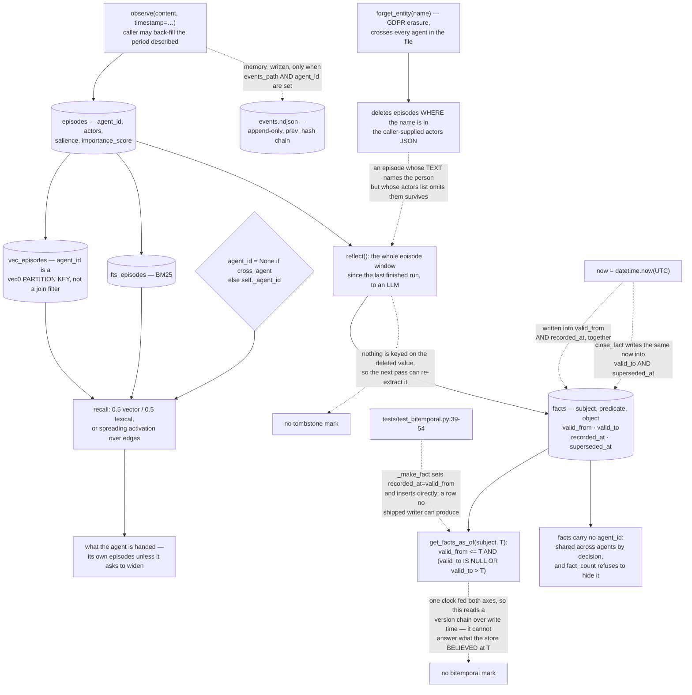

## 1. Executive Summary

Engram is "[t]he SQLite of agent memory: embeddable, local-first, cognitively
grounded" — Apache-2.0, version 2.4.1, 15,574 lines of Python across 59 files,
one `.engram` file on disk holding episodes, facts, entities and a graph, with
"no server, no Docker, and no API key required to write a memory."

The shape is three planes over one SQLite file. Episodes are raw observations
with a caller-settable timestamp, actors, tags and a decaying importance score.
Facts are subject-predicate-object triples with validity columns, extracted by a
`reflect()` pass the caller schedules rather than by the write. Entities and
Hebbian-weighted edges sit beside both, so recall can walk to what a match is
connected to and not only to what it resembles. `agent_id` partitions the
episodic plane; the semantic plane is shared.

**What is worth carrying away is how the project holds its own claims.** Three
scripts under `scripts/` enforce three invariants, and each is written as a
paragraph of reasoning before a line of bash. `no-network-at-write.sh` walks the
package's AST looking for a module-level import of any of nine network-capable
modules, and says why it is not a regexp:

> "Uses Python's AST, not a regexp, because indentation is the entire
> distinction and a regexp would be fooled by an import inside a try block at
> module scope."

`local-first.sh` holds the install side, which "can break without a single
import changing", by pinning the default dependency set to an allow-list of
three and by running a full observe-and-recall cycle with socket creation made
to raise — checked "by making socket creation raise rather than by watching
traffic, so a call that would have connected fails loudly instead of passing
quietly on a machine that happens to have no route." The same script records
that this check corrected the invariant it was written to hold: with a cold
cache, `observe()` does fetch a 64 MB ONNX model on first use, the README had
said 23 MB, and the invariant's absolute phrasing "read as an absolute and was
not one." It now promises "one fetch, then never again."

`readme-numbers.sh` recomputes the published recall table from the committed
per-question records rather than trusting it, and explains why the project
needed it: "engram's own release history is a sequence of fixes to published
numbers. 2.4.1 shipped for no other reason than that the headline table still
described the previous blend weights one release after they stopped being the
default." The atlas has seen a documentation gate before, in
[Cortex](../cortex-hypermnesia/). Engram adds the layer above it.
`tests/test_gates_are_wired.py` asserts each gate script appears in
`release.yml`, because `ci.yml` triggers on pushes and pull requests and a tag
push triggers neither — so the workflow that built the wheel reaching PyPI ran
ruff, mypy and pytest and none of the three gates. A gate, as that file puts it,
"is only a gate where it is invoked."

**The finding is one plane down.** The `facts` table has four time columns —
`valid_from`, `valid_to`, `recorded_at`, `superseded_at` — the schema of a
bitemporal store. Both writers that exist set `valid_from` and `recorded_at` to
the same `now`, and `close_fact` writes a single `now` into `valid_to` and
`superseded_at` together. No public method accepts a validity time. What
`get_facts_as_of` reads back is a version chain over write time wearing a
valid-time query, and the suite that proves it passes because its helper writes
rows directly with `recorded_at=valid_from`, a combination no shipped path
produces. The bitemporal mark is withheld on that.

## 2. Mental Model

An **episode** is something that happened, timestamped by the caller if they are
back-filling history.

A **fact** is a triple that was true over an interval, closed when a newer
extraction disagrees.

An **agent_id** is a partition of the episodic plane, and nothing at all on the
semantic one.

A **published number** is recomputed from committed records on every push.

A **gate** is only a gate in the workflow that invokes it.

## 3. Architecture

| Area | Role |
| --- | --- |
| `engram/schema.py` | The six tables, and `agent_id` as a vec0 partition key |
| `engram/core.py` | The public surface, and where events are emitted |
| `engram/store.py` | Every SQL path, including the as-of reads |
| `engram/reflection.py` | Extraction, supersession, contradiction counting |
| `engram/events.py` | The NDJSON chain, and the rules that keep it off |
| `scripts/*.sh` | Three invariants, each with its argument written down |
| `tests/test_gates_are_wired.py` | That the gates run where the bytes ship |

## 4. Essential Implementation Paths

`engram/core.py:336` — `agent_id = None if cross_agent else self._agent_id`, the
one line the scope rests on.

`engram/core.py:377-392` and `engram/reflection.py:99-113` — the only two places
a `Fact` is built, both stamping one `now` into two axes.

`engram/store.py:721-726` — `close_fact`, writing the same value into `valid_to`
and `superseded_at`.

`engram/store.py:1235-1246` — `get_facts_as_of`, the valid-time query the write
path never gives anything to distinguish.

`engram/events.py:188-204` — `resolve_events_path`, which returns `None` and
disables the log unless a path or environment variable says otherwise.

`scripts/no-network-at-write.sh:1-45` — an invariant, its enforcement, and the
argument for the shape of the check.

## 5. Memory Data Model

Six tables in one file. `episodes` (content, timestamp, actors, tags, salience,
emotional valence, a `summary_of` list, importance score, agent_id), `facts`
(triple, four time columns, confidence, `derived_from`, `extracted_by`),
`entities`, `edges` (weighted, agent-scoped), `reflections` (one row per
extraction run, with tokens and contradictions resolved), and `access_log` —
which records reads, not writes, and so is the other half of the audit pattern
rather than this one. Vectors live in a `vec_episodes` virtual table partitioned
on agent_id, keywords in an FTS5 table.

## 6. Retrieval Mechanics

Three modes behind one call. Hybrid is the default at a 0.5/0.5 blend, chosen by
measurement rather than taste: `engram-bench longmemeval --sweep` scores every
weighting in one pass, and 2.4.0 moved the default from 0.7/0.3 on the result
that the middle leads all four metrics and "both ends of the range are clearly
worse than the middle". The published table covers all 500 LongMemEval-S
questions over 246,738 ingested turns, with no model in the loop, and the
per-question records are committed so a reader can recompute instead of
trusting. The caveats travel with the numbers: the dataset flags no evidence
turn at all for 21 questions, and more than one for 59% of them, "so counting a
hit when any of them is retrieved is an upper bound on what the model was
handed."

Spreading activation walks Hebbian edges out from what matched. `as_of`
restricts episodes to a timestamp, and resolves inside the KNN scan rather than
after it.

## 7. Write Mechanics

Writes are local and immediate; nothing calls a model on the write path, and a
CI gate holds that structurally. Extraction happens in `reflect()`, which
windows off the last *completed* run so an aborted pass cannot advance the
watermark past episodes it never processed, wraps the entire
extract-insert-supersede-edge sequence in one transaction, and holds the store
lock over the database work but never across the LLM call. A newer extraction
closes every older active fact with the same subject and predicate; a
same-object re-extraction closes silently as agreement, and only a differing
object counts as a contradiction and emits an event.

## 8. Agent Integration

A Python library, an async wrapper, an `engram` CLI, and an MCP server exposing
`remember`, `recall`, `why`, `forget` and `stats` with per-call `agent_id`.
`reflect()` is deliberately not exposed as a tool — the pass that spends tokens
and rewrites the semantic plane stays with the operator. That withholding is the
one real actor boundary here, and it is on the *rewriting* pass rather than on
admission: `forget` is on the tool surface, so the agent erases as readily as a
person does. The `engram` CLI reads and erases the same `.engram` file the
running agent uses, which makes it a correction surface rather than a review
one — nothing waits for approval before it takes effect, and an erasure is
permanent rather than a held state. This report therefore does not carry
`human_review`; `engram/core.py` and `engram/cli.py` carry no pending, staged or
approval state on a memory at this pin.

## 9. Reliability, Safety, and Trust

`why()` returns a fact's provenance episode by episode. The event log, when
configured, chains each event to the last over a canonicalised body and advances
only on a successful write. Encryption is available through SQLCipher with a
`rekey()` method, and `backup()` is a separate path. Against that: the event log
is off by default and off entirely on an unscoped instance, `emit` swallows its
own failures, and `import_json` writes memories that no event records. Erasure
is permanent and unprotected against re-derivation.

## 10. Tests, Evals, and Benchmarks

Twenty-nine test modules, several of which test the project's own process rather
than its behaviour: that the gates run in the workflow that ships bytes, that
the vendored event schema matches the contract the code speaks, and that the
README's numbers are the ones the benchmark records produce. The multi-agent
suite is the strongest single file — its lopsided fixtures exist because "[t]he
old tests all used two-episode stores, where the global top-k trivially contains
everything and the bug is invisible."

## 11. For Your Own Build

Take the gate-wiring test. Most projects that write a CI check stop once it
passes somewhere; this one asks which workflow actually publishes and checks the
gate is in *that* one. The cost is a twenty-line test and the benefit is that a
release cannot quietly skip the invariant.

Take the allow-list over the denylist, and the reason given for it.

And take the warning in the bitemporal columns. Four columns named for two axes
do not make a store bitemporal — one clock feeding both is a version chain, and
a test suite that constructs its own rows will not tell you which you have. The
check is a producer test: find every writer of the validity field and ask
whether any of them can set it to something other than the moment of writing.

## 12. Open Questions

Whether `valid_from` was meant to be caller-settable. `observe()` already takes a
`timestamp` for exactly this reason on the episodic plane — "so `recall(as_of=…)`
places the episode in the period it describes rather than the moment it was
written" — and the fact writer has no equivalent. The gap looks like an omission
rather than a decision.

Whether `forget_entity` is meant to reach episodes that name a person without
listing them as an actor. The docstring calls it GDPR right-to-be-forgotten,
which is a claim about the person rather than about the actors column.

## Appendix: File Index

| Path | What to read it for |
| --- | --- |
| `scripts/no-network-at-write.sh:1-45` | An invariant with its argument written above it |
| `scripts/local-first.sh:1-46` | A check that corrected the invariant it enforced |
| `tests/test_gates_are_wired.py:1-40` | That a gate runs where the bytes actually ship |
| `engram/core.py:336` | A stored scope key reaching the query, widened but never omitted |
| `engram/store.py:721-726`, `:1235-1246` | Two time axes, one clock, and the query that cannot tell |
| `tests/test_multiagent.py:474-529` | A must-not-retrieve assertion with its control beside it |

## History

**2026-09-19** — re-pinned to [`240a4d9d433e2f4a366d8877279449381b59b6fa`](https://github.com/TAIPANBOX/engram/commit/240a4d9d433e2f4a366d8877279449381b59b6fa), 2 commits on. `human_review` is **withdrawn**, and the record's own closing sentence is the reason, kept here verbatim because it was already right: *"It is an after-the-fact surface: nothing waits for approval before it takes effect, and the erasure is permanent rather than a held state."* Under the question the mark now asks, that settles it. The tree was checked for an admission state at this pin and has none. Worth recording beside the withdrawal: the one place this design does hold something back from the agent is `reflect()`, kept off the tool surface so the pass that rewrites the semantic plane stays with the operator — while `forget` is on it, so erasure is not held back at all. The other three marks stand. Screened again first; nothing was installed and no suite was run.

**2026-09-16** — [`c6d0d3f2aabcba6c96a7c4f503a2ccc9dabb74a9`](https://github.com/TAIPANBOX/engram/commit/c6d0d3f2aabcba6c96a7c4f503a2ccc9dabb74a9) — first reading, at a commit dated 13 September 2026. Screened before opening, from a shallow clone: three files scanned, no auto-run surfaces, no build-time execution points, one unpinned dependency surface and one dependency file inside the seven-day cooldown. `CLAUDE.md` is addressed to a reading agent and was recorded as data. Nothing was installed, built or run.
