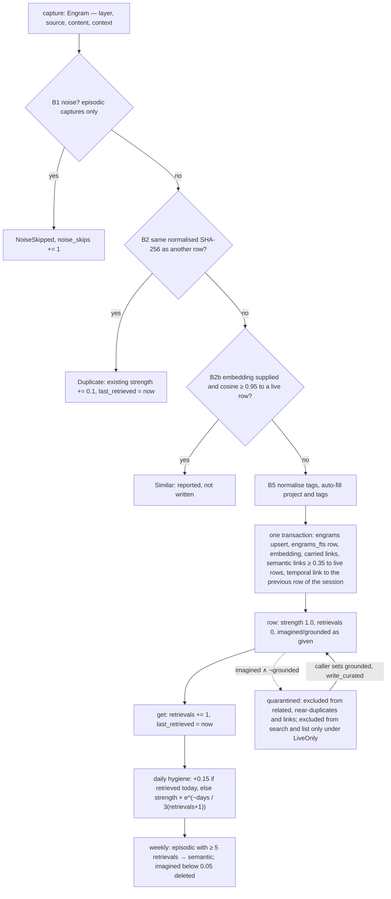

## 1. Executive Summary

Engram Format is the part of a memory product its maker decided must stay
open: the on-disk vault, its schema, its key derivation and its sync wire
format, published as the Rust crate `axiom-engram` with a normative
`FORMAT.md` beside it, so that *"any application, tool, or future AI can open
your vault"* and so that the privacy claims are *"verifiable, not promised."*
The product — Engram, from EL AI Intelligence — is a daemon with REST, MCP
and CLI surfaces, a browser vault, a relay for encrypted multi-device sync, a
Python auto-capture observer and an *imagination engine*, and every one of
those is closed and in a private repository, as the README says in its third
paragraph. Apache-2.0; three commits between 30 August and 5 September 2026
by one author; 7,374 lines of Rust in eleven files with 71 tests; version
0.1.5 published to crates.io on 5 September 2026 as the crate's only release,
while the README still instructs `version = "0.1.4"`. The screen found no
auto-run surface; both manifests were inside the seven-day cooldown, and
nothing was compiled or run.

What is inspectable is more than a schema. `EngramStore::write_inner`
(`src/store.rs:600-760`) is a capture pipeline with named gates and a typed
outcome: a noise filter that only touches raw episodic captures, a dedupe on
a normalised SHA-256 that strengthens the existing row by 0.1 rather than
inserting, a paraphrase gate at cosine 0.95 when the caller supplies an
embedding, tag normalisation against a denylist, and then the row, the FTS
entry, the embedding, the links carried on the engram, semantic links above
a threshold and a temporal link to the previous row of the same session — all
in one transaction, with the hygiene comment explaining why FTS is kept in
sync by hand (*"the FTS 'delete' command is incompatible with SQLCipher's
virtual-table handling"*). A quarantine convention — `imagined = 1 AND
grounded = 0` — is written into the schema section of the specification and
into a `QuarantineFilter` enum, and the near-duplicate report, the related
search's vector fallback and semantic-link generation all exclude it
unconditionally. The design is at its most careful on the sync side, where
the envelope, the Argon2id parameters, the AES-256-GCM construction, the
HMAC input and the vault-id derivation are each written out with their
version salts.

What is not inspectable is who calls any of it, and that shapes every
judgement here. The default `search_by_content`, `list`, `search_by_layer`,
`vector_search` and `surface_relevant` apply no quarantine filter; the
`MemoryBackend` adapter that the crate's own `QemCache` wraps calls those
defaults, so through the trait the quarantine does not exist. Whether the
daemon's recall passes `LiveOnly` is a fact about closed code. `grounded`
has no writer in the crate but its constructors and tests; `memory_evidence`,
`annotations`, `goals` and `saved_searches` are created and never inserted
into; `apply_weekly_consolidation` promotes on a retrieval count and deletes
weak imagined rows, and nothing here distils an episodic run into a semantic
abstraction, though the `lib.rs` header says that happens *"nightly."* The
report therefore credits one mark, for a state field with a producer and a
filter, and withholds the rest; the reader who adopts the crate gets a good
vault and must build the epistemics.

## 2. Mental Model

A memory is an **engram**: a row with a strength that behaves like a trace.
It is born by capture at strength 1.0 (episodic), by consolidation
(semantic), or by the imagination engine at strength 0.5 with
`imagined = true, grounded = false` (`Engram::new_imagined`,
`src/engram.rs:232-260`). Three things move it. **Retrieval** — any `get`
increments `retrievals` and stamps `last_retrieved` (`touch`,
`src/store.rs:954-961`), and the daily hygiene adds 0.15 to anything
retrieved in the last day. **Decay** — the same pass computes
`R = e^(−t/S)` for every row not retrieved in a day, with `S = 3 × (retrievals
+ 1)` days, so a row retrieved often decays slowly, and multiplies strength
by `R` with a floor of 0.01 (`apply_daily_hygiene`, `:1840-1922`).
**Promotion** — the weekly pass rewrites `layer = 'semantic', source =
'consolidation'` on any episodic row with five or more retrievals
(`apply_weekly_consolidation`, `:1992-2012`). Duplicates are folded into the
existing trace rather than stored: a verbatim repeat adds 0.1 and refreshes
`last_retrieved`, a paraphrase above 0.95 is reported as `Similar` and not
written.

Truth is a two-bit state. An observed row is `imagined = false`; a generated
one is `imagined = true`, and it stays **quarantined** until something sets
`grounded = true` — which in the crate is a caller mutating the struct and
calling `write_curated`, the bypass that exists precisely so *"metadata
mutations — mark-noise, ground, PATCH — must always persist"* past the dedupe
gate (`:582-590`). While quarantined, a row is invisible to the
near-duplicate report, receives and emits no semantic links, and never
surfaces as related; it is visible to any default search, list or vector scan
unless the caller asks for `LiveOnly`. There is no rejected state: a memory
dies by a hard `delete`, by `purge_by_criteria`, or, for imagined rows only,
by falling below strength 0.05 at the weekly pass. A `memory_evidence` table
of `(memory_id, evidence_id, relationship)` pairs and an `annotations` table
exist for a grounding trail; the crate defines them and writes to neither.

Beside the vault, the `QemCache` layer holds a different kind of memory: a
32-bit XOR code per entry so that `subject ⊕ relation → object` is an O(1)
lookup, warmed from the strongest rows at startup, written through to the
vault before the cache, with a `NoveltyFilter` that reports a code's
surprise as one minus its frequency in a ring buffer (`src/qem.rs:96-140`).
The specification is explicit that codes are *"derivable from row content and
never the only index"*; they are an acceleration, not a belief.

## 3. Architecture

A library, not a service. `src/lib.rs` names three layers — `QemCache` (L1),
`EngramStore` (L2, *"SQLCipher, FTS5, vector search"*) and a
`ContextAssembler` (L3, *"owns retrieval, token-budgeted assembly"*) — and
ships the first two; `rg -n 'ContextAssembler' src` finds only that comment.
`EngramStore` wraps one `rusqlite` connection behind a tokio mutex, opened
with `bundled-sqlcipher` and keyed either from the platform machine id
(`hex(SHA-256(machine_id ‖ ":" ‖ "axiom-engram-vault-v1"))`, with a stated
threat model: it defends against a stolen disk and not against a local user)
or from a passphrase through Argon2id at 64 MiB, three passes, four lanes and
a random 16-byte salt file, with two legacy derivations detected and re-keyed
on open. `src/schema.rs` creates the tables idempotently and runs
`PRAGMA user_version` migrations 0 through 7, rebuilding `engrams` by table
swap where a `CHECK` constraint changed and re-running column ensures on
every open so *"a vault that crashed mid-migration cannot claim a version it
does not have."* `src/adapter.rs` implements the `MemoryBackend` trait over
the store; `src/qem.rs` the cache; `src/embed.rs` the `Embedder` trait, a
`NoopEmbedder` and, behind `onnx-embed`, an `OnnxEmbedder` that is in fact
Candle with a HuggingFace tokenizer and `hf-hub` download of
all-MiniLM-L6-v2; `src/noise.rs` the filter and the hash; `src/sync.rs` the
serde types of the wire envelope and nothing that sends them.

There are no background processes: `apply_daily_hygiene`,
`apply_weekly_consolidation`, `backfill_semantic_links`,
`find_near_duplicates` and `find_stale_state` are methods with no scheduler
and no caller in the tree. Their callers, and the *"Python auto-capture
observer,"* the REST route that validates a purge date *"earlier and maps
this to a 400,"* and the *"decay report"* the comments hand results to, are
all named in comments and absent from the repository.

### Deployment and ergonomics

Add the crate, call `EngramStore::open` or `open_with_passphrase` on a
directory, and there is a vault: no server, no key needed to store anything,
SQLite as the only dependency, and everything local and offline unless the
`onnx-embed` feature downloads a model from the Hub on first use. The file is
readable by any SQLCipher-aware tool given the derived key, which the
specification tells you how to compute, and `FORMAT.md` § 4 is a complete
column list; that is the product's stated reason for existing. Repairing by
hand is possible because it is SQLite; the FTS index is the one thing a hand
edit will desynchronise, and the crate rebuilds it only during a migration.

## 4. Essential Implementation Paths

**Capture.** `EngramStore::write` → `write_inner(engram, None, None, true,
None)` (`src/store.rs:563-760`): `crate::noise::is_noise(content, source)`
for episodic rows; `normalized_hash` — shell-hook prefixes like
`[89] [10:23:45] [/home/alice/engram]` stripped, whitespace collapsed,
lowercased, SHA-256 — and a `SELECT id … WHERE content_hash = ?1 AND id != ?2`
that on a hit returns `WriteOutcome::Duplicate { matched_id }` after the
strength bump; `find_similar_embedding` (`:2414-2440`) over every stored
vector at `SIMILAR_DEDUP_THRESHOLD = 0.95`, returning `Similar { matched_id,
similarity }`; `normalize_tags` (denylist of `note`, `misc`, `random` and
eight others, at most eight tags of 32 characters), `extract_project` from
the context JSON and `auto_tags` from the source; then the upsert with
`ON CONFLICT(id) DO UPDATE`, the FTS insert by rowid, the embedding
`INSERT OR REPLACE`, carried links inserted only where the target exists,
`generate_semantic_links` when both an embedding and a
`LinkInferenceConfig` are given (default at most five links above 0.35, both
directions, never into quarantine), and `generate_links` (`:820-860`): a
temporal link of weight 0.6 to the most recent prior row with the same
`context.session_id`, and associative links to rows sharing tags.
`write_with_embedding` adds the vector; `write_curated` sets `gates = false`.

**Retrieval.** `get` (`:1080-1140`) with the `touch`; `search_by_content_filtered`
(`:1221-1339`): strip double quotes, split on non-alphanumerics to match the
`unicode61` tokenizer, `MATCH` the tokens joined by `AND` and, when that is
empty, by `OR`, `ORDER BY rank`, with the filter's SQL appended, falling back
to `LIKE '%query%' ORDER BY strength DESC` on an FTS parse error;
`vector_search` (`:2028-2066`) loads every embedding and sorts by cosine;
`surface_relevant` (`:2067-2145`) takes the fifty strongest rows above 0.1
and scores `0.3 × overlapping words longer than three + 0.4 × strength +
0.2 × e^(−days/7) + 0.1 × positive valence`, keeping scores above 0.1;
`search_related` (`:1704-1765`) follows explicit links and then cosine
neighbours above `MIN_RELATED_SIMILARITY = 0.35` among live rows;
`search_by_tags`, `search_by_layer`, `list`, `list_modified_since`,
`list_unsynced`, `digest_window` and `detect_temporal_patterns` (day-of-week
and time-of-day over matching rows) complete the surface. Results are
ordered by a stated total order so identical searches return identical
orderings.

**Maintenance.** `apply_daily_hygiene` (`:1840-1922`), `find_near_duplicates`
(`:1924-1965`, cosine at or above 0.90 over the 400 most recent embedded live
rows, *"advisory, never destructive — this reports, the human decides"*),
`find_stale_state` (`:1967-1990`, episodic rows older than seven days whose
content contains *in flight*, *wip*, *todo*, *next steps* and the like),
`apply_weekly_consolidation` (`:1992-2012`), `backfill_semantic_links`
(`:1765-1818`), `record_consolidation_run` and `get_consolidation_history`.

**Deletion.** `delete` (`:1591-1608`) and `purge_by_criteria` (`:1611-1679`)
by source, layer, project and an RFC 3339 `before_date`, each deleting the
FTS row first; `engram_links`, `engram_embeddings` and the evidence tables
cascade by foreign key.

**Sync.** `list_unsynced`, `mark_synced`, `reset_synced` and
`list_modified_since` (`:1369-1435`) are the local half; `src/sync.rs` holds
`SyncBlob`, `PushRequest`, `PushResponse` with `accepted`, `rejected` and
`revoked_devices`, and `PullRequest`; encryption, the relay and the client
are not here.

**Trait and cache.** `src/trait.rs` (`MemoryBackend`, `Query`, `SortKey`,
`DecayReport`, `ConsolidationReport`); `src/adapter.rs` (`search` dispatches
on layer, then text, then tags, then list, widens the fetch to 2,000 when a
strength floor or a sort is set, and applies `min_strength` and `sort_by` in
memory); `src/qem.rs` (`QemCode`, `QemEncoder`, `NoveltyFilter`,
`QemConfig`, `QemCache`).

**Tests.** The `#[cfg(test)]` modules of `src/store.rs` (41), `src/noise.rs`
(12), `src/qem.rs` (8), `src/schema.rs` (4), `src/adapter.rs` (3) and
`src/embed.rs` (3).

## 5. Memory Data Model

`engrams` (`src/schema.rs:10-28`, `FORMAT.md` § 4.1): `id TEXT PK`, `layer`
in episodic, semantic, imagined; `source` in a sixteen-value `CHECK` —
interaction, sensor, consolidation, imagined, chat, slack, discord,
telegram, window, mic, agent, research, system, observation, ai-session,
ai-tool — that has grown by three migrations; `privacy_level` in
strict_local, hybrid, cloud_first, enterprise, defaulting to `cloud_first`
in the constructors; `content`; `context` JSON; `strength REAL` default 1.0;
`valence` in [−1, 1]; `retrievals`; `imagined` and `grounded` integers;
`created_at`, `last_retrieved`, `occurred_at`, `modified_at` (bumped on every
local write, preserved from the remote on a sync pull, never bumped by a
read) and `synced_at`; `project`; `tags` as comma-separated text normalised
at capture; `content_hash`; `scope` defaulting to `moment` (the `MemoryScope`
enum adds episode, narrative and rule); `content_type` defaulting to `text`.
`engram_links (source_id, target_id, weight, link_type)` with four link
types; `engram_embeddings (engram_id, embedding BLOB, model, dimensions,
created_at)`; `coherence_state`, a singleton of baseline valence, character
strengths, purpose vector and drift score that `open` seeds and
`update_coherence` rewrites; `goals`; `consolidation_runs`; `app_metrics`
counters for `noise_skips`, `dedup_saves` and `similar_skips`;
`memory_evidence`; `annotations`; `saved_searches`; and the `engrams_fts`
virtual table over `(id, content)`.

Two structs describe a row: `Engram` (`src/engram.rs`) mirrors the table, and
`MemoryEntry` (`src/entry.rs:315-355`) is the trait-level shape with typed
`MemoryLayer`, `MemoryScope`, `ContentType`, `MemorySource`, an `evidence:
Vec<EvidenceRef>` with `supports`, `contradicts` and `context_for`
relationships, and `links_out`; the two convert both ways. Scope in the
tenancy sense is `project` and `privacy_level`, stored and not applied on
any read path in the crate. Provenance is `source`, `context` and the
`memory_evidence` table nothing here fills. Time is `created_at` for the
record, `occurred_at` for the event — a second axis that is written and read
back and filtered on by nothing in the crate, so it is tracked and not
used — and `modified_at` and `synced_at` for the sync cursor. Versioning is
the sync blob's `vector_clock`, monotonic per memory; there is no local
history, correction chain or TTL, and deletion is a hard delete locally and
a tombstone blob on the wire.

## 6. Retrieval Mechanics

Lexical retrieval is FTS5 with a two-stage query — precise `AND`, then `OR`
for recall — ranked by FTS `rank`, with the tokenizer's hyphen behaviour
accounted for in the split and a `LIKE` fallback ordered by strength when the
parser rejects the input. Vector retrieval is exact cosine over every
embedding in the table, in Rust, with no index; the comment on the
near-duplicate scan caps it at 400 rows for that reason, and `vector_search`
has no cap. Only semantic rows longer than 100 characters are embedded at
all (`should_embed`, `src/embed.rs:406-408`), so episodic captures never
enter the vector path, the paraphrase gate never sees them, and a
conversation's raw turns are searchable only lexically. Proactive surfacing
is a hand-weighted score over the strongest fifty rows — strength carries
0.4 of it, so a much-retrieved row surfaces for any context that shares a
long word with it — and it applies no quarantine. Related-memory search is
the one retrieval path that is principled about quarantine and about
explicit links outranking similarity. There is no reranker, no query
rewriting, no token budgeting and no context formatting; the L3 assembler
that would do those is named and absent.

Failure modes follow. Stale hits: strength decays only when the daily pass
is run, so a vault whose daemon is stopped keeps every trace at full
strength. Over-recall: `OR` fallback returns any row sharing one token.
Under-recall: an episodic row is invisible to vector search by design. Bad
merges: none, because nothing merges — the paraphrase gate refuses the second
capture and reports the first's id, and the near-duplicate report leaves the
decision to a person.

## 7. Write Mechanics

Writes are synchronous library calls holding the connection mutex; there is
no queue and no extractor. A memory is whatever the caller constructs — the
crate has no prompt, no model call and no summariser — and the pipeline's job
is to refuse or fold, not to derive. Dedupe is exact after normalisation and
near-exact by embedding; consolidation is a counter and a threshold;
conflict handling does not exist, since an upsert by id overwrites and two
rows with different content coexist. Noise filtering is a deterministic
function of content and source that exempts curated sources, whose exact
rules live in the 286 lines of `src/noise.rs` and its twelve tests. Malicious
input is not a category the crate models; `purge_by_criteria` interpolates
column names it chose itself and binds the values, and the `before_date`
guard exists because a non-date string *"sorts AFTER every real date and
would match the whole vault."*

### Operational cost

A capture is one hash, an optional scan over every embedding, one
transaction of a handful of statements and, when links are inferred, a
second scan; a `get` is one read and one write. Nothing is retrievable later
than the call that stored it. The two maintenance passes read the whole
table — hygiene loads every row not retrieved in a day and updates each whose
strength moved by more than 0.001, so its cost scales with the vault, not
the day — and the near-duplicate report is O(n²) over at most 400 rows. What
the read path costs a prompt is not decidable here, because the assembler is
elsewhere.

## 8. Agent Integration

None in this repository. The crate exposes a Rust API and a trait; the MCP
servers, REST routes and CLI that give an agent `capture`, `search`,
`surface` and `ground` are closed. What the code reveals about them is in
the comments: capture paths are *"CLI, REST, Rust MCP, and (via the REST
handler) the Python auto-capture observer,"* metadata mutations arrive from
*"route handlers acting on an id the user already reviewed,"* and the
`engramd` server *"wires the real provider at startup"* for embeddings. How
much agency the model has, whether injection is automatic, and how a session
boundary is handled are questions this repository cannot answer, and the
report does not guess. An adopter integrating the crate into their own
agent gets a store with typed write outcomes to surface to the model — a
`Duplicate` or `Similar` result is exactly the kind of feedback a save tool
should return — and must supply everything above it.

## 9. Reliability, Safety, and Trust

**Verifiable privacy is the claim, and it holds for what is here.** The
machine-key derivation, its threat model, the Argon2id parameters, the salt
file, the legacy re-keying, the sync cipher construction, the HMAC input, the
vault-id derivation and the account and team key wrapping are all in
`FORMAT.md` §§ 3 and 8–11 with the constants in `src/store.rs:118-135`; a
vault owner can recompute their key. The relay's zero-knowledge property is a
claim about closed code.

**The quarantine is real and partial.** `QuarantineFilter` exists, three
paths apply it unconditionally, the filtered variants apply it on request,
and the defaults do not — including everything reachable through
`MemoryBackend`. `FORMAT.md` § 4.1 states the convention as *"excluded from
the default recall surface"*; in the crate the default surface includes
them. Whether the product's recall passes `LiveOnly` decides whether the
convention is true for a user, and that cannot be read here.

**Grounding has a flag and no trail.** `grounded` flips only by a caller's
mutation; `memory_evidence` and `annotations` have no producer in `src/`,
so the crate stores a verdict without the evidence for it.

**Deletion is final locally and tombstoned remotely.** No archive, no
history, no record of what was purged beyond the count returned. A sync
deletion is a `deleted: true` blob with a higher clock, and last-write-wins
on the clock means a device that edits a memory another device deleted can
resurrect it or lose the edit depending on order.

**Consistency.** One mutex around one connection; the write pipeline holds
the raw handle because the mutex is not re-entrant, which the comment
explains. Migrations that swap the table run in one transaction so the swap
and the version stamp commit together.

**Uncertainty** is a continuous strength and a valence, used for ranking and
pruning; the only discrete withholding is the quarantine.

## 10. Tests, Evals, and Benchmarks

71 unit tests, none of which the atlas ran, cover the store's capture gates
one outcome each — noise skipped, curated sources bypass noise, a duplicate
strengthens the existing row, a curated write persists despite a sibling
duplicate, whitespace and prefixes normalise, a rewrite of the same id is not
a duplicate, a similar embedding skips capture and a dissimilar one inserts,
the similar gate bypasses curated writes — plus tag normalisation, auto-fill,
temporal and associative link generation, semantic links with their
threshold and direction, the backfill's idempotence, the related search's
vector fallback and its dedupe against explicit links, dangling link targets
skipped, the sync cursor on `modified_at`, hygiene strengthening a retrieved
row, the retrieval counter, metrics counters, and a passphrase-open fallback.
`src/schema.rs` tests that `create_tables` followed by `migrate` upgrades a
pre-v4 and a pre-v5 vault; `src/adapter.rs` that `min_strength` and
`sort_by` are honoured and applied before truncation, a regression the
comment attributes to `QemCache::warm` variance.

The two quarantine tests are the ones a `negative_eval` mark would rest on,
and they are the emptiness shape: `test_find_near_duplicates_excludes_quarantine`
asserts `is_empty()` on a two-row store where the only pair is quarantined,
and `test_semantic_links_never_into_quarantine` asserts both link lists are
empty. Each would pass against a scan that returned nothing; the positive
control is the sibling test in each case, not the same one, and no test
asserts that a quarantined row is absent from a populated content or list
result under `LiveOnly`. The mark is withheld on that basis.

There is no retrieval-quality evaluation, no benchmark, no fixture vault and
no CI in the repository; `rg -n 'arxiv|bibtex|@article|doi' README.md FORMAT.md`
finds nothing, and the README links no paper. The tests one would want before
trusting the format as a memory are a `LiveOnly` search over a populated
vault with a control row, a hygiene case that checks the decay arithmetic
against a hand-computed value rather than *"no crash,"* and a sync
round-trip of a tombstone against a concurrent edit.

## 11. For Your Own Build

### Steal

- **Typed write outcomes.** Return `Duplicate { matched_id }`, `Similar {
  matched_id, similarity }` or `NoiseSkipped { reason }` from a save instead
  of swallowing the second capture; an agent's save tool can then say what
  happened.
- **A curated write path that bypasses the capture gates.** A grounding or
  an edit must persist even when a sibling row shares the content hash;
  routing metadata through the dedupe gate silently drops it.
- **Idempotent column ensures on every open,** so a crash mid-migration
  cannot leave a vault claiming a version it did not reach.
- **Publish the derivations.** A format document that lists every KDF
  parameter and cipher construction is what makes *verifiable* a checkable
  word.
- **Keep the O(n²) report advisory and capped,** and surface near-duplicates
  and stale working state to a person rather than acting.

### Avoid

- **A quarantine the default read path ignores.** If a state is meant to
  withhold, the unfiltered call should not exist, or the filtered one should
  be the default.
- **A grounding flag with no evidence table anyone writes.** A verdict
  without its trail cannot be audited or reversed.
- **Embedding only rows over a length threshold in one layer** when the
  paraphrase gate and the vector search depend on the embedding; the gate
  then never sees the captures most likely to repeat.
- **Strength as the dominant surfacing weight** when strength is a function
  of how often the row was already surfaced.

### Fit

This is a vault, not a memory system, and it is a good vault: for a Rust
builder who wants an encrypted local store with lexical and vector
retrieval, documented on-disk and wire formats, and a capture pipeline that
refuses repeats, adopting the crate saves real work and costs one SQLite
dependency. Everything epistemic — what to capture, when to ground, how to
assemble a prompt, when to run decay — is the adopter's to build, and the
crate's own header describes a third layer it does not ship. Walk away if
you need scope, audit, human review or a benchmark from the package itself,
or if you need to know what the Engram product does with these primitives;
that is a different repository and it is not public.

## 12. Open Questions

- Whether the product's recall calls the `LiveOnly` variants or the
  defaults; the specification's *"default recall surface"* is defined by
  closed code.
- What writes `memory_evidence`, `annotations`, `goals` and
  `saved_searches`, and whether the imagination engine grounds a row on
  evidence or by a person's click.
- What the nightly consolidation the header and the FORMAT describe does
  beyond the counter-based promotion, and whether it writes
  `consolidation_runs` through `record_consolidation_run`.
- How the relay resolves a tombstone against a concurrent edit under
  last-write-wins, and whether a revoked device's blobs already accepted are
  ever reverted.
- Whether a future release aligns the README's `0.1.4`, the FORMAT header's
  *"schema version 6"* and the code's `CURRENT_SCHEMA_VERSION = 7`.

## Appendix: File Index

- Specification: `FORMAT.md` (§ 2 layout, § 3 encryption and threat model,
  § 4 schema and migration history, § 5 normalisation and dedupe, § 6
  retrieval indexes, § 7 QEM, § 8 sync wire format, §§ 9–11 vault identity,
  account keys and team handoff, § 12 compatibility), `README.md`.
- Storage and schema: `src/schema.rs` (`create_tables` `:7-145`, `migrate`
  `:166-570`, `CURRENT_SCHEMA_VERSION` `:144`), `src/store.rs:118-135` (key
  constants), `:365-552` (`open`, `open_with_passphrase`, re-keying, the
  coherence seed), `src/engram.rs`, `src/entry.rs`.
- Write path: `src/store.rs:563-760` (`write`, `write_with_embedding`,
  `write_curated`, `write_inner`), `:820-900` (`generate_links`,
  `generate_semantic_links`), `:2373-2440` (thresholds and
  `find_similar_embedding`), `src/noise.rs`.
- Retrieval: `src/store.rs:63-115` (`QuarantineFilter`), `:954-961`
  (`touch`), `:1080-1140` (`get`), `:1187-1368` (layer, content, list and
  their filtered variants), `:1511-1560` (tags, count), `:1704-1765`
  (`search_related`), `:2028-2145` (`vector_search`, `surface_relevant`),
  `:2207-2282` (`detect_temporal_patterns`).
- Maintenance and deletion: `src/store.rs:1591-1679` (`delete`,
  `purge_by_criteria`), `:1840-2012` (hygiene, near-duplicates, stale state,
  consolidation), `:1765-1818` (`backfill_semantic_links`), `:2283-2340`
  (consolidation history).
- Sync: `src/store.rs:1369-1435` (`list_modified_since`, `list_unsynced`,
  `mark_synced`, `reset_synced`), `src/sync.rs`.
- Trait, adapter, cache, embeddings: `src/trait.rs`, `src/adapter.rs`,
  `src/qem.rs`, `src/embed.rs`.
- Tests: the `#[cfg(test)]` modules in `src/store.rs:2590-3454`,
  `src/noise.rs`, `src/qem.rs`, `src/schema.rs:580-873`, `src/adapter.rs:214-280`,
  `src/embed.rs:410-481`.
- Searches behind the absence claims: `rg -n 'ContextAssembler' src` (the
  `lib.rs` comment only); `rg -n 'INSERT INTO (goals|memory_evidence|annotations|saved_searches)' src`
  (none; `consolidation_runs` has one writer at `src/store.rs:2311`);
  `rg -n 'grounded\s*[:=]\s*true' src` (none outside tests — the flag is set
  by callers); `rg -n 'occurred_at' src/store.rs` (written and read back,
  never in a `WHERE`); `rg -n 'project = \?' src/store.rs` (only
  `purge_by_criteria`); `rg -n 'LiveOnly' src/store.rs` (the enum and its
  SQL, no internal caller); `rg -n 'apply_daily_hygiene\(|apply_weekly_consolidation\(' src --glob '!store.rs'`
  (the adapter and tests only); `ls .github` (absent); `rg -n 'arxiv|bibtex|@article|doi' README.md FORMAT.md`
  (none).

## History

**2026-09-06** — [`5bb55f2c50e9de01852349930915e547b4dced17`](https://github.com/El-AI-Intelligence/engram-format/commit/5bb55f2c50e9de01852349930915e547b4dced17) — first reading, at the head of `main`, three commits in, the day after the crate's only crates.io release. The screen found no auto-run surface; both manifests were inside the seven-day cooldown, and nothing was compiled or run. One mark, `trust_state`, for the imagined-and-ungrounded quarantine with a public producer and an unconditional filter on three read paths. `negative_eval` withheld on the emptiness shape of the two quarantine tests. `bitemporal` withheld: `occurred_at` is a second timestamp that nothing filters on. `scope_enforced`, `audit_log`, `human_review` and `tombstone` withheld: the scope columns are stored and unapplied, there is no mutation log, every surface is closed, and the sync tombstone is a delete marker.
