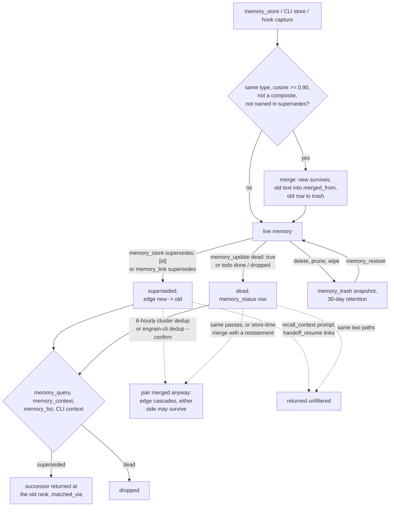

## 1. Executive Summary

Engram MCP is a local memory server for coding agents, written in Rust over one
SQLite file: typed memories, per-branch handoff chains, ADRs and a durable todo
list, all reached through an MCP server and `engram-cli`. It is not related to
[Engram](../engram/), [Engram Alpha](../engram-alpha/) (whose own `engram-mcp`
crate is a different project), [engram (NickCirv)](../engram-nickcirv/) or
[Claude Engram](../claude-engram/); it wraps no engine of theirs.

What is notable is how it retires a memory. A `supersedes` edge makes retrieval
return the successor at the old memory's rank, annotated with what it replaced.
A `dead` flag drops a memory whose subject is gone. Every destructive path
snapshots the row, its edges and its embedding to a trash a person or the agent
can restore from. Decay runs on a clock of days on which the project received a
curated store, so a dormant project does not age.

What is weak is that the correction machinery has two writers that do not know
about it. The 6-hourly background dedup and `engram-cli dedup --confirm` merge
same-type pairs at cosine 0.90 without consulting supersedes edges or the dead
flag, although the MCP `memory_dedup` tool does. Two context builders, the
`recall_context` prompt and `handoff_resume`'s linked memories, never apply the
status filter.

The server's own instructions to the model (`src/instructions.md`) are the design
document for curation, and they are specific: supersede rather than append a
contradiction, mark dead only when there is nothing to point at, and read
`possible_supersedes` on every store result.

Two marks: `trust_state` and `negative_eval`. The licence is inconsistent
across files; section 9 states it, and names the five withheld marks, among them
`scope_enforced`, which fails on one graph tool.

## 2. Mental Model

A memory is a typed claim the agent chose to store, or one a Claude Code hook
captured. It is believed from the moment it is written. Nothing extracts or
verifies it, and no model is called on any write path.

It stops being the answer in one of four ways, and the design keeps them apart:

- **Superseded.** A newer memory carries a `supersedes` edge to it. Retrieval
  replaces a hit on the old memory with its terminal successor, following the
  chain up to five hops with a cycle guard, and annotates the result with
  `matched_via` (`src/db/status.rs:30-72`; `src/tools/curation.rs:77-99`).
- **Dead.** `memory_status.dead` is set with a reason, and retrieval drops the
  memory outright; a chain ending in a dead memory is dropped too.
- **Merged.** A near-duplicate of the same type is absorbed into a survivor,
  whose `merged_from` keeps the consumed text in full (`src/db/memories.rs:872-946`).
- **Deleted or pruned.** The row goes, and a snapshot goes to `memory_trash`.

The source says why supersession redirects instead of dropping: returning
nothing *"reads as 'nobody looked into this', which invites the same wrong
conclusion to be reached again"* (`src/instructions.md`). Only the agent, or a
person through the same CLI, moves a memory between these states. No background
process marks anything dead or superseded.

`possible_supersedes` is the one place similarity touches correction. Every store
reports existing same-type memories at cosine 0.88 or above as candidates, and
never applies one, because *"cosine cannot separate 'contradicts' from
'elaborates'"* (`src/tools/curation.rs:107-143`).

The background dedup pass does not respect those states. A successor and the
memory it superseded usually sit near 0.90 and in the same cluster; the pass
merges them whichever way round the cluster table lists them.

## 3. Architecture

Two binaries from one crate. `engram` is an MCP server over stdio built on
`rmcp`; it refuses to run with a terminal on stdin and points at `engram-cli`,
which carries every interactive and maintenance command. Both open the same
SQLite file, `~/.local/share/engram/memories.db` by default (`ENGRAM_DB`).

The store is a `memories` table with an external-content FTS5 index kept by
insert, update and delete triggers, a separate `embeddings` table holding 256-float
blobs, a `relationships` graph with cascade deletes, and sidecars added by
twelve migrations: `handoff_sections`, `adr_sections`, `memory_status`,
`memory_trash`, `todo_items`, `memory_clusters`, `sync_state` and
`memory_origin` (`src/db/mod.rs:43-146`; `src/db/migrations.rs`). Foreign keys
are switched on per connection (`src/db/mod.rs:208`).

Embeddings come from `mdbr-leaf-ir` quantized ONNX through `fastembed`,
truncated to 256 dimensions. The model files are downloaded from Hugging Face on
first use by `hf-hub`, from the repository's default revision
(`src/embedding.rs:41-73`).

The server spawns two tokio loops, each of which sleeps one interval before its
first pass (`src/main.rs:59-181`). The hourly loop recomputes relevance, prunes
and sweeps the trash. The 6-hourly loop re-clusters and dedups. Both act only on
the project the server was started in.

`engram-cli sync user@host` replicates the whole store both ways over `ssh`, by
per-remote watermarks on `updated_at`, with last-write-wins on content. Deletions
never propagate (`src/cli.rs:242`).

### Deployment and ergonomics

`cargo install engram_mcp`, then `claude mcp add`. Nothing else has to run, no
API key is needed, and after the first model download it works offline. The
store is plain SQLite and readable with the CLI's `--json` output. A wrong memory
is repaired with `memory_update`, `--supersedes` or `--dead` without touching
SQL. The first run needs network access to Hugging Face.

## 4. Essential Implementation Paths

**Store.** `ToolHandler::memory_store` (`src/tools/handler.rs:382-612`) resolves
the project, resolves every `related_to` and `supersedes` id through
`resolve_link_target`, which follows a merged-away id to its survivor
(`src/tools/links.rs:41-75`), and embeds the content. It then calls
`store_with_dedup_exempting` (`src/tools/store.rs:110-199`). That function
compares against every project and global embedding, and `find_duplicates`
refuses the caller's exemptions and any composite (`store.rs:37-63`). The
new memory survives a merge unless the existing one is global and the new one is
not. Edges are then written, `possible_supersedes` is computed, the memory is
assigned to a cluster at centroid cosine 0.75, and relevance is recomputed for
the project.

**Query.** `memory_query` (`handler.rs:613-893`) takes an empty-query branch
through `query_memories_with_branch`. Otherwise it runs a cosine arm over
`get_all_embeddings_for_project_and_global` (`:682`) and an FTS5 arm over
`keyword_search_with_branch` (`:703`). It fuses them by RRF at k=60, filters by
branch, type, tag and stored relevance, and multiplies by relevance. Curation is
applied before pagination (`:864`).

**Context.** `memory_context` (`handler.rs:1825-2329`) loads the curation view
first. With clusters present and at least ten memories it scores cluster
centroids, then members; otherwise it scores a flat set. Both draw candidates
from `get_prefiltered_embeddings`, the 500 project or global rows with the
latest `last_accessed_at`, plus every pinned one (`src/db/embeddings.rs:94-127`). Each hit goes
through `resolve_context_hit` (`handler.rs:972-1005`).

**Handoff.** `create_handoff` stores a pinned `handoff` memory, a
`handoff_sections` row with one embedding per section and a `continues_from`
pointer, and links each section to `decision`, `pattern` and `debug` memories at
cosine 0.75 with `derived_from` edges. `resume_handoff_with_vec`
(`src/tools/handoff.rs:479-724`) walks the chain to depth five, ranks sections,
lifts open todos and the newest blockers outside the ranking, and attaches
linked memories.

**Correct.** `update_memory` (`src/tools/update.rs:50-199`) snapshots replaced
content to the trash, re-embeds, and writes `memory_status` when `dead` is
passed. `memory_delete` returns the deleted memory. `restore_trash_entry`
(`src/db/trash.rs:229-355`) reinstates the row, the embedding and every edge
whose other end still exists, and deletes the trash entry.

**Background.** `run_decay_job` and `run_recluster_job` in `src/main.rs`;
`dedup_within_clusters` is at `src/main.rs:283-351`.

**Hooks.** `engram-cli hook-event <Event>` reads the Claude Code payload from
stdin and runs `hooks::dispatch` (`src/hooks/dispatch.rs:30-239`), which
redacts secrets and stores through `store_with_dedup` with a skip threshold.

## 5. Memory Data Model

| Table | Holds | Notes |
| --- | --- | --- |
| `memories` | id, project_id, memory_type, content, summary, tags, importance, relevance_score, access_count, three timestamps, branch, merged_from, pinned, global, external_artifacts | `branch` NULL means project-wide; `global = 1` means every project |
| `embeddings` | 256-float vector and model version per memory | cascade on delete |
| `relationships` | `relates_to`, `supersedes`, `derived_from` with strength | unique per pair and type |
| `memory_status` | dead flag, reason, marked_at | upserted, never deleted on revival, so a revival converges through sync |
| `memory_trash` | op, full memory JSON with its edges, embedding blob | no foreign key, so it outlives the row |
| `todo_items` | open, done or dropped, reason, closed_at | `drop` requires a reason |
| `adr_sections` | number, title, status, context, decision, consequences | status transitions checked in the tool, not the schema |

**Scope has two words for "global".** `global = 1` puts a row in every
project's vector arm. `branch = NULL` makes a row project-wide within its own
project, and `memory_promote` sets only that column while reporting *"promoted
from branch … to global"* (`handler.rs:2571-2612`; `src/db/memories.rs:444-452`).
A `memory_store` with `branch` omitted is branch-global, so branch scoping
applies only to memories stored with `branch: "auto"` or a name.

**Provenance is thin.** No row records an author or a source. Hook captures are
tagged `hook` plus the event, and the tag is what keeps them off the decay clock
and out of handoff backfill. `merged_from` holds the full content of every
memory a survivor absorbed, with its id and merge time.

**Time.** `created_at`, `updated_at` and `last_accessed_at` are record times.
Nothing records when a claim became or stopped being true. `memory_status.marked_at`
is when the flag was set.

## 6. Retrieval Mechanics

Three read tools rank differently. `memory_query` multiplies an RRF score by
the stored relevance, so decay is a direct ranking factor. `memory_context`
uses `0.6 * cosine + 0.2 * recency + 0.2 * importance` in vector mode and a
multiplicative form in hybrid mode, and uses relevance only as a gate. Recency
in both is measured in store-days.

**The candidate cap decides what memory_context can find.** Its candidates are
the 500 rows with the latest `last_accessed_at`, project and global together, plus pinned
rows (`src/db/embeddings.rs:94-127`). Every returned memory has its access
recorded. A relevant memory that has not been read in a long time, in a store
past the cap, is outside the scored set, and the cap is shared with other
projects' global memories. `memory_query` has no cap. The README and CLAUDE.md
both give the default as 200; the code uses 500 (`handler.rs:1844-1849`).

**The FTS5 arm joins tokens with OR**, which the benchmark notes say inflates
BM25 recall (`benchmarks/longmemeval/RESULTS.md`).

**Handoff resume is a separate reader.** Sections are ranked by per-section
cosine and recency along the chain. Linked memories are the latest handoff's
`derived_from` targets. When the chain has one handoff, a backfill adds the
closest `decision`, `pattern` and `debug` memories on the branch
(`src/tools/handoff.rs:603-691`). Neither list consults the curation view.

**Injection.** The SessionStart script runs `engram-cli context` with a query
built from the project name, the branch and the last five commit subjects, and
prints up to ten memories (`scripts/engram-hook.sh`). The CLI context path is a
second implementation of context retrieval: a flat cosine scan over the
project's own embeddings and every global one, with curation applied
(`src/cli.rs:3081-3212`).

## 7. Write Mechanics

**Explicit writes** come from `memory_store`, `memory_store_batch` (up to 100
in one transaction), `handoff_create`, `adr_create`, `todo_write` and their CLI
twins. **Captured writes** come from Claude Code hook events. `SessionEnd` is
on by default and stores the transcript's last assistant message as a
`session_summary` fact. `UserPromptSubmit` (a prompt containing `#remember` or
matching a cue regex) and `SubagentStop` are off unless their environment flags
are set (`src/hooks/filter.rs:13-20`). Each capture is redacted,
capped at importance 0.5, skipped above cosine 0.95 to an existing memory, and
limited to 50 per project per UTC day (`src/hooks/dispatch.rs`).

**Dedup is new-over-old.** A store at cosine 0.90 or above to a same-type,
non-composite memory keeps the new row and consumes the old. The candidate set
does not exclude dead or superseded memories (`src/tools/store.rs:141-157`).
Restating a dead claim therefore consumes the dead row, whose status cascades
away, and leaves the restatement live, reported as a merge. This was read, not
reproduced.

**Three dedup scans, one of them careful.** `memory_dedup` over MCP skips pairs
joined by `supersedes` or `derived_from` (`handler.rs:2631-2651`). The CLI
`engram-cli dedup --confirm` keeps the newest by `updated_at` and has no such
check (`src/cli.rs:2968-3078`). The background `dedup_within_clusters` keeps
whichever member the cluster table lists first, and checks neither edges, nor
composites, nor status (`src/main.rs:283-351`). Supersession edges cascade on
delete, so a background merge of a successor with its predecessor removes the
redirect. If the predecessor survives, the old claim is live again with the
correction inside `merged_from`. The server tells the model that memories joined
by `derived_from` *"are never auto-merged"* (`src/instructions.md`), which holds
for store-time dedup and the MCP tool only.

**Update replaces content wholesale** after snapshotting it. The steps are not
one transaction: the trash write, the embedding write, the status upsert and the
row update each commit separately (`src/tools/update.rs:101-192`).

### Operational cost

- Write: synchronous; one local embedding per memory, one per handoff section,
  and a full scan of the project's and global embeddings for dedup and for
  `possible_supersedes` on every store. No model call.
- Lag: none. A stored memory is searchable on return; the per-project search
  cache is invalidated on each write.
- Background: the hourly decay recomputes the project in one SQL statement; the
  6-hourly pass compares every same-cluster pair. Neither runs if the server
  lives less than one interval. Decay also runs on every store.
- Read: `memory_context` defaults to ten results; the SessionStart hook injects
  up to ten, placed by the harness at session start.

## 8. Agent Integration

Up to 29 MCP tools, advertised by `ENGRAM_MCP_TOOL_PROFILE` as `full`, `core` or
`minimal`. Dispatch stays permissive, so a non-advertised tool still runs with a
one-time warning. Every tool takes an optional `project` argument. Two prompts
ship, `handoff` and `resume`, beside `recall_context`, and memories are exposed as
`memory://{project}/{id}` resources.

The agent holds every verb: store, update, delete, mark dead, supersede, restore,
prune, dedup, import in replace mode, and advance an ADR's status. The server's
instructions ask it to call `memory_context` before any work and
`handoff_create` at session end. Two skills under `skills/` wrap the handoff
tools and install into `~/.claude/skills`; they, `CLAUDE.md` and
`src/instructions.md` were read as data.

`engram-cli hooks install` writes three hook registrations into Claude Code's
settings and detects its own blocks by marker or by command. The SessionStart
context hook is a separate shell script copied by hand.

## 9. Reliability, Safety, and Trust

**Correction is recoverable, and mostly visible.** Tool results return what they
replaced or destroyed, the trash keeps the row, its edges and its embedding, and
`memory_list status=superseded|dead` shows what retrieval hides. The trash is
swept after 30 days across every project (`src/db/trash.rs:360-370`), and a
restore deletes the entry. A trash snapshot carries no `memory_status` row, so
restoring a dead memory brings it back live.

**The status filter has gaps on three reads.** The `recall_context` prompt
scores the project's embeddings by cosine and injects the top five with no
status check and no branch filter (`src/main.rs:678-747`). `handoff_resume`
returns `derived_from` targets and backfilled memories with no status check
(`src/tools/handoff.rs:603-691`), and that tool runs at every resume. The
curation view is loaded per project (`src/tools/curation.rs:51-57`), while the
query and context vector arms admit other projects' global rows. A dead global
memory owned by project B is not in project A's dead set and returns from A.
All three were read, not reproduced.

**Scope is organisational, not a boundary.** The server is single-user with no
authentication. The model may name any project in any call, and the id-addressed
verbs ignore the `project` argument after validating it. `memory_graph` returns
a root and its neighbours from any project.

**Supply chain at run time.** The embedding model is fetched from the
repository's default revision on Hugging Face with no pinned hash, so an upstream
change alters every embedding the next fresh install computes. `model_version`
is recorded per row.

**Licence.** The only licence text in the tree is Apache-2.0. `Cargo.toml`
declares `MIT`, and the README says `MIT OR Apache-2.0`.

Capability marks:

- `trust_state` — awarded. `dead` and `superseded` are stored states, set by the
  agent or a person through a verb, and the query, context and list reads drop or
  redirect on them. The gaps above are the limits.
- `scope_enforced` — withheld, narrowly. `project_id` is on every row
  (`src/db/mod.rs:45-58`), `resolve_project` rejects an unknown value
  (`src/tools/handler.rs:273-292`), and the vector arm
  (`project_id = ?1 OR global = 1`), the FTS5 arm, and the list, handoff, todo,
  ADR, trash and export reads all bind it (`src/db/embeddings.rs:94-155,
  254-327`; `src/db/memories.rs:348-372`). The resource read refuses a URI whose
  project is not the memory's owner (`src/main.rs:599-609`). `memory_graph`, an
  agent tool, validates the `project` argument and discards it, then fetches the
  root by id and walks relationships with no project predicate
  (`handler.rs:1133-1158`). `memory_link` joins ids from any project
  (`src/tools/links.rs:41-75`), so a graph read returns another project's
  memories. The update, delete and promote verbs are id-addressed the same way.
  `global = 1` crossing projects is by design and is not the reason.
- `negative_eval` — awarded; section 10.
- `tombstone` — withheld. The dead flag and the supersedes edge are keyed on the
  record. A restatement of a dead claim is admitted and, at 0.90, consumes the
  dead row. The hook path's 0.95 skip turns away a near-verbatim restatement of
  any memory, dead or live, which is dedup rather than a rejection record.
- `audit_log` — withheld. `memory_trash` snapshots destructive operations only,
  is swept after 30 days and loses an entry on restore; a status toggle
  overwrites its row.
- `bitemporal` — withheld; no validity time.
- `human_review` — withheld. ADR status and todo status are workflow states, and
  `adr_update_status`, `todo_write` and every curation verb are on the agent's
  tool surface.

## 10. Tests, Evals, and Benchmarks

I read the tests at the pin and ran none of them.

**The negative cases.**
`superseded_memory_is_replaced_by_its_successor_in_query`
(`src/tools/handler.rs:3224-3302`) stores a decision and a successor that
supersedes it. It asserts the query is not empty, that the old id is absent,
that the successor appears exactly once, and that `include_superseded: true`
returns the old id. `store_and_query_target_another_project`
(`tests/project_scope.rs:39-70`) stores into OTHER, asserts one hit with OTHER's
project id there, and zero from HOME. Both populate the store and assert the
positive side, so an empty result fails.

`dead_memory_is_excluded_from_query` (`handler.rs:3356-3406`) asserts a hit
before marking the memory dead and only absence after, so its negative half
alone would pass on an empty result. `tests/todo_list.rs` asserts a closed todo
is in the dead set curation reads.

**They run.** Tests that need embeddings call `EmbeddingService::new()` and
unwrap, so a missing model fails the run rather than skipping it. CI runs
`cargo fmt --check`, `cargo clippy -- -D warnings` and `cargo test` on push and
pull request (`.github/workflows/ci.yml`).

**Not covered.** No test merges a superseded pair or a dead memory through any
dedup path, calls `handoff_resume` or `recall_context` against a dead or
superseded memory, or queries across projects with a dead global row.
`bench_retrieval_quality` (`tests/retrieval_quality.rs:360-547`) prints MRR and
fails only when `ENGRAM_BENCH_MIN_MRR` is set, which CI does not do.

**LongMemEval.** `benchmarks/longmemeval/` holds a runner and
`RESULTS.md`: a 30-question seeded sample from the 500-question LongMemEval-S
set, where BM25 reaches MRR 0.883, hybrid 0.828 and vector 0.326. Per-run
artifacts are gitignored, so the table does not recompute from the tree. The
ingest bypasses dedup on purpose, and `tests/longmemeval_ingest_bypass.rs` pins
that. The README's claim of store-time contradiction detection describes a
feature the 0.6.0 changelog entry removed. No paper or citation block is in the
tree.

## 11. For Your Own Build

### Steal

- **Redirect a superseded hit to its successor at the same rank, and say so.**
  A query phrased in the old wording still reaches the current answer, and the
  `matched_via` note tells the model what changed.
- **Separate "replaced" from "gone".** A successor to point at and a subject that
  no longer exists are different retrieval outcomes; one flag for both forces a
  choice between silence and staleness.
- **Snapshot before every destruction, edges and vector included,** and return
  the destroyed content in the tool result so the caller can see what it lost.
- **Decay on a clock of activity, not the calendar.** Count days on which the
  project received a curated write, and leave automatic captures off the clock,
  so returning to a dormant project does not find its knowledge at the floor.
- **Report likely supersessions on every store and never apply them.** The
  similarities are already computed for dedup; handing the top few back is the
  only way the writer learns an old contradicting memory exists.
- **Refuse an unknown scope value with the known ones listed**, instead of
  returning an empty result that reads as "nothing here".

### Avoid

- **A second maintenance writer that re-implements the exemptions.** A careful
  interactive dedup beside an unattended one that skips the same checks is
  worse than one pass, because the documentation describes the careful one.
- **Loading curation state for the caller's partition while ranking over rows
  from other partitions.** The status filter has to be computed over the same
  set the ranker can return.
- **Letting a status row cascade on merge or be left out of a snapshot.** If a
  dead claim can come back through dedup or restore, the flag protects only
  until the next housekeeping.
- **A recency-ordered candidate cap in front of semantic ranking**, fed by the
  access counter the same reads bump.

### Fit

This suits one developer running Claude Code across several repositories who
wants branch-aware handoffs and a curated set of decisions, on a laptop, with no
service to run. The curation model is thought through and the tool results are
unusually honest about what they did. Anyone who keeps the MCP server running
for hours should know the 6-hourly pass can undo a supersession, and should turn
the interval up or read `memory_list status=superseded` after it runs. It is not
for multi-user or shared deployments, and the model can read and rewrite every
project in the store.

## 12. Open Questions

- In practice, which member does `dedup_within_clusters` keep? It follows
  `SELECT memory_id FROM cluster_members` row order, which re-clustering changes.
- How often does the 6-hourly pass run at all, given MCP servers are usually
  started per editor session and the loop sleeps first?
- Does the MCP `memory_import` path diverge from `cmd_import` on dead status and
  last-write-wins? `docs/WORKING-NOTES.md` says it likely does, and the README
  points at a CLAUDE.md Sync section that the file at this pin does not contain.
- How large do real stores get relative to the 500-row context cap?

## Appendix: File Index

- **Schema:** `src/db/mod.rs`, `src/db/migrations.rs`, `src/memory.rs`.
- **Curation:** `src/db/status.rs`, `src/tools/curation.rs`, `src/db/trash.rs`,
  `src/db/todos.rs`, `src/tools/update.rs`, `src/tools/links.rs`.
- **Write and dedup:** `src/tools/handler.rs:382-612`, `src/tools/store.rs`,
  `src/db/memories.rs:872-980`, `src/tools/cluster.rs`, `src/hooks/dispatch.rs`,
  `src/hooks/redact.rs`.
- **Retrieval:** `src/tools/handler.rs:613-1022, 1825-2410`,
  `src/db/embeddings.rs`, `src/tools/scoring.rs`, `src/tools/handoff.rs`,
  `src/decay.rs`, `src/db/activity.rs`.
- **Server and background:** `src/main.rs`, `src/instructions.md`,
  `src/prompts/`, `scripts/engram-hook.sh`.
- **CLI and sync:** `src/cli.rs`, `src/db/sync.rs`, `src/export.rs`.
- **Tests:** `tests/project_scope.rs`, `tests/todo_list.rs`,
  `tests/retrieval_quality.rs`, `tests/integration.rs`, `src/tools/handler.rs`
  test module, `src/db/tests.rs`, `.github/workflows/ci.yml`.
- **Benchmark:** `benchmarks/longmemeval/`.

### Recorded searches

Checked against the checkout at the pinned revision.

- `grep -rn 'curation_view\|CurationView\|get_dead_ids\|is_superseded\|get_supersession_map' src` — consumers in `handler.rs` (query, context, list) and `cli.rs` (query, list, context) only; none in `handoff.rs` or `main.rs`.
- `grep -n 'curation\|dead\|supersed' src/tools/handoff.rs` — no match.
- `grep -n 'deliberate' src/cli.rs src/main.rs src/tools/handler.rs` — `handler.rs:2631-2679` only; the CLI and background dedup have no edge check.
- `grep -n 'memory_status\|dead' src/db/trash.rs` — one match, an `allow(dead_code)` attribute; the snapshot holds no status.
- `grep -rn 'CREATE TABLE' src | grep -i 'audit\|event\|history\|log'` — no match.
- `grep -rniE 'valid_from|valid_to|valid_at|invalid_at|valid_until' src` — no match.
- `grep -rn -i 'contradict' src` — prose in `instructions.md`, `prompts/handoff.md`, `schemas.rs` and a comment in `curation.rs`; no detector.
- `grep -rliE 'arxiv|bibtex|@article|@misc|doi\.org' --exclude-dir=.git .` — no match, and no `CITATION.cff`.
- `grep -rniE 'renamed|formerly' --exclude-dir=.git .` — one match, a migration comment about project paths.
- `git ls-files | grep -iE 'plugin|\.claude|settings|\.mcp|devcontainer|envrc|vscode|build\.rs'` — no match.

## History

**2026-09-30** — [`71d945d85c2137ae8261722dbe178ddf9cc5cc52`](https://github.com/edg-l/engram-mcp/commit/71d945d85c2137ae8261722dbe178ddf9cc5cc52) — first reading, at the head of `master`, a commit dated 23 September 2026. Two marks: `trust_state`, `negative_eval`. Screened before reading: one auto-run surface (`hooks/`, a README and five JSON payload fixtures, nothing executable), no build-time execution, nothing inside the cooldown, no unpinned surface, `Cargo.lock` present; `CLAUDE.md` and the two skills recorded as data. Read with `grep` and `sed`; nothing installed, built or run.
