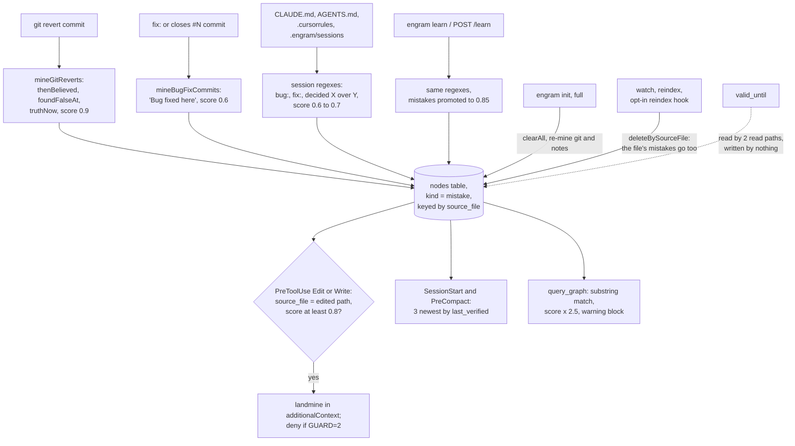

## 1. Executive Summary

engram, published on npm as `engramx`, is a local code-intelligence layer for
Claude Code and similar hosts. It builds a structural graph of a repository in
one SQLite file, intercepts reads and edits through hooks, and adds a mistake
memory: nodes mined from reverts, fix commits and project notes that warn the
agent before it edits a file with a history.

What is notable is the revert record. A `git revert` becomes a mistake with the
belief it overturned, the date it was found false, and the revert that
superseded it, rendered as *"then you believed … found false … truth now"*.

What is weak is where that memory lives. Mistakes share the `source_file`
column with derived code nodes, so the paths that refresh code delete them, and
every store open rewrites the whole file on close.

Most of the tree is not memory. The AST miner, the reference graph, PageRank,
the Read and Grep interception gates, the provider resolver and the token
accounting are a context-compression product. This report covers the
mistake, decision and pattern nodes, which state things that can be false,
and the code graph only where the two share a table.

The mistake memory is built on the graph's own node table
(`src/graph/schema.ts:3-53`): a mistake is a `GraphNode` with `kind: "mistake"`,
four optional bi-temporal fields added by migration 9
(`src/db/migrate.ts:206-211`), and a `valid_until` column added by migration 8
(`:186-194`) that the readers honour and nothing writes.

One mark, `negative_eval`, for a committed case in which a per-file lookup
leaves out another file's mistakes after a positive control. Section 9 names
the six withheld.

Five other repositories named engram have reports, and none is this one:
[engram](../engram/), [engram-alpha](../engram-alpha/),
[engram-cognitive](../engram-cognitive/), [engram-format](../engram-format/)
and [engram-provable](../engram-provable/). The licence is Apache-2.0 with no
rider.

## 2. Mental Model

A memory here is a graph node of kind `mistake`, `decision` or `pattern`. None
is ever a candidate: a node exists or it does not, and a node's weight in
retrieval is a confidence score set by its miner.

**Beliefs arrive from four producers, all regular expressions and git.**

- `mineGitReverts` pairs a revert commit with the commit it reverts and writes
  `thenBelieved` (the original subject), `foundFalseAt` (the revert's author
  time), `truthNow` (`"Reverted in <sha>"`) and `appliesTo` (a label derived
  from the changed paths), at confidence 0.9 (`src/miners/git-revert-miner.ts:196-219`).
- `mineBugFixCommits` turns a `fix:`-prefixed or issue-closing commit into
  `"Bug fixed here: <subject>"` at 0.6 (`src/miners/git-bugfix-miner.ts:75-86`, `:126-141`).
- `mineSessionHistory` runs three regex families over `CLAUDE.md`,
  `.claude/CLAUDE.md`, `AGENTS.md`, `.cursorrules`, `.cursor/rules` and every
  `.engram/sessions/*.md` (`src/miners/session-miner.ts:14-29`, `:95-125`).
  A `bug: …` line becomes a mistake at 0.6, a `decided X over Y` phrase a
  decision at 0.7, a `pattern: …` line a pattern at 0.65.
- `learn` runs the same regexes over a caller's text and promotes any mistake it
  finds to 0.85 and `EXTRACTED` (`src/core.ts:620-642`).

**Identity is derived from the words.** Session nodes take
`session_<kind>_<label>` lowercased, stripped to alphanumerics and cut at 60
characters (`session-miner.ts:31-39`). Two lessons whose normalised text
shares its first 44 characters are one node, and the second replaces the first.
Revert and fix nodes are keyed on commit shas and replace themselves on re-mine.

**A belief stops being one in three ways, none of them a decision about it.**
A full `engram init` deletes every node and re-mines
(`src/core.ts:171-173`), so git-mined mistakes return, bounded to the last 200
or 300 commits, while every `learn`ed node is gone. A single-file reindex
deletes every node whose `source_file` is that file, then re-inserts only AST
nodes (`src/watcher.ts:124-138`), so the file's mistakes disappear until the
next full init. The third exit, `valid_until`, is declared and never set
(section 5).

## 3. Architecture

`engramx` is a Node 20 TypeScript package with three binaries: the `engram` CLI,
an alias, and `engram-serve`, a stdio MCP server (`package.json`). Storage is
`sql.js`, SQLite compiled to WebAssembly: `GraphStore.open` reads the whole
`.engram/graph.db` into memory and `save` writes the whole exported database
back with `writeFileSync` (`src/graph/store.ts:29-40`, `:102-105`). `close`
always calls `save` (`:669-672`).

That makes every open-and-close a whole-file write, including reads. Each hook
invocation is a separate process, and `mistakes()`, `getFileContext()` and
`queryGraph()` all open and close the store; `queryGraph` also increments
`query_count` on its seeds (`src/graph/query.ts:128`). The only lock in `src/`
guards `init` (`src/core.ts:82-95`).

The hook layer is `engram intercept`, registered by `engram init` into the
project's `.claude/settings.local.json` on PreToolUse, PostToolUse,
SessionStart, SubagentStart, UserPromptSubmit, PreCompact, CwdChanged and Stop
unless `--no-hook` is passed (`src/intercept/installer.ts:22-31`, `:105-155`;
`src/cli.ts:136-206`). An HTTP server bound to `127.0.0.1` with Host, Origin,
bearer-token and JSON content-type checks adds `POST /learn`
(`src/server/http.ts:336-367`, `:744-756`).

Providers resolve per-file context packets from the graph, git, Claude Code's
own `MEMORY.md` index, an external `mempalace` CLI, Context7, Obsidian and
configured MCP servers, caching results in a `provider_cache` table
(`src/providers/`). Of these, only the graph belongs to engram's memory; the
others are readers of someone else's store.

### Deployment and ergonomics

One `npm install -g engramx` and `engram init` in a project. No API key, no
model call, no service; everything runs in the hook processes. The store is a
SQLite file any client can open, and mistakes can be listed with
`engram mistakes`, but there is no command to remove one. The update check and
optional providers reach the network, which the README states.

## 4. Essential Implementation Paths

**Mine on init.** `init` runs `extractDirectory`, `mineGitHistory`,
`mineGitReverts`, `mineBugFixCommits` and `mineSessionHistory`
(`src/core.ts:112-120`), then either clears everything (full) or calls
`removeNodesForFile` for each `sourceFile` in the new node set (incremental),
and `bulkUpsert`s (`:160-174`).

**Teach.** `engram learn <text>` → `learn(projectRoot, text)` with the default
source label `"manual"` (`src/cli.ts:622-634`); `POST /learn` passes the body's
`file`, defaulting to `"http-api"` (`src/server/http.ts:363`). Both reach
`learnFromSession` (`session-miner.ts:130-132`) and `store.bulkUpsert`.

**Warn on edit.** `dispatchPreToolUse` runs `handleEditOrWrite` and then
`applyMistakeGuard` for Edit and Write, and `applyMistakeGuard` alone after
`handleBash` (`src/intercept/dispatch.ts:199-214`). `handleEditOrWrite` calls
`mistakes()` with `sourceFile`, a limit of 5 and `minConfidence: 0.8`
(`src/intercept/handlers/edit-write.ts:171-180`;
`src/intercept/safety.ts:48`). The guard re-reads by file through
`getNodesByFile`, drops rows whose `validUntil` has passed and rows under the
floor, and denies the call in strict mode
(`src/intercept/handlers/mistake-guard.ts:133-138`, `:314-335`).

**Warn on Bash.** The guard's Bash arm scans every mistake and matches
`metadata.commandPattern`, which nothing writes, or a `sourceFile` longer than
five characters that appears in the command (`mistake-guard.ts:151-195`).

**Brief.** SessionStart and PreCompact inject the three newest by `last_verified`
mistakes through `mistakes()` (`src/intercept/handlers/session-start.ts:276-279`;
`src/intercept/handlers/pre-compact.ts:138`). The Read path's
`engram:mistakes` provider lists up to five per file
(`src/providers/engram-mistakes.ts:25-39`).

**Query.** `queryGraph` seeds from `searchNodes`, a `LIKE` over label and id
ordered by `query_count` (`src/graph/store.ts:201-214`), multiplies a
mistake's score by 2.5 (`src/graph/query.ts:94-96`), and renders matched
mistakes in a warning block above the nodes (`:286-313`).

**MCP.** Six tools, all reads: `query_graph`, `god_nodes`, `graph_stats`,
`shortest_path`, `benchmark` and `list_mistakes` (`src/serve.ts:55-116`).

**Export into notes.** `engram gen` writes a marker-bounded block into
`CLAUDE.md` and `AGENTS.md` whose default view lists five mistakes and five
decisions (`src/autogen.ts:86-102`, `:165-175`). `engram memory-sync` writes a
similar block into the project's `MEMORY.md` (`src/cli.ts:1613-1714`).

## 5. Memory Data Model

| Column | Written by | Read by |
| --- | --- | --- |
| `kind` | every miner | every mistake read |
| `label` | miner or learned text | all renders, `searchNodes` |
| `source_file` | the file a commit touched, a notes file's basename, `manual`, `http-api`, or a caller's `file` | the per-file lookups, `deleteBySourceFile`, `removeNodesForFile` |
| `confidence`, `confidence_score` | miner constant; `learn` raises mistakes to 0.85 | the 0.8 floor; the enum only changes rendering |
| `last_verified` | commit time or mining time | ordering and `--since` |
| `then_believed`, `found_false_at`, `truth_now`, `applies_to` | the revert miner only | the landmine and `engram mistakes` renderers |
| `valid_until`, `invalidated_by_commit` | nothing outside tests | `engram:mistakes` provider, mistake guard |

**The validity column has no producer.** Migration 8's comment says
`valid_until` is set *"when the referenced code was refactored away"*, and the
provider's comment names the git miner as the writer
(`src/providers/engram-mistakes.ts:28-32`). `src/miners/git-miner.ts` contains
no `invalid` in any spelling, and the only assignment outside tests is
`upsertNode` binding whatever the node carries (`src/graph/store.ts:122-123`).
Two read paths filter on it. `core.mistakes()`, which serves the Edit
warning, the briefs, the CLI and MCP, does not (`src/core.ts:671-723`), and
neither do `queryGraph` or `engram gen`.

**The bi-temporal fields are one event.** `foundFalseAt` and `lastVerified` are
both the revert's author time; when the original belief started is not stored,
and nothing records when engram learned it apart from being overwritten on each
mine.

**Scope is the directory.** One `graph.db` per project root. The
`source_file` path is a relevance key, not a boundary, and learned mistakes can
name any path.

**Declared and unwired: mesh sharing.** `src/mesh/types.ts:91-104` declares a
`mistake.shared` payload with `observedAt` and `validUntil`, and `decision.shared`
beside it. No code sends or receives either, and the mesh audit log has one
writer, `engram mesh init`, which records `key_rotate` (`src/cli.ts:753`).

## 6. Retrieval Mechanics

There are three retrieval shapes, and none uses a vector.

- **By file.** Exact equality on `source_file`, the lookup that powers the
  landmine. It is precise for git-mined mistakes, which carry a real path, and
  blind to session-mined ones, which carry `CLAUDE.md` or `sessions/x.md`.
- **By recency.** `mistakes()` sorts by `last_verified` and slices, so the
  SessionStart brief shows the three newest regardless of relevance.
- **By text.** `searchNodes` is a substring `LIKE` over up to 200 nodes per
  term, BFS then expands neighbours; mistakes are boosted but have no edges, so
  they only enter by matching the query's words.

The proactive floor is the one precision control, and it is a score threshold:
reverts (0.9) and learned mistakes (0.85) warn, mined fix commits and session
lines (0.6) do not. `learn`'s default source label reaches the Bash arm. A
CLI-learned mistake carries `source_file = "manual"`, six characters, so every
mistake taught through `engram learn` matches any Bash command containing
`manual` (`mistake-guard.ts:182`) and, under `ENGRAM_MISTAKE_GUARD=2`, denies it.

Injection is bounded: 3 mistakes in a brief, 5 per edit warning, 5 per file
from the provider, labels truncated at 500 characters.

## 7. Write Mechanics

Writes are synchronous, local and model-free. `init` mines and writes in one
process; `learn` is one CLI call. A learned mistake is retrievable immediately.
No background pass rewrites memory; the watcher and reindex hook touch one file
at a time.

**Nothing deletes a mistake on purpose, and two paths delete them by accident.**
`syncFile` calls `deleteBySourceFile(relPath)`, which removes every node with
that `source_file` in one transaction (`src/graph/store.ts:155-165`), then
inserts `extractFile`'s AST nodes (`src/watcher.ts:124-130`). Git-mined
mistakes are keyed on the file they describe, so editing that file under
`engram watch`, `engram reindex`, the opt-in `--auto-reindex` hook or
`ENGRAM_AUTO_REINDEX=1` removes the warnings for exactly the file being
changed. They return on the next full init; learned ones do not.

**Incremental init has the converse hazard, read and not run.** In incremental
mode the AST miner emits nothing for an unchanged file (`src/miners/ast-miner.ts:671-677`),
while the git miners emit mistakes and hot-file nodes for files regardless.
`removeNodesForFile` then runs for every such `sourceFile`
(`src/core.ts:162-170`), deleting the unchanged file's code nodes, which the
next incremental run also skips. `tests/incremental.test.ts` runs in a
directory that is not a git repository, so the git miners contribute nothing
there.

**Re-ingestion loop.** `engram gen` writes mistake labels into `CLAUDE.md` and
`AGENTS.md`, and `init` mines both files with the session regexes. A fix-commit
label such as *"Bug fixed here: fix: handle empty token"* contains a match for
`(?:fix|…):\s*(.{10,80})`, so the next init can add it back as a session
mistake at 0.6 under `source_file = "CLAUDE.md"`. The miner does not skip the
`<!-- engram:start -->` block.

**The CCS importer is not idempotent.** `engram init --from-ccs` gives every
bullet of `.context/index.md` a `randomUUID()` id, so a bullet under an
"Issues" heading becomes a mistake at 0.9, and an incremental init followed by
another import duplicates it (`src/ccs/importer.ts:23-35`, `:76-88`).

### Operational cost

- Write: synchronous, no model, one whole-file SQLite write per store close.
- Background: none for memory.
- Read: a store load and a whole-file write on every hook that consults the
  graph; injection bounded to a few lines per event, placed in hook
  `additionalContext` rather than a stable prefix.

## 8. Agent Integration

The agent receives memory without asking: landmines on Edit and Write, a brief
at SessionStart and before compaction, a *"KNOWN ISSUES"* section in Read
packets, and a warning block in `query_graph` results. It can list mistakes
through MCP and cannot write, correct or delete one through it.

It can write through a shell. `engram learn` is a CLI command, and the HTTP
`POST /learn` accepts any holder of the local token. A learned mistake is
promoted to the nagging tier by construction, so the one channel with no
provenance is the one that warns loudest.

The guard's default is contradicted in the tree. `currentGuardMode` returns
`permissive` when `ENGRAM_MISTAKE_GUARD` is unset
(`mistake-guard.ts:40-53`), while the same file's header says *"unset / `0` →
no-op (default — zero production overhead)"* (`:4-8`), the dispatcher's comment
says opt-in (`dispatch.ts:204-205`), and `server.json` tells MCP registries
*"Unset = off, zero overhead"*.

## 9. Reliability, Safety, and Trust

**Concurrent hooks are last-writer-wins, and the project knows.** Every process
loads the file, mutates or only reads, and writes the whole file back. A
`learn` that lands while a PreToolUse hook holds an older snapshot is erased
when that hook closes. The repository's own two-process test states it:
*"SQLite's last-writer-wins semantics mean one write may clobber the other when
two sql.js processes save concurrently"*, and asserts only that one of the two
files' nodes survived (`tests/watcher.test.ts:377-404`). `writeFileSync` is not
a temp-and-rename, so a crash mid-write can truncate the store.

**Provenance is good for reverts and absent for the rest.** A revert mistake
carries both shas, the original author and the reverted files in `metadata`
(`git-revert-miner.ts:206-212`). A learned or session mistake carries a label
and a file name.

**Prompt-injected memory.** Anything that can write a matching line into
`CLAUDE.md`, `AGENTS.md`, `.cursorrules` or `.engram/sessions/` plants a
mistake or decision on the next init, and anything that can run `engram learn`
plants one that warns immediately. There is no quarantine state.

**Uncertainty is a number.** The score sets a threshold on two warning paths;
nothing can say *"on record, not believed"*.

Capability marks:

- `negative_eval` — awarded; evidence in section 10.
- `tombstone` — no delete verb exists for a memory, and a re-mine re-asserts
  whatever the sources still say.
- `trust_state` — `confidence` is an enum, `EXTRACTED | INFERRED | AMBIGUOUS`,
  and every read of it changes rendering (`query.ts:309`, `edit-write.ts:104`).
  The filter is on `confidence_score`, a float.
- `bitemporal` — `valid_until` has readers and no producer, and the revert
  miner's `foundFalseAt` equals its `lastVerified`. One clock, stored twice.
- `scope_enforced` — one database per project is a physical partition; the
  `source_file` predicate is relevance, not scope.
- `audit_log` — the mesh `audit.jsonl` has one writer, recording identity key
  rotation; `hook-log.jsonl` is tool telemetry. Neither records a memory
  mutation.
- `human_review` — no state waits for anyone; `engram mistakes` displays.

## 10. Tests, Evals, and Benchmarks

Nothing was built or run for this report; everything below is from reading
the tests at the pin. CI runs `npx vitest run` on Ubuntu and Windows under
Node 20 and 22 (`.github/workflows/ci.yml:10-58`).

**The negative case.** `mistakes() — sourceFile filter` seeds two learned
mistakes each under `src/auth.ts` and `src/db.ts`
(`tests/intercept/mistakes-filter.test.ts:35-47`). *"filters to only mistakes
matching the given sourceFile"* asserts the `src/auth.ts` lookup is non-empty
and that every result's `sourceFile` is `src/auth.ts` (`:62-70`). The fixture
guarantees the excluded material is present, and the positive side is asserted
first, so an empty result fails.

**Well-formed cases on an unproduced state.**
`tests/providers/engram-mistakes.test.ts:140-172` seeds a stale, a
future-dated and an undated mistake in one file and asserts the provider keeps
two and drops the stale one; `tests/intercept/handlers/mistake-guard.test.ts:233-254`
does the same through the guard. Both seed `validUntil` by hand, which is the
only way it is ever set.

**The floor, tested in halves.** *"does NOT surface a low-confidence mistake"*
seeds only a 0.6 mistake and asserts zero matches (`mistake-guard.test.ts:185-198`),
and a separate case seeds only a 0.9 one and asserts one. Each half alone
could pass on a guard that returned nothing, or everything.

**A precision gate on the miner.** *"engram README corpus extracts ZERO garbage
mistakes (frozen fixture)"* runs the session regexes over a saved README and
asserts no mistake, decision or pattern (`tests/mistake-memory.test.ts:209-228`),
with the comment *"don't silently accept"*. It pins false positives on one
document; recall is not measured.

**Not covered.** No test runs `syncFile` on a file that has mistakes, runs an
incremental init inside a git repository, or checks that a learned mistake
survives `init`. The `bench/` harnesses measure token counts of context packets,
and `bench/README.md` says the main runner *"does not run four live agents"*.
No paper describes engram; `docs/FRONTIER.md` cites others' arXiv papers.

## 11. For Your Own Build

### Steal

- **Mine reverts into structured regret.** A revert is the one commit that
  says in so many words that an earlier belief was wrong; keep the overturned
  subject, the date and the superseding sha as separate fields.
- **Split browsing from nagging with a floor.** Everything inferred stays
  listable; only high-confidence memory interrupts a tool call.
- **Freeze a prose fixture against the extractor.** A regex miner's failure is
  false positives on documentation, and one saved README with an assertion of
  zero catches the loosening.
- **Keep the model-facing surface read-only** when writes have no provenance.

### Avoid

- **Keying memory on the same column as a derived index.** A delete meant to
  refresh derived rows will take the memory with it.
- **Whole-file writes from every reader.** With several hook processes per
  turn, a store that saves on every close loses writes by design.
- **A validity column the readers trust and nothing sets.** It reads as a
  guarantee in the schema, the comments and the changelog
  (`CHANGELOG.md:507`), and behaves as `NULL` everywhere.
- **Writing memory into the files you mine.** Export and ingest need a
  boundary the miner respects.

### Fit

This suits a solo developer on one machine who wants a coding agent warned
before it edits a file with reverts in its history, and who already wants the
code graph. The memory is a side effect of the graph rather than a store with
its own lifecycle. Anyone who needs taught lessons to persist, several agents
writing at once, or a way to retract a wrong warning should read the revert
miner and build the store around it themselves.

## 12. Open Questions

- How often do concurrent hook processes lose a write in a real Claude Code
  session with parallel tool calls? Nothing here measures it.
- Does the incremental-init deletion described in section 7 occur as read? It
  was traced, not reproduced.
- Was `valid_until` ever written by an earlier version of the git miner, or
  planned and never landed? The changelog entry does not say.
- Is the permissive guard default intended, given that `server.json` and the
  file header say off?

## Appendix: File Index

- **Schema and storage:** `src/graph/schema.ts`, `src/graph/store.ts`,
  `src/db/migrate.ts`.
- **Write:** `src/core.ts` (`init`, `learn`), `src/miners/session-miner.ts`,
  `src/miners/git-revert-miner.ts`, `src/miners/git-bugfix-miner.ts`,
  `src/ccs/importer.ts`, `src/server/http.ts`.
- **Deletion by refresh:** `src/watcher.ts`, `src/intercept/handlers/post-tool.ts`,
  `src/intercept/installer.ts`.
- **Retrieval and injection:** `src/core.ts` (`mistakes`), `src/graph/query.ts`,
  `src/providers/engram-mistakes.ts`, `src/intercept/handlers/edit-write.ts`,
  `src/intercept/handlers/mistake-guard.ts`, `src/intercept/handlers/session-start.ts`,
  `src/intercept/handlers/pre-compact.ts`, `src/intercept/dispatch.ts`,
  `src/intercept/safety.ts`.
- **Export:** `src/autogen.ts`, `src/intercept/memory-md.ts`.
- **MCP:** `src/serve.ts`, `server.json`.
- **Declared, unwired:** `src/mesh/types.ts`, `src/mesh/audit.ts`.
- **Tests:** `tests/intercept/mistakes-filter.test.ts`,
  `tests/providers/engram-mistakes.test.ts`,
  `tests/intercept/handlers/mistake-guard.test.ts`,
  `tests/mistake-memory.test.ts`, `tests/watcher.test.ts`,
  `tests/incremental.test.ts`.

### Recorded searches

Checked against the checkout at the pinned revision.

- `grep -rn 'validUntil\|valid_until\|invalidatedByCommit\|invalidated_by_commit' src | grep -v '^src/graph/schema.ts'` — `store.ts` binds and reads the columns; `engram-mistakes.ts:32` and `mistake-guard.ts:137,156` filter; `mesh/types.ts:103` declares a string; no assignment.
- `grep -rn 'validUntil\|valid_until' --include='*.ts' . --exclude-dir=node_modules --exclude-dir=.git | grep -v '^./src/'` — every assignment is in `tests/`.
- `grep -n -i 'invalid' src/miners/git-miner.ts` — no match.
- `grep -rn "mistake.shared\|MistakeSharedPayload\|decision.shared" src --include='*.ts'` — `src/mesh/types.ts` only.
- `grep -rn 'logAudit(' src --include='*.ts'` — `cli.ts:753` and the definition.
- `grep -rn 'commandPattern' src --include='*.ts'` — read in `mistake-guard.ts`; no writer.
- `grep -rn -i -E 'forget|dismiss|unlearn|tombstone|suppress|blocklist|denylist' src --include='*.ts'` — no memory verb.
- `grep -rn -i -E 'approve|pending|review' src --include='*.ts'` — migrations and hook preview only.
- `grep -rn -i -E 'user_id|tenant|namespace|agent_id|scope' src/graph src/db src/core.ts` — no match.
- `grep -rnE "confidence ?(===|!==|==) ?\"|'(EXTRACTED|INFERRED|AMBIGUOUS)'|\"AMBIGUOUS\"" src --include='*.ts'` — renders at `query.ts:309` and `edit-write.ts:104`, the stats count and DDL defaults.
- `grep -rn 'syncFile(' src --include='*.ts'` — `watcher.ts`, `cli.ts` (`reindex`), `post-tool.ts`.
- `grep -rn -i 'lock' src --include='*.ts' | grep -v -i 'block\|clock\|unlock'` — `init.lock` in `core.ts` and a hook-log comment.
- `grep -rln -i -E 'concurren|parallel|Promise\.all' tests --include='*.ts'` — `core.test.ts`, `watcher.test.ts`, `providers/lsp.test.ts`; only `watcher.test.ts:377` runs two writers.
- `grep -rn '"sessions"\|sessions/' src --include='*.ts'` — the session miner reads `.engram/sessions`; nothing writes it.
- `grep -rn 'engram:start\|engram:end' src/miners/session-miner.ts` — no match.
- `grep -rn 'incremental: true\|--incremental' src` — the CLI flag only.
- `grep -rliE 'arxiv|bibtex|@article|@misc|doi\.org' . --exclude-dir=.git --exclude-dir=node_modules` — `docs/FRONTIER.md`, citing other work; no `CITATION.cff`.

## History

**2026-09-26** — [`df445d3132583100e6d5106af4b4c91c01a2ba15`](https://github.com/NickCirv/engram/commit/df445d3132583100e6d5106af4b4c91c01a2ba15) — first reading, at the head of `main`, a commit dated 22 September 2026. One mark, `negative_eval`. Screened before reading: 2 auto-run surfaces (`.cursorrules`, an engram-generated structure summary, and `server.json`, an MCP manifest naming the `engramx` npm package), 3 build-time execution points (a `postinstall` that prints a banner, two `prepublishOnly` builds), 5 dependency files inside the cooldown — every file in a depth-1 clone dates to the tip — and 3 unpinned surfaces. `.cursorrules`, `CLAUDE.md` and `CONTEXT.md` were read as data. Nothing was installed, built or run.
