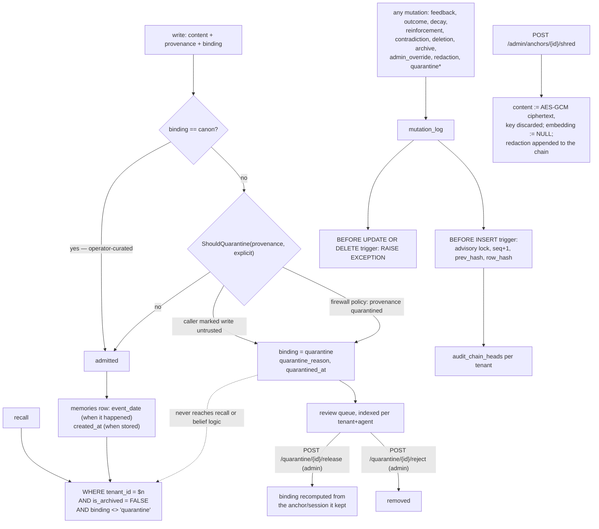

## 1. Executive Summary

This is the third repository named Engram in the atlas, distinct from
[Engram](../engram/) and [Engram Alpha](../engram-alpha/): a 44,000-line Apache-2.0
Go service — "provable memory infrastructure for AI agents" — on PostgreSQL with
pgvector.

**The mechanism worth the report resolves a conflict most systems in this atlas
avoid by ignoring one half of it.**

An append-only audit log and a right to erasure are contradictory requirements.
You cannot delete a row from a chain without breaking the chain, and you cannot
refuse a deletion request because your log is append-only. Engram's answer is
**crypto-shredding**:

> "CryptoShredAnchor cryptographically erases every memory bound to a subject
> (anchor): each content is replaced with AES-GCM ciphertext under a key that is
> immediately discarded, the embedding is cleared, and a redaction is recorded in
> the immutable audit chain. The rows and audit history remain (provable that
> data existed and was erased) but the content is permanently unrecoverable —
> GDPR right-to-erasure that's compatible with an append-only audit log."

The row survives, the chain survives, the proof that something was there and was
erased survives, and the content does not. This is the first instance of the
pattern in this atlas.

**The audit chain it protects is enforced in the database, not the
application.** `migrations/016_audit_chain.up.sql` adds `seq`, `prev_hash` and
`row_hash` to `mutation_log`, a per-tenant `audit_chain_heads` table, a canonical
row encoding as a single SQL function, a `BEFORE INSERT` trigger that takes
`pg_advisory_xact_lock` on the tenant before advancing the chain, and:

```sql
CREATE OR REPLACE FUNCTION mutation_log_immutable() RETURNS TRIGGER LANGUAGE plpgsql AS $$
BEGIN
    RAISE EXCEPTION 'mutation_log is append-only (tamper-evident audit trail)';
END $$;

CREATE TRIGGER trg_mutation_log_immutable BEFORE UPDATE OR DELETE ON mutation_log
    FOR EACH ROW EXECUTE FUNCTION mutation_log_immutable();
```

The application role cannot rewrite history because the database refuses.
`verify_audit_chain(tenant)` walks the chain checking sequence continuity,
`prev_hash` linkage and a recomputed `row_hash`, returning
`(valid, checked, break_seq)` — **where** it broke, not just that it did.

**The third mechanism is the Provenance Firewall** — section 9.

**And the headline benchmark is not in the repository** — section 10.

## 2. Mental Model

A write arrives with a **provenance** (user, inferred, …) and a **binding**
(canon, private, anchored, session, quarantine). The firewall inspects the
provenance against the tenant's policy and can hold the write in `quarantine` —
a binding excluded from every recall query — until an admin releases or rejects
it. Everything that changes a memory appends a row to the chained mutation log.



## 3. Architecture

`internal/` splits into `api` (chi router, handlers, middleware), `service`,
`store`, `domain`, `embedding`, `ingest`, `llm`, `observability`, `billing`,
`config`. Plus `mcp/`, `cmd/`, `console/` (an admin UI), 25+ ordered SQL
migrations, a `Dockerfile.distroless`, and `hack/validate-migrations.sh`.

The layering is conventional and the interesting decisions are pushed **down**:
tenant isolation, the audit chain, the append-only guarantee and the
binding/ID consistency rule are all database constraints and triggers rather
than service-layer discipline. That is the right place for them — a service can
be bypassed by the next handler someone adds, and a trigger cannot.

32 Go test files.

## 4. Essential Implementation Paths

**Chain** — `migrations/016_audit_chain.up.sql` (`audit_chain_heads` `:15-19`,
`audit_canon` `:22-33`, `audit_hash` `:36-37`, `mutation_log_chain` `:40-60`,
the immutability trigger `:65-72`, the backfill `:75-92`, `verify_audit_chain`
`:98-116`), `migrations/019_audit_chain_complete.up.sql`.

**Firewall** — `internal/service/memory.go` (the gate `:362-377`,
`quarantineWrite` `:529`), `internal/domain/settings.go` `ShouldQuarantine`
`:44-57`, `migrations/022`/`023`.

**Erase** — `internal/service/admin.go` (`RedactMemory` `:186-202`,
`CryptoShredAnchor` `:204-`), `internal/store/memory.go` `RedactContent`
`:1042-1054`.

**Scope** — `internal/store/memory.go` (`tenant_id = $2` on every read; the
`binding <> 'quarantine'` predicate at `:503`, `:643`, `:750`, `:875`).

## 5. Memory Data Model

`memories` carries `type`, `content`, `embedding`, `provenance`, `confidence`,
`currency`, `metadata`, `reinforcement_count`, `decay_rate`, `access_count`,
`last_verified_at`, `expires_at`, `is_archived`, plus the binding trio
(`binding`, `anchor_id`, `session_id`) and `quarantine_reason` /
`quarantined_at`.

**`event_date` is the bitemporal half most systems skip**, and migration 009
explains itself better than most papers do:

> "Add event_date column to memories to track WHEN the event happened (vs
> created_at = when stored). This is the critical fix for recency ordering:
> recency should rank by event date, not store date. Example: 'Back in 2019 I
> loved Python, by 2022 I switched to Go' — both stored today but 2022 > 2019.
> When event_date is NULL, falls back to created_at (backward compatible)."

Two indexes follow, one per agent and one adding tenant, both partial on
`is_archived = FALSE`. Valid time and transaction time are stored separately and
both reach queries, which is what the `bitemporal` mark certifies — and the
worked example is the clearest statement in the atlas of *why* it matters for
ranking rather than for audit.

The binding CHECK constraint is worth copying verbatim as a shape:

```sql
CHECK (
  (binding IN ('canon','private') AND anchor_id IS NULL AND session_id IS NULL) OR
  (binding = 'anchored'   AND anchor_id IS NOT NULL AND session_id IS NULL) OR
  (binding = 'session'    AND session_id IS NOT NULL) OR
  (binding = 'quarantine')
)
```

A quarantined trace is exempted from the rule on purpose: it "preserves whatever
`anchor_id`/`session_id` it would have had, so on release we can recompute its
real binding." Holding a write's would-be identity while it waits for review is
the detail that makes release cheap.

## 6. Retrieval Mechanics

Hybrid recall over pgvector with an HNSW index, graph expansion, entity
embeddings, and recency by `event_date`.

Every retrieval query carries the same two predicates:

```sql
WHERE agent_id = $1 AND tenant_id = $2
  AND is_archived = FALSE AND binding <> 'quarantine'
```

`tenant_id` reaching the query on every read path earns `scope_enforced`. The
`binding <> 'quarantine'` clause appears at four separate query sites in
`store/memory.go`, which is both the strength and the exposure: the invariant is
correct everywhere it was checked and it is repeated rather than centralised, so
the fifth query someone adds must remember it. A view, or the predicate folded
into a row-level security policy, would make it structural.

## 7. Write Mechanics

Writes pass the firewall, then insert. Mutations append to `mutation_log` with a
`mutation_type` constrained by CHECK to twelve values — `feedback`, `outcome`,
`decay`, `reinforcement`, `contradiction`, `deletion`, `archive`,
`admin_override`, `redaction`, `quarantine`, `quarantine_release`,
`quarantine_reject` — so the firewall's own decisions are as tamper-evident as
the memory changes.

`RedactMemory` and `CryptoShredAnchor` both begin with:

```go
if reason == "" { return ErrReasonRequired }
```

An erasure without a stated reason is refused. Both run inside a unit of work
that writes the mutation log row in the same transaction as the content change,
so an erasure that succeeded and an erasure that was recorded are the same event.

**And here is where the system is one query short of a tombstone.**
`mutation_log` stores a `content_hash`, and the domain comment says exactly what
it is for:

```go
// HashContent returns a hex sha256 of memory content, used to record what was
// deleted/redacted without retaining the original text.
```

That is the correct primitive, computed at exactly the right moment, stored in an
immutable chain — and no code path ever selects on it. Nothing checks an incoming
write's content hash against the hashes of previously deleted or rejected
content. The ingredient for a value-keyed rejected-value record is present,
hashed, chained and unconsulted, so a memory erased on request can be re-asserted
by the next ingest that produces the same text.

## 8. Agent Integration

An HTTP API with API keys and scopes, an MCP server, an admin console at
`/console`, a headless bootstrap endpoint, Docker Compose, a distroless image,
and three worked examples including a mistake-reduction benchmark.

Admin operations are scope-gated (`mw.RequireScope("admin")`) and routed
separately: `/quarantine/{id}/release`, `/quarantine/{id}/reject`,
`/admin/memories/{id}/redact`, `/admin/contradictions/resolve`,
`/admin/anchors/{id}/shred`, `/admin/agents/{id}/reembed`.

## 9. Reliability, Safety, and Trust

**Five marks — bitemporal, trust state, scope enforced, audit log, human
review.**

**Trust state and human review are the same mechanism, and it is the best-argued
one here.** Migration 022 states the threat model outright:

> "A quarantined trace is untrusted memory held OUTSIDE active recall and belief
> logic until a human/admin releases or rejects it — the defense against memory
> poisoning (OWASP ASI06)."

`binding = 'quarantine'` is a discrete state, excluded from every recall query,
with a `quarantine_reason` and `quarantined_at`, a partial index for the review
queue ordered newest-first, and two admin-scoped endpoints. `ShouldQuarantine`
decides on the tenant's configured provenance list plus an explicit per-write
flag, and `canon` — "operator-curated and trusted" — is exempt.

That is trust state as a *withholding* state, not a score, and a human
adjudicating memory content before it takes effect. Naming the OWASP category
the mechanism defends against is a discipline this atlas has seen in only a
handful of systems.

**Audit log — awarded**, per section 1. It is the strongest instance in the
corpus: chained, per-tenant, database-enforced append-only, with a canonical
encoding shared by writer and verifier so the two cannot drift, an advisory lock
so concurrent inserts cannot interleave the chain, and a verifier that reports
the breaking sequence number.

**Bitemporal — awarded**, per section 5.

**Scope enforced — awarded**, per section 6.

**Tombstone — no**, per section 7, and it is the closest miss in the atlas.

**Negative eval — withheld, on a narrow reading worth stating.**
`TestProvenanceFirewall_QuarantineReleaseReject` is a genuinely good test: a
trusted write admitted, an inferred write held by policy, an explicit flag
overriding a trusted provenance, queue counts before and after, release, reject,
and `ErrNotQuarantined` when releasing something that was never quarantined.
Both polarities, one function.

What it does not assert is the thing the mark asks for. The exclusion lives in
`binding <> 'quarantine'` inside the store's SQL, and this test runs against
`newMockMemoryStore()` — so it proves the write *becomes* quarantined and never
executes the predicate that keeps it out of recall. A test that quarantines a
memory and then asserts a recall does not return it would close the gap and, on
this atlas's terms, earn the mark.

## 10. Tests, Evals, and Benchmarks

**No paper.** 32 Go test files, `hack/validate-migrations.sh`, three examples.

The README leads with a benchmark table:

> "Engram scores **91.4% on LongMemEval** — the ICLR 2025 benchmark for long-term
> conversational memory (500 questions over chat histories scalable past 1M
> tokens) — and **92.3% averaged across its six task types**."

with a seven-row per-task breakdown from "Knowledge update 100.0%" and
"Abstention 100.0%" down to "Temporal reasoning 82.3%", and a methodology note:
"Measured with Engram as the memory store + retrieval layer, graded by
LongMemEval's standard LLM judge."

**Nothing in the repository runs it.** No harness, no result file, no
`benchmarks/` directory, no LongMemEval reference outside the README. The
methodology, the per-task breakdown and "how to read memory benchmarks" all live
at `hakuya.ai/#benchmarks` and `docs.hakuya.ai/benchmarks` — off-repository,
outside the pinned commit, and not checkable from the tree.

The atlas takes no position on whether the number is right. It records that the
number cannot be reproduced or audited from what is published here, and that this
is the one place in an otherwise unusually verifiable system where a claim rests
on a link. Two publicly-verifiable things are one commit away: the runner and one
result JSON.

The reporting itself is well-shaped — a per-task breakdown with the weakest
category shown, the judge named, the role of the system stated. It is the
evidence that is missing, not the honesty.

**I ran nothing**, and no `docker compose up` was attempted.

## 11. For Your Own Build

### Steal

- **Crypto-shred instead of choosing between erasure and audit.** Replace the
  content with ciphertext under a key you immediately discard, clear the
  embedding, and record the redaction in the chain. The row and the history
  remain, the content does not, and you can prove both.
- **Enforce append-only in the database.** A `BEFORE UPDATE OR DELETE` trigger
  that raises is a guarantee; a service-layer convention is a hope. The
  application role should not be able to rewrite its own audit trail.
- **Chain per tenant, under an advisory lock.** `pg_advisory_xact_lock` on the
  tenant before reading and advancing the head is what makes the sequence
  meaningful under concurrency.
- **Put the canonical encoding in one function.** `audit_canon` is used by the
  insert trigger *and* by the verifier, so the hash the writer computes and the
  hash the checker recomputes cannot drift apart. Two implementations of a
  canonical form is one of them being wrong.
- **Have the verifier name the break.** `(valid, checked, break_seq)` beats a
  boolean when someone has to investigate.
- **Quarantine untrusted writes rather than scoring them.** A binding excluded
  from every recall query, with a reason, a timestamp, an indexed review queue
  and release/reject endpoints, is a defence against memory poisoning that a
  confidence penalty is not.
- **Let the quarantined write keep its would-be identity.** Preserving
  `anchor_id`/`session_id` while it waits means release recomputes the real
  binding instead of guessing.
- **Require a reason for erasure.** `ErrReasonRequired` on redaction and on
  shredding, and the log row written in the same transaction as the change.
- **Rank recency by when it happened, not when you stored it.** The migration's
  own example — "Back in 2019 I loved Python, by 2022 I switched to Go", both
  stored today — is the argument, and the `NULL` fallback to `created_at` makes
  it adoptable without a backfill.
- **Constrain the state machine with a CHECK.** Which ID columns may be non-null
  for which binding is a database rule here, not a code review.

### Avoid

- **Do not hash deleted content and then never look it up.** `content_hash` is
  computed, chained and immutable, and one `SELECT` on the write path would turn
  it into a rejected-value record. Without that, an erasure is undone by the next
  ingest of the same text.
- **Do not repeat a safety predicate at four query sites.**
  `binding <> 'quarantine'` is correct everywhere it appears and the fifth query
  is the one to worry about. A view or an RLS policy makes it structural.
- **Do not put your only benchmark evidence on a website.** Everything else here
  is verifiable from the commit; the headline number is the exception, and a
  runner plus one result file would fix it.
- **Do not test an exclusion against a mock that cannot exclude.** The firewall
  test is thorough and stops one assertion short of proving recall omits a
  quarantined memory.

### Fit

The strongest fit in this atlas for a regulated or multi-tenant deployment: the
audit chain, the crypto-shredding, the tenant predicate on every read and the
admin scope gates are the things a compliance reviewer asks for, and they are
implemented where they cannot be bypassed.

Heavier than a local-first agent needs — Postgres, pgvector, migrations, a
console, billing — and the benchmark claim should be treated as unverified until
the runner is published.

## 12. Open Questions

- **Where is the LongMemEval harness?** The claim is specific and detailed and
  nothing in the tree produces it.
- **Is `verify_audit_chain` ever called?** The function exists; whether an
  endpoint, a job or an admin action invokes it was not traced.
- **What is the shredding key derivation?** `CryptoShredAnchor` discards the key
  immediately; how it is generated per memory was not read.
- **Does contradiction detection change a binding?** `contradiction` is a
  mutation type and whether a contradicted memory can be quarantined rather than
  only losing confidence was not established.

## Appendix: File Index

**Audit chain** — `migrations/016_audit_chain.up.sql` (the intent `:1-4`,
`audit_chain_heads` `:15-19`, `audit_canon` `:22-33`, `audit_hash` `:36-37`,
`mutation_log_chain` `:40-60`, the immutability trigger `:65-72`, the backfill
`:75-92`, `verify_audit_chain` `:98-116`),
`migrations/013_mutation_log_audit.up.sql`,
`migrations/014_admin_overrides.up.sql`,
`migrations/019_audit_chain_complete.up.sql`

**Provenance Firewall** — `migrations/022_firewall_quarantine_enum.up.sql` (the
OWASP ASI06 note `:4-8`), `migrations/023_firewall_quarantine_schema.up.sql`
(the columns `:7-9`, the relaxed CHECK `:13-21`, the queue index `:24-26`, the
mutation-type CHECK `:30-35`), `internal/service/memory.go` (`:362-377`,
`quarantineWrite` `:529`), `internal/domain/settings.go` (`ShouldQuarantine`
`:44-57`), `internal/api/router.go` (`ListQuarantine` `:367`, release/reject
`:399-403`)

**Erasure** — `internal/service/admin.go` (`RedactMemory` `:186-202`,
`CryptoShredAnchor` `:204-`), `internal/store/memory.go` (`RedactContent`
`:1042-1054`), `internal/domain/learning.go` (`HashContent` `:70-75`)

**Bitemporal** — `migrations/009_event_date.up.sql` (the rationale and worked
example `:1-5`, the two indexes `:10-15`)

**Scope and recall** — `internal/store/memory.go` (`:89-90`, `:503`, `:643`,
`:750`, `:875`), `migrations/018_entities_tenant_not_null.up.sql`,
`migrations/024_tenant_isolation_assoc_activations.up.sql`

**Tests** — `internal/service/memory_test.go`
(`TestProvenanceFirewall_QuarantineReleaseReject` `:525-597`),
`internal/service/agent_test.go` (`TestAgentService_GetByID_WrongTenant` `:184`)

**Claims** — `README.md` (the benchmark table and the off-repository methodology
links)

## History

**2026-08-09** — [`4a3d20487a370d0cca6eaaf97861a6d5d0bcbe37`](https://github.com/Harshitk-cp/engram/commit/4a3d20487a370d0cca6eaaf97861a6d5d0bcbe37) — first reading. Screened before reading; the tree was read, never deployed, and no test or benchmark was run.
