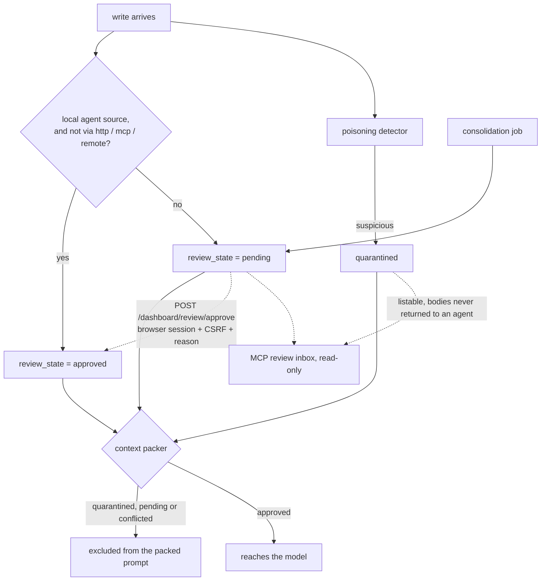

## 1. Executive Summary

Engraphis is a local-first memory engine for coding agents — Apache-2.0, about
79,200 lines of Python, one SQLite file, a dashboard, an MCP server and a v2 HTTP
API. It stores memories typed working, episodic, semantic or procedural, retrieves
them through vector, BM25 and graph arms fused by RRF, and packs the result to a
token budget.

**It is open-core, and the boundary is stated rather than implied.** The README
says this repository holds *"the free local engine, dashboard, MCP server, and
customer-side clients"* while *"hosted sync, analytics, automation, and team
services run on the official hosted service; their server implementations are not
distributed here."* The memory engine is in the tree; what a reader cannot check
is the hosted half, and the report covers only the half that is here.

Six of this atlas's seven marks are earned, and the one that carries the design is
**an approval an agent structurally cannot perform.**

Every write is stamped `pending` unless it came from a local agent source that did
not arrive over `http`, `mcp` or `remote` ingress, in which case it is `approved`
(`service.py:641-655`). The comment above that branch names the attack it exists
for: an external caller must not be able to *"submit `source=\"agent\"` and
self-approve prompt-visible content."* A third state, `quarantined`, is applied by
the poisoning detector. The read path is where the state bites — the packer drops
a memory when `quarantined or review_state == REVIEW_PENDING or conflicted`
(`service.py:7011-7014`), so a pending claim is stored, listable and invisible to
the model.

The only way out of `pending` is a person. `POST /dashboard/review/approve`
(`dashboard_app.py:637`) states its own boundary in the docstring — *"This is
intentionally not a v2 API or MCP operation. A bearer token cannot invoke it: the
caller must hold the HttpOnly browser session and echo the per-session CSRF value
returned only by the same-origin login exchange"* — and refuses a missing session
cookie, a missing browser header, a mismatched CSRF token and an empty `reason`
with 401, 403, 403 and 422. The MCP side is read-only by design: the review inbox
tool lists pending, quarantined and conflicting records and returns no quarantined
bodies to an agent at all.

Most systems in this atlas that hold a review state let the same interface that
writes a memory also bless it. This one makes the approving principal a different
kind of caller, in code, and says so where a maintainer will read it.

**Two axes of time, both reachable.** `valid_from` and `valid_to` are world time;
`valid_to_recorded_at` is commented in the schema as the *"system-time when
valid_to was learned"*. The historical-support query binds them to separate
parameters (`service.py:9694-9702`), and the MCP recall tool exposes `valid_at`
and `known_at` as distinct arguments beside `as_of`, so an agent can ask what was
true at one instant as it was known at another.

**What is withheld, and it is the interesting one.** `tombstone` is refused.
`core/sync.py` has tombstones and takes them seriously — *"secure-erase tombstones
are terminal within their known repository scope"* — but they are **delete-sync
markers keyed on an id**, the mechanism this atlas's rubric names as explicitly
not the mark. Nothing here keys a record on a rejected *value*, so a claim a
reviewer refused can be extracted again tomorrow and arrives, correctly, as
`pending`. The review gate catches it; no record says it was already judged.

## 2. Mental Model

A memory is a claim with a review state and two clocks. It enters `pending` or
`approved` depending on where it came from, and the packer — not the store —
decides whether it reaches the model.



The dotted edge is the whole design: it is the only transition into `approved`,
and it is the only one an MCP client cannot take.

## 3. Architecture

One SQLite database and one process. `engraphis/core/schema.py` defines memories,
an entity/edge graph with per-edge supports, a portable vector table, a job queue
and a hash-chained `audit` ledger. There is no server to stand up, and the
dashboard, the MCP server and the v2 API are three front ends over the same store.

**What it costs to run.** A Python install and a SQLite file. Embedding,
consolidation and graph indexing run as queued jobs rather than inline, so a write
returns before its vector exists. The Dockerfile and two compose files are for the
dashboard, not a required service.

**The audit ledger is chained.** `audit(id, ts, actor, action, target, detail,
prev_hash)` hashes each entry over its predecessor (`store.py:205-208`), so a row
removed from the middle is detectable. The schema comments record that the table
had no index at all and that every read was a full scan — a fact about the
project's own history, kept where the fix landed.

## 4. Essential Implementation Paths

- **Schema** — `engraphis/core/schema.py`: `memories` (81), `memory_entities` (121),
  `events` (518), `audit` (531).
- **Review state** — `engraphis/core/poisoning.py:18-19` defines the vocabulary;
  `engraphis/service.py:641-655` assigns it at ingress; `:7011-7014` enforces it
  in the packer.
- **Approval** — `engraphis/dashboard_app.py:637-668`.
- **Review inbox** — `engraphis/mcp_server.py:3097-3110`.
- **Recall** — `engraphis/core/recall.py`: pipeline header (1-12), scope predicates
  (1716-1725).
- **Bi-temporal read** — `engraphis/service.py:9694-9702`; the MCP parameters at
  `engraphis/mcp_server.py:1004-1010`.
- **Audit chain** — `engraphis/core/store.py:205-208`, writers at `:5932`, `:8480`.
- **Sync tombstones** — `engraphis/core/sync.py:29-30`, `:83-84`.
- **Security gate** — `eval/adversarial_memory_security.py`.

## 5. Memory Data Model

`memories` carries the claim, its type, a `scope` of session, repo, workspace or
user, and a wide set of scoring fields — `importance`, `surprise`, `stability`,
`confidence`, `access_count`, `last_access`. `confidence` is a model/extraction
number used as a scoring multiplier, and the schema comment says so; it is not the
trust state, which lives in the provenance blob.

Time is four columns. `valid_from` and `valid_to` bound world time; `ingested_at`
is system-time validity; `valid_to_recorded_at` records when the closure was
learned. `modified_hlc` holds a hybrid logical clock for descriptive state, which
is what makes the hosted sync half possible without the usual last-writer-wins
collapse.

`subject_key` and `claim_kind` are on the row as *"stable claim subject"* and
*"optional claim predicate/category"*. They are the natural key a value-level
tombstone would hang on, which is what makes the absence of one a near miss rather
than an oversight.

## 6. Retrieval Mechanics

The pipeline is stated at the top of `recall.py`: scope and time filter, then
hybrid candidate generation across vector, lexical and graph arms, RRF fusion,
retention-aware weighted scoring, rerank, context packing, reinforce. The graph arm
is Personalized PageRank over the entity graph seeded at the query's entities, with
a `graph_mode="1hop"` kept for ablation against the older expansion.

Scope is applied before ranking, as predicates rather than as a post-filter. The
nullable arms are worth reading before treating it as tenancy:
`(workspace_id=? OR workspace_id IS NULL)` admits unscoped rows into a scoped
query, deliberately, so a memory written without a workspace is visible from all
of them.

## 7. Write Mechanics

Writes are synchronous into SQLite and the expensive work is queued: embedding,
consolidation and graph indexing run as jobs, so **a memory is durable before it is
retrievable by vector**. The lag is the queue's, not a fixed interval.

The review stamp is the write path's most consequential line, and it is decided by
two facts about the caller — the declared source name and the ingress it arrived
on. An in-process local agent gets `approved`; anything over `http`, `mcp` or
`remote` gets `pending` regardless of what it claims about itself. The security
eval asserts the downgrade directly: a caller that submits `trusted=True` ends up
with `trusted: False`, `review_state: pending` and `trust_downgraded: True`.

**Consolidation writes back as `pending`** (`core/consolidate.py:1360`, `:1739`,
`:1786`, `:2039`). That is the conservative choice and it has a cost worth naming:
the system's own summarizer produces material only a person can release, so a
deployment nobody reviews accumulates consolidated memories that never reach a
prompt.

## 8. Agent Integration

An MCP server, a v2 HTTP API, a dashboard, and a `.claude-plugin/` marketplace
manifest. The MCP surface is the interesting one because of what it refuses:
recall tools take `as_of`, `valid_at`, `known_at`, a token budget, a retrieval
profile and per-type limits, while the review inbox is `readOnlyHint` and returns
no quarantined bodies. An agent can read everything it is allowed to see, see that
more exists, and approve none of it.

## 9. Reliability, Safety, and Trust

Memory poisoning is an explicit threat model, stated at the top of `service.py`:
*"validate and sanitize all untrusted input before it reaches the store — ingested
content is untrusted and memory poisoning is an explicit threat."*

The defences stack: ingress-derived review state, a poisoning detector that can
quarantine, a packer that drops both, and an approval path an agent cannot reach.
The audit ledger chains its entries. Secure erase emits sync tombstones that are
terminal within their repository scope.

What is missing is a memory of judgements. A rejected claim leaves no record keyed
on its content, so the same assertion re-extracted tomorrow is a fresh `pending`
row and a fresh decision for whoever reviews it. For a system this careful about
who may approve, not remembering what was refused is the asymmetry to fix.

## 10. Tests, Evals, and Benchmarks

`eval/` holds around thirty harnesses — ablation, chunking, consolidation ranking,
context economy, capacity matrices, an external arm and a red-team poisoning suite
— plus `BENCHMARKS.md` and `EVIDENCE.md`. No paper: a grep of the README and docs
for `arxiv`, `bibtex`, `@article`, `Citation` and `doi` returns nothing, and there
is no `CITATION.cff`.

**`eval/adversarial_memory_security.py` is the one to read**, and it is the best
instance of the shape this atlas keeps asking for. The fixture seeds four
adversarial inputs into one small graph — an instruction-shaped external memory, a
detector-bypass memory, a caller self-asserting `trusted=True`, and three edges
built to pull the pending data into a trusted query — and then checks that none of
it reaches the packed prompt while a trusted control still does.

Each absence metric carries its own vacuity guard **inside the same expression**:

```python
"poisoned_direct_edge_absent_from_prompt_graph": _rate(
    direct_edge in raw_edge_ids and direct_edge not in prompt_edge_ids
    and pending_id in raw_graph_ids and pending_id not in prompt_graph_ids
),
```

The edge must be present in the raw graph before its absence from the prompt
counts for anything, so the metric cannot pass because retrieval returned nothing
— the failure mode that makes most negative assertions in this corpus worthless.
`trusted_memory_available_in_prompt_graph` is the paired control and requires the
memory, its id and its marker text.

The gate states its own limits rather than leaving them to a reader: one fixed
ingress and topology, *"a regression gate, not a measurement of real-world attack
prevalence or detector recall"*, with grounded-answer coverage explicitly deferred
to a different suite.

Nothing was run. The screen reports two auto-run surfaces — a `.claude-plugin/`
marketplace manifest and committed `.githooks/` — and seven dependency files
changed the day of the pin, inside the seven-day cooldown.

## 11. For Your Own Build

### Steal

**Make the approving principal a different kind of caller, in code.** Not a role
flag on the same API — a different authentication mechanism entirely. A bearer
token cannot reach this approve endpoint; only a browser session with a CSRF token
can. An agent that can call every other tool still cannot bless its own memory, and
that property is structural rather than a policy someone might relax.

**Require a reason on approval.** Empty `reason` returns 422. It costs one line and
turns an audit row into something a later reader can use.

**Derive trust from ingress, not from the payload.** `trusted=True` in a request is
downgraded, and the eval asserts the downgrade. Anything a caller says about its own
trustworthiness is a claim, not evidence.

**Put the vacuity guard inside the metric.** `x in raw and x not in prompt` in one
expression cannot pass on an empty result. This is cheaper than a separate control
test and it cannot be separated from the assertion it protects.

**Say what the gate does not cover, in the gate.** The `scope.limitations` block
is three sentences and it stops the number being read as more than it is.

### Avoid

**Holding a review state with no memory of refusals.** A rejected claim leaves
nothing keyed on its value, so re-extraction produces a new `pending` row and the
reviewer decides again. The row already carries `subject_key` and `claim_kind`; the
tombstone is a table away.

**Letting the summarizer write into the review queue with no plan for who empties
it.** Consolidation output lands `pending`. In a deployment where nobody opens the
dashboard, the system's own best summaries are the memories it cannot use.

**Nullable scope predicates in a query you might call a boundary.**
`(workspace_id=? OR workspace_id IS NULL)` is the right behaviour for a
single-user tool and the wrong shape to inherit if the same code later serves two
tenants.

### Fit

This suits one developer or a small team running memory on their own machine, who
want to see and correct what the agent remembers, and who will actually open the
dashboard. The review gate is the product: if nobody reviews, everything arriving
over MCP stays invisible to the model, and the system quietly does less than it
appears to.

It is the wrong fit where memory must be written by remote agents and be
immediately usable — the ingress rule makes that a contradiction — and where the
hosted half matters, since that code is not here to read.

## 12. Open Questions

- **Will a rejected value ever be remembered as rejected?** `subject_key` and
  `claim_kind` are already on the row.
- **Who empties the review queue in an unattended deployment, and what happens to
  consolidation output that nobody ever approves?**
- **Is the `NULL` arm of the scope predicate load-bearing, or a migration
  artifact?** It decides whether the workspace key is a boundary or a default.
- **Does the hosted sync half preserve the review state across devices?** The
  hybrid logical clock suggests the design anticipated it; the server is not here.

## Appendix: File Index

**Schema and store**

- `engraphis/core/schema.py` — `memories` (81), `memory_entities` (121),
  `events` (518), `audit` (531)
- `engraphis/core/store.py` — `_audit_entry_hash` (205), audit writers (5932, 8480),
  legacy review-state migration (2938-2997)

**Review and trust**

- `engraphis/core/poisoning.py` — `REVIEW_PENDING`, `REVIEW_APPROVED` (18-19)
- `engraphis/service.py` — ingress stamp (641-655), packer enforcement (7011-7014)
- `engraphis/dashboard_app.py` — approve endpoint (637-668)
- `engraphis/mcp_server.py` — review inbox (3097-3110), quarantine description (513-514)

**Retrieval and time**

- `engraphis/core/recall.py` — pipeline (1-12), scope predicates (1716-1725)
- `engraphis/service.py` — bi-temporal historical support (9694-9702)
- `engraphis/mcp_server.py` — `as_of` / `valid_at` / `known_at` (1004-1010)

**Sync**

- `engraphis/core/sync.py` — tombstone semantics (29-30), constants (83-84)

**Evaluation**

- `eval/adversarial_memory_security.py` — fixture (1-34), metrics and controls (226-248)
- `eval/`, `BENCHMARKS.md`, `EVIDENCE.md`

### Commands behind the absence claims

```sh
grep -rn -i "tombstone\|rejected_value" --include="*.py" engraphis/
grep -rn "review_state" --include="*.py" . | grep -v "/tests/\|/eval/"
grep -rn -i "arxiv\|bibtex\|@article\|citation\|doi" README.md docs/
ls CITATION.cff
```

## History

**2026-09-13** — [`c4964809e2a519daf3022d21b0b6a24b4af99ef6`](https://github.com/Coding-Dev-Tools/engraphis/commit/c4964809e2a519daf3022d21b0b6a24b4af99ef6) — first reading. Screened before anything was read: two auto-run surfaces, a `.claude-plugin/` marketplace manifest and committed `.githooks/pre-commit`, plus seven dependency files changed the day of the pin and inside the seven-day cooldown. Nothing was installed, no hook was registered and no eval was run. Six marks. `tombstone` is withheld deliberately rather than for absence — `core/sync.py` implements tombstones and they are delete-sync markers keyed on an id, which this atlas's rubric names as not the mark. `human_review` was nearly withheld in error: the MCP inbox is read-only and a grep of the routes for `review_state` returns nothing, which reads as a display-only surface until a wider search finds `POST /dashboard/review/approve` calling into the service rather than touching the field. The open-core boundary is stated in the README and only the local engine was read.
