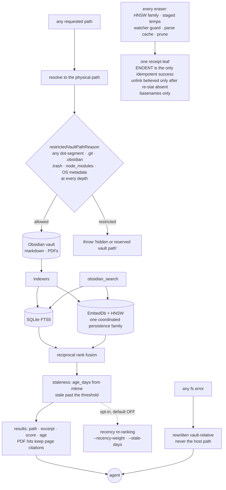

## 1. Executive Summary

enquire-mcp is an MCP server over an Obsidian vault. It does not store memories
of its own: the memory is the Markdown and PDFs the user already wrote, and the
server's job is to make them retrievable with their sources intact — paths,
page numbers for PDF hits, and a signal score. MIT, TypeScript, read-only by
default.

**One mark: `negative_eval`.** The others are absent for a structural reason
worth stating plainly rather than treating as a gap. There is one vault and one
user, so there is no stored scope key to filter a read path by; what the system
has instead is filesystem confinement, which is a different property and a
well-built one. Nothing carries an epistemic state, nothing records a rejected
value, and there is no second time axis — a note has an `mtime`.

The design decision worth taking away is what it does with that `mtime`. Every
recalled note is returned with `age_days` and a `stale` flag, and the module
that computes them says what it is for: *"This is metadata the agent can reason
over ('this note is 2 years old — verify before relying on it')."* The recency
re-ranking built on the same signal is opt-in and **off by default**, *"so the
ranking stays relevance-primary."* The system tells the model how old a fact is
and declines to act on that itself.

## 2. Mental Model

A vault is a directory of files. Retrieval is hybrid — SQLite FTS5 lexical plus
an embedding index with HNSW — fused with reciprocal rank fusion. What comes
back is a path, an excerpt, a score, and an age. Structured tools sit beside
the search: Canvas parsing, Dataview-style `LIST`/`TABLE` queries, and Obsidian
Base filters.

The safety model is a boundary rather than a policy. The question the code keeps
asking is not "may this agent see this memory" but "is this path part of the
public vault surface at all."

## 3. Architecture

## 4. Essential Implementation Paths

**The boundary, applied after resolution** — `src/vault-path-policy.ts` and
`src/vault.ts`. `restrictedVaultPathReason` classifies any dot-prefixed segment
as hidden and reserves `.git`, `.obsidian`, `.trash`, `node_modules` and OS
metadata *"at every depth"*. It folds Windows' trailing-dot-and-space stripping
*"even on non-Windows CI"*, so the classification does not change with the host.

The part that makes it a boundary rather than a filename check is where it runs.
`tests/security.test.ts:220-230` creates a hidden directory, points a
*visible-named* symlink at it, and asserts the read is refused with
`hidden or reserved vault path` — so the policy is applied to what the path
resolves to, and a symlink cannot launder a reserved directory into the public
surface.

**The leak class** — the same file asserts that `stat`, `readFile`,
`readBinaryFile` and the write path all report vault-relative paths on error,
*"never the host path"*, with cases labelled `(NEGATIVE)` and `(POSITIVE)` in
their own names. The rule has a name in this codebase — the *abs-path-leak
class* — and `tests/abs-path-leak-invariant.test.ts` enforces it structurally.

**One receipt for six erasers** — `src/erasure-receipt.ts`. Its header is the
clearest statement of a pattern this atlas keeps finding by hand:

> only `ENOENT` is idempotent success, every other failure names the artifact it
> could not remove, and a successful `unlink` is believed only once the entry is
> re-statted absent — so no command can print "removed" for a file that is still
> on disk.

And then the part that makes it a leaf rather than a loop: a post-merge re-sweep
found the rule had been applied to the one loop it was written for *"and not to
the erasers delegated one line below it"* — the HNSW family, the staged temps,
the watcher guard, the parse cache and `prune` — *"all of which feed the SAME
`removed` boolean."* The module exists *"so the rule has one implementation
instead of six, and so a new eraser inherits it by construction."*
`tests/erasure-invariant.test.ts` fails CI on a receipt-path function that
unlinks without it. Errors report basenames only, because an erasure error can
reach an MCP client and an absolute path is what the leak class forbids.

**The age signal** — `src/staleness.ts`. `age_days` from the file's `mtime`, a
`stale` flag past a one-year default, and an `obsidian_stale_notes` surface. The
module cites the Memora benchmark ([arXiv:2604.20006](https://arxiv.org/abs/2604.20006))
for the failure it addresses — that memory systems *"recall an old fact as if it
were current"* — and records that the signal was added additively so ranking did
not change.

## 5. Memory Data Model

There isn't one. A memory is a file: its path is its identity, its `mtime` is
its age, its frontmatter is whatever the user wrote. Derived state — the FTS5
table, the embedding database and its HNSW derivatives — is a coordinated
persistence family that can be erased and rebuilt without touching the vault.

## 6. Retrieval Mechanics

FTS5 and embeddings fused by reciprocal rank fusion, with PDF hits retaining
page citations. A `mark_useful` feedback tool takes vault-relative paths
returned by a search and records whether they helped.

Age never removes a result. It rides along as `age_days` and `stale`, and the
re-ranking that would use it is behind `--recency-weight` and `--stale-days`,
off unless asked for.

## 7. Write Mechanics

Read-only by default; writes are opt-in. `src/write-lifecycle.ts` splits
cancellation into two modes — `rollback` operations *"promise to restore every
committed effect when their signal aborts"*, while `finish` operations are
atomic single-effect writes *"that must be allowed to finish rather than being
cut off after an HTTP drain timeout."* Deciding that per operation, rather than
draining everything on a timeout, is the kind of distinction most servers do not
make.

## 8. Agent Integration

An MCP server reaching Claude, Cursor, ChatGPT, Codex and others, with
`obsidian_search`, structured Canvas/Dataview/Bases tools, and the stale-notes
surface. The repository also ships `llms.txt`, `llms-ctx.txt` and an `AGENTS.md`
addressed to reading agents, and the README's opening block is written as a
briefing for one. That material was read as data for this report, not as
instruction, and none of its claims are repeated here without a look at the code
behind them.

## 9. Reliability, Safety, and Trust

**`negative_eval`** — section 10.

**`scope_enforced` is withheld, and not because of an oversight.** The mark asks
for a stored scope key applied as a filter on the read path. There is one vault
and one user; there is no key. What exists is confinement — a path is resolved,
then classified, then refused — which is enforced and tested and is a different
property from keeping one principal's memories from another.

**`trust_state` is withheld.** `stale` is a boolean surfaced beside a result,
not a state that withholds it, and the module says so: the signal is *"metadata
the agent can reason over"*, and the ranking that consumes it is off by default.
The system deliberately chose to annotate rather than filter.

**`tombstone`, `bitemporal`, `audit_log` and `human_review` are withheld.**
There is no rejected-value record, no second time axis beside `mtime`, no
append-only mutation log, and no state a note waits in. The erasure receipts are
command output rather than a stored ledger.

## 10. Tests, Evals, and Benchmarks

149 test files, a large share named `*-invariant.test.ts`, several enforcing
properties of the source itself rather than of a run — `abs-path-leak-invariant`,
`erasure-invariant`, `enforcement-guard-invariant`, and AST-level checks.
Nothing was installed and nothing was run here.

The mark rests on `tests/security.test.ts`, whose cases are named for what must
not happen and which labels its negative and positive halves explicitly:

- *"does not list files reached via symlinks"* — material must not appear in a
  listing.
- *"rejects reads of symlinked files that resolve outside vault"* and
  *"rejects `../` traversal in `resolveInside`"*.
- *"stat/readFile/readBinaryFile on a missing note throw a vault-RELATIVE error,
  never the host path (NEGATIVE)"*, paired in the next case with
  *"readFile still returns content for a present file (POSITIVE — sanitization
  only fires on error)"*. The pairing is the point: a sanitizer that broke every
  read would satisfy the negative case alone.
- A CI guard runs first — *"symlink creation works so privacy-escape tests
  actually run"* — so the suite fails rather than silently passing on a platform
  where the fixture cannot be built.

`tests/erasure-invariant.test.ts` carries a right-to-erasure case asserting *"a
decommissioned vault's feedback must not survive"*.

A `bench/` directory and an `eval.ts` are committed; neither was run.

## 11. For Your Own Build

### Steal

- **Classify the resolved path, not the requested one.** A symlink with an
  innocent name is the whole attack, and the test that proves it is fifteen
  lines.
- **Guard the guard.** *"CI GUARD — symlink creation works so privacy-escape
  tests actually run"* is the assertion most privacy suites are missing: without
  it, a platform that cannot create symlinks reports a green run.
- **Make the receipt a leaf, once.** Six erasers feeding one `removed` boolean
  is six chances to be wrong; one implementation a new eraser inherits by
  construction is none. Believing an `unlink` only after re-statting absent is
  the rule underneath it.
- **Report basenames in errors that can reach a client.**
- **Surface age as a signal and leave the ranking alone.** Telling the agent a
  note is two years old is cheap, reversible and does not quietly change what
  recall returns.

### Avoid

- **Draining every write on one timeout.** Splitting cancellation into
  `rollback` and `finish` is why an atomic write is not cut in half.

### Fit

Take it if your memory already exists as notes you own and you want agents to
read them with citations and ages attached. It is not a place to put things an
agent learned — there is no write policy, no lifecycle and no epistemic state,
by design.

## 12. Open Questions

- `stale` is computed from `mtime`. A note reformatted by a linter is newly
  young; is content hashing intended as a second signal?
- Recency re-ranking is off by default. What would make it safe to turn on —
  a measured retrieval score, or a per-vault calibration?
- `mark_useful` records whether a recalled note helped. Is that feedback
  intended to reach ranking, and if so how is it kept from becoming a
  popularity loop?
- Writes exist but no lifecycle does. If an agent writes a note, what
  distinguishes it later from one the user wrote?

## Appendix: File Index

| Path | What it holds |
| --- | --- |
| `src/vault-path-policy.ts` | the restricted-segment classification and its Windows folding |
| `src/vault.ts` | the one consumer of that policy, applied after path resolution |
| `src/erasure-receipt.ts` | the receipt rule, and the account of the re-sweep that found six erasers sharing one boolean |
| `src/staleness.ts` | `age_days`, the `stale` threshold, and the opt-in recency score |
| `src/write-lifecycle.ts` | `rollback` versus `finish` cancellation |
| `src/semantic-persistence.ts` | the EmbedDb/HNSW persistence family and its eraser lease |
| `tests/security.test.ts` | the symlink, traversal and path-leak cases, labelled NEGATIVE and POSITIVE |
| `tests/erasure-invariant.test.ts` | the CI failure for a receipt-path unlink without the rule |

## Appendix: Recorded Searches

Run from the root of the checkout at the pinned commit.

| Claim | Command | Result at this pin |
| --- | --- | --- |
| The path policy is exercised by tests | `grep -rn "restrictedVaultPathReason" tests/` | `tests/security.test.ts:23` imports it and asserts against it at `:227-230`. A first pass grepping for `isRestrictedVaultPath` returned nothing and was wrong about the export name |
| No stored scope key exists on the read path | `grep -rniE "user_id\|tenant\|workspace_id\|scope_key" src` | Nothing of that shape; scope in this codebase means a persistence-family lease scope, not a principal |
| Age is not a filter | read `src/staleness.ts:1-16`; `grep -rn "recency-weight" src` | The signal is additive and the re-ranking is behind a flag that defaults off |
| One receipt leaf, not six | `grep -rn "erasure-receipt" --include='*.ts' src \| wc -l` | Imported by each eraser family rather than reimplemented; the invariant test fails CI on a receipt-path unlink that bypasses it |
| The licence carries no rider | `head -3 LICENSE`; `grep -n -i 'anthropic\|may not' LICENSE` | Stock MIT, no match |

## History

**2026-09-20** — [`0db770a4dca3ac077e77c8c623fadd51a0a0c912`](https://github.com/oomkapwn/enquire-mcp/commit/0db770a4dca3ac077e77c8c623fadd51a0a0c912) — first reading, at 391 files. Screened before reading: one auto-run surface (a committed git hook payload, inert until something copies it into `.git/hooks`), two build-time execution points, one unpinned surface and nothing inside the cooldown; nothing was installed, built or run. MIT. One mark, `negative_eval`. The rest are withheld structurally rather than critically: there is one vault and one user, so no stored scope key exists to filter on, and a note's only time is its `mtime`. The repository ships `llms.txt`, `llms-ctx.txt` and an `AGENTS.md` addressed to reading agents, and the README opens with a briefing block written for one; all of it was read as data. One correction was made during the reading itself and is recorded in the appendix: a first search for the path policy's test coverage used the wrong export name and returned nothing, which would have published a false absence claim about the one boundary this system most depends on.
