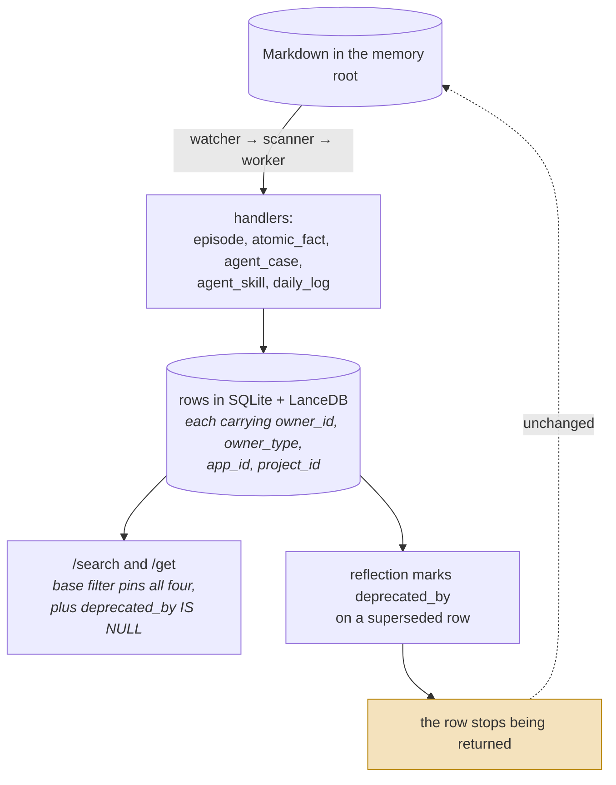
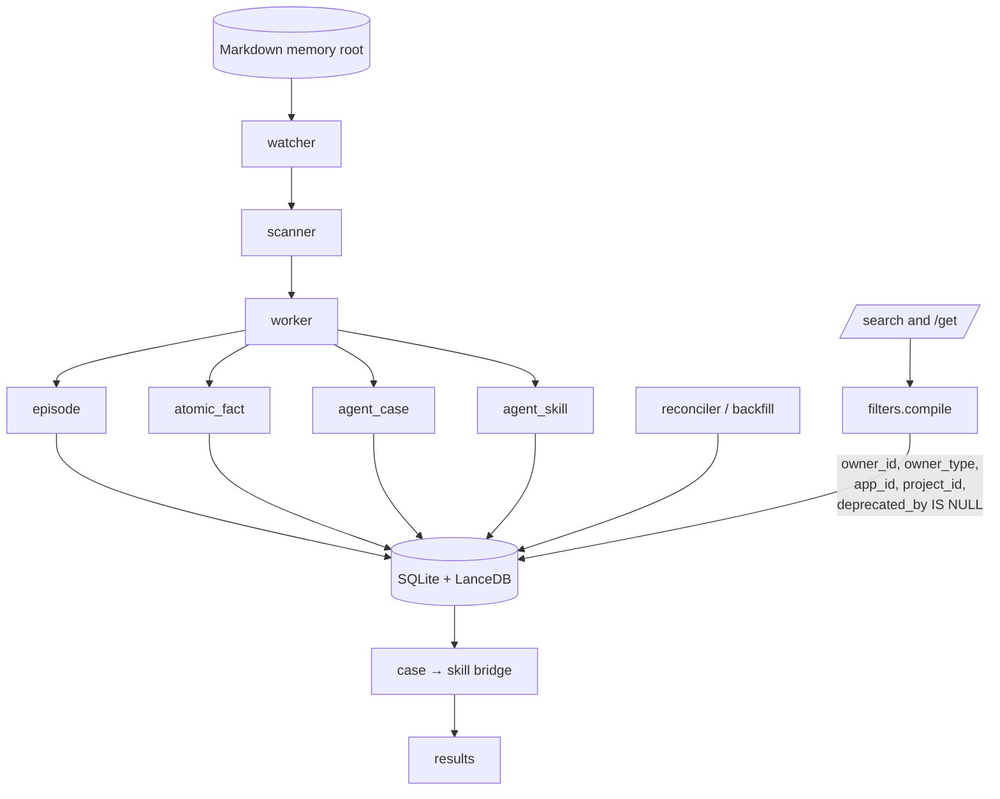

## 1. Executive Summary

EverOS is a local-first memory runtime whose canonical store is **Markdown on
disk**, with SQLite and LanceDB indexes derived from it. Around that sits a
*cascade*: a filesystem watcher, a scanner, a worker and a reconciler that read
the Markdown root and produce typed derived rows — episodes, atomic facts, agent
cases and agent skills, one handler apiece.

The Cases/Skills split is the design it is known for and it is a real one. An
agent case records a trajectory (a task intent and the approach taken); a skill
is what repetition distils out of cases; and the search layer carries a
case-to-skill bridge so the two are reachable from one query. That is the shape
[Acontext](../acontext/) and [Voyager](../voyager/) each hold half of, in one
system.

The strongest thing in the code is duller and more valuable: **scope**. Every
read compiles through one function whose base filter pins four keys —
`owner_id`, `owner_type`, `app_id`, `project_id` — with a comment stating why
("omitting it would let a query bleed across spaces"), and both `/search` and
`/get` share that path. It is then tested end to end: two owners, the same query
string, and `assert c_ids.isdisjoint(m_ids)` with a positive control that each
side still sees its own rows. That combination — one compile path, four keys, an
e2e disjointness assertion — is the most thoroughly enforced scope model in this
atlas.

Correction is the weak axis, in the shape this atlas keeps finding. Episodes and
atomic facts carry a `deprecated_by` column, the read filter appends
`deprecated_by IS NULL`, and superseded rows drop out of retrieval. But the
pointer is on the *row*, not the value, and the Markdown that produced it stays
on disk under a watcher — so a deprecated fact whose source file is touched
again is re-derived, and nothing consults the deprecation.

## 2. Mental Model

Markdown is the truth; everything else is a projection. A file lands in the
memory root, the watcher notices, the scanner queues it, and the worker runs the
handlers that turn it into typed rows.

The derived types are the model:

- **Episode** — a stretch of recorded interaction.
- **Atomic fact** — a single extracted claim (`cascade/handlers/atomic_fact.py`).
- **Agent case** — a trajectory: `task_intent` plus the `approach` taken.
- **Agent skill** — the reusable pattern distilled from repeated cases.
- **Daily log** — a time-bucketed base handler.



The dotted edge back to the top is the gap. Deprecation reaches the *rows* and
the Markdown that produced them is untouched — so the watcher can re-ingest a
deprecated claim from a file that was never edited.

Two states, and they are about validity rather than belief: a row is current or
it is deprecated. Nothing is a candidate, nothing is verified, nothing is
rejected. `confidence` appears on some derived rows as a number the extractor
assigned and nothing revises.

Control is **background-managed**. The agent does not decide what to remember;
the cascade derives from whatever Markdown exists. That makes the file tree the
real write surface, which is a coherent local-first position and means "forget
that" is a question about files as much as about rows.

## 3. Architecture

Python, Apache 2.0, ~645 source files with ~13,800 lines in the memory package
alone. Active — the pinned commit is dated 29 July 2026, the day it was read.



`memory/` holds `cascade/` (orchestrator, watcher, scanner, worker, reconciler,
registry, backfill, handlers), `extract/`, `search/`, `get/`, `reflection/`,
`strategies/`, `prompt_slots/`, `events.py`, `models.py` and
`_partition_locks.py`. Persistence adapters live under
`infra/persistence/lancedb/repos/`.

The orchestrator's docstring is worth noting for its engineering discipline: one
instance per process, constructed by the lifespan provider, dependency-injected
tokenizer and memory-root "so tests can swap them without monkey-patching
module-level singletons", and a `cascade sync` CLI path that calls `drain_once`
with no background tasks.

### Deployment and ergonomics

- **What has to run:** the process. SQLite and LanceDB are embedded; there is no
  server to stand up beyond EverOS itself.
- **Local and offline:** the storage and search paths are local. Extraction and
  reflection want a model.
- **Hand-repairable: unusually so.** The canonical store is Markdown you can edit
  in any editor, and the indexes are derived — so the repair story is "fix the
  file and let the cascade re-derive", which is the property
  [Basic Memory](../basic-memory/) is in this atlas for.
- `cascade sync` gives a one-shot drain, so the system is usable without leaving
  a watcher running.

## 4. Essential Implementation Paths

**Cascade.** `memory/cascade/orchestrator.py` wires `watcher.py`, `scanner.py`
and `worker.py`; `reconciler.py` and `_backfill.py` handle catch-up;
`registry.py` maps a type to a handler.

**Handlers.** `memory/cascade/handlers/` — `atomic_fact.py`, `agent_case.py`,
`agent_skill.py`, `_daily_log_base.py`, over `base.py` and `_common.py`.

**The read path, and the report's headline.** `memory/search/filters.py` — one
compile function shared by `/search` and `/get`, whose base list is

```python
base = [
    f"owner_id = '{_escape_str(owner_id)}'",
    f"owner_type = '{owner_type}'",
    f"app_id = '{_escape_str(app_id)}'",
    f"project_id = '{_escape_str(project_id)}'",
]
if owner_type == "user":
    base.append("deprecated_by IS NULL")
```

with the comment that pinning app and project "is what isolates one space's rows
from another — omitting it would let a query bleed across spaces".

**Supersession.** `deprecated_by` is set by reflection and read by the filter
above. `infra/persistence/lancedb/repos/episode.py` excludes superseded episodes
from counts and keeps "stale (superseded) memcell references" away from the
extractor.

**Deletion.** `service/knowledge.py:503` — `delete_document`, at the document
level rather than the derived-row level.

**Tests.** ~1,988 test functions, including `tests/e2e/test_search_endpoint_e2e.py`.

## 5. Memory Data Model

Four scope columns on every row, and they are the model's best feature.
`owner_id` and `owner_type` separate a user's memory from an agent's;
`app_id` and `project_id` partition within that. All four are applied, not
merely stored, and the comment in the compile path shows the author knew which
failure they were closing.

`deprecated_by` is the correction field, present on episode and atomic-fact
tables and absent from agent tables — a distinction the code states explicitly.
It points at whatever replaced the row.

What is missing is what this atlas usually finds missing: no validity interval
(so not bi-temporal), no provenance chain from a derived row back to the
Markdown span that produced it beyond the document reference, no trust state, and
`confidence` as a write-once number.

**No tombstone.** `deprecated_by` is supersession, keyed on the row — the
definition this atlas uses excludes exactly that. Deprecate an atomic fact and
the Markdown that produced it remains in the watched tree; touch that file and
the cascade re-derives, with nothing consulting the deprecation. That is the
structural version of the re-assertion failure: the correction lives in the
projection and the evidence lives in the source, and the source is what the
pipeline reads.

## 6. Retrieval Mechanics

Keyword and dense search over LanceDB, with the filter compiled once for both
`/search` and `/get`. The **case-to-skill bridge** is the distinctive part — a
query that matches a case can surface the skill distilled from it, which is what
makes the Cases/Skills split useful rather than merely tidy.

The single shared compile path is worth calling out as a pattern in itself. Most
scope leaks in this atlas come from a second read path that forgot a predicate;
funnelling every query through one function that always appends the base filter
makes that class of bug hard to write.

Failure modes: the scope filter is string-interpolated with an `_escape_str`
helper rather than parameterised, which puts the correctness of the isolation on
that escaper; and `deprecated_by IS NULL` is applied only when
`owner_type == "user"`, so an agent-owned row has no supersession semantics at
all.

## 7. Write Mechanics

Writes are **derived, not asserted**. Nothing calls "remember this"; the cascade
reads Markdown and produces rows. So the write path's cost and correctness are
the handlers', and the human's real write surface is a text editor.

Extraction is per-handler and model-backed. There is no deduplication visible at
the cascade level; reflection is where supersession is decided.

`_partition_locks.py` exists, so concurrent cascade work is partitioned rather
than serialised — a sign the authors expected real throughput.

### Operational cost

- **The agent never blocks on a write**; the cascade is out-of-band by
  construction.
- **Lag before a memory is retrievable** is watcher latency plus a worker drain
  plus extraction, and it is not stated in configuration. `cascade sync` makes
  the lag explicit when you want determinism.
- **A backfill and a reconciler both exist**, so the store can be rebuilt from
  Markdown — which means a re-derivation pass over the whole corpus is a
  supported operation and its token cost scales with the tree.
- **On the read path** nothing bounds injection; results are the caller's to
  budget.

## 8. Agent Integration

A Python library, a service exposing `/search` and `/get`, and a `cascade sync`
CLI. Memory is a store the application queries rather than a tool the model
calls, and the Markdown root is the integration point for anything that can
write a file — which is the local-first bet: any tool that emits notes feeds the
same memory.

## 9. Reliability, Safety, and Trust

**Scope is the strength and it is properly done.** Four keys, one compile path, a
comment naming the failure, and an end-to-end test proving it. `scope_enforced`
without qualification.

**And the isolation is asserted negatively.**
`tests/e2e/test_search_endpoint_e2e.py` seeds episodes for two owners, issues the
same query as each, and asserts `c_ids.isdisjoint(m_ids)` together with
`all(ep["user_id"] == …)` on both sides — a denial plus the positive control that
proves the denial is targeted rather than a blanket empty result. A second test
does the same for two *agent* owners sharing a hot keyword. That earns
`negative_eval`, and makes EverOS the fifth system in the atlas to carry it —
again from access-control discipline rather than from memory research.

**Correction reaches the read path and stops there.** A deprecated row is
excluded from results, which is more than many systems here manage. What is
absent is any record keyed on the *value*, and any guard on re-derivation: the
Markdown source survives, the watcher watches it, and a deprecated claim returns
if its file is rewritten. For a system whose canonical store is the file tree,
"forget this" has to mean editing the tree, and nothing in the memory layer says
so.

**No audit of memory mutations** was found: the cascade logs and the reconciler
reconciles, but there is no append-only record of what changed in the store.
**No human review surface** for memory content.

## 10. Tests, Evals, and Benchmarks

**~1,988 test functions**, which is a serious suite for a project this young, and
the e2e layer tests the thing that matters: endpoint behaviour under different
owners, `owner_id`/`owner_type` isolation, and the case-to-skill bridge in
isolation from dense recall.

A `benchmarks/` directory ships. No committed scored results were located in this
pass, so nothing here rests on published numbers.

**What I would want:** a test that a deprecated atomic fact does not reappear
after its source Markdown is touched — which is the failure the architecture
invites and the one the current suite does not probe.

## 11. For Your Own Build

### Steal

- **One compile path for every read, with the scope keys in its base.** This is
  the cheapest structural defence against a scope leak in the atlas: a second
  query that forgets a predicate cannot exist if there is only one place
  predicates are assembled.
- **Say why the filter is there, in the filter.** "Omitting it would let a query
  bleed across spaces" is the comment that stops someone deleting the line during
  a refactor.
- **Assert isolation with a positive control.** `isdisjoint` plus "and each side
  still sees its own" is what distinguishes working isolation from a broken query
  returning nothing.
- **Markdown canonical, indexes derived.** Repair means editing a file and
  letting the cascade re-run, which is a far better failure story than a corrupt
  binary index.
- **Split cases from skills, and bridge them at query time.** Trajectories and
  reusable patterns have different lifetimes and different retrieval needs; one
  bridge keeps them reachable together.

### Avoid

- **Marking a correction on the projection while the source stays watched.** If
  a deprecated row can be re-derived from an unchanged file, the deprecation is a
  filter, not a correction. Either record the rejection where the pipeline will
  see it, or make the source edit part of the deprecation.
- **Supersession semantics that apply to only some owner types.**
  `deprecated_by IS NULL` guarded by `owner_type == "user"` means agent-owned
  memory has no correction path at all, which is a surprising asymmetry to
  discover from a filter.
- **String-interpolated scope predicates.** An escaper is one review away from a
  gap; a parameterised query is not.

### Fit

This suits someone building a personal or small-team assistant who wants the
memory to live in files they own, and who values being able to open the store in
an editor. The scope model is good enough to build a multi-user product on, which
is unusual for a local-first design, and the Cases/Skills split is the right
abstraction if the agent is meant to get better at repeated tasks rather than
merely remember facts.

Walk away if your correction requirement is strong. A deprecated fact is filtered
from reads and re-derivable from the source; making "forget this" durable means
reaching into the Markdown tree, and the memory layer will not do it for you.

## 12. Open Questions

- **Does anything guard re-derivation of a deprecated row?** The cascade reads
  Markdown and the deprecation lives in the index; no path was found that
  consults `deprecated_by` on the write side.
- **Why is `deprecated_by IS NULL` scoped to `owner_type == "user"`?** The
  comment says agent tables lack the column; whether agent memory is intended to
  be uncorrectable is not stated.
- **Is `_escape_str` sufficient for the filter path**, and is there a
  parameterised alternative in LanceDB the project chose not to use?
- **What do the shipped benchmarks measure**, and are results published
  anywhere? The directory exists; scored artifacts were not found.
- **How does the case-to-skill distillation decide a skill exists?** The handler
  boundary was read; the promotion criterion was not traced.

## Appendix: File Index

**Cascade**

- `src/everos/memory/cascade/orchestrator.py`, `watcher.py`, `scanner.py`,
  `worker.py`, `reconciler.py`, `registry.py`, `_backfill.py`
- `src/everos/memory/cascade/handlers/` — `atomic_fact.py`, `agent_case.py`,
  `agent_skill.py`, `_daily_log_base.py`, `base.py`, `_common.py`

**Read path**

- `src/everos/memory/search/filters.py` — the shared compile path
- `src/everos/memory/search/`, `src/everos/memory/get/`

**Correction**

- `src/everos/memory/reflection/`
- `src/everos/infra/persistence/lancedb/repos/episode.py`

**Service**

- `src/everos/service/knowledge.py` — `delete_document` (503)

**Model and concurrency**

- `src/everos/memory/models.py`, `events.py`, `_partition_locks.py`

**Tests**

- `tests/e2e/test_search_endpoint_e2e.py` — owner isolation, case→skill bridge

## History

**2026-07-29** — [`4256419595f63fe307147dc19e379477cecdc44f`](https://github.com/EverMind-AI/EverOS/commit/4256419595f63fe307147dc19e379477cecdc44f) — first reading.
