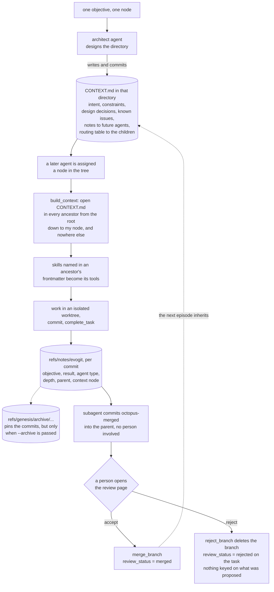
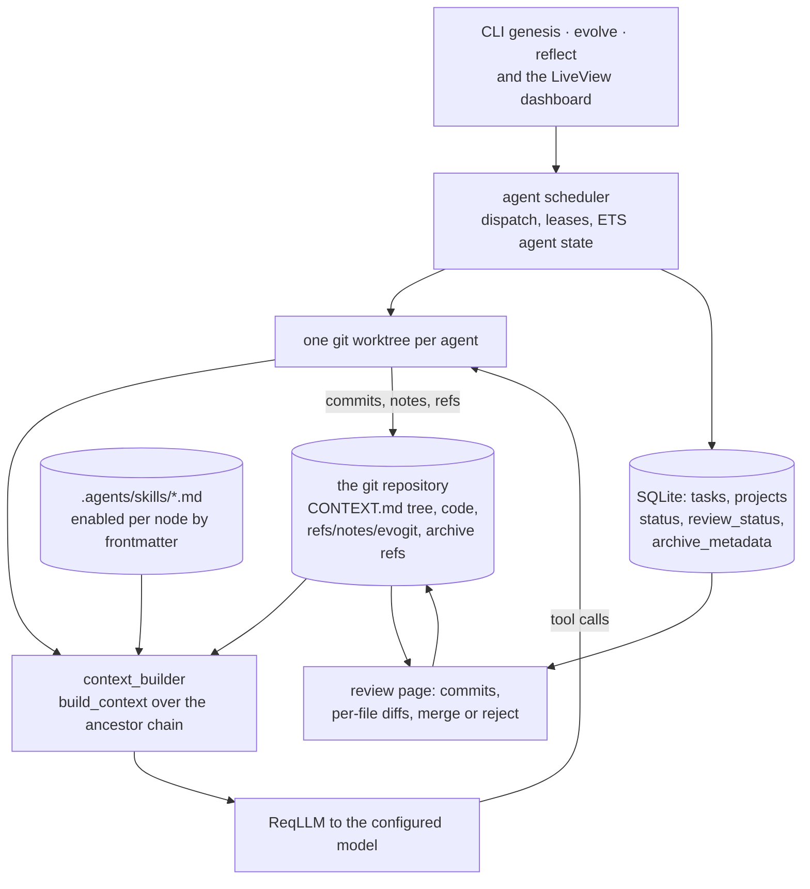

## 1. Executive Summary

EvoX Genesis is an Elixir system for **long-horizon autonomous software
evolution** — AGPL-3.0, 6,529 commits since 17 April 2024 by four authors,
version 0.12.5, 90,871 lines of Elixir under `apps/` beside 82,581 lines of
tests in 174 files holding 4,655 cases, with a Tauri desktop shell and a Nix
flake. The screen found no auto-run surface, one build-time execution point in
the desktop crate and two Rust manifests inside the seven-day cooldown;
nothing was installed or run, and the read was made from a full clone. Its
paper is [arXiv:2608.10450](https://arxiv.org/abs/2608.10450), *Persistent
Recursive Worlds Enable Autonomous Software Evolution* (Huang, Liang, Zheng
and Cheng, 11 August 2026, revised 16 August), whose abstract states the
premise this report is about: most agentic systems *"preserve continuity
through persistent sessions, memories, managers or shared context"*, and
Genesis instead *"makes the software project persistent while allowing local
agents to remain finite-lived."*

**The memory is the directory tree, and the system says so in its own
prompt.** Every directory carries a `CONTEXT.md`, and the architect agent is
told that *"the CONTEXT.md files you create are the permanent architectural
memory of the codebase"* and that *"there is no other place to encode
architectural intent — if you don't write it in CONTEXT.md, future agents
won't know it"* (`apps/evo_git/lib/evo_git/agents/architect.ex:67-68`). The
extractor agent enumerates what belongs in one: intent, API surface,
constraints, design decisions, known issues, notes that *"prevent wasted
investigation"*, dependencies, test strategy, cross-references and status
(`agents/context_extractor.ex:44-60`). Those are claims about a codebase that
can be wrong, written by one agent for agents that do not yet exist, and the
repository holds 59 of them about itself.

**Retrieval is the path.** `ContextNode.hierarchy_nodes/3`
(`core/context_node.ex:110-146`) computes the chain of directories from the
repository root down to the agent's assigned node, and `build_context/2`
(`:161-230`) opens `CONTEXT.md` in each of those directories only, strips its
YAML frontmatter, truncates each to a configured byte cap and concatenates
them under a `# Context Tree` heading. A sibling subtree's file is never
opened. The same ancestor walk decides the tool surface: a skill defined once
in `.agents/skills/` is callable only where an ancestor's frontmatter names it
in a `skill:` list, inherited downward (`skills/context_integration.ex:1-9`).
That is one stored scope key — the file's own location — applied twice on the
read path, and it earns `scope_enforced`. The second mark is `human_review`:
a finished task leaves an agent branch, and the dashboard's review page shows
its commits and per-file diffs so a person can merge it or reject it, with the
outcome persisted on the task row. A `CONTEXT.md` edit is an ordinary file
change, so the memory is adjudicated in the same diff as the code.

Three findings sit against the design. **The retrieval function is
untested.** `build_context` occurs three times in the repository — its spec,
its definition, and one call site — and no test references it
(`rg -n 'build_context' apps --glob '*.ex' --glob '*.exs'`), in a tree with
4,655 committed cases; its caller answers an error by substituting the bare
string `"Current Path: '<node>'."` (`agent/context_builder.ex:22-24`), so an
agent whose context tree failed to assemble runs without one and is told
nothing. **Rejection records nothing.** `Review.reject_branch/2`
(`review.ex:476-481`) deletes the branch; the task row keeps
`review_status: :rejected`, which is keyed on the run rather than on what was
refused, and no path consults it before an agent proposes the same change
again. **The episode archive is opt-in.** `complete_task` writes the git note
whenever a base commit exists, but `archive` defaults to `false`
(`agent/tools/complete_task.ex:133`), so the archive refs that protect an
episode's commits from garbage collection — and the record that reaches the
task row — exist only for runs started with `--archive` or the dashboard's
checkbox.

## 2. Mental Model

A memory is **a file that inherits downward**. Its subject is the directory it
sits in; its audience is whichever agent is later assigned to that directory
or one beneath it; its scope is its own position, because assembly walks
ancestors and nothing else.

An agent is an episode. It spawns with an objective and a node, receives the
ancestor chain as text, works in its own git worktree, commits, and
disappears; its subagents each get a child node, a fresh context and their own
worktree, and their commits are merged back into the parent automatically. The
paper's claim and the README's are the same one: continuity lives in the tree
and the commit graph rather than in a session.

Knowledge stops being current the way code does — someone rewrites the file
and commits. There is no status to set, no supersession to record and no
expiry; a stale `CONTEXT.md` is simply wrong until an agent or a person
corrects it, and the only trace of the correction is the diff.



## 3. Architecture

An Elixir umbrella with two applications. `:evo_git` (50,935 lines) is the
runtime: agents, the scheduler, the git adapter, the sandbox, the CLI.
`:evo_dash` (40,106 lines) is a Phoenix LiveView dashboard: projects, tasks,
the review page and a chat entry point to a repo-less self-reflective agent.
Three Mix releases ship — the pair, a desktop build bundled into a Tauri
shell, and a headless `evo_git`-only daemon for SSH remote development.

The parts this report reads:

- `core/context_node.ex` — the spatial dimension: path normalisation, the
  ancestor walk, and the assembly of the context tree into prompt text.
- `core/phylo_graph_node.ex` — the temporal dimension: a struct over a base
  and current commit, with merge-base, commit and merge helpers.
- `skills/` and `skills.ex` — markdown tool definitions, their hierarchical
  enablement through `CONTEXT.md` frontmatter, and sandboxed execution.
- `agents/` — architect, manager, executor, investigator, context extractor,
  skill extractor, genesis planner, task scheduler, self-reflective, custom;
  each a system prompt plus a tool list.
- `agent/tools/complete_task.ex` — the git note, the archive refs and the
  episode record; `agent/tools/search_history.ex` — regex over messages and
  notes; `agent/context_builder.ex` — the one caller of `build_context/2`.
- `review.ex` and the dashboard's `review_live.ex` — diffs, merge, reject.
- `store.ex` and `store/` — the SQLite `tasks` and `projects` tables.
- `agent_scheduler/` — dispatch, leases, agent state and the ETS tables.
- `sandbox/` — bubblewrap on Linux, a macOS profile, and a no-op.



### Deployment and ergonomics

- **What has to run:** Erlang/OTP and Elixir, git, and an API key for a model
  provider; ripgrep and git are vendored in the Nix build. SQLite is embedded
  through `xqlite`. The dashboard and the desktop shell are optional.
- **Fully local and offline:** the store is, the model is not — every agent
  turn is a provider call.
- **Hand-repairable:** entirely. The memory is Markdown in the repository, the
  episode metadata is `git notes --ref=evogit`, and the task database is one
  SQLite file with JSON columns rather than Erlang term blobs.
- **Install:** a Mix release, a Nix flake (`nix run`), or the desktop bundle.

## 4. Essential Implementation Paths

- **Assemble the memory.** `ContextNode.hierarchy_nodes/3`
  (`core/context_node.ex:110-146`) rejects an absolute path and any path
  starting with `..`, then builds `["./", "./a", "./a/b"]` for the target
  node. `build_context/2` (`:161-230`) keeps only entries that are
  directories on disk, reads `CONTEXT.md` in each, calls
  `Skills.strip_front_matter/1`, truncates anything over
  `truncation.context_max_bytes` with `String.byte_slice/3` and a
  `Logger.warning`, and joins the results under `# Context Tree` followed by a
  location block naming the worktree and the assigned node.
- **Reach it from an agent.** `ContextBuilder.build_dynamic_context/1`
  (`agent/context_builder.ex:21-25`) is the only caller, and on `{:error, _}`
  it returns `"Current Path: '#{state.node_path}'."` in place of the tree.
- **Scope the tools.** `Skills.ContextIntegration` (`skills/context_integration.ex`)
  reads the `skill:` list from each ancestor's frontmatter
  (`:26-34`, `:57-63`), unions them from root to leaf with
  `hierarchical_skill_names/2` (`:91-104`), and only those skills
  are converted into LLM tool schemas; `enable_skill` creates a `CONTEXT.md`
  with just frontmatter when none exists (`:303-320`), and
  `remove_skill_from_all_contexts` strips a name from every file.
- **Write the memory.** No dedicated function: an agent edits `CONTEXT.md`
  with the ordinary file tools and commits. The architect and context
  extractor prompts are what direct it (`agents/architect.ex:51-99`,
  `agents/context_extractor.ex:44-72`).
- **Record the episode.** `CompleteTask.complete/4`
  (`agent/tools/complete_task.ex:128-190`) derives the branch name, and when a
  base commit is present calls `add_metadata_note/3` (`:200-217`) to attach a
  JSON note on `--ref=evogit` with the agent id, base and final commit,
  parent, depth, objective, result, usage, timestamp, agent type and context
  node path; a conflict falls back to a forced overwrite (`:220-233`).
- **Archive an episode.** Only when `archive` is true — it defaults to false
  (`:133`) and is set by the `--archive` CLI flag or the dashboard's
  checkbox. `write_archive_refs/8` (`:284-341`) writes
  `refs/genesis/archive/T<task>-A<agent>-start` and `-final` to protect both
  commits from gc, then puts a full episode record into the
  `:evogit_archive_records` ETS table.
- **Persist the run.** At successful root completion the scheduler collects
  that task's records (`agent_scheduler/lifecycle.ex:247-257`), injects them
  into the result and clears them; the task registry writes them to the task
  row's `archive_metadata` column (`task_registry.ex:891`).
- **Search the past.** `search_history` (`agent/tools/search_history.ex`) runs
  a regex over commit messages and, by default, the `evogit` notes ref,
  capped at 100 commits and a byte budget; a subagent can be spawned at a
  historical commit to read the tree as it stood.
- **Adjudicate.** `Review.load_review_metadata/2`, `list_commits_from_shas/3`
  and `load_file_diff/5` feed the page; `merge_branch/2,3` merges and restores
  the original branch on conflict; `reject_branch/2` (`review.ex:476-481`)
  deletes the branch; the LiveView then calls `set_review_status/3`
  (`review_live.ex:767-781`).

## 5. Memory Data Model

**A `CONTEXT.md`.** Optional YAML frontmatter — in practice a `skill:` list —
and a Markdown body with no required shape. The extractor's prompt proposes
Intent, API Surface, Constraints, Design Decisions, Known Issues, Notes for
Agents, Dependencies, Test Strategy, See Also and Status, and says explicitly
that not all apply and the goal is *"to capture knowledge that future agents
will need"*. There is no schema, no validator and no status field: `rg -n -i
'status|state' apps/evo_git/lib/evo_git/core/context_node.ex` returns nothing.

**A `ContextNode`** (`core/context_node.ex:17-18`) is `path`, `repo` and a
`repo_id` defaulting to `"primary"` for multi-repository runs. It is a
coordinate, not a record — the type is resolved at read time because the path
may not exist yet.

**A git note** on `refs/notes/evogit`, one per commit: `agent_id`,
`base_commit`, `final_commit`, `parent_id`, `depth`, `objective`, `result`,
`usage`, `completed_at`, `agent_type`, `context_node_path`.

**An archive record** adds the branch name, compression count, repository
identity, start time, the full LLM settings, the agent settings and the
foreign repositories, and reaches `tasks.archive_metadata` as JSON.

**A task row** (`store/schema.ex:36-57`): `id`, `type`, `status`, `opts`,
`started_at`, `finished_at`, `logs`, `result`, `review_status`, `usage`,
`agent_count`, `base_sha`, `commit_sha`, `archive_metadata`,
`lease_expires_at`, `model_id`, `project_path`, `branch_name`.

**Temporal:** commit time and the note's `completed_at`, both record times.
No validity interval — `rg -n 'valid_from|valid_until|valid_at|as_of'` over
`apps/evo_git/lib` returns only an unrelated `valid_atoms` helper.
`bitemporal` withheld.

**Trust:** none on a memory. `trust_state` withheld.

**Scoping:** the file's directory. `scope_enforced` earned.

**Tombstone:** none. `reject_branch` deletes; `review_status` keys on the
task. Withheld.

## 6. Retrieval Mechanics

Retrieval is **structural and unranked**, and that is the design rather than a
gap. The query is the agent's node path; the result is every ancestor's
`CONTEXT.md` in root-to-leaf order. There is no scoring, no recency, no index
and no embedding — `rg -n -i 'embedding|vector|cosine|faiss' apps/evo_git/lib
--glob '*.ex'` returns nothing but an unrelated comment about embedding a
string in TOML. What makes it work is the routing table each file carries: a
parent's `CONTEXT.md` names its children and what each holds, so an agent can
delegate to the right subtree without opening it, which is the property that
lets a fixed-size prompt address an arbitrarily deep repository.

The second surface is `search_history`, a regex over commit subjects, bodies
and the `evogit` notes ref from a given ref, bounded to 100 commits and a byte
budget by default. Because the notes carry each episode's objective and
result, this is how an agent asks *why was this done* rather than *what does
this directory contain*. A third is temporal: a subagent can be spawned at a
historical commit and will assemble that commit's context tree.

**Failure modes.** Each ancestor is truncated independently to
`context_max_bytes`, with a log line and a `... [Content Truncated] ...`
marker in the text, so a long root file can crowd out nothing but itself, and
a deep node pays for every ancestor above it. A path that fails validation
yields no tree at all rather than a partial one. And the assembled text is
whatever the last author wrote: a `CONTEXT.md` that is confidently wrong is
indistinguishable, at read time, from one that is right.

## 7. Write Mechanics

**Nothing extracts.** There is no consolidation pass, no summariser and no
scheduled rewrite; a memory changes because an agent was told to change it and
committed. The two prompts that drive it are the architect's, which frames
`CONTEXT.md` as the only place architectural intent can live, and the context
extractor's, which is a read-type agent whose whole job is establishing or
refreshing those files over an existing codebase.

**Concurrency** is solved by isolation rather than by locking: each agent gets
its own worktree, and children's commits return to the parent through an
octopus merge (`agent/subagent_processing.ex:486-497`). A conflict on the
parent merge surfaces as `{:conflict, node, files}` from
`PhyloGraphNode.merge/2`; on the review path `merge_branch/3` restores the
original branch and reports the conflicted files without mutating HEAD, which
`review_test.exs` asserts directly.

**Correction** is a rewrite. Because the file and the code it describes travel
in one commit, a diff that changes behaviour and a diff that changes the
description of that behaviour are reviewed together — the strongest property
in this design, and the reason the memory does not drift from the artifact the
way an external store does.

**What is not recorded.** A rejected branch's content is unreachable after
`reject_branch` unless an archive ref happens to pin it, and no record keyed
on what it proposed exists anywhere, so nothing prevents the next agent
proposing it again.

### Operational cost

- A read is a handful of `File.read` calls, one per ancestor directory.
- A write is a file write and a commit; a completion adds one `git notes` call
  and, when archiving, two `update-ref` calls.
- No background pass touches the memory; the scheduler's lease and heartbeat
  work on tasks.

## 8. Agent Integration

The model reaches memory through the prompt rather than through a tool: the
context tree is assembled into the system message every turn, so there is no
recall call to skip. What the model does call are the file and shell tools,
`search_history`, the skills its node enables, and `subagent_*` tools that
spawn children at named nodes. Shell commands pass through a sandbox —
bubblewrap on Linux with a deny list over credential directories, a profile on
macOS — and through an approval gate that, in `:chat` mode, holds a command
until a person approves it in the `/help` chat and fails closed on a denial, a
timeout or an unavailable approval service (`command_shell.ex:34-54`).

The human surfaces are the dashboard's project and task pages, the review page
with its diffs, and the chat. The CLI covers the same ground headlessly, and a
`genesis_remote` release runs the runtime over SSH with the dashboard local.

## 9. Reliability, Safety, and Trust

**Scope — awarded.** The scope key is the file's own position, which cannot
drift from the thing it scopes, and it is applied twice: `build_context/2`
opens only ancestor directories, and the skill union is taken over the same
chain. A sibling's knowledge is not filtered out of a result — it is never
read, so there is no ranking stage where it could leak.

**Human review — awarded.** A person reads the branch's commits and per-file
diffs and merges or rejects, and the outcome is persisted on the task row.
`CONTEXT.md` edits are ordinary file changes, so this adjudicates memory
content and not only code. Within a run, subagent merges are automatic and no
person is consulted.

**Tombstone — withheld, and the near-miss is instructive.** Genesis has the
vocabulary of a rejection: a `review_status` of `:rejected`, an explicit
reject action, and a durable task row that survives it with the base and final
shas. What it does not have is a record keyed on what was proposed.
`reject_branch/2` deletes the branch and returns `:ok`; the reason a person
rejected is not captured at all; and no path consults the rejected set before
an agent proposes again. The archive refs would have preserved the commits —
they exist precisely to defeat garbage collection — but they are written at
completion, not at rejection, and only when archiving is on.

**Audit log — withheld, on the same line this atlas drew for craft.** The
`evogit` notes ref is a real, durable, system-owned record: one JSON note per
commit carrying the objective, the result, the agent type, the depth, the
parent and the context node, searchable through `search_history`, plus an
episode record on the task row when archiving is on. It records **agent
episodes**, not mutations of the memory — nothing marks a `CONTEXT.md` as
having been written, promoted or corrected, and the note is attached to the
commit whether that commit touched a memory or a source file. Two mechanical
caveats sit beside the definitional one: a note conflict falls back to a
forced overwrite rather than an append, and the archive half is off by
default.

**Trust state — withheld.** A `CONTEXT.md` has no status field and no reader
that would filter on one. The discrete vocabulary in the system —
`:open`, `:merged`, `:rejected`, `:continued`, `:ignored`, `:no_changes` —
lives on the task row and describes the run.

**Bitemporal — withheld.** Commit time and `completed_at` are record times.
Spawning an agent at a historical commit reads the tree as it was recorded
then, which is one time axis navigated, not two tracked.

**Negative evaluation — withheld.** The suite's `refute` assertions are about
prompt assembly — that a section is absent from a built instruction, that
frontmatter does not survive stripping — and about CRUD round-trips, that a
disabled skill is gone from the list. None asserts that a stored memory must
stay out of a populated retrieval, which is the case this mark asks for, and
the natural one — that a sibling's `CONTEXT.md` is absent from an assembled
tree while the ancestors' are present — is not written because
`build_context/2` has no test at all.

**The gap worth naming.** In a repository with 4,655 committed cases, the
function that turns the memory into what the model sees is exercised by none
of them, and its caller swallows the failure into a one-line string. A
`CONTEXT.md` in a directory that git reports as ignored, a node path that
arrives with a leading `..`, or a repository root that moved all produce an
agent that works with no architectural memory and no indication that it is
missing.

## 10. Tests, Evals, and Benchmarks

4,655 cases in 174 test files, 82,581 lines. On the paths this report reads:
`core/context_node_test.exs` covers `hierarchy_nodes/2` shape, the absolute
and `..` rejections and the whole of `normalize_relpath` — and stops before
`build_context/2`. `skills_hierarchical_test.exs` is the fullest memory-side
suite: frontmatter extraction, stripping, `skill_names_at_dir`, which nodes
enable a skill and which do not, enable and disable including
`already_enabled_above`, removal across every file, and collection from root
to a nested node. `review_test.exs` (26) covers diff loading, commit listing,
merge into the default and a named target, conflict detection that never
mutates HEAD, and metadata recovery after the branch is deleted.
`command_approval_test.exs` (14) covers the approval gate.
`application_test.exs` asserts the ETS tables exist at boot.

No benchmark is committed. The paper reports the headline runs — a
roughly 250,000-line Rust implementation of a C compiler over about 120 hours
across more than a thousand archived agent episodes for about US$44, passing
the c-testsuite and most LLVM and Csmith tests, and thirteen MESA modules
reimplemented from Fortran to Rust with median speedups from 1.55 to 6.87 —
and the README repeats them with a per-run cost. None of it is reproducible
from this tree: there is no harness, no fixture and no recorded result under
version control, and the claims are about software the system built rather
than about the memory this report describes.

## 11. For Your Own Build

### Steal

- **Let position be the scope key.** A file in a directory needs no `scope`
  column, cannot disagree with the thing it scopes, and is re-scoped by `git
  mv`. Assembly walks ancestors; there is nothing to keep in sync.
- **Put the routing table in the parent.** Naming each child and what it holds
  is what lets an agent delegate without reading the subtree, and it is the
  reason a fixed prompt can address an arbitrarily deep repository.
- **Keep the knowledge in the same commit as the code.** One diff carries the
  behaviour change and the description of it, and one review covers both.
- **Enable tools where the knowledge lives.** Reusing the memory file's
  frontmatter to decide which skills exist at a node means the tool surface
  and the context inherit together.
- **Say in the prompt that the file is the only channel.** *"If you don't
  write it in CONTEXT.md, future agents won't know it"* is a better
  instruction than a schema, because it names the consequence.

### Avoid

- **Leaving the assembly function untested.** The path from the store to the
  prompt is the one place a memory system silently becomes no memory system,
  and a caller that degrades to a bare string makes the failure invisible.
- **Rejecting by deleting.** A rejected proposal that leaves no record keyed
  on its content is one an agent may make again on the next run, and the
  reviewer's reason is lost with the branch.
- **Making the durable half of the record opt-in.** A default of `false` on
  the flag that protects an episode's commits means the ordinary run keeps a
  note pointing at commits nothing pins.

### Fit

Genesis fits a team that wants a codebase to keep developing across many
model episodes, and that is willing to treat the repository as the only state.
Its memory model is this atlas's clearest case for co-locating knowledge
with the artifact it describes, and it is not a conversational memory: it holds architecture rather than facts about a user, has no notion of
who said something, and forgets only when someone rewrites a file. A team that
needs a memory to be queried by content rather than by position will find no
index here, which is deliberate.

## 12. Open Questions

- **Will `build_context/2` get a test?** One case with a root, a child and a
  sibling would pin the property the whole design rests on, and would be the
  `negative_eval` this report could not award.
- **Should a rejection write a note?** The `evogit` notes ref, the archive
  refs and the reviewer's presence are all in place; a note on the rejected
  head with the reason would make refusals searchable through the tool that
  searches notes.
- **What happens to a `CONTEXT.md` when a directory is deleted or moved?**
  Nothing in the tree reconciles a stale routing-table entry in the parent
  against a child that has gone.
- **Does anything bound total assembled context?** Each ancestor is truncated
  independently, so the cost of a deep node is the sum of the caps rather than
  a budget over the whole tree.

## Appendix: File Index

| Path | Lines | What it holds |
| --- | --- | --- |
| `apps/evo_git/lib/evo_git/core/context_node.ex` | 236 | `normalize_relpath`, `hierarchy_nodes/2,3` (110-146), `build_context/2` (161-230), `is_ignored?` |
| `apps/evo_git/lib/evo_git/core/phylo_graph_node.ex` | 143 | The commit-graph struct: `new`, `find_merge_base`, `add_and_commit`, `merge` |
| `apps/evo_git/lib/evo_git/agent/context_builder.ex` | — | `build_dynamic_context/1` (21-25), the only caller of `build_context/2` |
| `apps/evo_git/lib/evo_git/skills/context_integration.ex` | 431 | Frontmatter parsing, the ancestor union, enable, disable, remove-from-all |
| `apps/evo_git/lib/evo_git/skills/{executor,crud,skill}.ex` | 234, 246, 27 | Injection-safe positional substitution, sandboxed run, file management |
| `apps/evo_git/lib/evo_git/agents/architect.ex` | 258 | The prompt that names `CONTEXT.md` the permanent architectural memory (67-68) |
| `apps/evo_git/lib/evo_git/agents/context_extractor.ex` | 201 | The read-type agent that establishes or refreshes the tree |
| `apps/evo_git/lib/evo_git/agent/tools/complete_task.ex` | 370 | `complete/4` (128), `add_metadata_note/3` (200), `write_archive_refs/8` (284) |
| `apps/evo_git/lib/evo_git/agent/tools/search_history.ex` | 189 | Regex over commit messages and the `evogit` notes ref |
| `apps/evo_git/lib/evo_git/review.ex` | 801 | Diffs, `merge_branch/2,3` (234, 289), `reject_branch/2` (476) |
| `apps/evo_git/lib/evo_git/store.ex`, `store/` | 1,310 + 1,074 | The SQLite GenServer, codec, schema (36-57), queries, disk-full classifier |
| `apps/evo_git/lib/evo_git/agent_scheduler/`, `task_registry.ex` | — | Dispatch, leases, ETS agent state, archive collection (891) |
| `apps/evo_git/lib/evo_git/sandbox/` | — | bubblewrap, the macOS profile, the no-op |
| `apps/evo_dash/lib/evo_dash_web/live/review_live.ex` | — | The review page; `set_review_status` after merge or reject (767-781) |
| `apps/evo_git/test/`, `apps/evo_dash/test/` | 82,581 in 174 files | 4,655 cases |
| `CONTEXT.md` × 59 | — | The system's own context tree |

**Searches recorded for the negative claims**

```sh
rg -n 'build_context' apps --glob '*.ex' --glob '*.exs'   # 3 hits: spec, definition, one caller; no test
rg -n -i 'embedding|vector|cosine|faiss' apps/evo_git/lib --glob '*.ex'  # none: retrieval is structural
rg -n 'valid_from|valid_until|valid_at|as_of' apps/evo_git/lib --glob '*.ex'  # none: no validity time
rg -n -i 'status|state' apps/evo_git/lib/evo_git/core/context_node.ex  # none: a memory has no status
rg -n -i 'tombstone|rejected_value' apps/evo_git/lib --glob '*.ex'  # none; the deny list found is the sandbox's
rg -n 'reject' apps/evo_git/lib/evo_git/review.ex  # reject_branch deletes the branch and records nothing
rg -n 'archive:' apps/evo_git/lib --glob '*.ex'   # the default is false at every layer
```

## History

**2026-09-08** — [`3b84f87a5455340dd7f09d405a42f19dc992600c`](https://github.com/EMI-Group/genesis/commit/3b84f87a5455340dd7f09d405a42f19dc992600c) — first reading, at the head of `main`, on a commit from the same day. Screened before anything was read: no auto-run surface, one build-time execution point in the Tauri crate, two Rust manifests inside the seven-day cooldown; nothing was installed or run, and the read was made from a full clone. Two marks, `scope_enforced` and `human_review`. The scope key is the memory file's own directory position, applied by the ancestor walk that assembles the prompt and again by the skill union over the same chain. `tombstone` and `audit_log` were each examined and withheld with the near-miss stated in section 9 — a rejection deletes the branch and keys its record on the run, and the `evogit` notes ref records agent episodes rather than memory mutations. The reading covers the context tree, the skills layer, the episode record, the review path and the task store; the scheduler's distribution and remote-node machinery, the sandbox implementations and the dashboard beyond the review page were treated as context. The paper's headline runs are reported as the authors' claims: no harness, fixture or result for them is committed to this tree.
