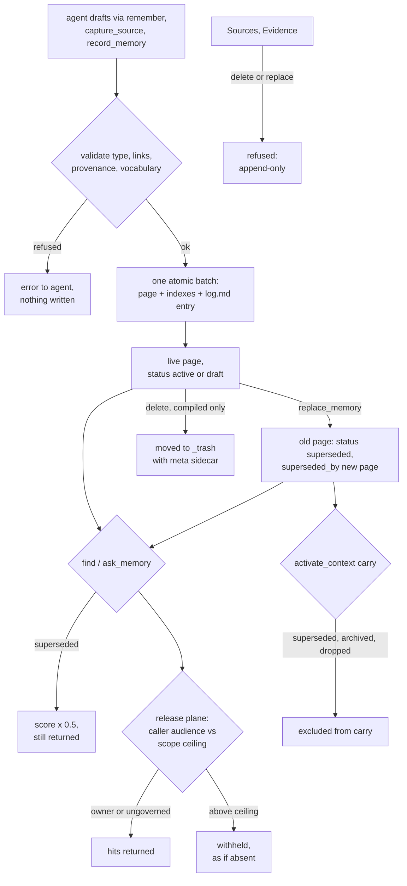

## 1. Executive Summary

Exomem is an MCP memory server over a Markdown or Obsidian vault the user
already owns. The agent writes typed pages — sources, evidence, compiled notes,
entities, records, plans — and the server indexes them for hybrid search and a
bounded working-memory packet. Notable is its governance: a per-principal
release plane decides every hit before it leaves, every write commits with its
log entry in one atomic batch, and supersession keeps both pages. Weak is
epistemics: a superseded conclusion is only halved in score, nothing marks a
memory as unconfirmed, and the agent holds every review verb.

The project was published as `kb_mcp` and renamed to exomem in release 0.2.0
on 1 July 2026 (`CHANGELOG.md`). `kb_mcp` imports and `KB_MCP_*` environment
variables remain supported aliases, and the CLI is still `kb`. The licence is
AGPL-3.0: running a modified copy as a network service obliges the operator to
publish the source.

The server calls no language model to write memory. Its own phrase is
*"Measures, never judges"* (`README.md`): search, extraction, embeddings, file
writes and graph checks are deterministic, and every conclusion is authored by
the client model through a typed tool. The vault stays readable and editable by
hand, with the SQLite sidecars treated as rebuildable projections of it.

The engineering is heavy, and most of it defends the boundary between the vault
and whoever reads it. 54,905 lines under `src/exomem/governance/` hold the
policy compiler, audience resolution, disclosure receipts and projection
stores for hosted cells. The memory model beside it is simpler: a page, its
frontmatter status, and a `supersedes`/`superseded_by` pair.

Three marks: `scope_enforced` on the release plane, `audit_log` on
`Knowledge Base/log.md`, and `negative_eval` on two read-path cases with
positive controls. Section 9 names the four withheld and the near-miss behind
each.

## 2. Mental Model

A memory is a Markdown page with YAML frontmatter under `Knowledge Base/`. Its
folder is derived from its type, and Sources are further placed by an open
`source_kind` and `domain` vocabulary. A page becomes memory when a governed
write commits it. There is no candidate stage: the agent drafts, the server
validates shape, links and provenance, and the page is live and searchable once
the batch lands.

**Two layers are append-only.** Sources and Evidence are raw input and proof.
`delete` refuses them with *"Deletions are forbidden — supersede instead"*
(`src/exomem/delete_file.py:154-160`), and `replace` refuses them too
(`src/exomem/replace.py:9-10`). A captured Source therefore has no exit through
the product. The `delete` docstring points permanent removal of trashed files
to `rm` on disk, and an append-only Source is never trashed in the first place.

**A compiled conclusion stops being current by supersession.** `replace_memory`
sets the old page's `status: superseded` and `superseded_by`, and writes the new
page with `supersedes` (`replace.py:1-17`). Inbound links keep pointing at the
old page. `edit` then refuses the superseded page — *"Don't edit history"*
(`src/exomem/edit.py:624-632`). The agent can also set `status` to any string
through `edit_memory`'s frontmatter-field path, so `archived` and `dropped` are
reachable by hand.

**Superseded is a ranking signal on search and a filter on activation.** `find`
multiplies a superseded page's score by 0.5 and states that the page *"stays
findable (never excluded)"* (`src/exomem/find.py:1147-1152`;
`src/exomem/find_policy.py:171-177`). `activate_context` removes superseded,
archived and dropped pages from its retrieval carry
(`src/exomem/working_set.py:1177-1223`). It serves a superseded semantic unit
labelled as superseded unless its successor is already in the packet
(`working_set.py:19-21`, `:630-634`).

**Claims carry authored verdicts, not trust states.** A semantic unit may carry
`verdict: confirmed|refuted|qualified|inconclusive|abandoned`, and the comment
beside the enum decides it is lifecycle: *"a refuted claim keeps active standing
and full rank"* (`src/exomem/semantic_units.py:48-61`). The NLI stance verifier
labels contradiction pairs for the audit queue only, behind
`EXOMEM_CLAIM_LEVEL=1` (`src/exomem/claims.py:1-40`).

**Review decisions act on signals.** Dismiss, snooze and "competing" record a
person's or agent's decision about a lint signal in `.review-state.json`, keyed
on `review_id:fingerprint`. A changed page changes the fingerprint, and the
signal reopens (`src/exomem/contradiction_stance.py:20-24`).

## 3. Architecture

`src/exomem/server.py` is a FastMCP composition root serving stdio or HTTP. One
command registry in `src/exomem/commands.py` declares every operation once and
binds it to MCP, a CLI and a REST facade; `_PRODUCT_SPEC` holds the public
surface (`commands.py:12716-13097`), and the packaged contract pins 32 MCP
tools (`src/exomem/tool_surface_contract.json`). Tier-2 file tools —
`create_file`, `move_file`, `delete`, `append_to_file`, trash — and
`govern_memory` are on unless `EXOMEM_DISABLE_TIER2=1`.

The vault is the durable store. Per-machine SQLite sidecars sit beside it:
`.lexical.sqlite` with FTS5 and trigram indexes (`src/exomem/lexstore.py`),
`.embeddings.sqlite` and `.clip.sqlite` with vector blobs scanned by numpy
unless `EXOMEM_VEC_BACKEND=sqlite-vec` (`src/exomem/vecstore.py:1-30`),
`.graph.sqlite` for the wikilink and typed-relation graph, and `.claims.sqlite`
when claim-level checks are on. `.review-state.json` holds review decisions and
is the one sidecar documented as portable (`docs/ARCHITECTURE.md`).

Background work runs in the service process or its children. A file watcher
keeps the freshness registry and indexes current. A media worker child runs
OCR, faster-whisper ASR and CLIP, and exits after five idle minutes. The
default-off dreamer proposes upkeep on idle and, with sensing on, supervises a
sensor child that runs an NLI model (`src/exomem/dreamer.py:1-20`). None of
them writes the vault.

Hosted deployment is one process and one vault per cell
(`src/exomem/hosted_runtime.py:1-4`), with GitHub OAuth sessions, Cloudflare
Access, and a projection store for governed retrieval in a cell
(`src/exomem/governance/projection_runtime.py`). `infra/` carries a
provisioner, a cell controller and an Ansible layer.

### Deployment and ergonomics

`uvx exomem demo` runs against a bundled sample vault, and `uv tool install
exomem` plus `exomem setup` registers the server and hooks with Claude Code and
Codex. The lean install is keyword-only; the standard profile downloads
`BAAI/bge-m3`, a reranker, OCR, ASR and CLIP models in the background. No API
key is needed to store anything. A wrong memory is repairable by opening the
Markdown file. **The server refuses to run on macOS**: the held-filesystem
layer every governed write goes through has Linux and Windows backends only,
and `platform_support()` says so (`src/exomem/held_fs.py:261-277`).

## 4. Essential Implementation Paths

**Write, compiled note.** `op_remember` (`commands.py:7211`) → `note.note()`
(`src/exomem/note.py:1576`) validates per type, resolves the path, renders
frontmatter, appends the new link to each cited Source's `ingested_into`,
prepends the `log.md` entry and refreshes `index.md`, then writes everything in
one `batch_atomic_write` (`note.py:14-22`).

**Write, raw source and episode.** `op_capture_source` (`commands.py:7772`)
writes an append-only Source. `op_episode_memory` (`commands.py:7960`) records
an agent-authored session recap as an `episode` Source and retires the
episode's earlier live revision in the same batch
(`src/exomem/episode_memory.py:1-12`).

**Supersede.** `op_replace_memory` (`commands.py:7641`) → `replace.replace()`
marks the old page and builds the successor through `note()`, logging
*"Supersedes … via exomem."* with the caller's reason (`replace.py:697-720`).

**Retrieve.** `op_find` and `op_ask_memory` (`commands.py:2315`, `:5989`;
`ask_memory` calls `op_find` at `:6084`) → `find.find()` (`find.py:1023`).
Lexical lanes come from FTS5, the vector lane from the embedding sidecar, and a
graph lane from one-hop outbound wikilinks, fused by weighted RRF
(`src/exomem/fusion.py`). Type, status, temporal and optional usage multipliers
follow, then an optional cross-encoder prefix rerank. Structured filters on
frontmatter, projects, tags, relations and dates narrow the candidates first.

**Release.** After `find()` returns, `egress.annotate_hits` decides each hit for
the bound principal and drops withheld ones (`commands.py:2701-2752`). The
comment there says nothing principal-dependent may run earlier, or one
principal's decisions would be cached for the next. The MCP wrapper binds the
principal for the whole call and runs `egress.postfilter` on every result
(`src/exomem/command_surface.py:447-460`, `:506-509`).

**Context assembly.** `op_activate_context` (`commands.py:6204`) resolves the
turn's anchors, runs bounded role lanes, applies the same release gate
(`:6824-6827`), and returns a packet capped at 4,000 characters by default and
8,000 at most (`src/exomem/working_set.py:46-48`). `ask_memory(deep=true)`
goes through `memory_context.assemble_context`, which filters seeds and
neighbours for a non-owner before packing (`src/exomem/memory_context.py:44-48`).

**Review.** `review_memory` reads the Inbox, activation and relation queues;
`triage_memory` (`commands.py:9379`) records dismiss, snooze, reopen or
competing; `connect_memory(operation="accept-relation")` authors one
`## Relations` bullet after checking the candidate fingerprint
(`commands.py:9676-9681`, `:9833`).

**Delete.** `delete` moves a compiled page to `_trash/<date>/` with a
`.meta.json` sidecar and logs it (`src/exomem/delete_file.py:1-18`, `:373-390`).

## 5. Memory Data Model

| Field | Where | Notes |
| --- | --- | --- |
| `type` | frontmatter | source, evidence, entity, research-note, insight, failure, pattern, experiment, production-log, record, plan types |
| `status` | frontmatter | `active`/`draft` at creation for basic notes; experiment and production values; `superseded` from replace; any string through edit |
| `supersedes`, `superseded_by` | frontmatter | wikilinks; the pair is the whole correction chain |
| `sources`, `evidence`, `ingested_into` | frontmatter | provenance links, maintained on both sides by the writers |
| `projects`, `tags`, `classes` | frontmatter | keys the governance scopes select on |
| `created`, `updated` | frontmatter | date or UTC second stamp; precision is kept, never back-filled (`src/exomem/temporal.py:1-38`) |
| semantic blocks | body | `## Claim`, `## Finding`, `## Decision` … with `id`, `category`, `relations`, optional `verdict` |
| `## Relations` | body | typed note-level edges such as `refines`, `evidenced_by`, `contradicts` |

Records and Planning items are structured collections with author-declared
columns; the current-state resolver reads the newest Record item first and
names its source (`src/exomem/working_set_state.py:1-13`). There is no
per-agent or per-session key on a page. Episodes carry a session binding in
the caller's episode ledger, not in the page.

## 6. Retrieval Mechanics

`find` is hybrid by default. An intent classifier labels a query exact,
temporal, relationship or conceptual and weights the lanes. The graph lane adds
one-hop neighbours of strong candidates. `prefer_compiled` boosts compiled
notes over raw Sources, and `prefer_active` applies the superseded penalty.
Both are on by default and are multipliers, so a strongly matching superseded
conclusion can still outrank its successor on a query phrased in its words.

The hit carries `status` and `superseded_by`, so a reader of the full result
can tell. The UserPromptSubmit hook's opt-in inject mode renders stubs as path,
type and date only. In `working_set` mode it renders each packet unit as text
and ref, dropping the `lifecycle` field the packet carries
(`plugins/claude-code/hooks/exomem_retrieve_nudge.py:1686-1705`, `:1426-1436`;
`src/exomem/working_set.py:476-484`). A superseded unit injected that way reads
as current.

`activate_context` returns units first, then pages, under per-role caps of
three items and a global character budget. Text that does not fit becomes a
pointer rather than a truncated claim. When anchors tie or nothing resolves it
abstains and says why. The retrieval carry excludes retired pages at the index
query (`src/exomem/working_set_runtime.py:1180-1210`).

`_access.yaml` can exclude whole folders from every walk and index, and the
hot result cache invalidates when it changes (`tests/test_access.py:111-127`).

## 7. Write Mechanics

Every memory write is an explicit tool call by the agent or a person. The
Stop hook reminds the agent to save at natural stopping points; the
PreCompact and SessionEnd hooks store a structural checkpoint of hashes and
counts, *"never conversation, tool, summary, or artifact content"*
(`README.md`). Nothing extracts facts from a transcript.

Validation is extensive and deterministic: note types have required fields,
wikilinks must resolve, relation labels resolve through a registry, and
`corpus_aware` warns about near-duplicates at write time. Deduplication is left
to the agent's judgement after those warnings. Contradiction is surfaced as a
review signal, never resolved by the server.

**Supersession is the update path for conclusions.** Edits to an active page
are allowed and logged with the `why` and the changed fields. Once a page is
superseded it is frozen against `edit`.

### Operational cost

- Write: synchronous; the batch writes the page, the index files, the log entry
  and derived sidecar rows before returning. No model call.
- Lag: lexical search sees the page at commit; vector search sees it after the
  embedding upsert, which the quiet resource mode can defer until `exomem
  index` runs.
- Background: no pass rewrites the store. The dreamer reads a delta, and its
  NLI sensing is opt-in.
- Read: `find` returns 15 hits by default; the activation packet is bounded to
  4,000 characters by default and injected only when the hook's opt-in is set.

## 8. Agent Integration

`exomem setup` registers the server, ten skills and the hooks with Claude Code
and Codex. Clients without skills are told to call `bootstrap()`, which returns
the operating contract over MCP. The UserPromptSubmit hook injects a one-line
reminder to run `ask_memory` by default, skips control prompts such as
*continue*, and can be switched to inject retrieved stubs or an activation
packet under a data header. SessionStart on `compact|resume` re-injects the
continuation checkpoint.

The agent holds nearly every verb: save, edit, supersede, delete to trash,
accept relations, triage review signals, and record and plan items. Governance
policy authoring is owner-only, and local stdio is the owner. Auth-session
administration is CLI-only: *"session administration is never an MCP tool"*
(`README.md`).

## 9. Reliability, Safety, and Trust

**The release plane is the strongest mechanism in the tree.** Scope membership
is evaluated per page from its frontmatter, per request, memoized on the policy
fingerprint and the page's mtime and size (`governance/membership.py:1-10`).
The default is open unless a scope sets `default_deny`
(`governance/decisions.py:10-15`). A blocked policy compile or an unresolved
principal withholds everything rather than opening
(`governance/egress.py:1-24`), and an unbound principal resolves to the most
restrictive audience (`governance/principal.py:448-469`). The package's own
docstring still reads *"inspection-only, zero enforcement"*
(`governance/__init__.py:1-4`); the egress module beside it enforces.

**It protects remote readers, not the owner from the owner's agent.** Local
stdio, the CLI and the shared REST key all resolve to the owner, and a remote
OAuth subject becomes the owner when it matches `EXOMEM_OWNER_OAUTH_SUBJECT`
(`governance/principal.py:366-411`). Other remote subjects and Cloudflare
Access identities are audiences of their own. Tenants are separated physically,
one vault per hosted cell.

**Atomic writes.** A page, its indexes and its log entry commit together or not
at all, which keeps `log.md` consistent with the pages it describes. A second,
hash-chained record exists under `_Governance/events/`
(`governance/receipts.py:1-4`, `:241-250`), and it covers disclosure, token,
deletion and governance events only (`:58-75`).

**Provenance is structural.** Compiled notes cite Sources, Sources record which
notes ingested them, adoption copies carry the original path and SHA-256, and
`review_memory(mode="provenance")` walks it. None of this attests a claim.

**Prompt-injected memory is not filtered.** A Source is stored verbatim, and a
compiled note says what the agent wrote. The credential scrubber on the shared
dispatcher removes secret-shaped strings from responses; it does not judge
content.

**Deletion is partial by design.** Trash is recoverable and Sources are
permanent, so "forget this" has no product path for raw material, and a
trashed compiled page stays on disk until someone removes it by hand.

**Capability marks:**

- `scope_enforced` — awarded; the key is the page's `projects`, `tags`, `types`
  or `classes`, the predicate is the release gate after `find()` and on
  `activate_context`, and the audience comes from the transport rather than
  the call.
- `audit_log` — awarded, on `log.md`; limits in the frontmatter record.
- `negative_eval` — awarded; evidence in section 10.
- `tombstone` — withheld. A dismissed relation candidate is keyed on
  `from|to|relation_type|method` (`src/exomem/relation_queue.py:78-83`), but
  its fingerprint folds in the source page's signal version, so any edit to
  that page resurfaces it (`:132-157`). It records a rejected suggestion that
  was never memory, and raw `suggest_relations` does not consult it. Nothing
  keyed on a rejected value stops the agent writing it again.
- `trust_state` — withheld. `status` is a lifecycle word; the one read path
  that filters on it is the activation carry, and `find` only demotes. Unit
  verdicts are authored and never filter. No state withholds a claim as
  unconfirmed.
- `bitemporal` — withheld. `created` and `updated` are record time. Records
  collections may declare date columns with range queries
  (`src/exomem/record_formats.py`), which is event-date filtering on one
  collection, not validity tracked beside record time. No as-of read exists.
- `human_review` — withheld. The Review Studio's accept, dismiss, snooze and
  supersede buttons call `triage_memory`, `connect_memory`, `remember` and
  `replace_memory`, the tools the agent holds (`docs/review-studio.md:47-74`).
  Governance proposals wait as `pending` until `commit`, which is owner-only
  (`governance/tool.py:154-157`, `:4900-4906`), and the stdio agent is the
  owner.
- The nearest `human_review` mechanism is the vocabulary authority, whose
  docstring says an agent-held credential cannot construct an approval
  (`src/exomem/vocabulary_authority.py:1-7`). Its owner-decision callback
  defaults to `None` and raises `VocabularyAuthorityUnavailable`
  (`src/exomem/vocabulary_control.py:190-196`). `server.py:562-570` calls
  `register_hosted_routes` without one, and only tests construct a
  `TrustedOwnerDecision`. Declared and unwired.

## 10. Tests, Evals, and Benchmarks

I read the tests at the pin; nothing was built or run.

**Negative retrieval cases.** `test_find_hides_excluded_tree`
(`tests/test_access.py:97-108`) asserts a page with the marker `zzqqxx` is
found, excludes its folder, and asserts it is gone; its sibling at `:111-127`
repeats it through the hot cache. `test_a_withheld_page_in_a_guests_thread_answers_as_an_absent_one`
(`tests/test_working_set_keyless_continuity.py:389-417`) asserts a guest's
packets are identical with and without heat on a withheld page, and that the
permitted anchor still resolves. Both modules are in the core CI tier and
neither skips. `test_annotate_hits_withholds_below_excerpt_and_keeps_permitted`
(`tests/test_governance_egress.py:560-568`) pairs a withheld and a permitted
hit on synthetic objects.

**Weaker cases beside them.** `test_op_find_annotates_and_filters`
(`test_governance_egress.py:644-656`) asserts only that the restricted path is
absent, so an empty result passes, and its pack check is inside `if pack is not
None`. No test excludes a superseded page from `find`, because none is
excluded; `tests/test_find_structured_filters.py:447-500` asserts the superseded
page is returned second with `prefer_active` and first without it.

**Golden retrieval.** `scripts/eval_retrieval.py` scores 26 queries in
`tests/golden/queries.yaml` for NDCG, MRR and recall. `docs/benchmarks.md`
reports hybrid NDCG@10 0.9270, MRR 0.9154 and recall@10 0.9615, measured on 3
July 2026. The CI floors are 0.85, 0.80 and 0.88
(`tests/test_retrieval_golden.py:95-98`), and the suite runs only in the
`embeddings`-marked job. No golden query asserts that anything is absent.

**Activation benchmark with load-bearing negative controls.** The context
activation harness defines negative twins and poison facts, and
`test_the_negative_controls_are_load_bearing_on_corpus_v4`
(`tests/test_context_activation_real_compiler.py:690-704`) asserts that each of
four controls fails once the naming gate is removed and passes under the kill
switch. It also asserts that only three of the four pass today.
`docs/benchmarks/context-activation.md` reports the run at 9 of 18 cases before
amendments. These tests are in the harness CI tier.

**Scale.** 18,844 test functions, with skips concentrated on missing models
(`importorskip` on torch or sentence-transformers) and platform capabilities;
an autouse fixture sets `EXOMEM_DISABLE_EMBEDDINGS=1` for every test.

**No paper.** The tree has no `CITATION.cff`, BibTeX or DOI for exomem; the
arXiv references in `benchmarks/suites/*/LOCKFILE.json` cite other projects'
benchmarks.

**Wanted before trusting it:** a test that a superseded conclusion does not
outrank its successor on a query phrased in the old wording, and a test that
the inject hook marks a superseded unit.

## 11. For Your Own Build

### Steal

- **Decide disclosure after the shared cache, per request, from the transport.**
  Cache principal-free candidates, then run one release gate before anything is
  packed or serialized, and treat an unbound principal as the most restrictive
  audience rather than the owner.
- **Commit the log entry in the same batch as the write.** A mutation record
  that can diverge from the store is a second source of truth.
- **Freeze superseded pages against edit.** Correction goes forward through a
  new page; history stays as it was written.
- **Make append-only layers a path property.** Raw input and proof are refused
  by `delete` and `replace` by folder, not by a flag the caller sets.
- **Assert that negative controls are load-bearing.** Removing the mechanism
  must fail the control, and disabling everything must pass it.
- **Bound the context packet in characters and turn overflow into pointers.**

### Avoid

- **Demoting a superseded conclusion instead of filtering it on the default
  path.** A multiplier cannot guarantee the replaced claim loses, and a
  renderer that drops the label turns it into a current claim.
- **Review surfaces that call the same verbs the agent holds.** A browser
  queue in front of agent-reachable tools is a convenience, not a gate.
- **A review gate whose production callback is never passed.** The vocabulary
  authority is complete and refuses every approval in a running service.
- **An audit log stored as an editable file with no before value and no
  actor.** It records that a write happened and why, not what it replaced or
  who asked.

### Fit

This suits one person who keeps a long-lived Obsidian vault on Linux or
Windows, wants several agents to share it, and may later expose it remotely to
other identities under a disclosure policy. It is the most operationally
serious owned-vault design a reader is likely to find, and it assumes an owner
who will run a service, read review queues and learn a large tool surface. A
team that needs memories vetted by a person before they are served should not
adopt it, and it will not start on macOS. Anyone after a small memory layer
should borrow its release gate and its batch-plus-log write, not the system.

## 12. Open Questions

- Does any shipped deployment pass a vocabulary owner-decision callback from
  outside this repository, for example from the hosted control plane?
- How often does a superseded page outrank its successor on real vaults?
- Is `log.md` protected from the tier-2 file tools by a guard this reading
  missed?
- What do non-owner audiences look like in practice: shared readers of one
  personal vault, or only hosted-cell operators?
- How large does `.review-state.json` grow, given that standing dismissals are
  never compacted (`src/exomem/review_state.py:49-56`)?

## Appendix: File Index

- **Storage and schema:** `src/exomem/vault.py`, `src/exomem/note.py`,
  `src/exomem/semantic_units.py`, `src/exomem/temporal.py`,
  `src/exomem/lexstore.py`, `src/exomem/vecstore.py`,
  `src/exomem/embedding_index.py`, `src/exomem/graph_sync.py`.
- **Write path:** `src/exomem/note.py`, `src/exomem/add.py`,
  `src/exomem/replace.py`, `src/exomem/edit.py`,
  `src/exomem/delete_file.py`, `src/exomem/episode_memory.py`,
  `src/exomem/record_memory.py`, `src/exomem/mutation_journal.py`.
- **Retrieval:** `src/exomem/find.py`, `src/exomem/find_policy.py`,
  `src/exomem/fusion.py`, `src/exomem/ranking_config.py`.
- **Context assembly:** `src/exomem/working_set.py`,
  `src/exomem/working_set_runtime.py`, `src/exomem/memory_context.py`,
  `src/exomem/context_pack.py`,
  `plugins/claude-code/hooks/exomem_retrieve_nudge.py`.
- **Governance:** `src/exomem/governance/egress.py`,
  `src/exomem/governance/policy.py`, `src/exomem/governance/membership.py`,
  `src/exomem/governance/decisions.py`, `src/exomem/governance/principal.py`,
  `src/exomem/governance/tool.py`, `src/exomem/governance/receipts.py`,
  `src/exomem/command_surface.py`.
- **Review:** `src/exomem/review_state.py`, `src/exomem/relation_queue.py`,
  `src/exomem/contradiction_stance.py`, `src/exomem/claims.py`,
  `src/exomem/vocabulary_authority.py`, `src/exomem/vocabulary_control.py`,
  `docs/review-studio.md`.
- **Background:** `src/exomem/dreamer.py`, `src/exomem/sensed_model.py`,
  `src/exomem/media_worker.py`, `src/exomem/file_watcher.py`.
- **MCP, CLI and REST:** `src/exomem/commands.py`, `src/exomem/server.py`,
  `src/exomem/server_rest.py`, `src/exomem/server_hosted.py`,
  `src/exomem/hosted_runtime.py`.
- **Tests:** `tests/test_access.py`,
  `tests/test_working_set_keyless_continuity.py`,
  `tests/test_governance_egress.py`, `tests/test_find_structured_filters.py`,
  `tests/test_retrieval_golden.py`,
  `tests/test_context_activation_real_compiler.py`.

### Recorded searches

Checked against the checkout at the pinned revision, from the tree root.

- `grep -rnE 'import (anthropic|openai|litellm)|from (anthropic|openai|litellm) ' src infra sidecar` — no match; no LLM client on any write path.
- `grep -rnwE 'valid_from|valid_to|valid_until' src` — only `hosted_security.py` credential-proof fields; no validity time on a page.
- `grep -rnE 'include_superseded|exclude_superseded' src tests` — no match; `find` has no switch that drops superseded pages.
- `grep -rn '_trusted_owner_decision_for_adapter' --include='*.py' .` — the definition and 13 test call sites; no caller in `src/` or `infra/`.
- `grep -rn 'vocabulary_owner_decision_callback=' src infra` — no match; `register_hosted_routes` is called once, at `server.py:562`, without it.
- `grep -rn 'log\.md' src/exomem/reserved_paths.py src/exomem/append_to_file.py src/exomem/delete_file.py src/exomem/create_file.py` — no match; no guard names `log.md` in the tier-2 leaves or the reserved-path registry.
- `grep -rE '^\s*(async )?def test_' tests --include='*.py' | wc -l` — 18,844; `find tests -name 'test_*.py' | wc -l` — 1,044.
- `git ls-files -z 'src/*.py' | xargs -0 grep -l -iE 'do not edit|auto-?generated|@generated|generated by'` — four files, each matching on a comment, none a generated module; `cmp` of `src/exomem/_hooks/*.py` against `plugins/claude-code/hooks/` — all three identical.
- `grep -rliE 'arxiv|bibtex|@article\{|@misc\{|doi\.org|CITATION\.cff' . --exclude-dir=.git` — only `benchmarks/suites/*/LOCKFILE.json`, strategy notes and test URLs; nothing cites a paper about exomem.
- `grep -n -E 'test_access\.py|keyless_continuity' tests/harness_modules.txt` — no match; both negative cases run in the core tier.

## History

**2026-09-30** — [`c44eaa0bfce8432ecceeb0701c7c45e25cb939ed`](https://github.com/Artexis10/exomem/commit/c44eaa0bfce8432ecceeb0701c7c45e25cb939ed) — first reading, at the head of `main`, a commit from 30 September 2026. Three marks: `scope_enforced`, `audit_log`, `negative_eval`. Screened before reading, and the screen found two auto-run surfaces: the `.claude-plugin` marketplace entry pointing at the plugin hooks, and the `server.json` MCP manifest. It also found four build-time execution points (a `setup.py` under `benchmarks/` and three `conftest.py`), twelve dependency files inside the cooldown — every file in a depth-1 clone dates to the tip — and one caret range with a lockfile. `AGENTS.md`, a symlink to `CLAUDE.md`, was recorded as data. Read with `grep` and `sed`; nothing installed, built or run.
