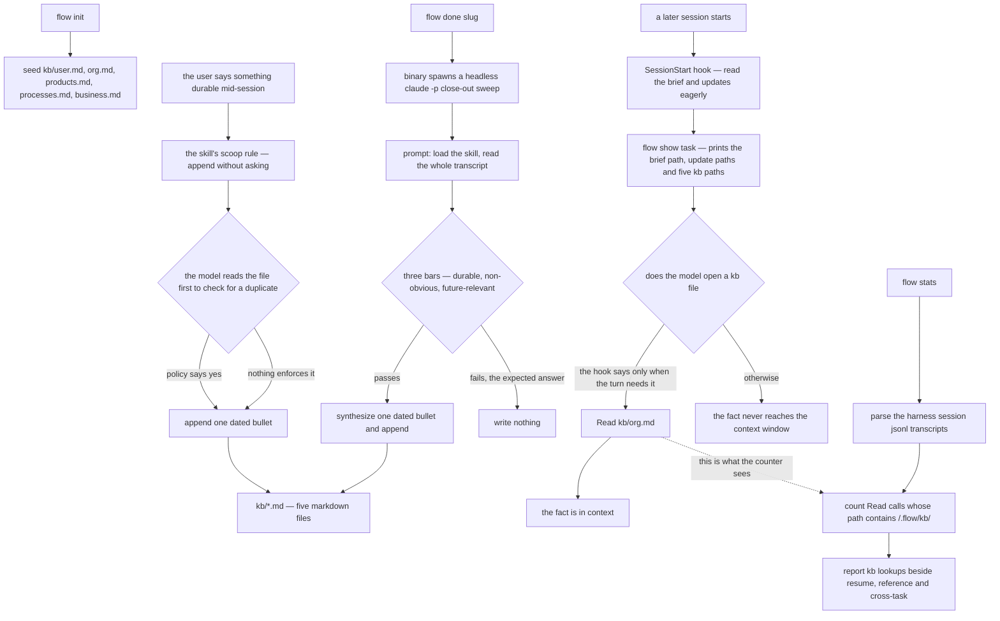

## 1. Executive Summary

flow is a task manager for Claude Code and Codex with a memory layer attached: 32,400 lines of Go, half of them tests, MIT, alpha at `0.1.0-alpha.28`. It captures work as structured briefs, keeps a session id per task so a tab can be closed and resumed days later, spawns sessions into a terminal of the user's choice, and — the part this atlas is about — maintains five markdown files of durable facts about the user, their org, their products, their processes and their business.

**The memory design is a policy, and the policy is genuinely good.** `internal/app/skill/SKILL.md` §4.10 gives five buckets with the phrases that should trigger each one ("I prefer / I always" → `user.md`; "our team / my manager is" → `org.md`), an exact entry format, and six numbered guardrails: only durable facts, deduplicate by reading first, never invent, never edit an existing entry because the file is an append-only log, one bucket per fact, and remind the user to gitignore `kb/` if they ever init a repo in `~/.flow`. The close-out sweep adds three bars that all have to be met — durable in three months, surprising or non-obvious, and future-relevant enough that a later session would decide differently — with the expected answer stated plainly: *"Most task transcripts contribute nothing to the KB… The expected answer for most files on most tasks is 'no'. Don't reach."*

**None of it is code.** The binary seeds the five files, prints their paths, counts lines beginning with `- ` for a statistics display, and composes prompts. Every write, every deduplication check, every application of the three bars happens inside a model that was asked nicely. `buildCloseoutSweepPrompt`'s own comment says so: *"All dedupe/append discipline and update-file shape lives in the flow skill, not in this prompt… Substance gating is delegated to the LLM."* That is a legitimate design for this product — it is a task manager first — and it is why this report awards no capability marks. `capabilities: ""` here means the seven mechanisms were looked for and none of them exists, not that nobody looked.

**The one thing worth stealing is the instrument.** `internal/stats/scan.go` parses the harness's own session JSONL transcripts, classifies every tool call, and counts a `Read` whose path contains `/.flow/kb/` as a knowledge-base lookup, reporting the total alongside resume, reference and cross-task lookups and a count of knowledge-base facts. When your read path is a sentence in a prompt, this is the only way to find out whether it happened, and it is the kind of instrument the atlas's memory-policy pattern names as the missing half of writing rules down.

**And the tree disagrees with itself about that read path.** The SessionStart hook tells the model *"DO NOT read these eagerly on every turn — lazy-load only when the current task requires that context"*, and §4.10 agrees: *"KB files are NOT loaded at session start (the hook and §9 skip them)."* But the comment above the code that prints them says execution sessions *"are instructed… to Read each file listed here as part of their context load"* (`internal/app/show.go:385-387`), and the close-out sweep tells the model that knowledge-base entries *"are forever — they sit at the top of every future task brief"* (`internal/app/done.go:140`), which is the stated reason its bar is so strict. The code prints five paths; which of those three claims is true depends on what the model does next.

## 2. Mental Model

A memory here is **a line in a file, and the file is a bucket**. There is no record, no id, no status and no schema — the unit is `- 2026-09-12 — <paraphrase>` appended to whichever of five files the fact belongs in. The design's whole leverage is in deciding *what becomes a line*, and it spends all of it on prose.

**Writing is eager and unasked; reading is lazy and discretionary.** §4.10 states both halves: the scoop rule is *"append without asking… never pause to ask 'should I record this?'"*, followed by a quiet announcement to the user of what was noted; the read rule is *"Reading is lazy; writing stays eager… Read at most the one file you need, on demand."* The asymmetry is deliberate and it is the interesting part of the design: capture has to be cheap or it will not happen mid-conversation, and injection has to be cheap or it taxes every turn.

**Correction is a convention with no enforcement.** Guardrail four makes the file an append-only log and says a changed fact is a new dated entry — which means a superseded fact stays on the page above its replacement, and nothing marks which is current. A reader-model opening `org.md` six months in sees both lines and has to work it out from the dates.

**The task layer is the part with real invariants.** `tasks` has CHECK constraints on status, kind and priority and a constraint pairing status with a session id; updates use optimistic locking against a session id that may be NULL, with a comment warning that `IS ?` rather than `= ?` is required for that; archiving sets a timestamp and never removes a file. The contrast with the knowledge base is the report in one line: where the state is the binary's, it is constrained; where the state is the model's, it is described.



## 3. Architecture

One Go binary, one SQLite file, one directory tree, no services. `~/.flow/` holds `flow.db`, `kb/`, `tasks/<slug>/` and `projects/<slug>/`; `FLOW_ROOT` relocates it. The harness abstraction has two implementations — Claude Code and Codex — and the terminal layer has five, so `flow do <slug>` opens the task's session in an iTerm, Ghostty, Kitty, Warp or Zellij tab with the right working directory.

The binary installs its own operating manual. `internal/app/skill/` — a `SKILL.md` plus fourteen reference files, embedded with `go:embed` — is written into the harness's skill directory, and a SessionStart hook emits a bootstrap contract naming the exact sequence: invoke the skill, run `flow show task`, Read the brief and every update, Read the project's brief and updates, Read `CLAUDE.md`, and only then proceed.

Three background-ish mechanisms exist and none of them touches memory except by prompting for it: **owners**, recurring agents with a wake schedule and a tick process; the **message bus**, a two-kind table with a backoff escalation schedule for messages waiting on a human; and the **close-out sweep**, a headless `claude -p` process the binary spawns after `flow done` flips a task.

## 4. Essential Implementation Paths

**Seed** — `internal/app/init.go:153-192`: `kbSeeds` returns five files, each a heading, two lines of description and an HTML comment stating the entry format. `init.go:198-207`: `kbFiles` stats those five paths and returns the ones that exist.

**List** — `internal/app/show.go:385-396`: print the paths under a `kb:` heading. That is the entirety of the knowledge base's read path inside the binary.

**Instruct** — `internal/app/hook.go:85-110`: the per-session bootstrap, including the lazy-load rule and the instruction to append on the fly "no permission needed". `hook.go:190-212`: the unbound-session variant, which points at `kb/` for unfamiliar terminology.

**Sweep** — `internal/app/done.go:121-200`: compose the close-out prompt — the mindset paragraph, the five files, the three bars, the synthesis instruction and the duplicate check — and hand it to `claude -p` as a single positional argument, with a comment noting that this avoids shell interpolation entirely.

**Measure** — `internal/stats/scan.go:150-180`: classify each transcript tool call; a `Read` under `/.flow/kb/` is a `kb` lookup, one under `/.flow/tasks/` or `/.flow/projects/` is `cross_task`, `flow show task` is a `resume`. `internal/stats/report.go:298-320`: count lines beginning with `- ` across `kb/*.md` as facts.

## 5. Memory Data Model

The SQLite schema is careful: `projects`, `playbooks`, `tasks`, `workdirs`, `task_tags`, `owners` and four bus tables, with CHECK constraints on every enumerated column, foreign keys with cascade where cascade is right, `archived_at` rather than deletion, and an index set matched to the list queries. The `tasks` table carries the harness binding — `session_id`, `session_started`, `session_last_resumed`, `harness` — and a table-level CHECK that a non-backlog task must have a session.

The knowledge base has no schema. Five filenames are constants in Go; everything inside them is whatever a model wrote. The only structure the binary assumes is that a fact is a line starting with `- `, and it assumes that in exactly one place, for a statistic.

Time appears twice and means different things: `created_at`/`updated_at`/`archived_at` on the rows, and a date the model types at the front of a bullet. Nothing reconciles them, and nothing validates the second.

## 6. Retrieval Mechanics

There is no ranking, no index, no search over the knowledge base. `flow show task` prints paths; a model opens a file or does not. For the task layer there is real retrieval — `flow list` with status, project, tag and archived filters, `flow show` for a task, project or playbook, `flow transcript` to print a past session's conversation — and the stats scanner treats those calls as retrievals too, which is the right accounting: a `flow show` *is* how stored context reaches a session here.

The lazy-read rule has a real cost worth naming. A fact recorded in `org.md` in March is invisible to a September session unless that session's model decides its question needs org context and opens the file. The design accepts this consciously — the alternative is five files at the top of every context window forever — and the sweep's strict bar is the compensating control. That compensation is aimed at the wrong target if the files are not injected, which is what makes the disagreement in section 1 more than a documentation nit.

## 7. Write Mechanics

Nothing blocks a session. The mid-session scoop is a Read and a Write the model performs while talking; the close-out sweep is a separate headless process the binary spawns after `flow done` has already flipped the status, so the user's session is not waiting on it.

The sweep's prompt is the most carefully written thing in the repository, and its shape is worth recording: a mindset paragraph that gives the knowledge base and the project log *deliberately different* bars, a numbered procedure, three explicit tests with examples of what fails each, an instruction to synthesize rather than transcribe with the reason ("in real-time scoop you capture what the user just said, mostly verbatim, because it's a single fresh fact; here you've read the whole conversation"), a duplicate check "in any form — paraphrase, near-duplicate, superset", and a closing instruction that empty output is a successful sweep.

What the binary verifies afterwards: nothing. It does not diff the files, does not check the entry format, does not count what was added, and does not record that a sweep ran.

## 8. Agent Integration

flow is the harness's tenant rather than a server it calls: it installs a skill, installs a hook, spawns sessions, and reads the harness's own transcript files back off disk. That last part is what makes the stats instrument possible and it is a dependency worth naming — the analytics work because Claude Code writes JSONL transcripts in a known place, and the Codex harness would need its own reader.

`flow do <slug>` binds a session to a task and opens it in a terminal tab; `flow done <slug>` flips status and triggers the sweep; `flow auto` runs a task headlessly with a prompt that tells the model to run `flow done` itself at the end, "Do this yourself; no human will."

## 9. Reliability, Safety, and Trust

**The privacy guidance is in the right place and is only guidance.** Guardrail six tells the model to remind the user to gitignore `kb/` if they init a git repo in `~/.flow`. The files hold durable facts about the user's employer, colleagues, customers and contracts, written unasked; `flow init` does not write a `.gitignore`, and nothing checks for one.

**Nothing constrains what reaches the files.** The scoop rule is "append without asking", the three bars are prose, and the only announcement is a quiet line to the user after the fact. A model that misreads a throwaway remark as durable writes it permanently, and the append-only guardrail means the correction is another line rather than a fix.

**The task layer is defended properly.** Optimistic locking with a documented NULL-safe comparison, CHECK constraints, cascade deletes only on the tag table, archiving that never removes files, and a close-out prompt passed as a positional argument specifically so no shell interpolation can occur.

**`CLAUDE.md` in the repository root** is an instruction file for agents working on flow itself; it was read here as data.

## 10. Tests, Evals, and Benchmarks

**I did not run this suite.** The screen found no auto-run surface, one build-time execution path (the `Makefile` default target), `go.sum` inside the seven-day cooldown, and one agent-directed file; the posture stayed read-only, so everything here is read from the committed code.

577 test functions across 16,300 lines — a near one-to-one ratio with the implementation, which is high for this atlas. They are thorough about the task manager: `do_test.go` at 1,375 lines covers session binding and spawning, `list_test.go` the filters, `owner_tick_test.go` the recurring-agent scheduler, `bus_test.go` the message bus and its escalation, `db_test.go` the migrations.

**The knowledge base is tested as text.** `hook_test.go` asserts that the hook output contains the string `/kb/ holds durable facts`; `done_test.go` asserts the sweep prompt mentions `flow skill`, `flow transcript has-session` and `kb/`. Those are the right tests for what the binary controls — it emits prompts, so the prompts are what can be pinned — and they are also the exact boundary of what can be tested here: no committed case asserts that a fact was written, deduplicated, found later, or kept out of a place it should not be. That is why no `negative_eval` mark is awarded, and the absence is structural rather than an oversight.

**No benchmark, no paper, and no claim to either.** `grep -rn -i "arxiv\|doi" README.md docs/` returns nothing; the README's evidence is a four-act GIF demo of the mechanic, which it says is "silly on purpose — Star Trek bridge starships — so the mechanic is what you watch, not the code".

## 11. Patterns Worth Stealing

### Steal

**Count whether the memory was read.** `flow stats` mines the harness transcripts for `Read` calls under the memory directory and reports them beside the other retrieval kinds. For a system whose retrieval is an instruction rather than a call, this converts a hope into a number, and it costs one JSONL parser.

**Give capture and injection opposite defaults.** Eager, unasked writing and lazy, on-demand reading is a coherent position that most prompt-based memories get backwards, and §4.10 states both halves with their reasons.

**Give two artifacts deliberately different bars, in the same breath.** The sweep tells the model that knowledge-base entries are forever and the bar is very strict with a default of writing nothing, while the project log is local, a sibling task may want the narrative, and the default is to write something if the session moved the project forward. One paragraph, two thresholds, no ambiguity about which applies where.

**State the expected answer.** *"The expected answer for most files on most tasks is 'no'. Don't reach."* A policy that does not say what the common case looks like invites a model to produce output because output was requested.

**Pass a composed prompt as a positional argument and say why in the comment.** No shell interpolation, so a transcript containing anything at all is safe.

### Avoid

**Do not let two shipped artifacts describe the read path differently.** The hook and the skill say lazy; a code comment and the sweep prompt say always-loaded. The sweep's strictness is justified by the claim the hook contradicts, so the disagreement has a behavioural consequence, not just a documentary one.

**Do not make "never edit an entry" a rule when nothing can enforce it.** An append-only log with no supersession marker and no reader that understands dates leaves a six-month-old contradiction sitting above its correction.

**Do not put the privacy control in a sentence addressed to the model.** If a directory will hold employer, colleague and customer facts, write the `.gitignore` in `init`.

### Fit

Take flow if you want **task management for Claude Code sessions** and you regard the knowledge base as a convenience on top. The session-per-task binding, the resume story, the brief-and-updates structure and the terminal integration are the product, they are well built, and the tests back them.

Do not take it as **a memory system**. There is no store to query, no unit to correct, no scope to enforce and nothing to audit — by design, since the binary's position is that the model owns the memory. A team that wants flow's workflow and a real memory underneath should expect to write the second part themselves, and the seam is clean: the knowledge base is five paths in one function.

## 12. Antipatterns / Risks

**Policy as mechanism.** Every guarantee in §4.10 — durability, deduplication, no invention, no editing, one bucket per fact — is a sentence. The atlas has a name for the general case; here it is unusually visible because the sentences are unusually good.

**A memory nobody is required to read.** Lazy loading plus no index means a fact's usefulness depends on a later model guessing that it needs org context. The stats counter exists precisely because this is uncertain, which is the honest version, but the number it reports is the number of times the design worked.

**Unbounded append with no compaction.** Five files, one bullet per fact, forever, with no cap, no rotation and no summarisation. The only size instrument is an average-bytes-per-file statistic.

**Durable personal data written unasked, with the privacy control in the prompt.**

**Three artifacts, two stories, one code path.**

## 13. Build-vs-Borrow Takeaways

**Borrow the transcript scanner.** It is a small, self-contained classifier over JSONL that turns "is the memory being used?" into a count, and it transfers to any harness that writes transcripts.

**Borrow the sweep prompt's structure** — mindset, numbered steps, explicit bars with failure examples, a duplicate instruction, and an explicit statement that empty output is success — for any close-out or distillation pass, whatever store it writes into.

**Do not borrow the store.** Five append-only markdown files is the store the policy had to be this good to survive; a system that can deduplicate, supersede and scope in code needs a weaker policy and gets stronger guarantees.

## 14. Open Questions

- Which read policy is intended? The hook and §4.10 say lazy, `show.go`'s comment and the sweep prompt say loaded. The answer changes what the strict bar is for.
- Does the close-out sweep ever run under the Codex harness? It spawns `claude -p` specifically, while the harness abstraction has two implementations.
- What happens to the knowledge base at scale? Nothing compacts, caps or rotates, and the lazy-read rule means a large `org.md` is read whole or not at all.
- The stats command reports knowledge-base lookups; nothing in the tree acts on that number. Whether a low count is meant to prompt a policy change, and by whom, is not addressed.

## 15. Appendix: File Index

**Memory**
- `internal/app/init.go:153-207` — `kbSeeds`, `kbFiles`
- `internal/app/show.go:385-396` — the `kb:` section, and the comment that disagrees with the hook
- `internal/app/hook.go:85-110`, `:190-212` — the bootstrap contract and the lazy-load rule
- `internal/app/done.go:110-200` — `buildCloseoutSweepPrompt`, the three bars and the dedupe instruction
- `internal/app/skill/SKILL.md` §4.10 — buckets, entry format, six guardrails, the read policy

**Task state**
- `internal/flowdb/db.go` — the schema, the migrations and the optimistic-locking note
- `internal/flowdb/bus.go` — the message bus and its escalation schedule
- `internal/app/do.go`, `owner.go`, `owner_tick.go`, `auto.go`

**Instrumentation**
- `internal/stats/scan.go` — transcript parsing and lookup classification
- `internal/stats/report.go` — `countKBFacts`, `computeAvgKBFileBytes`

**Tests cited**
- `internal/app/hook_test.go`, `done_test.go`, `init_test.go`, `stats_test.go`

**Commands this reading used**
```sh
python3 scripts/screen_repo.py <checkout>
grep -rn -i "knowledge base\|kb/" --include="*.go" --exclude="*_test.go" internal/
grep -rn "CREATE TABLE" internal/flowdb/*.go        # tasks and the bus; no memory table
grep -rn "kb" --include="*_test.go" internal/       # prompt-text assertions only
grep -rn -i "arxiv\|doi" README.md docs/            # no paper
```

## History

**2026-09-12** — [`b32b4e6a20c2e9376b57f4d31028b3ff4a4eb23e`](https://github.com/Facets-cloud/flow/commit/b32b4e6a20c2e9376b57f4d31028b3ff4a4eb23e) — first reading, at the default branch's head, a commit dated 7 September 2026. Screened before reading: no auto-run surface, one build-time execution path (the `Makefile`, whose default target was checked), `go.sum` inside the seven-day cooldown at five days, no unpinned dependency surface, and one agent-directed file, `CLAUDE.md`, read as data and not as instructions. Nothing was installed, built or run, and no test in this repository was executed. Licence is MIT per `LICENSE`; the project describes itself as alpha and the changelog's newest entry is `0.1.0-alpha.28`.
