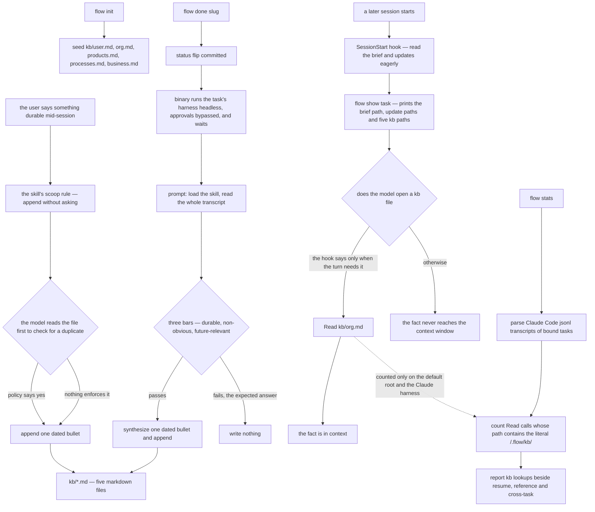

## 1. Executive Summary

flow is a task manager for Claude Code and Codex with a memory layer attached. It captures work as structured briefs, keeps a session id per task so a tab can be closed and resumed days later, and spawns sessions into a terminal of the user's choice. Its memory is five markdown files of durable facts about the user, their org, products, processes and business. The policy governing them is carefully written and none of it is code. The weak point is the read path, which the tree's own artifacts describe two incompatible ways.

**The memory design is a policy, and the policy is specific.** `internal/app/skill/SKILL.md` §4.10 gives five buckets with the phrases that should trigger each one ("I prefer / I always" → `user.md`; "our team / my manager is" → `org.md`), an exact entry format, and six numbered guardrails. They are: only durable facts, deduplicate by reading first, never invent, never edit an existing entry because the file is an append-only log, one bucket per fact, and remind the user to gitignore `kb/` if they ever init a repo in `~/.flow`. The close-out sweep adds three bars that all have to be met — durable in three months, surprising or non-obvious, and future-relevant enough that a later session would decide differently. It states the expected answer: *"Most task transcripts contribute nothing to the KB… The expected answer for most files on most tasks is 'no'. Don't reach."*

**None of it is code.** The binary seeds the five files, prints their paths, counts lines beginning with `- ` for a statistics display, and composes prompts. Every write, every deduplication check and every application of the three bars happens inside a model that was asked. `buildCloseoutSweepPrompt`'s own comment says so: *"All dedupe/append discipline and update-file shape lives in the flow skill, not in this prompt… Substance gating is delegated to the LLM."* That is a legitimate design for a product that is a task manager first, and it is why this report awards no capability marks. `capabilities: ""` here means the seven mechanisms were looked for and none of them exists.

**The transferable part is the instrument.** `internal/stats/scan.go` parses Claude Code session JSONL transcripts, classifies every tool call, and counts a `Read` whose path contains `/.flow/kb/` as a knowledge-base lookup. It reports the total beside resume, reference and cross-task lookups and a count of knowledge-base facts. When the read path is a sentence in a prompt, this is the only way to find out whether it happened — the half the [memory-policy pattern](../../overview/#memory-policy-as-a-written-artifact) names as missing.

**The instrument counts less than it reports.** The match is the literal `/.flow/kb/` (`internal/stats/scan.go:165`), while the store honours `FLOW_ROOT`. With the root relocated, `countKBFacts` counts facts from the real directory (`internal/stats/report.go:150`) and every knowledge-base read goes uncounted. The scanner opens only Claude Code transcripts of task-bound sessions (`report.go:76`), so a Codex task's reads and the sweep's own duplicate-check reads never reach the number.

**And the tree disagrees with itself about the read path.** The SessionStart hook tells the model *"DO NOT read these eagerly on every turn — lazy-load only when the current task requires that context"* (`internal/app/hook.go:104`), and the skill agrees in §4.10 and again in the §9 bootstrap contract. Three other artifacts say the files are loaded. The README's Act 2 says the session has *"the knowledge base loaded"* and its diagram shows the session loading *"brief + kb + notes"*. The comment above the code that prints the paths says execution sessions are instructed to Read each listed file *"as part of their context load"* (`internal/app/show.go:386-388`). The close-out sweep tells the model that entries *"are forever — they sit at the top of every future task brief"* (`internal/app/done.go:140`), which is its stated reason for the strict bar.

## 2. Mental Model

A memory here is **a line in a file, and the file is a bucket**. There is no record, no id, no status and no schema. The unit is `- 2026-09-12 — <paraphrase>` appended to whichever of five files the fact belongs in. The design's leverage is in deciding *what becomes a line*, and it spends all of it on prose.

**Writing is eager and unasked; reading is lazy and discretionary.** §4.10 states both halves. The scoop rule is *"append without asking… never pause to ask 'should I record this?'"*, followed by a quiet announcement to the user of what was noted. The read rule is *"Reading is lazy; writing stays eager… Read at most the one file you need, on demand."* The asymmetry is deliberate: capture has to be cheap or it will not happen mid-conversation, and injection has to be cheap or it taxes every turn.

**Correction is a convention with no enforcement.** Guardrail four makes the file an append-only log and says a changed fact is a new dated entry. A superseded fact therefore stays on the page above its replacement, and nothing marks which is current. A reader-model opening `org.md` six months in sees both lines and has to work it out from the dates.

**Owners keep a second agent-written memory.** Each owner — a recurring headless agent — reads its `charter.md` and the latest notes in its own `updates/` journal at the start of every tick (`internal/app/owner_tick.go:523-535`). Its runner comment states that *"the owner's memory is its durable charter + ledger, not a resumed transcript"*. That memory is per-owner by directory and carries the same shape: markdown, written by a model, read on instruction.

**The task layer is the part with real invariants.** `tasks` has CHECK constraints on status, kind and priority and a constraint pairing status with a session id. Updates use optimistic locking against a session id that may be NULL, with a comment warning that `IS ?` rather than `= ?` is required for that. Archiving sets a timestamp and never removes a file. Where the state is the binary's, it is constrained; where the state is the model's, it is described.

## 3. Architecture

One Go binary, one SQLite file, one directory tree, no services. `~/.flow/` holds `flow.db`, `kb/`, `tasks/<slug>/` and `projects/<slug>/`, and `FLOW_ROOT` relocates it (`internal/app/init.go:14-23`). The harness abstraction has two implementations — Claude Code and Codex — and the terminal layer has five. `flow do <slug>` opens the task's session in an iTerm, Ghostty, Kitty, Warp or Zellij tab with the right working directory.

The binary installs its own operating manual. `internal/app/skill/` — a `SKILL.md` plus fourteen reference files, embedded with `go:embed` (`internal/app/skill.go:18`) — is written into the harness's skill directory. A SessionStart hook emits a bootstrap contract naming the exact sequence: invoke the skill, run `flow show task`, Read the brief and every update, Read the project's brief and updates, Read `CLAUDE.md`, and only then proceed.

Three background mechanisms exist, and only one is directed at memory. **Owners** are recurring agents with a wake schedule and a tick process. The **message bus** is a two-kind table with a backoff escalation schedule for messages waiting on a human. The **close-out sweep** is a headless harness run that `flow done` starts after the status flip and waits on.

### Deployment and ergonomics

Nothing has to be running beyond the binary and the harness CLI. The store is local, human-readable and repairable in a text editor, and the knowledge base needs no API key of its own; the sweep spends the harness's model calls. The README's install path is to ask an agent to fetch the release binary and run `flow init`, which installs the skill and the hook for the active harness; a manual `curl` path and `make install` also exist. The README's backup advice is to commit `~/.flow` periodically and to add `kb/` to `.gitignore` before pushing to a shared remote.

## 4. Essential Implementation Paths

**Seed** — `internal/app/init.go:153-192`: `kbSeeds` returns five files, each a heading, two lines of description and an HTML comment stating the entry format. `init.go:198-207`: `kbFiles` stats those five paths and returns the ones that exist.

**List** — `internal/app/show.go:386-397` prints the paths under a `kb:` heading for a task, `:458-467` for a project and `:577-586` for a playbook. Those three blocks are the knowledge base's whole read path inside the binary.

**Instruct** — `internal/app/hook.go:84-111`: the per-session bootstrap, including the lazy-load rule and the instruction to append on the fly "no permission needed". `hook.go:188-212`: the unbound-session variant, which points at `kb/` for unfamiliar terminology.

**Sweep** — `internal/app/done.go:96-110` resolves the task's harness and calls `SkipPermissionsRun` with the composed prompt. `done.go:131-194` (`buildCloseoutSweepPrompt`) composes the mindset paragraph, the five files, the three bars, the synthesis instruction and the duplicate check. The Claude implementation execs `claude -p <prompt> --dangerously-skip-permissions` (`internal/harness/claude/claude.go:184-189`); the Codex one execs `codex exec --dangerously-bypass-approvals-and-sandbox <prompt>` (`internal/harness/codex/codex.go:80-85`). Both pass the prompt as one argument, and both call `cmd.Run()`, which blocks until the model exits.

**Measure** — `internal/stats/scan.go:150-176`: classify each transcript tool call; a `Read` under `/.flow/kb/` is a `kb` lookup, one under `/.flow/tasks/` or `/.flow/projects/` is `cross_task`, and `flow show task` is a `resume`. `internal/stats/report.go:76` builds each transcript path under `~/.claude/projects`. `report.go:298-320`: count lines beginning with `- ` across `kb/*.md` as facts.

## 5. Memory Data Model

The SQLite schema is careful. It holds `projects`, `playbooks`, `tasks`, `workdirs`, `task_tags`, `owners` and four bus tables, with CHECK constraints on the status, kind and priority enums, `archived_at` rather than deletion, and an index set matched to the list queries. The one cascade is on `task_tags`. The `auto_run_status` column added by migration carries no CHECK, because SQLite cannot add one through `ALTER`, and its comment says the enum is validated in application code (`internal/flowdb/db.go:366-371`).

The `tasks` table carries the harness binding — `session_id`, `session_started`, `session_last_resumed`, `harness` — and a table-level CHECK that a non-backlog task must have a session (`internal/flowdb/db.go:69`).

The knowledge base has no schema. Five filenames are constants in Go; everything inside them is whatever a model wrote. The only structure the binary assumes is that a fact is a line starting with `- `, and it assumes that in exactly one place, for a statistic.

Time appears twice and means different things: `created_at`/`updated_at`/`archived_at` on the rows, and a date the model types at the front of a bullet. Nothing reconciles them, and nothing validates the second.

## 6. Retrieval Mechanics

There is no ranking, no index and no search over the knowledge base. `flow show` prints paths; a model opens a file or does not. For the task layer there is real retrieval — `flow list` with status, project, tag and archived filters, `flow show` for a task, project or playbook, and `flow transcript` to print a past session's conversation. The stats scanner treats those calls as retrievals too, which is the right accounting: a `flow show` *is* how stored context reaches a session here.

The lazy-read rule has a cost. A fact recorded in `org.md` in March is invisible to a September session unless that session's model decides its question needs org context and opens the file. The design accepts this on purpose — the alternative is five files at the top of every context window forever — and the sweep's strict bar is the compensating control. That control is calibrated to injection that the hook forbids, so the disagreement in section 1 changes behaviour rather than wording.

## 7. Write Mechanics

The mid-session scoop is a Read and a Write the model performs while talking, so it costs the turn two tool calls and nothing else.

The close-out sweep blocks whoever ran `flow done`. The status flip is committed first, then the CLI prints `updating kbs, project updates...` and waits on the headless run (`internal/app/done.go:90-110`). Skill §4.7 tells the in-session model to run `flow done` itself, so the model's own tool call waits for a full second model pass over the transcript. The interface comment calls the sweep *"fire-and-forget"* (`internal/harness/harness.go:197`); the code waits and discards its output, so a sweep that writes nothing and one that failed after writing half an entry look the same. §4.7 also tells the model to relay *"any NUDGE block it prints verbatim"*, and no code in the tree prints one.

The sweep's prompt is the most carefully written thing in the repository. It opens with a mindset paragraph that gives the knowledge base and the project log *deliberately different* bars. It follows with a numbered procedure and three explicit tests with examples of what fails each. It tells the model to synthesize rather than transcribe, with the reason: *"In real-time scoop you capture what the user just said, mostly verbatim… Here you've read the whole conversation."* It asks for a duplicate check "in any form — paraphrase, near-duplicate, superset", and closes by stating that empty output is a successful sweep.

What the binary verifies afterwards: nothing. It does not diff the files, does not check the entry format, does not count what was added, and does not record that a sweep ran.

### Operational cost

A new mid-session fact is retrievable as soon as the model's Write lands. Sweep entries land when `flow done` returns. No background pass rewrites the store; each sweep reads one transcript and at most five small files. Injection per turn is zero by the hook's rule and whatever the model opens otherwise, and nothing bounds a file's size.

## 8. Agent Integration

flow is the harness's tenant rather than a server it calls: it installs a skill, installs a hook, spawns sessions, and reads the harness's transcript files back off disk. That last part is what makes the stats instrument possible, and it is where the harness abstraction stops. `flow transcript` has a reader for each harness (`internal/harness/codex/transcript.go` is the Codex one), while `flow stats` builds only Claude Code paths, so the Codex half of the product is dark to the instrument.

`flow do <slug>` binds a session to a task and opens it in a terminal tab; `flow done <slug>` flips status and runs the sweep. `flow do --auto` runs a task headlessly with a prompt that tells the model to run `flow done` itself at the end — *"Do this yourself; no human will"* (`internal/app/auto.go:328`).

## 9. Reliability, Safety, and Trust

**The close-out sweep reads an untrusted transcript with every approval bypassed.** The transcript holds whatever the session saw — tool output, fetched pages, file contents — and the sweep model reads all of it end to end. Both harness implementations run it with permission prompts disabled, and the binary discards stdout and stderr. Text in a transcript that reads as an instruction reaches a headless model that can write any file and run any command. The prompt is passed as one `exec.Command` argument, which removes shell interpolation and does nothing about this.

**The privacy guidance is in the right places and is only guidance.** Guardrail six tells the model to remind the user to gitignore `kb/` if they init a git repo in `~/.flow`, and the README's backup section tells the user the same. The files hold durable facts about the user's employer, colleagues, customers and contracts, written unasked. `flow init` does not write a `.gitignore`, and nothing checks for one.

**Nothing constrains what reaches the files.** The scoop rule is "append without asking", the three bars are prose, and the only announcement is a quiet line to the user after the fact. A model that misreads a throwaway remark as durable writes it permanently, and the append-only guardrail means the correction is another line rather than a fix.

**The task layer is defended properly.** It has optimistic locking with a documented NULL-safe comparison, CHECK constraints on its enums, a cascade only on the tag table, and archiving that never removes files.

**`AGENTS.md` in the repository root** is an instruction file for agents working on flow itself, and it was read here as data. It was `CLAUDE.md` until 21 September 2026; `CONTRIBUTING.md:36` links the old name.

## 10. Tests, Evals, and Benchmarks

**I did not run this suite.** The screen found no auto-run surface, one build-time execution path (the `Makefile` default target), no dependency file inside the seven-day cooldown, and one agent-directed file. The posture stayed read-only, so everything here is read from the committed code.

The suite has 577 test functions across 16,325 lines, a near one-to-one ratio with the implementation. It is thorough about the task manager: `do_test.go` at 1,375 lines covers session binding and spawning, `list_test.go` the filters, `owner_tick_test.go` the recurring-agent scheduler, `bus_test.go` the message bus and its escalation, `db_test.go` the migrations.

**The knowledge base is tested as text.** `hook_test.go` asserts that the hook output contains the string `/kb/ holds durable facts`. `done_test.go:159` asserts the sweep prompt mentions `flow skill`, `flow transcript <slug>` and `kb/`, with the Claude runner stubbed. Those are the right tests for what the binary controls — it emits prompts, so the prompts are what can be pinned. They are also the boundary of what can be tested here: no committed case asserts that a fact was written, deduplicated, found later, or kept out of a result. That is why no `negative_eval` mark is awarded.

**The instrument is tested on the default root only.** `internal/stats/scan_test.go` feeds one transcript with a Read of `/Users/x/.flow/kb/org.md` and asserts one `kb` lookup. No fixture uses a relocated root, which is the case where the literal match returns zero.

**No benchmark, no paper, and no claim to either.** The paper search in the appendix returns nothing, and no `CITATION.cff` exists. The README's evidence is a four-act demo, which it calls "silly on purpose — Star Trek bridge starships — so the mechanic is what you watch, not the code".

## 11. For Your Own Build

### Steal

**Count whether the memory was read.** `flow stats` mines the harness transcripts for `Read` calls under the memory directory and reports them beside the other retrieval kinds. For a system whose retrieval is an instruction rather than a call, this converts a hope into a number, and it costs one JSONL parser. Build the match from the same root the store uses.

**Give capture and injection opposite defaults.** Eager, unasked writing and lazy, on-demand reading is a coherent position, and §4.10 states both halves with their reasons.

**Give two artifacts different bars in the same breath.** The sweep tells the model that knowledge-base entries are forever and the default is to write nothing, while the project log is local and the default is to write something if the session moved the project forward. One paragraph, two thresholds, no ambiguity about which applies where.

**State the expected answer.** *"The expected answer for most files on most tasks is 'no'. Don't reach."* A policy that does not say what the common case looks like invites a model to produce output because output was requested.

**Borrow the sweep prompt's structure** — mindset, numbered steps, explicit bars with failure examples, a duplicate instruction, and a statement that empty output is success — for any close-out or distillation pass, whatever store it writes into.

### Avoid

**Do not let shipped artifacts describe the read path differently.** The hook and the skill say lazy; the README, a code comment and the sweep prompt say loaded. The sweep's strictness is justified by the claim the hook contradicts, so the disagreement changes behaviour.

**Do not let the path writer and the path counter compose the root separately.** The store reads `FLOW_ROOT`; the counter matches a hardcoded default. The result is a statistic that reads zero exactly when the user customised their install.

**Do not run a distillation pass over untrusted text with approvals bypassed.** A sweep that only needs to Read a transcript and append to five files can be given those tools and no others.

**Do not make "never edit an entry" a rule when nothing can enforce it.** An append-only log with no supersession marker and no reader that understands dates leaves a six-month-old contradiction sitting above its correction.

**Do not leave a privacy control in prose alone.** If a directory will hold employer, colleague and customer facts, write the `.gitignore` in `init`.

### Fit

Take flow if you want **task management for Claude Code sessions** and you regard the knowledge base as a convenience on top. The session-per-task binding, the resume story, the brief-and-updates structure and the terminal integration are the product, they are well built, and the tests back them.

Do not take it as **a memory system**. There is no store to query, no unit to correct, no scope to enforce and nothing to audit — by design, since the binary's position is that the model owns the memory. Five append-only markdown files is the store the policy had to be this good to survive. A team that wants flow's workflow and a real memory underneath should expect to write the second part themselves, and the seam is clean: the knowledge base is five paths in one function.

## 12. Open Questions

- Which read policy is intended? The hook and the skill say lazy; the README, `show.go`'s comment and the sweep prompt say loaded. The answer changes what the strict bar is for.
- What happens when the in-session model's `flow done` call outlives the harness's tool timeout? The sweep is a child of that call and nothing in the tree detaches it.
- What happens to the knowledge base at scale? Nothing compacts, caps or rotates, and the lazy-read rule means a large `org.md` is read whole or not at all.
- The stats command reports knowledge-base lookups; nothing in the tree acts on that number. Whether a low count is meant to prompt a policy change, and by whom, is not addressed.

## Appendix: File Index

**Memory**
- `internal/app/init.go:14-23` — `flowRoot` and `FLOW_ROOT`
- `internal/app/init.go:153-207` — `kbSeeds`, `kbFiles`
- `internal/app/show.go:386-397`, `:458-467`, `:577-586` — the `kb:` sections, and the comment that disagrees with the hook
- `internal/app/hook.go:84-111`, `:188-212` — the bootstrap contract and the lazy-load rule
- `internal/app/done.go:90-194` — the harness call and `buildCloseoutSweepPrompt`
- `internal/harness/claude/claude.go:184-189`, `internal/harness/codex/codex.go:80-85` — the two permission-bypassing runners
- `internal/app/skill/SKILL.md` §4.7, §4.10, §9 — close-out, buckets, entry format, guardrails, the read policy
- `internal/app/owner_tick.go:523-535` — the owner's charter and journal

**Task state**
- `internal/flowdb/db.go` — the schema, the migrations and the optimistic-locking note
- `internal/flowdb/bus.go` — the message bus and its escalation schedule
- `internal/app/do.go`, `owner.go`, `owner_tick.go`, `auto.go`

**Instrumentation**
- `internal/stats/scan.go` — transcript parsing and lookup classification
- `internal/stats/report.go` — transcript paths, `countKBFacts`, `computeAvgKBFileBytes`

**Tests cited**
- `internal/app/hook_test.go`, `done_test.go`, `init_test.go`, `stats_test.go`, `internal/stats/scan_test.go`

### Recorded searches

Checked against the checkout at the pinned revision, from the tree root.

- `grep -rn -i -E 'knowledge base|knowledge-base|kb/|"kb"' --include='*.go' --exclude='*_test.go' internal/` — `init.go`, `show.go`, `hook.go`, `done.go`, `owner_tick.go` (prompt text) and `internal/stats`; no parser of a knowledge-base entry.
- `grep -rn 'kbFiles(' internal --include='*.go' | grep -v _test` — three callers, all in `show.go`.
- `grep -rn 'CREATE TABLE' internal/flowdb/*.go | grep -v _test` — eleven tables, none holding a knowledge-base entry.
- `grep -rn '/.flow/' internal/stats --include='*.go' | grep -v _test` — every Read classification is a literal on the default root; `FLOW_ROOT` does not reach `scan.go`.
- `grep -rn 'ClaudeProjects' internal --include='*.go' | grep -v _test` — the only transcript root `flow stats` opens.
- `grep -rn 'SkipPermissionsRun' internal --include='*.go' | grep -v _test` — `done.go` and `owner_tick.go` call it; both harness implementations bypass approvals.
- `grep -rn 'NUDGE' .` — `SKILL.md:546` only; no code prints one.
- `grep -rn 'gitignore' internal --include='*.go' | grep -v _test` — no match; `init` writes none.
- `grep -rn -i 'kb' --include='*_test.go' internal` — prompt-text assertions and statistics fixtures only.
- `grep -rn -i -E 'arxiv|doi\.org|bibtex|@article|@misc|citation' README.md docs/` — no match; `ls CITATION.cff` fails. The older `grep -i "arxiv\|doi"` matches the word "doing" in a design spec.
- `grep -rn -i -E 'tombstone|supersed|valid_from|valid_to' --include='*.go' internal` — no match.
- `grep -rn -E 'Setsid|Start\(\)|Process.Release' internal/harness internal/app/done.go | grep -v _test` — no match; the sweep runs through `cmd.Run()`.
- `grep -rn -i -E 'rotate|compact|truncat' internal --include='*.go' | grep -v _test | grep -i kb` — one hit, sweep prompt text; no code caps a knowledge-base file.
- `grep -rn 'LookupKB\|KBFacts' internal --include='*.go' | grep -v _test` — display, the context-bytes estimate and the stats card only.

## History

**2026-09-26** — [`99efdaef0a41e8acffa9e4e0f55dbecf7727a67a`](https://github.com/Facets-cloud/flow/commit/99efdaef0a41e8acffa9e4e0f55dbecf7727a67a) — one commit on, renaming `CLAUDE.md` to `AGENTS.md` with identical content; the mechanism did not move and no mark changed. Five published claims were wrong or incomplete at the first pin. The sweep runs through the task's harness, `codex exec` included, with approvals bypassed ([section 4](#4-essential-implementation-paths)), and `flow done` blocks on it ([section 7](#7-write-mechanics)). The stats counter misses a relocated `FLOW_ROOT` and Codex tasks ([section 1](#1-executive-summary)). The README is a third artifact saying the knowledge base is loaded. `go.mod` and `go.sum` last changed on 23 June 2026, so the cooldown finding was a clone artifact. Screened: no auto-run surface, the `Makefile` as the one build-time path, nothing inside the cooldown, and `AGENTS.md` read as data. Nothing installed, built or run.

**2026-09-12** — [`b32b4e6a20c2e9376b57f4d31028b3ff4a4eb23e`](https://github.com/Facets-cloud/flow/commit/b32b4e6a20c2e9376b57f4d31028b3ff4a4eb23e) — first reading, at the default branch's head, a commit dated 7 September 2026. Screened before reading: no auto-run surface, one build-time execution path (the `Makefile`, whose default target was checked), `go.sum` inside the seven-day cooldown at five days, no unpinned dependency surface, and one agent-directed file, `CLAUDE.md`, read as data and not as instructions. Nothing was installed, built or run, and no test in this repository was executed. Licence is MIT per `LICENSE`; the project describes itself as alpha and the changelog's newest entry is `0.1.0-alpha.28`.
