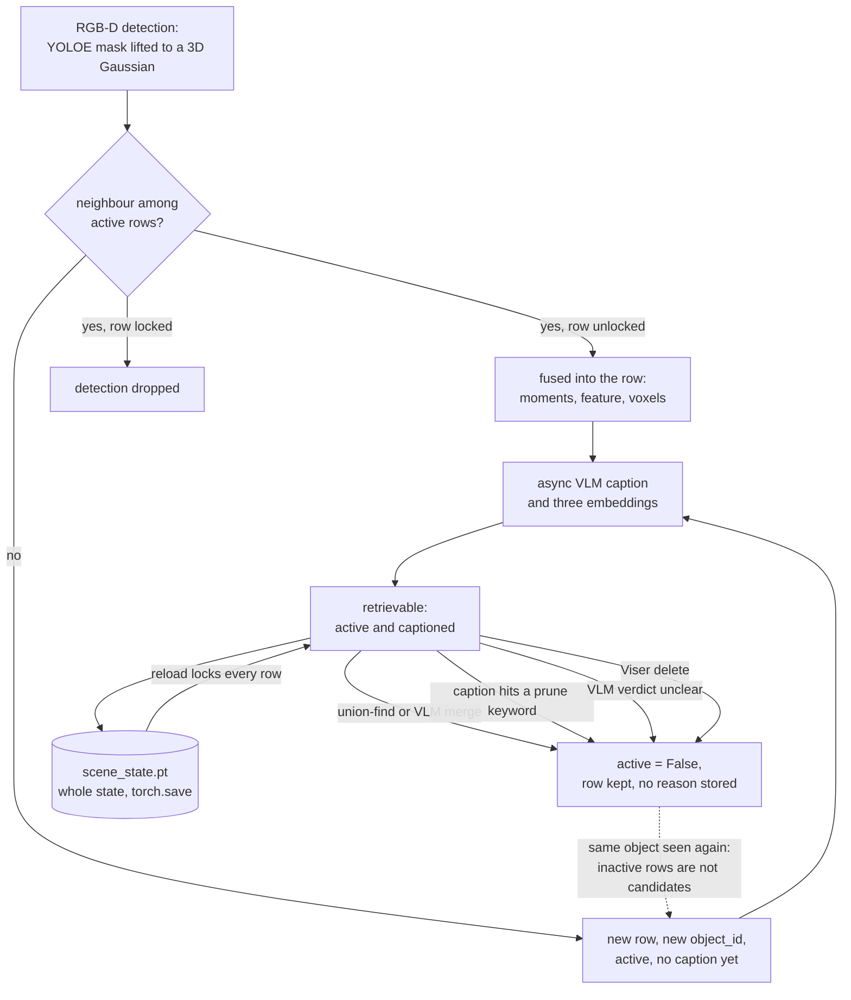

## 1. Executive Summary

FARM is the code for *FARM: Find Anything using Relational Spatial Memory*
([arXiv:2606.15476](https://arxiv.org/abs/2606.15476), submitted 13 June
2026, v3 26 July 2026): a real-time object memory a robot builds from posed
RGB-D streams and queries in relational language. Each object is one 3D
Gaussian with a VLM caption and three retrieval embeddings, saved in a single
`scene_state.pt` that the mapping node reloads by default and locks whole.
What is notable is the discipline of the representation: a closed-form
constant-cost update, relations derived at query time rather than stored, and
a retriever that returns nothing rather than inactive rows. What is weak is
correction. Every exit from the memory is one boolean that association skips,
so a deleted object returns as a new row the next time the camera sees it.

The licence is AGPL-3.0-or-later, inherited from the Ultralytics YOLOE fork
the detector is built on. `LICENSE` is the unmodified 661-line text with no
rider; pretrained models carry their own terms, listed in
`THIRD_PARTY_NOTICES.md`.

The primary user is a robotics researcher or the operator of one robot — a
Boston Dynamics Spot in the paper's deployment — driven by a person or a
navigation stack that asks for "the ladder near the shelves". No language
model agent holds a write path. Models appear only as components: YOLOE for
detection, Qwen3.5-9B for captions and query parsing, two embedding models and
SigLIP2, all served locally.

The implementation is strongest in the mapping loop and the retrieval
evaluators, which match the paper's method section closely. It is weakest
where the paper is silent: the Viser edit controls, the lock and the
persistence cycle ship with no test.

## 2. Mental Model

A memory is an **object row**: a Gaussian summarising where something is and
how big, plus what a vision-language model said about crops of it. Nothing in
the row records when it was seen; the world is assumed static between
sightings.

A detection becomes a belief by association. The mapper lifts each mask to a
Gaussian, looks for neighbours among rows whose `active` flag is true, and
either fuses into the winner or opens a new row with a fresh `object_id`
(`src/scene_graph/map_update/get_neighbors.py:318`,
`src/scene_graph/map_update/object_update.py:1465-1513`). A new row is not yet
retrievable: the retriever keeps only rows that are active, have a finite mean
and carry a non-empty caption (`src/scene_graph/scene_graph.py:886-899`), and
the caption arrives later from an asynchronous VLM worker.

A row stops being a belief in four ways, and all four write the same value. A
union-find or VLM-requested merge clears the loser's `active` and records
`id_redirect[loser] = winner` (`object_update.py:1066-1069`). A caption
containing a prune keyword is deactivated every 100 steps
(`ros/mapping/mapping/nodes/streaming_mapper.py:1398-1435`). A caption the VLM
calls unclear is deactivated and blanked
(`src/scene_graph/captioning/services.py:321-341`). A person pressing delete in
the Viser UI clears the same flag (`ros/mapping/mapping/lib/viser_edit.py:71-105`).
The row is never removed, and a reader cannot tell the four apart.

The fourth is the one that fails. Association excludes inactive rows, so when
the robot next sees an object a person deleted, the detection has no
neighbour and opens a new row, which is recaptioned and retrievable once the
worker returns. The deletion is keyed on a record, not on anything the next
observation carries.

The lock is the one state that constrains the pipeline. A locked row refuses
merges in either direction, drops detections matched to it, and ignores
recaptions (`object_update.py:978-986`, `:1265-1275`; `services.py:353-358`).
A person toggles it in the UI, and the node locks every row on reload while
`lock_initial_scene_state` is true, its default
(`streaming_mapper.py:627-639`, `ros/mapping/mapping/lib/parameters.py:74`).
The lock protects a row; it filters nothing on the read path.

## 3. Architecture

Two layers. `src/scene_graph/` is a ROS-free library holding the mapping
algorithm, captioning workers, retrieval and evaluation harnesses. `ros/` is a
ROS 2 Humble package whose `streaming_mapper` node owns the scene state and
runs the loop. The offline driver `scene_graph.offline.run` instantiates the
same `StreamingMapper` and feeds it frames from `.sens`, NPZ, rosbag or
`frames.json` sources (`src/scene_graph/offline/run.py:553`).

Persistence is a file. `save_scene_state` wraps the state dict with a format
version, a save time and the feature dimension, and writes it by `torch.save`
to a temp path renamed over the target
(`src/scene_graph/scene_state_io.py:203-231`). Per-object RGB crops and view
lists are dropped unless `scene_state_save_observations` is set
(`scene_state_io.py:132-134`). The node can also write a `scene_graph.json` of
active captioned objects and a versioned HDF5 snapshot directory per save.

Retrieval runs in-process over the loaded dict.
`SceneGraphRetriever.from_scene_state` reads a `.pt` and builds object tables
(`src/scene_graph/retrieval/scene_graph_retriever.py:683-731`), and
`execute_spatial_query` runs the relational pipeline on the same dict
(`src/scene_graph/retrieval/spatial_reasoning/executor.py:1088`).

### Deployment and ergonomics

An NVIDIA GPU with CUDA 12.8, Docker with the NVIDIA runtime and three vLLM
servers — about 50 GB of GPU memory for the full stack, by the README's
account. There is no supported host install; everything runs inside
`docker/Dockerfile`. Nothing is stored without the GPU pipeline, and nothing
is retrievable without the vLLM servers that write captions.

The store is neither readable nor repairable by hand. It is a pickle, and
`load_scene_state` calls `torch.load(..., weights_only=False)`
(`scene_state_io.py:254`), which executes whatever the file contains. The
README warns to open only locally built or trusted files, and the published
FARM-Scenes dataset ships prebuilt `.pt` graphs.

## 4. Essential Implementation Paths

**Capture and fusion.** `StreamingMapper._process_frame_batch` submits each
batch to a one-worker thread pool behind a `_busy_event`
(`streaming_mapper.py:2378-2399`, `:967-969`). The batch runs segmentation,
filtering, neighbour search (`get_neighbors.py:199-410`), union-find
correspondence and `object_update`, which applies locks, refuses merges beyond
a distance floor, fuses moments in fp64 and appends new rows
(`object_update.py:630-636`, `:976-1069`, `:1465-1513`).

**Enrichment.** Rows whose retained views change are queued for the caption
worker. `_apply_caption_result` resolves the canonical id, handles an unclear
verdict, optionally executes a VLM-requested merge subject to cannot-link
pairs, and writes caption, category, attributes, decision and embeddings
(`services.py:319-460`, `:611-760`).

**Retrieval.** `retrieve_semantic_candidates` fuses up to four embedding
channels by reciprocal rank over a candidate pool
(`src/scene_graph/retrieval/spatial_reasoning/semantic_retrieval.py:337-420`),
which is `active_indices` by default (`semantic_retrieval.py:73-81`).
`execute_spatial_query` binds anchors, scores predicates and composes the
ranking (`executor.py:1088-1415`).

**Correction.** The Viser callbacks are wired only in the mapper node
(`streaming_mapper.py:830-846`) and implemented in `viser_edit.py`.
`edit_caption` refuses a locked row, overwrites the caption, re-embeds it and
appends to both history lists (`viser_edit.py:19-68`). `delete_object` clears
`active` (`:71-105`), `toggle_lock` flips `is_locked` (`:108-130`), and
`add_object_to_scene_state` appends a row with a person-supplied caption,
position and three viewpoints (`:198-333`). Each handler then republishes and
saves the state (`streaming_mapper.py:3284-3430`). The standalone
`scripts/view_scene_state.py` viewer passes no edit callbacks.

**Persistence.** `persist_all_artifacts`, `maybe_persist_by_distance` and
`maybe_persist_by_time` (`ros/mapping/mapping/lib/persistence.py:103-221`).
The node loads `scene_state_load_path` at start, which defaults to
`~/.ros/scene_graph/mapping/scene_state.pt`, and the save path defaults to the
same file (`streaming_mapper.py:555-558`, `:612-622`;
`ros/mapping/mapping/lib/paths.py:24-32`). The offline driver clears the load
path unless `--preload-scene-state` is passed (`run.py:357-360`).

**Tests.** `tests/test_spatial_predicates.py` and
`tests/test_spatial_covisibility_constraint.py`, run by
`.github/workflows/ci.yml`.

## 5. Memory Data Model

`SceneState` is a `TypedDict` over parallel structures aligned by row index
(`src/scene_graph/map_update/models.py:15-100`). Device tensors hold `count`,
`means`, `cov6`, `features`, `active`, `class_ids` and `object_id`. Python
lists hold captions, categories, attributes, the caption decision, three
current embeddings and three embedding histories, viewpoint image ids, mask
observations, lock flags and region assignments. A sparse voxel set per
object sits in CSR layout.

Identity lives in three structures that persist with the state. `id_redirect`
maps a merged id to its winner, `loser_object_ids` keeps each winner's
absorbed ids, and `cannot_link_object_ids` records pairs seen as distinct in
one frame, keyed on external ids, so no later merge can join them
(`src/scene_graph/map_update/cannot_link.py:1-6`). The cannot-link table is the
one durable negative record in the tree, and it is keyed on object pairs.

There is no time on a row. `ImageRecord` carries an id, a pose, a camera id
and paths (`scene_state_io.py:73-89`), and the file carries one
`saved_unix_s`. There is no scope key. The per-object caption history is
append-only in the code that writes it and records neither when nor by whom.

## 6. Retrieval Mechanics

Retrieval is application-driven: a CLI, a Python call, the Viser query panel
or the evaluation scripts. The locked protocol behind the paper's headline
numbers is `parse_query` then `execute_spatial_query` with
`spatial_method=unified_soft_w50`, `retrieval_mode=multi`,
`candidate_pool_mode=active` and no VLM rerank, per `EVALUATION.md`.

The parser turns the utterance into a target, anchors and predicates. Target
and anchor candidates come from reciprocal-rank fusion over caption-target
text, the raw utterance, SigLIP2 text-to-crop and Qwen3-VL text-to-crop
embeddings. Relations are closed-form scores over the Gaussians — Hellinger
distance for `Near`, a virtual viewer for `LeftOf`, a vertical sigmoid for
`Above` — combined per target with its best anchor binding. A query naming a
room narrows the pool to that region's objects.

The default path fails closed: on `multi`, an empty active pool returns an
empty result (`semantic_retrieval.py:360-371`). The legacy caption-only mode
does not. `_pre_filter` falls back to keyword matches over the unfiltered
pool, then to its first five rows, when the active filter leaves nothing
(`executor.py:1564-1578`). That mode is reachable only through evaluation
script flags, which also expose `--candidate-pool-mode all`, returning
inactive rows by design.

## 7. Write Mechanics

Writes are continuous and automatic: every RGB-D batch fuses or creates rows.
There is no extraction from text and no agent-generated fact. The VLM
contributes captions, a keep-or-drop verdict and, while `caption_merge_enabled`
is true, merge requests gated by Hellinger, caption-similarity and SigLIP2
thresholds and by cannot-link pairs (`parameters.py:146-151`).

Conflict handling is geometric. Two detections in one frame become a
cannot-link pair, and a merge chaining two objects metres apart through a
large covariance is reverted (`object_update.py:988-1000`). Nothing handles an
object that moves: its old row stays active at the old place, and the new
sighting either fuses if close enough or opens a second row. An operator can
stop new rows entirely by publishing `true` on
`/spot/mapping/stop_adding_object` (`streaming_mapper.py:1070-1076`, `:2946`).

### Operational cost

The mapping write is synchronous inside the batch; the paper's Table 1b puts
it at 59 to 130 ms per frame. A new object is associable at once and
retrievable only after its caption and embeddings return from the
asynchronous worker, whose queue the paper describes as draining when the
system is idle. No pass rewrites the store beyond the prune scan every 100
steps and region re-clustering.

Each save serialises the whole state; there is no incremental write. A live
node saves every 40 m of travel, on timed checkpoints, on each UI edit and on
request, and not on shutdown unless `scene_state_save_on_shutdown` is set
(`parameters.py:170`, `:185`). A crash loses everything since the last
trigger.

## 8. Agent Integration

There is no agent memory surface: no MCP server, no tool schema, no
function-calling layer. The consumers are a navigation stack that asks for a
target and receives an object and a saved viewpoint, and a person at the Viser
UI. The paper's Spot deployment retraces a recorded trajectory as a navigation
graph and plans to the retrieved object's viewpoint.

Adapting it to another robot means supplying posed RGB-D frames in one of the
documented formats. Adapting it to a text agent would mean a tool around
`execute_spatial_query`; the store has no notion of a caller.

## 9. Reliability, Safety, and Trust

**Deletion does not stick.** A Viser delete clears `active` and writes nothing
a later observation can match. Neighbour search masks inactive rows out
(`get_neighbors.py:318`), so the next sighting of the deleted object creates a
new row that the caption worker describes and the retriever returns. The one
value-keyed exclusion in the tree is the prune keyword list,
`"corn stalk, corn plant, leaf, grass, foliage"` by default
(`parameters.py:171-173`), a configuration parameter no correction writes to.

**The lock is a freeze, not a verification.** Locking every row on reload
protects a curated map from being merged or recaptioned. It also means no
reloaded object's geometry is refined again, and a moved object stays locked
at its old position while its new position becomes a second row.

**UI edits and mapping batches are not ordered.** The four edit handlers take
`_viser_edit_lock`, nothing else takes it, and none checks `_busy_event`.
`add_object_to_scene_state` replaces the state's tensors by `torch.cat` while
a batch in `object_update` may be doing the same
(`viser_edit.py:237-243`, `object_update.py:1498-1504`). The save after an
edit waits up to 2 s for the batch; the edit itself does not wait. Whether
rows misalign in practice was not tested here.

**Provenance is thin.** Merges leave `id_redirect` and `loser_object_ids`,
and the caption history keeps prior captions. The only append-only file is
the VLM merge log, written when `caption_merge_log_path` is set; it defaults
to empty (`parameters.py:145`, `services.py:296-317`). Manual edits,
deletions, locks and prune deactivations go to the ROS logger only.

**Withheld marks.** `tombstone`: no record keyed on a rejected value; the
delete is keyed on the row. `trust_state`: `object_caption_decision` holds
`keep` or `drop`, and its only reader beyond load and initialisation is the
viewer (`src/scene_graph/visualization/viser_visualizer.py:2533-2536`); with
`caption_deactivate_unclear_enabled` false, a dropped row stays retrievable.
`active` is a lifecycle bit, not an epistemic state. `bitemporal`: no time on
a row. `scope_enforced`: no scope key; the region filter narrows by content.
`audit_log`: the merge log covers one mutation kind and is off by default.
`human_review`: the Viser controls edit after the write lands, and nothing
waits for a person. `negative_eval`: see section 10.

**Other surfaces.** The Viser server binds 127.0.0.1 by default
(`parameters.py:157`), but the edit routes carry no authentication and the
compose file uses host networking. The ROS services `~/save_scene_state` and
`~/save_and_shutdown` answer any node on the DDS domain.

## 10. Tests, Evals, and Benchmarks

Eight pytest functions. Six check predicate evaluators on synthetic scene
states — vertical-axis selection, horizontal alignment for `Above` and
`Below`, a shared image plane for `LeftOf`, camera depth for `InFrontOf` — and
two check the covisibility constraint and its method profile. CI installs CPU
PyTorch, byte-compiles `src` and `scripts`, and runs them. No test loads or
saves a scene state, deletes or locks an object, or asserts anything about
`active`.

The nearest case to `negative_eval` is
`test_covisibility_constraint_uses_k_hop_shared_image_graph`. It asserts that
at one hop `filter_anchors(0, [1, 2, 3]) == [1]` and at three hops all three
pass (`tests/test_spatial_covisibility_constraint.py:5-26`), an exact-list
exclusion with a positive control. The mark is withheld because the case
constrains which rows may bind an anchor under the opt-in
`unified_soft_w50_covis3` profile, over a four-row literal. It does not
assert that stored material stays out of what a query returns, which is where
[Chronotope](../tempomem/)'s radius-query case earned it.

The evaluation harness is substantial: loaders and scorers for ReferIt3D,
IRef-VLA and FARM-Scenes, curated uid lists, and `EVALUATION.md` with parity
tables between this code and the authors' internal research code on
five-scene slices. No prediction or score file is committed. ScanNet and HM3D
are licence-gated, and FARM-Scenes ground truth is hosted on Hugging Face. I
ran none of it.

The replication guide differs from the paper in two places. The locked
protocol has no VLM rerank, so it corresponds to the paper's FARM◦ rows
rather than FARM. And the paper states that FARM-Scenes quality numbers use
visible-mask IoU at 0.1, while `EVALUATION.md` scores FARM-Scenes by 3D-AABB
IoU, so its FARM-Scenes table is not the paper's.

The paper's method section matches the code: the seven-step synchronous loop,
Hellinger association, union-find, moment fusion, asynchronous captioning and
three embeddings. It describes none of the Viser controls, the lock or the
reload cycle; the Viser interface it names is its annotation tool.

## 11. For Your Own Build

### Steal

- **Derive relations at query time.** Store enough per object — a Gaussian, a
  caption, embeddings, viewpoints — to compute any relation a query names,
  instead of materialising a relation set that grows combinatorially.
- **A bounded, unitless association metric.** Hellinger distance between
  Gaussians carries one threshold from a room to a construction site.
- **Cannot-link pairs keyed on external ids.** Two things seen apart in one
  frame stay distinct across re-indexing and redirects.
- **Fail closed when the eligible pool is empty.** The multi-channel path
  returns nothing rather than inactive rows.

### Avoid

- **A delete that only flips a bit the matcher skips.** If association
  ignores deleted rows, the next observation recreates them. Key the rejection
  on something the next observation carries — a region and a category — and
  consult it before creating a row.
- **One flag for four reasons.** Merged, pruned, judged unclear and deleted by
  a person are different claims; one boolean loses which of them a reviewer
  should undo.
- **Pickle as the durable store.** A memory file that executes on load cannot
  be shared, inspected or repaired safely.
- **A UI write path outside the pipeline's lock.** Any second writer to a
  live structure needs the lock the first writer holds.

### Fit

FARM suits a research group or a single-robot deployment that maps a site,
curates the result once and queries it many times against a mostly static
world, with a large GPU budget. It does not suit anything long-lived in a
changing space: nothing records when an object was last seen, nothing retires
a stale row, and a correction does not survive the robot driving past the
object again. Take the retrieval stack and the mapping loop; build the
correction layer yourself.

## 12. Open Questions

- Whether an add or delete in the Viser UI during a live batch misaligns the
  parallel lists in practice; running the node would show it.
- Whether the paper's FARM-Scenes numbers recompute from the released ground
  truth under visible-mask IoU at 0.1 with this code.
- Whether the `dev/FHunist/depth-adapter` branch changes any persistence or
  correction path.
- How the published FARM-Scenes `.pt` files were produced: with locks,
  deletions or added objects, or straight from the mapper.

## Appendix: File Index

- Storage and schema: `src/scene_graph/scene_state_io.py`,
  `src/scene_graph/map_update/models.py`,
  `src/scene_graph/map_update/cannot_link.py`,
  `ros/mapping/mapping/lib/persistence.py`,
  `ros/mapping/mapping/lib/scene_graph_io.py`,
  `ros/mapping/mapping/lib/paths.py`
- Write path: `ros/mapping/mapping/nodes/streaming_mapper.py`,
  `src/scene_graph/map_update/get_neighbors.py`,
  `src/scene_graph/map_update/object_update.py`,
  `src/scene_graph/map_update/pruning.py`,
  `src/scene_graph/captioning/services.py`
- Correction: `ros/mapping/mapping/lib/viser_edit.py`,
  `src/scene_graph/visualization/viser_visualizer.py`
- Retrieval: `src/scene_graph/scene_graph.py`,
  `src/scene_graph/retrieval/scene_graph_retriever.py`,
  `src/scene_graph/retrieval/spatial_reasoning/executor.py`,
  `src/scene_graph/retrieval/spatial_reasoning/semantic_retrieval.py`,
  `src/scene_graph/retrieval/spatial_reasoning/methods.py`
- Configuration: `ros/mapping/mapping/lib/parameters.py`
- Tests and evaluation: `tests/`, `.github/workflows/ci.yml`,
  `EVALUATION.md`, `scripts/eval_*.py`, `src/scene_graph/eval/`

### Recorded searches

Run once from the checkout root at the pinned revision.

- `git grep -nE '_viser_edit_lock' -- ros src` — the declaration and the four edit handlers in `streaming_mapper.py`; nothing in the mapping batch.
- `git grep -nE 'db_active' -- src/scene_graph/map_update/get_neighbors.py` — both neighbour-search variants mask inactive rows out (`:318`, `:463`).
- `git grep -nE 'caption_decision' -- src ros scripts` — writers in `services.py`, initialisation, fill-on-load, the recording field list and the viewer; no retrieval reader.
- `git grep -nE 'merge_log_path' -- src ros` — defaults to an empty string; the one writer is in `services.py`.
- `git grep -nE 'on_edit_caption=|on_delete_object=' -- src ros scripts` — handlers passed only by `streaming_mapper.py`; the visualiser defaults them to `None`.
- `git grep -niE 'tombstone|reject(ed)?_(value|caption|object)|deny.?list|blocklist' -- src ros scripts` — no match.
- `git grep -nE 'valid_from|valid_to|valid_at|observed_at|first_seen|last_seen_(s|t|time)|\bt_first\b|\bt_last\b' -- src ros` — no match.
- `git grep -nE 'user_id|tenant|agent_id|session_id' -- src ros` — no match.
- `git grep -nE 'scene_state_io|delete_object|toggle_lock|is_locked|"active"' -- tests` — no match.
- `git grep -nE 'open\("a"|\.open\("a"' -- src ros` — the merge log in `services.py` and an evaluation debug manifest.
- `git grep -nE 'candidate.pool.mode' -- scripts src/scene_graph/visualization` — the viewer and `query_scene_graph.py` pass `active`; the three evaluation scripts expose `all` as a flag.
- `git grep -niE 'arxiv|bibtex|@misc|doi\.org' -- README.md CITATION.cff` — the paper, [arXiv:2606.15476](https://arxiv.org/abs/2606.15476), and the GrandTour dataset citation.

## History

**2026-09-28** — [`2fcaf8602e741341a70ca980133f7ff05cfc83a2`](https://github.com/GoldenGait/FARM-Project/commit/2fcaf8602e741341a70ca980133f7ff05cfc83a2) — first reading, at the head of `main`, the repository's only commit. No capability mark. Screened before reading: 1 auto-run surface (`.gitmodules`, the YOLOE fork, left uninitialised), 1 build-time execution point (`ros/mapping/setup.py`), 1 unpinned surface (`pyproject.toml` with no lockfile) and nothing inside the cooldown; `CLAUDE.md` was treated as data. `LICENSE` is the AGPL-3.0 text with no rider. The paper was read at v3. Nothing was installed, built or run.
