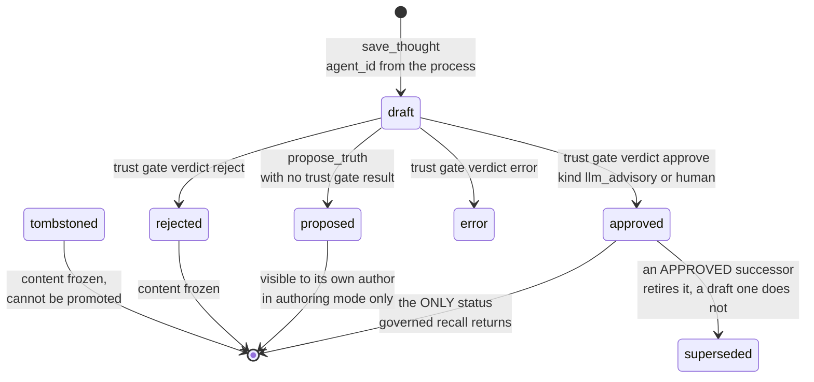

## 1. Executive Summary

FAVA Trails — *Federated Agents Versioned Audit Trail* — is an Apache-2.0 MCP
server that keeps an institutional record for agents as markdown files with YAML
frontmatter inside a Jujutsu repository. 435 commits, 14,496 lines of Python
under `src/` against 19,148 lines of tests in 41 files holding 994 test
functions. Agents never see version-control commands: the jj backend states that
*"raw jj stdout is NEVER returned to agents"* and everything passes through a
semantic translation layer.

**The design idea is in one line of `governance.py`'s docstring: "Tool arguments
select a view; they never establish a caller's authority."** A thought carries a
six-value `validation_status` — draft, proposed, approved, rejected, error,
tombstoned — and the default read returns approved records only. Two other views
exist and neither is reachable by asking. `mode="authoring"` returns the
configured agent's own drafts and raises `PermissionError` when the process has
no configured identity; `mode="history"` selects lifecycle statuses and raises
unless the process is operator-controlled. The identity itself comes from
`FAVA_TRAILS_AGENT_ID` and `FAVA_TRAILS_OPERATOR` in the server process's
environment, so a caller supplying an `agent_id` argument supplies a filter, not
a claim.

That earns four marks. `trust_state` for the status ladder, which withholds
rather than ranks. `scope_enforced` for a read scope whose key cannot be
self-asserted. `human_review` for an approval path gated on the operator flag,
which stamps `approval.kind` as `human` and distinguishes it from the default
`llm_advisory` verdict a model produces. And `negative_eval` for a governance
suite that seeds a full cross-product of statuses and authors and then asserts
exact counts against it.

The most useful thing here for a reader building something else is not the
lifecycle but the *shape of the boundary*: the authority lives in the process,
the view lives in the argument, and the module that implements the split says so
in its first line. Most systems in this corpus pass an identity in with the
request and then try to validate it.

## 2. Mental Model

A thought is a proposal that becomes part of the record only by being approved,
and once approved it is frozen. `FROZEN_STATUSES` is `{approved, rejected,
tombstoned}`, and `update_thought` refuses any of them — as it refuses a record
whose `superseded_by` is set. A correction is therefore a new record that
supersedes the old one, never an edit, which is what makes the trail an audit
trail rather than a document with history attached.

Supersession is where the design is most careful. `is_effectively_superseded`
retires a record only when its successor is *approved*:

```python
successor = records.get(key or "")
return successor is not None and successor.frontmatter.validation_status == ValidationStatus.APPROVED
```

So a draft replacement does not silently remove the current answer. Until
somebody approves the replacement, the old record is still the record. The
corpus has several stores where writing a successor hides the predecessor
immediately; this one makes hiding a consequence of approval rather than of
writing.



## 3. Architecture

One MCP server process per identity. `src/fava_trails/` holds the trail manager,
the governance layer, the transaction layer, the trust gate, a hook pipeline, a
jj backend, an HTTP runtime and a reader UI. Thoughts live under
`trails/<scope>/thoughts/<namespace>/<ulid>.md`, where the namespace is routed
from the thought's `source_type` by `NAMESPACE_ROUTES`: decisions to
`decisions/`, observations, inferences and tool output to `observations/`, and
user input to `preferences/`. Drafts sit in `drafts/` until promotion moves them.

The MCP surface is classified rather than flat. `READ_ONLY_TOOLS` is seven —
`conflicts`, `diff`, `get_thought`, `get_usage_guide`, `list_scopes`,
`list_trails`, `recall`. `DESTRUCTIVE_TOOLS` is five — `change_scope`, `forget`,
`rollback`, `supersede`, `update_thought` — and `OPEN_WORLD_TOOLS` names the ten
that reach outside the current state. A client that honours MCP annotations can
act on that classification without reading the implementation.

## 4. Essential Implementation Paths

- **Write.** `save_thought` → `refuse_obvious_secret` on the content → a
  `ThoughtFrontmatter` with a ULID, the process's `agent_id`, and
  `validation_status = draft` → written under `drafts/`.
- **Review.** `propose_truth` → trust gate policy resolved for the scope → a
  `TrustResult` carrying a reviewer, a verdict, reasoning and an
  `approval_kind`, or `None` → status set to approved, rejected or error from
  the verdict, or to `proposed` when there was no gate result
  (`src/fava_trails/trail.py:575-596`).
- **Persist.** `persist_governance` takes the repository lock and an exclusive
  file lock, recovers any interrupted write, compares every record it is about
  to overwrite against the copy the reviewer saw, writes a journal holding the
  prior text, replaces the files and commits
  (`src/fava_trails/transactions.py:150-170`).
- **Read.** `recall` → `visibility_from_arguments(arguments, runtime_principal())`
  → for each record, `visibility.allows(record, by_id)` before any scope or query
  filter runs (`src/fava_trails/trail.py:449-454`).

## 5. Memory Data Model

`ThoughtFrontmatter` (`src/fava_trails/models.py:71-97`) carries a
`schema_version`, a ULID `thought_id`, a `parent_id`, the supersession pair
`superseded_by`/`superseded_scope` and its inverse `supersedes_id`/
`supersedes_scope`, an `agent_id`, a `confidence` float bounded to `[0,1]`, a
`source_type`, a `validation_status`, an `intent_ref`, a `created_at`, a list of
typed `relationships` — `DEPENDS_ON`, `REVISED_BY`, `AUTHORED_BY`, `REFERENCES`,
`SUPERSEDES` — and a metadata block of project, branch, tags and a free `extra`
dict. The body is the thought.

Two things the model does not have are worth naming. There is **no validity
axis**: `created_at` is the only timestamp on a thought, and a search of the
package for `valid_from`, `valid_to`, `valid_at`, `occurred_at` and `as_of`
returns nothing, so `bitemporal` is withheld — the record axis is the only clock.
And `confidence` is a float that the read path never filters on; it is a number
the author asserts, kept beside the status rather than standing in for it, which
is the separation the `trust_state` mark exists to reward.

## 6. Retrieval Mechanics

The matcher is lexical substring AND, and the project documents it as such.
`docs/retrieval-baseline.md` gives the algorithm in five steps — lowercase the
query, split on whitespace, build a searchable string from content, thought id,
source type, agent id and the project, branch and tags metadata, keep a record
only when *every* query token is a substring of it, and treat an empty query as
matching everything the visibility allows. The document then says what it is
not: *"This is **lexical substring AND**, not ranking, stemming, phrase search,
or semantic similarity,"* and *"This is not a product claim about future search
work,"* with an issue link.

That is worth crediting on its own. The corpus is full of retrieval described in
language that implies scoring; this one names the exact predicate, notes that
`metadata.extra` is deliberately outside the searchable string, and observes that
punctuation attached to a token is part of the token.

**The ordering is the part that matters for the marks.** `visibility.allows` runs
first, before the scope filter and before the query match, so a record the caller
may not see is never a candidate to be ranked, filtered or counted. There is no
threshold to tune past it and no scoring stage in which a hidden record could
reappear.

## 7. Write Mechanics

Promotion is transactional and optimistic rather than locked-optimistic-free.
`propose_truth` captures the record it reviewed and passes it as `expected`;
`persist_governance` re-reads each path and raises *"Thought changed during
approval; re-review before retrying"* if the bytes differ, and `propose_truth`
raises *"Thought changed during review; re-review before approval"* if the record
moved between review and write. A stale approval cannot land on edited content,
and `tests/test_governance.py:283` pins it.

Approving a replacement does two writes in one transaction: the successor
becomes approved, and the predecessor gains `superseded_by` and
`superseded_scope`. Before that, the code refuses two competing approvals —
*"Predecessor already has an approved replacement"* — and refuses an ambiguous
predecessor — *"Replacement predecessor is missing or ambiguous"* — rather than
guessing which record to retire.

`refuse_obvious_secret` runs on content at save and
`refuse_obvious_secret_in_value` over the serialized record at promotion, so a
credential pasted into a thought is refused at the boundary rather than committed
and then regretted.

## 8. Agent Integration

The server is MCP. `FAVA_TRAILS_AGENT_ID` is set by the operator on a dedicated
process and a caller's `agent_id` must match it; the README states the
consequence plainly — *"a shared endpoint is one identity boundary"* — and the
retrieval-baseline document repeats that a shared filesystem or endpoint *"does
not cryptographically isolate concurrent callers."* A report that has to state
the limit of an identity boundary usually has to be told; this one states it
twice, unprompted.

A hook pipeline exposes `BeforeSave`, `AfterSave`, `BeforePropose`,
`AfterPropose`, `AfterSupersede`, `OnRecall` and `OnStartup` events, and three
paper-derived protocols ship as hook packages installed by
`fava-trails protocol setup`: SECOM compression
([arXiv:2502.05589](https://arxiv.org/abs/2502.05589)), ACE playbook reranking
([arXiv:2510.04618](https://arxiv.org/abs/2510.04618)) and RLM MapReduce
lifecycle hooks ([arXiv:2512.24601](https://arxiv.org/abs/2512.24601)). They are
implemented rather than declared — SECOM is 351 lines with `before_propose` and
`before_save` handlers, ACE 522 across its module and rule engine — and they are
opt-in rather than default, which the report states because an unwired protocol
directory is the shape this corpus most often finds.

## 9. Reliability, Safety, and Trust

**Trust state — awarded.** Six stored values, of which exactly one is visible to
the default read. `draft` and `proposed` are withheld from everyone but their own
author, and `rejected`, `error` and `tombstoned` are withheld from everyone
without an operator endpoint. A rejected thought is not ranked down; it is not
there.

**Scope enforced — awarded, and the producer test is the interesting part.** The
principal is built by `runtime_principal()` from two environment variables under
a comment reading *"Configured by the operator on a dedicated process, never by a
tool call"*, and `Visibility.allows` compares `fm.agent_id` against
`self.principal.agent_id` for the authoring view. The committed case is explicit:
with the process configured as `alice`, a `save_thought` passing
`agent_id: "bob"` errors, and `get_thought`, `update_thought`, `propose_truth`
and `supersede` against bob's draft all error with bob's content absent from the
serialized response (`tests/test_governance.py:98-119`).

**Human review — awarded, and the distinction it turns on is worth stating.** The
default reviewer is a model: `TrustResult.reviewer` is documented as
`"llm-oneshot:<model>" or "human:<user_id>"` and `approval_kind` defaults to
`llm_advisory`. An explicit human approval exists, and passing
`approval="human"` is not enough — `tools/navigation.py:126-145` raises
*"Explicit human approval requires an operator-controlled endpoint"* unless the
process carries both the operator flag and an agent id, neither of which a tool
call can set. The argument selects the path; the environment grants the
authority. `tests/test_governance.py:292-306` runs the same call twice, failing
without `FAVA_TRAILS_OPERATOR` and succeeding with it, then asserts the stored
`approval.kind` is `human`.

The honest limit is that the *default* is advisory and a model produces it. What
the design gets right is refusing to blur them: the record says which kind of
approval it was, so a reader of the trail can tell a model's verdict from a
person's.

**Negative eval — awarded.** `tests/test_governance.py` seeds a full
cross-product — two scopes, all six statuses, two authors, twenty-four records —
and then asserts exact counts against it: `test_default_recall_only_current_approved`
requires precisely two thoughts for one scope and four across two, and that the
status set of what came back is exactly `{"approved"}`. It cannot pass on an
empty result. Beside it, `test_direct_and_global_lookup_do_not_leak_hidden_records`
is parametrized over all five non-approved statuses and asserts the record's
*content string* is absent from the serialized response, for both the real scope
and a nonexistent one — a leak assertion on the payload rather than on an id
list.

**Audit log — withheld, and the reason is a definitional boundary rather than an
absence.** Every governance mutation is a commit in the trail's own Jujutsu
repository, with a message naming the thought and its new status, written inside
a transaction that journals the prior text first. That is a real, durable,
append-only record of what changed. The mark requires an append-only event record
of memory mutations in the system's own store and explicitly does not count
version-control history, and this atlas applied the same exclusion to
[DiffMem](../diffmem/), which called it *"the purest case"*. FAVA is the second.
The per-record `trust_gate` and `approval` blocks in the frontmatter are
provenance on the row rather than a log, and the journal
(`transactions.py:163-165`) is crash recovery, removed on success.

**Tombstone — withheld.** `tombstoned` is a terminal lifecycle state on a record:
it freezes content and blocks promotion (*"Cannot promote a tombstoned
thought"*), keyed on the thought id. The mark asks for a record keyed on the
rejected *value* and consulted before a new write, so that the same content
cannot return under a fresh id. `duplicates.py` hashes content, but its own first
line scopes it out — *"Operator-only, exact-plan duplicate maintenance; never
invoked by MCP tools."*

**What the transaction layer defends, and what it does not.**
`persist_governance` recovers an interrupted write on the next entry, holds an
exclusive file lock, and fails a read that arrives mid-persistence rather than
serving a torn view — `test_read_during_persistence_fails_closed_until_complete`
and `test_process_death_mid_approval_keeps_old_view_and_recovers`, the latter
killing a real subprocess. What it does not defend is the boundary the project
names itself: a shared endpoint is one identity, and concurrent callers on it are
not isolated from each other.

**Egress is disclosed rather than assumed.** When the trust gate sends a
candidate to a model, `describe_trust_gate_egress` produces a notice naming the
destination, the model and which fields are sent, *"never includes API keys, key
file paths, or secret values"*, and the human-approval path emits its own notice
saying no candidate content was transmitted. A review step that ships content off
the machine is a privacy event, and this one announces itself.

## 10. Tests, Evals, and Benchmarks

994 test functions across 41 files, 19,148 lines against 14,496 lines of source.
`tests/test_governance.py` is the file to read: 22 cases, almost all adversarial,
named for the property each pins — that an unconfigured endpoint cannot widen
visibility, that relationship expansion cannot reveal private or unselected
authoring records, that a stale review cannot approve edited content, that MCP
stamps the server identity and prevents forged provenance, and that a legacy
backlink to an unapproved successor does not hide truth.

The retrieval baseline in `docs/retrieval-baseline.md` with
`tests/test_retrieval_baseline.py` beside it is a synthetic benchmark of the
implemented matcher, and it is careful to be nothing more: it states the
algorithm, states that it is not ranking or semantic similarity, and links the
issue tracking future search work.

**No paper describes this system.** Three papers are cited and implemented as
optional protocols, and those are other people's results applied here rather than
claims about FAVA; a search for `arxiv`, `bibtex`, `@article`, `@misc`,
`citation` and `doi.org` across the markdown, `.cff` and `.toml` files returns
only those three plus their protocol READMEs, and `find . -iname 'CITATION*'`
returns nothing. The README's own claims are about the release status of the
governed-read model, not about measured performance.

## 11. For Your Own Build

- **Put the authority in the process and the view in the argument.** One
  docstring line — *"Tool arguments select a view; they never establish a
  caller's authority"* — and a `runtime_principal()` that reads the environment
  is the whole mechanism. It costs less than validating a caller-supplied
  identity and cannot be argued with by a caller.
- **Make a mode that needs authority raise, not narrow.** `Visibility.__post_init__`
  raises `PermissionError` for `authoring` without a configured identity and for
  `history` without an operator, rather than silently downgrading to the governed
  view. A silent downgrade would return a plausible, wrong, smaller answer.
- **Retire a record on approval, not on writing.** `is_effectively_superseded`
  requires the successor to be approved, so a draft replacement cannot remove the
  current answer. The failure it avoids is a store that goes blank between a
  correction being drafted and being accepted.
- **Freeze content at the terminal statuses.** Once approved, rejected or
  tombstoned, a record cannot be edited, so corrections are new records and the
  trail stays a trail.
- **Compare against what the reviewer saw.** Carrying the reviewed copy into the
  write and refusing when the bytes changed turns an approval into a decision
  about a specific text rather than about an id.
- **Write down what your matcher actually is.** The retrieval baseline document
  is a model: the exact predicate, what is excluded from it, and an explicit
  statement that it is not a product claim.

## 12. Open Questions

- The default review is a model, and the record marks it `llm_advisory`. Nothing
  in the tree requires a human pass before a record becomes institutional, so an
  operator who never sets `FAVA_TRAILS_OPERATOR` runs a trail approved entirely
  by an LLM one-shot — correctly labelled, and still the default.
- `confidence` is stored, bounded and never read on the retrieval path. It is
  either a field awaiting a consumer or documentation of the author's state at
  write time; the code does not say which.
- A shared MCP endpoint is one identity boundary, which the project states twice.
  What it means for a team is that per-agent isolation requires per-agent
  processes, and nothing in the tree enforces that deployment.
- The published PyPI release is 0.6.0 while the governed-read model described
  here is the unreleased 0.7.0 tree; the README says so and points at
  `fava-trails version`. A reader installing from PyPI today gets a different
  visibility model from the one this report analyses.

## Appendix: File Index

- Governance: `src/fava_trails/governance.py` (140 lines — `Principal`,
  `runtime_principal`, `Visibility`, `is_effectively_superseded`).
- Trail manager: `src/fava_trails/trail.py` — `recall` (425-480), `get_thought`
  (297), `FROZEN_STATUSES` (305-309), `update_thought` (311), `propose_truth`
  (540-640), `forget` (647), `sync` (652), `rollback` (668).
- Transactions: `src/fava_trails/transactions.py:150-170` — `persist_governance`.
- Trust gate: `src/fava_trails/trust_gate.py` (587 lines) — `TrustResult`
  (253-266), egress disclosure (112-234), `review_thought` (477).
- Tools: `src/fava_trails/tools/{recall,thought,navigation}.py`; human approval
  at `navigation.py:126-145`.
- Model: `src/fava_trails/models.py` — `ValidationStatus` (43-50),
  `RelationshipType` (52-58), `ThoughtFrontmatter` (71-97), `NAMESPACE_ROUTES`
  (204-210).
- VCS: `src/fava_trails/vcs/jj_backend.py` — *"Raw jj stdout is NEVER returned to
  agents."*
- Protocols: `src/fava_trails/protocols/{secom,ace,rlm}/`.
- Tests: `tests/test_governance.py` (429 lines, 22 cases),
  `tests/test_retrieval_baseline.py`.
- Docs: `docs/governed-recall.md`, `docs/retrieval-baseline.md`.

**Searches recorded for the negative claims**

```sh
grep -rn 'valid_from\|valid_to\|valid_at\|occurred_at\|as_of' --include='*.py' src/   # 0: no validity axis, created_at is the only clock
grep -rn 'confidence' --include='*.py' src/ | grep -iE 'filter|where|>=|threshold'    # 0: confidence is stored and never filtered on
grep -riE 'arxiv|bibtex|@article|@misc|citation|doi\.org' --include='*.md' --include='*.cff' --include='*.toml' .  # 3 papers, all cited for optional protocols
find . -iname 'CITATION*' -not -path './.git/*'                                       # 0
grep -rn 'approval_kind' --include='*.py' src/                                        # 3 sites: the dataclass, the two stamps, and one producer of kind="human"
grep -rn 'duplicates' --include='*.py' src/ | grep -v 'duplicates.py'                 # no MCP tool path reaches the content-hash utility
```

## History

**2026-09-19** — re-read at the same pin [`10f689f7455c0c5c5898f2a2e6bc8cf4fe84a6d7`](https://github.com/MachineWisdomAI/fava-trails/commit/10f689f7455c0c5c5898f2a2e6bc8cf4fe84a6d7), still the tip. **All four marks hold.** The first reading was made on 2026-09-17, a day before the `human_review` wording narrowed, so the mark was re-tested against the current rubric and the record now names where the authority lives. `approval="human"` is refused unless `runtime_principal()` reports both the operator flag and an agent id, and those come from `FAVA_TRAILS_OPERATOR` and `FAVA_TRAILS_AGENT_ID` read from the process environment (`src/fava_trails/governance.py:24-29`) under a docstring that states the rule: *"Configured by the operator on a dedicated process, never by a tool call."* A tool call cannot set the environment of the process serving it, so the gate is structural rather than a string the caller supplies — which is the distinction this atlas has spent the sweep drawing. `tests/test_governance.py:292-306` still runs the same call twice, failing without the operator flag and succeeding with it, then asserts the stored `approval.kind` is `human`. Screened again first; nothing installed or run.

**2026-09-17** — [`10f689f7455c0c5c5898f2a2e6bc8cf4fe84a6d7`](https://github.com/MachineWisdomAI/fava-trails/commit/10f689f7455c0c5c5898f2a2e6bc8cf4fe84a6d7) — first reading, at the head of `main`, 435 commits in. Screened with `scripts/screen_repo.py` before any file was opened: one auto-run surface (`.vscode/settings.json`), two manifests inside the seven-day cooldown, one build-time execution path (`tests/conftest.py`, which runs on pytest collection), and two agent-directed files (`AGENTS.md`, `CLAUDE.md`) read as data. Nothing was installed, built or run — no `uv`, no `pytest`, no jj repository created. Four marks awarded; `audit_log` withheld on the version-control-history exclusion, following [DiffMem](../diffmem/), `tombstone` withheld because `tombstoned` is keyed on the record rather than the value, and `bitemporal` withheld because `created_at` is the only clock. Every figure here comes from reading the tree; the retrieval-baseline document is the project's own and is attributed as such.
