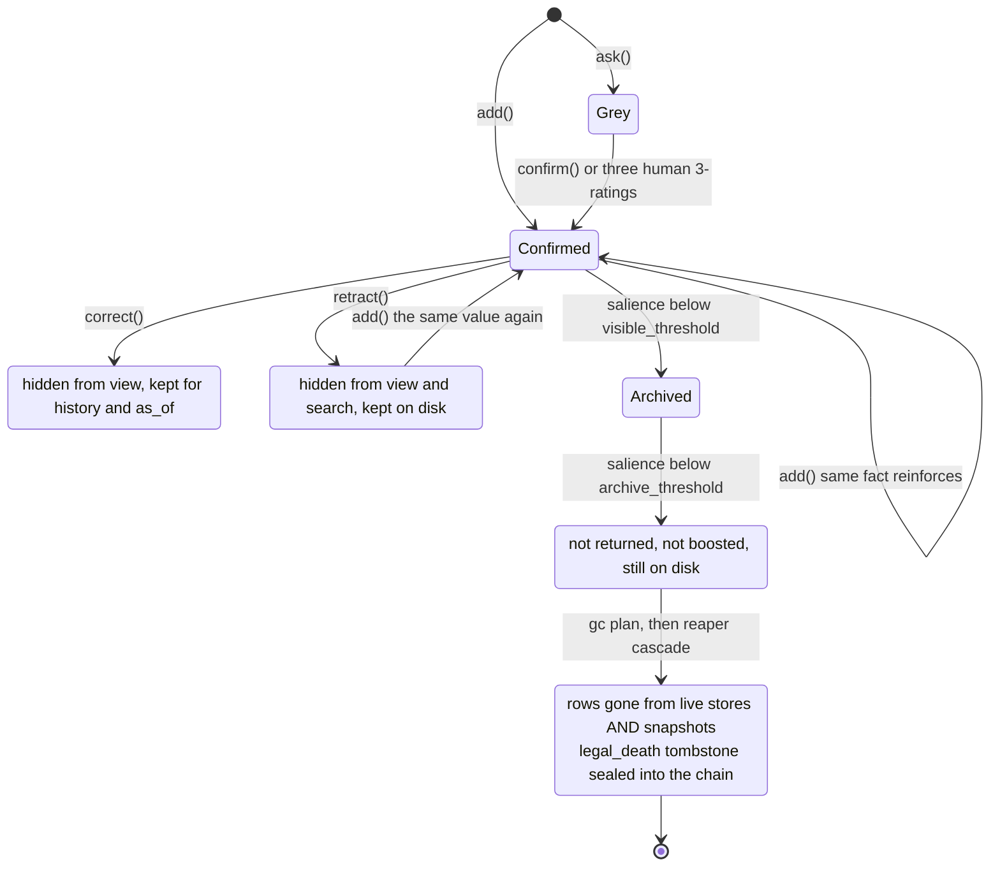

## 1. Executive Summary

feltstate is a character engine for long-running companion agents: persistent
affect appraised outside the reply model, and a memory whose entries fade,
strengthen, are corrected, are retracted, or die. MIT, ~25,400 lines of Python
across 60 commits, 528 tests, no database — every store is line-delimited JSON.

**The memory is a decaying 5W1H fact store.** A record carries
`who/what/why/when/where` plus `intensity`, `confidence`, `recalls` and a
reinforce count, and the salience it is shown at is recomputed on every read:
`base − age×decay + reinforce×boost + min(cap, recalls×each)`. Two
short-circuits bound it — a fact born above `permanent_above` never decays, and
the result buckets into visible / archived / forgotten. Writing the same fact
again reinforces rather than duplicates it.

**Four exits, and they are genuinely different.** Decay past a floor makes a fact
invisible while it stays on disk. `correct` supersedes the old version.
`retract` marks it, keeping the record auditable. And a real death is real:
`gc` computes a plan, `reaper` executes a five-step fsynced cascade that removes
the rows from the live stores *and from every snapshot*, with the module opening
on the reason — most systems "forget" by setting a flag, so *"the store never
shrinks, the past never leaves, and — for a companion that people confide in —
anything anyone ever said is still on disk."*

**A hash-linked ledger sits over all of it, and its fail-safe direction is the
right one.** `chain.py` patrols any jsonl store, appending links that hash the
previous link, the diff payload *and* the full state snapshot. Added rows are
births; mutated sealed text is an alarm; a missing row is checked against the
`legal_death` tombstones the reaper drops, so a lawful death is distinguishable
from an evaporation. Delete a real tombstone and the next patrol alarms — *"it
cannot go silent."*

**Five of the seven marks, and the two it misses are the interesting ones.** It
has no scope key of any kind — `region` separates facts from skills and `actor`
is an optional filter, so this is one store for one companion by construction.
And despite holding content fingerprints, real tombstones, and a store that
records every withdrawal, it does not have a rejected-value tombstone. The
docstring says why in one line: *"Retracted / superseded entries are ignored when
matching, so retract-then-readd yields a fresh active fact."* The system knows a
value was withdrawn and never consults that knowledge on the next write.

## 2. Mental Model

A fact is born into one of two rooms — the grey zone if it is a hunch, the
confirmed store if it is settled — and from then on its visibility is a
continuously recomputed number rather than a status. Status is what *people* and
*corrections* do to it: confirm, correct, retract. Death is a separate authority
entirely, computed by a judge and executed by an executioner, and witnessed by a
ledger that can tell a lawful death from a disappearance.

The gap is on the way back in. Every exit is well-built and none of them is
consulted by the entrance.

The last transition is the finding. `retract` is hiding, not refusal — and
because matching ignores retracted entries, the same value written again does
not reinforce the retracted row or trip anything. It becomes a fresh active
fact.

## 3. Architecture

Nothing runs and nothing is installed but the package. `pip install feltstate`,
Python 3.10+, one `pyproject.toml` with no lockfile beside it. Every store is a
jsonl file the caller names; the library *"will not print and will not phone
home."*

The pieces: `memory/canon.py` (the fact store), `memory/skill.py` (a skill region
inside it), `memory/keyweb.py`, `memory/lifecycle/` (the eight modules that make
death safe), `affect/`, `dream.py`, `sleep.py`, `timeawareness/`, `render/`.

An operator stands this up by calling it. There is no daemon, and the lifecycle
modules are explicitly *"explicit tools plus human ratings; no hidden daemon or
background rewrite pass."*

## 4. Essential Implementation Paths

- **Write.** `Canon.add` / `Canon.ask` → dedup by `(actor | object)` → reinforce
  or append, under a reentrant path lock held across load → match → rewrite so a
  concurrent write cannot be erased by a stale snapshot.
- **Read.** `Canon.search` → filter to active and to `region` → substring match →
  recompute salience → sort → increment `recalls` and persist.
- **Correct / retract.** `correct` writes a new entry and sets `_superseded_by`
  on the old; `retract` sets `_retracted`. `_is_active` is the single predicate
  both read paths consult.
- **As-of.** `Canon.as_of(keyword, when)` walks confirmed entries and returns
  those whose `valid_at ≤ when` and whose `invalid_at` is unset or later.
- **Death.** `lifecycle/gc.resolve_deaths` is a pure function returning a plan
  keyed by `mid`; `lifecycle/reaper.execute` runs the cascade;
  `lifecycle/chain.Chain.patrol` witnesses it.
- **Distillation.** `lifecycle/smelt.smelt` gates a candidate summary against its
  source rows with a zero-LLM consistency check before committing.

## 5. Memory Data Model

The record is a 5W1H dict. Sealing is optional and is where the design is most
careful: `fingerprint.py` writes a **birth fingerprint** carrying the source
pointers, the affect present at the moment of writing, and a UTC timestamp,
hashed into an `fp_id`.

**Two ids, and the distinction is stated as load-bearing.** `mid` is the memory's
unique instance id — *"every edge, plan and deletion keys off `mid`."* `fp_id` is
a content hash of the immutable core, and the module is explicit that it is *"an
integrity checksum, never an identity"*, because *"keying identity off content is
how a collector ends up deleting every row that happens to hash alike, so we
never do it."*

The record has two layers with opposite contracts: an **immutable core**
(`source_ptrs` + `birth_affect` + `ts`) inside the hash, and a **living
genealogy** (`src`, `lineage`) outside it, so pruning a dead branch of ancestry
*"is a life event, not forgery, and never breaks the seal."* The honest caveat is
stated too — an unkeyed content hash is not authentication, and the trust anchor
is external: the chain bites each `fp_id` into its ledger, so a recomputed hash
surfaces as a mutation on the next patrol.

Bi-temporality is real. `valid_at` and `invalid_at` form a validity window
distinct from the record `ts`, and `as_of` answers *"last month, what did you
think my job was?"* — the belief that was active then, even after correction.

## 6. Retrieval Mechanics

Substring match over the record text, filtered to active entries and to a
`region`, then ordered by the recomputed salience. There is no embedding, no
index and no ranker beyond the salience formula — for a store sized to one
companion's life that is a defensible choice, and it is the ceiling on how large
this design goes.

A hit **writes**: `search` increments `recalls` on every matched fact and
persists it, so a fact you keep looking up decays more slowly. Facts below the
archive floor are neither returned nor boosted, which keeps the feedback loop
from resurrecting something already gone.

Skills retrieve differently and better. `recall_skills` selects
**probabilistically, weighted by rating** — proven skills win most, *"but a low
one keeps a non-zero chance to be re-tried and redeem itself — so no skill
monopolises and a newly-good one can rise."* That is an explore/exploit answer to
the lock-in problem most usefulness-ranked stores have.

## 7. Write Mechanics

Writes are synchronous, explicit and blocking; there is no queue and no
background rewrite. The store never injects anything into a prompt on its own —
*"memory is a tool, not a controller."*

Two gates are worth naming. `smelt` refuses to commit a distilled summary that
fails a zero-LLM consistency check against its sources, and on `reject` it leaves
the sources live so the caller can re-summarise. And the skill region's
promotion gate is a human verdict rather than an automatic signal, for a reason
the module states with its rejected alternatives attached: what matters is
whether a skill was *useful*, *"which 'did it execute' can't tell you and an
emotion reading can't reliably tell you either (both were tried and rejected)."*

## 8. Agent Integration

A library, not a server. The agent calls the tools; affect is appraised by a
component the reply model cannot author, and the engine returns compact state as
*context* rather than as behavioural instruction. `dream.py` is the unusual one —
it recombines affect-tagged material associatively and leaves only a mood
residue whose cause is deliberately not surfaced to the reply model — and it is
scoped with unusual discipline for the subject matter: whether that resembles
anything subjective is *"outside the scope of this library — the mechanism is
prompt/interface design."* The README opens with the same disclaimer.

## 9. Reliability, Safety, and Trust

The lifecycle is the strongest part of this system and among the more careful
deletion contracts in this atlas.

`reaper` orders its cascade to survive a power cut at any step: fsync the pending
ledger (its presence means a deletion is in flight, and a fresh boot replays it),
append and fsync the `legal_death` tombstone *before* anything disappears, delete
from the live stores, purge the same rows from every snapshot, then clear the
pending marker. Everything keys off a `txid`, so replay produces exactly one
tombstone and one deletion. The snapshot step is stated as a policy rather than
an optimisation: *"No regret medicine: disaster copies survive crashes, they do
not resurrect the forgotten."*

`gc` is the judge and never touches a file — a pure computation returning a plan
— with authority flowing downhill: a distilled lesson outranks the facts it grew
from, and source material dies last, only when nothing alive references it.

`chain` is the witness, and its treatment of what to seal is the detail worth
copying. Only immutable things are hashed in; metadata that is *supposed* to
evolve — recall counts, decay state, pruned lineage — stays out, *"so living
never looks like tampering."* A tamper-evident log that alarms on ordinary use
gets muted, and this one is built not to.

Against that, there is no scope key. One store, one companion; a second user is
not a configuration but a second deployment.

## 10. Tests, Evals, and Benchmarks

528 tests across 40 files, against ~25,400 lines. There is **no paper**, no
benchmark and no retrieval-quality evaluation — which for a substring-matched
store of one person's life is a smaller gap than it sounds, and the report says
so rather than leaving a reader to infer it.

**The negative cases are the notable part, and one of them is rare.**
`test_correct_supersedes_old_keeps_new_visible` asserts that after a correction
the superseded value is **absent** from the view while the new one is present —
an assertion about a *corrected* value, which by the rubric's own note only two
other systems in this corpus commit. `test_retract_hides_fact_but_keeps_record`
asserts the retracted value is gone from both `view` and `search` **and** that
the record physically remains on disk with its `_retracted` marker, pinning the
read/audit split in one case. `test_forgotten_facts_are_not_returned_or_boosted`
covers the decay floor on three read paths at once.

`test_lifecycle.py` pins the death contract: the cascade removes the dead row
from the store *and the snapshot*, prunes the survivor's lineage, and a replay
under the same `txid` is idempotent with exactly one tombstone.
`test_reaper_fails_closed_on_malformed_pending` asserts a malformed pending
ledger raises and is *"not silently discarded"*, and
`test_chain_seals_state_against_tail_forgery` forges both the row and the last
link's stored state and requires verification to fail anyway.

I did not run the suite.

## 11. For Your Own Build

### Steal

- **Seal only what is supposed to be immutable.** The chain hashes sealed text
  and fingerprint ids and deliberately leaves recall counts, decay state and
  pruned lineage out, *"so living never looks like tampering."* A tamper-evident
  log that fires on ordinary use is a log people turn off.
- **Get the fail-safe direction right.** A missing row is lawful only if a
  tombstone vouches for it, and the tombstone is sealed *into* the chained
  payload rather than merely asserted by a deletable line — so deleting the
  tombstone makes the next patrol alarm rather than go quiet.
- **Write the tombstone before the deletion, and key the whole cascade on a
  txid.** Pending marker fsynced first, tombstone second, rows third, snapshots
  fourth, marker cleared last. Replay is then idempotent by construction.
- **Purge the backups too, or say you do not.** Deleting from the live store
  while snapshots keep the row is a deletion that is not one.
- **Separate the judge from the executioner.** `gc` is a pure function returning
  a plan; `reaper` is the only thing that touches a file. The death policy
  becomes testable without a filesystem.
- **Rate skills by human verdict after the task, not by execution success.** Both
  alternatives were tried here and rejected, and the module says which.
- **Select procedural memory probabilistically by rating.** Proven skills win
  most of the time and a poor one keeps a path back, so the library cannot lock
  itself in.

### Avoid

- **Treating retraction as hiding.** Every exit here is carefully built and none
  of them is consulted on the way back in: a retracted value re-asserted becomes
  a fresh active fact, because matching skips retracted rows. The store already
  holds the record that would prevent it.
- **Two ids where one will be mistaken for the other.** The project handles this
  correctly and documents why, which is itself the warning: a content hash used
  as an identity deletes every row that hashes alike.
- **Assuming one store means one user.** There is no scope key, so multi-user is
  a second deployment rather than a parameter, and nothing in the read path would
  catch the mistake.

### Fit

Take this if you are building one long-running companion for one person, you
want its memory to be inspectable jsonl you can read, and you care that deletion
is real and provable. The lifecycle is the reason to adopt it: few libraries at
this size ship a crash-safe deletion cascade, snapshot purging, and a
tamper-evident ledger that distinguishes a death from a disappearance.

Walk away if you need multi-tenancy, if your corpus will outgrow substring
matching over a jsonl file, or if your correction requirement is that a
withdrawn value stays withdrawn against an automatic writer. The first two are
scale ceilings the design accepts on purpose. The third is one fingerprint
lookup away and is the single change that would move this system from five marks
to six.

## 12. Open Questions

- The store already writes a durable record of every retraction. What breaks if
  `_write_or_reinforce` consults it — a confirmation prompt, a grey-zone
  demotion, or a refusal?
- `fp_id` exists and is deliberately not an identity. Is it also the right key
  for a *refusal*? The two uses are separable: keying identity on content is the
  hazard the module names, while keying a refusal on content is what makes a
  withdrawal survive re-derivation.
- `search` increments `recalls` and persists on every hit. What does a noisy
  read pattern do to salience over a year, and is there a read that should not
  count?
- Skills auto-promote on three "3" ratings with no "1". What happens to a skill
  that is excellent in one context and useless in another, given ratings are
  per-task and shared across the skills a task used?
- The dream residue is deliberately uncaused from the reply model's view. How
  would an operator debug an agent that woke up unsettled for a reason nothing
  surfaces?

## Appendix: File Index

**Memory**
- `feltstate/memory/canon.py` — the 5W1H store: decay, dedup, grey zone,
  `correct`, `retract`, `history`, `as_of`
- `feltstate/memory/skill.py` — the human-rated skill region and its promotion
  and retirement rules
- `feltstate/memory/keyweb.py`, `context.py`, `extract.py`, `feeling.py`

**Lifecycle**
- `lifecycle/gc.py` — the death judge, a pure plan over `mid`s
- `lifecycle/reaper.py` — the crash-safe cascade and snapshot purge
- `lifecycle/chain.py` — the hash-linked tamper-evident ledger
- `lifecycle/fingerprint.py` — birth records, and the `mid` vs `fp_id` split
- `lifecycle/smelt.py` — distillation gated by a zero-LLM consistency check
- `lifecycle/consistency.py`, `clocks.py`, `drill.py`

**Engine**
- `feltstate/engine.py`, `state.py`, `affect/`, `dream.py`, `sleep.py`,
  `timeawareness/`, `render/`

**Tests**
- `tests/` — 528 tests across 40 files; `test_canon.py` and `test_lifecycle.py`
  carry the correction, retraction and death contracts

## History

**2026-08-16** — [`45b1c9824326669f7e1855097a3bfe01192084ed`](https://github.com/Morephine/feltstate/commit/45b1c9824326669f7e1855097a3bfe01192084ed) — First reading, at 60 commits. Screened first: 0 auto-run surfaces, 0 build-time execution paths, one `pyproject.toml` with no lockfile beside it; nothing was installed or run. Five marks — `trust_state`, `bitemporal`, `audit_log`, `human_review`, `negative_eval`. Two withheld and both stated in place: there is no scope key of any kind, and the rejected-value tombstone is absent by a documented decision rather than an omission, since matching ignores retracted and superseded entries so the same value re-asserted yields a fresh active fact. No paper.
