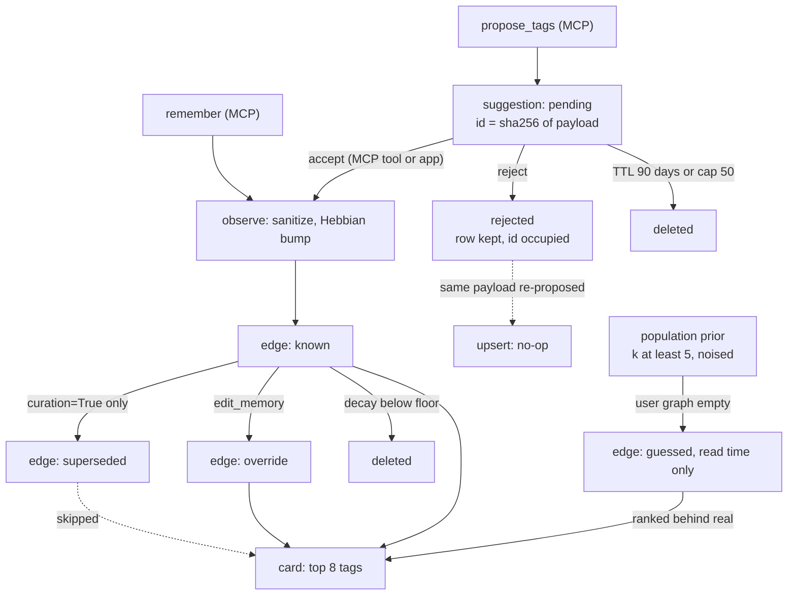

## 1. Executive Summary

FERNme is a personalization memory for agents that act for many users. Each user on each site is a sparse graph of namespaced tags weighted 0 to 9, written by arithmetic rather than a model, recalled by spreading activation into an eight-tag card of roughly 40 tokens, and editable, exportable and deletable by the person it describes. It ships as a Python library, an MCP server packaged as Claude Code and Codex plugins, a REST API and a React graph UI.

What is notable is how much governance sits around a small core. Writes are consent-gated and audited in an HMAC chain. Agent-inferred tags can be queued as `pending` suggestions rather than written, and a rejected suggestion stays rejected because its id is a hash of its content. A population prior gives a new user a cold-start card while keeping single-holder traits out.

What is weak is the distance between the library and the shipped MCP surface. The local server registers `accept_canonicalization_suggestion` beside `propose_tags`, so the producing agent can approve itself. Its `remember` and `recall_card` tools default every timestamp to 0, which switches off read-time decay and latest-value-wins. Curation, which produces the `superseded` state, is off in every entry point.

Four marks: `tombstone`, `trust_state`, `audit_log` and `negative_eval`. Section 9 names the three withheld and why.

The project is a single-author research preview. Its `PAPER.md` and `paper/main.tex` are a preprint draft with no arXiv identifier, and the README states its benchmarks are synthetic or LLM-authored.

## 2. Mental Model

A memory is a tag such as `pref:oat_milk` or `!likes:dairy` (a leading `!` is a dislike), held as an `Edge` on one user's graph at one site (`fernme/core/graph.py:9-21`). The edge is not a sentence. Its text lives in the Cabinet, an append-only event table the `recall_events` tool searches. Belief is graded by weight and confidence and gated by a discrete `source`.

A tag becomes a belief in one of two ways. `remember` writes it at once: the agent declares `stated` or `inferred` provenance, `observe` bumps the weight along a saturating curve, and the edge is `known` (`fernme/write/hebbian.py:16-50`). `propose_tags` instead stores a `pending` suggestion that changes nothing the card reads until `accept_suggestion` replays it through `observe` as `inferred` (`fernme/service.py:2246-2300`).

A belief stops being one in five ways. Opt-in curation demotes a displaced value to `superseded` and the card skips it. A decay pass, or the read-time fade, drops it below the floor. The user pins it with `edit_memory` as an `override`. `forget_me` deletes the user. A rejected suggestion never becomes a belief and cannot be proposed again under the same payload.

Two other sources reach the card without being written by this user. A brand-new user's empty graph is seeded at read time with `guessed` edges from the site's population prior. And the site-wide association graph, which other users' co-occurrences feed, shapes which of the user's own tags win the eight slots.

## 3. Architecture

FERNme is one Python package around `FernService` (`fernme/service.py`, 3,429 lines), which every entry point instantiates. The service holds a store, a `Config` dataclass and a per-install secret, and every load-modify-save method runs inside the store's transaction (`fernme/service.py:141-170`).

Two stores implement one interface. `SQLiteStore` creates 24 tables from one `SCHEMA` string (`fernme/store/sqlite_store.py:12-138`); `PostgresStore` mirrors it with advisory locks and a migration command (`fernme/store/postgres_store.py`). A `json_store.py` remains for state snapshots. Managed documents and photos are files in a vault beside the database, enabled by `fern.toml` or `FERNME_MANAGED_DOCUMENTS`.

Three entry points read the same database. `fernme-mcp` builds a FastMCP server from tool groups `core`, `documents` and `photos`, over stdio by default or over HTTP with one token per remote agent (`fernme/api/mcp_server.py:738-792`, `fernme/api/remote.py`). `fernme/api/rest.py` serves the REST API and the React SPA under `/ui`. The library is the third, and the only one that can set `curation`, `entities` or `enrichment_enabled`.

Nothing runs in the background. `FernService.decay` and `forget_everywhere` have no caller in the package outside the evaluation modules; the population prior is rebuilt by `POST /prior_refresh` or by an erasure.

### Deployment and ergonomics

Nothing has to be running beyond a Python process: the default store is `~/.fernme/fernme.db`, created on first use, and no API key or model is needed to store anything. The shipped plugin config runs `uvx` against the `v0.4.2` tag. The SQLite file is readable with any client, the REST API exports a user as JSON, and `export_memory` writes the export to an `exports` folder next to the database. The README warns against cloud-synced folders. Postgres is the documented production store.

## 4. Essential Implementation Paths

**Capture.** `remember` (`fernme/api/mcp_server.py:376-406`) calls `near_duplicate_tags` and `FernService.observe` (`fernme/service.py:521-583`). `observe` requires consent, runs `sanitize_tags` (`fernme/safety.py:26-43`), maps the event through the site catalog, optionally canonicalizes through a vocabulary, and calls the Hebbian `observe` (`fernme/write/hebbian.py:16-58`). It then runs `_curate` when enabled, saves the user graph and touched association pairs, appends the event, and appends an audit entry.

**Proposal and review.** `propose_tags` (`fernme/service.py:2335-2378`) canonicalizes and sanitizes, caps document-linked proposals at eight tags, and enqueues a `tag-proposal`. `list_suggestions` purges expired pending rows, regenerates alias-merge, entity-link and re-kind candidates from the graph (`fernme/service.py:2195-2232`, `fernme/curation_queue.py:167-229`), and returns `pending`. `accept_suggestion` dispatches on kind (`fernme/service.py:2246-2301`); `reject_suggestion` only flips the status (`fernme/service.py:2315-2321`).

**Retrieval.** `recall_card` calls `FernService.card` (`fernme/service.py:781-798`). It loads the user, applies the cold start when the graph is empty, loads the association neighbourhood with cross-user suppression (`fernme/store/sqlite_store.py:532-595`), and compiles through `compile_card` (`fernme/retrieve/card.py:152-202`) or, with entities on, `compile_entity_card`. Settings are attached last.

**Correction and deletion.** `edit_memory` writes an `override` edge (`fernme/service.py:1966-1982`). `forget_me` calls `delete` (`fernme/service.py:2035-2040`), which purges files, deletes the user's rows from 19 tables (`fernme/store/sqlite_store.py:409-459`) and recomputes the prior if one exists. Withdrawing consent does the same through `consent`.

**Tests.** `tests/test_canonicalization_queue.py`, `tests/test_curation_integration.py`, `tests/test_salience.py`, `tests/test_privacy_fixes.py`, `tests/test_audit.py`, `tests/test_mcp_agent_safety.py` and `tests/test_remote_mcp.py` carry the memory-specific behaviour.

## 5. Memory Data Model

`user_edges` is keyed `(site, user, attr)` and holds `weight`, `confidence`, `source`, `last_reinforced`, `hits`, `fast`, `salience` and `provenance` (`fernme/store/sqlite_store.py:20-24`). Reinforcement timestamps sit in `user_history`, capped by `history_cap`. Numeric side fields sit in `user_numeric`. `events` is the Cabinet: an autoincrement id, `site`, `user`, a caller-supplied `ts`, `type`, the JSON payload and the mapped attrs.

The shared state is per site. `assoc_edges` holds tag-to-tag weights with a contributor count, and `assoc_edge_users` records which user touched which pair, so `load_assoc` can hide pairs fewer than `assoc_min_users` (2) people share unless the reader is one of them. `prior_node` and `prior_meta` hold the population prior. `identities` and `share_policy` link a person to local users across sites for the supernode.

The opt-in entity layer adds `entities`, `entity_aliases`, `entity_fields`, `entity_relations` and `relation_facts`, all keyed on site and user except `entity_fields`, which is keyed on a UUID `entity_id`. `canonicalization_suggestions` holds the review queue (`fernme/store/sqlite_store.py:83-88`). `audit` is keyed `(site, user, seq)` with `prev_hash` and `hash`.

There is no validity time. An event's `ts` is when the caller says it happened, nothing records when the row landed, and edges keep only `last_reinforced`.

## 6. Retrieval Mechanics

The card is the agent's read. `spread` seeds activation from the user's edges and the call's `context` tags, with an ACT-R base level over each tag's reinforcement history (`fernme/retrieve/activation.py:10-20`, `48`), and walks `hops` (2) steps over the association graph. `compile_card` scores each stored edge as a tuple: real before guessed, fresh before faded, then activation times prior idf plus a fast-lane and salience boost (`fernme/retrieve/card.py:161-171`). The top `top_n` (8) become a wire string such as `user:elena | pref:concise:7* …`, with `*` for known and `?` for guessed.

Only stored edges are eligible, so another user's tag cannot appear through the association graph; it can only change which of this user's tags rank first. The exception is the cold start, which adds up to eight `guessed` edges from the released prior when the user has none (`fernme/service.py:786-789`, `fernme/prior/population.py:44-55`).

Time enters through `faded_view` (`fernme/retrieve/card.py:119-149`). Read-time decay runs only when `now > 0`, and single-value slots such as `city:` show only the newest confirmed value only when no value in the slot has `last_reinforced <= 0`. The MCP `remember` and `recall_card` tools default `ts` and `now` to `0.0` and the shipped skill does not mention either, so through the default plugin both mechanisms stay off and two cities rank side by side.

`recall_events` is a SQL `LIKE` over the JSON payload, newest first, capped by `limit` (`fernme/store/sqlite_store.py:631-644`). There is no vector index.

## 7. Write Mechanics

Every write is deterministic. The tag sanitizer drops anything over 64 characters or matching `_INJECTION`, then strips characters outside `[a-z0-9_:!-]` (`fernme/safety.py:11-15`, `36-38`). The pattern includes the bare words `prompt` and `override`, so `topic:prompt-engineering` is silently discarded; the settings validator carries a narrower list for this reason, and its comment says so (`fernme/service.py:179-181`).

Deduplication is advisory. `near_duplicate_tags` returns existing spellings that differ only by separators or a plural, and the review queue offers alias merges; the new spelling is stored either way.

Conflict handling is opt-in. With `curation=True`, `_curate` runs `curation.review` per new tag: polarity, a single-value slot or a declared opposition is a conflict; a higher-authority source supersedes, a lower one raises a question, and equals resolve by time (`fernme/curation.py:105-197`, `fernme/service.py:741-762`). The displaced edge is set to the floor weight and `superseded`, and a `supersede` event is appended. No entry point enables it.

`observe` does not respect an `override`. It keeps the `source` but bumps the weight (`fernme/write/hebbian.py:34-38`), so a memory the user pinned to 0 with `edit_memory` rises again on the next `remember` of that tag. `record_outcome` and `decay` both skip overrides (`fernme/service.py:2877`, `fernme/write/hebbian.py:98`).

### Operational cost

Writes are synchronous, in one transaction, with no model call, and a memory is on the next card as soon as `observe` returns. Nothing rewrites the store in the background. The read cost is bounded: eight tags plus pinned settings, measured by the project at about 40 tokens. The card is a tool result, so where it sits in the prompt is the agent's choice.

## 8. Agent Integration

The core group registers 20 tools (`fernme/api/mcp_server.py:374-735`): `remember`, settings, consent, `recall_card`, `recall_events`, `edit_memory`, `forget_me`, the suggestion list, accept and reject, three `propose_*` tools, `record_outcome`, `why`, `export_memory` and two importers. The server instructions tell the agent to call `recall_card` at the start of a task and to treat the card as data (`fernme/api/mcp_server.py:765-777`). There is no hook; injection is the agent's call.

Profile choice is the agent's unless the operator pins it. `_enforce_profile` refuses any other `site` or `user` when `FERNME_SITE` and `FERNME_USER` are set (`fernme/api/mcp_server.py:300-337`); the shipped plugin sets neither. A remote agent's token is bound to one profile, and `REMOTE_BLOCKED_TOOLS` removes the importers and `accept_canonicalization_suggestion` from its server (`fernme/api/mcp_server.py:340-347`, `790-792`).

Consent takes two calls in local mode: the agent shows a question and calls back with `confirm=true`. `FERNME_CONSENT_MODE=inbox`, the default for remote agents, leaves approval to the owner's review queue.

## 9. Reliability, Safety, and Trust

**Provenance** is a two-value field set from the caller's `source` argument, and the curation rule that an inferred value cannot displace a stated one depends on the agent reporting honestly. `why` reconstructs observation and outcome counts from the Cabinet.

**Privacy of the prior** is engineered with care. `_released_prior` drops traits fewer than five users hold, adds bounded-mean Laplace noise seeded from the install secret, and removes sensitive namespaces (`fernme/service.py:800-827`). Erasure recomputes the prior so a removed user's unique traits leave it, which `tests/test_privacy_fixes.py` asserts per deletion route.

**Prompt injection** is handled by the tag regex and a separate filter on settings. Free text in the Cabinet is stored as data and returned by `recall_events` unfiltered.

**Concurrency** is handled by store transactions with per-site and per-user locks, and Postgres advisory locks keep audit sequence numbers gap-free.

**Withheld marks.**

- **`scope_enforced` — withheld.** Every row carries `site` and `user` and every SQL read filters on both. But the card, the primary agent read, widens when the user's own graph is empty: `card` seeds `guessed` edges from the site-wide prior (`fernme/service.py:786-789`), and `tests/test_privacy_fixes.py:27-32` asserts a newcomer's card contains `topic:hiking`, a tag only other users stored. The REST `/graph-data` route returns every consented user's edges when `user` is omitted (`fernme/service.py:3031-3036`, `fernme/api/rest.py:118-125`). The k-anonymity and noise are real privacy controls; they are not a scope predicate.
- **`human_review` — withheld.** A `pending` suggestion waits for accept, but the local MCP server registers `accept_canonicalization_suggestion` in the same core group as `propose_tags` (`fernme/api/mcp_server.py:659-664`). The skill's line that *"Accepting and rejecting are human decisions"* (`packaging/claude/plugins/fernme-memory/skills/fernme-memory/SKILL.md:27`) is prose to the model. The remote server is the passing shape — the verb is excluded and the token is bound — but the shipped plugin is local stdio.
- **`bitemporal` — withheld.** No validity interval exists on edges, events or relations.

**Audit gaps.** `forget_me` writes no audit entry, while the library's `forget_everywhere` does. `verify` cannot detect a deleted tail. The project's own docstring names the stronger design, per-user asymmetric keys (`fernme/audit.py:1-7`).

## 10. Tests, Evals, and Benchmarks

The suite has 479 pytest functions in 68 files. CI runs `pytest -q` on Python 3.10 to 3.12 (`.github/workflows/ci.yml`). The README reports 338 passed and 61 skipped without the optional extras; Postgres, FERNmark and media suites skip without their dependencies. I ran nothing.

The memory-relevant cases can fail. `test_superseded_identity_is_not_locked_in_by_salience` asserts the replacement on the card and the displaced value off it from one read (`tests/test_salience.py:211-235`). `test_single_user_trait_never_reaches_a_newcomer` asserts a common trait in and a single-holder trait out (`tests/test_privacy_fixes.py:27-33`). `test_tenant_isolation` (`tests/test_service.py:31-37`) checks a user with no prior and no memories, so its negative passes on an empty card. `test_rejected_suggestion_never_reappears` holds weights fixed, which is why the order-flip gap in section 11 is untested.

The evaluation package (`fernme/eval/`) is a synthetic harness. The unified harness writes `reports/eval_harness.json` with per-seed rows for eight regimes and five methods. I recomputed three README rows from that file — static recall@5 0.917 ± 0.118 for FERNme and 0.583 ± 0.118 for recency, abrupt drift 0.833 ± 0.186 — and they match as population standard deviations over six seeds. The README says where baselines win.

The README's table on LLM-authored profiles has no committed input or result file I could find. `PAPER.md` describes its diary dataset as both natural and about one fictional person.

## 11. For Your Own Build

### Steal

- **Make a suggestion's id a hash of its content.** A rejection then occupies the id, and every regenerator and proposer collides with it without a second lookup. Order any pair canonically before hashing, or the key moves with the data.
- **Give agent inference its own verb.** `propose_tags` beside `remember` lets the agent say "I think" without writing truth, and the accept path replays through the normal write.
- **Release a population prior only through k-anonymity and seeded noise**, and recompute it on erasure so a deleted user's unique traits leave with them.
- **Keep the audit chain content-free and outside the erasure.** Keyed references prove an edit happened without retaining the name.

### Avoid

- **Defaulting time to zero on the agent's tools.** Every mechanism that orders by recency silently degrades to frequency when the transport supplies no clock.
- **Excluding the approve verb for remote agents only.** The local agent is a producer too.
- **Matching instruction words inside data tokens.** A regex that rejects `prompt` anywhere in a tag drops legitimate memories with no signal.
- **A user override the main write path ignores.** If decay and outcomes respect a pin, observation must too.

### Fit

FERNme fits a host application that personalizes for many users with short, typed preference tags and wants a model-free write path and visible consent. It is a poor fit for an individual's coding memory: facts are tags rather than sentences, the free text is only substring-searchable, and the mechanisms that make it more than a frequency counter — curation, decay, latest-value-wins — need a library host that sets the config and supplies timestamps. Expect to own that wiring. It is one author's research preview from 2026.

## 12. Open Questions

- Does a weight flip in a live store resurface a rejected alias merge, as the payload ordering implies? Running two reinforcements after a rejection would settle it.
- Is `curation=True` meant to become the MCP default? The release notes call it additive and off by default.
- What do the README's LLM-authored profiles and their answer keys look like, and where are they kept?
- Should `forget_me` route through `forget_everywhere` so the erasure is recorded?

## Appendix: File Index

- **Storage and schema:** `fernme/store/sqlite_store.py`, `fernme/store/postgres_store.py`, `fernme/core/graph.py`.
- **Write path:** `fernme/service.py` (`observe`, `_curate`, `edit`, `record_outcome`), `fernme/write/hebbian.py`, `fernme/safety.py`, `fernme/curation.py`.
- **Review queue:** `fernme/curation_queue.py`, `fernme/service.py` (`list_suggestions`, `accept_suggestion`, `reject_suggestion`, `propose_tags`).
- **Retrieval:** `fernme/retrieve/card.py`, `fernme/retrieve/entity_card.py`, `fernme/retrieve/activation.py`, `fernme/prior/population.py`.
- **Audit:** `fernme/audit.py`, `fernme/install_key.py`.
- **Integration:** `fernme/api/mcp_server.py`, `fernme/api/remote.py`, `fernme/api/rest.py`, `packaging/claude/plugins/fernme-memory/`.
- **Tests and evals:** `tests/test_canonicalization_queue.py`, `tests/test_salience.py`, `tests/test_privacy_fixes.py`, `tests/test_audit.py`, `tests/test_mcp_agent_safety.py`, `tests/test_remote_mcp.py`, `fernme/eval/harness.py`, `reports/eval_harness.json`.

### Recorded searches

Checked against the checkout at the pinned revision.

- `grep -rn -E 'curation\s*=\s*True' --include='*.py' .` — two test files; no entry point.
- `grep -rn -E '\.decay\(|forget_everywhere\(' --include='*.py' fernme | grep -v '/eval/' | grep -v 'def '` — no match.
- `grep -rn -iE 'valid_from|valid_to|valid_at|invalid_at' --include='*.py' .` — one match, a test named for a valid token.
- `grep -rn -E 'DELETE FROM audit|UPDATE audit' --include='*.py' fernme` — no match; the tests that tamper do so directly.
- `grep -rn -i -E 'embedding|pgvector|cosine' fernme --include='*.py' | grep -v '/eval/'` — one docstring about embedding the library in a host.
- `grep -n -E '\bts\b|\bnow\b|timestamp' packaging/claude/plugins/fernme-memory/skills/fernme-memory/SKILL.md` — no match.
- `find . -path ./.git -prune -o \( -name 'hooks.json' -o -name 'hooks' \) -print` — no match.
- `git ls-files | grep -i -E 'profile|persona'` — `scripts/validate_real_profile.py` and its test only.
- `grep -rliE 'arxiv|bibtex|@article|@misc|doi\.org' . --exclude-dir=.git` — `COMPARISON.md`, `PAPER.md`, `paper/main.tex`, citing other work; `CITATION.cff` names the software.

## History

**2026-10-03** — [`320a9edf9b10cd47045a9f3007fdec07a880b895`](https://github.com/mirkofr/FERNme/commit/320a9edf9b10cd47045a9f3007fdec07a880b895) — first reading, at the head of `main` (0.4.2), a commit dated 1 October 2026. Four marks: `tombstone`, `trust_state`, `audit_log`, `negative_eval`. Screened before reading: one auto-run surface (`.claude-plugin/marketplace.json`, which points at the packaged plugins), no build-time execution point, four dependency files inside the cooldown — every file in a depth-1 clone dates to the tip — and three unpinned surfaces; `AGENTS.md` and the plugin skills were treated as data. Read with `grep` and `sed`, and the committed harness JSON parsed with the standard library; nothing installed, built or run.
