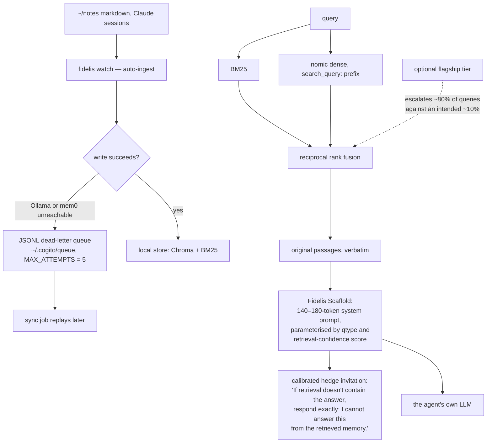

## 1. Executive Summary

Fidelis Memory is an MIT Python memory layer for Claude Code — local Chroma and
BM25 under `~/.cogito`, a nomic embedder on Ollama, an MCP install, and a
deliberate constraint: **no LLM in the default retrieval path**, and the original
passage returned verbatim rather than paraphrased.

**The reason this report exists is `WRITEUP-LONGMEMEVAL-20260423.md`, which is
the most honest benchmark document in this atlas.**

Its central section is titled *"Why this is NOT a leaderboard submission"* and
opens:

> "**The gap is not the issue. The metric is.**
>
> Mastra's published 94.87% is **QA accuracy (Task B)** — measured with
> gpt-4o-mini as both reader and judge… cogito-ergo's 96.4% is **retrieval R@1
> (Task A)**… These are different tasks. Retrieval R@1 is an upper bound on QA
> accuracy… Our measured QA accuracy with qwen-max is 54.2%…
>
> To make a legitimate leaderboard comparison we'd need to run `evaluate_qa.py`
> on our runP-v35 retrieval output using gpt-4o-mini. Estimated cost: ~$1.24.
> Blocked on OpenAI API key.
>
> **The path chosen is writeup**, not leaderboard. Honest about what we
> measured."

A project holding a 96.4% number, declining to compare it to a competitor's
94.87%, explaining precisely why the comparison would be invalid, disclosing its
own worse figure on the comparable metric, and pricing the experiment that would
settle it. No other report in this atlas records a paragraph like it.

**It then publishes three findings that are all negative results about
itself** — section 10.

**The mechanism is deliberately small**: hybrid lexical-plus-dense retrieval with
RRF fusion, returning stored text unchanged. The interesting engineering is in
what happens when it breaks — section 7.

## 2. Mental Model

Notes and sessions go into a local store. A query is answered by BM25 and dense
retrieval fused with reciprocal rank fusion, and the winning **original
passages** are handed to whatever LLM the agent already uses. Fidelis never
rewrites them.

## 3. Architecture

`src/fidelis/` is about twenty modules: `recall`, `recall_b`, `recall_hybrid`,
`recall_sessions` (the two retrieval paths and their variants), `ingest_claude_sessions`,
`watch_cmd`, `seed`, `snapshot`, `augment`, `calibrate`, `degrade`, `telemetry`,
`server`, `mcp_server`, `scaffold_server`, `cli`, `init_cmd`, and a `scaffold`
package with a `preflight` validator.

Two retrieval paths, explicitly separated by workload — an important design
decision that section 10 shows was learned the hard way:

- **Path A (`/recall`)** — atomic-fact recall over 50–200 character facts, "the
  production path".
- **Path B (`/recall_hybrid`)** — session retrieval over 2000+ character
  sessions, BM25 + dense + RRF with turn-level chunking, "tuned for
  LongMemEval".

31 test files (the README badge counts 368 CI tests), a `CITATION.cff`, a
`STATUS.md`, a `COMPLIANCE-DRAFT.md`, a Homebrew `Formula`, and Docker.

The repository is mid-rename: the product is **fidelis**, the writeup and the
store path (`~/.cogito/`) are **cogito-ergo**, and the PyPI package is
`fidelis-memory` because `fidelis` belongs to an unrelated project — which the
README states outright, with a link to the other project. Disambiguating your own
package name against a stranger's is a small courtesy almost nobody performs.

## 4. Essential Implementation Paths

**Retrieve** — `src/fidelis/recall_hybrid.py`, `recall.py`, `recall_sessions.py`.

**Survive a write failure** — `src/fidelis/degrade.py` (`MAX_ATTEMPTS = 5`,
`_queue_dir()`).

**Constrain the reader** — `src/fidelis/scaffold/_core.py`, `preflight.py`,
`docs/scaffold.md`.

**Report** — `WRITEUP-LONGMEMEVAL-20260423.md`,
`experiments/zeroLLM-FLAGSHIP-evidence/SUMMARY.json`,
`bench/RESULTS-SUMMARY.md`, `bench/BENCHMARK_INTEGRITY_AUDIT.md`.

## 5. Memory Data Model

A stored passage and its embedding. There is no confidence field, no status, no
supersession pointer, no tombstone and no provenance beyond the source file.

That is a design position rather than an omission, and the README states it:
memory here is a **retrieval index over text you wrote**, not a belief store.
"Original stored passages returned, not paraphrases." If two notes contradict
each other, both are returned and the reader is told, via the scaffold, to quote
what it used.

The consequence is worth being plain about: **nothing corrects anything.** A note
you wrote in March that stopped being true in April is retrieved with the same
standing as every other passage in the store, and there is no mechanism — not a decay
curve, not a status flag, not a supersession link — by which the store learns it
is stale. The system's answer is that you edit your notes.

## 6. Retrieval Mechanics

BM25 plus nomic dense with the `search_query:` / `search_document:` prefixes,
fused by RRF, at a reported 216 ms mean and $0 per query. The zero-LLM claim has
its own verification recipe in the README — unset every API key, optionally drop
the network, and run the explicit-tier command — which is the right way to make a
negative claim checkable.

**The Fidelis Scaffold is the part that shapes the answer**, and its first
listed element is the one to steal:

> "**Calibrated hedge invitation:** *'If retrieval doesn't contain the answer,
> respond exactly: I cannot answer this from the retrieved memory.'* Overrides
> the prior pattern of forcing the LLM to guess."

A 140–180 token system prompt, versioned (`[FIDELIS-SCAFFOLD-v0.1.0]`),
idempotent (`wrap(wrap(x)) == wrap(x)`), detectable and strippable, with an
8-check `preflight` static validator returning a `PreflightReport` of
`.passed` / `.failures` / `.warnings` / `.metrics`.

Treating a prompt as a versioned artifact with markers, an idempotent wrapper, a
detector, a stripper and a static validator is prompt engineering done as
software engineering, and it is rare.

**No scope key reaches the read path.** The README places "multi-namespace
isolation" among the things a team should email about, so the omission is
deliberate and disclosed.

## 7. Write Mechanics

Markdown is watched and auto-ingested. And `degrade.py` exists because of a
specific disaster, written into the module docstring:

> "When the upstream LLM (Ollama / mem0) is unreachable, we MUST NOT lose the
> write. Instead, queue it locally as JSONL and let a sync job replay later.
>
> This module exists because of the 2026-04-19 incident: Ollama's socket layer
> broke under Python 3.14, every `cogito add` returned HTTP 500, and **a full
> session of memory was silently lost.**"

The test suite treats that incident as a permanent obligation:
`test_graceful_degrade.py`, `test_graceful_degrade_corruption.py`,
`test_dead_letter.py`, `test_write_fallback_contract.py`,
`test_broken_pipe_recovery.py`, `test_watch_backpressure.py`,
`test_graceful_shutdown.py`. Seven files around one failure mode.

## 8. Agent Integration

Four commands to a working install — `pip install`, `fidelis init` (a launchd or
systemd service), `fidelis watch ~/notes`, `fidelis mcp install`. Plus Docker, a
Homebrew formula, and an `llms.txt`.

`fidelis init` also disables mem0 and Chroma telemetry, and the README is careful
about how much that buys: "That can reduce third-party data exposure, but
deployments still own their security and compliance assessment." A privacy claim
with its own limits attached.

## 9. Reliability, Safety, and Trust

**No marks**, and the reason is structural rather than a shortfall: this is a
faithful retrieval index, not a belief store. No trust state, no tombstone, no
bitemporality, no scope key, no audit log, no review surface, and no committed
case asserting that particular material must not be retrieved.

**What it has instead is calibration.** The scaffold takes a
retrieval-confidence score and a question type and adjusts the instruction, with
a literal hedge string for the not-in-memory case. That is the right lever for a
system whose position is "return what you wrote and let the reader decide".

**The known-limitations section is where the risks are, and the project wrote
it.** Verbatim:

- "**Pre-release.** Python function names and CLI commands may change."
- "**Temporal-reasoning and preference questions are the weakest qtypes** in the
  QA scaffold (TR ~58%, Pref ~37% on the full eval)."
- "**The optional LLM tier ('flagship' mode) currently escalates ~80% of queries
  instead of the intended ~10%** — an 8× cost miss we're transparent about."
- "**qwen3.5:9b in thinking mode does not reliably follow the literal hedge
  instruction**… Use Claude, an OpenAI-format API, or non-thinking-mode local
  models for reliable hedging."

Naming a model that defeats your safety instruction, in your own README, is the
single most user-respecting line in this batch.

**The risk this report adds** is the one section 5 names: a memory system with no
correction path, marketed for context that accumulates over months. Day 7 in the
README's own timeline is "your agent starts carrying project context across
sessions" — and by day 90 some of that context is wrong, with nothing in the
system able to say so.

## 10. Tests, Evals, and Benchmarks

**This section is the report.** The evidence is committed:
`experiments/zeroLLM-FLAGSHIP-evidence/` holds four raw result files and a
`SUMMARY.json`; `bench/runs/runP-v35/aggregate.json` holds the retrieval
aggregate; `bench/BENCHMARK_INTEGRITY_AUDIT.md` and `bench/RESULTS-SUMMARY.md`
sit beside them.

**The headline numbers**, from `SUMMARY.json`:

| metric | value |
|---|---|
| Retrieval R@1 (zero-LLM) | 83.2% |
| Retrieval R@5 | 98.3% |
| End-to-end QA accuracy | 73.04% (317/434), **Wilson 95% CI [68.7%, 77.0%]** |
| Retrieval cost | $0, ~90 ms zero-LLM stage |

**A Wilson confidence interval on a benchmark accuracy appears nowhere else in
this atlas.** It is the difference between "we scored 73%" and "we ran 434
questions and the true rate is probably between 69% and 77%."

**The ablation table publishes a change that made things worse.** Dense-only
56.0% → nomic prefixes 60.9% → BM25 hybrid 73.2% → **turn-level chunks 66.8%** →
all three combined 83.2%. Turn-level chunking alone *lost* 6.4 points against the
BM25 hybrid and the row is in the table anyway, with an `LLM?` column so a reader
can see which gains cost money.

**And the three "novel findings" are all negative results about itself:**

1. **The demotion problem** — "LLM reranker filters can demote gold sessions that
   retrieval already ranked #1… 15+ questions had gold at S1 position 1 but were
   demoted to position 2+ by the LLM filter. Standard RAG + LLM-reranker
   architectures have this failure mode; it is underreported." And on the attempted
   fix: "the guard activation code did not fire in runC — **a bug, not a negative
   result**." Distinguishing an experiment that failed to run from an experiment
   that produced a null is a distinction most papers blur.
2. **Workload divergence kills transfer** — the configuration scoring 96.4% on
   LongMemEval scores "**54% on cogito's own 31-case atomic-fact eval**, vs 75%
   for Path A." Publishing that your flagship benchmark configuration is worse
   than your production path on your production workload is close to unheard of.
3. **The escalation rate problem** — intended ~10%, actual 377/470 = 80%,
   diagnosed to a calibration sample that "had a different confidence score
   distribution than preference questions, so the `top1<0.8 or gap<0.07`
   threshold overfit", with the remedy named: stratified sampling across all six
   question types.

**The test names deserve their own mention.** `test_public_install_truth.py` —
a test that the published install instructions are true.
`test_telemetry_kill_actually_kills.py` — a test that the telemetry-disable
actually disables, rather than trusting the flag.
`test_zero_llm_regression.py` — a guard on the headline claim.
`test_p0_score_bypass.py`, `test_verify_guard.py`. These are tests of *claims*,
not only of code.

**Two things this report adds, in the project's own spirit.**

The QA evidence covers `n = 434` questions against a README heading that says 470;
`SUMMARY.json`'s `_note` discloses it — "434 graded; remaining 36 from KU/TR
partial" — but the README table does not carry the caveat.

And the reader and grader for that 73.0% are "Claude Opus 4.7 via Anthropic
subscription", while the published Mem0, Zep and Supermemory figures the README
places beside it use gpt-4o-mini as reader and judge. That is precisely the
comparability objection the writeup itself raises against comparing its R@1 to
Mastra's QA accuracy — applied to the README's own context paragraph. The
project has already articulated the standard; the paragraph does not quite meet
it.

**I ran nothing.** Every figure above is read from the repository's committed
evidence files.

## 11. For Your Own Build

### Steal

- **Say which metric you measured, especially when the other reading flatters
  you.** "The gap is not the issue. The metric is." Then explain the difference,
  give your own number on the comparable metric, and price the experiment that
  would settle it.
- **Publish the ablation row where your change hurt.** Turn-level chunking at
  66.8% against a 73.2% baseline, in the table, with the combined result
  underneath. A monotonic ablation table is a table with rows missing.
- **Report a confidence interval.** Wilson on a proportion is three lines of
  code and it turns a score into a measurement.
- **Distinguish "the experiment didn't run" from "the experiment found
  nothing."** "A bug, not a negative result" is the sentence that keeps an
  ablation table honest.
- **Check whether your benchmark configuration is your production
  configuration.** Path B wins LongMemEval and loses to Path A on the workload
  the product actually serves — an argument, as the writeup says, "for
  per-workload indexes rather than one unified retrieval architecture".
- **Give the reader an explicit hedge string.** "Respond exactly: 'I cannot
  answer this from the retrieved memory'" beats hoping the model declines.
- **Treat the system prompt as a versioned artifact.** Open and close markers, an
  idempotent wrapper, a detector, a stripper, and a static preflight validator
  returning failures, warnings and metrics.
- **Never lose a write when the embedder is down.** A local JSONL dead-letter
  queue with a replay job, bounded retries, and seven tests — written after a
  session of memory was silently lost.
- **Test your README.** `test_public_install_truth.py`.
- **Test that your privacy switch works, not that it is set.**
  `test_telemetry_kill_actually_kills.py`.
- **Name the model that defeats your safety instruction.**
- **Disambiguate your package name from a stranger's**, with a link.

### Avoid

- **Do not carry a caveat in the evidence file and not in the table.** The
  graded subset is disclosed in `SUMMARY.json`'s `_note`; the README's benchmark
  heading names the full question count without it.
- **Do not place your number beside published numbers measured with a different
  reader and judge.** The writeup makes this exact argument; the comparison
  paragraph does not apply it to itself.
- **Do not ship a memory that accumulates for months with no correction path.**
  Verbatim retrieval is a virtue and staleness is still a fact; something has to
  be able to say a passage stopped being true.
- **Do not grade with the same model family that answered** without saying what
  that buys and costs.

### Fit

The right choice if you want your own notes retrievable by your agent, locally,
with the exact text you wrote and no second model between you and it — and you
are willing to keep the notes correct yourself.

The wrong choice if the store is meant to accumulate an agent's own conclusions
over time, because nothing in it can be superseded, retracted or aged out.

`WRITEUP-LONGMEMEVAL-20260423.md` is worth reading regardless of what you build.
It is the standard this atlas would like every benchmark claim held to, written
by a project that had a 96.4% number and declined to spend it.

## 12. Open Questions

- **What are the 36 ungraded questions?** `SUMMARY.json` attributes them to
  "KU/TR partial"; whether grading them would move 73.0% up or down is unknown.
- **Has `evaluate_qa.py` been run with gpt-4o-mini?** The writeup prices it at
  $1.24 and reports it blocked on an API key.
- **Is the 80% escalation fixed?** It appears in the writeup and in the README's
  known limitations at this commit.
- **Does the verify-guard fire now?** It was a bug in runC; whether it has been
  re-run was not established.

## Appendix: File Index

**The writeup** — `WRITEUP-LONGMEMEVAL-20260423.md` (the two paths `:11-17`,
the ablation history `:21-34`, the reproduce commands `:36-50`, "Why this is NOT
a leaderboard submission" `:54-68`, per-category R@1 `:70-84`, the three findings
`:86-104`, the compute and cost notes `:145-150`)

**Evidence** — `experiments/zeroLLM-FLAGSHIP-evidence/SUMMARY.json` (the four
runs with Wilson intervals, the `_note` on the graded subset and the reader/grader
`:148`), `F2-FULL-scaffold.json` (434 per-question records with `qa_correct`,
`retrieval_hit_at_1`, `retrieval_hit_at_5`, `k_used`, `reader_model`,
`incremental_cost_usd`), `F1-smoke-scaffold.json`,
`F1B-smoke-baseline-partial.json`, `F1B-smoke-baseline-TR-only.json`,
`bench/BENCHMARK_INTEGRITY_AUDIT.md`, `bench/RESULTS-SUMMARY.md`

**Durability** — `src/fidelis/degrade.py` (the incident `:1-9`, `MAX_ATTEMPTS`
`:22`, `_queue_dir` `:25-30`), `tests/test_graceful_degrade.py`,
`test_graceful_degrade_corruption.py`, `test_dead_letter.py`,
`test_write_fallback_contract.py`, `test_broken_pipe_recovery.py`,
`test_watch_backpressure.py`, `test_graceful_shutdown.py`

**Scaffold** — `src/fidelis/scaffold/_core.py`, `preflight.py`,
`docs/scaffold.md` (the module surface, the calibrated hedge invitation `:35`)

**Retrieval** — `src/fidelis/recall.py`, `recall_hybrid.py`, `recall_b.py`,
`recall_sessions.py`, `src/fidelis/calibrate.py`

**Claim tests** — `tests/test_public_install_truth.py`,
`test_telemetry_kill_actually_kills.py`, `test_zero_llm_regression.py`,
`test_p0_score_bypass.py`, `test_verify_guard.py`

**Claims** — `README.md` (the headline `:8`, the benchmark table `:122-136`, the
zero-LLM verification recipe `:138-150`, known limitations `:225-240`)

## History

**2026-08-09** — [`804e521f86e3c0056d3c89b4c7babd1eb086a6a7`](https://github.com/hermes-labs-ai/fidelis/commit/804e521f86e3c0056d3c89b4c7babd1eb086a6a7) — first reading. Screened before reading; the tree was read, never installed, and no benchmark was run. The figures in section 10 are read from the repository's own committed evidence files.
