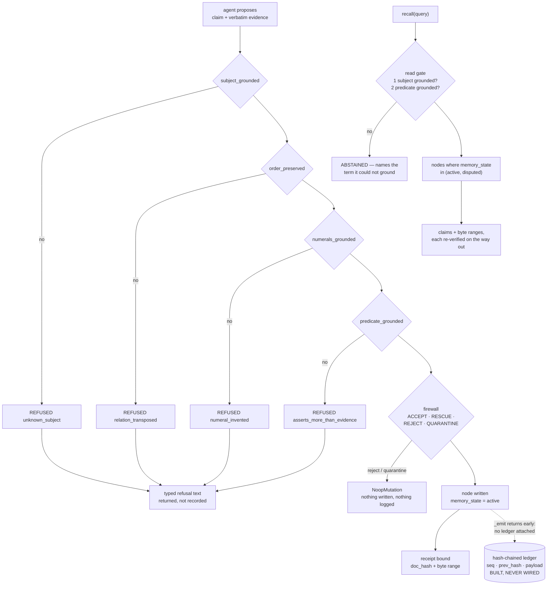

## 1. Executive Summary

Fireweed MCP is a memory server for agents in which the interesting decision is
what gets *refused*. 9,724 lines of Python across 45 files, 7 commits, first
commit 23 August 2026, licensed FSL-1.1-ALv2 — source-available, converting to
Apache 2.0 on 1 January 2028. It has no dependencies, no API key, and no model:
nothing in the server calls an LLM.

The design idea is stated in one sentence in the README and delivered in the
code: *"the model proposes, deterministic code decides,"* placed across an RPC
boundary so the proposer is a different process from the decider. `remember`
takes a claim **and** the verbatim text being quoted, and four pure functions ask
whether the evidence names the subject, preserves the relation, invents no
numbers, and asserts nothing the span does not say. What survives binds to a
`(doc_hash, byte_start, byte_end)` triple that anyone can re-check by re-hashing
the file and re-slicing the bytes.

Three marks. `memory_state` is a five-value discrete status held apart from the
confidence float, and retrieval admits two of the five. `Temporal` carries the
event axis separately from the transaction axis, with writers and readers on
both. And the test file contains three genuine must-not-return cases, each
paired with a positive over the same store.

The gap is on the other side of the same idea. This system's whole argument is
that the record can be checked afterwards by someone who trusts neither party —
and the two mechanisms that would carry that argument furthest, the append-only
ledger and the erasure certificate, are respectively unwired and unsigned in any
sense an adversary would accept. Sections 7 and 9 trace both.

## 2. Mental Model

A question is treated as a claim with a hole in it, and the read gate asks
whether the hole has a filler. The module says why the previous design failed:

> *"The read side scored instead — `jaccard >= 0.12 OR coverage >= 0.6` — and a
> score cannot say 'the substrate does not know this'. Live, that answered
> 'Priya's salary' with a hire date: the entity matched, the predicate did not,
> and coverage weights every query token equally."*

That is the sharpest statement in the corpus of why a similarity threshold
cannot express abstention. A score always returns a best row; a gate can return
nothing and say which term it could not ground.

The write side is the same shape one step earlier. The firewall has four
verdicts — `ACCEPT`, `RESCUE`, `REJECT`, `QUARANTINE` — and the grounding checks
sit in front of it with typed refusals: `unknown_subject`,
`relation_transposed`, `numeral_invented`, `asserts_more_than_evidence`. Each
refusal returns the claim, the evidence and what to do about it, on the stated
ground that *"a gate that only says 'no' cannot be worked with."*

## 3. Architecture



Every refusal in this diagram is returned to the caller and stored nowhere. That
is the single fact that shapes the rest of the report.

## 4. Essential Implementation Paths

**`remember`.** `tool_remember` imports `classify`, `predicate_grounded`,
`subject_grounded`, `order_preserved`, `numerals_grounded` from
`fireweed.grounding` and runs all four before touching the graph. If a
`source_text` is supplied it is written to the store first, because — in the
comment's words — *"A first-run developer would see 'turn-bound (no source
document registered)' and conclude the feature did not exist. The best feature
you have should not be behind a second tool call."*

**The decision that used to be discarded.** After the gate passes, the engine's
own firewall runs, and the comment above the check records what happened when
its verdict was ignored:

> *"REPORT WHAT ACTUALLY HAPPENED. This returned 'ADMITTED' unconditionally while
> the engine's firewall was rejecting the claim, so `remember` told callers their
> fact was stored when the substrate had recorded nothing — silent data loss, in
> the one product where the record is the entire promise. Computing a decision
> and then ignoring it is the same defect this project has now hit in reader.py,
> run_opsgraph.py and here."*

Three occurrences of one defect, counted by the project itself. The current code
reads `result.firewall_decision`, and a rejection returns `NOT STORED` with the
reason.

**`recall`.** `query_graph` runs the read gate, and an abstention returns the
reason, the detail, a remedy when one exists, and — when the optional encoder is
absent — a note that paraphrases are being refused. The fallback direction is
stated where the gate is defined: lexical-only *"can only ABSTAIN MORE, never
answer more."*

**Receipts.** `locate_span` finds the UTF-8 byte offsets of the quote in the
document, exact-match first, then a whitespace-tolerant regex mapped back to
original offsets, and *"Returns None rather than guessing when the quote isn't
present."* The invariant is written above it: a receipt is minted only when the
span is a real contiguous slice of the hashed document.

## 5. Memory Data Model

A `Node` carries the claim and its normalized form, resolved `EntityRef`s, a
domain set, a `NodeStatus` whose `memory_state` is the five-value `Literal`, a
`Reinforcement` record, a `Provenance` holding `source_turn_id`, the evidence
span and a confidence float, and a `Temporal` holding both time axes.

The state vocabulary is worth reading against its writers. `active`, `disputed`
and `superseded` are all set by real paths. `quarantined` and `frozen` are
declared in the type and written by nothing: the firewall's `QUARANTINE` verdict
takes the same branch as `REJECT` and returns a `NoopMutation`, so a claim the
firewall finds too unclear produces no node at all. The module docstring
describes that verdict as *"too unclear → log for review"*, and there is no log
and no review surface — the claim is dropped and the caller is told why in the
response text.

Storage is one `substrate.json` rewritten after every mutation, with source
documents as text files beside it. A corrupt snapshot is moved to
`.corrupt` and the server continues from empty with a message on stderr, rather
than failing every subsequent call.

## 6. Retrieval Mechanics

The read gate runs two checks — every named subject resolves to a graph entity,
and the demand head is grounded lexically or semantically — and both are pure
functions of `(question, graph)`. A third check on object typing is *deliberately
absent*, with the docstring naming the design document that records why and what
would reopen it.

Determinism is defended rather than asserted. The optional encoder is pinned to a
model id **and** a revision **and** a SHA-256 fingerprint of the weights file,
and `_verify_weights` raises on mismatch rather than proceeding. When the encoder
is not installed the gate runs lexical-only, which refuses more.

Selection admits `("active", "disputed")` at three separate points, and the
active-claim index is built only from `active` nodes. On the way out, every
returned claim's receipt is re-verified against the held source, so a result
carries `verified`, `FAILED`, or `source not held` rather than an unqualified
citation.

The README publishes what this costs, in a section titled *"What it does NOT
do"*: on questions whose answer is genuinely absent the gate abstains **38%** of
the time, and on paired questions the store does answer it returns the right one
**24%** of the time against **75%** for plain retrieval-and-read. Publishing the
losing number beside the winning one is rare enough to note. It is not checkable
here: the evaluation notes are in a private repository, so this report records
the claim and its provenance and not its correctness.

## 7. Write Mechanics

The gate is the write path, and it is genuinely deterministic — pure functions
over two strings, no model, no threshold that a caller can move. Refusals are
typed, returned, and explain what to fix.

They are also the only trace. A refused claim leaves nothing behind: no row, no
counter, no log line. Re-proposing the identical claim runs the same functions
against the same evidence and, if it passes this time — a longer evidence span, a
reworded claim — it is admitted with no reference to the earlier refusal. This is
why `tombstone` is not awarded. The atlas's definition wants a durable record
keyed on the value so a later assertion cannot silently re-establish it; here the
refusal is a response, not a record.

The mechanism that would fix it is in the tree. `ledger.py` defines an
append-only event log with a gap-free monotonic `seq`, a `prev_hash` chain, a
canonical byte serialization *"order-insensitive and stable"*, a closed
`EVENT_KINDS` vocabulary, and a `resolver_version` stamped into every payload so
that the offline audit question *"would today's resolver have decided this
differently?"* is answerable. `ledger_sqlite.py` persists every event
synchronously. `graph.py` has `attach_ledger`, and `_emit` on every mutation.

None of it runs. `_emit` opens with:

```python
if self._ledger is None:
    if self._sealed:
        raise RuntimeError(f"sealed graph: {kind} write without an attached ledger — "
                           "every mutation must be a captured event")
    return
```

`attach_ledger` has no caller anywhere in the repository, `seal()` has no caller,
and `Fireweed.__init__` constructs an `IngestContext` that never sets one. So
every node, entity and relation written by this server returns from `_emit`
having recorded nothing. The project built the guard that catches exactly this
failure and left it off.

That is the ordinary shape of the corpus's most common defect, with one unusual
feature: `_sealed` means the fix is a single call, and the failure is
fail-*open* by an explicit choice rather than an oversight.

## 8. Agent Integration

Seven tools over JSON-RPC on stdin and stdout, no SDK — the docstring explains
that the official one requires Python 3.10 and the engine runs on 3.9, and draws
the same conclusion as the dependency-free reference reader: *"a dependency list
is a promise, and short promises are keepable."*

`safe_source_id` reduces the caller-supplied `source_id` to a single path
component, added after `"../../etc/passwd"` produced an unhandled traceback —
the write already failed, but *"a stack trace is not an answer."*

The tool descriptions are written for the agent rather than the developer:
`recall`'s tells the caller to *"treat that as a real answer, not an empty
result"*, which is the correct place to put that instruction, since the abstention
is only useful if the model on the other side does not retry until it gets a row.

## 9. Reliability, Safety, and Trust

Erasure is the most carefully built thing here and the most oversold at the
boundary.

`compute_closure` is exact and structural rather than similarity-based: every
node whose entities include the subject, including superseded and disputed ones,
then a transitive walk over `derived_from` edges so a reflection summarising the
subject's facts goes too. The comment records that this was found with a canary —
*"a summary restating the subject's facts survived their erasure — measured with
a canary in test_erasure_derived_nodes"* — and that the over-deletion it causes
is the intended trade, because *"over-deletion is recoverable through normal
operation, a leak is not."* `ErasureIncomplete` refuses to sign at all when any
probe still answers, on the ground that a certificate contradicted by the system
it describes *"is worse than no certificate."*

Three things then happen at the MCP boundary that the engine did not intend.

**The ledger is a throwaway.** `tool_forget` calls
`erase(g, SQLiteLedger(":memory:"), "mcp", …)`. The `ERASE` event — append-only,
hash-chained, replayable, the thing that makes a from-zero fold reconstruct and
then erase — is written to an in-memory database that is discarded when the
function returns. After a `forget`, the store contains the closure's absence and
no record that an erasure occurred.

**The signature is unauthenticated.** The signing key is the literal
`b"fireweed-mcp-key"`, in public source. `Certificate.signed` is a correct
HMAC-SHA256 over a canonical encoding, and `verify_signature` is
constant-time — the construction is sound and the key is not a secret. Anyone can
mint a certificate for any subject and any closure manifest. Against accidental
corruption this is a checksum; against the adversary the README's framing invokes
— *"anyone can check it afterwards — including someone who trusts neither your
agent nor this server"* — it establishes nothing.

**The certificate's own caveat is computed and dropped.** `erase` builds a
`scope` string that states exactly what is certified, and with no keyring it
reads: *"No content key was destroyed (this substrate is not crypto-shredding),
so residual plaintext may persist in snapshots/history — governed by the store's
retention policy, NOT by this certificate."* The MCP server passes no keyring, so
this is the branch that runs. `tool_forget` prints the signature, the closure
counts, the probe result, the state hashes and the surviving bystander count —
and not `cert.scope`. What it prints instead is *"This certificate is the
artifact a compliance reviewer asks for."*

The field exists because the dataclass docstring argues for it: *"a certificate
that claims more than the system delivers is a compliance liability, not a
feature."* The engine wrote the sentence that prevents the overstatement, and the
server does not display it. It is the same defect the project named three
occurrences of in section 4 — a decision computed and then ignored — in the one
place where it changes what a reader believes about a legal artifact.

## 10. Tests, Evals, and Benchmarks

One test file, 161 lines, and it is better than its size suggests. It drives a
subprocess speaking real stdio JSON-RPC rather than calling the tool functions,
for a reason worth quoting: *"the thing that breaks in an MCP server is the
protocol edge (a stray print to stdout, a notification answered with a reply, a
crash that kills the session), and none of that is visible from inside the
process."* One test asserts that a notification receives no reply, because
answering one corrupts the stream.

Three cases assert that material must not come back, and none of them can pass
vacuously. `test_recall_abstains_with_the_ungrounded_term_named` asserts the
answerable query returns a grounded result and the unanswerable one abstains
naming `salary`, over the same store in the same test. `test_receipts_are_tamper_evident`
asserts `1/1 checkable`, edits one word of the source file on disk, and asserts
`0/1 checkable` with a `FAILED` line — a real negative control on the instrument,
answering the docstring's claim that *"The point of a receipt is that it CAN
fail."* `test_forget_issues_a_signed_certificate_and_spares_bystanders` asserts
both directions: every probe about the erased subject abstains, and the
bystander's claim survives.

`test_export_is_readable_by_the_public_reference_reader` imports the stdlib-only
reader from `open_format/` and asserts the claim round-trips, so portability is
checked by something outside the engine. `open_format/verify_bundle.py` extends
the same discipline to evidence bundles — no Fireweed import at all, because
*"if you needed our code to verify our claims, you would just be trusting us with
extra steps"* — and reports entries it cannot check as `not verifiable here`
*"rather than silently skipped or, worse, counted as passes."*

What the suite does not cover: no test attaches a ledger, no test exercises the
as-of validity query, and no test asserts a state transition. The README points
at a retraction in a sibling repository as the reason its own numbers are stated
so carefully; that document is outside this pin and is recorded here as a
pointer, not as a citation.

## 11. For Your Own Build

**Put the adjudicator on the other side of the RPC boundary.** "The model
proposes, deterministic code decides" is a slogan inside one process and a
property across two. An agent cannot argue with `numerals_grounded`.

**Type your refusals and return them.** Four named reasons with the claim, the
evidence and a remedy is what makes a gate usable by a caller that is itself a
model. Then go one step further than this system does and *record* them.

**Write the negative control into the test.** Assert the receipt verifies, then
break the source and assert it stops verifying. Without the second half, an
instrument that always returns success passes.

**If you compute a caveat, print it.** The scope string here is exactly right and
never reaches the reader. A limitation known only to the code is not a
limitation the user has been told about.

## 12. Open Questions

**Would sealing the graph work today?** `seal()` and `attach_ledger` exist, and
`ledger_sqlite` persists synchronously. Whether the MCP server's snapshot-based
persistence and the ledger's fold-based reconstruction can both own the store at
once was not traced, and it is the question that decides whether the unwired
ledger is a missing line or a design conflict.

**What happens to a re-proposed claim after erasure?** The closure is removed and
the `ERASE` event is discarded with the in-memory ledger. Remembering the same
claim again with the same evidence appears to admit it as new. No committed test
covers it.

**What is in the private evaluation?** The 38% and 24% figures, the trap corpus,
the read-gate bench and `test_erasure_derived_nodes` are all cited from a
repository not published at this pin. The engine source is here; the instruments
that measured it are not.

## Appendix: File Index

| Path | What it holds |
| --- | --- |
| `src/fireweed_mcp/server.py` | The seven tools, the gate wiring, and the hardcoded signing key |
| `src/fireweed/grounding.py` | The four pure admission functions |
| `src/fireweed/read_gate.py` | Subject and predicate grounding, and why a score cannot abstain |
| `src/fireweed/receipts.py` | Document hashing and byte-range span location |
| `src/fireweed/erasure.py` | Exact closure, `ErasureIncomplete`, and the certificate with its scope text |
| `src/fireweed/ledger.py` | The append-only hash-chained event log — built, never attached |
| `src/fireweed/graph.py` | `NodeStatus.memory_state`, `Temporal`, `_emit`, `seal`, `attach_ledger` |
| `src/fireweed/pipeline.py` | The firewall branch, supersession, and the `disputed` writer |
| `src/fireweed/semantic_encoder.py` | The pinned revision and weights fingerprint |
| `open_format/verify_bundle.py` | A verifier with no engine import, and what it declines to claim |
| `tests/test_mcp_server.py` | The protocol tests and the three must-not-return cases |

## History

**2026-08-25** — [`33ec45edeea262a753d8fb004689d4bf92bc2328`](https://github.com/Starksood/fireweed-mcp/commit/33ec45edeea262a753d8fb004689d4bf92bc2328) — first reading, 9,724 lines of Python across 45 files, 7 commits since 23 August 2026, FSL-1.1-ALv2 converting to Apache 2.0 on 1 January 2028. Screened before anything was read: one auto-run surface, one dependency file inside the seven-day cooldown, one unpinned surface, no build-time execution; nothing was installed and no test was run, so every claim here comes from reading the tree. Three marks. `trust_state` rests on the five-value `memory_state` filtered to `("active", "disputed")` at three retrieval points, with the report stating that two of the five states have no writer. `bitemporal` rests on `event_time`/`valid_from`/`valid_to` extracted at resolve time and stamped on supersession, read by the as-of validity query and the event-time window filter. `negative_eval` rests on three paired must-not-return cases including a real negative control on the receipt instrument. `audit_log` is withheld on a producer check: `ledger.py` and `ledger_sqlite.py` implement a gap-free hash-chained append-only log, and `attach_ledger` and `seal()` have no caller anywhere in the tree, so `_emit` returns early on every mutation; the only ledger ever constructed is a `SQLiteLedger(":memory:")` inside `forget`, discarded when the call returns. `tombstone` is withheld because a refused claim leaves no record of any kind. `scope_enforced` is absent — no tenant, user or workspace key on the read path. `human_review` is absent — the firewall's `QUARANTINE` verdict, documented as *"log for review"*, returns a `NoopMutation` and there is no queue. The erasure certificate is signed with `b"fireweed-mcp-key"`, a literal in public source, and its own self-limiting `scope` field is computed and not printed.
