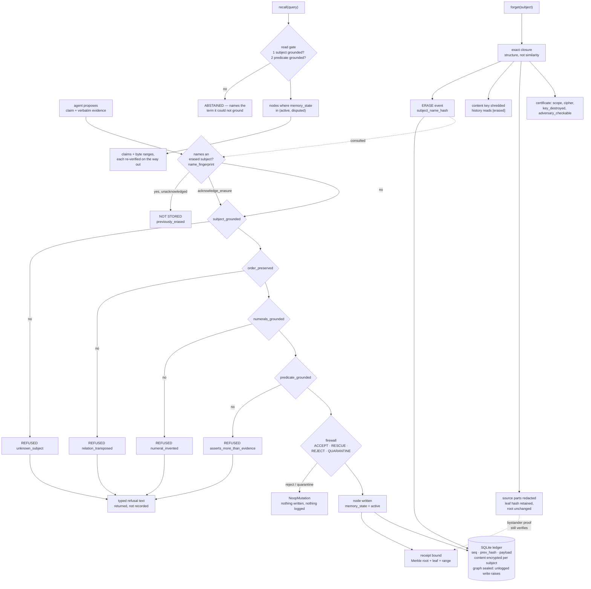

## 1. Executive Summary

Fireweed MCP is a memory server for agents in which the interesting decision is
what gets *refused*. 10,479 lines of Python across 44 files, 9 commits, first
commit 23 August 2026, licensed FSL-1.1-ALv2 — source-available, converting to
Apache 2.0 on 1 January 2028. The default install has no dependencies, no API
key, and no model: nothing in the server calls an LLM. An optional `cryptography`
extra changes two things and the report says where.

The design idea is stated in one sentence in the README and delivered in the
code: *"the model proposes, deterministic code decides,"* placed across an RPC
boundary so the proposer is a different process from the decider. `remember`
takes a claim **and** the verbatim text being quoted, and four pure functions ask
whether the evidence names the subject, preserves the relation, invents no
numbers, and asserts nothing the span does not say. What survives binds to a
`(doc_hash, byte_start, byte_end)` triple that anyone can re-check by re-hashing
the file and re-slicing the bytes.

Five marks. `memory_state` is a five-value discrete status held apart from the
confidence float, and retrieval admits two of the five. `Temporal` carries the
event axis separately from the transaction axis, with writers and readers on
both. Every graph mutation emits to a gap-free hash-chained SQLite ledger, and
the graph is sealed so an unlogged write raises rather than passing. Erasure
leaves a durable record keyed on a hash of the subject's name, which the write
gate consults before admitting a claim that names them again. And the test file
carries six must-not cases, each paired with a positive over the same store.

The design's own argument is that the record can be checked afterwards by
someone who trusts neither party, and the machinery for that is unusually
complete: a signer that declares whether its signature is worth anything to a
third party, and a Merkle binding that lets one subject's text be removed from a
source document while every other party's receipt into it keeps verifying.
Section 9 traces both, and names the one place the same release answers an
identical question two different ways.

## 2. Mental Model

A question is treated as a claim with a hole in it, and the read gate asks
whether the hole has a filler. The module says why the previous design failed:

> *"The read side scored instead — `jaccard >= 0.12 OR coverage >= 0.6` — and a
> score cannot say 'the substrate does not know this'. Live, that answered
> 'Priya's salary' with a hire date: the entity matched, the predicate did not,
> and coverage weights every query token equally."*

That is the sharpest statement in the corpus of why a similarity threshold
cannot express abstention. A score always returns a best row; a gate can return
nothing and say which term it could not ground.

The write side is the same shape one step earlier. The firewall has four
verdicts — `ACCEPT`, `RESCUE`, `REJECT`, `QUARANTINE` — and the grounding checks
sit in front of it with typed refusals: `unknown_subject`,
`relation_transposed`, `numeral_invented`, `asserts_more_than_evidence`. Each
refusal returns the claim, the evidence and what to do about it, on the stated
ground that *"a gate that only says 'no' cannot be worked with."*

## 3. Architecture



The gate's refusals are returned to the caller and stored nowhere; the erasure's
refusal is a durable ledger event that the gate reads back. Those are two
different classes of "no", and only the second survives a restart.

## 4. Essential Implementation Paths

**`remember`.** `tool_remember` imports `classify`, `predicate_grounded`,
`subject_grounded`, `order_preserved`, `numerals_grounded` from
`fireweed.grounding` and runs all four before touching the graph. If a
`source_text` is supplied it is written to the store first, because — in the
comment's words — *"A first-run developer would see 'turn-bound (no source
document registered)' and conclude the feature did not exist. The best feature
you have should not be behind a second tool call."*

**The decision that used to be discarded.** After the gate passes, the engine's
own firewall runs, and the comment above the check records what happened when
its verdict was ignored:

> *"REPORT WHAT ACTUALLY HAPPENED. This returned 'ADMITTED' unconditionally while
> the engine's firewall was rejecting the claim, so `remember` told callers their
> fact was stored when the substrate had recorded nothing — silent data loss, in
> the one product where the record is the entire promise. Computing a decision
> and then ignoring it is the same defect this project has now hit in reader.py,
> run_opsgraph.py and here."*

Three occurrences of one defect, counted by the project itself. The current code
reads `result.firewall_decision`, and a rejection returns `NOT STORED` with the
reason.

**`recall`.** `query_graph` runs the read gate, and an abstention returns the
reason, the detail, a remedy when one exists, and — when the optional encoder is
absent — a note that paraphrases are being refused. The fallback direction is
stated where the gate is defined: lexical-only *"can only ABSTAIN MORE, never
answer more."*

**Receipts.** `locate_span` finds the UTF-8 byte offsets of the quote in the
document, exact-match first, then a whitespace-tolerant regex mapped back to
original offsets, and *"Returns None rather than guessing when the quote isn't
present."* The invariant is written above it: a receipt is minted only when the
span is a real contiguous slice of the hashed document.

## 5. Memory Data Model

A `Node` carries the claim and its normalized form, resolved `EntityRef`s, a
domain set, a `NodeStatus` whose `memory_state` is the five-value `Literal`, a
`Reinforcement` record, a `Provenance` holding `source_turn_id`, the evidence
span and a confidence float, and a `Temporal` holding both time axes.

The state vocabulary is worth reading against its writers. `active`, `disputed`
and `superseded` are all set by real paths. `quarantined` and `frozen` are
declared in the type and written by nothing: the firewall's `QUARANTINE` verdict
takes the same branch as `REJECT` and returns a `NoopMutation`, so a claim the
firewall finds too unclear produces no node at all. The module docstring
describes that verdict as *"too unclear → log for review"*, and there is no log
and no review surface — the claim is dropped and the caller is told why in the
response text.

Storage is one `substrate.json` rewritten after every mutation, with source
documents as text files beside it. A corrupt snapshot is moved to
`.corrupt` and the server continues from empty with a message on stderr, rather
than failing every subsequent call.

## 6. Retrieval Mechanics

The read gate runs two checks — every named subject resolves to a graph entity,
and the demand head is grounded lexically or semantically — and both are pure
functions of `(question, graph)`. A third check on object typing is *deliberately
absent*, with the docstring naming the design document that records why and what
would reopen it.

Determinism is defended rather than asserted. The optional encoder is pinned to a
model id **and** a revision **and** a SHA-256 fingerprint of the weights file,
and `_verify_weights` raises on mismatch rather than proceeding. When the encoder
is not installed the gate runs lexical-only, which refuses more.

Selection admits `("active", "disputed")` at three separate points, and the
active-claim index is built only from `active` nodes. On the way out, every
returned claim's receipt is re-verified against the held source, so a result
carries `verified`, `FAILED`, or `source not held` rather than an unqualified
citation.

The README publishes what this costs, in a section titled *"What it does NOT
do"*: on questions whose answer is genuinely absent the gate abstains **38%** of
the time, and on paired questions the store does answer it returns the right one
**24%** of the time against **75%** for plain retrieval-and-read. Publishing the
losing number beside the winning one is rare enough to note. It is not checkable
here: the evaluation notes are in a private repository, so this report records
the claim and its provenance and not its correctness.

## 7. Write Mechanics

The gate is the write path, and it is genuinely deterministic — pure functions
over two strings, no model, no threshold that a caller can move. Refusals are
typed, returned, and explain what to fix. A gate refusal is a response and
nothing else: no row, no counter, no log line, and a re-proposal that passes the
same functions is admitted with no reference to the earlier refusal.

**One refusal is different, and it is the one that has to be.** Before the four
grounding checks run, `remember` reads the set of erased subject fingerprints
out of the ledger and compares it against the names the claim mentions. A hit
returns `NOT STORED (previously_erased)` and names the subject. The record it
consults is a durable `ERASE` event carrying `subject_name_hash` —
`name_fingerprint` over the whitespace-normalized lowercased name, a SHA-256, so
the record protecting a person does not store the person.

The design decision worth copying is that this is an **override, not a block**:

> *"erasure is not a permanent ban on a person ever being mentioned again —
> someone may lawfully re-consent, or the same name may be a different person.
> The requirement is that re-admission be a DECISION SOMEONE MAKES, recorded as
> such, rather than something that happens quietly because nothing was looking."*

`acknowledge_erasure=true` admits the claim. That is the correct shape for a
tombstone over personal data, where a permanent refusal is its own compliance
problem, and it is the shape most implementations in this corpus get wrong in
the other direction by having no record at all.

The mechanism underneath is the ledger. `attach_ledger(SQLiteLedger(LEDGER_DB),
tenant_id="mcp", keyring=...)` runs at server start, so every node, entity and
relation write emits an event: gap-free monotonic `seq`, a `prev_hash` chain,
canonical byte serialization *"order-insensitive and stable"*, a closed
`EVENT_KINDS` vocabulary, and a `resolver_version` in every payload so the
offline question *"would today's resolver have decided this differently?"* is
answerable. `seal()` is called on the next line, which arms this guard:

```python
if self._ledger is None:
    if self._sealed:
        raise RuntimeError(f"sealed graph: {kind} write without an attached ledger — "
                           "every mutation must be a captured event")
    return
```

The sealed branch is the interesting half. A store whose audit log is *supposed*
to cover every mutation has a failure mode where it silently covers none, and
the difference between the two branches above is whether that failure is a crash
on the write or an absence somebody notices later. The server's own comment
makes the point: arming it *"means the failure can never recur silently: it
becomes a crash on the write, not an absence discovered by an auditor months
later."* **If you build an append-only log, build the sealed mode with it and
turn it on** — the guard is worth more than the log, because the log cannot tell
you it is empty.

A second narrowing runs on the way in. Storing whatever evidence the caller
passed puts one subject's sentences inside another subject's record whenever
someone quotes a whole document, and erasing the first then leaves their text
sitting in the second's span. The gate runs against the full evidence, and only
the *stored* span is narrowed to the part that supports the claim.

## 8. Agent Integration## 8. Agent Integration

Seven tools over JSON-RPC on stdin and stdout, no SDK — the docstring explains
that the official one requires Python 3.10 and the engine runs on 3.9, and draws
the same conclusion as the dependency-free reference reader: *"a dependency list
is a promise, and short promises are keepable."*

`safe_source_id` reduces the caller-supplied `source_id` to a single path
component, added after `"../../etc/passwd"` produced an unhandled traceback —
the write already failed, but *"a stack trace is not an answer."*

The tool descriptions are written for the agent rather than the developer:
`recall`'s tells the caller to *"treat that as a real answer, not an empty
result"*, which is the correct place to put that instruction, since the abstention
is only useful if the model on the other side does not retry until it gets a row.

## 9. Reliability, Safety, and Trust

Erasure is the most carefully built thing here, and it is four mechanisms
working together rather than one.

`compute_closure` is exact and structural rather than similarity-based: every
node whose entities include the subject, including superseded and disputed ones,
then a transitive walk over `derived_from` edges so a reflection summarising the
subject's facts goes too. The comment records that this was found with a canary,
and that the over-deletion it causes is the intended trade, because
*"over-deletion is recoverable through normal operation, a leak is not."*
`ErasureIncomplete` refuses to sign at all when any probe still answers, on the
ground that a certificate contradicted by the system it describes *"is worse
than no certificate."*

**The signature declares what it is worth.** `signing.py` ships two signers and
puts a boolean on each: `HmacSigner.adversary_checkable = False`,
`Ed25519Signer.adversary_checkable = True`. The docstring states the difference
without softening it — under HMAC *"the only party who can check the certificate
is the party who could equally have forged it,"* which against accidental
corruption is a useful checksum and against a reader who does not already trust
the operator *"establishes NOTHING."* Ed25519 is selected when `cryptography` is
importable, the private key is written with `O_EXCL` at mode `0600` outside the
store, and the public half is written in the clear beside the substrate because
*"it is the artifact a verifier needs."* The HMAC key is 32 bytes from `secrets`,
generated once per install, also outside the store — and the certificate reports
which scheme signed it. A signed artifact that carries its own attestation
strength is rare enough in this corpus to be worth naming.

**The Merkle binding is the best idea in the release.** A receipt binds
`(doc_hash, byte_start, byte_end)` against a flat SHA-256 of the whole document,
and that makes erasure and verification mutually exclusive: remove an erased
subject's sentence and every *other* party's receipt into that document fails.
`merkle.py` replaces the flat hash with a tree over the document's parts. A
redacted part keeps its leaf hash, the root is unchanged, and a bystander's
inclusion proof still verifies — so the erased text is gone, the bystander's
claim survives, and their receipt survives. Three properties the flat hash could
not hold at once. Most systems in this corpus that redact a source either break
every downstream citation or decline to touch the source at all; this is the
third option.

**The crypto-shred is real on the default install and the cipher under it is
hand-rolled.** With a keyring attached, node content fields are encrypted in the
persisted ledger payload, so destroying a subject's key leaves the chain intact
while the content reconstructs as `[erased]` — a from-zero replay yields
tombstones rather than plaintext. When `cryptography` is present that is
AES-256-GCM, authenticated. When it is not, `encrypt` falls back to XOR against
an HMAC-SHA256 counter keystream with no MAC, tagged `enc1:`.

That fallback is worth sitting with, because the same release argues against it.
`signing.py` declines to hand-roll a pure-Python Ed25519 that would have
preserved the zero-dependency promise, on the stated ground that *"hand-written
cryptography in a product whose entire pitch is verifiability is the wrong
trade,"* and ships the honest weak scheme instead. `crypto.py` faces the
identical question for the same default install and hand-rolls the cipher. The
practical exposure is narrow — the ledger's own `hash` covers the payload, so
tampering with ciphertext breaks the chain, and confidentiality-after-shred does
not depend on authentication — but the two files answer one question two ways,
and only one of them shows its working. The project's own test caught the
consequence: an assertion naming `AES` *"passed locally, where `cryptography`
happens to be installed, and failed in CI, where it is not and the keystream
fallback runs — an environment-dependent assertion masquerading as a property."*
Both paths run in the wild.

Two smaller repairs belong here because each closed a leak the certificate would
otherwise have overstated. The session anchor — the entity pronouns resolve
against — held the erased entity's id, which both pointed later resolution at a
node that no longer exists and leaked the name through the identifier, since
*"an id derived from a name is still personal data."* And `forget` operated on
the graph and never touched `SOURCES/*.txt`, so the erased subject's sentences
survived in plaintext in a file beside the substrate, where *"one grep recovered
them after a 'provable erasure'."*

What remains absent is scope. There is no tenant, user or workspace key anywhere
on the read path; `source_id` names a document for receipt binding, not an
audience. This is a single-tenant store, and the erasure guarantees are stated
against an operator holding one substrate.

## 10. Tests, Evals, and Benchmarks

One test file, 311 lines, and it is better than its size suggests. It drives a
subprocess speaking real stdio JSON-RPC rather than calling the tool functions,
for a reason worth quoting: *"the thing that breaks in an MCP server is the
protocol edge (a stray print to stdout, a notification answered with a reply, a
crash that kills the session), and none of that is visible from inside the
process."* One test asserts that a notification receives no reply, because
answering one corrupts the stream.

Six cases assert that something must not happen, and none of them can pass
vacuously. `test_recall_abstains_with_the_ungrounded_term_named` asserts the
answerable query returns a grounded result and the unanswerable one abstains
naming `salary`, over the same store in the same test. `test_receipts_are_tamper_evident`
asserts `1/1 checkable`, edits one word of the source file on disk, and asserts
`0/1 checkable` with a `FAILED` line — a real negative control on the instrument,
answering the docstring's claim that *"The point of a receipt is that it CAN
fail."* `test_forget_issues_a_signed_certificate_and_spares_bystanders` asserts
both directions: every probe about the erased subject abstains, and the
bystander's claim survives.

`test_export_is_readable_by_the_public_reference_reader` imports the stdlib-only
reader from `open_format/` and asserts the claim round-trips, so portability is
checked by something outside the engine. `open_format/verify_bundle.py` extends
the same discipline to evidence bundles — no Fireweed import at all, because
*"if you needed our code to verify our claims, you would just be trusting us with
extra steps"* — and reports entries it cannot check as `not verifiable here`
*"rather than silently skipped or, worse, counted as passes."*

`test_erasure_is_remembered_so_a_reproposal_cannot_slip_back_in` is the one that
earns `tombstone`, and its sibling is what makes it a *tombstone* rather than a
ban: `test_reproposal_is_possible_but_must_be_deliberate` asserts the identical
claim is admitted when `acknowledge_erasure=true` is passed. A refusal test
alone would pass on a system that had simply stopped accepting writes.

Two more pin properties most suites leave to a comment.
`test_signing_key_is_per_install_not_a_source_literal` asserts the generated key
is 32 bytes and is not the string that used to be compiled in, and asserts that
when the Ed25519 path runs the *public* half is written out, since that is the
artifact a verifier needs. `test_private_keys_do_not_live_in_the_store` asserts
the keys are outside the directory a user would copy, sync or back up — because
a backup taken before an erasure would otherwise carry the content keys next to
the ciphertext they were meant to shred.

`test_erasure_certificate_discloses_its_own_scope` carries the most instructive
comment in the file. An earlier version asserted the cipher was `AES`, which
*"passed locally, where `cryptography` happens to be installed, and failed in
CI, where it is not and the keystream fallback runs — an environment-dependent
assertion masquerading as a property."* The fixed version parses the cipher line
and asserts only that something is named and it is not `none`. That is the
general repair for a test that passes because of the machine it ran on.

`test_export_is_readable_by_the_public_reference_reader` imports the stdlib-only
reader from `open_format/` and asserts the claim round-trips, so portability is
checked by something outside the engine. `open_format/verify_bundle.py` extends
the same discipline to evidence bundles — no Fireweed import at all, because
*"if you needed our code to verify our claims, you would just be trusting us with
extra steps"* — and reports entries it cannot check as `not verifiable here`
*"rather than silently skipped or, worse, counted as passes."*

What the suite does not cover: nothing asserts the ledger's chain actually
verifies — `test_mutations_are_recorded_in_a_persistent_ledger` asserts the file
exists, which pins persistence and not integrity — nothing exercises the as-of
validity query, and no test asserts a `memory_state` transition. The README's
recall figures and the erasure canaries are cited from a private repository and
are not checkable at this pin.

## 11. For Your Own Build

**Put the adjudicator on the other side of the RPC boundary.** "The model
proposes, deterministic code decides" is a slogan inside one process and a
property across two. An agent cannot argue with `numerals_grounded`.

**Make a tombstone an override, not a ban.** A refusal keyed on the value is
what stops a deletion from being undone by the next extraction. A refusal with
no way through is a different bug, because re-consent happens and two people
share a name. The pairing here — refuse by default, admit on an explicit
acknowledgement — is the shape to copy, and the test that pins it is two
assertions, not one.

**Arm the guard that catches an empty audit log.** A log that covers no
mutations looks exactly like a log that covers all of them until someone reads
it. A sealed mode that raises on an unlogged write converts that from a silent
condition into a crash on the first write, and it costs one call at startup.

**Put a `adversary_checkable` flag on your signature.** A symmetric MAC and an
asymmetric signature are both "signed" and only one means anything to a third
party. Carrying that distinction in the artifact rather than in the
documentation is what stops the weaker one being quoted as the stronger.

**Hash a document as a tree if you will ever have to redact it.** A flat hash
makes erasure and third-party verification mutually exclusive. A Merkle tree
over parts costs a little structure and buys the ability to remove one
subject's text while every other citation into the same document keeps
verifying.

**Write the negative control into the test.** Assert the receipt verifies, then
break the source and assert it stops verifying. Without the second half, an
instrument that always returns success passes. And check what your assertion
depends on: naming a cipher that only exists when an optional dependency is
installed is a test about the machine, not the code.

## 12. Open Questions

**Does the chain verify, and does anyone check?** The ledger is persisted and
hash-chained, and the committed test asserts the database file exists. Nothing
walks the chain from genesis and recomputes it, which is the check that turns an
append-only log into a tamper-evident one. `verify_bundle.py` does exactly that
for evidence bundles; the ledger has no equivalent at this pin.

**Which of the two records is authoritative?** The server
writes `substrate.json` after every mutation and also emits every mutation to
the ledger, so the store has two records of the same state with different
durability and different erasure semantics — the ledger's content is encrypted
per subject and shreds on erasure, the snapshot is plaintext JSON. Which one is
authoritative on a restart, and whether an erased subject can survive in the
snapshot after shredding in the ledger, was not traced.

**Why does one release answer the hand-rolled-crypto question twice?**
`signing.py` refuses to hand-roll Ed25519 and ships an honestly-labelled weak
scheme; `crypto.py` hand-rolls an unauthenticated keystream for the same default
install. Both are defensible in isolation. The reasoning that separates them is
not written down anywhere in the tree.

**What is in the private evaluation?** The 38% and 24% recall figures, the trap
corpus, the read-gate bench and the erasure canaries are all cited from a
repository not published at this pin. The engine source is here; the instruments
that measured it are not.

## Appendix: File Index

| Path | What it holds |
| --- | --- |
| `src/fireweed_mcp/server.py` | The seven tools, the gate wiring, and the hardcoded signing key |
| `src/fireweed/grounding.py` | The four pure admission functions |
| `src/fireweed/read_gate.py` | Subject and predicate grounding, and why a score cannot abstain |
| `src/fireweed/receipts.py` | Document hashing and byte-range span location |
| `src/fireweed/erasure.py` | Exact closure, `ErasureIncomplete`, and the certificate with its scope text |
| `src/fireweed/ledger.py` | The append-only hash-chained event log |
| `src/fireweed/signing.py` | Two signers, and the `adversary_checkable` flag that distinguishes them |
| `src/fireweed/merkle.py` | The redactable document tree that keeps bystanders' receipts valid |
| `src/fireweed/crypto.py` | Per-subject content keys, the shred, and the fallback cipher |
| `src/fireweed/graph.py` | `NodeStatus.memory_state`, `Temporal`, `_emit`, `seal`, `attach_ledger` |
| `src/fireweed/pipeline.py` | The firewall branch, supersession, and the `disputed` writer |
| `src/fireweed/semantic_encoder.py` | The pinned revision and weights fingerprint |
| `open_format/verify_bundle.py` | A verifier with no engine import, and what it declines to claim |
| `tests/test_mcp_server.py` | The protocol tests and the three must-not-return cases |

## History

**2026-08-25** — [`a9bca09cd224500dcfff65e29f46354f0c93ef21`](https://github.com/Starksood/fireweed-mcp/commit/a9bca09cd224500dcfff65e29f46354f0c93ef21) — second reading, two commits past the previous pin on the same day, released as 0.2.0. 10,479 lines of Python across 44 files. Screened again before reading: one auto-run surface, one unpinned surface, one dependency file inside the seven-day cooldown, no build-time execution; nothing was installed and no suite was run. Two marks added, to five.

`audit_log` is earned on `attach_ledger(SQLiteLedger(...), tenant_id="mcp", keyring=...)` at server start, with `seal()` on the following line so an unlogged mutation raises. At the previous pin the same log existed with no caller for either function, so `_emit` took its silent early return on every write; the modules were unchanged and the wiring was absent. `tombstone` is earned on the `ERASE` event that this makes durable: it carries `subject_name_hash`, a SHA-256 fingerprint of the name rather than the name, and `remember` consults the erased set before admitting a claim, refusing with `previously_erased` and admitting on an explicit `acknowledge_erasure`. The previous reading recorded the absence of exactly this consultation as the reason `tombstone` was withheld.

Three further repairs are traced in section 9 and none of them was visible from the previous reading. The signing key was a literal in public source and is now 32 bytes from `secrets` per install, written outside the store at mode `0600`, with Ed25519 preferred when `cryptography` is importable and an `adversary_checkable` flag on each signer so the certificate reports what its own signature is worth. The certificate's self-limiting `scope` string, computed and not printed, reaches the caller. And `forget` never touched `SOURCES/*.txt`, so an erased subject's sentences survived in plaintext beside the substrate — a leak the previous reading did not find, closed here by a Merkle binding over document parts that lets a redacted part keep its leaf hash so a bystander's inclusion proof still verifies.

One finding is added rather than closed. The default zero-dependency install falls back to an unauthenticated HMAC-SHA256 keystream cipher, hand-rolled in `crypto.py`, in the same release whose `signing.py` declines to hand-roll Ed25519 on the stated ground that hand-written cryptography is the wrong trade for a product about verifiability. `scope_enforced` and `human_review` remain absent: there is still no tenant, user or workspace key on the read path, and `acknowledge_erasure` is an argument the calling agent supplies rather than a decision recorded from a person. `quarantined` and `frozen` are still declared states with no writer.

**2026-08-25** — [`33ec45edeea262a753d8fb004689d4bf92bc2328`](https://github.com/Starksood/fireweed-mcp/commit/33ec45edeea262a753d8fb004689d4bf92bc2328) — first reading, 9,724 lines of Python across 45 files, 7 commits since 23 August 2026, FSL-1.1-ALv2 converting to Apache 2.0 on 1 January 2028. Screened before anything was read: one auto-run surface, one dependency file inside the seven-day cooldown, one unpinned surface, no build-time execution; nothing was installed and no test was run, so every claim here comes from reading the tree. Three marks. `trust_state` rests on the five-value `memory_state` filtered to `("active", "disputed")` at three retrieval points, with the report stating that two of the five states have no writer. `bitemporal` rests on `event_time`/`valid_from`/`valid_to` extracted at resolve time and stamped on supersession, read by the as-of validity query and the event-time window filter. `negative_eval` rests on three paired must-not-return cases including a real negative control on the receipt instrument. `audit_log` is withheld on a producer check: `ledger.py` and `ledger_sqlite.py` implement a gap-free hash-chained append-only log, and `attach_ledger` and `seal()` have no caller anywhere in the tree, so `_emit` returns early on every mutation; the only ledger ever constructed is a `SQLiteLedger(":memory:")` inside `forget`, discarded when the call returns. `tombstone` is withheld because a refused claim leaves no record of any kind. `scope_enforced` is absent — no tenant, user or workspace key on the read path. `human_review` is absent — the firewall's `QUARANTINE` verdict, documented as *"log for review"*, returns a `NoopMutation` and there is no queue. The erasure certificate is signed with `b"fireweed-mcp-key"`, a literal in public source, and its own self-limiting `scope` field is computed and not printed.
