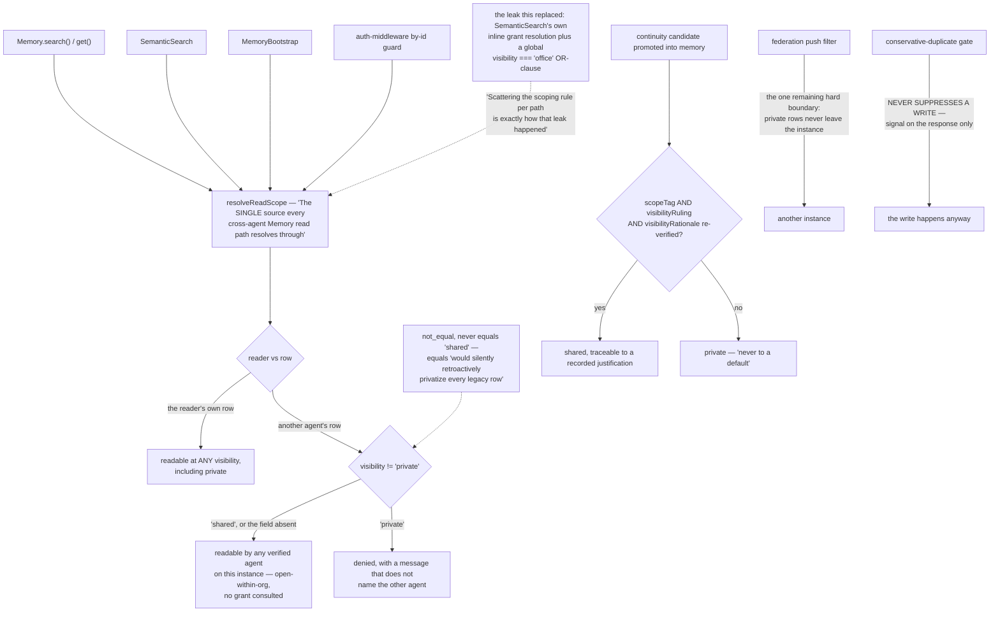

## 1. Executive Summary

Flair is "[t]he identity and memory substrate for AI agents. Crypto-pinned.
Federated. Self-hosted." Apache-2.0, TypeScript, version 0.54.2, 250,467 lines
with 474 test files, distributed as an npm CLI over a Harper instance it installs
and supervises, with thirteen adapter packages and a stdio MCP server written
into whichever clients it detects.

Its pitch is three things that survive a restart: an identity proved with an
Ed25519 keypair, memory searched by meaning, and a "soul" — the personality,
values and procedures that make an agent that agent.

What makes it worth reading is none of those. It is that the comments record the
bugs.

**The read-scoping module exists because the rule was once scattered.** Its
header says so:

> "Before this module existed, SemanticSearch had its OWN inline
> grant-resolution + a `visibility === "office"` global OR-clause that leaked ANY
> authenticated agent's read of ANY other agent's memories once that memory
> happened to carry `visibility: "office"` … Scattering the scoping rule per path
> is exactly how that leak happened — this module exists so it can't happen
> again: one rule, one place, every path imports it."

Four paths import it — search, get, semantic search, bootstrap, and the by-id
guard in the auth middleware — the resolver is composed from a record-type
registry rather than hand-typed per site, and a test introspects the composed
resolver's mode and owner field against that registry so the two cannot drift
apart again. That is the correct response to a scoping leak, carried through to
the test that keeps it fixed.

**The migration invariant is argued, not asserted.** The private exclusion is
`visibility != 'private'` and the module explains why it is not
`visibility == 'shared'`:

> "`not_equal`, which INCLUDES records missing the field entirely … never
> `visibility == 'shared'` (`equals`, which would EXCLUDE them and silently
> retroactively privatize every legacy row)."

Choosing the predicate by what it does to rows written before the field existed
is a habit almost nothing else here displays.

**Promotion defaults to private unless something justified sharing.** A
continuity candidate promoted into memory re-verifies a scope tag, a
`visibilityRuling` and a `visibilityRationale`, and defaults to private
otherwise, under a rule written into the schema: "a shared promoted row must
always trace to a recorded justification, never to a default."

**The dedup gate never suppresses a write**, in capitals, with the bug that
earned it: an earlier client-side gate returned the existing record instead of
writing, and "two topically-close but DISTINCT findings — one about replication
route-directionality, one about DDL/schema replication — and the SECOND was
silently dropped". Now the server computes a match signal, attaches it to the
response, and writes anyway.

Three marks follow from the above: a stored visibility that withholds, an owner
key bound from the authenticated agent and applied by one resolver, and an
end-to-end test — "(a) search as the connector: A's org-non-private row IS
visible; A's private row NEVER is" — that asserts both halves through the actual
MCP search tool, checking the private row's absence by id and by content marker.

**Now read the scope model before deploying it**, because it is not what
"identity substrate" usually implies. Within one instance, every verified agent
reads every other agent's non-private memory. That is deliberate — the module
calls it knowledge refinement rather than access control, `private` is "the ONLY
owner-only exception", and per-owner grants still exist as an inspectable
relationship but no longer gate any read. For a personal instance that is a
defensible model and the "zero knobs" argument behind it is coherent. For a
shared one it means one careless agent registration reads everything not marked
private, and the only hard boundary left is the federation push filter, which
"already excludes `private` rows from ever leaving this instance".

The identity is also narrower than the tagline. The Ed25519 key proves an agent
to the HTTP surface; memories are not encrypted with it, so losing it "costs the
identity, not the data", and nothing signs a memory's content. The `attribution`
field on a usage row is "OPAQUE — never parsed, never fed to an LLM, never
rendered" and the schema says to trust it as "nothing more than a label" — the
right disclosure, and a reminder that provenance here is a hint rather than a
proof.

That candour runs through the documentation too, which volunteers what most
projects bury: the match percentage "is not a probability that the memory answers
your question correctly"; a root-owned install makes semantic search "silently
degrade to keyword-only"; the built-in MCP surface is off by default and "[n]o
documented client setup uses it today"; and the install pulls roughly 130 MB of
React Native tooling a Node install never uses, with the upstream issue linked
and a warning not to fix it with `--omit=optional` because that breaks the
database binding.

## 2. Mental Model

A **memory** belongs to an agent and is open to the instance unless it says
private.

**Private** is the only word that withholds anything.

A **promotion** must cite its reason to be shared.

A **key** proves who is calling, not what was said.

## 3. Architecture

| Area | Role |
| --- | --- |
| `resources/Memory.ts` | The memory resource, the dedup signal, the write response |
| `resources/memory-read-scope.ts` | The one scoping rule |
| `resources/memory-visibility.ts` | Validation and the durability-keyed default |
| `resources/SemanticSearch.ts`, `bm25-index.ts` | Hybrid retrieval |
| `resources/Federation.ts` | Cross-instance sync and its push filter |
| `src/cli.ts`, `src/commands/` | init, doctor, upgrade, federation, quality |
| `packages/` | The stdio MCP adapter, a client, and eleven runtime bridges |

## 4. Essential Implementation Paths

`resources/memory-read-scope.ts:4-46` — the leak, the rule, and the invariant, in
one header.

`resources/Memory.ts:41-95` — a gate that computes a signal and never drops a
write, and the registry the scope is drawn from.

`schemas/memory.graphql:268-276` — default private unless a justification
survives re-verification.

`test/integration/mcp-connector-principal-mapping.test.ts:256-283` — both halves
of the claim, through the tool an agent actually calls.

## 5. Memory Data Model

Content, owning agent, durability class, visibility, embedding, usage. Durability
sets the write-time visibility default and a guard refuses to flip an ephemeral
row to shared on either POST or PUT — with the test file labelling its cases
"POSITIVE CONTROL" and "no over-fire", which is the vocabulary this atlas uses
for exactly the same reason.

## 6. Retrieval Mechanics

Hybrid semantic and lexical, with the honest note in the README that the
displayed percentage is a similarity with a keyword boost, that hybrid ranking
means the top result need not have the highest percentage, and that the number is
not a probability of correctness. Three sentences that prevent a category of
misreading.

## 7. Write Mechanics

Write, then signal. The gate scopes its single candidate comparison to the same
agent as the write — "never cross-agent" — and requires both a cosine threshold
and a Jaccard token overlap against the one top candidate, with no fallback to
the second. Conservative in both directions: it rarely claims a duplicate, and it
never acts on the claim.

## 8. Agent Integration

`flair init --agent name` writes a keypair, wires every detected MCP client to a
version-pinned `npx` adapter, and runs a smoke test. The distinction between the
built-in `/mcp` surface (off unless two environment variables are set) and the
separate stdio adapter package is documented rather than left to be discovered,
which is more care than the average MCP story gets.

## 9. Reliability, Safety, and Trust

The scoping history above is the trust story, and the surrounding disclosures are
the rest of it. What is absent: nothing signs memory content, there is no
provenance class distinguishing what a person said from what a model inferred, no
supersession, and no record of what a memory said before an edit.

## 10. Tests, Evals, and Benchmarks

474 test files across unit, isolated-unit, integration and end-to-end suites,
with a benchmark harness and a corpus profiler. Test names carry issue numbers
and the vocabulary of controls. Nothing was built or run for this reading.

## 11. For Your Own Build

Put the scoping rule in one module and make every path import it. Then add the
test that trips when a second copy appears. This project's own header is the best
argument for it in the corpus, because it is written from the other side of the
leak.

Choose the predicate by what it does to old rows. `!= private` and `== shared`
differ only on records written before the field existed, and one of them
privatises your whole history silently.

Never let a de-duplication gate drop a write. Compute the signal, return it, and
store the record; the two-findings bug is what the other design costs.

Default to private and require a reason to share. A promoted row that can only be
shared by citing a recorded justification is a memory system that can answer why
something is visible.

And say what your score is not. "This percentage is not a probability that the
memory answers your question" is one sentence that stops a whole class of
downstream misuse.

## 12. Open Questions

Whether the open-within-org model is intended for multi-tenant instances. The
module argues it as knowledge refinement for one org, and nothing in the code
distinguishes an org from an instance.

Whether federation verification covers content. The push filter excludes private
rows and the tree carries `federation-verify` and `fleet-verify`; what they
attest to was not traced.

What the "soul" costs at read time. It is central to the pitch and sits outside
the memory paths read here.

## Appendix: File Index

| Path | What to read it for |
| --- | --- |
| `resources/memory-read-scope.ts:4-46` | A leak, a rule, and an invariant argued from old rows |
| `resources/Memory.ts:41-95` | A gate that signals and never suppresses |
| `schemas/memory.graphql:186-199`, `:268-276` | A label not to trust, and a default that demands a reason |
| `test/data-scoping.test.ts:96-118` | The predicate, with its controls and a no-oracle assertion |
| `test/integration/mcp-connector-principal-mapping.test.ts:256-283` | Both halves, through the real tool |

## History

**2026-09-16** — [`02512aae1e859bcfa75d494f34b7a535a8caf0b5`](https://github.com/tpsdev-ai/flair/commit/02512aae1e859bcfa75d494f34b7a535a8caf0b5) — first reading, at a commit dated 15 September 2026. Screened before opening, from a shallow clone: thirty-five files scanned, no auto-run surfaces, twelve build-time execution points, five unpinned surfaces and sixteen dependency files inside the seven-day cooldown. Nothing was installed, built or run.
