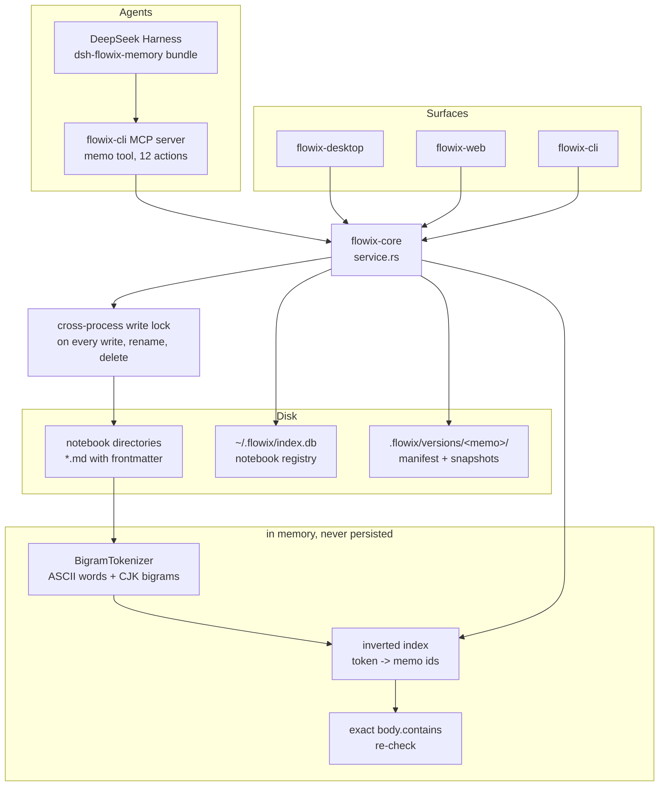

## 1. Executive Summary

Flowix is a Markdown notebook — a Rust workspace with a desktop app, a web
build, a CLI and a plugin runtime — that has grown an agent surface. The
`dsh-flowix-memory` bundle registers a local `flowix-cli` MCP server with a
DeepSeek Harness instance, and the agent gets one tool, `memo`, with twelve
actions: list notebooks, list memos, list tags, show, search, create, edit,
write, delete, and three artifact operations.

It is in this corpus because memos outlive the session that wrote them, are
retrieved later by search, and can be corrected and deleted. It carries no
capability mark, and that is a statement about what the product is rather than
a defect list: a memo has no status, no confidence and no review state;
nothing records what happened to one; and a delete is complete, taking the
version history with it. The atlas's marks test for governance a notebook app
does not need.

What it does have is worth reading anyway, and two things in particular. The
search module knows its own failure mode and defends against it: a bigram index
will match `ab` and `bc` for a query of `abc` without the substring being
present anywhere, so every surviving candidate is re-checked with an exact
`body.contains` before it is returned. And the version-cleanup code is written
so that *"a missing index row cannot destroy recoverable history"* — the
sweeper retains version directories it cannot account for rather than deleting
what it does not recognise.

## 2. Mental Model

A notebook is a directory. A memo is a Markdown file in it whose frontmatter
carries an eight-character `flowix_key` as its identity — with the older
six-character form still accepted, and a legacy `key` field kept but no longer
used for identification.

Editing a memo may snapshot it: at most once an hour, into
`<notebook>/.flowix/versions/<memo_id>/`, with a manifest recording each
version's id, timestamp, source (`auto`, `manual` or `restore_backup`), title,
size and content hash. Twenty are kept.

Search is a separate, ephemeral structure. The inverted index lives in memory
and is never written to disk; it is rebuilt when the notebook changes, and it
tracks the app's own write commands as they happen.

## 3. Architecture



## 4. Essential Implementation Paths

- **Service surface:** `app/flowix-core/src/service.rs`.
- **Memo files, frontmatter and identity:**
  `app/flowix-core/src/memo_file/frontmatter.rs`, `types.rs`, `ops/crud.rs`.
- **Versions:** `app/flowix-core/src/memo_file/versions.rs`.
- **Notebook registry:** `app/flowix-core/src/memo_file/notebook.rs`.
- **Search:** `app/flowix-core/src/search.rs`.
- **Agent bundle:** `dsh-flowix-memory/` — `cordis.patch.yml`, `launcher.mjs`,
  `memo-tool-schema.json`.

## 5. Memory Data Model

A memo is its file. Frontmatter carries `flowix_key` as the identity, a title,
tags, `created_at` and `updated_at`; the body is the Markdown beneath the
`---` block. There is no status, no confidence, no owner and no review field.

The version manifest is the only other durable structure per memo:

```
{ version, memo_id, versions: [
    { id, memo_id, created_at, source, filename, title, size, content_hash }
] }
```

`MEMO_AUTO_VERSION_INTERVAL_MS` is an hour, `MEMO_VERSION_LIMIT` is twenty, and
`MEMO_ORPHAN_VERSION_RETENTION` is thirty days — the window an unrecognised
version directory is kept before cleanup, with the comment explaining that it
protects against transient sync visibility and delayed watcher events.

## 6. Retrieval Mechanics

The index maps a token to a sorted set of memo ids, and a multi-token query is
an intersection folded from the smallest set. Scoring is flat and stated in the
module header: a title hit is worth 10, a tag hit 5, and body hits accrue by
frequency from 1.0 in steps of 0.1 up to a ceiling of 3.0, with
`updated_at / 1e13` added as a tie-break and the memo id as the final stable
one.

Two design notes are worth carrying out of this file.

The **false-positive defence** is the better one. A bigram index has a known
weakness — matching `ab` and `bc` does not establish that `abc` occurs — and
the module says so, then re-verifies each candidate with an exact
`body.contains(query_lower)` before returning it, discarding what fails. The
committed case for it, `search_bigram_false_positive_rejected`, queries `bcde`
against a body of `abc def` and asserts nothing comes back.

The **stated limitation** is the other. The index tracks the app's own write
commands — rename, write, add, import, clear, delete — so a user who edits a
`.md` in an external editor leaves it stale until switching notebooks triggers
a rebuild. The header says this plainly and names the fix it has not made yet:
hang a `notify` watcher on the directory.

## 7. Write Mechanics

Every file write, rename and delete goes through
`acquire_cross_process_write_lock`, which matters because three processes can
hold the same notebook open — the desktop app, the CLI, and the MCP server the
agent talks to.

An edit may create a version, at most hourly, and the sweep that enforces the
twenty-version cap is deliberately conservative about what it does not
recognise. Deletion is the opposite: `delete_memo_result_global` removes the
`.md`, calls `remove_memo_versions_for_notebook`, and updates the index. A
committed test, `delete_memo_removes_version_history`, seeds both a current
version directory and a legacy one and asserts that both are gone afterwards.

## 8. Agent Integration

The bundle is small and honest about its own reach. `cordis.patch.yml` inserts
one `@deepseek-ai/dsh-mcp-client` row that ships inside every Harness
distribution, and `launcher.mjs` proxies to `flowix-cli` when it is installed —
and when it is not, keeps the tool registered and returns an actionable
installation error to the agent rather than disappearing. The README states the
boundary: *"Nothing here connects to a remote Flowix service — the CLI is
spawned locally over stdio and reads the local notebook data directory."*

## 9. Reliability, Safety, and Trust

**No capability mark is awarded**, and each is worth naming so a reader can
tell a mark that was considered from one nobody looked for.

**Trust state — no such field exists.** A memo's frontmatter carries an id, a
title, tags and two timestamps. There is no draft, no confirmed, no deprecated,
nothing a read could filter on.

**Tombstone — deletion is complete.** The file goes, the version history goes
with it, and the committed test asserts exactly that. Nothing remains to say a
memo was ever there.

**Bitemporal — one time axis.** `created_at` and `updated_at` record when the
store learned something. There is no field for when the thing described
happened, and no as-of read.

**Audit log — none.** Searched `flowix-core` for `audit`, `event_log`,
`activity_log` and `history`: the only hits are the version history and a
maintenance report type. Nothing records that a memo was read, edited by whom,
or why.

**Scope enforced — notebooks are a filter, not a boundary.**
`search_notebooks` takes `notebook_filter: Option<&str>`, and with `None` the
search spans every registered notebook. For a single-user notebook app that is
the right default; it means the notebook is a place to put things rather than a
predicate a read must satisfy.

**Negative eval — withheld, and the repair is one line.**
`search_bigram_false_positive_rejected` builds an index containing exactly one
memo and asserts that a near-miss query returns zero hits. The result set it
measures is empty by construction, so a search that returned nothing for
everything would pass it. The other fourteen cases in the file include real
positive assertions — `search_cross_token_intersection` names two ids that must
be present — but they are separate tests with separate fixtures. Adding an
assertion to the false-positive case that `abc` *does* return the memo would
close it.

**Human review — not applicable.** There is no approval surface.

## 10. Tests, Evals, and Benchmarks

**No paper.** Searched the README and `docs/` for `arxiv`, `@article`,
`@misc`, `doi.org` and `CITATION.cff`: none. This is a product.

The suite is substantial for an app of this size: 148 `#[test]` functions in
`memo_file/tests.rs` alone, with further test modules under `search.rs`,
`secret/`, `derivation/`, `file_io/`, the desktop agent session and the CLI.
The cases are specific — CJK bigram tokenisation with a unigram fallback,
title-outranks-body ordering, tag-only matches, empty-query handling, limit
truncation and the stable tiebreak — and several verify migration and cleanup
behaviour, including that a recent unknown version directory survives a sweep.

No retrieval benchmark is committed, and none is claimed.

## 11. For Your Own Build

- **Verify a probabilistic index against the source.** If your tokenizer can
  produce a hit the raw text does not support, check the raw text before
  returning. This file names the failure mode and then closes it in the same
  function.
- **Make the cleanup sweep conservative about the unfamiliar.** Retaining an
  unrecognised version directory for thirty days, so that a missing index row
  cannot destroy recoverable history, is the right default for anything that
  prunes.
- **Take a cross-process lock if more than one process can write.** A desktop
  app, a CLI and an MCP server sharing a directory is three writers, not one.
- **Say what your index does not track.** The header names the write commands
  it follows and the case it misses, which is more useful than a correctness
  claim.

## 12. Open Questions

- The search index is per-notebook and rebuilt on switch, while
  `search_notebooks` spans all of them. What does a cross-notebook search cost
  on a large registry, and is every notebook's index resident?
- Sync is a whole crate (`flowix-sync`) with its own store and manager. What
  happens to version manifests and the `flowix_key` identity when two devices
  edit the same memo?
- The bundle's launcher keeps the tool registered when `flowix-cli` is absent.
  Does an agent that calls it then receive an error it can act on in every
  action, or only in the ones the launcher proxies?

## Appendix: File Index

- Service: `app/flowix-core/src/service.rs`
- Memo model and frontmatter: `app/flowix-core/src/memo_file/types.rs`,
  `frontmatter.rs`
- CRUD and deletion: `app/flowix-core/src/memo_file/ops/crud.rs`
- Versions: `app/flowix-core/src/memo_file/versions.rs`
- Notebook registry: `app/flowix-core/src/memo_file/notebook.rs`
- Search: `app/flowix-core/src/search.rs`
- Locking and file IO: `app/flowix-core/src/memo_file/file_io.rs`
- Agent bundle: `dsh-flowix-memory/`

## History

**2026-09-19** — [`d3f5b81229a33a4bde48b76697957eee020f8080`](https://github.com/text2future/flowix/commit/d3f5b81229a33a4bde48b76697957eee020f8080) — first reading, at the head of `main`. Screened with `scripts/screen_repo.py` before anything was read: an unpinned dependency surface and dependency manifests inside the seven-day cooldown, which is what screening a `--depth 1` clone reports; nothing was installed, built or run. **No capability mark.** The reading covered the memo model and its frontmatter identity, the CRUD and deletion paths, the version manifest and its cleanup, the notebook registry, the search index and its scoring, the cross-process lock, and the DeepSeek Harness bundle that exposes the twelve-action `memo` tool; the sync crate, the plugin runtime and the desktop and web front-ends were read as context rather than as subject. MIT. Section 9 names every mark that was considered and why it was withheld — the short version is that a memo has no status, deletion takes the version history with it, one time axis is recorded, nothing audits, a notebook is an optional search filter rather than a predicate, and the one case written as a negative control measures an empty result set. The two mechanisms worth a reader's time are the bigram false-positive re-check and a version sweep written so that a missing index row cannot destroy recoverable history.
