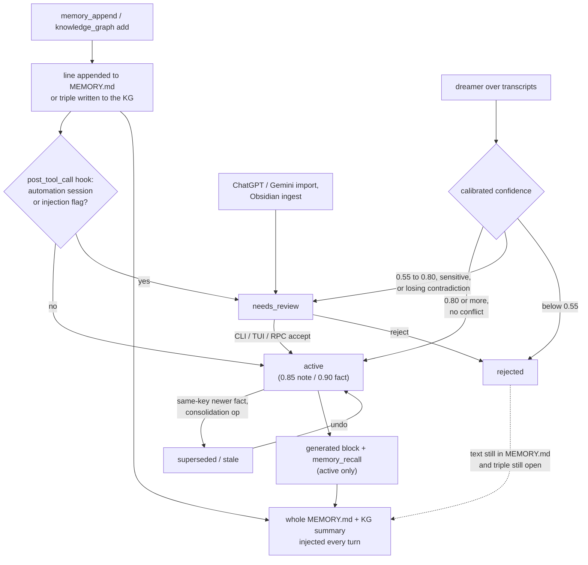

## 1. Executive Summary

Flowly is a self-hosted personal agent — a terminal UI, a gateway speaking to
Telegram, Slack, WhatsApp and other channels, cron, skills and an MCP server —
and this report covers only its memory subsystem. That subsystem is a
governance layer over two older stores: free-form notes appended to
`MEMORY.md`, and a temporal knowledge graph of subject-predicate-object
triples. A SQLite governance store gives every memory a status, a confidence,
a privacy level and an audit trail. Three writers feed it: a live hook on the
agent's memory tools, a background "dreamer" that extracts memories from
transcripts, and importers for ChatGPT, Gemini and Obsidian material.

What is notable is how much of the lifecycle is enforced rather than
described. Status moves go through a transition table that raises on anything
unlisted, each one writes an audit row, and consolidation lets an LLM propose
merges while a validator decides whether to apply them. Imported and
vault-derived memories cannot activate themselves.

What is weak is that the live capture path governs a copy. `memory_append`
writes its line into `MEMORY.md`, and `knowledge_graph add` writes its triple,
before the hook creates the governance item. The prompt injects the whole
file and the graph summary, so an item parked in `needs_review`, or later
rejected, still reaches the model.

Five marks: `trust_state`, `bitemporal`, `audit_log`, `human_review` and
`negative_eval`. Each rests on the governance store and the paths whose text
lives only there; section 9 names what each leaves open and the two withheld.

## 2. Mental Model

A memory is a governance item. It either wraps an external record (`ref_kind`
`memory_md`, `kg_triple` or `obsidian_note`) or carries its text `inline`
(`flowly/memory/governance.py:125-147`). Its status is one of `candidate`,
`active`, `needs_review`, `stale`, `superseded` and `rejected`, and
`transition()` refuses any move the table does not list (`:64-86`, `:453-496`).
`rejected` is terminal; `superseded` can only return to `active` through undo.

**How a thing becomes a belief depends on who wrote it.** A `memory_append` or
`knowledge_graph add` in a user-channel session is activated at once with a
fixed confidence of 0.85 or 0.90. The same write from a session whose key
starts `heartbeat:`, `cron:`, `subagent:` or `system:`, or one that trips the
injection scanner, lands in `needs_review` (`flowly/memory/coordinator.py:280-376`,
`flowly/memory/dreamer.py:154-167`). The dreamer calibrates confidence from
whether the user said it and how often it recurs, then activates at 0.80,
reviews between 0.55 and 0.80, and rejects below (`dreamer.py:416-554`).
Imports never activate (`flowly/memory/importer.py:421-430`).

**A contradiction is keyed, not judged.** Facts key on
`fact:<subject>|<predicate>`, notes on `pref:` plus the first six words. A new
active fact on the same key supersedes the old one and closes its triple. The
dreamer lets a newcomer win only when it is explicit and clears the auto floor;
otherwise the contradiction waits for review (`dreamer.py:511-542`).

**Belief ends by transition, never by deletion.** A consolidation pass marks
items `stale` or `superseded`; the user can reject, correct or undo; unhelpful
feedback demotes below 0.55. The governance row and its audit history stay.

**Where the state machine stops.** The status decides what `memory_recall`
returns and what the generated block of `MEMORY.md` lists. It does not decide
what the rest of `MEMORY.md` says, or what the graph summary says, and on the
live path those already hold the text.

## 3. Architecture

Memory runs in-process inside the `AgentLoop` of the gateway or the TUI. Three
SQLite files sit under the profile data directory (`~/.flowly` or
`~/.flowly/profiles/`, one subdirectory per profile):
`memory_governance.sqlite3`, `knowledge_graph.sqlite3` and
`memory_index.sqlite`. `MEMORY.md` and dated daily notes sit in the
workspace's `memory/` directory (`flowly/agent/memory.py:9-54`).

The governance store is one connection behind a `threading.RLock`, WAL mode,
foreign keys on (`governance.py:263-281`). There is no cross-process lock: the
CLI and the feature RPC each open their own connection to the same file. The
dreamer holds an advisory lock in `memory_meta` that goes stale after 30
minutes (`dreamer.py:259-274`).

`AgentLoop._maybe_enable_memory_governance` builds the facade, registers the
hook, pushes it into the subagent manager, registers four memory tools, and
reads the consolidation and dreamer schedules (`flowly/agent/loop.py:1477-1560`).
`run()` starts the consolidation timer and the dreamer's idle and daily timers
(`loop.py:3442-3443`). The config default is `enabled = True`
(`flowly/config/schema.py:221-260`).

`memory_search` is a separate index over every `.md` under `memory/`: FTS5 BM25
always, and brute-force cosine over stored embeddings when an embedding
provider resolves (`flowly/memory/manager.py:100-150`,
`flowly/memory/search.py`).

### Deployment and ergonomics

Nothing beyond Python and an LLM key has to run; every store is a local file.
Storing a memory needs no key. The dreamer, consolidation and import each spend
a model call on the user's provider, and search degrades to keyword-only
without an embedding provider. The documented install is a `curl | bash`
script. `MEMORY.md` is readable and hand-editable outside its sentinel markers;
the governance store is readable with `flowly memory list` and repairable with
`accept`, `reject`, `correct` and `undo`.

## 4. Essential Implementation Paths

**Live capture.** `MemoryAppendTool.execute` scans the content, rejects exact
and trigram near-duplicates, and appends a timestamp comment plus the text to
`MEMORY.md` under a file lock (`flowly/agent/tools/filesystem.py:494-636`).
The post-tool hook `_governance_post_tool` derives `auto_activate` from the
session id and calls `ingest_append` or, for a `knowledge_graph add`, pulls
the triple id from the result string and calls `ingest_kg_fact`
(`loop.py:1562-1592`).

**Dreamer.** `SessionIndexDeltaSource.read_since` reads user-channel messages
past a watermark, excluding automation sessions in SQL (`dreamer.py:170-196`).
A tool-less subagent extracts JSON candidates, which `_commit_candidate` scans,
reconciles against active, queued and candidate items on the same key,
calibrates and routes (`dreamer.py:416-498`). The watermark advances only after
the commit pass, and an `ExtractionError` holds it (`:366-397`).

**Retrieval and injection.** `ContextBuilder._compute_memory_block` reads the
whole of `MEMORY.md`, runs `scan_context_file` over it, and appends
`KnowledgeGraph.summary(max_entities=20)` (`flowly/agent/context.py:1125-1163`).
`memory_recall` returns active, non-secret items ordered by confidence
(`coordinator.py:199-227`).

**Update and correction.** `accept`, `reject`, `correct` and `undo` sit on the
facade (`coordinator.py:66-189`). `undo` demotes the current active sibling and
reopens the old triple through `SqliteKGMirror.restore`
(`flowly/memory/kg_mirror.py:44-59`).

**Consolidation.** `build_context` snapshots active items; the LLM returns
`merge`, `supersede` or `stale` ops; `apply_operations` skips any op whose
target or merge survivor is not active (`flowly/memory/consolidate.py:60-176`).
The loop runs it every 50 turns or 30 minutes when the store is dirty
(`loop.py:1594-1637`).

**Surfaces.** The `flowly memory` CLI has `list`, `review`, `accept`, `reject`,
`correct`, `undo`, `feedback`, `consolidate`, `dream`, `import` and `migrate`
(`flowly/cli/memory_cmd.py`). The `memory.*` feature RPC methods are
registered at `flowly/channels/feature_rpc.py:4761-4776`, and the TUI review
panel is `flowly/tui/panes/memory_review.py`.

## 5. Memory Data Model

`memory_items` holds kind, text, status, `ref_kind`/`ref_id`,
`normalized_key`, confidence, `privacy_level`, `source_session`,
`source_message_ids`, `supersedes`, `valid_from`, `valid_to`, `last_seen_at`,
`last_used_at`, timestamps and JSON metadata. `memory_audit`, `memory_meta`
and `memory_feedback` sit beside it (`governance.py:185-240`). Nine kinds are
allowed; only `fact` references the graph.

The graph has `entities`, `aliases` and `triples`, each triple carrying
`valid_from`, `valid_to`, confidence, `source` and `extracted_at`
(`flowly/memory/knowledge_graph.py:36-72`). Value predicates such as `email`
store the object as text rather than as an entity.

**Scope.** There is no user, tenant or project key. A profile is a separate
data directory. `source_session` records provenance and nothing filters on it.

**Privacy.** `secret` is excluded from recall and from the generated block;
`sensitive` is excluded from recall unless the caller passes
`include_sensitive`, which is a parameter on the agent's own tool
(`coordinator.py:210-215`, `flowly/agent/tools/memory_recall.py:32-48`).

**Time.** The governance item's `valid_from` and `valid_to` are columns with no
writer on a live path; the graph's validity pair is the one in use.

## 6. Retrieval Mechanics

**Injection is whole-file.** Every turn the system prompt carries all of
`MEMORY.md` — the manual region, the appended timestamped lines and the
generated block — plus the top 20 graph entities by current triple count. The
append tool caps the file at 12,000 characters by evicting the oldest
timestamped entries (`filesystem.py:601-611`). Its parser splits on timestamp
comments, so the generated block is not an entry of its own. It travels with
whichever chunk precedes the next timestamp and is evicted with it until the
turn-end regeneration appends it again.

**If the scanner flags the file, all memory goes.** `scan_context_file`
returns a placeholder for the whole `MEMORY.md`, which replaces it in the
prompt (`context.py:1130-1138`).

**Tool retrieval.** `memory_recall` orders by confidence and nothing else, and
its `limit` is applied before the privacy filter, so a secret among the top
rows shortens the result (`coordinator.py:204-215`). `memory_search` ranks
chunks by `0.7 × cosine + 0.3 × normalised BM25` and drops below 0.35
(`search.py`). `knowledge_graph query` resolves an entity by id or alias and
returns one-hop edges, optionally `as_of` a date
(`knowledge_graph.py:310-365`).

**A freeze option** snapshots the memory block per session to keep the provider
prompt cache stable; it defaults off (`schema.py:254-260`,
`context.py:1165-1177`).

## 7. Write Mechanics

**Live writes block the turn for a few SQLite statements.** The hook is
synchronous; `MEMORY.md` is regenerated once at turn end rather than per write
(`loop.py:8920-8927`). A live write is in the prompt on the next turn because
the raw line is already in the file.

**The dreamer is deferred.** It runs on idle after 30 minutes, daily at 03:30
and every 10 user turns, in a worker thread, reading at most 500 messages per
pass (`schema.py:239-248`, `loop.py:1641-1720`). A new dreamer memory is
retrievable after the next pass and visible in the prompt after the
`on_committed` refresh.

**Consolidation re-reads every active item.** Each pass sends the full active
set and the graph summary to the agent's main model. It is gated on a dirty
flag, so it runs only after new writes, but its input grows with the store, not
with the day's writes.

**Deduplication** happens three times: trigram similarity at 0.75 in the tool,
exact normalised text against active items in `ingest_append`
(`coordinator.py:299-303`), and same-key exact text in the dreamer, which bumps
confidence by 0.05 instead of inserting.

**Filtering.** The tool refuses content `scan_content` flags; the hook routes
`scan_context_file` hits to review and fails closed if the scanner raises
(`coordinator.py:29-37`). Self-referential triples with subject equal to object
are not governed (`:340-344`), but the tool has already written them to the
graph.

**Nothing is deleted in governance.** No statement in the governance module
deletes a row. `merge_entities` in the graph does delete duplicate triples and
the source entity (`knowledge_graph.py:267-306`).

## 8. Agent Integration

The agent holds `memory_append`, `knowledge_graph`, `memory_search`,
`memory_get`, `memory_recall`, `memory_feedback`, `memory_consolidate` and
`memory_import`, plus `obsidian_ingest` when a vault is configured. Tool
descriptions and a system-prompt section steer notes to `memory_append` and
structured facts to the graph. A pre-compaction flush turn exposes only
`memory_append` and `knowledge_graph` (`loop.py:7378-7400`).

The self-review subagent runs in the background after qualifying turns with
exactly those two tools (`flowly/agent/subagent.py:755-759`,
`loop.py:2222-2239`). Its registry receives the governance hook
(`subagent.py:694-702`).

The agent has agency over what enters memory and can retire active items
through consolidation. It cannot approve a queued item. It can also rewrite
`MEMORY.md` with `write_file` or `edit_file`, which scan content under
`memory/` and record nothing in governance (`filesystem.py:314-323`).

Adapting this to another agent means porting the hook contract: a
`post_tool_call` context carrying tool name, params, result and session id.

## 9. Reliability, Safety, and Trust

**The live path governs a copy.** `ingest_append` and `ingest_kg_fact` run
after the tool has written. `reject` transitions the item and does nothing
else (`coordinator.py:130-137`). The appended line stays in the manual region
that `splice_generated_block` preserves (`summary.py:104-118`), and the triple
keeps `valid_to` null, so `summary()` still reports it
(`knowledge_graph.py:457-501`). The CLI `reject` does not regenerate the
generated block either. A `needs_review` automation write is in the prompt
from the next turn.

**Subagent writes bypass the automation gate.** The hook reads `ctx.session_id`,
which the registry fills from `set_active_session` or an explicit
`session_key` (`flowly/agent/tools/registry.py:304-308`, `:753-757`). The
subagent loop calls `tools.execute(name, args)` without either
(`subagent.py:1032-1034`), and only the main loop binds a session
(`loop.py:7667`). `is_automation_session("")` is false, so self-review writes
activate as if a user had asked. The gating test calls the facade with
`auto_activate=False` directly, and the hook test re-implements the hook, so
neither exercises this derivation (`tests/test_coordinator_review_gating.py`,
`tests/test_memory_governance_hook.py:34-45`).

**Rejected values come back.** The dreamer reconciles against `active`,
`needs_review` and `candidate` only (`dreamer.py:441-444`), and its extractor
context lists active and queued items (`:287-304`). A value the user rejected
is a fresh candidate the next time a transcript mentions it.

**Actor labels are call-site constants.** `accept`, `reject`, `correct`, `undo`
and `ingest_feedback` record `actor="user"` whoever calls them, so the agent's
`memory_feedback` demotion is logged as a user action
(`coordinator.py:248-252`).

**Graph and governance drift.** The hook handles `add` only. An agent
`invalidate` closes the triple while the governance item stays active and its
text stays in the generated block.

**Concurrency** is one in-process writer; the CLI and RPC are extra
connections on WAL with no application lock.

Capability marks:

- `trust_state` — awarded; the filter holds for items whose text lives only in
  the governance store. Limits above.
- `bitemporal` — awarded on the graph's validity pair beside `extracted_at`.
- `audit_log` — awarded on `memory_audit`; text and confidence edits are not in
  it.
- `human_review` — awarded; the queue is real for dreamer, import and vault
  items and advisory for live automation writes.
- `negative_eval` — awarded; evidence in section 10.
- `tombstone` — withheld. `rejected` is a status on a record, and no reader
  consults it before inserting.
- `scope_enforced` — withheld. The profile is a physical partition, with no key
  on an item and no predicate on a read.

## 10. Tests, Evals, and Benchmarks

Nothing was installed or run for this report; the following is from reading
the tests at the pin. CI runs `uv run pytest` (`.github/workflows/ci.yml:45`).

**Negative cases with controls.** `test_recall_excludes_secret_includes_normal`
asserts a normal item is recalled and a secret one is not
(`tests/test_memory_coordinator.py:110-120`). The Obsidian pair asserts nothing
is recalled before acceptance, one item after, and none after rejecting it,
with an accepted secret staying out throughout
(`tests/test_obsidian.py:205-242`). `test_render_only_active_items` and
`test_regenerate_omits_secret_items` assert a candidate and a secret stay out
of the generated block beside a rendered active item
(`tests/test_memory_summary_migration.py:37-44`, `:210-218`).

**Lifecycle.** `test_memory_governance.py` covers the transition table;
`test_memory_calibration_supersede.py` covers calibration and asserts the graph
holds one current email after a supersede. `test_memory_dreamer.py`,
`test_dreamer_fail_closed.py` and `test_dreamer_source_filter.py` cover
routing, the fail-closed scanner and the automation filter.

**Not covered.** No test asserts what the prompt contains after a reject. No
test drives a subagent write through the real hook. No test uses `as_of`. No
retrieval-quality evaluation or benchmark is committed, and no paper or
citation block is in the tree.

## 11. For Your Own Build

### Steal

- **Let the model propose and a validator apply.** Consolidation ops name ids;
  anything not active is skipped and recorded, and nothing deletes.
- **Enforce the transition table in the store.** A raised `InvalidTransition`
  is cheaper than auditing how a row reached an impossible state.
- **Make import land in review by construction.** An auto floor above 1.0 is a
  one-line guarantee that no imported claim activates itself.
- **Hold the watermark on extraction failure.** An empty result and a failed
  call must advance differently.
- **Fail the injection scanner closed into review**, not into active and not
  into silence.

### Avoid

- **Governing after the write.** If the raw text reaches the prompt before
  the status exists, the status can only annotate. Put the gate in front of the
  store the prompt reads.
- **A reject that touches only the wrapper.** Every store holding the value
  must hear about it; here the file and the graph do not.
- **Deriving trust from a field one caller forgets to set.** An empty session
  id reads as "user channel". Default the unknown case to the stricter branch.
- **Testing a copy of the hook.** A test that re-implements the production
  hook cannot catch the production hook's input being wrong.

### Fit

This suits one person running their own agent who wants memory that tidies
itself and a place to review what the background passes learned. The design
assumes a single process, one user per profile and a model budget for
recurring consolidation. Anyone who needs rejection to stick, or review to gate
what the model sees on every path, has to close the live-capture gap first,
which means moving the tools' writes behind the governance decision.

## 12. Open Questions

- Does a reject in the desktop client trigger any cleanup of `MEMORY.md` that
  the gateway RPC does not show?
- How often does the size cap evict the generated block in practice, and does
  anything rely on its position in the file?
- Is the empty subagent session id intended, given the governance document
  says background runs land in review?
- What does a typical consolidation pass cost on the default model?

## Appendix: File Index

- **Storage and schema:** `flowly/memory/governance.py`,
  `flowly/memory/knowledge_graph.py`, `flowly/memory/kg_mirror.py`,
  `flowly/agent/memory.py`, `flowly/memory/indexer.py`.
- **Write path:** `flowly/agent/tools/filesystem.py` (`MemoryAppendTool`),
  `flowly/agent/tools/knowledge_graph.py`, `flowly/memory/coordinator.py`,
  `flowly/memory/dreamer.py`, `flowly/memory/extractor.py`,
  `flowly/memory/importer.py`, `flowly/memory/calibration.py`.
- **Retrieval and context:** `flowly/agent/context.py:1125-1177`,
  `flowly/memory/summary.py`, `flowly/memory/manager.py`,
  `flowly/memory/search.py`, `flowly/agent/tools/memory_search.py`,
  `flowly/agent/tools/memory_recall.py`.
- **Background:** `flowly/agent/loop.py:1477-1720`,
  `flowly/memory/consolidate.py`, `flowly/agent/tools/memory_consolidate.py`,
  `flowly/agent/subagent.py`.
- **Surfaces:** `flowly/cli/memory_cmd.py`, `flowly/channels/feature_rpc.py`,
  `flowly/tui/panes/memory_review.py`, `flowly/memory/editor.py`.
- **Tests:** `tests/test_memory_*.py`, `tests/test_coordinator_review_gating.py`,
  `tests/test_dreamer_*.py`, `tests/test_obsidian.py`.
- **Design document:** `docs/memory-governance-architecture.md`.

### Recorded searches

Checked against the checkout at the pinned revision.

- `grep -rn 'STATUS_REJECTED\|"rejected"' flowly --include='*.py'` — memory hits are the constant, the transition table and three writers (`coordinator.py:136`, `dreamer.py:434`, `:547`); no read before an insert.
- `grep -n 'kg_mirror' flowly/memory/coordinator.py` — supersede in the Obsidian accept, undo and `ingest_kg_fact`; restore in undo; none in `reject`.
- `grep -rn 'atomic_write(\|write_long_term(' flowly --include='*.py'` — `MEMORY.md` is written by `summary.py:147`, `editor.py:98` and `filesystem.py:634`; none removes a governed line.
- `grep -rn -E 'UPDATE memory_audit|DELETE FROM memory_(audit|items)' flowly` — no match.
- `grep -rn 'set_active_session(' flowly --include='*.py'` — `loop.py:7667` and `:7701` only.
- `grep -n 'user_id\|tenant\|scope\|profile' flowly/memory/governance.py` — one hit, the `profile` kind.
- `grep -n 'invalidate' flowly/agent/loop.py` — no hook branch for a graph invalidate.
- `grep -rln 'as_of' tests` — no match.
- `grep -rnoiE 'arxiv|bibtex|@article|@misc|doi\.org|CITATION' . --exclude-dir=.git` — only skill names and tool-output fixtures in tests; no paper.

## History

**2026-09-30** — [`a5dc7c3045ec54bf0151fdba7b89f285b1ba8d9c`](https://github.com/Nocetic/flowly/commit/a5dc7c3045ec54bf0151fdba7b89f285b1ba8d9c) — first reading, at the head of `main`, a commit dated 17 September 2026. Five marks: `trust_state`, `bitemporal`, `audit_log`, `human_review`, `negative_eval`. Screened before reading: no auto-run surface, five build-time execution points (three `setup.py`, two `conftest.py`), three unpinned surfaces (two `package.json`, one skill `requirements.txt`), nothing inside the cooldown, and no agent-instruction file. Read with `grep` and `sed`; nothing installed, built or run. Only the memory subsystem is covered.
