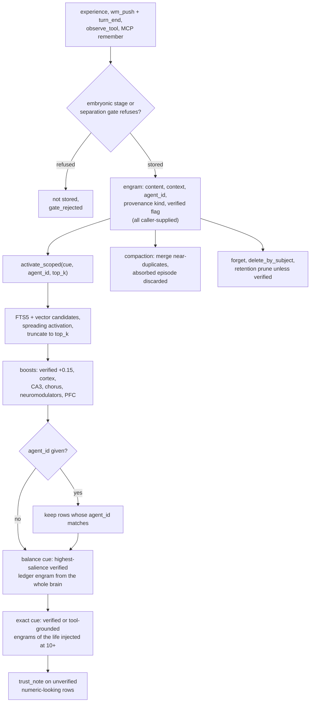

## 1. Executive Summary

FluctlightDB is an embedded memory engine for agents, written in Rust with a
Python SDK, an MCP server and an HTTP server. A memory is an *engram*: an
episode with content, context, optional agent and tenant ids and a provenance
record. `experience()` writes one; `activate()` recalls by cue through hybrid
FTS5 and vector candidates, spreading activation over a synapse graph, and a
long chain of score adjustments named after brain regions.

What is notable is the provenance lane. Every episode can carry a kind
(`ChatAssertion`, `FileObservation`, `ToolGrounded`, `LedgerVerified`,
`UserExplicit`) and a `verified` flag, and recall, retention and conflict
resolution all read them. The engineering around storage is careful:
generational checkpoints with fault-injection points, a write-ahead log, a
writer fence, and a committed benchmark harness whose published shared-brain
result recomputes from its JSON.

What is weak is where the boundaries sit. The `agent_id` filter runs after the
result is ranked and truncated, and two lanes then inject verified engrams from
the whole brain. The v4 checkpoint writer omits two segments its loader reads,
so the governance audit log and the retention clock reset on every reopen.
`verified` is whatever the writer sends.

The project is one author's work over about three and a half months, with a
paper, [arXiv:2608.12365](https://arxiv.org/abs/2608.12365) (submitted
10 July 2026). It is dual-licensed MIT or Apache-2.0.

No mark is awarded. Section 9 names each of the seven and the reason.

## 2. Mental Model

A memory becomes a belief when `experience()` returns. There is no candidate
state: the engram is encoded into the hippocampus vector, wired into the graph,
indexed in the sidecar and retrievable by the next `activate`. Two gates can
refuse it first. A brain in the `Embryonic` development stage stores only
content prefixed `reflex:` (`crates/fluctlightdb/src/brain.rs:422-424`). A
separation gate, on unless `FLUCTLIGHT_SEPARATION_GATE` is off, refuses an
unverified, non-ledger episode too confusable with existing ones and returns
`gate_rejected` with a reason (`brain.rs:520-556`; `separation_gate.rs:25-29`).

**Provenance is attached at write time and never re-derived.** The kind and the
`verified` flag come from the caller: `verified: true` in an HTTP body makes the
row verified (`crates/fluctlightdb/src/serve.rs:2773-2795`), `verify_fact`
promotes an existing row (`brain.rs:1117-1140`), and `observe_tool` stamps
`ToolGrounded` on whatever tool name and result text it is handed
(`crates/fluctlightdb/src/agent_runtime.rs:213-269`). Nothing checks the
source.

**A memory stops being one in five ways.** `forget_engram` and the governance
deletes remove rows (`crates/fluctlightdb/src/query.rs:391-405`;
`governance.rs:179-254`). Retention prunes engrams below a salience floor of
0.12, or older than `retain_days`, unless verified
(`retention_policy.rs:65-91`). `reconsolidate` overwrites the content in place
and keeps no prior value (`brain.rs:1328-1399`). Compaction merges a
near-duplicate into a keeper and discards the absorbed episode, its agent id and
its provenance with it (`compact.rs:25-169`).

Nothing marks a memory false. Recall ranks verified rows higher and annotates
unverified rows that look numeric with *"recalled utterance — not verified
ground truth; check ledger/tools"* (`brain.rs:2333-2357`).

## 3. Architecture

The core is the `fluctlightdb` crate: `FluctlightBrain` holds a hippocampus
(the engram list), a synapse graph, a semantic field of vectors, a cortex of
consolidated token weights and schemas, prefrontal goals and inhibitions, and
about a dozen more subsystems named for brain regions. `fluctlight-py` exposes
it to Python through PyO3, `fluctlight-cli` ships a CLI and the
`fluctlight serve` HTTP server, and `sdks/python/fluctlightdb` wraps the native
module with `connect_agent`, `connect_embedded`, `connect_project`, the MCP
server and framework adapters.

**Persistence is a directory of serde segments.** The default v4 format writes
each subsystem to its own segment under a numbered generation, renames the
generation into place and then swaps a `CURRENT` pointer, with fault-injection
hooks between steps (`crates/fluctlightdb/src/manifest.rs:72-100`,
`:186-211`). A v3 format writes one bincode file with a CRC header
(`store.rs:124-149`). The hybrid candidate index is a SQLite FTS5 table plus
vectors in a sidecar (`index/sidecar.rs:19-37`). A segmented WAL covers
`experience`, `sleep`, `tick`, `compact` and a few others, and is truncated on
each checkpoint (`wal.rs:21-31`; `store.rs:51-56`).

**Several subsystems are runtime-only.** The multi-agent consensus store, the
Chronos temporal index, the crystallizer and the Fabric traces are
`#[serde(skip)]`, commented *"never persisted"*, and absent from the
checkpoint writer (`brain.rs:115-129`).

The server keeps one brain per tenant in an LRU pool, resolves the tenant from
the path, the body or the API key, and checks the key's tenant access before
dispatch (`serve.rs:830-855`, `:1547-1556`). A `distributed` feature adds a
control plane with placements, watermarks and mTLS replication, and refuses
most non-WAL mutations in that mode (`wal.rs:33-58`).

### Deployment and ergonomics

`pip install "fluctlightdb[native]"` installs a prebuilt wheel; nothing else
has to run for embedded use, and no API key is needed to store anything.
Vector recall needs the caller to supply embeddings or run the separate
`embed-server`; lexical and graph recall work without one. The server is a
Docker image or a systemd unit. The store is binary segments, so repair by hand
means the Python query API or `export_snapshot`, which emits engrams, Chronos
and agent state as JSON (`brain_snapshot.rs:16-52`).

## 4. Essential Implementation Paths

**Write.** `FluctlightBrain::experience` appends to the WAL when enabled, then
`experience_internal_assigned` runs the stage and separation gates,
dedupes a RAG chunk by document and chunk id, separates and encodes the engram,
and indexes it (`brain.rs:388-620`). Working memory is a ring:
`wm_push` adds a slot and `turn_end(flush=True)` commits each slot as an
engram (`agent_runtime.rs:185-211`). The MCP `memory_remember` pushes one slot,
flushes and checkpoints, because each MCP call opens its own brain
(`sdks/python/fluctlightdb/mcp_server.py:31-45`).

**Recall, engine.** `activate_scoped` (`brain.rs:840-1101`) checks a
cache keyed on cue, agent and `top_k`, takes hybrid candidates, runs
`activate_from_hybrid` (which sorts and truncates to `top_k`,
`activation.rs:241-242`), then applies the boosts, merges Chorus hits,
applies prefrontal goal and inhibition scores, filters on `agent_id`
(`brain.rs:1066-1073`), runs the balance-cue override (`:1074`), the
exact-query lane (`:1082-1089`) and the trust annotation (`:1091`).

**Recall, agent.** `recall_unified` routes between the episodic, Chorus, Muon
and Tau lanes, calls `activate_scoped` with `agent_id` set to `None`, falls back
to a lexical scan of working memory when every lane is empty, and applies a
tick-range filter parsed from cues such as *"last week"*
(`agent_runtime.rs:323-421`). The MCP `memory_recall` and
`connect_agent().recall()` both land here.

**Context injection.** `ProjectBrain.session_context` recalls on two fixed cues
from both the project and the agent brain, adds recent handoffs, and returns a
Markdown block (`project.py:316-349`). The Cursor `sessionStart` template
prints it as `additional_context` and prints `{}` on any exception
(`templates/cursor/hooks/session_start.py:10-21`).

**Correction and deletion.** `reconsolidate` (`brain.rs:1328-1399`),
`forget_engram` and `forget_before` (`query.rs:391-432`), `delete_by_subject`
and `delete_by_agent_id` (`governance.rs:179-254`), `apply_retention`
(`agent_runtime.rs:286-312`), and `compact_brain` (`compact.rs:25-169`).
Over HTTP, forget sits behind `/api/v1/query` with the `Admin` role
(`serve.rs:2721-2741`), and `/compact` also needs `Admin`.

**Conflict resolution.** `resolve` activates twelve candidates unscoped and
ranks them by `0.35·activation + 0.4·provenance weight + 0.15·confidence +
0.1·salience`, calling the result contested when the top two differ by less
than 0.12 (`conflict_lattice.rs:21-90`; `agent_runtime.rs:424-427`).

## 5. Memory Data Model

| Field | Where | Notes |
| --- | --- | --- |
| content, context, outcome | `Episode` | free text; `reconsolidate` caps content at 500 characters |
| salience_hint | `Episode` | caller's hint, combined with the amygdala weight |
| semantic_vector | `Episode` | optional; the engine does not embed |
| agent_id, tenant_id | `Episode` | optional strings, documented as recall isolation and routing hint (`types.rs:17-22`) |
| rag | `Episode` | source URI, document and chunk ids; the dedup key for chunk ingest |
| provenance | `Episode` | kind, source URI, confidence, `verified` (`types.rs:31-54`) |
| salience, encoded_at_tick, replay_count, is_core | `Engram` | `is_core` rows survive governance deletes and life resets |

**Scope is physical first.** `connect_project` opens `.fluctlight/project/` as
a shared brain and `.fluctlight/agents/<name>/` per agent, and its `recall`
merges both (`project.py:204-225`). The server keeps one brain per tenant.
Inside a brain, `agent_id` is a key on the row; section 6 says where it is read.

**Time is a tick counter.** `encoded_at_tick` is the only persisted time on an
engram. Chronos builds a temporal and causal DAG per session and is not
persisted.

**The governance log and agent state are declared persistent and are not.**
`load_v4_dir` reads `agent` and `governance` segments
(`manifest.rs:311-312`); `write_checkpoint_dir` writes neither
(`:186-211`), and nothing else in the tree writes a segment by either name.
The v3 snapshot struct carries neither field (`store.rs:376-393`). So on every
reopen the audit log is empty, and the retention clock per engram,
`RetentionState.engram_ticks`, restarts at the current tick for every
checkpointed engram. This was read, not reproduced.

## 6. Retrieval Mechanics

Retrieval is cue-driven. FTS5 and vector search pick up to 128 candidates by
default, spreading activation scores them over the synapse graph, and roughly
fifteen adjustments follow in a fixed order. `tests/recall_stage_reachability.rs`
exists to prove each stage can change an order. Verified rows gain 0.15
activation (`brain.rs:908-911`); a prefrontal `BoostVerified` rule multiplies
them by 1.2; a `RequireSource` rule keeps only rows with a given source URI.

**The scope filter is a post-filter after truncation.** `activate_from_hybrid`
truncates to `top_k` before the boosts and before
`retain(|r| r.episode.agent_id == aid)` (`activation.rs:241-242`;
`brain.rs:1069-1073`). A scoped query on a brain where other agents dominate
the cue returns fewer than `top_k` rows, or none, while matching rows exist.
Chorus hits are rebuilt with `Episode::new` and no agent id
(`chorus_runtime.rs:206-207`), so a scoped query drops them all.

**Two lanes run after the filter and read the whole brain.** On a cue
containing *balance*, *wallet*, *ledger*, *$*, *money* or *credit*,
`prefer_ledger_truth_on_balance_cue` picks the highest-salience verified engram
whose content contains *wallet*, *balance* or *ledger*, scanning
`hippocampus.engrams` with no agent predicate, and inserts it at activation 10
(`brain.rs:2150-2219`). On a cue matching `detect_exact_query` — *exactly*,
*invoice #*, *id:* and similar (`recall_router.rs:36-70`) —
`exact_verified_recall` injects up to three verified or tool-grounded engrams
from the life at activation 10 or more (`brain.rs:2237-2331`). A comment above
the call says *"activation 2.0"*; the code uses 10.

**The committed shared-brain benchmark shows the first lane misfiring.**
`provenance-conflict-shared-2026-07-10.json` puts all 50 cases in one brain and
scores 9 hits, which I recomputed from its `cases` array. All five wallet cases
return *"ledger verified: refund amount 1500 USD"*. Every ledger template
contains the word *ledger*, so the override's content test admits the refund
facts too, and salience picks among them. That is my reading of the code
against the result, not a run.

Injection is bounded by `limit`; the Cursor hook asks `session_context` for
twelve memories of up to 400 characters each.

## 7. Write Mechanics

Writes are explicit and synchronous. No model is called on the write path;
encoding is tokenisation, neuron hashing, graph wiring and an FTS5 insert. A
write is visible to the next `activate` in the same process at once. Across
processes it is visible after a checkpoint, or after WAL replay for the
mutations the WAL covers.

**Deduplication is narrow.** A RAG chunk is deduped by document and chunk id.
Ordinary episodes are not deduped at write; compaction later merges pairs whose
content and context are equal, whose dentate overlap exceeds 0.85, or whose
vectors exceed 0.94 cosine with overlap above 0.35 (`compact.rs:116-147`).
`absorb_engram` keeps the keeper's episode and the maximum salience
(`:149-169`). The merge test reads neither `agent_id` nor provenance, so a
verified fact absorbed into an unverified near-twin loses its flag, and one
agent's engram can be absorbed into another's.

**Correction overwrites.** `reconsolidate` replaces content, outcome and
vector, bumps a revision counter and, with `supersede_similar` (the HTTP
default), multiplies by 0.45 the salience of other engrams equal to or
containing the first 32 characters of the *new* content (`brain.rs:1373-1393`).
Old copies of the *old* value are untouched unless they share that prefix.

**Deletion leaves residue.** `forget_engram` removes the row, its vectors and
its index entry; it does not touch the cortex token weights that sleep
consolidated from its text (`sleep.rs:52-58`). `apply_retention` drops rows but not their vectors or index
entries (`agent_runtime.rs:286-312`). `delete_by_subject` matches agent id,
context prefix *or content substring*, so a short subject deletes widely
(`governance.rs:187-204`).

### Operational cost

- Write: synchronous, no model call; the MCP path checkpoints on every
  `memory_remember`.
- Background: idle auto-consolidation on `tick` (working-memory flush, sleep,
  retention), compaction every few sleeps and on synapse pressure inside
  `experience` (`brain.rs:606-612`, `:1280-1289`). Compaction is pairwise over
  the life's engrams, so its cost grows with the square of the store.
- Read: bounded by `limit`; `session_context` runs two recalls on both brains.

## 8. Agent Integration

The MCP server registers `memory_remember`, `memory_recall`, `memory_resolve`,
`memory_consolidate` and `memory_observe_tool` on the agent brain, and
`fluctlight_recall`, `fluctlight_remember`, `fluctlight_handoff`,
`fluctlight_list_handoffs`, `fluctlight_status` and
`fluctlight_session_context` on the project brain (`mcp_server.py:66-182`).
There is no forget tool. `fluctlight_remember` takes `scope="agent"` or
`"project"`, which picks a directory.

`fluctlight-project init` installs Cursor hooks (session start, before submit,
stop handoff, file tracking) and MCP configs for Claude and Codex
(`cli.py:164-215`). Handoffs are structured records other agents read at
session start. Adapters for LangChain and LlamaIndex stamp each turn with
`session:<id>` and filter recall hits by that marker
(`integrations/langchain.py:44-75`).

The agent has every write verb it needs to plant a top-ranked memory:
`memory_observe_tool` with any tool name produces a `ToolGrounded` engram that
the exact-query lane promotes over chat memories.

## 9. Reliability, Safety, and Trust

**Provenance is declared, not established.** The five kinds and the verified
flag are inputs. A chat claim written with `verified: true` outranks a ledger
read written without it. The design separates the lanes cleanly in the data
model and leaves the boundary to every caller.

**The server's tenant boundary is the strongest one.** Keys carry roles and a
tenant, the tenant brain is separate, and `tests/zz_security_review.rs` and
`tests/auth_tenant.rs` assert that tenant keys do not cross and that a tenant
admin cannot write another tenant. That is a physical partition.

**Durability is engineered.** Generational checkpoints with fsyncs and named
fault points, a crash-recovery suite, a writer fence across processes
(`tests/subprocess_storage.rs`), and a Jepsen-style chaos job in CI. Mutations
outside the WAL list — forget, verify, reconsolidate — persist only at the next
checkpoint.

**Uncertainty is representable only as rank and a note.**

Capability marks:

- `tombstone` — withheld. Deletion removes rows. Prefrontal inhibition stores a
  phrase and subtracts at most 0.8 from matching rows once the brain reaches
  the `Adolescent` stage (`prefrontal.rs:108-118`, `:203-228`;
  `development.rs:228-230`). It is a recall penalty and does not stop the value
  being written again.
- `trust_state` — withheld. `verified` is a boolean and the kind is a source
  genre; both are read as ranking weights, a retention exemption and an
  injection lane, and no read excludes an unverified row. `SchemaStatus` has
  `Provisional`, which nothing assigns, and `active()` filters schemas whose only
  reader, `activate_with_schemas`, has no caller outside tests
  (`schema.rs:9-14`, `:85-112`). Swarm feedback routes a memory with a
  reproduced failure to a warning lane, and `route_candidates` is called only
  from a test (`swarm.rs:345-363`).
- `bitemporal` — withheld. One encode tick; Chronos is runtime-only.
- `scope_enforced` — withheld. `agent_id` is a key on the row, filtered after
  truncation on `activate_scoped`, and the balance and exact-query lanes then
  inject rows from the whole brain. `recall_unified` and `resolve` pass no
  agent, and `ListVerified`, `ListUnverified` and `GetEngram` take none
  (`query.rs:11-40`). The consensus store has a scope list on each claim and a
  predicate on all three reads (`consensus.rs:49-57`), and is never persisted.
- `audit_log` — withheld. `GovernanceState.audit_log` records four bulk verbs,
  drops its oldest entries past 10,000 (`governance.rs:134-147`), skips writes,
  single forgets, reconsolidation and compaction, and is not persisted in either
  storage format (section 5). The WAL is a durability log truncated at each
  checkpoint.
- `human_review` — withheld. `brain_inspect` and the inbox UI display; no state
  waits on a person.
- `negative_eval` — withheld; section 10.

## 10. Tests, Evals, and Benchmarks

I read the tests at the pin; nothing was built or run. CI runs
`cargo test --release`, clippy, rustfmt, Miri on the `miri_` tests, a chaos job
and the Python suite, with one native-wheel test (`.github/workflows/ci.yml`).

**Storage is well tested.** Crash recovery, checkpoint fault injection,
cross-process fencing, WAL corruption, codec drift, linearizability and
three-node replication each have their own file under `crates/fluctlightdb/tests/`.

**The scope test is vacuous.** `tenant_scoped_recall_isolation` stores one
memory per agent and asserts that every recall for `agent_a` carries
`agent_a` (`tests/roadmap.rs:34-73`). `all()` holds on an empty result, and no
assertion requires the agent's own memory to come back. It would also pass with
the injection lanes leaking, because the cue triggers neither.

**The forget test does not recall.** `query_list_and_forget` lists, forgets and
checks `removed` inside `if let` arms that skip silently on another variant
(`tests/roadmap.rs:142-178`).

**Two adapter tests do assert exclusion with a positive control.** The
LangChain and LlamaIndex suites store turns in two sessions on a stub brain and
assert the exact list of one session's turns, the LangChain one also asserting
no *"unrelated"* text (`sdks/python/tests/test_langchain_memory.py:89-102`;
`test_llamaindex_memory.py:61-72`). They test a chat-history session filter in
the adapter over a stub recall, so they guard a conversation buffer and not the
engine's memory; the mark is withheld on that ground.

**Padding.** `tests/cert_extra.rs` opens *"Additional certification tests to
exceed 300 bar"* and holds eleven `cert_padding_*` functions, each storing one
memory and asserting the store is non-empty.

**Benchmarks.** `benchmarks/` holds harnesses for LoCoMo, LongMemEval, BEIR and
the provenance-conflict suite, with result JSON under `benchmarks/results/`.
The README states the LoCoMo figure as raw evidence recall at k=150 and at k=5,
and says the earlier 99.0% came from crediting neighbours never retrieved. I
recomputed only the shared-brain provenance-conflict result (section 6).

**Paper.** [arXiv:2608.12365](https://arxiv.org/abs/2608.12365), submitted
10 July 2026. Its abstract describes provenance-weighted recall and reports the
18% shared-brain figure beside 100% under per-case isolation, which matches the
committed JSON. `CITATION.cff` says the corrected abstract is pending upload;
the abstract arXiv served on 3 October 2026 already carries 96.8%.

## 11. For Your Own Build

### Steal

- **Put provenance in the record type, with a kind and a flag, from the first
  write.** Retrofitting it is harder than ignoring it later.
- **Exempt verified rows from age-based retention.** A ledger fact should not
  expire on the same clock as a chat aside.
- **Name every fault point in the checkpoint sequence and test each one.** The
  generation-rename-then-pointer-swap with `checkpoint_fault::hit` calls is a
  clean pattern.
- **Publish the shared-store condition beside the isolated one.** The 18%
  against 100% pair tells a reader more than either number.

### Avoid

- **Filtering scope after truncation, then running lanes that read the whole
  store.** Put the predicate in candidate generation and in every injection lane.
- **A loader that reads segments the writer never writes.** `unwrap_or_default`
  turns a missing segment into silent loss; fail the load or test the
  round-trip of every field.
- **A trust flag the writer sets.** If `verified` decides rank and retention,
  derive it from a source the agent cannot supply.
- **Merging near-duplicates without comparing provenance and owner.**

### Fit

This suits a single developer who wants an embedded, offline memory with
cue-driven recall, is comfortable with one brain directory per agent, and will
treat the neuroscience vocabulary as names for scoring stages. Physical
separation is the boundary to rely on; the in-brain `agent_id` is not. A team
needing memories that can be held as unconfirmed, audited, or kept out of a
shared brain needs those layers built beside it. Anyone choosing it for the
benchmark numbers should run them, as the README itself asks.

## 12. Open Questions

- Does WAL replay re-record `engram_ticks` for engrams written after the last
  checkpoint, so that age-based retention works within one checkpoint window?
- Does a forget survive a crash before the next checkpoint, given that
  `forget_engram` is outside the WAL list and does not checkpoint?
- How often does the separation gate refuse ordinary agent writes, and does any
  caller surface `gate_reason`?
- Was the v2 abstract uploaded, or did arXiv's first version already carry the
  corrected figure?

## Appendix: File Index

- **Data model:** `crates/fluctlightdb/src/types.rs`, `engram.rs`,
  `hippocampus.rs`, `schema.rs`, `consensus.rs`, `swarm.rs`.
- **Write:** `brain.rs:388-620`, `agent_runtime.rs:185-268`,
  `separation_gate.rs`, `compact.rs`.
- **Retrieval:** `brain.rs:840-1101`, `brain.rs:2150-2357`, `activation.rs`,
  `index/mod.rs`, `index/sidecar.rs`, `recall_router.rs`,
  `conflict_lattice.rs`, `chorus_runtime.rs`.
- **Correction and deletion:** `brain.rs:1328-1399`, `query.rs`,
  `governance.rs`, `retention_policy.rs`, `prefrontal.rs`.
- **Persistence:** `manifest.rs`, `store.rs`, `storage.rs`, `wal.rs`,
  `brain_snapshot.rs`.
- **Server:** `serve.rs`, `auth.rs`, `tenant.rs`.
- **Python and MCP:** `sdks/python/fluctlightdb/brain.py`, `project.py`,
  `mcp_server.py`, `integrations/`, `templates/cursor/hooks/`.
- **Tests:** `crates/fluctlightdb/tests/roadmap.rs`, `cert_extra.rs`,
  `zz_security_review.rs`, `auth_tenant.rs`, `crash_recovery.rs`,
  `recall_stage_reachability.rs`, `sdks/python/tests/`.
- **Benchmarks:** `benchmarks/provenance_conflict_bench.py`,
  `benchmarks/results/provenance-conflict-*.json`.

### Recorded searches

Checked against the checkout at the pinned revision, from its root.

- `rg -n -i 'tombstone|rejected|quarantin|candidate.*verified|TrustState|enum .*Status|audit' --type rust --type py` — no tombstone or trust enum on engrams; `SchemaStatus`, `SwarmStatus`, `WorkerStatus` and the governance `AuditEntry`.
- `rg -n 'agent_id' --type rust` in `crates/fluctlightdb/src` — one read-side predicate, `brain.rs:1072`; consensus filters its own `Claim.agent_id`.
- `rg -n '"governance"|"agent"\)' --type rust` and `rg -n 'write_segment' --type rust` — only the reads at `manifest.rs:311-312`; no writer for either segment.
- `rg -n 'route_candidates|truth_revisions' --type rust --type py` — `route_candidates` called only at `swarm.rs:1061` in a test; `truth_revisions` has no writer.
- `rg -n 'SchemaStatus::|fn active' crates/fluctlightdb/src` and `rg -n 'activate_with_schemas' crates --type rust` — `Provisional` never assigned; no non-test caller of `activate_with_schemas`.
- `rg -n -i 'approv|review|pending|accept' sdks/python/fluctlightdb crates/fluctlightdb/src` — no review state on memory.
- `rg -n 'engrams\.retain|engrams\.remove|engrams\.drain|engrams\.truncate' crates/fluctlightdb/src` — `compact.rs:102`, `hippocampus.rs:60`, `agent_runtime.rs:291`, `neurogenesis.rs:71`, `query.rs:399`.
- `rg -n 'compact_internal|compact_brain\(' --type rust` — automatic calls at `brain.rs:612` and `:1288`.
- `rg -n 'consensus' --type rust --type py` — reached only through four HTTP routes and the Python client.
- `rg -n 'assertNotIn|not in |assertFalse|== \[\]' sdks/python/tests` and `rg -n 'assert!\(!.*contains|!.*\.any\(|is_empty\(\)\)' crates/fluctlightdb/tests` — the two adapter exclusions; no engine-level exclusion with a positive control.
- `grep -rn -i 'arxiv' README.md CITATION.cff .zenodo.json docs/BENCHMARKS.md` — [arXiv:2608.12365](https://arxiv.org/abs/2608.12365) and a Zenodo DOI.

## History

**2026-10-03** — [`25556df0ae5bcc3d8309df7687744bcf7173b5b5`](https://github.com/voxmastery/FluctlightDB/commit/25556df0ae5bcc3d8309df7687744bcf7173b5b5) — first reading, at the head of `main`, a commit dated 1 October 2026. No mark awarded; section 9 names each. Screened before reading: two auto-run surfaces (`.claude/settings.json` registering a project MCP server that runs `python3 -m fluctlightdb.mcp_server`, and `.githooks/prepare-commit-msg`, which strips attribution trailers), one build-time execution point (`Makefile`), twelve dependency files inside the cooldown — every file in a depth-1 clone dates to the tip — four unpinned surfaces, and `AGENTS.md` and `CLAUDE.md` recorded as data. Read with `rg` and `sed`; nothing installed, built or run.
