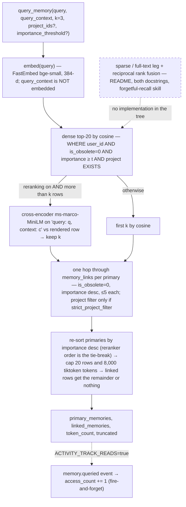

## 1. Executive Summary

Forgetful is a self-hosted MCP memory server: a FastMCP process, Python 3.12,
MIT, 236 commits between 20 October 2025 and the pinned commit of 1 September
2026, that gives Claude Code, Cursor, Codex, Gemini CLI, Copilot CLI and
OpenCode one shared knowledge base. The agent is the only writer and the only
extractor. It calls `create_memory` with a title, a body, a `context` sentence
explaining why the fact matters, keywords, tags and an importance score, and
the server embeds the lot with a local FastEmbed model, stores the row in SQLite
or Postgres, links it to its three nearest neighbours, and returns it on
`query_memory` after a cross-encoder rerank and a one-hop walk. Beside memories
sit entities with typed relationships, projects, documents, code artifacts,
files, skills in the Agent Skills format, and plans with tasks and acceptance
criteria for multi-agent coordination.

What is genuinely interesting is the surface, not the retrieval. Only three
tools reach the model — `discover_forgetful_tools`,
`how_to_use_forgetful_tool` and `execute_forgetful_tool` — and 152 named
operations live behind them in a registry whose docstrings are assembled at
registration from the feature flags, so a client with skills and planning off
never reads about either. The same registry backs a REST API, an SSE stream and
a CLI, and ten SKILL.md files in the repository tell the agent to query before
it creates and to confirm with the user before it updates or obsoletes. The
implementation is strongest where that contract is tested: 1,454 test
functions, of which the SQLite end-to-end half runs the real embedder and the
real cross-encoder in-process against an in-memory database, with no container
to start.

It is weakest where the documentation describes a retrieval the code does not
perform. The README's *"dense → sparse → RRF → cross-encoder"*, the four-stage
docstring at the top of `search` in both repositories, and the recall skill's
instruction that exact identifiers are matched *"literally"* by *"the sparse
full-text leg"* all describe a lexical arm and a rank fusion that have no
implementation in the tree. Auto-linking is documented ten times as a 0.7
similarity threshold and is implemented as *the three nearest rows, whatever
their distance*. The cross-encoder's ordering is discarded by an importance
re-sort before the token budget is applied. The audit log is real and off by
default. None of this is hidden; each is a sentence in a docstring or a README
that the code beside it does not honour, which is the specific thing a report
like this exists to find.

## 2. Mental Model

A memory is a claim the agent chose to keep, written in the agent's own words
and shaped by the server's limits: a title under 200 characters, a body under
2,000, a *context* under 500 that the model docstring calls *"WHY this matters,
HOW it relates to other concepts, WHAT implications"*, up to ten keywords, ten
tags, and an importance from 1 to 10 defaulting to 7
(`app/models/memory_models.py:8-72`). The README calls this Zettelkasten and
the skill files enforce it as an *atomicity test* — one decision, one fact,
one pattern per row, with anything over 300 words routed to a document and
three to seven entry-point memories.

The server treats a memory as **ground truth the moment it is written**. There
is no candidate state, no verification, no reviewer, and no extraction that
could disagree with the agent: the `confidence` column is a float the caller
may set and nothing on the read path consults
(`rg -n 'confidence' app/repositories/*/memory_repository.py
app/services/memory_service.py` returns nothing). The epistemics live in the
agent's instructions instead. `skills/forgetful-remember/SKILL.md` requires a
`query_memory` before every `create_memory` and classifies each hit — still
accurate, missing detail, contradicted, or distinct — and it names the two
operations that *"rewrite history"*, `update_memory` and
`mark_memory_obsolete`, as the ones that always get user confirmation. The
store records none of that deliberation. What it records is the outcome.

The state machine has two states and one transition:

```text
create_memory ──▶ active ──mark_memory_obsolete(reason, superseded_by?)──▶ obsolete
                    │                                                        │
                    ├─ update_memory (PATCH; re-embed if a search field moved) │
                    ├─ link_memories / unlink_memories                        │
                    └─ auto-linked to the 3 nearest on create                 │
                                                                             │
                 searchable, walkable, auto-link candidate         fetchable by id only;
                                                                  excluded from search,
                                                                  from the walk, from the
                                                                  auto-link candidate set,
                                                                  and from access counting
```

Obsolete is terminal. The transition writes `is_obsolete = 1`, the mandatory
`obsolete_reason`, an optional `superseded_by` that must name a live memory of
the same user, and `obsoleted_at`
(`app/repositories/sqlite/memory_repository.py:440-484`). No code path clears
the flag — `rg -n 'is_obsolete\s*=\s*False|restore_memory' app` finds only
column defaults — and no code path deletes the row; the REST `DELETE` is the
same soft delete (`app/routes/api/memories.py:243-271`). A superseded memory
carries a forward pointer and the superseding one carries nothing back, so the
chain is walkable from the past only. Links survive obsolescence in
`memory_links` and are filtered at read time rather than removed.

Who moves a memory: the agent, through the tools, or a person through the CLI
or the REST API, all as the same user. Nothing in the server moves one on its
own — there is no decay, no expiry, no consolidation, no background rewrite.
`access_count` and `last_accessed_at` are the closest thing to a signal about a
memory's life, and they are incremented by an event handler on reads only when
`ACTIVITY_ENABLED` and `ACTIVITY_TRACK_READS` are both true; nothing ranks or
prunes on them at this commit.

The diagram is the read path, because that is where the documented design and
the implemented one part company:



## 3. Architecture

One Python process. `main.py` builds a `FastMCP` app whose lifespan calls
`app/bootstrap.py`, which constructs a database adapter, an embedding adapter,
a reranker, a repository per object type, a service per object type, and the
optional event bus, then registers the MCP tools, the REST routes and the CLI
verbs over the same `ToolRegistry`. The layering is stated in `AGENTS.md` —
*routes → services → protocols → repositories/adapters* — and held: the
services import only protocols, and each repository exists twice, once under
`app/repositories/postgres/` and once under `app/repositories/sqlite/`, with
the same method names and different SQL.

**Persistence.** SQLite by default, at `user_data_dir("forgetful")/forgetful.db`
(`app/config/settings.py:50`), through SQLAlchemy async with the `sqlite-vec`
extension loaded on every connection and two `vec0` virtual tables,
`vec_memories(memory_id TEXT PRIMARY KEY, embedding FLOAT[384])` and
`vec_skills`, created outside Alembic at startup
(`app/repositories/sqlite/sqlite_adapter.py:160-181`). Postgres with pgvector
when `DATABASE=Postgres`: `memories.embedding vector(384)` with an HNSW cosine
index, GIN on the `tags` and `keywords` arrays
(`app/repositories/postgres/postgres_tables.py:196,403-405`). Alembic runs on
both at startup; ten migrations from the initial schema to the
`last_encoding_point` column of 22 August 2026.

**Retrieval stack.** FastEmbed in-process for both embedding
(`BAAI/bge-small-en-v1.5`, 384 dimensions) and reranking
(`Xenova/ms-marco-MiniLM-L-12-v2` as a `TextCrossEncoder`), run in an executor
thread (`app/repositories/embeddings/reranker_adapter.py:64-88`). Azure,
Google, OpenAI and Ollama embedders and an HTTP reranker are selectable by
environment. Vector distance is computed in the database — `vec_distance_cosine`
or pgvector's `<=>` — not in Python.

**Async model.** Everything is request-scoped. The only concurrency beyond the
request is the event bus, which dispatches each handler with
`asyncio.create_task` and tracks the task set so the CLI can drain it before
exit (`app/events/event_bus.py:112-150`, `app/bootstrap.py:360-368`). There is
no queue, no scheduler, no worker.

**Surfaces.** MCP over stdio or streamable HTTP; REST under `/api/v1/` for
memories, entities, projects, documents, artifacts, files, skills, plans,
tasks, a graph endpoint for visualisation, an activity list and an SSE stream;
a `forgetful` CLI with curated verbs (`memory save/search/get/recent`,
`project list`), a generic `call <tool> --args JSON` passthrough, and a remote
mode that speaks to a deployed server through a FastMCP client after a browser
OAuth login.

### Deployment and ergonomics

`uvx forgetful-ai` is the whole install: it starts the stdio server against a
fresh SQLite file and downloads the two FastEmbed models into
`user_data_dir/models/fastembed` on first run; `docs/OFFLINE_SETUP.md` and
`FASTEMBED_LOCAL_FILES_ONLY` cover the air-gapped case. No API key is needed to
store or retrieve anything. Two Docker Compose files ship — single container
with a bind-mounted SQLite file, or the service plus `pgvector/pgvector:pg16` —
and a `ghcr.io/scottrbk/forgetful` image is built on tags. Auth is off unless
`FASTMCP_SERVER_AUTH` names a provider (GitHub, Google, JWT, RFC 7662
introspection); without it every caller is `default-user-id`.

The store is plain SQLite or plain Postgres and is repairable with ordinary
tools, with one caveat: the embedding lives in a virtual table keyed by the
memory id, so a row copied by hand has no vector until `--re-embed` or
`rebuild_embeddings` runs.

## 4. Essential Implementation Paths

**Capture/write.** `execute_forgetful_tool("create_memory", …)`
(`app/routes/mcp/meta_tools.py:543-575`) → `ToolRegistry` → the adapter in
`app/routes/mcp/tool_adapters.py` → `MemoryService.create_memory`
(`app/services/memory_service.py:164-228`). The service applies environment
provenance defaults (`app/utils/provenance.py:20-36`), calls
`repo.create_memory`, which builds the embedding text from title, content,
context, keywords and tags (`app/repositories/helpers.py:10-42`), embeds it,
inserts the row and the vector in one session, and links projects, artifacts,
documents, files and skills (`sqlite/memory_repository.py:234-291`). Back in
the service, if `MEMORY_NUM_AUTO_LINK > 0`, `find_similar_memories` runs one
cosine query for the nearest non-obsolete rows of the same user
(`sqlite/memory_repository.py:485-555`; Postgres `434-470`) and
`create_links_batch` inserts the links, skipping duplicates and self-links.
The response carries `similar_memories` *"for review"*. Then one `memory.created`
event. All of it is inside the tool call; the memory is retrievable as soon as
the call returns.

**Extraction/consolidation.** There is none. No prompt exists in the server
(`rg -n -i 'openai|anthropic|chat.completions|generate_content' app` matches
only the embedding adapters), no summariser, no merger, no dedupe on create.
The extraction prompts live in `docs/prompts/` and the per-client command packs
under `docs/opencode/`, `docs/gemini-cli/` and `docs/copilot-cli/`, and they
are executed by the agent, not the server.

**Retrieval.** `MemoryService.query_memory` (`memory_service.py:59-162`) →
`repo.search` (`sqlite/memory_repository.py:57-117`) → `semantic_search`
(`:119-233`) for `DENSE_SEARCH_CANDIDATES` rows → cross-encoder rerank when
enabled and more rows than `k` came back → `_fetch_linked_memories`
(`memory_service.py:494-544`) calling `get_linked_memories` per primary
(`sqlite/memory_repository.py:556-612`) → `_apply_token_budget`
(`:547-599`) and `truncate_memories_by_budget` (`:624-673`).

**Context assembly.** The tool returns a `MemoryQueryResult` JSON object; no
prompt text is assembled. The agent decides what to do with it, and the recall
skill tells it to treat `truncated: true` as a signal to narrow rather than
accept loss.

**Update/obsolete.** `update_memory` (`memory_service.py:230-290`) diffs the
PATCH against the row, re-embeds only when one of `title, content, context,
keywords, tags` changed, replaces the association lists that were supplied,
and emits an `updated` event carrying `{field: {old, new}}`. It does not
touch `memory_links`. `mark_memory_obsolete` (`:292-341`) snapshots the row,
sets the four lifecycle columns, and emits a `deleted` event with the reason
and the successor in the snapshot.

**Schema.** `app/repositories/sqlite/sqlite_tables.py:177-262` (`memories`),
`:414-435` (`memory_links`, unique on `(source_id, target_id)`), `:1182-1233`
(`activity_log`); the Postgres twin in `postgres_tables.py`; Pydantic
contracts in `app/models/memory_models.py`.

**Background.** None. `ReEmbeddingService.re_embed_all`
(`app/services/re_embedding_service.py:53-116`) is the `--re-embed` CLI path:
backup, reset the vector storage, re-embed in pages, validate, restore on
failure. `rebuild_targeted` (`:117-231`) is the `rebuild_embeddings` MCP tool:
a user-scoped subset, upsert the vectors, then `_recompute_auto_links`
(`:255-288`) adds links for each rebuilt memory and never removes one.

**MCP/API/CLI.** `app/routes/mcp/meta_tools.py` (three tools, docstrings built
by `_build_discover_docstring` and `_build_execute_docstring` from
`SKILLS_ENABLED`, `FILES_ENABLED`, `PLANNING_ENABLED`),
`app/routes/mcp/tool_metadata_registry.py` (152 tool descriptors),
`app/routes/mcp/tool_adapters.py` (the implementations),
`app/routes/mcp/scope_resolver.py` (OAuth scopes → permitted tool names),
`app/routes/api/*.py` (REST), `app/routes/cli/*.py` (CLI over the same
registry, `local_executor` in-process and `remote_executor` over MCP).

**Tests.** `tests/integration/` (607 functions, stubbed repositories),
`tests/e2e_sqlite/` (558, real adapters, `:memory:` SQLite),
`tests/e2e/` (289, Postgres in Docker).

## 5. Memory Data Model

`memories` (`sqlite_tables.py:177-262`): `id`, `user_id` → `users` with
cascade delete, `title`, `content`, `context` (all `Text NOT NULL`),
`keywords` and `tags` (JSON on SQLite, `ARRAY` with GIN on Postgres),
`importance INTEGER NOT NULL`, the nine provenance columns added by the
migrations of 6 January and 8 April 2026, `is_obsolete BOOLEAN NOT NULL
DEFAULT 0`, `obsolete_reason`, `superseded_by` → `memories.id ON DELETE SET
NULL`, `obsoleted_at`, `access_count INTEGER NOT NULL DEFAULT 0` and
`last_accessed_at` from the migration of 4 July 2026, `created_at`,
`updated_at`. Indexes on `is_obsolete` and `superseded_by`. The Postgres table
adds `embedding vector(384) NOT NULL`; SQLite keeps it in `vec_memories`.

Associations: `memory_links(source_id, target_id, user_id, created_at)` with a
unique pair index and its reverse; `memory_project_association`,
`memory_code_artifact_association`, `memory_document_association`,
`memory_file_association`, `memory_skill_association`,
`memory_entity_association`. Entities have `entity_relationships(from, to,
relationship_type, strength, metadata)` plus the eight provenance columns
without `confidence`. Skills carry their own `vec_skills` vector, built from
the description alone (`helpers.py:66-72`).

**Scoping.** `user_id` is the only hard partition. Projects are an optional
many-to-many that the reader filters by. There is no session, agent, workspace
or tenant column; two agents sharing one token share one user, and the
provenance columns `agent_id`, `agent_version` and `agent_model` are the only
place their identity can be recorded — as text the caller supplies, or as an
operator-forced stamp when `ENFORCE_ENV_OVERWRITE=true` makes the environment
override whatever the agent sent (`provenance.py:20-58`).

**Temporal fields.** `created_at`, `updated_at`, `obsoleted_at`,
`last_accessed_at` — all record time. `rg -n -i
'valid_from|valid_at|invalid_at|event_time|occurred_at' app alembic` finds
nothing. Projects gained `last_encoding_point` on 22 August 2026: an opaque
string, documented as *"e.g. a Git commit SHA"*, that *"the server never
interprets or advances"* (`app/models/project_models.py:70-77`) — a cursor for
the agent's incremental re-encoding of a repository, not a validity time.

**Correction.** Supersession by forward pointer; PATCH in place with the old
values preserved only in the activity log, and only when it is on. No
versioning of the row itself.

**Kinds of memory.** One table for every declarative memory; documents for
long form; code artifacts; files as base64; skills as procedures; plans and
tasks as intent. The README's decision table and `docs/concepts.md` are the
router, and the agent applies it.

## 6. Retrieval Mechanics

`query_memory` requires both `query` and `query_context`. Only `query` is
embedded (`semantic_search`, `sqlite/memory_repository.py:142-143`), against
the same model that embedded title+content+context+keywords+tags at write
time; `query_context` enters only through `build_contextual_query`, which
forms the cross-encoder's query string `"query: {query}, context: {context}"`
(`helpers.py:75-76`, used at `search:108-111`). The recall skill's statement
that *"the two are embedded together"* is not what the code does — the
context shapes the rerank, not the candidate set.

**Candidates.** The dense query is a single SQL statement: join the vector
table, `WHERE m.user_id = :user_id AND m.is_obsolete = 0`, optional
`m.importance >= :t`, optional `EXISTS` over the project association, optional
`NOT IN` exclusions, `ORDER BY vec_distance_cosine(...) LIMIT :k`
(`:150-197`). `k` here is `DENSE_SEARCH_CANDIDATES = 20` when reranking is on,
the caller's `k` otherwise (`search:86-90`). The rows are then re-loaded
through the ORM with their relationships and re-ordered to the vector order.

**Rerank.** Only when `RERANKING_ENABLED` (default true) *and* more than `k`
candidates returned (`search:100-101`) — a store with three memories and
`k=3` is never reranked. Each candidate is rendered as `Title: … / Content: …
/ Context: … / Keywords: … / Tags: …` (`helpers.py:44-63`), the cross-encoder
scores all twenty, and the top `k` are kept in score order.

**Walk.** For each primary, `get_linked_memories` selects rows joined through
`memory_links` in either direction, `WHERE user_id AND is_obsolete = 0`,
ordered by importance descending, limited to `max_links_per_primary` (default
5, max 10); a project filter is applied to this query only when
`strict_project_filter` is true (`memory_service.py:95-104`,
`sqlite/memory_repository.py:585-601`). Rows already primary or already seen
are dropped.

**Budget.** `truncate_memories_by_budget` sorts primaries by importance
descending — Python's stable sort, so the reranker's order survives only as a
tie-break among equal importances — takes at most `MEMORY_MAX_MEMORIES = 20`,
and adds rows until the next would exceed `MEMORY_TOKEN_BUDGET = 8000` tokens
by tiktoken's `gpt-4` encoding of the rendered fields (`:624-673`). If the
primaries were truncated the linked list is dropped entirely; otherwise linked
rows get the remaining tokens and count under the same rule (`:547-599`). The
request model's `token_context_threshold` (4,000–25,000, default 8,000) is
declared, filled by the MCP adapter with `settings.MEMORY_TOKEN_BUDGET`, and
never read by the service (`rg -n token_context_threshold app`: three lines,
none a reader).

**What is not here.** No lexical or full-text arm on any backend: `rg -n -i
'fts5|bm25|tsvector|to_tsquery|reciprocal|rrf' --glob '!*.json' --glob
'!*.lock' .` matches the README, the two `search` docstrings and nothing
else. The Postgres GIN indexes on `tags` and `keywords` serve no memory query.
`get_recent_memories` filters by tag, but on SQLite it does so in Python after
loading every non-obsolete row of the user, and paginates the Python list
(`sqlite/memory_repository.py:823-836`); the Postgres twin pages in SQL
(`postgres/memory_repository.py:761`). Entity search is `LIKE` on name and
aliases. Skill search is a second dense query over `vec_skills`.

**Failure modes.** A store with fewer than `k+1` memories is never reranked, so
the quality the reranker adds arrives only after the store has grown.
Importance re-sorting means a 9-rated tangential hit is listed above a 7-rated
exact one, and when the budget bites it is the exact one that is cut. The
one-hop walk is importance-ordered, not similarity-ordered, so the five links
returned for a primary are its most *important* neighbours rather than its
most relevant. The `importance_threshold` is a floor the agent sets per query,
and the skills recommend importance 5 as *"the noise floor for bulk/automated
captures"* — a convention with no default behind it.

## 7. Write Mechanics

Every memory is a tool call by the agent with the fields already extracted.
The server validates shape (Pydantic: lengths, counts, the 1–10 range, no
empty keywords), applies provenance defaults, embeds, inserts, and links.
There is no LLM in the write path and no deduplication: two calls with
identical content produce two rows, both embedded, each auto-linked to the
other. The skills push the dedupe up to the agent — *"Query before create"*
is step 3 of `forgetful-remember` — and the `similar_memories` list in the
create response is the only server-side hint.

**Auto-linking** is `find_similar_memories(memory_id, max_links =
MEMORY_NUM_AUTO_LINK)`: the source row's own vector, `ORDER BY
vec_distance_cosine LIMIT :max_links`, no distance predicate
(`sqlite/memory_repository.py:507-515`; Postgres `:461-466`). `rg -n -i
'threshold' app --glob '*.py'` finds `importance_threshold`,
`token_context_threshold` and one docstring; `rg -n '0\.7\b' app tests` finds
nothing. The README (`:365`), `docs/search.md:18`, five prompt documents and
the remember skill (`:104`) all state a ≥0.7 threshold, and `docs/search.md`
adds a cross-encoder step to the auto-link pipeline that `find_similar_memories`
does not perform. The observable behaviour is that the third memory in a fresh
store links to the first two whatever they say. Links are additive: an update
that changes the content re-embeds the row and leaves its links in place, and
`rebuild_embeddings` re-adds links and removes none
(`re_embedding_service.py:255-288`).

**Update** is PATCH with `get_changed_fields`; an update that changes nothing
returns the row without an event. **Obsolete** is described above. **TTL**
does not exist for memories; `ACTIVITY_RETENTION_DAYS` applies to the audit
rows only. **Conflict** is the agent's problem: nothing detects that a new
memory contradicts an old one, and the remember skill's *"Contradicted by the
new knowledge → mark obsolete (confirm first) + create replacement"* is the
whole conflict story.

**Noisy or malicious input** is bounded only by the field limits and the
per-user partition. A tool result the agent pastes into `create_memory` is a
memory, with provenance columns the same agent fills in. The one operator
control is `ENFORCE_ENV_OVERWRITE`, which pins `encoding_agent`, `agent_id`
and `agent_model` to the server's environment regardless of the call.

### Operational cost

The write path is synchronous and local: one FastEmbed forward pass, one
insert, one cosine query for neighbours, up to three link inserts, then an
event dispatched as a task. Nothing waits on a remote model unless the
operator configured a hosted embedder. Lag to retrievability is zero — the row
is committed before the tool returns. No background pass rewrites the store;
the only whole-store operation is the manual `--re-embed`, which takes a
backup first and restores it on failure (`main.py:207-278`).

On the read path: one embedding, one vector query returning twenty rows, one
cross-encoder pass over twenty rendered documents on the local CPU, up to `k`
link queries, and tiktoken over every row considered. Injection is a tool
result of at most 8,000 tokens and twenty rows; it lands in the conversation
after the system prompt, so it does not invalidate a prompt-prefix cache. When
`ACTIVITY_TRACK_READS` is on, every read also fires an `UPDATE` of
`access_count` on each returned id, on a system session.

## 8. Agent Integration

Three MCP tools. `discover_forgetful_tools(category?)` returns the catalogue
the caller's scopes permit; `how_to_use_forgetful_tool(name)` returns the
parameters, return shape and examples; `execute_forgetful_tool(name, arguments)`
dispatches (`meta_tools.py:472-575`). Docstrings for the first and third are
built once at registration and list only the categories whose flags are on,
in a `verbose` or `compact` mode (`MCP_DESCRIPTOR_MODE`). Permission is the
intersection of an instance ceiling (`FORGETFUL_SCOPES`, default `*`) and the
OAuth token's `scope` claim, resolved to tool names by category and by the
`mutates` bit on each descriptor (`scope_resolver.py:104-199`); a read-scoped
caller who asks how to use `create_memory` is refused, not just blocked at
execution (`tests/e2e_sqlite/test_scoped_permissions_sqlite.py:92-128`).

The agent has full agency and no automation. Nothing injects memory into a
prompt; nothing captures at session end; the compaction boundary is not
modelled. The repository answers with prose: ten skills under `skills/`
(`forgetful-remember`, `-recall`, `-explore`, `-context-gather`,
`-encode-repo`, `-entities`, `-procedures`, `-files`, `-cli-setup`,
`-mcp-setup`), command packs for OpenCode, Gemini CLI and Copilot CLI, and
six prompt documents including a *"knowledge base bootstrap"* and a
*"comprehensive project understanding"* prompt. The recall skill prescribes
`get_recent_memories` scoped to the project as the *session-start catch-up*
and a re-query from a second facet before concluding a fact is absent; the
remember skill prescribes the announcement format after every save. These
are the memory policy, and they ship as files the agent may or may not load.

Adapting to another agent is a config block: stdio `uvx forgetful-ai`, or
HTTP to a running server. The CLI's `call` passthrough makes every one of the
152 operations a shell command, which is how the containerised UAT harness
drives them (`test_harness/README.md`).

## 9. Reliability, Safety, and Trust

**Provenance** is nine nullable columns the writer fills, with environment
defaults for the agent identity fields and an operator override. It records
what the agent said about itself; nothing checks it. `confidence` is stored
and unread.

**Trust levels** do not exist. One boolean separates live from obsolete; the
skills ask the agent to obtain user confirmation before either mutation, and
the server cannot tell whether it did.

**Prompt injection** has no defence in the server. The write path accepts
whatever the tool call carries, within length limits. The repository's own
threat model is elsewhere: the UAT harness runs the agent *"inside a sandbox
container"* so that *"the real knowledge base — [is] out of reach by
construction"*, which is protection for the maintainer's store during
testing, not for a user's store during use.

**Multitenancy.** Every repository method takes `user_id` and every query
filters on it, on both backends. On Postgres the adapter's `session(user_id)`
runs `SELECT set_config('app.current_user_id', :user_id, true)` *"with RLS
context"* and `system_session()` is documented as *"no RLS"*
(`postgres_adapter.py:35-62`); `rg -n -i 'row level|create policy|
current_setting|app\.current_user' --glob '!*.json' --glob '!*.lock' .` finds
that one `set_config` and nothing that reads it. Isolation is the WHERE
clause, and the variable is a comment in SQL. Users are provisioned from the
token's `sub` on first sight (`app/middleware/auth.py:106-155`), so identity
is exactly as strong as the configured provider, and with no provider every
caller is one user.

**Races and consistency.** Writes are single-session transactions. The event
bus is fire-and-forget: `emit` schedules each handler and returns
(`event_bus.py:112-150`), `_safe_dispatch` logs and swallows exceptions
(`:152-175`), and `handle_event` logs and swallows a failed `save_event`
(`activity_service.py:62-76`). A memory can be created with its audit row
lost, and the CLI's `wait_for_pending` drain (`bootstrap.py:360-368`) exists
because a one-shot process would otherwise exit before the row was written.
The SSE stream drops events with a warning when a subscriber's queue of 1,000
is full.

**Data loss.** Soft delete everywhere for memories; hard delete for documents,
entities, skills, artifacts and files, with cascades through the association
tables. A user row's deletion cascades to every memory. Backups are the
`--re-embed` path's file copy or `pg_dump` and nothing else.

**Privacy and deletion.** A memory is never removed by any API. The obsolete
row stays readable by id (`tests/e2e_sqlite/test_memory_tools_sqlite.py:419-424`
asserts exactly that) and stays in the activity snapshots. There is no erase.

**Uncertainty** cannot be represented except as a number nothing reads.

## 10. Tests, Evals, and Benchmarks

1,454 test functions in three suites. `tests/integration/` (607) runs the
services against in-memory stub repositories whose *"embedding"* is a
hash-seeded random unit vector and whose `find_similar_memories` is keyword
overlap (`tests/integration/conftest.py:176-189,284-311`) — it tests
orchestration, events, provenance, scopes and the CLI, and cannot say anything
about ranking. `tests/e2e_sqlite/` (558) builds the real FastMCP app on
`:memory:` SQLite with the real FastEmbed embedder and cross-encoder,
module-scoped so the models load once, and drives it through an in-process
MCP client and the REST routes; this is the suite that establishes the read
path. `tests/e2e/` (289) does the same against Postgres and starts the
`forgetful-db` container itself, raising if it cannot
(`tests/e2e/conftest.py:267-300`) — it does not skip itself green. CI runs
integration, SQLite end-to-end and ruff on every push and pull request, and
the Postgres suite on pushes to `main` (`.github/workflows/ci.yml`,
`e2e.yml`).

**Retrieval tests that can fail.** The obsolete-filter case creates three
memories on one topic, obsoletes one, queries, and asserts an active one is
present *before* asserting the obsolete one is absent
(`tests/e2e_sqlite/test_memory_tools_sqlite.py:355-393`; Postgres `:356-394`).
The supersession case is the same shape with a weaker positive control
(`new_memory_id in found_ids or len(found_ids) > 0`, `:457-458`). The
auto-link case asserts `similar_memories` is non-empty on the second create
(`:37-60`). The project-and-tag case asserts an in-scope id is present and a
same-tag out-of-project id is absent (`:840-888`). None of these asserts an
order, a score, or that an unrelated memory is *not* linked — which is the
test the missing threshold would fail.

**What is not tested.** No test asserts anything about rank position, about
the reranker changing an order, about the token budget cutting the right
row, or about a lexical match — consistent with there being no lexical arm.
No test exercises `token_context_threshold`. No test asserts a link is
*absent* after a create; the integration test that checks *"Should not
auto-link with different keywords"* (`test_memory_service.py:551-553`) runs
against the keyword-overlap stub, not the vector path.

**Evals and benchmarks.** None. `rg -l -i 'locomo|longmemeval|recall@|ndcg'
--glob '!*.json' .` finds nothing; the word *benchmark* appears in a concepts
example and two file-tool fixtures. The UAT harness under `test_harness/`
walks the nine skills with a containerised OpenCode agent and produces a
transcript for a human to read — *"acceptance is decided by a supervising
review of both, never by the agent's self-report alone"* — with no scored
metric. The README cites [arXiv:2502.12110](https://arxiv.org/abs/2502.12110)
(A-MEM, submitted 17 February 2025) as the source of the auto-linking idea; it
is not this project's paper, and no paper for Forgetful exists.

**Screening note.** The commit-graph export `forgetful.mycelium.json` at the
root — 1,728 symbols and 2,522 calls of this repository at commit
`fb3135109080`, generated 1 March 2026 — is referenced by nothing in the tree
and is not a test artifact.

## 11. For Your Own Build

### Steal

- **Three meta-tools over a registry with flag-built docstrings.** Expose
  `discover`, `describe` and `execute`, keep the real catalogue server-side,
  and generate the discovery text from the feature flags at registration so
  the model never reads about an operation it cannot call. Then put the same
  registry behind REST and a CLI, so the tool contract is tested once.
- **Make the obsolete predicate part of the candidate set, not only the result
  set.** `is_obsolete = 0` in the auto-link query as well as in search means
  a retired fact stops attracting links the moment it is retired.
- **A mandatory reason on soft delete.** `obsolete_reason` cannot be null on
  the tool; it costs the agent one sentence and gives the next reader the
  why.
- **Environment-forced provenance for shared instances.** `ENFORCE_ENV_OVERWRITE`
  lets an operator guarantee which tool and model wrote every row regardless
  of what the caller claims.
- **Run the real ranking stack in the fast suite.** Loading a small local
  embedder and cross-encoder once per module and testing against `:memory:`
  SQLite is what makes an obsolete-filter test mean something; the stubbed
  suite beside it cannot.

### Avoid

- **A retrieval docstring that describes the design rather than the code.**
  The four-stage comment at the top of `search` names two stages that do not
  exist, and it propagated into the README and into the skill the agent
  loads. A docstring is read as a spec by the next contributor and as a fact
  by the model.
- **Nearest-neighbour auto-linking with no floor.** `LIMIT 3` is not a
  similarity threshold. Put the threshold in the query, make it a setting,
  and test that an unrelated memory is *not* linked.
- **Re-sorting a reranked list by a caller-supplied score.** If importance
  should dominate, fold it into the rerank; if relevance should, cut the
  budget in rerank order. Sorting by one and cutting by the other loses the
  best match first.
- **A per-request budget parameter the service ignores.** Either honour
  `token_context_threshold` or remove it from the contract.
- **Session variables for a row-level-security policy that was never
  written.** Either add the policies or delete the `set_config`; a reader who
  sees the variable assumes the defence exists.

### Fit

Forgetful suits one person, or one small team behind one OAuth provider,
running several coding agents that should share what they learn, who are
willing to let the agent be the curator. Its cost is one process and one
file, its retrieval is honest dense-plus-rerank once the docs are read past,
and its data model already has the projects, entities and documents a
codebase knowledge base needs. It does not suit anyone who needs the server
to make a trust decision, to forget on a schedule, to find an exact
identifier by text, or to prove to an auditor that a mutation happened —
the audit is off by default and best-effort when on. A team whose agents will
write thousands of rows should expect the SQLite recent-list and the
threshold-free linking to become the first two things they patch.

## 12. Open Questions

- Whether the sparse leg and the fusion were ever implemented and removed, or
  documented ahead of code; the shallow clone does not carry the history, and
  the commit list on GitHub shows no message naming either.
- Whether the maintainer's own store, which the UAT harness guards, has been
  used to measure link quality at any threshold — the 0.7 figure came from
  somewhere.
- Whether `ActorType.SYSTEM` and `ActorType.LLM_MAINTENANCE`, declared with
  no producer, and `access_count`, recorded with no consumer, are the front
  half of a decay or curation feature; the `org_knowledge_proposal.md` at the
  root discusses organisational encoding and not this.
- What the hosted deployment the CLI's remote mode targets looks like in
  practice — auth provider, scopes in use, whether `ACTIVITY_ENABLED` is on.
- Whether the Postgres suite's importance-ordered walk and the SQLite suite's
  produce the same neighbours on the same data; the two repositories are
  hand-mirrored and the mirror is not tested for agreement.

## Appendix: File Index

**Storage and schema.** `app/repositories/sqlite/sqlite_tables.py`
(`memories` 177–262, `memory_links` 414–435, `activity_log` 1182–1233),
`app/repositories/postgres/postgres_tables.py` (vector column 196, GIN and
HNSW 403–405), `app/repositories/sqlite/sqlite_adapter.py` (session 108–124,
`vec0` tables 160–181), `app/repositories/postgres/postgres_adapter.py`
(`set_config` session 35–50), `alembic/versions/` (ten migrations),
`app/models/memory_models.py`, `app/config/settings.py`.

**Write path.** `app/services/memory_service.py` (`create_memory` 164–228,
`update_memory` 230–290, `mark_memory_obsolete` 292–341),
`app/repositories/sqlite/memory_repository.py` (`create_memory` 234–291,
`update_memory` 292–392, `mark_obsolete` 440–484, `find_similar_memories`
485–555, `create_links_batch` 677–706), `app/repositories/helpers.py`,
`app/utils/provenance.py`.

**Retrieval path.** `app/repositories/sqlite/memory_repository.py` (`search`
57–117, `semantic_search` 119–233, `get_linked_memories` 556–612,
`get_recent_memories` 753–853), `app/repositories/postgres/memory_repository.py`
(`search` 50–113, `semantic_search` 114–175, `find_similar_memories` 434–470),
`app/repositories/embeddings/embedding_adapter.py`,
`app/repositories/embeddings/reranker_adapter.py`,
`app/utils/token_counter.py`.

**Context assembly.** `app/services/memory_service.py` (`query_memory`
59–162, `_fetch_linked_memories` 494–544, `_apply_token_budget` 547–599,
`truncate_memories_by_budget` 624–673).

**Events and audit.** `app/events/event_bus.py`,
`app/services/activity_service.py`,
`app/repositories/sqlite/activity_repository.py` (`cleanup_expired` 183–221),
`app/bootstrap.py` (242–257, 360–368), `app/models/activity_models.py`.

**Re-embedding.** `app/services/re_embedding_service.py`,
`app/services/backup_service.py`, `main.py` (207–278).

**MCP, API, CLI.** `app/routes/mcp/meta_tools.py`,
`app/routes/mcp/tool_metadata_registry.py`, `app/routes/mcp/tool_adapters.py`,
`app/routes/mcp/scope_resolver.py`, `app/routes/mcp/memory_tools.py`,
`app/routes/api/memories.py`, `app/routes/api/activity.py`,
`app/routes/cli/`, `app/middleware/auth.py`, `app/config/auth.py`.

**Agent-facing prose.** `skills/*/SKILL.md`, `docs/prompts/`,
`docs/opencode/`, `docs/gemini-cli/`, `docs/copilot-cli/`,
`docs/search.md`, `docs/concepts.md`, `docs/tool_reference.md`.

**Tests.** `tests/integration/conftest.py` (stubs 176–189, 284–311),
`tests/e2e_sqlite/conftest.py`, `tests/e2e_sqlite/test_memory_tools_sqlite.py`,
`tests/e2e_sqlite/test_scoped_permissions_sqlite.py`,
`tests/e2e_sqlite/test_api_activity_sqlite.py`,
`tests/e2e_sqlite/test_re_embedding_sqlite.py`, `tests/e2e/conftest.py`,
`tests/e2e/test_memory_tools_e2e.py`, `test_harness/`.

**Searches this report rests on.** Run from the tree root:
`rg -n -i 'fts5|bm25|tsvector|to_tsquery|reciprocal|rrf' --glob '!*.json' --glob '!*.lock' .`
(README and two docstrings only);
`rg -n -i 'threshold' app --glob '*.py'` and `rg -n '0\.7\b' app tests`
(no similarity threshold);
`rg -n -i 'row level|create policy|current_setting|app\.current_user' --glob '!*.json' --glob '!*.lock' .`
(one `set_config`, no reader);
`rg -n 'token_context_threshold' app` (declared, filled, unread);
`rg -n 'confidence' app/repositories/*/memory_repository.py app/services/memory_service.py`
(nothing);
`rg -n 'ActorType\.(SYSTEM|LLM_MAINTENANCE)' app` (nothing);
`rg -n 'is_obsolete\s*=\s*False|restore_memory' app` (defaults only);
`rg -n -i 'valid_from|valid_at|invalid_at|event_time|occurred_at' app alembic` (nothing);
`rg -l -i 'locomo|longmemeval|recall@|ndcg' --glob '!*.json' .` (nothing).

## History

**2026-09-07** — [`35764a88514f2c70b53d91a85d1cd5760e001d0f`](https://github.com/scottrbk/forgetful/commit/35764a88514f2c70b53d91a85d1cd5760e001d0f) — first reading, at the head of `main`, 236 commits in, the pin dated 1 September 2026. Screened before reading: no auto-run surface; three `conftest.py` files execute on collection; `pyproject.toml` and `uv.lock` were inside the seven-day cooldown; `AGENTS.md`, `CLAUDE.md` and `GEMINI.md` read as data. Nothing was installed or run. Three marks: `scope_enforced` for the `user_id` and project clauses on every read, `audit_log` for `activity_log` behind `ACTIVITY_ENABLED`, `negative_eval` for the obsolete-filter case with its positive control against the real embedder. Withheld: `tombstone` (obsolete is supersession, keyed on the row, and a re-created twin is not refused), `trust_state` (one boolean and a float nothing reads), `bitemporal` (record time only), `human_review` (a REST API for a UI not in the tree; the confirmations the skills require happen in the agent's conversation and leave no record).
