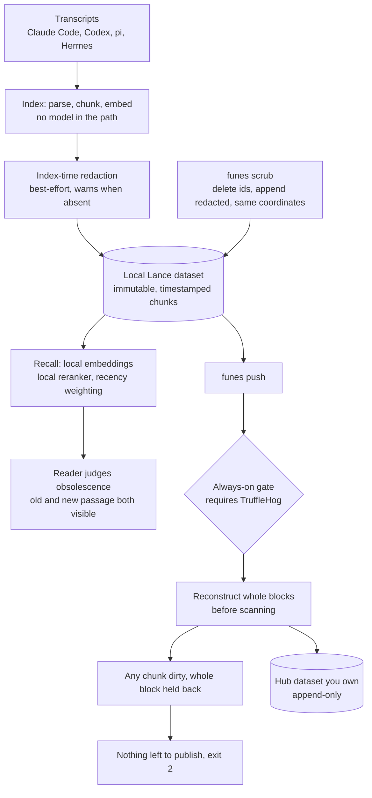

## 1. Executive Summary

funes is Hugging Face's memory for coding agents — Apache-2.0, 22,429 lines of
Rust with 281 test functions, 558 commits since June 2026. It indexes the
transcripts of Claude Code, Codex, pi and Hermes into one Lance dataset, recalls
across all of them, names which agent each hit came from, and can publish the
whole memory as a Hub dataset that a teammate recalls from with one flag.

It carries no capability marks, and unusually the reason is an argument rather
than an absence. `docs/RATIONALE.md` states four load-bearing choices, and the
first one declines the entire correction problem this atlas is organised around:

> this is a problem funes chooses not to *have*, rather than one it solves. A
> mutable memory must decide at write time what each new piece of information
> supersedes — and every wrong call loses information *silently*, by overwriting
> the right answer with a confident wrong one. funes makes no write-time
> decisions at all. Every passage stays, and obsolescence is resolved at **read
> time**.

And the observation that follows it is the strongest case for the position:

> A log also keeps what a knowledge base throws away — the superseded passage is
> often the answer itself: *what did we try before, and why did we move off it?*

For a memory of engineering work specifically, that is hard to argue with. The
cost is equally clear and the document does not hide it: a wrong passage stays
recallable forever, and the only things standing between it and a reader are
recency weighting and the reader's own judgement.

The one boundary funes does enforce, it enforces hard. Publishing a memory means
your transcripts leave the machine, so the push path is a fail-closed secrets
gate — and the tests behind it include one carrying the exact shape of a key that
once got through.

## 2. Mental Model

A chunk is an immutable, timestamped record of what was said when, with its
session id and turn uuid as provenance. Indexing is parse, chunk, embed — *"No
LLM in the ingest path"* — so the same transcript always produces the same index
and every hit is traceable to a real line.

The memory is a Lance dataset. Locally it is a directory; optionally it is a Hub
repository you own, and recall over `hf://` fetches the immutable files a query
touches into a cache pinned to the dataset's commit, so a warm recall reads from
disk.

That leaves exactly one boundary to defend, and the design is organised around
it: everything is local until you publish, and publishing is where the scanning
happens.

## 3. Architecture



## 4. Essential Implementation Paths

- **Chunk.** `src/chunk.rs` splits turns with overlap, and the overlap exists for
  a stated reason — so a scanner sees a secret that the split cut across a chunk
  boundary. Re-chunking a redacted block must reproduce exactly the ids and split
  indices the original produced, *"so a scrub's delete-by-id + append stays
  coordinate-stable"*.
- **Gate.** `drop_secret_rows` (`src/commands/push.rs:661`) reconstructs content
  blocks, scans them, and holds back every chunk of any block containing a secret,
  returning the clean batches and a summary naming the detector types.
- **Publish.** A partial publish is allowed with a warning; only when the
  hold-back leaves nothing does push exit non-zero.
- **Notice.** `funes status` scans this host's pending rows the same way a push
  would, *"a hold-back is easy to miss when the hooks push in the background"*.
- **Scrub.** Removing a secret from an indexed memory deletes the affected chunk
  ids and appends the redacted text at the same coordinates.

## 5. Memory Data Model

An immutable chunk with provenance and an embedding. There is no status, no
confidence, no supersession pointer and no tombstone, and every one of those
absences is the same decision rather than five oversights.

The atlas's marks are largely a vocabulary for correction, so a system that
declines correction as a category will carry none of them. That is worth saying
plainly rather than scoring it as a deficiency: `trust_state` is absent because
nothing is ever doubted in the store, only weighted at read time; `tombstone`
because nothing is removed except a secret, and `scrub` is keyed on the chunk id
rather than on the content; `bitemporal` because a chunk has one timestamp, when
it was said, and the index records no separate belief time; `audit_log` because
an append-only log of what was said is not a log of what changed; `scope_enforced`
because a memory is a dataset with one owner and a Hub token, with no predicate
inside it to enforce.

## 6. Retrieval Mechanics

Local embeddings, a local cross-encoder reranker, recency weighting, and hits
labelled with the agent they came from. Obsolescence is the reader's problem by
construction — the design's phrase is *"defer to the reader"* — and the argument
for that is the bet in the same document: distilling at ingest *"freezes your
memory at the interpretation quality of today's model"*, while a raw log
*"compounds with model progress for free"*.

The honest counterweight, which the document does not make and this report will:
recency weighting is a ranking signal, not a withholding one. A passage that was
wrong when it was written stays as recallable as the correction that followed it,
and the reader who resolves the conflict has to notice there is one. For a
transcript memory of engineering work — where the superseded attempt genuinely is
often the answer — that trade reads well. For a memory an agent consults without
a human in the loop, it puts the whole burden on a ranking function.

## 7. Write Mechanics

Deterministic, and the determinism is the point: the same transcript always
indexes the same way, so a bad result traces to a real line rather than to a
model's paraphrase of one.

The only write that removes anything is `scrub`, and its constraint is
interesting — the re-chunking after a redaction must produce the same ids and
split indices the original text produced, or the delete-and-append would leave
the memory's coordinates inconsistent. A test pins exactly that.

## 8. Agent Integration

Hooks index sessions as they end and push in the background; integrations let
four different coding agents recall from one memory; `funes ask` borrows a coding
agent to answer a question against recalled passages, naming the sessions it drew
from.

The trust-boundary paragraph in the rationale is the part worth quoting, because
most local-first tools stop at "your data stays on your machine":

> The reader is a separate trust boundary. When a cloud coding agent calls
> `recall`, the returned passages enter that agent's context; likewise, the
> explicitly-invoked `funes ask` sends its question and recalled passages to the
> provider configured for the selected agent.

Local storage is not local reading. Saying so, in the document that explains why
indexing and embedding are local, is the difference between a privacy posture and
a privacy claim.

## 9. Reliability, Safety, and Trust

Publishing a coding-session memory is the riskiest operation in this system and
it is treated that way. Two layers, with the distinction between them stated:

**Index time is best-effort.** Redaction runs when TruffleHog is available and
prints a warning when it is not, because *"local indexing still works without the
scanner because the local memory has not crossed a publication boundary."* The
consequence, which follows from that and is worth naming: a local memory on a
machine without the scanner can hold credentials in the clear, and only the
warning says so.

**Push is the hard boundary.** The gate is always on, requires the scanner, and
*"reconstructs complete content blocks before scanning, so a secret split across
chunks cannot evade detection."* If any chunk of a block is dirty, every chunk of
that block is held back; clean rows still publish with a warning; only an empty
result exits non-zero. `funes status` runs the same scan over pending rows so a
background hold-back is visible.

The test that earns the most confidence is the one carrying a real incident:

> The exact shape that leaked: a key stored with escaped `\n` (literal
> backslash-n), as a JSON-encoded transcript or a logged blob would hold it.
> trufflehog still detects it, but its canonical `raw` (real newlines) is not a
> substring of the stored bytes — value matching missed it and pushed it.
> Line-based location must hold it back.

A secret that a detector found and a gate then failed to match against the stored
bytes, because the two disagreed about newline encoding, is the kind of bug that
survives a code review and a test suite that mocks the scanner. These tests do
not mock it: they generate a real ed25519 key with `ssh-keygen` and skip honestly
when either tool is unavailable.

`negative_eval` is nonetheless withheld, and this is the closest call of the
session. The assertions govern what is *published* rather than what is
*retrieved* — `drop_secret_rows_holds_back_a_single_chunk_secret` asserts one row
held back and *"the clean row stays"*, which is a proper paired assertion about
the set of rows leaving the machine. The mark, as this atlas uses it, is for a
committed case asserting that particular material must not come back from a
query. Publication is one step before that, and the distinction is thin here
precisely because the published dataset is what other people recall from.

## 10. Tests, Evals, and Benchmarks

281 test functions and three benchmark files — `bench_backends.rs`,
`bench_index.rs`, `bench_recall.rs`; nothing was run here. The secrets tests skip
rather than mock when TruffleHog or `ssh-keygen` is missing, printing why, which
is the right shape for a test whose subject is an external scanner: a mocked
detector proves the plumbing and nothing about detection.

## 11. For Your Own Build

- **You may decline correction, but argue for it.** "Every wrong supersession
  loses information silently" and "the superseded passage is often the answer
  itself" are reasons. An append-only memory without those sentences is a memory
  that has not thought about correction.
- **Scan reconstructed blocks, not stored chunks.** Chunking splits text, and a
  secret cut across a boundary is invisible to a per-chunk scan. Reassembling the
  block before scanning — and giving the splitter overlap for that reason — closes
  it.
- **Hold back the whole block, not the dirty chunk.** A secret's neighbours are
  its context, and publishing them without it is both a leak risk and a confusing
  artifact.
- **Fail closed at the boundary, best-effort inside it — and say which is which.**
  Requiring the scanner for local indexing would make the tool unusable; not
  requiring it for publication would make the guarantee a wish. The two-layer
  split only works if the documentation states it.
- **Name the reader as a trust boundary.** Local embeddings and local storage say
  nothing about where the recalled passages go next. A cloud agent calling recall
  is an export, and the design document is the right place to say so.
- **Make a hold-back visible from a second command.** A background push that
  silently withheld three rows is indistinguishable from a successful one until
  someone looks.

## 12. Open Questions

- Would a warning at recall time, rather than only at index time, be wanted when
  the local memory was indexed without a scanner?
- Recency weighting resolves obsolescence for a human reader who can see both
  passages. Is there a shape of that for an agent that reads only the top hit?
- `scrub` is the one operation that removes content. Is a record that a scrub
  happened — not what it removed — worth keeping, so a reader knows a block was
  rewritten?

## Appendix: File Index

- Rationale: `docs/RATIONALE.md:19-80` (append-only, no LLM in ingest,
  local-first, and the reader as a trust boundary).
- Chunking: `src/chunk.rs:94-95`, `:229`, `:287-320`, `:494-511` (overlap for
  split secrets, coordinate-stable re-chunking).
- Gate: `src/commands/push.rs:661` (`drop_secret_rows`), `:862-935` (the three
  hold-back tests), `:1024` (selection cannot bypass the gate).
- Scanning: `src/scan.rs:476`, `:535`.
- Redaction: `src/commands/index.rs:1149`.
- Documentation: `docs/push.md:40-70` (the gate and scrub),
  `docs/configuration.md:78` (`FUNES_TRUFFLEHOG`), `docs/automation.md:109`.

**Searches recorded for the negative claims**

```sh
grep -rn "superseded\|supersede" src --include='*.rs'        # 2, both "reap superseded versions" of the Lance dataset; no memory supersession
grep -rn "status\|confidence" src/memory --include='*.rs'    # no trust field on a chunk
grep -rn "valid_from\|as_of\|recorded_at" src --include='*.rs'   # one timestamp per chunk, when it was said
grep -rn "fn .*not_\|assert!(!" src/commands/recall.rs       # query-classification assertions, no retrieval exclusion
```

## History

**2026-09-17** — [`942caf8730ed07c7236ba52aef7668f5b8f8544d`](https://github.com/huggingface/funes/commit/942caf8730ed07c7236ba52aef7668f5b8f8544d)
— first reading, at the head of `main`, 558 commits in. Screened with
`scripts/screen_repo.py` first: no auto-run surface, one build-time execution path
(a cargo build script), three dependency manifests changed on the day of this
reading, and `AGENTS.md` read as data. Nothing was installed, built or run — no
cargo, no npm, no TruffleHog, no index built. No capability marks, and the reason
is an argued position rather than an omission: the design document declines
write-time correction on the ground that a wrong supersession loses information
silently, so `trust_state`, `tombstone` and supersession are absent together and
on purpose. `bitemporal` is absent because a chunk carries one timestamp;
`audit_log` because an append-only record of what was said is not a record of what
changed; `scope_enforced` because a memory has one owner and a Hub token rather
than an in-store predicate. `negative_eval` is the closest call: the secrets-gate
tests are properly paired — one row held back, *the clean row stays* — but they
assert on what is published rather than on what a query returns.
