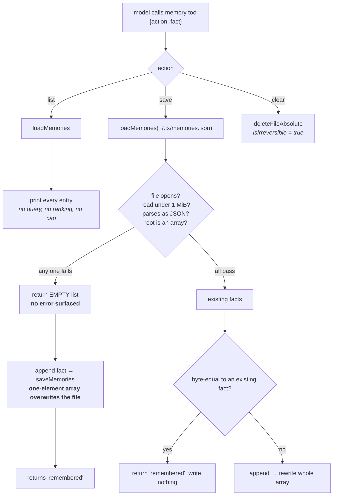

## 1. Executive Summary

**At this commit fx has no memory tool.** On 31 August 2026 commit
[`ae38593df870b75c40ce4ab49155390e7728b1f2`](https://github.com/vercel-labs/fx/commit/ae38593df870b75c40ce4ab49155390e7728b1f2)
removed `src/tools/memory/memory.zig` and the `~/.fx/memories.json` path, leaving
existing files untouched and rejecting stale `memory` calls through generic
dispatch; a registry test asserts `lookup("memory") == null`. Ten days earlier,
[`715ced4448a9f0b2c2fc6194c18c90c1c88212b2`](https://github.com/vercel-labs/fx/commit/715ced4448a9f0b2c2fc6194c18c90c1c88212b2)
had fixed the data-loss path this report was written about: `loadMemories`
returned named errors for a malformed, oversized or unreadable store, `save` and
`clear` refused with a message saying the file was not modified, the
truncate-and-rewrite fallback was dropped, and a unit test and an end-to-end test
asserted a corrupt store's bytes survive a `save`. No lock was added. The session
layer described below remains. What follows is the memory tool as it stood at
[`a0f73b4db3b367662728639263f4c7983725e8f9`](https://github.com/vercel-labs/fx/tree/a0f73b4db3b367662728639263f4c7983725e8f9), and
every memory path refers to that tree. It stays because the write policy in its
description is reusable whatever store it guards.

fx is a coding agent harness and CLI in Zig from vercel-labs — Apache-2.0,
roughly 677,000 lines under `src/`, 394 commits and 6 contributors since 11
August 2026, shipping as a 7.8 MiB binary and labelled **Experimental** in its
own README. It is deliberately minimal, closer to a Unix shell than a terminal
IDE.

It has two durable stores and they are built to completely different standards.

The **session layer** is serious infrastructure: an `events.jsonl` append-only
log, a two-phase `authority.pending.json` / `authority.json` protocol, a separate
`commit.pending.json` publication intent, lock files with a 2-second deadline,
0700/0600 permissions, log generations, replay and projections, and a compaction
that rewrites the log to a snapshot while refusing — with a named error,
`ImmutableSessionIdentity` — any replacement that would alter the session's id,
creation time or workspace roots.

The **memory tool** is a JSON array of strings in `~/.fx/memories.json` with
three verbs: `save`, `list`, `clear`.

The gap between those two is the report. The memory tool is not badly written —
it is 350 lines, it dedupes exactly, it writes atomically, and its `clear` is
declared irreversible to the harness so the UI can treat it accordingly. It is
simply built as though nothing could go wrong with a file, and one path through
it loses data silently.

`loadMemories` returns an empty list when the file is missing, when the read
fails, when the JSON does not parse, and when the root is not an array — four
different conditions, one answer, no error surfaced to anyone. `save` then
appends the new fact to that empty list and rewrites the file. So a
`memories.json` that has been hand-edited into invalid JSON, truncated by an
interrupted write, or grown past the 1 MiB read cap does not produce a warning:
it produces **"remembered"**, and a file containing exactly one memory where
there used to be many. The tool's own error message for a failed `clear` names
the path and invites the user to look at it, which is the most likely way a file
becomes unparseable in the first place.

Against that, fx got one thing right that is usually left to chance. The description the model reads says what must **not** be
written:

> When NOT to use: store task notes, secrets, project facts, temporary context,
> or anything the user did not ask to persist.

That is a consent rule for memory writes, placed where the writer will see it,
and it is the direct answer to the self-reinforcement problem — a model that
decides on its own what is worth remembering.

## 2. Mental Model

Hold the two stores apart, because their designers clearly did.

A **session** is machinery. It is event-sourced, crash-safe, multi-process-aware,
and reduced by compaction into a snapshot when it grows. It answers "what
happened in this run, and can I resume it".

A **memory** is a sentence the user asked to keep. It has no id, no date, no
origin and no shape. It answers "what did the user tell me about how they like
to work", and it survives every session because it lives outside all of them.

That second store is the smallest thing that could be called agent memory, and
the design is coherent at its own scale: with ten preferences, returning all of
them costs nothing, exact-match dedup is sufficient, and clearing everything is a
reasonable correction. The failure modes are all failures of *growth* — of the
file, of the count, of the number of machines writing it.

## 3. Architecture

`src/core` holds the agent runtime, session store, permissions, skills, hooks,
MCP client, subagents and terminal integration. `src/tools` holds the tool
implementations — filesystem, shell, terminal, session, skills, web, and memory.
`src/builtins/tools.zig` is the registry that binds each tool's decode, validate,
call, presentation and permission behaviour into one `ToolSpec`.

The memory tool is registered there like any other, with
`permission_target_kind = .none` — no approval gate — and an `isIrreversible`
predicate returning true for `clear`.

## 4. Essential Implementation Paths

`src/tools/memory/memory.zig` is the whole memory system in 350 lines, and
`runMemory` is the function to read.

`save` resolves `$HOME`, loads the array, walks it comparing with
`std.mem.eql` — exact bytes, no normalisation, so *"prefers tabs"* and
*"Prefers tabs"* are two memories — appends when nothing matches, and rewrites
the file. A duplicate returns `"remembered"` without writing, so the tool reports
success identically whether or not it stored anything.

`list` returns every entry as `- {s}\n` lines. There is no argument to filter or
limit it.

`clear` deletes the file, treating `FileNotFound` as success, so it is idempotent.

`loadMemories` is where the risk is. Four `catch return list` paths and one
`if (parsed.value != .array) return list` all produce the same empty result, and
the 1 MiB ceiling in `readFileToEnd` is one of them.

## 5. Memory Data Model

A JSON array of strings. That is the entire schema.

No identifier means a memory cannot be referenced, so it cannot be updated or
individually removed. No timestamp means nothing can age or be ordered by
recency. No origin means a preference the user stated and one the model inferred
are indistinguishable once written — which is exactly what the tool description
tries to prevent by policy, having no way to enforce it by structure.

## 6. Retrieval Mechanics

`list` returns the whole store, and this report's retrieval stack is empty
because there is nothing to describe. At the intended scale that is the right
answer: a query planner over eleven preferences would be worse than useless.

The cost is that the store's size and the context cost of consulting it are the
same number, and nothing bounds either. There is no cap on entries, no cap on the
length of a fact, and no way for the model to ask for a subset — so the only
mechanism that keeps the memory affordable is the tool description telling the
model not to save much.

## 7. Write Mechanics

Synchronous, whole-file, on every save. `saveMemories` creates the parent
directory, serialises the array with two-space indentation, and calls
`writeFileAtomic` — a proper temp-file-plus-rename that preserves existing
permissions and refuses a read-only target. If that fails it falls back to
`createFileAbsolute` with `.truncate = true` and a streaming write, which is the
one non-atomic path in the tool and the one that can leave a partial file behind.

A partial file is unparseable JSON. Unparseable JSON reads as an empty store. An
empty store plus one save is a one-element file. The three steps are individually
reasonable and compose into silent loss.

## 8. Agent Integration

A builtin tool with a gateway schema, offered to the model alongside the
filesystem and shell tools, with no permission prompt.

The tool descriptions across this repository follow a consistent
**"When to use / When NOT to use"** template, and it is worth reading a few
together. `semantic_search` says of itself: *"This is not embedding or true
semantic search."* `memory` rules out secrets, project facts, task notes and
*"anything the user did not ask to persist."* Writing the negative half of a
tool's contract into the description is cheap, and it is where a harness gets to
state a memory-write policy at all when the store cannot enforce one.

## 9. Reliability, Safety, and Trust

No epistemic state, no provenance, no scope. One file in `$HOME` is shared by
every workspace, so a preference saved while working on one project is in
context for all of them — defensible for *"durable user preferences"*, which is
what the description says the tool is for, and a mismatch with fx being
otherwise strictly per-project.

Two concurrent fx processes will lose writes: `save` is read-modify-write over
the whole file with no lock, while the session layer three directories away has
lock files, a two-phase intent protocol and a 2-second acquisition deadline. The
same repository demonstrates the technique it does not apply here.

`clear` being declared irreversible to the harness is the right instinct, and it
is the only place in the memory path where the possibility of regret is
represented at all.

No capability mark is carried, and that is a real answer rather than an
omission: there is no rejected-value record, no status field, no scope key, no
mutation audit of the memory store, no human gate, and no committed case
asserting that anything must not be returned.

## 10. Tests, Evals, and Benchmarks

8,286 `test` blocks across `src/` — an unusually high density, and the session
layer, the tool registry and the UI runtime are all covered in depth.

The memory tool is tested through the tool runtime: saving the same fact twice
yields one entry, `clear` is idempotent, `list` after `clear` reports no
memories, and a missing `$HOME` produces `"memory unavailable: HOME not set"`.
Those are the right cases for the happy path.

None of them covers a `memories.json` that exists and cannot be read. There is no
test for malformed JSON, for a root that is not an array, or for a file past the
1 MiB cap — which is to say the four conditions that share an answer are the four
the suite does not distinguish either. A test that writes `{"oops":1}` to the
path, calls `save`, and asserts the prior facts survive would have failed at that
commit; [`715ced4448a9f0b2c2fc6194c18c90c1c88212b2`](https://github.com/vercel-labs/fx/commit/715ced4448a9f0b2c2fc6194c18c90c1c88212b2) added that test, as *"memory corrupt store fails closed
and preserves original bytes"*, beside one that distinguishes missing, oversized
and unreadable stores.

## 11. Patterns Worth Stealing

**Write the negative half of the tool contract.** "When NOT to use: … anything
the user did not ask to persist" is a memory-write policy delivered to the only
component that can honour it, and it costs one sentence.

**Declare irreversibility to the harness.** `isIrreversible` returning true for
`clear` lets every layer above the tool treat that call differently without
knowing what the tool does.

**Say what your search is not.** `semantic_search`'s description states plainly
that it is not embedding search — a name that overclaims, corrected where the
model reads it.

### And three to avoid

**One value for "empty" and "unreadable".** A loader that returns the same
result for *nothing stored* and *cannot read what is stored* hands its caller a
decision it cannot make correctly, and here the caller's next action overwrites
the file.

**A read cap with no error.** Silently truncating to empty at 1 MiB converts a
capacity limit into data loss.

**Two standards in one repository.** Locks, two-phase commit and an immutability
invariant for session bookkeeping; read-modify-write with no lock for the thing
the user explicitly asked to keep forever.

## 12. Open Questions

- Was the 1 MiB cap chosen for memories or inherited? It is a general
  `readFileToEnd` argument, and at roughly a hundred bytes a preference it allows
  about ten thousand of them — plausibly beyond any intended use, which would
  make it a latent limit rather than a live one.
- What replaces durable user preferences now that the tool is gone? The removal
  commit names no successor, and nothing at this pin persists a fact across
  sessions outside the session log.

## Appendix: File Index

| Path | What it carries |
| --- | --- |
| `src/tools/memory/memory.zig` | The entire memory system: save, list, clear, and `loadMemories` |
| `src/builtins/tools.zig` | Tool registration, the memory description, and the irreversibility hook |
| `src/core/shared/profile_paths.zig` | `~/.fx/memories.json` |
| `src/core/shared/io.zig` | `writeFileAtomic` and the read cap |
| `src/core/session/session_log.zig` | The event log, locks, two-phase commit and log compaction |
| `src/core/session/session_event.zig` | `ImmutableSessionIdentity` and the replacement guards |
| `src/core/tooling/tool_runtime.zig` | The memory tool's happy-path tests |

## History

**2026-09-15** — [`e45d780933bfb42ae376aee54a49bd3ebe81f04d`](https://github.com/vercel-labs/fx/commit/e45d780933bfb42ae376aee54a49bd3ebe81f04d) — 1,692 commits on, 2026-09-15. Screened before reading: no auto-run surface, two unpinned surfaces, nine dependency surfaces inside the cooldown, and an `AGENTS.md` addressed to reading agents, recorded as data; nothing was installed or run. The memory tool is gone: [`ae38593df870b75c40ce4ab49155390e7728b1f2`](https://github.com/vercel-labs/fx/commit/ae38593df870b75c40ce4ab49155390e7728b1f2) (2026-08-31) removed `memory.zig`, its profile path and its tool registration, and left existing `memories.json` files in place. Before that, [`715ced4448a9f0b2c2fc6194c18c90c1c88212b2`](https://github.com/vercel-labs/fx/commit/715ced4448a9f0b2c2fc6194c18c90c1c88212b2) (2026-08-21) made the loader fail closed on a malformed, oversized or unreadable store and added the test this report said was missing; `save` stayed lock-free. The session layer's authority protocol, `commit.pending.json` intent and `ImmutableSessionIdentity` guard are still present. The body keeps the design as it was at the previous pin, framed as removed. No marks, before or after.

**2026-08-19** — [`a0f73b4db3b367662728639263f4c7983725e8f9`](https://github.com/vercel-labs/fx/commit/a0f73b4db3b367662728639263f4c7983725e8f9)
— first reading, at an experimental stage the README labels as such. Screened
before reading: no auto-run surface, one dependency manifest inside the seven-day
cooldown, two unpinned ranges in test packages, and an `AGENTS.md` carrying
instructions addressed to a reading agent, which this atlas records as data
rather than following. Nothing was installed and no test was run; the
corrupt-file path was established by reading `loadMemories` and its caller, not
by executing them.
