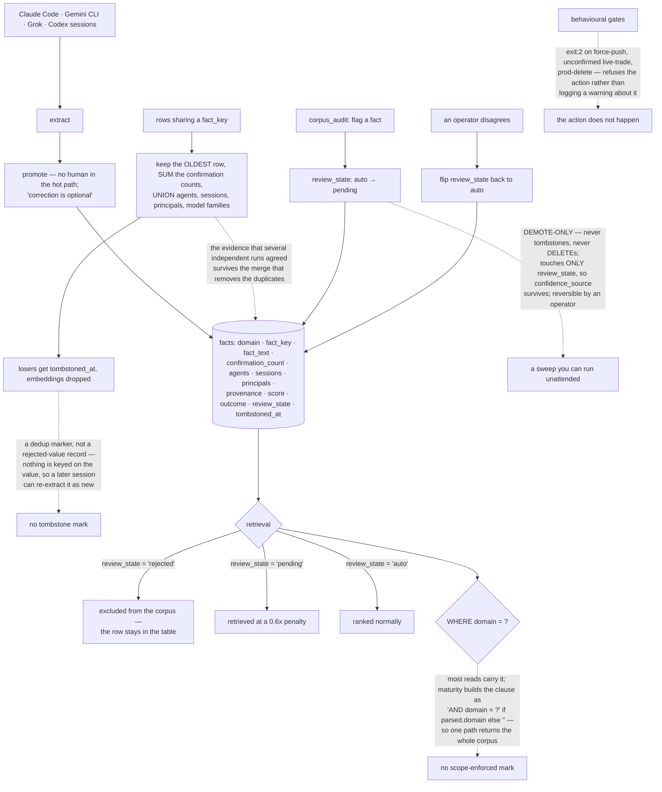

## 1. Executive Summary

gaius is an "[o]ps memory lifecycle manager for AI coding agents" — Apache-2.0,
Python, 29,474 lines across 79 files, one SQLite file with BM25 and sqlite-vec
and no network. It extracts facts from Claude Code, Gemini CLI, Grok and Codex
sessions, "ranks them into an inject-ready corpus, enforces behavioral gates, and
prevents you from breaking prod at 3am."

Its three claims are stated as things other tools skip, and the first of them is
unusual to advertise:

> "**Runs unattended** — extract → promote → inject with no human in the hot
> path; correction is optional."

Most systems in this corpus imply a person somewhere and leave the reader to
discover there isn't one. gaius says so on the first screen, which changes how
the rest should be read.

**The mechanism worth carrying is an enforcement pass that states its own limits
before its purpose.** `corpus_audit` reclassifies flagged facts from `auto` to
`pending`, and the module header bounds it three ways:

> "• DEMOTE-ONLY — never tombstones, never DELETEs."
> "• Touches ONLY `review_state` — `confidence_source` is left untouched…"
> "• Reversible — an operator flips `review_state` back to `auto` to undo."

The three values then do different work. A read filters `review_state !=
'rejected'`, so a rejected fact keeps its row and leaves the corpus; a `pending`
fact stays retrievable under "the ranker's 0.6x pending" penalty. Withholding and
demotion are separate outcomes rather than one slider, which is the distinction
this atlas most often finds collapsed.

That same sentence is why this report does not carry `human_review`. A fact
enters as `auto`, or as `pending` when its confidence is under 0.5 or it
conflicts with another (`gaius/facts.py:540-548`), and both are retrievable —
only `rejected` leaves the corpus, and only a person's later act writes it. So
nothing is held back waiting for anyone, which the project says plainly of
itself: it *"[r]uns unattended — extract → promote → inject with no human in the
hot path; correction is optional."*

The review surface is nonetheless better built than most in this corpus, and
deserves recording for what it is. `gaius/review.py:78` refuses outright off a
terminal — *"gaius {action} requires a tty. Use `--report` for a read-only
summary"* — so the adjudicating UI cannot be driven by a pipeline; the
cluster-level flow promotes staged events with an explicit outcome (`confirmed`,
`refuted`, `open_question`, or none) rather than a bare yes; and an individual
confirmation writes `confidence_source='human'` (`:623`) so the origin of the
number is recoverable afterwards.

**The gates prevent rather than advise.** "[H]ard gates `exit:2` on force-push,
unconfirmed live-trade, prod-delete" — a non-zero exit rather than a warning in a
log.

**And the deduplication preserves the evidence it merges.** Rows sharing a fact
key are folded into the oldest, with confirmation counts summed and the agents,
sessions, principals and model families unioned rather than picked — so the fact
that several independent runs agreed survives the merge that removes the
duplicates.

**The gap is a familiar one.** `domain` is on every fact and most reads carry
`WHERE domain = ?`, but the maturity path builds the clause as `"AND domain = ?"
if parsed.domain else ""` — the isolation holds where somebody wrote it
carefully and lapses where it was treated as an option.

## 2. Mental Model

A **fact** is extracted, promoted and injected without anyone approving it.

A **review state** either withholds or discounts, and the two are not the same.

An **audit pass** may demote and may not destroy.

A **gate** exits non-zero; it does not warn.

## 3. Architecture

| Area | Role |
| --- | --- |
| `gaius/facts.py` | The schema, the dedup merge, and the read filters |
| `gaius/corpus_audit.py` | The demote-only enforcement pass and its stated bounds |
| `gaius/concord.py` | Single-winner resource claims, enforced by a partial unique index |
| `gaius/maturity.py` | The ranked-set pass, and the conditional domain clause |
| `gaius/_core.py` | The command table, including a retired verb kept as a signpost |
| `hooks/`, `benchmarks/` | Agent integrations and measurement |

## 4. Essential Implementation Paths

`gaius/corpus_audit.py:53-62` — an enforcement pass that says what it may not do
before saying what it does.

`gaius/facts.py:443` — the read filter that makes `rejected` mean something.

`gaius/facts.py:36-80` — a merge that unions the evidence rather than choosing
among it.

`gaius/maturity.py:407` — the conditional scope clause.

`gaius/concord.py:154-158` — a partial unique index as "the atomic single-winner
claim", where "the loser is told, never queued".

## 5. Memory Data Model

Facts keyed by domain and fact key, carrying the agents, sessions, principals and
model families that produced them, a confirmation count, a provenance record, a
score, an outcome, a review state and a tombstone column; sessions, domains,
entities and triples beside them, with a separate claims table for resource
coordination.

## 6. Retrieval Mechanics

BM25 with optional sqlite-vec semantic search over facts that are neither
tombstoned nor rejected, with pending facts carried at a discount rather than
dropped, ranked by a composite score.

## 7. Write Mechanics

Extraction and promotion run unattended. Duplicates are merged rather than
deduplicated destructively. The audit pass demotes. Behavioural gates sit in
front of dangerous actions and exit non-zero rather than recording an opinion.

## 8. Agent Integration

A CLI, an MCP server and hooks for the agents whose sessions it reads, with an
offline core and semantic and MCP extras.

## 9. Reliability, Safety, and Trust

The strong parts are the bounded sweep, the separation of withholding from
demotion, the evidence-preserving merge and gates that refuse. The limits are a
scope clause that one path treats as optional, a tombstone column that is a dedup
marker rather than a rejected-value record, and a pipeline that by design does
not wait for a person.

## 10. Tests, Evals, and Benchmarks

A benchmarks directory sits beside the package, and the corpus audit is written
to be run repeatedly and reversed, which is its own kind of check. There are no
committed cases asserting that particular material must not be retrieved.

## 11. For Your Own Build

Bound your enforcement pass in its own header, and bound it downward. "Never
tombstones, never DELETEs" is what makes a sweep something an operator will
actually let run.

Keep withholding and demotion as different states. A single confidence number
cannot express "do not use this" and "use this last" at the same time.

Union your evidence when you merge. Summing confirmation counts and unioning the
agents that produced a fact keeps the reason it was believed; picking a winner
discards it.

Write your scope clause unconditionally. The path that makes it optional is the
path that returns somebody else's corpus.

## 12. Open Questions

Whether the maturity path's optional domain clause is deliberate. Every other
read carries the predicate, which makes the one that does not look like an
oversight rather than a decision.

Whether `rejected` should be keyed on the value. A rejected fact leaves the
corpus and a later session can extract the same claim again, so the rejection
protects the corpus once rather than standing.

## Appendix: File Index

| Path | What to read it for |
| --- | --- |
| `gaius/corpus_audit.py:53-62` | A pass that states its own ceiling first |
| `gaius/facts.py:443` | Withholding and demotion as different states |
| `gaius/facts.py:36-80` | Merging duplicates without discarding the agreement |
| `gaius/maturity.py:407` | The scope clause that became optional |

## History

**2026-09-19** — audited at the unchanged pin [`b720bdb6ba0f8d2b8e76f7e843493affad9cd329`](https://github.com/jkubo/gaius/commit/b720bdb6ba0f8d2b8e76f7e843493affad9cd329); nothing upstream moved, so the correction is ours. `human_review` is **withdrawn**, and section 2 already contained the fact that settles it: the read filters `review_state != 'rejected'`, so a `pending` fact stays retrievable under a ranking penalty. Nothing waits. The withdrawn record's own qualification said the same thing from the other side — the surface is one *"a person may use and not one the pipeline waits for"* — and the project's stated posture is that it runs unattended with correction optional. This reading also turned up `gaius/review.py`, which the previous record did not cite and which is worth more than the mark it cannot earn: the review command exits 2 off a terminal, promotion from staging takes an explicit outcome rather than a bare yes, and a human confirmation stamps `confidence_source='human'`. All three are now in section 2. `trust_state` stands on the same filter — `rejected` is the state that withholds. Screened again first; nothing was installed and no suite was run.

**2026-09-16** — [`b720bdb6ba0f8d2b8e76f7e843493affad9cd329`](https://github.com/jkubo/gaius/commit/b720bdb6ba0f8d2b8e76f7e843493affad9cd329) — first reading, at a commit dated 15 September 2026. Screened before opening, from a shallow clone: four auto-run surfaces, one build-time execution point, no unpinned dependency surfaces and two dependency files inside the seven-day cooldown. Nothing was installed, built or run, and no session transcript was extracted.
