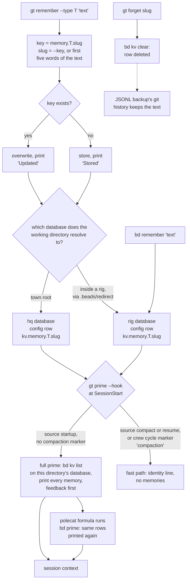

## 1. Executive Summary

Gas Town is a workspace manager that runs twenty or thirty coding agents at
once — a mayor, per-rig crew, ephemeral polecat workers and patrol roles —
and coordinates them through [beads](https://github.com/gastownhall/beads), a
Dolt-backed issue tracker, with mail, hooks and handoffs layered on top. Almost
everything it persists is work state. Its memory is one small mechanism beside
that: `gt remember` writes a typed string — `feedback`, `user`, `project`,
`reference` or `general` — into beads' key-value store, and `gt prime`, which a
SessionStart hook runs at the start of every agent session, prints every stored
memory into context with feedback first. It is weak where it is small. Nothing
ranks, bounds or attributes a memory. The destination is whichever database the
working directory resolves to, not one the caller names. A key derived from the
first five words overwrites any other memory that begins the same way.

The design decision is explicit in the role prompts: this store *replaces*
Claude Code's filesystem auto-memory, and borrows its four types and its
"what not to save" rule. The mayor's template states the reason — memory held in
Dolt is visible to every agent reading the same database, where a `MEMORY.md`
belongs to one project path and one runtime (`internal/templates/roles/mayor.md.tmpl:267-293`).

Three findings shape the rest of this report.

- **The scope is physical, and narrower than the prompt says.** The mayor
  template tells the agent memories are *"shared across all agents in the
  town"*. The write goes to whichever database the process's working directory
  resolves to. That is `hq` for the town-level agents and the rig's own database
  for crew and polecats inside a rig. `gt prime` then reads the single database
  its own working directory resolves to. A rule the mayor records is therefore
  not injected into any polecat.
- **Memories are injected at a full prime and nowhere else.** After a compaction
  or resume — or a crew worker's compaction-triggered session cycle — `gt prime`
  takes a fast path that prints an identity line and nothing from the store. The
  memories survive in the agent's context only if the compaction summary kept
  them. Beads ships `bd prime --memories-only` *"for compact hook contexts"*; no
  hook template in this tree calls it.
- **The same rows reach polecats twice.** The polecat work formula runs
  `gt prime` and then `bd prime`, and beads' prime renders every `kv.memory.*`
  row again in its own format. The two CLIs share one keyspace deliberately, and
  a legacy untyped key is read as `general` for that reason.

The rest of Gas Town's continuity is work state rather than memory: handoff
mail, the polecat checkpoint, hooked beads, and `gt seance`, which forks a
predecessor's Claude session to question it. None of it records what is the
case, so none of it can turn out false in the sense
[the scope boundary](../../families/#not-in-scope-conversation-window-management)
uses. Seance is described in section 2 because it is the most distinctive idea
in the tree. It is not scored.

No capability mark is carried. Section 9 names each near-miss.

## 2. Mental Model

A memory is one string under one key. It becomes a belief the moment
`bd kv set` returns: there is no candidate state, no extraction pass, and no
check against what is already stored beyond whether the key exists. It stops
being one in exactly two ways. `gt forget` deletes the row, or a later
`gt remember` under the same key replaces the text. Nothing expires. The
Key Record Chronicle's TTLs (`internal/krc/krc.go`) apply to event-log entries,
and the Reaper deletes closed wisps; neither reads the `config` table.

The writer is whoever runs the command — an agent following its role prompt, or
a person at a shell. Type is chosen at write time and does two things at read
time: it orders the injected block (`feedback`, `user`, `project`, `reference`,
`general`; `remember.go:32`) and picks the header each group is printed under
(`prime.go:596-602`). The feedback header reads *"Behavioral Rules (from user
feedback)"*. That provenance is a label the writer selected, not a fact the
store recorded.

Injected memories carry no qualifier — a bullet per memory, `**slug**: text` —
so the model receives them as settled context, on a par with the role prompt.

The other continuity mechanisms answer a different question.

| Mechanism | What it holds | Can it be false about the world? |
| --- | --- | --- |
| Handoff mail | A bead the predecessor wrote, printed under *"Handoff from Previous Session"* (`prime_output.go:464-489`) | No — it records what a session left for the next |
| Polecat checkpoint | `.polecat-checkpoint.json`: molecule, step, modified files, last commit, branch, notes (`internal/checkpoint/checkpoint.go`) | No — it describes the worktree |
| Hooked bead | The unit of work assigned to the agent | No — it is the assignment |
| Seance | Nothing stored; `claude --fork-session --resume <id>` reopens a predecessor transcript and asks it a question (`seance.go:57`) | The transcript is what was said |

Seance is memory by resurrection. The store is the untouched transcript, and the
extraction cost is paid only when a successor asks something, by the model that
already holds the context. Nothing is distilled, so nothing distilled can be
wrong. The price is that the answer comes from a fork of a session that may have
been confused, with no record of the question or answer kept anywhere.

## 3. Architecture

Gas Town is a Go CLI, `gt`, plus a daemon, around a tmux session per agent and
one Dolt SQL server per town on port 3307. The server holds one database per rig
and an `hq` database for town-level beads (`docs/design/dolt-storage.md`, *Server
Architecture*). Beads' `bd` binary does every read and write of that data; `gt`
shells out to it.

Memory adds no component of its own. A memory is a row in beads' `config` table,
the table that also holds beads' settings, under the key
`kv.memory.<type>.<slug>`. `bd` adds the `kv.` prefix (`kv.go:13` in beads); `gt`
adds `memory.<type>.` (`remember.go:17`). There is no index, embedding or
separate table.

**The engine version is not pinned at runtime.** `go.mod` requires
`github.com/steveyegge/beads v1.0.5`, but no Go file here imports a beads
package — `gt` execs whatever `bd` is on `PATH`, checks it against
`MinBeadsVersion = "0.57.0"`, and installs `github.com/steveyegge/beads/cmd/bd@latest`
when it is missing (`internal/deps/beads.go:19-22`). This report reads beads at
[`v1.0.5`](https://github.com/gastownhall/beads/commit/6a3f515ced18406c189c55fff789a4925bfaa35c)
as the reference; a later `bd` may behave differently.

Two daemon jobs touch the memory rows without being about memory. The JSONL git
backup exports each database's `config` table, among its supplemental tables,
every 15 minutes and pushes the result to a git remote
(`internal/daemon/jsonl_git_backup.go:210-221`). The scrub filter applies to
`issues.jsonl` only (`jsonl_git_backup.go:226`), so memory text is exported as
written. The Compactor Dog flattens Dolt history daily once a database passes
2,000 commits (`internal/daemon/compactor_dog.go:31`).

### Deployment and ergonomics

Nobody runs this memory without running Gas Town: Dolt, `bd`, `gt`, tmux, the
daemon, and at least one coding CLI. It is fully local and needs no API key to
store anything. The store is readable and repairable by hand — `gt memories`,
`bd kv list`, SQL against the Dolt server, or `config.jsonl` in the backup
repository — and a wrong memory is fixed by re-running `gt remember` with the
same key.

## 4. Essential Implementation Paths

**Write.** `runRemember` (`internal/cmd/remember.go:70-114`) validates `--type`
against `validMemoryTypes` (`:22-28`), defaults it to `general`, takes `--key`
or `autoKey(content)` (`:137-170`: the first five words, lowercased,
non-alphanumerics stripped, capped at 40 characters, falling back to the first 4
bytes of a SHA-256), runs `sanitizeKey`, then calls `bdKvGet` and `bdKvSet`
(`:98-106`). Both helpers are a bare `exec.Command("bd", "kv", …)` with the
inherited environment and working directory (`:195-217`).

**Engine write.** Beads' `kv set` validates the key against reserved prefixes and
calls `store.SetConfig(ctx, "kv."+key, value)` (`cmd/bd/kv.go:57-96` at v1.0.5), which runs `issueops.SetConfigInTx` in a retrying transaction
(`internal/storage/dolt/config.go:16-35`).

**Inject.** `runPrime` reaches `runPrimeExternalTools(ctx, cwd)` only on the full
path (`prime.go:234`), after returning early for `isCompactResume()` (`:178-181`).
`runMemoryInject` (`:606-654`) calls `bdKvListJSONForPrime(workDir)` (`:657-664`),
which runs `bd kv list --json` through `runPrimeExternalCommand` (`:574-593`)
with a 5-second timeout (`:40`). For `bd`, that helper applies
`beads.ConfigureCommand` with `ReadOnlyRouting`: the inherited `BEADS_DIR`,
`BEADS_DB` and `BEADS_DOLT_*` selectors are stripped and `bd` routes by working
directory (`internal/beads/database.go:57-108`, `:166-167`). The rows are parsed
by `parseBdKvListJSON` (`remember.go:220-248`), filtered to the `memory.` prefix,
grouped by `parseMemoryKey` (`:118-134`) and printed under `# Agent Memories`.

**Compaction and resume.** `isCompactResume` is true for hook source `compact` or
`resume`, or a handoff marker whose reason is `compaction` (`prime.go:408-410`).
`runPrimeCompactResume` prints a recovery line, session metadata and, for
polecats, a `gt done` reminder (`:276-303`); it calls neither `runMemoryInject`
nor `outputHandoffContent`. The crew override replaces compaction with
`gt handoff --cycle --reason compaction` (`internal/hooks/config.go:350-361`),
which writes that marker and respawns the pane with `claude --continue`
(`internal/cmd/handoff.go:529-568`).

**Search.** `runMemories` (`internal/cmd/memories.go:43-132`) lists every
`memory.` key and, given a term, keeps rows whose short key, value or type
contains it case-insensitively (`:81-83`).

**Forget.** `runForget` (`internal/cmd/forget.go:32-86`) accepts `type/key` and
clears that key. Given a bare key, it tries each type in `memoryTypeOrder` and
clears the first match (`:57-70`), then falls back to the legacy untyped key.
Beads' `kv clear` calls `store.DeleteConfig` (`kv.go:146-180`), a plain delete
(`config.go:79-83`).

**The second injector.** Beads' `formatMemoriesForPrime` (`cmd/bd/prime.go:340-400` at v1.0.5) reads every `kv.memory.*` config row and prints them under
*"Persistent Memories (N)"* with instructions to update them via
`bd remember --key`. The polecat work formula runs it straight after `gt prime`
(`internal/formula/formulas/mol-polecat-work.formula.toml:64-67`), and four other
polecat formulas do the same.

## 5. Memory Data Model

| Field | Where | Notes |
| --- | --- | --- |
| key | `config.key` | `kv.memory.<type>.<slug>`; legacy `kv.memory.<slug>` reads as `general` |
| value | `config.value` | The text as written. A non-string JSON value under a `memory.` key is compacted to a string rather than dropped (`remember.go:240-245`) |

That is the whole record. The row carries no author, no timestamp, no session,
no source bead and no status, although the writing process has `BD_ACTOR`,
`GT_ROLE` and `GT_SESSION` in its environment. The type is part of the key, so
`feedback/x` and `project/x` are two memories. Retyping a memory means a
`remember` under the new type and a `forget` under the old.

**Scope is the database.** Beads' own guidance in this tree states the rule:
*"Direct `bd` commands from rig worktrees use that rig's `.beads` redirect and
database"* (`docs/design/dolt-storage.md`, *Gas Town Scope vs `bd --global`*).
`ResolveBeadsDir` follows `.beads/redirect` chains up to three deep so crew and
polecat worktrees share the rig's database (`internal/beads/beads_redirect.go:28-90`).
The mayor's session starts in `<town>/mayor` (`internal/mayor/manager.go:109-111`),
which has no `.beads` of its own, so `bd` finds the town-root `.beads` that
`gt install` creates for the `hq` database (`internal/cmd/install.go:57-60`).
No key on the row carries a scope, and no read has a predicate: the partition is
entirely which database answered.

**The keyspace is shared with beads, by string.** `bd remember` writes
`kv.memory.<slug>`, which `gt` reads as `general`. `bd remember --key` uses the
flag verbatim (`cmd/bd/memory.go:71-75` at v1.0.5), so
`bd remember --key feedback.x` updates `gt`'s typed memory in place. The two
auto-key rules differ: `gt` takes five words and 40 characters, `bd` eight words
and 60. The same sentence stored by each CLI therefore lands under two keys.

## 6. Retrieval Mechanics

There is no query. A full prime lists every memory row in one database and
prints all of them, sorted by type order and then by key, with no cap on count
or length (`prime.go:606-654`). Recall is complete by construction and precision
is whatever the store's owners keep it to. The cost grows linearly with the
store, and the mayor template's *"What NOT to save"* list is the only thing
holding it down (`mayor.md.tmpl:290-293`).

Injection happens once, at session start, as SessionStart hook output. Within a
session the block does not change, so it does not disturb a prompt-prefix cache
turn to turn. A memory written mid-session reaches other running agents only
when they next take the full prime path, or if they run `gt memories`.

**Polecats read the store twice.** `gt prime` renders typed groups under
`# Agent Memories`, and `bd prime` renders the same rows as a flat list under
*"Persistent Memories"*, the typed keys appearing as `feedback.slug`. Each copy
arrives with the other CLI's editing instructions. Beads at
[`dbbf3a9618aacaab20427f7bc1f7b35b6edab3ba`](https://github.com/gastownhall/beads/commit/dbbf3a9618aacaab20427f7bc1f7b35b6edab3ba),
dated 27 July 2026, adds `--max-memories` and `--max-memory-chars` to its own
prime, unlimited unless configured. `gt prime` has no equivalent.

**After compaction, nothing is re-read.** Claude Code fires SessionStart with
source `compact` after compacting, `gt prime --hook` records the source
(`prime.go:344-361`), and the fast path skips injection. A crew worker's
compaction instead cycles to `claude --continue` with a `compaction` marker,
which lands on the same fast path. Whether the memories survive depends on the
runtime's summary, not on anything in this tree. `bd prime --memories-only`
exists for this case (`cmd/bd/prime.go:197` at v1.0.5), and no hook template
here calls it.

A read failure is silent: `runMemoryInject` returns with no output when
`bd kv list` fails or times out (`prime.go:607-610`). The same function's caller
treats a failed hook query loudly — *"DATABASE ERROR — DO NOT RUN gt done"*
(`prime.go:209-213`). A Dolt outage therefore produces a session with its work
flagged as uncertain and its memories absent without comment.

`gt memories` is the only search: a substring over key, value and type.

## 7. Write Mechanics

Writes are explicit and synchronous. The agent, or a person, decides what to
remember and runs a command; there is no extraction, no background writer, no
deduplication beyond the exact key, and no consolidation. The call spawns two
`bd` processes — a `get` then a `set` — each opening a connection to the Dolt
server, so it costs one short blocking shell command. No model call is made.

**Update is by key collision, and an auto-key collides on the first five
words.** When the key exists, `runRemember` changes its verb from `Stored` to
`Updated` and overwrites (`remember.go:98-106`). With no `--key`, the key is the
first five words, so any two memories that open the same way are one memory.
The project's own test fixture shows the shape: *"Don't use rm -rf on
.dolt-data/"* keys to `dont-use-rm-rf-on` (`remember_test.go:23-26`). A later
*"Don't use rm -rf on the worktree"* replaces it. The command prints `Updated`
and does not show the text it discarded.

**The destination is the working directory's database.** The command takes no
target. It runs `bd` with the inherited environment, where the reader strips
`BEADS_DIR` and the other selectors before routing. In a session configured as
the daemon intends, both resolve from the same working directory and agree.
They diverge in the one configuration `gt doctor` warns about —
*"BEADS_DIR overrides prefix-based routing"* (`internal/doctor/env_check.go:163-185`).
There, `gt remember` writes where `BEADS_DIR` points and `gt prime` reads the
working directory's database. The divergence was not reproduced; it is read from
the two env policies.

**No Dolt commit is attributed to a `gt` memory.** Beads' `kv set` never marks
its command as a write, so bd's post-run auto-commit does not fire for it
(`cmd/bd/main.go:1162` at v1.0.5). `bd remember` does mark it
(`cmd/bd/memory.go:94`). Under Gas Town's server mode bd's auto-commit default
is off in any case (`main.go:1045-1056`). The history a memory reliably leaves
is therefore the JSONL backup's git log, at 15-minute granularity.

**Delete** is `gt forget`, a hard delete of one key. With a bare key and the
same slug under two types, the first in type order is removed and the other
stays. Nothing records that the text was rejected, so the same agent can store
it again next session.

Agent-generated memories are handled exactly like a person's. No input is
filtered. The one gate is on the sandboxed path (section 9).

### Operational cost

- Write: synchronous, two `bd` subprocesses, no model call. Retrievable by the
  next full prime of any agent resolving to the same database.
- Background: none for memory. The 15-minute JSONL export and the daily compactor
  cover the whole database.
- Read: one `bd kv list --json` per full prime, bounded at 5 seconds. Injection
  is unbounded in size, once per session, and duplicated for polecats.

## 8. Agent Integration

Hook templates for Claude Code, Gemini CLI, Codex, OpenCode, pi and omp run
`gt prime --hook` at SessionStart (`internal/hooks/templates/`; for Claude,
`claude/settings-interactive.json:42-51`). That is the only automatic path from
the store to a model.

The write affordance is prose. The town-root `CLAUDE.md` template, which every
Claude session under the town inherits, carries an *Agent Memory* section:
*"Use `gt remember`, not MEMORY.md"*, and forbids writes to
`~/.claude/*/memory/` (`internal/templates/townroot/claude.md:78-88`). The
mayor template repeats it with the four types and a list of what not to save
(`mayor.md.tmpl:267-293`). No polecat or crew template mentions memory.

The agent has full agency over the store: write, overwrite, search and delete,
with no confirmation on any of them. The one structural limit is the sandbox
proxy. Polecats running under `gt-proxy-server` may invoke only `gt` subcommands
annotated `polecatSafe` and a fixed `bd` list
(`internal/cmd/proxy_subcmds.go:11-19`). `prime` carries the annotation;
`remember`, `memories` and `forget` do not, and `kv` and `remember` are absent
from the `bd` list. A sandboxed polecat receives the rig's memories and cannot
change them.

Porting the mechanism to another agent is trivial: a key-value table, a hook
that prints it, and a paragraph of prompt. The Gas Town parts — rigs, redirects,
the proxy — are what give it a scope and a gate.

## 9. Reliability, Safety, and Trust

**Provenance is absent.** A row records no writer, time or source, and the
feedback header asserts user origin for text any agent in the database may
have written. A polecat that reads an issue body containing an instruction to
`gt remember --type feedback …` can, outside the sandbox, install a behavioural
rule that every later session in the rig receives under *"Behavioral Rules
(from user feedback)"*. Only the sandbox allowlist and the role prompt stand
between the two.

**Concurrency** is last-write-wins per key inside a Dolt transaction, which is
adequate for a store this size. Two agents remembering different facts under
one auto-key lose one silently.

**Data loss** has two routes: the auto-key overwrite in section 7 and the silent
read failure in section 6. The backup mitigates the first. The JSONL export
holds every value that existed at an export, and git history keeps it.

**Privacy and deletion.** `gt forget` removes the row from the live database.
The text stays in the backup repository's history, which the daemon pushes to
a remote, unscrubbed. The Dolt commit history keeps it too until the compactor
flattens it. A memory holding something that must be gone needs a history
rewrite of the backup repository as well.

**Uncertainty cannot be represented.** There is no field for it, and injection
presents every memory as settled.

Capability marks, each withheld:

- `scope_enforced` — the partition is one Dolt database per rig plus `hq`,
  selected by working directory. It is a real boundary and the
  [rubric](../../methodology/atlas-rubric/) treats a physical partition as a
  different mechanism; there is no key on the row and no predicate on a read.
- `tombstone` — `gt forget` deletes; nothing keyed on the rejected text survives
  to stop it being stored again.
- `audit_log` — the store keeps no mutation record. The JSONL backup's git
  history and Dolt's commit graph are version history, and the compactor
  flattens the latter.
- `trust_state` — the five types order and label the injection; no read excludes
  a row by type.
- `human_review` — `gt memories` displays, and the same commands are open to the
  agent.
- `negative_eval` — section 10.
- `bitemporal` — no time field of any kind.

## 10. Tests, Evals, and Benchmarks

Nothing was built or run for this report; everything below is from reading
the tests at the pin.

`internal/cmd/remember_test.go` holds six tests of pure helpers: `autoKey`,
`sanitizeKey`, `parseMemoryKey`, `memTypeRank`, `parseBdKvListJSON` and its
malformed-input case. The parsing test asserts that non-memory, non-string
values such as `schema_version` are dropped (`:194-238`). That is an exclusion
of beads' own metadata, not of memory material, so it is not a negative case in
the mark's sense.

`internal/cmd/prime_external_tools_test.go` exercises the injection path end to
end against stub `bd` and `gt` scripts on `PATH`. `TestRunPrimeExternalTools_RunsMemoryAndMail`
has the stub return `{"memory.feedback.test":"remembered"}`, asserts that
`bd kv list --json` was called, and asserts the text reached stdout
(`:75-98`). A second case bounds a slow mail check, and a third asserts memory
still runs for patrol roles that skip mail (`:100-169`). These can fail: the
stub exits 99 on any unexpected arguments, and the output assertions are
positive.

`TestIsCompactResume` pins the routing that sends compaction, resume and
compaction-cycle sessions down the fast path (`prime_test.go:696-763`). It
asserts the routing. No test asserts what a session holds after the fast path,
which is where the memories go missing.

No test executes `runRemember`, `runForget` or `runMemories`. Nothing covers the
auto-key overwrite, the type-order delete, or the writer's and reader's
environment policies against each other.

`gt-model-eval/` is a promptfoo harness over patrol-role decisions; none of its
cases touches memory. No paper or citation block exists in the tree, and no
benchmark result is committed.

## 11. For Your Own Build

### Steal

- **Order the injected block by what a memory is for, and print a header per
  group.** Corrections first, then facts about the user, then project state, then
  pointers. It costs a sort and it puts the rules a model must not break at the
  top of the block.
- **Put a "do not save" rule in the prompt that grants the write.** Nothing
  derivable from the code, git history or existing docs. It is the only bound on
  this store, and it is the right one for a store that injects everything.
- **Strip inherited target selectors before every subprocess touches the store.**
  `StripBDTargetEnv` removes stale `BEADS_DIR`-style variables so the process
  resolves the database the caller meant. Apply it to writes as well as reads.
- **Derive a sandbox allowlist from a per-command annotation.** A new command is
  denied until someone marks it safe. That default is what keeps memory writes
  off the sandboxed worker path here, although nobody decided it for memory.
- **Consider asking a transcript instead of distilling one.** Seance forks the
  predecessor session and asks it a question when a successor needs something.
  Nothing is extracted ahead of time, so nothing extracted can be wrong.

### Avoid

- **Treating a slug collision as an update.** A key derived from content is an
  identity claim about the content. Refuse on collision, or show the text being
  replaced, unless the caller named the key.
- **A header that asserts provenance the row does not carry.** *"From user
  feedback"* over text an agent chose to type as feedback is a trust claim with
  nothing behind it. Record the writer, or drop the claim.
- **Letting the process location choose the destination while the prompt
  describes a wider one.** Name the scope in the write, and have the read say
  which scopes it merged — see [explicit write destination](../../patterns/explicit-write-destination/).
- **A fast path that skips the only injection.** If memory arrives through one
  hook, every re-entry path — compaction, resume, a successor session — needs to
  re-run it or say it did not.
- **Loud failure for work state beside silent failure for memory.** An empty
  block and a failed read look the same to the model.

### Fit

This is adequate for what it is: a few dozen durable rules per rig, kept by
people and agents already running Gas Town, where Dolt and beads are sunk cost.
It is not a reason to adopt Gas Town, and nothing in it transfers that a
key-value table and a SessionStart hook would not give you in an afternoon.
It stops fitting past the point where printing the whole store at every start is
cheap. It also stops fitting once untrusted text reaches agents that can write
feedback, or once the question becomes relevance rather than recall. A
coordinator that relies on its rules reaching the workers should know they
reach only the workers in its own database.

## 12. Open Questions

- Does Claude Code's compaction summary retain SessionStart hook output? If it
  does, the fast path loses less than section 6 implies. Settling it needs a run.
- Does a customised HQ put the mayor and the rigs on one database? The standard
  layout was traced and keeps them apart. `gt install --help` points to
  `docs/hq.md` for beads redirects and multi-system setups, and no such file is
  in the tree (`ls docs/hq.md`).
- Does a `bd` later than v1.0.5 change `kv` semantics, the write flag, or
  `bd prime`'s memory rendering? `gt` installs `@latest`.
- Does the Dolt server create a commit for a `config` write that bd's
  auto-commit skips? The design document's *All-on-Main* section describes
  `DOLT_COMMIT` for issue writes. It was not traced for the config table.
- How large do these stores get in the maintainers' own town? Nothing committed
  says.

## Appendix: File Index

- **Storage and schema:** `internal/cmd/remember.go` (key layout, types,
  `bdKvSet`, `bdKvGet`, `bdKvClear`, `parseBdKvListJSON`); beads v1.0.5
  `cmd/bd/kv.go`, `cmd/bd/memory.go`, `internal/storage/dolt/config.go`;
  `docs/design/dolt-storage.md`.
- **Write path:** `internal/cmd/remember.go:70-114`, `internal/cmd/forget.go`.
- **Retrieval and injection:** `internal/cmd/prime.go:40, 170-240, 276-303,
  344-361, 408-410, 547-664`; `internal/cmd/memories.go`; beads v1.0.5
  `cmd/bd/prime.go:328-400`.
- **Scope and environment:** `internal/beads/beads_redirect.go`,
  `internal/beads/exec.go`, `internal/beads/database.go`,
  `internal/doctor/env_check.go:160-190`.
- **Agent integration:** `internal/hooks/config.go`,
  `internal/hooks/templates/claude/settings-interactive.json`,
  `internal/templates/townroot/claude.md:78-88`,
  `internal/templates/roles/mayor.md.tmpl:267-293`,
  `internal/formula/formulas/mol-polecat-work.formula.toml`,
  `internal/cmd/proxy_subcmds.go`, `cmd/gt-proxy-server/main.go`.
- **Continuity mechanisms (not memory):** `internal/cmd/handoff.go`,
  `internal/cmd/prime_output.go:464-489`, `internal/checkpoint/checkpoint.go`,
  `internal/cmd/seance.go`, `internal/krc/krc.go`.
- **Background:** `internal/daemon/jsonl_git_backup.go`,
  `internal/daemon/compactor_dog.go`.
- **Tests:** `internal/cmd/remember_test.go`,
  `internal/cmd/prime_external_tools_test.go`, `internal/cmd/prime_test.go`.

### Recorded searches

Checked against the checkout at the pinned revision, and beads at `v1.0.5`.

- `grep -rliE 'arxiv|bibtex|@article|@misc|doi\.org' . --exclude-dir=.git` — no match, and no `CITATION.cff`.
- `grep -rn 'memories-only' . --exclude-dir=.git` — no match in Gas Town; beads defines the flag at `cmd/bd/prime.go:197`.
- `grep -rnE 'runMemoryInject|bdKvListJSONForPrime|runRemember|runForget|runMemories' --include='*_test.go' .` — no match. The injection is reached through `runPrimeExternalTools`, which `prime_external_tools_test.go` calls.
- `grep -rnE 'bdKvSet\(|bdKvClear\(|bdKvGet\(' --include='*.go' .` — callers only in `remember.go:98-104` and `forget.go:44-80`.
- `grep -rnE 'memoryKeyPrefix' --include='*.go' . | grep -v _test` — `remember.go`, `forget.go`, `memories.go`, `prime.go`; no other writer or reader of the prefix.
- `grep -nE 'events\.|townlog|LogEvent' internal/cmd/remember.go internal/cmd/forget.go` — no match; neither command emits an event.
- `grep -rlE '(gt|\{\{ ?cmd ?\}\}) (remember|memories|forget)' . --exclude-dir=.git --exclude='*.go'` — `CHANGELOG.md`, `mayor.md.tmpl`, `townroot/claude.md`; no polecat or crew template.
- `rg -l 'AnnotationPolecatSafe: "true"' internal/cmd` — thirteen files, none of them `remember.go`, `memories.go` or `forget.go`.
- `rg -l '"github.com/steveyegge/beads/' --type go` — only `internal/deps/beads.go`, which names the install path in a string; no beads package is imported.
- `rg -n 'commandDidWrite' cmd/bd/kv.go cmd/bd/memory.go` in beads — `memory.go:94` and `:234` only.

## History

**2026-09-25** — [`649b832b7672bc7a2dbef26f5983aba6198b819b`](https://github.com/gastownhall/gastown/commit/649b832b7672bc7a2dbef26f5983aba6198b819b) — first reading, at the head of `main`, a commit dated 23 July 2026. No mark awarded; section 9 names each near-miss. Beads was read at [`v1.0.5`](https://github.com/gastownhall/beads/commit/6a3f515ced18406c189c55fff789a4925bfaa35c) for the storage engine. Screened before reading: one auto-run surface (`.githooks/`, inert unless `core.hooksPath` points at it; its `pre-push` restricts push targets), two build-time execution points (`Makefile`, an npm `postinstall`), no unpinned surface, nothing inside the cooldown, and `AGENTS.md` recorded as data. Beads' screen found six auto-run surfaces; the clone was read with `grep` and `sed` only. Nothing was installed, built or run.
