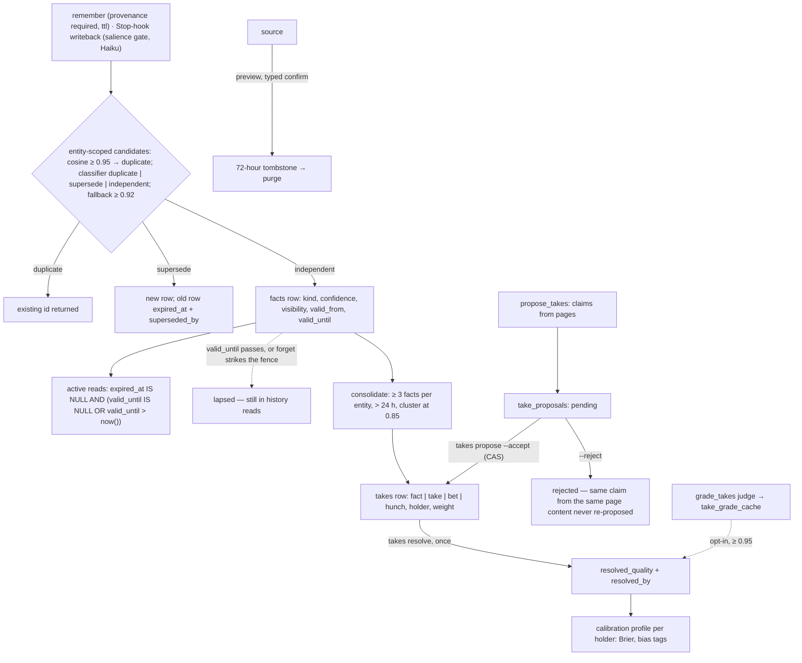

## 1. Executive Summary

GBrain is a knowledge layer for agents: it ingests pages from mail, meetings,
documents and transcripts, wires a typed entity graph with no model call,
synthesises cited answers that state their own gaps, and keeps two memories
beside the pages. MIT; 1,062 commits between 5 April and 6 September 2026;
401,325 lines of TypeScript under `src/` and 903,931 with `test/`, in 2,127
test files; version 0.48.3.0; Postgres or PGLite with pgvector behind two
engine implementations. The screen found a `.claude-plugin/` directory that
runs on load, a `postinstall` in the package manifest, two manifests inside
the seven-day cooldown and three unpinned surfaces; nothing was installed
or run.

The two memories answer different questions. **Facts** (`src/core/migrate.ts:2383-2425`)
are hot memory — one claim per row with a kind, an entity, a confidence that
decays on a per-kind half-life, a visibility, a validity window and a
provenance string — written by the `remember` verb, which refuses a fact
without provenance, or by an opt-in ambient writeback that a Stop hook runs
through a deterministic salience gate before a small model extracts. Every
active read excludes a fact whose `valid_until` has passed, at query time,
with nothing mutated and the history still readable
(`src/core/postgres-engine/facts.ts:329-336`). **Takes** are graded
knowledge: a claim typed by epistemic commitment —
`kind IN ('fact','take','bet','hunch')` (`migrate.ts:1276`) — with a holder
and a weight, where only a bet resolves and the resolutions become a Brier
score per holder with bias tags that feed contradiction handling. Between
them sits a queue: the cycle's `propose_takes` phase extracts claims into
`take_proposals` with a status of pending, accepted, rejected or superseded,
and a person's `gbrain takes propose --accept` is the only path into the
takes table (`src/core/take-proposals.ts:167-235`).

What is strongest is the discipline around the write. A rejected proposal
stays rejected; a page that yields no claim writes a rejected row so the
next cycle is a cache hit; a fact write returns `inserted`, `duplicate` or
`superseded` and the supersede keeps the old row with `expired_at` and a
pointer; a bet's resolution is immutable and records who resolved it; a
judge that grades bets writes to a cache and applies nothing unless the
operator turns it on and the verdict clears 0.95
(`src/core/cycle/grade-takes.ts:1-25`). BrainBench is in the tree —
sealed gold, a holdout, a committed baseline across three harnesses and four
suites, and a unit test that fails if a banked baseline regresses below a
pre-registered floor. What is weakest is the seam between the two memories:
validity is read on facts and merely stored on takes, where `until_date` has
no reader in `src/` and the scorecard's date window compares `since_date`
at both ends; a rejected proposal is keyed to the page's content hash, so an
edited page can propose the same claim again; and the evaluation numbers the
README leads with — a LongMemEval strict `recall_all@5` of 93.19 % — are
prose with a date and a version, not a committed run.

## 2. Mental Model

A **fact** is a claim about an entity that is true for a while. It enters at
a confidence, decays toward zero on a half-life chosen by kind — seven days
for an event, ninety for a commitment or preference, a year for a belief,
fact or idea (`src/core/facts/decay.ts`) — and it stops being active in one
of three ways: its `valid_until` passes, which the read path notices and
nothing writes; a person or an agent forgets it, which strikes the fence row
in the page and sets `valid_until` to today so a rebuild reconstructs the
forget (`src/core/facts/forget.ts`); or a later fact supersedes it, which
stamps `expired_at` and `superseded_by` on the old row in the same
transaction that inserts the new one (`postgres-engine/facts.ts:66-95`).
Nothing deletes a fact. A restated fact after its expiry inserts fresh,
because the duplicate search runs over active rows only
(`test/facts/ttl-validity.test.ts:148`).

A **take** is a claim someone holds, and how hard. A fact is asserted, a take
is an opinion with a weight, a bet is a prediction with a confidence, a hunch
is low commitment; the vocabulary is an ordering and only a bet is
resolvable. A take is born by a person's `takes add`, by the consolidate
phase clustering three or more facts about one entity older than a day and
promoting the highest-confidence text (`src/core/cycle/phases/consolidate.ts:1-22`),
or by a person accepting a proposal. It dies by supersession — strikethrough
in the fence, `superseded_by` and `active = false` in the row — and a bet is
closed once by a resolution of correct, incorrect, partial or unresolvable
that cannot be changed (`postgres-engine/takes.ts:537-560`).

A **proposal** is what a model thinks a page claims. `propose_takes` writes
it pending with the page's content hash, the prompt version, the model, a
dedupe against the fence rows and a predicted Brier; a person drains the
queue. Accepting promotes into the fence with a compare-and-set on the status
so two concurrent accepts produce one fence write; rejecting stamps the row
and touches nothing else. The idempotency key folds the claim's text into the
page's content hash and prompt version, so the same claim from the same page
content is never proposed twice, and a page whose extraction is empty writes
a rejected tombstone for the same reason (`src/core/cycle/propose-takes.ts:902-951`).

The three are held to different truth. A fact is believed at its decayed
confidence until it lapses; a take is believed at its holder's calibration;
a proposal is believed by nobody until a person says so. And a source — the
grant every read is scoped to — dies only through a preview, a typed
confirmation and a 72-hour tombstone.

## 3. Architecture

Postgres in production and PGLite for local and test, behind `BrainEngine`
(`src/core/engine.ts`) and two implementations that must stay in parity —
`postgres-engine.ts` with `postgres-engine/facts.ts` and `takes.ts`, and
`pglite-engine.ts` with the same split — plus a shared pure layer
(`takes-resolution.ts`, `facts/classify.ts`, `facts/supersede-resolve.ts`)
so the arithmetic is identical across backends. Markdown pages on disk are
canonical: a page's facts and takes live in fenced tables the parsers
(`facts-fence.ts`, `takes-fence.ts`) read back, and the database is rebuilt
from them, which is why forget and supersede are fence rewrites. The schema
has grown to fifty-odd tables — takes, proposals, facts, calibration
profiles, a grade cache, a nudge log, a contradiction-verdict cache with a
thirty-day TTL, open loops, session context state, synthesis evidence,
budget ledgers, minion jobs and their logs — created by a versioned
migration list that re-applies idempotently.

The MCP server (`src/mcp/`) exposes three surfaces: `verbs`, exactly the
seven frozen protocol verbs; `starter`, about twenty daily operations; and
`full`. Every tool response can carry `_meta.brain_hot_memory` — the top ten
active facts by effective confidence, cached thirty seconds per source,
session and allow-list (`src/core/facts/meta-hook.ts`). The cycle
(`src/core/cycle/`) runs sixty-plus phases under a budget meter; the facts
queue (`src/core/facts/queue.ts`) extracts off the write path so a fifty-page
sync stays fast; a Stop hook in the host harness runs
`writeback-gate.ts` with no engine and no model before anything is banked.
Row-level security is enabled on twenty-six tables on Postgres by an event
trigger that also enables it on every table a later migration creates;
PGLite, a single-tenant file, has none (`migrate.ts:987,1798-1802`).

### Deployment and ergonomics

A brain is a directory of markdown plus PGLite for one person, or Postgres
with pgvector for a team; embeddings and extraction need provider keys and
the cycle spends tokens on sixty phases, each budget-capped. Storing and
recalling a fact needs no model; extracting from a turn, proposing takes,
grading bets and synthesising do. The store is readable twice over — the
fences in the pages and the tables — and repairable in either, at the cost
of knowing which one is canonical. `gbrain doctor` reports the writeback
posture, the validity-lapsed count and the config-plane agreement, and the
CHANGELOG ships a per-release migration note an agent is told to read.

## 4. Essential Implementation Paths

**Fact write.** `remember` (`src/core/verbs.ts:60-190`): a non-empty fact, a
required `provenance` of up to 500 characters, an optional `ttl` as `30d` or
an ISO timestamp, an `entity`, a `kind` and a `visibility` defaulting to
`world`; the handler runs `runFactsBackstop` (`src/core/facts/backstop.ts`):
extract or accept, `resolveEntitySlug`, `findCandidateDuplicates` with the
entity prefilter and a cap of five, `classify.ts`'s decision tree, then
`insertFact` (`postgres-engine/facts.ts:39-116`) under a per-entity advisory
lock, returning `inserted`, `duplicate` with the existing id, or
`superseded`. The ambient path is `memory.auto_writeback = off | salient | all`,
default off and fail-closed, dual-written to the database and a file mirror
with drift detection (`facts/writeback-config.ts`), a consent that the
advisor reminds about and never automates (`advisor/collect-writeback-consent.ts`),
and the Stop-hook gate whose rules are a frozen vocabulary
(`facts/writeback-gate.ts`).

**Fact read.** `recall` (`src/core/ops/facts.ts:173`) and the entity, session
and time listings in `postgres-engine/facts.ts:329-410`, each with the
active clause; `listSupersessions` (`:424-434`) orders history by
`COALESCE(expired_at, valid_until)`; `getFactsHealth` (`:568-577`) counts
active and lapsed; `effectiveConfidence` (`facts/decay.ts`) applies the
half-life at read.

**Consolidation.** `cycle/phases/consolidate.ts`: per entity, skip under
three facts or under a day old, cluster by cosine at 0.85, promote the
highest-confidence text into `takes` with `holder = 'self'`, stamp
`consolidated_at` and `consolidated_into` on the contributors, never delete.

**Proposal.** `cycle/propose-takes.ts`: the tuned extractor prompt at
version `v0.36.1.0-tuned-cat15-kinds4736` (`:60`), an insert per claim with
`ON CONFLICT … DO NOTHING` on the five-part key (`:908-912`), and the
empty-extraction tombstone inserted as rejected (`:947-951`).
`take-proposals.ts`: `listPendingProposals` (`:83`), `acceptProposal`
(`:167-235`, `UPDATE … SET status='accepted' WHERE id=$1 AND status='pending'`
with the rowcount checked, then the fence write, then rollback to pending if
the write fails), `rejectProposal` (`:237-250`). CLI in `src/commands/takes.ts:640-665`.

**Resolution and calibration.** `resolveTake` (`postgres-engine/takes.ts:537-560`)
refuses a resolved row and writes quality, outcome, value, unit, source and
`resolved_by`; `getScorecard` (`:562-620`) computes the Brier from
`weight` against correct or incorrect under a holder allow-list that
fails closed; `cycle/calibration-profile.ts` writes profiles with
`grade_completion`; `cycle/grade-takes.ts` retrieves evidence dated
relative to the claim's `since_date`, asks a judge, caches the verdict and
applies it only under `cycle.grade_takes.auto_resolve.enabled` at 0.95;
`calibration/undo-wave.ts` reverses a wave's auto-resolutions by
`resolved_by = 'gbrain:grade_takes'` and leaves manual ones alone.

**Scope.** `sourceScopeOpts(ctx)` spread into every read (`engine.ts:311,967,1427`);
`postgres-engine.ts:250-268` on precedence; takes scoped through their
page; `calibration/cross-brain.ts:102` rule 4.

**Destruction.** `destructive-guard.ts`: `assessDestructiveImpact` (`:174`),
`checkDestructiveConfirmation` (`:279`, threshold one page),
`softDeleteSource` (`:327`) with `SOFT_DELETE_TTL_HOURS = 72` (`:75`),
`restoreSource` (`:371`), `purgeExpiredSources` (`:454`).

**Evaluation.** `evals/brainbench/` with `gold/`, `fixtures/`, `schema/`,
`baselines/main.json` and `_ledger.json`; `src/commands/eval-brainbench.ts`;
`test/brainbench-floors.test.ts`; LongMemEval through `gbrain eval longmemeval`
with results in `docs/eval-bench.md:377-411`.

**Tests.** `test/facts/ttl-validity.test.ts`, `test/take-proposals.test.ts`,
`test/takes-propose-drain.test.ts`, `test/propose-takes*.test.ts`,
`test/operations-fuzzy-source-scope.test.ts`, `test/brainbench-*.test.ts`,
`test/fuzz/`, `scripts/check-source-config-leak.sh`, `scripts/check-fuzz-purity.sh`.

## 5. Memory Data Model

`facts` (`migrate.ts:2383-2425`, with later additive columns): `source_id`
with a foreign key to `sources`, `entity_slug`, `fact`, `kind` in event,
preference, commitment, belief, fact, idea; `visibility` in private, world;
`notability` in high, medium, low; `context`; `valid_from` default now;
`valid_until` nullable; `expired_at`; `superseded_by` referencing `facts`;
`consolidated_at` and `consolidated_into`; `source` (the provenance string),
`source_session`; `confidence` in [0, 1]; an embedding; `created_at`;
`row_num` and `source_markdown_slug` for the fence round-trip; and, from
v0.42.56, `dimension` and `value` columns for a per-entity ontology whose
values supersede across a validity window. Partial indexes on
`expired_at IS NULL`.

`takes` (`migrate.ts:1271-1301`): `page_id`, `row_num`, `claim`, `kind`,
`holder`, `weight` in [0, 1], `since_date` and `until_date` as text that may
be month-precision, `source`, `superseded_by`, `active`, and the resolution
columns `resolved_at`, `resolved_outcome`, `resolved_value`, `resolved_unit`,
`resolved_source`, `resolved_by`, plus `resolved_quality` in correct,
incorrect, partial, unresolvable added later, an embedding, and partial
indexes `WHERE active` on kind, holder and weight.

`take_proposals` (`migrate.ts:3497-3527`): `source_id`, `page_slug`,
`content_hash`, `prompt_version`, `wave_version`, `status` in pending,
accepted, rejected, superseded, `claim_text`, `kind`, `holder`, `weight`,
`domain`, `dedup_against_fence_rows`, `model_id`, `acted_at`, `acted_by`,
`promoted_row_num`, `predicted_brier`, with a unique index on source, page,
content hash and prompt version extended by `md5(claim_text)`.

Around them: `calibration_profiles` with `grade_completion`,
`take_grade_cache` with `applied`, `take_nudge_log` with a cooldown index,
`synthesis_evidence` linking a synthesis page to the takes it cited,
`drift_decisions` — recommended weight, reasoning, `applied_at`, `applied_by`
— which no code outside the schema files reads or writes, `open_loops` and
`loop_suppressions` for commitments and unanswered threads, `session_context_state`
for what a session has already been shown, and `context_volunteer_events`
recording what the hot-memory channel volunteered, pruned at ninety days.

Time is two axes on facts — `valid_from`, `valid_until` and `expired_at`
beside `created_at` — and one and a half on takes: `since_date` and
`until_date` are written from the fence, and only `since_date` is read.
Scope is `source_id` on facts and proposals and the page's source on takes;
`visibility` is a second axis that hides a private fact from remote readers.
Provenance is a required string on a fact, a `source` and `holder` on a
take, and `model_id`, `prompt_version` and `acted_by` on a proposal.

## 6. Retrieval Mechanics

Page retrieval is hybrid — lexical, vector and typed graph traversal — with
a synthesis layer that cites and states gaps, and, in the current release,
fresh retrieval on every search because the semantic result cache is
disabled and remote callers are confined to page reads until chunks are
rebuilt (`CHANGELOG.md`, 0.48.3.0). Facts are read by entity, session or
time with the validity clause, ranked by effective confidence after decay,
and volunteered through `_meta.brain_hot_memory` at ten per response; the
duplicate candidates for a new fact are the five nearest in the same entity
bucket, or the most recent when no embedding exists. Takes are listed with
`--expired` flipping `active`, searched by keyword or `--semantic` over
embedded active takes, and traversed into synthesis with evidence rows. A
contradiction probe judges chunk pairs and caches verdicts for thirty days.

The window failure named above is the one to watch: `takes list`
never consults `until_date`, and a scorecard's `--since`/`--until` window
selects takes that *began* in it (`postgres-engine/takes.ts:566-567`).
Facts have the opposite property, which the tests pin: a lapsed fact is out
of every active read and in every history read, and the health counts agree
with what the consolidator can see.

## 7. Write Mechanics

Fact writes are synchronous through the verb and queued through the
backstop; both end in the same `insertFact`. Duplicate handling is
three-stage and its thresholds are stated: cosine 0.95 skips the model, the
classifier decides among duplicate, supersede and independent, and a model
failure falls back to cosine 0.92. Supersession keeps both rows. Forgetting
is a fence edit with a reason in the `context` cell. Tags of provenance are
mandatory on the verb and free text. The ambient writeback is off unless
the operator opts in, and its Stop hook must produce zero work on a
*"Thanks"* turn with no model call, which a hermetic test guarantees.

Take writes are a person's `takes add`, the consolidator's promotion, or an
accepted proposal; each is a fence append plus a row. Grading is a judge
whose verdicts sit in a cache until the operator opts into applying them,
and even then only at 0.95 with monotonic tightening enforced by the
config schema. Resolution is immutable. Destruction of a source is
previewed, confirmed and tombstoned for 72 hours.

### Operational cost

A `remember` costs an embedding, a candidate query and, when candidates
exist and cosine is under 0.95, one classifier call; it is retrievable on
return. The ambient path costs a Haiku extraction per salient turn, banked
by the hook and drained by the queue, so the agent's turn does not wait.
Hot-memory injection adds up to ten short lines to every MCP response,
computed once per thirty seconds per session. The cycle is the bill: sixty
phases, each metered, with the proposal extractor and the bet judge as the
two that spend tokens per page and per unresolved bet, and a per-claim
idempotency key that keeps unchanged pages free on later cycles.

## 8. Agent Integration

An agent on Claude Code, Codex or OpenClaw gets the seven verbs as a
frozen protocol — `remember`, `recall`, `entity`, `synthesize`, `forget`,
`context_pack`, `delta` — with a starter tier of about twenty operations
above it and the full surface of eighty-odd beyond that, chosen per client
with a kill switch (`src/mcp/surface.ts`). It may write facts, and every
write requires a provenance string; it may expire a fact by its opaque id;
it may not write a take, resolve a bet or accept a proposal, each of which
is a person's command. Its harness can install instruction blocks that ask
it to write back salient facts, and a Stop hook backstops the ask; the
consent for that is a one-time question the advisor repeats and never
answers for the operator. Hot memory arrives in `_meta` of tool responses
whether or not the agent asked. Mounted brains are read under a contract
that refuses a subagent context outright.

## 9. Reliability, Safety, and Trust

**Trust state — awarded**, for `take_proposals.status`: a claim the model
extracted is pending until a person accepts it, and the takes reads never
see a pending or rejected row. Facts carry a confidence and a visibility,
not a state; a fact the agent remembered is active on insert.

**Bitemporal — awarded**, for facts: validity is stored beside record time,
applied on every active read, preserved in history reads, and the tests
seed a lapsed, a future and a null window per read. Takes store a window
and read one end of it; the mark rests on facts alone.

**Human review — awarded**, for the proposal queue and the resolution
command; the grade judge is advisory until the operator opts in, and the
opt-in flag's threshold can only tighten without a second flag.

**Scope — awarded**, for the read grant on every engine read, row-level
security on Postgres and the BrainBench isolation gate at zero.

**Negative eval — awarded**, for the scope fuzz, the validity reads and the
executable floors.

**Tombstone — withheld, twice.** A rejected proposal blocks the same claim
from the same page content and prompt version; edit the page and the claim
is a fresh proposal. A forgotten fact is out of the duplicate candidates,
so restating it inserts fresh, and the test says so as a feature. Both are
refusal records keyed on something narrower than the value.

**Audit log — withheld.** `ingest_log` records absorbed failures,
`mcp_request_log` and `mcp_spend_log` record calls and spend,
`context_volunteer_events` records what was volunteered, and supersession
keeps the old row; none is an append-only record of memory mutations, and
a take's `updated_at` moves without a reason.

**Concurrency.** Accept and reject are compare-and-set on the status with
the rowcount checked; fact inserts take a per-entity advisory lock;
`take-proposals.test.ts:157,268` run concurrent accepts and rejects and
assert one winner.

**Provenance.** Required on every fact through the verb; the proposal
records its model and prompt version; resolution records `resolved_by`;
`undo-wave` can reverse an auto-grade wave by that label.

**Two engines.** Every mechanism above exists twice, and the pure modules
exist so the arithmetic does not; the fuzz purity and source-config-leak
guards in `scripts/` state which way they fail.

## 10. Tests, Evals, and Benchmarks

2,127 test files under `test/`, run with `bun test`; the ones that carry
this report's claims are `facts/ttl-validity.test.ts` (ten cases on the
validity clause per read path and the fresh re-insert), `take-proposals.test.ts`
(fourteen cases on listing, promotion, double accept, concurrent accept and
reject, scope and unknown ids), `takes-propose-drain.test.ts` (the phase
inserts and the CLI drains), the five `propose-takes*.test.ts` files, the
scope fuzz, and `brainbench-floors.test.ts`, which reads
`evals/brainbench/baselines/main.json` and asserts every harness cell
against pre-registered minimums — `know_to_ask_failure_rate ≤ 0.05`,
`false_fire_rate ≤ 0.03`, `push_precision ≥ 0.95`,
`source_isolation_violations = 0`, and `push_recall` floors of 0.95, 0.72
and 0.52 for OpenClaw, Claude Code and Codex — with the comment that a
floor is *"measured-minus-margin, not the observed value."*

BrainBench itself (`evals/brainbench/README.md`) measures four failure
modes per harness — know-to-ask, push, write-back, continuity — over
sealed gold joined to fixtures by id, with about 15 % of fixtures held out
of the CI gate, hermetic by default on in-memory PGLite with no model, and
an `--llm` opt-in for the write-back suite. The committed baseline has
twelve cells; the Codex push cell banks `push_recall` 0.552 against its
0.52 floor, and Claude Code's banks 1.0.

LongMemEval is a claim in prose: the README (`:405-407`) and
`docs/eval-bench.md` (lines 377 to 411) give a strict session-level `recall_all@5`
of 93.19 % (438 questions out of 470) with the reranker off and 95.32 % (448 out of 470)
with `voyage:rerank-2.5`, measured 2 September 2026 at v0.48.2.0, single
run, and explain why the strict metric is the one to compare. No
per-question result file is committed — `rg -l -i 'longmemeval' evals test`
finds nothing — so the number is reproducible by the command and not
checkable from the tree. The extractor's F1 of 0.952 on training and 0.922
on holdout (`propose-takes.ts:28-29,79`) is stated against the hand-labelled
corpus that *is* committed at `test/fixtures/calibration/`. There is no
paper.

Nothing was run.

## 11. For Your Own Build

### Steal

- **Read validity at query time and keep the row.** `valid_until > now()`
  in every active read, no sweeper, history reads that still return the
  lapsed row, and a test per read path that seeds lapsed, future and null.
- **Put a person between extraction and the knowledge table.** A proposal
  row with a status, a compare-and-set accept, a reject that stamps who
  and touches nothing else, and an idempotency key that includes the
  claim.
- **Type the write outcome.** `inserted | duplicate | superseded` with the
  existing id on a duplicate, so the caller and the model can branch on it.
- **Make a judge advisory by default and its threshold monotonic.** Cache
  verdicts, apply none until the operator opts in, and require a second
  flag to loosen.
- **Require provenance on the write verb**, as a parameter rather than a
  convention.
- **Commit the baseline and test the floors.** A CI gate that compares to
  the last bank can bank a regression; a unit test against pre-registered
  minimums cannot.
- **Preview the blast radius, gate it, tombstone it.** The guard's header
  principle is worth copying verbatim.

### Avoid

- **Two validity models in one store.** Facts read their window; takes
  store one and compare the start twice. A reader of the scorecard cannot
  tell which convention applies.
- **A refusal keyed on the container rather than the value.** A rejected
  claim keyed to the page's content hash returns when the page changes.
- **Tables the schema declares and nothing writes.** `drift_decisions` has
  `applied_by` and no producer.
- **Two engine implementations of every mechanism**, unless the pure layer
  is where the decisions live and the engines are only I/O.
- **Headline numbers without artifacts.** A dated single run in a README is
  a claim; a committed result file is evidence.

### Fit

This suits a person or a small team who want one brain over mail, meetings,
documents and agents' conversations, who will run Postgres and a long cycle,
and who want the model's memory to be reviewable — proposals they accept,
bets they resolve, a writeback they consent to. The parts to read are
`takes`, the calibration profile, `facts.ts`, `take-proposals.ts` and
`writeback-gate.ts`: a validity read, a human gate and a zero-model
salience filter are each a few hundred lines and portable. At 903,931 lines
with fifty tables, sixty phases and two engines it is a product with a
release train, not a component; adopting the design means adopting the
train.

## 12. Open Questions

- **Is the takes window asymmetry deliberate?** `until_date` is written from
  the fence and read by nothing in `src/`; the scorecard compares
  `since_date` at both ends in both engines. Facts got a read-time validity
  in v0.47.10 and takes did not.
- **What happens to a rejected claim when its page is edited?** The key
  includes the content hash; whether `dedup_against_fence_rows` or a fence
  strikethrough catches the re-proposal was not traced.
- **Does anything ever write `drift_decisions`?** Nothing in `src/` outside
  the schema files names it.
- **How often does the grade judge disagree with a person**, and has any
  operator turned `auto_resolve` on? The cache is designed to answer this
  and no committed data does.
- **Is the LongMemEval run reproducible at 93.19 %** from the command the
  docs give, with the dataset revision they name?

## Appendix: File Index

**Facts** — `src/core/migrate.ts:2383-2425` (the table),
`src/core/postgres-engine/facts.ts:39-127` (insert, supersede, expire),
`:329-410` (active reads), `:424-434` (supersessions), `:440-490`
(candidates, session, unconsolidated), `:568-577` (health),
`src/core/facts/decay.ts`, `classify.ts`, `backstop.ts`, `queue.ts`,
`forget.ts`, `supersede-resolve.ts`, `meta-hook.ts`, `writeback-config.ts`,
`writeback-gate.ts`, `writeback-instructions.ts`,
`src/core/advisor/collect-writeback-consent.ts`, `src/core/facts-fence.ts`,
`src/core/verbs.ts:60-190` (`remember`), `:370-400` (`forget`),
`src/core/ops/facts.ts:173` (`recall`), `src/mcp/surface.ts`,
`src/mcp/dispatch.ts:717-730`.

**Takes and proposals** — `src/core/migrate.ts:1271-1301` (`takes`),
`:3497-3527` (`take_proposals`), `:3589-3610` (`take_nudge_log`),
`:2182-2194` (`drift_decisions`), `:1305-1316` (`synthesis_evidence`),
`src/core/take-proposals.ts`, `src/core/cycle/propose-takes.ts:28-80,825-951`,
`src/commands/takes.ts:120-200,630-690`, `src/core/takes-fence.ts`,
`src/core/takes-write.ts`, `src/core/postgres-engine/takes.ts:537-620`,
`src/core/takes-resolution.ts`, `src/core/cycle/grade-takes.ts`,
`src/core/cycle/calibration-profile.ts`, `src/core/calibration/cross-brain.ts`,
`src/core/calibration/undo-wave.ts`, `src/core/calibration/nudge.ts`,
`src/core/cycle/phases/consolidate.ts`.

**Scope and destruction** — `src/core/engine.ts:311,967,1427`,
`src/core/postgres-engine.ts:250-268`, `src/core/migrate.ts:987,1798-1802`
(RLS), `src/core/destructive-guard.ts`, `scripts/check-source-config-leak.sh`,
`scripts/check-fuzz-purity.sh`.

**Evaluation** — `evals/brainbench/` (README, `baselines/main.json`,
`gold/`, `fixtures/`, `schema/`, `_ledger.json`), `src/commands/eval-brainbench.ts`,
`test/brainbench-floors.test.ts`, `docs/eval-bench.md:377-411`,
`test/fixtures/calibration/`.

**Tests** — `test/facts/ttl-validity.test.ts`, `test/take-proposals.test.ts`,
`test/takes-propose-drain.test.ts`, `test/propose-takes*.test.ts`,
`test/operations-fuzzy-source-scope.test.ts`, `test/brainbench-*.test.ts`,
`test/fuzz/`.

**Searches behind the absence claims** — `rg -n 'until_date|untilDate' src --glob '!*.test.*' --glob '!migrate.ts' --glob '!schema*'`
(fence parse and write only); `rg -n 'since_date <=' src` (the scorecard in
both engines); `rg -n 'drift_decisions' src --glob '!*.test.*'` (migrate,
`schema.sql`, `pglite-schema.ts`, the generated schema);
`rg -l -i 'longmemeval' evals test` (none); `rg -n -i 'arxiv|bibtex|doi\b' README.md docs`
(none); `rg -n 'INSERT INTO takes' src --glob '!*.test.*'` (fence-driven
writers and the consolidator only); `rg -n "status = 'pending'" src/core/take-proposals.ts`
(the compare-and-set in accept and reject).

## History

**2026-09-07** — [`ede85e2e8c510077e6505f1c30257dc64176361b`](https://github.com/garrytan/gbrain/commit/ede85e2e8c510077e6505f1c30257dc64176361b) — 193 commits and 82 releases on, 0.42.76.0 to 0.48.3.0. Screened: a `.claude-plugin/` directory that runs on load, a `postinstall`, two manifests inside the cooldown; nothing installed or run. Three marks added and none removed. `trust_state` and `human_review` for the `take_proposals` queue, added 21 August 2026, which puts a person between the extractor and the takes table. `bitemporal` for the facts table's `valid_from` and `valid_until`, applied at read time since v0.47.10 of 1 September 2026 with history reads preserved. The facts hot-memory layer itself — the table, the verb, the decay, the classifier, the consolidator — dates from v0.31 of 9 May 2026 and was in the tree at the previous pin; the previous entry described only takes, and the body now covers both. The `until_date` finding narrowed: at both pins the only query comparing `since_date` at both ends is the scorecard's window, and `until_date` has no reader at all. BrainBench, MEMORY_VERBS and the ambient writeback are new since the pin and are described; the BrainBench scorecards, previously in a sibling repository, are a committed baseline here.

**2026-08-09** — [`f15480b9d04b342d8d261fb4e8a6784bd9478be3`](https://github.com/garrytan/gbrain/commit/f15480b9d04b342d8d261fb4e8a6784bd9478be3) — first reading. Screened before reading; the tree was read, never installed, and no test or benchmark was run.
