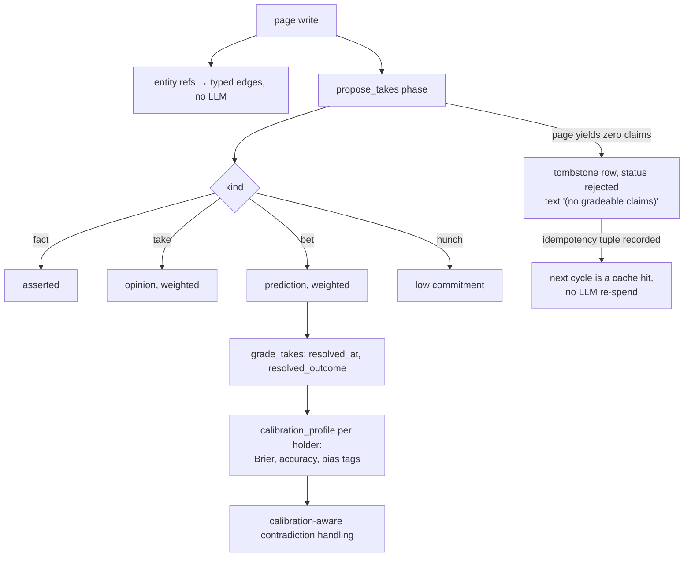

## 1. Executive Summary

GBrain is a knowledge layer for agents: it ingests pages from many sources,
extracts a typed entity graph with no LLM call, and synthesises cited answers
with an explicit statement of what it does not know. MIT, roughly 564,000 lines
of TypeScript including tests, over Postgres or PGLite with pgvector.

The README carries scale claims about the author's own deployment and a
benchmark result. This report takes neither as evidence about the mechanisms —
the atlas judges code — and both are recorded in section 10 with what can and
cannot be checked at this commit.

**The mechanism that earns the report is the `takes` table.** A claim extracted
from a page is typed by *epistemic commitment*:

```sql
kind TEXT NOT NULL CHECK (kind IN ('fact','take','bet','hunch'))
```

with a `holder` (whose claim it is), a `weight` in `[0,1]` (how strongly held),
`since_date` and `until_date`, `superseded_by`, `active`, and — the important
four columns — `resolved_at`, `resolved_outcome BOOLEAN`, `resolved_value` and
`resolved_source`.

A `bet` is a prediction with a stated confidence. Resolving it writes whether it
came true. `cycle/calibration-profile.ts` then "aggregates the resolved takes
subset into a calibration profile per holder", producing a **Brier score**,
accuracy, a partial rate, per-domain breakdowns, and short kebab-case **bias
tags** such as `over-confident-geography`.

Those tags are not decoration. The module says they are "used by E3
(calibration-aware contradictions) and E7 (real-time nudges)" — so when two
claims conflict, how much each holder's confidence is worth is a measured
quantity that feeds the resolution.

This is the second system in this atlas to score its writers by outcome rather
than by origin, and it reaches it from the opposite direction:
[Recall](../recall-substrate/) scores an actor by whether their writes were later
contradicted; GBrain scores a person by whether their bets resolved true.

**The second thing worth lifting is the destructive guard**, whose header states
the principle better than most security documentation: "the blast radius should
be visible BEFORE you pull the trigger, and recoverable AFTER you pull it (within
a grace period)". Three layers — an impact preview counting pages, chunks,
embeddings and files; a confirmation gate requiring `--confirm-destructive` or an
interactive "type the source name"; and a 72-hour soft-delete tombstone before
permanent deletion.

## 2. Mental Model

Pages come in from sources. Every page write extracts entity references and
creates typed edges — `attended`, `works_at`, `invested_in`, `founded`,
`advises` — with, per the README, zero LLM calls. That graph is what lets a query
like "who works at Acme AI" resolve at all.

Above the graph sits the claim layer. The cycle proposes takes from pages,
grades the ones old enough to resolve, and folds the results into calibration
profiles. Retrieval synthesises across pages, people and companies and states its
own gaps.



The tombstone branch is a negative-result cache, and its comment explains the
bug it fixes: without it "the idempotency tuple is never recorded, so every cycle
re-spends an LLM call on unchanged zero-claim prose — the 'unchanged page never
re-spends tokens' contract only held for pages that produced >=1 claim." It is
inserted with `status='rejected'` specifically "so no pending-review query
surfaces it as a live proposal; its only job is to make the next cycle a cache
hit."

## 3. Architecture

Postgres in production, PGLite for local and test, behind two engine
implementations with the same interface — and the scope logic is duplicated
across both (`postgres-engine.ts` and `pglite-engine.ts` each carry the
`since`/`until` clause construction), which is the maintenance cost of that
choice.

The cycle is a phase pipeline under `src/core/cycle/` with budget metering:
`extract-atoms`, `extract-facts`, `propose-takes`, `grade-takes`,
`calibration-profile`, `consolidate`, `enrich-thin`, `drift`, `anomaly`,
`auto-think`, `emotional-weight` and more. Phases are individually budget-capped,
and `calibration-profile` handles the partial case explicitly: when grading
aborts on a budget cap, the profile is still written but tagged with
`grade_completion` — "fraction of eligible-and-old-enough takes the grade phase
processed" — and the dashboard shows a "60% graded" badge below 0.9.

Recording that a derived score was computed from incomplete input, and surfacing
it, is a discipline this atlas asks for repeatedly and rarely sees.

## 4. Essential Implementation Paths

**Read scope** — `sourceScopeOpts(ctx)` produces `{sourceId?, sourceIds?}` from
the caller's grant, spread into every engine read
(`src/core/engine.ts:311`, `:840`, `:1197`, `:1391`).

**Claim extraction** — `cycle/propose-takes.ts`, with the tuned extractor prompt
"validated against the hand-labeled synthetic corpus at
`test/fixtures/calibration/`" and a stated training F1 of 0.952 against a 0.85
target.

**Calibration** — `cycle/calibration-profile.ts` → `TakesScorecard` (Brier,
accuracy, partial rate, per-domain) → bias tags → `calibration/cross-brain.ts`
for resolution across mounted brains.

**Destruction** — `core/destructive-guard.ts`: `DestructiveImpact` preview →
confirmation → `SoftDeletedSource` with `deletedAt`/`expiresAt`.

## 5. Memory Data Model

`takes` is the table that carries the design, and the column list is the
argument: `claim`, `kind`, `holder`, `weight`, `since_date`, `until_date`,
`source`, `superseded_by`, `active`, `resolved_at`, `resolved_outcome`,
`resolved_value`, `resolved_unit`, `resolved_source`, `resolved_by`, plus an
embedding.

Four things are worth naming:

- **The kind vocabulary is an ordering.** `fact` → `take` → `bet` → `hunch`
  descends in commitment, and only `bet` is resolvable. Separating "what someone
  asserts" from "what someone predicts" is what makes calibration possible at
  all.
- **`resolved_by` and `resolved_source`** record who or what closed the bet,
  so a calibration score traces to its evidence.
- **Partial indexes on `WHERE active`** for kind, holder and weight — the read
  path always carries `active`, and the indexes match.
- **`superseded_by` plus `active`** rather than a delete.

The asymmetry to flag: `since_date` and `until_date` are both stored and both
written on insert, and the range query filters only the first. Both engines
build `AND since_date >= $since` and `AND since_date <= $until` — the `until`
bound is applied to the *start* column. So a take whose `until_date` has passed
is not excluded by that query, and a caller asking for a window gets claims that
*began* in it rather than claims that were *true* during it. That is why this
report does not carry `bitemporal`: the column pair exists and the read uses one
end of it.

## 6. Retrieval Mechanics

Vector search over pgvector plus lexical matching, with typed graph traversal,
synthesised into prose with citations and an explicit gap statement — the README
calls the gap analysis "the part that changes how you use the brain", and it is
the right emphasis: a synthesis layer that will not say what it does not know is
the difference between an answer and a confabulation.

**Scope is a read grant and it is enforced at every entry point.**
`allowedSources` arrives from the MCP context, `sourceScopeOpts(ctx)` normalises
it to a scalar or an array, and the engine handles both forms — the comment at
`engine.ts:1216` notes this is "so federated `allowedSources` reads don't leak
cross-source counts". Writes are deliberately narrower: "`allowedSources` is a
read grant; writes route to one source."

`cross-brain.ts` extends this across mounted brains with a four-rule contract, of
which rule 4 is the interesting one: **subagent prohibition** — when
`canReadMounts` is false the query "short-circuits to local-only" rather than
falling back. An untrusted context cannot reach another brain, and the check is
before the resolver rather than inside it.

## 7. Write Mechanics

Writes go through the cycle, which is budget-metered per phase, so ingestion is
asynchronous and bounded.

Correction is `superseded_by` plus `active = false`, with no rejected-value
record. The one place something is keyed on content is the empty-extraction
tombstone, and that is an idempotency cache for a *page*, not a refusal record
for a *claim* — its own test file exists to guard "the tombstone against
permanently memoizing a transient parse [failure]", which is precisely the risk
of using a negative cache this way.

Destruction is the strongest part, described in section 1. Three layers, with the
72-hour window making the second layer recoverable rather than final.

## 8. Agent Integration

MCP for Claude Code and Codex, a CLI, cron scheduling, mounts for reading other
brains, and an autonomous agent loop. Per-login scoping is presented as the
company-brain shape.

## 9. Reliability, Safety, and Trust

**Scope — awarded**, for the read-grant threading in section 6 plus the mount
rules.

**Negative eval — awarded.** `test/operations-fuzzy-source-scope.test.ts` "seeds
the same slug under two `source_ids`, runs the fuzzy resolver under each
context, and asserts the right candidates surface" — a boundary case in the
atlas's sense, and one written against a specific real bug: the fuzzy resolver
was unscoped, so "the candidate slug leaks via the `ambiguous_slug` error
envelope" even though the subsequent load was scoped. A leak through an *error
message* is exactly the kind of path a boundary test exists to catch.

**Trust state — withheld.** `kind` is a commitment vocabulary, not a
verification state, and the calibration profile attaches to a *holder* rather
than to a claim. What GBrain has is a trust model without a trust state, which is
a defensible split.

**Bitemporal — withheld**, for the `until_date` asymmetry in section 5.

**Audit log — no.** The cycle records phase runs and budgets; there is no
append-only record of memory mutations.

**Human review — no.** `pending-review` is referenced as a query the tombstone
avoids surfacing on, and no adjudication surface for it was found in the tree.

**One CI guard worth copying.** `scripts/check-source-config-leak.sh` greps for
code paths that could serialise a source config containing a webhook secret
without redaction, and states its own tradeoff: "Failure mode is loose-positive
on purpose — false positives cost one 30-second comment-or-fix; false negatives
leak production secrets." Choosing the direction of a check's error, and writing
down why, is the right way to argue for a noisy guard.

## 10. Tests, Evals, and Benchmarks

**No paper.** 1,005 test files under `test/`, plus a fuzz directory with pure,
filesystem and mixed validator suites, a regressions folder, and CI guard
scripts.

Two evaluation claims appear in the README and neither is checkable here. The
BrainBench scorecards — P@5 49.1%, R@5 97.9% on a 240-page corpus, with +31.4
points P@5 over a graph-disabled variant — "live in the sibling `gbrain-evals`
repo". The extractor's F1 of 0.952 is stated in a code comment as "measured…via
gbrain-evals cat15", against a hand-labeled corpus that *is* committed here
(`test/fixtures/calibration/`).

The comparison structure of the first claim is the good part: measuring against
a *graph-disabled variant of itself* isolates the contribution of the mechanism
rather than comparing to an unrelated baseline. That the numbers live elsewhere
is the third instance of this pattern in this batch, and the consequence is the
same — a reader at this commit cannot verify them.

The deployment scale in the README — page, person and company counts, cron jobs —
is a claim about one installation. This atlas does not treat scale or authorship
as evidence about a mechanism, and neither figure influenced any judgement here.

**I ran nothing**; the tree was read.

## 11. For Your Own Build

### Steal

- **Type claims by commitment and make one type resolvable.**
  `fact | take | bet | hunch` with `resolved_outcome` on the bet is what turns a
  memory store into something that can measure whose confidence to trust.
- **Score the holder, not the source.** A Brier score plus bias tags per person,
  computed from resolved predictions and consumed by contradiction handling.
- **Record when a derived score was computed from partial input.**
  `grade_completion` plus a dashboard badge below 0.9 means a calibration profile
  never silently reports on half the data.
- **Preview the blast radius, gate it, and make it recoverable.** Impact counts,
  a typed confirmation, and a 72-hour tombstone. The header's principle is worth
  copying verbatim into your own design docs.
- **Cache the negative extraction result.** A page that yields nothing must
  record that it yielded nothing, or every cycle pays for it again — and insert
  it with a status that keeps it out of review queues.
- **Short-circuit an untrusted context before the resolver.** Rule 4's
  `canReadMounts=false → null` is a check in the right place.
- **Handle scalar and array grants in the same query path.** The comment names
  the failure it prevents: cross-source count leakage.
- **Write down which way your CI guard should fail.** "False positives cost 30
  seconds; false negatives leak production secrets" settles every future argument
  about the check's noise.
- **Test a leak through the error envelope, not just the result.** The scope bug
  here was visible as a 404 and dangerous as a leaked slug in an error message.

### Avoid

- **Do not store a validity interval and query one end of it.** `until_date` is
  written on every insert and the range filter compares `since_date` twice.
- **Do not duplicate scope logic across two engine implementations.** Postgres
  and PGLite each build the clause; a fix has to land twice.
- **Do not let a negative cache memoize a transient failure.** The project has a
  test guarding exactly this, which is the right response and also an admission
  that the risk is live.
- **Do not read a benchmark that lives in another repository as verified.**

### Fit

This suits someone who wants a knowledge layer over their whole working life —
mail, meetings, documents, people — rather than over a codebase, and who can run
Postgres and a lot of cron. The per-login scoping is real enough to consider for
a small team.

At 564,000 lines with sixty-plus cycle phases and two engine implementations, it
is a product rather than a component. `takes` and `calibration-profile.ts` are
the parts to read — a table definition and one phase, and between them the
clearest implementation in this atlas of memory that knows whose judgement to
discount.

## 12. Open Questions

- **Is the `until_date` asymmetry deliberate?** Both engines implement it the
  same way, which reads as a decision or a copied bug; nothing in the comments
  says which.
- **What resolves a bet?** `resolved_by` and `resolved_source` are recorded;
  whether resolution is manual, cron-driven or model-driven was not traced, and
  it determines what the Brier score means.
- **Where is the pending-review queue?** The tombstone is explicitly kept out of
  one; no surface that reads it was found.
- **Do bias tags change ranking, or only contradiction handling?** The comment
  names E3 and E7 as consumers; whether a badly-calibrated holder's claims rank
  lower generally is unclear.

## Appendix: File Index

**Claims and calibration** — `src/core/migrate.ts:1229-1258` (the `takes`
table), `src/core/cycle/propose-takes.ts` (the empty-extraction tombstone
`:60-67`, the tuned prompt `:69-78`), `src/core/cycle/calibration-profile.ts`,
`src/core/calibration/cross-brain.ts` (the four-rule contract, rule 4 at `:102`),
`src/core/takes-fence.ts`

**Destruction** — `src/core/destructive-guard.ts` (the three layers `:1-14`)

**Scope** — `src/core/engine.ts:311`, `:840`, `:1197-1216`, `:1391-1415`,
`src/core/postgres-engine.ts:5274`, `src/core/pglite-engine.ts:5371`,
`test/operations-fuzzy-source-scope.test.ts`,
`scripts/check-source-config-leak.sh`, `scripts/check-fuzz-purity.sh`

**Cycle** — `src/core/cycle/` (`extract-atoms.ts`, `extract-facts.ts`,
`grade-takes`, `consolidate.ts`, `drift.ts`, `anomaly.ts`, `auto-think.ts`,
`emotional-weight.ts`, `budget-meter.ts`, `enrich-thin.ts`)

**Tests** — `test/` (1,005 files), `test/fuzz/`, `test/fixtures/calibration/`

**Not in this tree** — BrainBench scorecards live at `garrytan/gbrain-evals`

## History

**2026-08-09** — [`f15480b9d04b342d8d261fb4e8a6784bd9478be3`](https://github.com/garrytan/gbrain/commit/f15480b9d04b342d8d261fb4e8a6784bd9478be3) — first reading. Screened before reading; the tree was read, never installed, and no test or benchmark was run.
