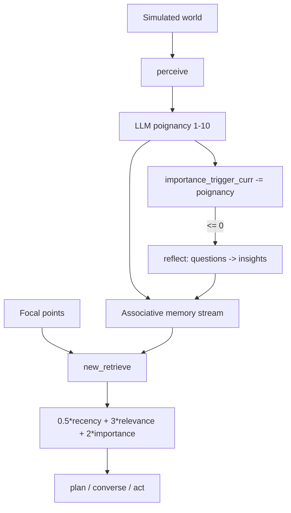

## 1. Executive Summary

Generative Agents (Park et al., 2023) is the Stanford "Smallville" simulation of twenty-five agents living in a small town. Its last commit is **August 2023**; this is a historical review of a frozen research artifact, and nothing here is a recommendation to deploy it.

It belongs in the atlas because it is the **ancestor**. The observation → reflection → planning loop, and the retrieval score that weighs *importance × recency × relevance*, are the design most subsequent agent memory work either adopted, refined, or reacted against. Reading the actual implementation is more useful than reading the citations, for two reasons.

**The famous formula has hand-tuned magic numbers, and the code says so.** The retrieval score is a weighted sum of three normalized components, multiplied by a hardcoded gain vector:

```python
# gw = [1, 1, 1]
# gw = [1, 2, 1]
gw = [0.5, 3, 2]
master_out[key] = (persona.scratch.recency_w   * recency_out[key]   * gw[0]
                 + persona.scratch.relevance_w * relevance_out[key] * gw[1]
                 + persona.scratch.importance_w* importance_out[key]* gw[2])
```

Two earlier settings are left commented out. Relevance is weighted six times recency. There is no ablation in the repository justifying any of it. The formula that launched a hundred memory systems is a tuned heuristic, and treating it as a principled result is a mistake the atlas should name plainly.

**Recency decays by position, not by time** — and it decays in the wrong direction. Three lines of `new_retrieve` settle it:

```python
nodes = [[i.last_accessed, i] for i in persona.a_mem.seq_event + persona.a_mem.seq_thought
         if "idle" not in i.embedding_key]
nodes = sorted(nodes, key=lambda x: x[0])          # ascending: least recently accessed first
...
recency_vals = [persona.scratch.recency_decay ** i for i in range(1, len(nodes) + 1)]
```

The list is sorted **ascending** by `last_accessed`, so its first element is the *least* recently accessed node — and `extract_recency` gives that element the exponent 1, which with `recency_decay = 0.99` is the largest value in the series. `normalize_dict_floats` then maps the series monotonically onto `[0, 1]`, so over a hundred nodes the oldest normalizes to 1.0 and the newest to 0.0. The term named `recency` rewards the memory that has gone longest without being touched. A `reverse=True` on that sort is the whole fix; the comment above the sort says *"sorting them by the datetime of creation"* while the key is `last_accessed`, which is the other small slip in the same three lines.

Checked rather than reasoned about: both functions were reimplemented from the source — the exponent series and the min-max normalizer — over a hundred nodes, which puts the least recently accessed at a normalized 1.0 and the most recently accessed at 0.0. Nothing in the repository was executed to establish it.

The effect is bounded rather than catastrophic, and that is probably why it was never noticed: `gw[0]` is 0.5 against relevance at 3 and importance at 2, so the inverted term can contribute at most 0.5 of a possible 5.5 — under a tenth of the score. The simulation still behaves plausibly because relevance dominates.

The positional part matters separately: the exponent is an *index*, so a hundred events in an hour decay exactly as much as a hundred events across a month. In a simulation with a fixed tick rate that is nearly equivalent to time decay; in a real assistant with bursty usage it is not. Later systems that adopted "recency" mostly switched to wall-clock half-lives — [Redis Agent Memory Server](../redis-agent-memory-server/) uses dual half-lives on access and creation, [OpenViking](../openviking/) a seven-day half-life — and this is where that divergence starts.

The genuinely elegant mechanism, and the one least copied, is the **reflection trigger**: a countdown seeded with `importance_trigger_max` is decremented by the poignancy of each new memory, and reflection fires when it crosses zero. Consolidation is scheduled by *accumulated significance* rather than by token count, message count, or a timer.

## 2. Mental Model

One associative memory stream holds three node types with identical structure:

```python
ConceptNode(
    node_id, node_count, type_count,
    type,            # "event" | "thought" | "chat"
    created, expiration,
    subject, predicate, object,
    description, embedding_key,
    poignancy,       # LLM-assigned importance, 1-10
    keywords, filling
)

seq_event = []    # observations from the world
seq_thought = []  # reflections, derived from retrieved memories
seq_chat = []     # dialogue
```

Note what follows from that uniformity: a **reflection is stored exactly like an observation**, carries its own poignancy, and competes in the same retrieval pool. Derived belief and raw evidence are one stream. Reflections can themselves be retrieved as input to later reflections, so the structure is recursive.

The atlas's [evidence before belief](../../patterns/evidence-before-belief/) pattern is essentially a response to this design. Generative Agents keeps the original observation nodes — they are never deleted — but nothing marks a thought as derived at retrieval time, so a chain of reflections can drift from its evidence with no visible boundary.

Retrieval:

```text
focal_points (what the agent is attending to)
-> gather nodes chronologically
-> recency   = recency_decay ** chronological_index   # index 1 is the OLDEST node
-> importance= node.poignancy (assigned once, at write time, by an LLM)
-> relevance = cos_sim(embedding(focal_pt), node embedding)
-> normalize each to [0,1]
-> weighted sum with gw = [0.5, 3, 2]
-> top n_count (default 30)
```

Reflection:

```text
each new memory decrements importance_trigger_curr by its poignancy
-> when importance_trigger_curr <= 0:
     retrieve recent salient memories
     -> LLM: what are the 3 most salient high-level questions?
     -> for each: retrieve evidence, LLM: infer 5 insights with citations
     -> store each insight as a "thought" node with its own poignancy
   reset importance_trigger_curr = importance_trigger_max
```

## 3. Architecture

About 11,000 lines under `reverie/backend_server/`:

- `persona/memory_structures/associative_memory.py` (360) — the memory stream: `ConceptNode`, `add_event`, `add_thought`, `add_chat`.
- `persona/memory_structures/scratch.py` (637) — short-term state, including the retrieval weights, `recency_decay`, and `importance_trigger_curr/max`.
- `persona/memory_structures/spatial_memory.py` — the agent's learned world tree.
- `persona/cognitive_modules/retrieve.py` — `extract_recency`, `extract_importance`, `extract_relevance`, `new_retrieve`.
- `persona/cognitive_modules/reflect.py` — `reflection_trigger`, `run_reflect`, poignancy scoring.
- `persona/cognitive_modules/plan.py` (1,053) — planning and decomposition.
- `persona/prompt_template/run_gpt_prompt.py` (2,930) — every prompt, including poignancy scoring.



There are three memory structures, not one: the associative stream, `scratch` (short-term working state), and `spatial_memory` (a tree of known locations). The spatial component is quietly interesting — a separate, structured, non-textual memory of *where things are*, learned by exploration — and it has almost no descendants in this atlas.

## 4. Essential Implementation Paths

### Poignancy as importance (`reflect.py`, `run_gpt_prompt.py`)

Every event, thought, and chat is scored 1–10 by an LLM prompt (`run_gpt_prompt_event_poignancy`, `run_gpt_prompt_chat_poignancy`) at write time. That score is then **fixed forever**: it drives retrieval ranking and the reflection countdown, and nothing ever revises it in light of what the memory turned out to be worth.

This is the ancestor of every importance/salience field in later systems, and it inherits the same weakness the atlas flags repeatedly: a model's one-shot judgment becomes durable structure with no feedback path. Unlike [Holographic](../holographic/)'s trust score, at least it is never *degraded* by usage signals — it simply never changes.

### The retrieval score (`new_retrieve`)

Each component is normalized to [0,1] independently before weighting, which matters: it means the three signals are comparable but their *distributions* are flattened, so a memory that is overwhelmingly the most relevant loses that margin after normalization.

Normalization plus hand-tuned gains plus per-persona weights (`persona.scratch.recency_w` etc.) means three layers of tunable constants stacked on each other, with debug prints left in the loop. This is research code that worked, not a calibrated ranker.

### The reflection trigger (`reflection_trigger`)

```python
if (persona.scratch.importance_trigger_curr <= 0 and ...):
```

Firing consolidation on accumulated importance is the design's best idea. A quiet day produces no reflection; an eventful hour produces several. Compare [Mastra](../mastra-observational-memory/), which triggers on token thresholds, or [claude-mem](../claude-mem/), which triggers on lifecycle hooks — both are proxies for "enough has happened", while this measures it directly.

Its flaw is the same as poignancy's: the budget is spent in units of a model's one-shot importance judgment, so a session of overrated trivia triggers reflection as readily as a genuinely significant one.

### Reflection with citations (`run_reflect`)

The reflection prompt asks for insights *with references to the evidence nodes that support them*, and the resulting thought node's `filling` holds those references. This is provenance — derived belief pointing back at supporting memories — and it predates most of the atlas's provenance machinery.

What it lacks is any downstream use: nothing validates that a cited node supports the insight, nothing recomputes an insight when its evidence is superseded, and retrieval does not prefer or distinguish evidence-backed thoughts. The link is recorded and then ignored.

## 5. Memory Data Model

Storage is JSON files per persona under a simulation checkpoint — no database, no index beyond an in-memory embedding dictionary. Retrieval walks the node list.

Present and worth noting: `created` and `expiration` timestamps, subject/predicate/object triples alongside free text, keywords, and `filling` for evidence references.

**`expiration` is written on every thought and compared to nothing.** Six sites set it to `persona.scratch.curr_time + datetime.timedelta(days=30)` — in planning, in three reflection paths and in two conversation paths — and its only readers are truthiness checks in the save and load functions (`associative_memory.py:80`, `:126`). No retrieval, no reflection and no tick compares it to the clock, so every derived thought carries a thirty-day validity that nothing in the repository enforces. That is the field a later system would need in order to expire a reflection, present and inert at the origin.

**`filling` serves two purposes and only one of them is read.** On a chat node it holds the utterance rows, and two live callers replay them — `run_gpt_prompt_create_conversation` inserts a prior conversation verbatim into a prompt, and `get_str_seq_chats` renders them. On a thought node it holds the ids of the nodes the reflection was derived from, and nothing anywhere reads it: a grep for a reader of a thought's `filling` returns nothing. The citation trail exists, is persisted, and is never consulted — which is the precise version of this report's earlier, broader claim that citations are never used.

Absent: scope of any kind beyond one persona's directory, trust or verification state, correction or supersession, deletion, and any distinction at retrieval time between an observation and a thought derived from thoughts derived from observations.

## 6. Retrieval Mechanics

Vector similarity plus two non-semantic signals, computed over the full node list per query. No lexical arm, no metadata filtering, no index — which is fine for a few thousand nodes per agent over a simulated week, and is the reason this design does not survive contact with a real corpus without replacement.

`n_count` defaults to 30, and there is no token budget: the retrieved descriptions go into prompts and their combined length is whatever thirty memories happen to be.

## 7. Write Mechanics

Perception writes events; conversation writes chats; reflection writes thoughts. All three go through `add_event` / `add_chat` / `add_thought` with the same signature, and all three prepend to their sequence (`self.seq_event[0:0] = [node]`), so the stored sequences are newest-first.

**That storage order does not reach the scoring path,** which is a correction to this report's earlier reading. `new_retrieve` concatenates the two sequences and re-sorts them ascending by `last_accessed` before computing any component, so the newest-first storage order is discarded and the recency exponent is assigned over the ascending list. The only other retrieval function, `retrieve()`, does no scoring at all — it looks up events and thoughts by exact subject/predicate/object through `retrieve_relevant_events` and `retrieve_relevant_thoughts`. So there is exactly one scored path, and the order it scores over is its own.

There is no gate anywhere. Anything perceived is stored, and anything the reflection prompt returns is stored as a durable thought.

## 8. Agent Integration

None — this is a simulation with a Django frontend, not a library. The memory modules are tightly coupled to `Persona`, `Maze`, and the tick loop. Nobody should mount this; the value is entirely in reading it.

## 9. Reliability, Safety, and Trust

Understood as a 2023 research artifact rather than a system:

Strengths:

- A single uniform memory stream that is genuinely simple to reason about.
- Importance-triggered consolidation.
- Reflections that cite their supporting evidence.
- Original observations are never deleted or overwritten by reflections.
- A separate structured spatial memory, distinct from the text stream.

Gaps, all of which later systems in the atlas exist to address:

- Hand-tuned ranking constants presented (downstream) as a principled formula.
- Position-based rather than time-based recency decay, **assigned over an ascending sort**, so the term scores the least recently accessed node highest. Bounded by the smallest of the three weights.
- One-shot LLM importance that is never revised.
- Derived thoughts indistinguishable from observations at retrieval time, and recursively derivable.
- No scope, correction, verification, or deletion.
- Full-scan retrieval with no index.
- No token budget on injected context.

## 10. Tests, Evals, and Benchmarks

No test suite for the memory modules, and the one file in the backend named `test.py` is not one: its own docstring reads *"File: gpt_structure.py"* and its 76 lines are a copy of the OpenAI wrapper functions.

The paper's evaluation is human believability ratings of agent behaviour plus ablations of the observation/reflection/planning components — which measure whether the *simulation* is convincing, not whether retrieval surfaces the right memory. There is no retrieval-precision measurement anywhere in the repository, and the `gw` constants have no committed ablation.

**This is the cost of that, stated concretely.** The recency inversion in section 1 is a sign error that one assertion would catch: build two nodes, touch one, and assert that the touched one scores higher on the recency component. No such assertion exists, the term has the smallest of the three weights, and the output of the whole system is a simulation judged by humans for plausibility — three conditions under which a wrong sign is invisible. The atlas's recurring lesson about suites that assert outcomes rather than mechanisms has its origin here too.

Unchanged since August 2023: the pin is still the tip of `main` and the last commit is dated 11 August 2023.

## 11. For Your Own Build

### Steal

- **Trigger consolidation on accumulated significance**, not on a timer or a token count. Still the most elegant scheduling signal in the atlas.
- **Multi-signal retrieval** combining semantic relevance with non-semantic priors — the shape is right even though these particular weights are not.
- **Ask reflections to cite their evidence.** Then, unlike here, actually use the citations.
- **Keep a separate structured memory for spatial or relational world state** rather than forcing everything into one text stream.
- **Store derived insights as first-class memories** so they can compound — provided you also mark them as derived.

### Avoid

- **Magic constants inherited as doctrine.** `gw = [0.5, 3, 2]` has been reimplemented far more often than it has been re-derived.
- **Positional recency decay** misread as time decay — and a decay series whose direction nothing checks. A single test asserting that the most recent of two nodes scores higher on the recency component would have caught the inversion, and there is no test suite at all.
- **Importance frozen at write time.**
- **Derived and observed memory in one undifferentiated pool**, with recursive derivation and no drift boundary.
- **Provenance recorded but unused.**
- **Unbounded, unindexed retrieval.**

### Fit

Borrow:

- The importance-triggered reflection schedule.
- The three-signal retrieval *structure* — then calibrate the weights on your own data, and use a wall-clock half-life for recency.
- Evidence citations on derived memories, wired to something that checks them.

Do not copy:

- The weights.
- Positional decay.
- A single pool for evidence and inference.
- Anything operational; this is a simulation frozen in 2023, and every production concern — scope, correction, deletion, indexing — is absent by design.

## 12. Open Questions

- Where did `gw = [0.5, 3, 2]` come from, and how much does it matter? Nothing in the repository answers this, and it is the most-copied number in agent memory.
- Should importance be revisable — raised when a memory proves useful, lowered when it never is?
- How far can a reflection-of-reflections chain drift before the citation trail stops meaning anything?
- Is importance-triggered consolidation robust when poignancy is systematically miscalibrated?
- Does spatial memory deserve revival? Almost nothing in the atlas keeps structured non-textual world state.

## Appendix: File Index

- Memory stream: `reverie/backend_server/persona/memory_structures/associative_memory.py` — `ConceptNode`, `add_event()`, `add_thought()`, `add_chat()`.
- Short-term state and weights: `persona/memory_structures/scratch.py` — `recency_decay`, `recency_w`, `relevance_w`, `importance_w`, `importance_trigger_curr/max`.
- Spatial memory: `persona/memory_structures/spatial_memory.py`.
- Retrieval: `persona/cognitive_modules/retrieve.py` — `extract_recency()`, `extract_importance()`, `extract_relevance()`, `new_retrieve()`.
- Reflection: `persona/cognitive_modules/reflect.py` — `reflection_trigger()`, `run_reflect()`, `generate_poig_score()`.
- Planning: `persona/cognitive_modules/plan.py`.
- Prompts, including poignancy scoring: `persona/prompt_template/run_gpt_prompt.py`.

**Searches recorded for the negative claims** (run at this pin)

```sh
grep -rn "expiration" reverie --include="*.py" | grep -E "<|>|curr_time"
                            # six writes, all curr_time + 30 days; no comparison anywhere
grep -rn "filling" reverie/backend_server/persona --include="*.py" | grep -iE "thought"
                            # nothing: no reader of a thought's citation list
grep -rn "new_retrieve(\|retrieve(" reverie/backend_server --include="*.py"
                            # one scored path, new_retrieve, called from plan, reflect and
                            # converse; retrieve() does exact-triple lookup and no scoring
find . -iname "*test*"      # reverie/backend_server/test.py, whose docstring names
                            # gpt_structure.py and whose body is API wrappers
git rev-list --count <pin>..HEAD   # 0 — still the tip of main, last commit 2023-08-11
```

## History

**2026-09-17** — [`fe05a71d3e4ed7d10bf68aa4eda6dd995ec070f4`](https://github.com/joonspk-research/generative_agents/commit/fe05a71d3e4ed7d10bf68aa4eda6dd995ec070f4) — re-read at the same commit, which is still the tip of `main`; the repository's last commit is 11 August 2023, so nothing upstream could have changed and this reading audited the first one against the code. Screened again: no auto-run surface, nothing inside the seven-day cooldown; nothing was installed and nothing was run. Apache-2.0, 11,174 lines of Python.

**The recency term is inverted, and this reading is where the atlas says so.** `new_retrieve` sorts the concatenated event and thought sequences *ascending* by `last_accessed`, and `extract_recency` then assigns `recency_decay ** i` with `i = 1` to the first element — so the least recently accessed node receives the largest value, and `normalize_dict_floats` carries that ordering onto `[0, 1]`, giving the oldest node 1.0 and the newest 0.0. A `reverse=True` on that sort is the entire fix, and the direction was confirmed by reimplementing the exponent series and the normalizer over a hundred nodes rather than by running anything in the tree. The effect is bounded because `gw[0]` is 0.5 against relevance at 3 and importance at 2 — under a tenth of the composite score — which is the most likely reason a sign error has stood in the most-copied retrieval formula in this field for three years, in a repository with no test that touches it.

**One of this report's own claims was wrong and is corrected.** Section 7 said the writers' newest-first prepend order was "the order the recency calculation depends on". It is not: the scored path re-sorts, so storage order never reaches scoring, and the only other retrieval function does exact subject/predicate/object lookup with no scoring at all. The error was in the direction that hid the inversion, because it implied the calculation saw a newest-first list.

**Two claims made precise.** `expiration` is written as `curr_time + 30 days` at six sites and compared to a clock nowhere: its only readers are truthiness checks in save and load, so every derived thought carries a validity window nothing enforces. And `filling` is read — but only on chat nodes, where two live callers replay the utterances into a prompt; a thought's `filling`, the reflection's citation list, has no reader anywhere in the tree. The previous phrasing, that citations are never used, was true of the half that matters and too broad as written.

Also recorded: the backend's one file named `test.py` is not a test — its docstring reads *"File: gpt_structure.py"* and its body is the OpenAI wrapper functions. Marks unchanged at none. `stack_retrieval` was empty and seeded; it is now `vector`, reviewed, with the appendix carrying the searches.

**2026-07-27** — [`fe05a71d3e4ed7d10bf68aa4eda6dd995ec070f4`](https://github.com/joonspk-research/generative_agents/commit/fe05a71d3e4ed7d10bf68aa4eda6dd995ec070f4) — first reading. Screened before reading; nothing was installed or run.
