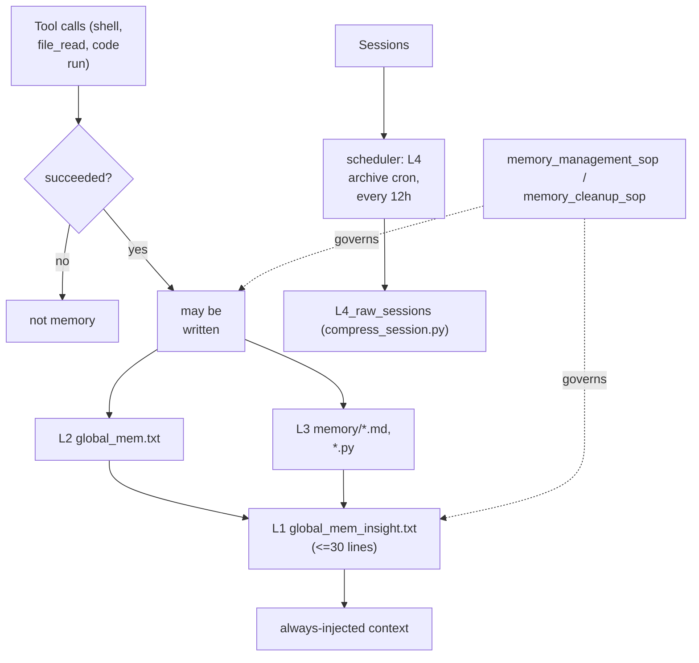

## 1. Executive Summary

GenericAgent is an MIT-licensed self-evolving agent framework — "~3K lines of seed code, 9 atomic tools, ~100-line agent loop" — with an accompanying technical report. Its memory is unlike anything else in this atlas in one specific way: **the memory system is written as policy, not implemented as a runtime.**

`memory/` contains no store, no index, and no retrieval engine. It contains Markdown standard operating procedures — `memory_management_sop.md`, `memory_cleanup_sop.md`, plus around thirty domain SOPs — that the agent reads and follows. The rules *are* the system, and they live in the same directory as the memory they govern. (The documents are written in Chinese; translations below are mine, with key terms given in the original.)

Two of those rules deserve to be read by anyone building memory, regardless of what they think of the approach.

**"No Execution, No Memory" (无行动，不记忆).** The first core axiom, *Action-Verified Only* (行动验证原则), states that anything written to durable memory must originate from a **successful tool call result** — a shell command that succeeded, a `file_read` that confirmed content exists, code that ran and passed. Explicitly forbidden: the model's inherent knowledge, inferential guesses, unexecuted plans, and unverified assumptions.

This is [Voyager](../voyager/)'s environment-verified write gate generalized from procedures to *facts*, and it is the strongest formulation of the principle in the atlas. Voyager can only verify things it can run; GenericAgent extends the same standard to any claim by requiring that a tool call, not a model, be the source.

**An explicit ROI model for prompt real estate.** The cleanup SOP builds on what it calls *existence encoding* (存在性编码): the LLM is already a compressor and decoder, so the always-injected top layer only needs to make it *aware that some class of knowledge exists* — it can fetch the detail itself with a tool call. Entries are then judged by:

```text
ROI = (probability of error without these words × cost of that error)
      ────────────────────────────────────────────────────────────────
                        per-turn word cost
```

Nothing else in this atlas states a cost model for what belongs in permanent context. It is the missing justification behind every hard budget elsewhere — [Hermes Agent](../hermes-agent/)'s 2,200 characters, [CowAgent](../cowagent/)'s ~30 entries — none of which explain *why* an entry earns its place.

The obvious limitation is the flip side of the design: none of this is enforced. Every axiom depends on the model honouring prose, with no runtime check that a written memory actually came from a successful tool call.

## 2. Mental Model

Four layers, navigated by pointers, with a hard cap at the top:

```text
L1: global_mem_insight.txt   minimal index — HARD LIMIT ≤ 30 lines, target < 1k tokens
      ↓ pointer
L2: global_mem.txt           fact base — currently short but expected to grow
      ↓ reference
L3: memory/                  record library — .md SOPs, .py helpers
L4: memory/L4_raw_sessions/  historical sessions, auto-collected by scheduler reflection
```

The layering resembles [TencentDB Agent Memory](../tencentdb-agent-memory/) and [OpenViking](../openviking/), but the discipline is different: L1 is capped in *lines*, and the fourth axiom — *Minimum Sufficient Pointer* (最小充分指针) — states that an upper layer keeps only the shortest identifier that locates the layer below. One extra word is redundancy.

The four core axioms, in the SOP's own priority order:

1. **Action-Verified Only** — only successful tool-call results may become memory. *No Execution, No Memory.*
2. **Sanctity of Verified Data** (神圣不可删改性) — verified configs, pitfall guides, and critical paths must never be discarded during refactoring or garbage collection. Text may be compressed and entries may migrate between layers, but accuracy and traceability must not be lost. The SOP adds an operational instruction: be extremely careful when modifying memory; prefer small patches over overwriting; *if you cannot modify it properly, better not to modify it at all.*
3. **No Volatile State** (禁止存储易变状态) — never store timestamps, session IDs, PIDs, specific absolute paths, or connected-device information.
4. **Minimum Sufficient Pointer** — shortest identifier only.

## 3. Architecture

- `memory/` — the memory itself and its governing SOPs: `memory_management_sop.md`, `memory_cleanup_sop.md`, plus domain SOPs (`autonomous_operation_sop.md`, `checklist_sop.md`, `code_review_principles.md`, `computer_use.md`, `plan_sop.md`, `review_sop.md`, `vision_sop.md`, `github_contribution_sop.md`, and others) and helper scripts (`checklist_helper.py`, `procmem_scanner.py`, `ocr_utils.py`, `ui_detect.py`).
- `memory/L4_raw_sessions/` — `compress_session.py` and `salient_mining_sop.md`.
- `reflect/` — `scheduler.py`, `autonomous.py`, `checklist_master.py`, `goal_mode.py`, `agent_team_worker.py`.
- `agent_loop.py`, `llmcore.py` — the ~100-line loop and model layer.



## 4. Essential Implementation Paths

### The write gate, as prose

The Action-Verified axiom is the entire write policy, and its enumeration of what is forbidden is more useful than most positive specifications: inherent model knowledge, inferential guesses, unexecuted plans, unverified assumptions. Those four categories are precisely what fills a memory store with confident nonsense, and naming them is a better guardrail than a vague instruction to "only save important things."

What is missing is the enforcement [Voyager](../voyager/) has. Voyager's gate is `if info["success"]` in the rollout loop — a machine check on an observed outcome. Here the same standard is a rule the model is asked to apply to itself, so compliance is a function of prompt adherence and cannot be audited after the fact: a written memory carries no record of the tool call that justified it.

### Existence encoding and the ROI test

The cleanup SOP's central claim is that the top layer does not need to *contain* knowledge, only to make the agent aware that knowledge exists, because the model can retrieve detail on demand. L1 therefore holds two things: existence pointers (the shortest trigger word for L2/L3 knowledge) and behaviour rules (mistakes the agent will make without a reminder).

The worked example is unusually good. `tmwebdriver_sop(httponly cookie)` earns its place because without the phrase "httponly cookie" you would not think to consult the tmwebdriver SOP when you need a cookie. The trigger is *counter-intuitive*, so it carries real information.

What the SOP says to delete is equally instructive:

- **Name translations** — `proxy-pool/(代理池)` becomes just `proxy-pool`; the gloss is dead words.
- **Content descriptions** — implementation detail belongs inside the SOP, not in the trigger.
- **Intuitive capabilities** — if the agent would think of it unprompted, the entry yields zero benefit and costs tokens every single turn.
- **Redundancy** — anything already covered by L3 or by another L1 line.

The third is the sharpest. Every always-injected memory is paid for on every turn forever, and an entry that merely restates something the model already does is a permanent tax with no return. That reframing — permanent context as a recurring cost, not a one-time write — is worth more than most retrieval optimizations.

The compression principles extend it: self-explanatory naming beats adding description (renaming an SOP often has higher ROI than editing L1), and related entries should collapse into one superordinate scenario name (`qq操作/飞书操作/企微操作` → `im操作:*_im_sop`) rather than being listed individually.

### Sanctity, as a structural-loss guard

The second axiom is the same concern [ByteRover](../byterover/) implements in code with `detectStructuralLoss`: a consolidation pass must not silently discard verified material. GenericAgent states it as an inviolable rule and adds a conservative operational default — prefer small patches, and decline to edit rather than risk an overwrite.

Stated as a rule it is weaker than a diff-and-repair check, but it targets exactly the right failure and is available to any system whose consolidation is performed by a model reading instructions.

### L4 archival

`reflect/scheduler.py` runs a **silent L4 archive cron every 12 hours**, invoking `compress_session.py` under `memory/L4_raw_sessions/`. `salient_mining_sop.md` governs what is worth extracting from archived sessions. Raw sessions are retained beneath the distilled layers, so evidence survives below belief — the [evidence before belief](../../patterns/evidence-before-belief/) shape, again expressed as directory structure plus policy.

## 5. Memory Data Model

There is no schema. L1 and L2 are text files, L3 is a directory of Markdown and Python, L4 is compressed session archives.

Consequences, several of which the SOPs address deliberately rather than by omission:

- **No status or verification field** — but the write gate is meant to ensure everything in the store is already verified, which is a different and quite defensible position. Its weakness is that an entry cannot later be *re-*verified or marked stale, and nothing distinguishes a claim verified two years ago from one verified today. Contrast [Magic Context](../magic-context/), which re-verifies when the underlying files change.
- **No provenance** — a memory does not record which tool call justified it, which is the natural audit record the Action-Verified axiom implies and does not produce.
- **No scope** — one agent, one memory tree.
- **Volatile state is excluded by rule**, which is a genuinely good instinct: absolute paths, PIDs, and timestamps are exactly the entries that rot fastest and mislead most confidently.
- **Layer migration is expected** — L2 entries may move to L3 as they age, with L1 keeping only pointers.

## 6. Retrieval Mechanics

No index, no embeddings, no ranking. Retrieval is the agent reading L1, recognizing a trigger, and issuing a tool call to open the relevant L3 file. Existence encoding is what makes this viable: the always-present layer is a table of contents, and the model performs its own lookup.

This is the cheapest retrieval architecture in the atlas and it scales exactly as far as L1's thirty lines can index. Its failure mode is precise — if a trigger word is missing or unintuitive, the knowledge below is unreachable, and nothing will report that it was never consulted.

## 7. Write Mechanics

Writes happen when the agent, following the management SOP, decides a verified result belongs in memory. There is no separate extraction pipeline, no background consolidation worker beyond the L4 archive cron, and no dedupe machinery. Cleanup is a task the agent performs against the cleanup SOP, applying the ROI test to L1 and the sanctity rule to everything else.

## 8. Agent Integration

Memory is internal to the framework rather than a plugin surface. The `reflect/` modules (`autonomous.py`, `goal_mode.py`, `checklist_master.py`, `scheduler.py`) drive the self-evolving behaviour, with domain SOPs supplying procedural competence — which makes most of L3 procedural memory in the sense of the [skills as procedural memory](../../patterns/skills-as-procedural-memory/) pattern, written in prose rather than code.

That comparison is the useful one. Voyager stores executable skills that can be verified by running them; GenericAgent stores natural-language SOPs that cannot be executed and therefore cannot be re-verified — but that generalize to domains where nothing is executable, and that a human can read and correct directly.

## 9. Reliability, Safety, and Trust

Strengths:

- **A stated, principled write gate** naming the four categories of unverified content to exclude.
- **A cost model for permanent context**, with a worked heuristic for what earns a place.
- **An explicit anti-loss rule** for consolidation, with a conservative default of not editing.
- **Volatile state excluded by policy** — the entries most likely to become confidently wrong.
- **Raw sessions retained** beneath the distilled layers, archived on a fixed schedule.
- **A hard, checkable cap** on the always-injected layer.
- **Memory policy that is human-readable and directly editable**, living alongside the memory it governs.

Gaps:

- **Nothing is enforced.** Every axiom is prose; a runtime that ignores the SOP violates none of it, and there is no post-hoc audit.
- **No provenance**, so the Action-Verified axiom leaves no trace and cannot be checked later.
- **No re-verification.** Verified-once is treated as verified-forever, which is the assumption Magic Context's whole design exists to reject.
- **No scope, no multi-user boundary.**
- **Unreachable knowledge is invisible** — a bad L1 trigger produces silence, not an error.
- **Documentation is Chinese-only**, which limits review by a large part of the potential audience.

## 10. Tests, Evals, and Benchmarks

No memory tests were located and no memory benchmark was found in this checkout; nothing was run for this review. The project cites an arXiv technical report, which was not retrieved or assessed here — the atlas's claims are limited to the code and SOPs at the pinned commit.

For a design whose correctness depends entirely on prompt adherence, the missing measurement is compliance: how often does material that never came from a successful tool call end up in memory anyway?

## 11. For Your Own Build

### Steal

- **"No Execution, No Memory."** Require durable claims to originate from a successful tool call, and name the excluded categories explicitly — inherent knowledge, guesses, unexecuted plans, unverified assumptions. Then, unlike here, record which call justified each write so the rule can be audited.
- **The ROI test for always-injected context.** `(error probability × cost) / per-turn word cost` is the missing justification behind every prompt budget in this atlas.
- **Existence encoding.** The permanent layer should say *what exists*, not *what is true*; the model retrieves detail on demand. This is the cheapest workable substitute for an index.
- **Delete intuitive entries.** Anything the model would do unprompted is a permanent tax with zero return — a sharper deletion criterion than staleness or low usage.
- **Self-explanatory naming over annotation.** Renaming the artifact often beats describing it in the index.
- **Exclude volatile state by rule**: timestamps, PIDs, session IDs, absolute paths.
- **"If you cannot modify it properly, better not to modify at all"** as a consolidation default.

### Avoid

- **Policy without enforcement or audit** — the central risk, and it applies to every axiom.
- **Verified-once treated as verified-forever.**
- **No record of the verification** the write gate requires.
- **Silent unreachability** when an index trigger is missing.
- **Single global scope.**

### Fit

Borrow:

- The four axioms, more or less verbatim, as the policy layer of any memory system — then implement the first one as a machine check and the second as a structural-loss diff.
- The ROI formula and the four deletion categories, as the criterion for what lives in permanent context.
- The existence-encoding framing for a top-layer index.
- The volatile-state exclusion list.

Do not copy:

- Prose as the only enforcement mechanism, if wrong memory is costly.
- Verified-once semantics without a re-verification path.
- A thirty-line index as the only retrieval mechanism past a modest corpus.

## 12. Open Questions

- Should each written memory record the tool call that justified it? The axiom implies the record; the system does not keep it.
- How is verified-once-verified-forever handled when the underlying reality changes?
- Is the ROI test ever applied with measured error probabilities, or is it a heuristic the agent estimates in the moment?
- What happens when L1's thirty lines cannot index the knowledge below — does the cap force loss, or does L2 absorb it?
- How much of the axiom set does a given model actually comply with, and is that measured anywhere?

## Appendix: File Index

- Memory policy: `memory/memory_management_sop.md` (four core axioms, layer architecture), `memory/memory_cleanup_sop.md` (existence encoding, ROI test, compression principles).
- Layers: `global_mem_insight.txt` (L1), `global_mem.txt` (L2), `memory/` (L3), `memory/L4_raw_sessions/` (L4).
- L4 tooling: `memory/L4_raw_sessions/compress_session.py`, `salient_mining_sop.md`.
- Archive scheduling: `reflect/scheduler.py` (12-hour L4 archive cron).
- Reflection and autonomy: `reflect/autonomous.py`, `goal_mode.py`, `checklist_master.py`, `agent_team_worker.py`.
- Domain SOPs and helpers: `memory/*.md`, `memory/*.py`.
- Agent loop: `agent_loop.py`, `llmcore.py`.
