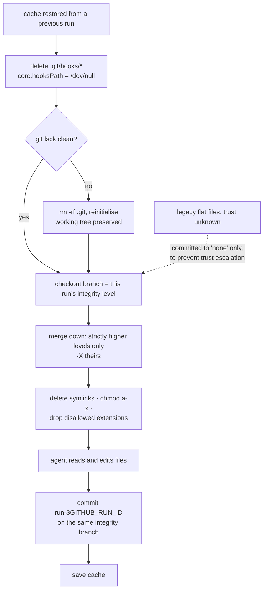

## 1. Executive Summary

`gh-aw` is GitHub's compiler for **agentic workflows**: a Markdown file with YAML
frontmatter in `.github/workflows/`, compiled by a Go binary into a `.lock.yml`
GitHub Actions workflow that runs a coding agent. It is on a token-cost list
because it meters per-run inference in "AI Credits" and can cap a run, and that
is not why it is in this atlas.

It is here because a workflow run is a session with unusually hard edges — a
fresh container, no filesystem, nothing carried forward — and `gh-aw` gives that
session three ways to remember things anyway. `cache-memory` puts a directory in
the GitHub Actions cache. `repo-memory` puts it on an orphan git branch.
`comment-memory` puts it in a managed issue or pull-request comment. All three
materialise as ordinary files under `/tmp/gh-aw/`, all three are edited by the
agent with the file tools it already has, and all three are synced back by a
post-agent step the agent never calls.

The genuinely interesting part is what happens at restore. `cache-memory` is not
a directory of files; it is a **git repository with one branch per trust level** —
`merged`, `approved`, `unapproved`, `none` — and a run checks out the branch
matching its own integrity level and then merges *down* from strictly higher
levels only. The comment in
[`setup_cache_memory_git.sh`](https://github.com/github/gh-aw/blob/c9dca3e29f33bfdc6f9e38ead9b66d0d6a89993d/actions/setup/sh/setup_cache_memory_git.sh)
states the rule directly: *"lower-integrity runs see higher-integrity data via
merge, but higher-integrity runs never see lower-integrity data."* A run
triggered by an unapproved fork PR can read what a merged run remembered and
cannot contaminate it. That is an information-flow lattice applied to agent
memory, and this atlas has very little of it.

The second interesting part follows from the first. Before the agent is allowed
near the restored tree, the same script deletes every non-sample file under
`.git/hooks`, points `core.hooksPath` at `/dev/null`, deletes every symlink,
strips the execute bit from every file, and — when `allowed-extensions` is
configured — deletes every file whose extension is not on the list. The threat
model is written down in
[ADR-26587](https://github.com/github/gh-aw/blob/c9dca3e29f33bfdc6f9e38ead9b66d0d6a89993d/docs/adr/26587-pre-agent-cache-memory-working-tree-sanitization.md):
*"A compromised prior run could therefore plant executable scripts … which the
next agent would encounter without any validation."* Memory is modelled as an
artifact written by an attacker who was you.

Where it is weakest is everything a memory system usually is. There is no
retrieval — the store is a directory and the agent greps it. There is no fact,
no extraction, no dedupe, no supersession, no contradiction handling and no way
to mark anything wrong. The integrity level is a property of the *run that
wrote* the file, never of the claim inside it, so nothing is ever promoted or
demoted on evidence. And the reading agent gets the whole directory, bounded
only by the 10GB repository cache limit.

## 2. Mental Model

A memory in `gh-aw` is **a file a previous run of this workflow left behind**.
Not a fact, not an embedding, not a summary — a byte sequence at a path, whose
meaning is entirely a convention between the workflow's Markdown prompt and
whatever the agent decides to write. The compiler validates size, count,
extension and glob. It never parses content.

So there is no belief lifecycle in the usual sense, and it is worth being precise
about what replaces it. A file's status is **where it lives**, and it has three
independent coordinates:

- **Which backend.** Cache memory is ephemeral by design (7-day Actions cache
  retention, 10GB per repository, LRU eviction). Repo memory is permanent and
  versioned. Comment memory is a single rendered document with one current value.
- **Which integrity branch**, for cache memory only: `merged` > `approved` >
  `unapproved` > `none`. This is assigned by the trigger, not by the content, and
  **nothing ever moves a file between branches**. There is no promotion path and
  no adjudication. The lattice governs who may *read* what, and that is all it
  does.
- **Whether it survived the gate.** A restored file with a disallowed extension,
  or a symlink, is deleted before the agent sees it. It was memory; now it is not,
  and nothing records that it was.

Death is by expiry, eviction, prefix-group pruning in the scheduled maintenance
workflow, or overwrite. Nothing is ever marked false. A wrong file stays wrong
until an agent happens to overwrite it, and the only record that it was ever
different is the git history of the store itself.

Control is **hybrid, tilted at the agent**. The agent writes freely with ordinary
file edits and never calls a memory tool; ADR-27479 chose that deliberately over
an explicit `comment_memory` safe output, on the grounds that an agent asked to
decide *when* to persist will forget. The human's control is exercised at compile
time, in frontmatter, through limits — and, for repo memory, afterwards, because
the store is a git branch a person can open a pull request against.



## 3. Architecture

`gh-aw` is a **compiler and a CLI**, not a runtime. `gh aw compile` reads a
Markdown workflow, resolves imports, and emits a `.lock.yml` GitHub Actions
workflow containing every step inline. There is no `gh-aw` process at run time:
what executes is GitHub Actions running generated YAML that shells out to scripts
vendored from `actions/setup/sh/`.

The memory subsystem is therefore **compile-time code that emits run-time steps**:

| Component | Where |
| --- | --- |
| Cache-memory config, key derivation, integrity-aware keys | `pkg/workflow/cache.go`, `pkg/workflow/cache_integrity.go` |
| Repo-memory config, validation, branch naming | `pkg/workflow/repo_memory.go`, `pkg/workflow/repo_memory_validation.go` |
| Repo-memory prompt section | `pkg/workflow/repo_memory_prompt.go` |
| Comment-memory safe-output config | `pkg/workflow/comment_memory.go` |
| Pre-agent restore, lattice and sanitisation | `actions/setup/sh/setup_cache_memory_git.sh` |
| Post-agent commit | `actions/setup/sh/commit_cache_memory_git.sh` |
| Store repair | `actions/setup/sh/check_cache_memory_git_integrity.sh` |
| Repo-memory clone and filename hygiene | `actions/setup/sh/clone_repo_memory_branch.sh`, `sanitize_repo_memory_filenames.sh` |

Persistence is entirely GitHub's: the Actions cache service, the git object
store, and the issues API. There is no database, no vector index and no search
service, because there is no search. Repo-memory commits go through the GraphQL
`createCommitOnBranch` mutation, which makes them **Verified** under GitHub's own
GPG key and lets them satisfy a ruleset that requires signed commits — with a
documented hole: the mutation cannot express symlinks, executable bits or
submodules, so an artifact containing one falls back to a plain `git push` that a
signed-commit ruleset will then reject.

### Deployment and ergonomics

Nothing to stand up, and nothing that runs locally. Adopting this means adopting
GitHub Actions, an agent engine with credentials configured as repository
secrets, and the `gh aw` extension for compiling and for reading logs. The cost
is a GitHub-shaped lock-in rather than an infrastructure one: every durable
surface here is a GitHub product, and the design has no meaning off the platform.

The store is as human-readable as it gets. Repo memory is a branch you can check
out; comment memory is a comment you can read in a browser; cache memory is a git
repository whose log is one commit per run, named `run-<GITHUB_RUN_ID>`. Repair
by hand is a `git push`.

## 4. Essential Implementation Paths

**Restore and read.** `generateCacheMemoryGitSetupStep` in
`pkg/workflow/cache.go` emits a step running
`actions/setup/sh/setup_cache_memory_git.sh` with `GH_AW_CACHE_DIR`,
`GH_AW_MIN_INTEGRITY` and — only when configured — `GH_AW_ALLOWED_EXTENSIONS` as
a colon-separated list. The script detects a cache hit by the presence of `.git`,
flattens a legacy nested layout, deletes hook files, runs `git fsck
--connectivity-only` and reinitialises on corruption while preserving the working
tree, checks out the integrity branch, merges down, then sanitises.

**Context assembly.** `buildRepoMemoryPromptSection` in
`pkg/workflow/repo_memory_prompt.go` returns a `PromptSection` pointing at a
template file, substituting `GH_AW_MEMORY_DIR`, `GH_AW_MEMORY_DESCRIPTION`,
`GH_AW_MEMORY_BRANCH_NAME` and a `**Constraints:**` block listing the allowed
globs and the size, count and patch-size caps. This is the whole of retrieval:
the agent is told a path and the rules, and goes looking. Comment memory differs
— ADR-27479 records that its content *is* injected into the prompt and into the
threat-detection context, so a small memory arrives read rather than referenced.

**Write and persist.** The agent edits files in the mounted directory with
whatever editing tools its engine has. Afterwards
`commit_cache_memory_git.sh` stages everything with `git add -A` and commits
`run-${GITHUB_RUN_ID}` on the current integrity branch with `--allow-empty`, so
the log has a row per run whether or not anything changed, then `git gc --auto`.
Repo memory instead validates against `file-glob`, `max-file-size`,
`max-file-count` and `max-patch-size`, and pushes only if threat detection passes;
a `push_repo_memory` safe-output tool exists so a workflow can fail on the limits
early rather than at the end.

**Update, delete, forget.** There is no delete path. Removing a file from the
working tree is picked up by `git add -A` and committed as a deletion; expiry is
the Actions cache's own 7-day retention and LRU; the scheduled *Agentic
Maintenance* workflow groups cache entries by key prefix (everything before the
run ID) and keeps only the newest per group.

**Scope enforcement.** Two layers. The integrity branch, above. And the cache key
itself: when `tools.github.min-integrity` is set, the key incorporates the
integrity level and a hash of the guard policy, so editing any policy field forces
a miss rather than silently reusing memory gathered under the old policy.

## 5. Memory Data Model

There is no schema. The unit is a file; the system's model of it is
`(path, size, extension)`.

Scoping is real and multi-axis, which is unusual for a system with no data model
at all:

- **Integrity level** — a git branch, read-down only.
- **Repository and branch** — Actions cache scoping is branch-local with fallback
  to the default branch, which the documentation calls out as a behaviour to plan
  around: on a non-default branch the first restore usually comes from the default
  branch, and later saves start a branch-local lineage.
- **Named store** — `id` selects `/tmp/gh-aw/cache-memory-{id}/` or
  `/tmp/gh-aw/repo-memory-{id}/`, and repo memory maps `id` to branch
  `{branch-prefix}/{id}`.
- **Target repository** — `target-repo` sends repo memory somewhere else entirely,
  which is the documented way to isolate memory from the repository being worked
  on.

Provenance is the git log of the store: one commit per run, named for the run ID,
on the branch of that run's integrity level. There are no temporal fields, no
validity interval, no version chain at the level of a claim, no TTL a user can
set, and no pinning. `cache-hit-history.json` is written on a hit with
`run_id`, `timestamp` and `cache_files` — a restore receipt, not a record of what
the memory says.

Nothing separates episodic from semantic material. The workflow author does that
by choosing filenames, or does not.

## 6. Retrieval Mechanics

**There is no retrieval mechanism, and that is a design position rather than an
omission.** The store is mounted as a directory and the agent uses its own
`Read`, `Grep` and `Glob`. No embedding is computed, no index is built, no
ranking, no fusion, no reranking, no token budget on the read side.

The consequences are the ones you would predict, plus one you might not:

- Cost scales with what the agent chooses to open, not with what the system
  decides to inject — which is cheaper than eager injection for a large store and
  worse for a small one, since a small store would have been better simply pasted.
- Relevance is the model's problem. A file that stops being true stays exactly as
  discoverable as one that is.
- `allowed-extensions` is, incidentally, the only content-shaped filter on the
  read path, and it filters by file extension.

The one non-obvious consequence is that **the restore gate is the retrieval
policy**. What a run can see is decided entirely by branch checkout and merge
direction, before the agent runs. That is a coarse filter, but it is enforced by
the filesystem rather than by a query the agent could phrase differently, which
is a stronger guarantee than most retrieval-side scoping in this atlas.

## 7. Write Mechanics

Writes are **in-band file edits**, invisible to the persistence layer until the
run ends. There is no extraction model, no LLM in the write path, no dedupe and
no consolidation. Whatever the agent leaves in the directory is what gets stored.

Filtering is structural and happens at two moments. On restore: symlinks deleted,
execute bits stripped, disallowed extensions removed. On push, for repo memory:
`file-glob` (with a documented and genuinely surprising depth rule — a slashless
pattern like `*.json` matches only at depth 1 inside a memory subfolder, not at
the artifact root and not deeper), `max-file-size` (100KB default),
`max-file-count` (100 default), `max-patch-size` (10KB default, 1MB ceiling), then
threat detection. `format-json: true` pretty-prints `.json` before commit, which
is a diff-quality decision rather than a memory one and reads as a sign the
maintainers expect humans to review these branches.

Conflict handling is stated plainly and is the weakest link in the write path:
concurrent pushes are replayed onto the latest remote state and **your file
changes win**. Two workflows writing the same memory file concurrently do not
merge; the later one erases the earlier.

### Operational cost

The write path is **fully deferred and costs the agent nothing**. No LLM call, no
blocking, no round trip — an edit is a file write, and persistence happens in a
separate job after the agent has exited.

The lag before a memory is retrievable is **one workflow run**, and the honest
number is longer than that: a cache saved at the end of run *N* is available to
run *N+1* only if the key matches and the entry has not been evicted, and on a
non-default branch the first restore commonly comes from the default branch
instead. Nothing here is available mid-run to a concurrent run.

No background pass rewrites the store. `git gc --auto` runs after each commit and
the maintenance workflow prunes cache entries by key prefix on a schedule; neither
reads content, so neither has a token bill.

On the read side there is no per-turn injection to bound, which sidesteps
[cache-preserving injection](../../patterns/cache-preserving-injection/) entirely
rather than solving it: the prompt carries a path and a constraints block, both
fixed for the run, and the volatile material arrives as tool results. Comment
memory is the exception — its content is inlined into the prompt, and for a
workflow that grows its comment memory over time that is a growing fixed cost per
run.

## 8. Agent Integration

The integration surface is **YAML frontmatter**, and nothing else:

```yaml
tools:
  cache-memory: true
  repo-memory:
    branch-name: memory/insights
    file-glob: ["*.md", "*.json"]
    max-file-size: 1048576
```

There is no MCP server for memory, no SDK and no REST endpoint. The compiler
turns those keys into steps; the agent is told a directory. This is the
lowest-ceremony agent integration in this atlas — an agent that can read and
write files already supports it, and porting the *idea* to another CI system is a
week of shell, not a library adoption.

The agency split is worth naming. The agent has total freedom over content and
zero awareness of persistence. It cannot choose to save, cannot choose not to
save, cannot address a memory by id, and cannot ask what it remembers — it can
only look. The engine's own compaction and session lifecycle are irrelevant here,
because a run ends and the container is destroyed regardless.

## 9. Reliability, Safety, and Trust

This is the strongest section of the design, and it is strong in an unusual
direction: **it protects the machine from the memory, not the memory from the
world.**

What is defended:

- **Execution planted in the store.** Hook files under `.git/hooks` survive in the
  cache but are untracked, so a prior run could write a `post-checkout` hook that
  fires on the host runner before any sandbox exists. The script deletes them and
  sets `core.hooksPath` to `/dev/null` twice, before and after the format check.
- **Symlink escape.** All working-tree symlinks are deleted, with the reason
  written in the script: a link out of the cache directory would bypass the
  regular-file checks that follow.
- **Unexpected file types and executables**, per ADR-26587, unconditionally and at
  every integrity level including `none`.
- **Trust escalation.** Legacy flat files from an older `gh-aw` are committed to
  the `none` branch only, because their provenance is unknown.
- **Policy drift.** Changing the guard policy changes the cache key, so memory
  gathered under a looser policy is not silently reused under a stricter one.
- **Store corruption.** `git fsck` on restore, with reinitialisation that keeps
  the working tree, plus a separate integrity-check script that reseeds.

What is not defended, and this is where the shape of the thing shows:

- **False content.** Nothing checks whether a remembered claim is true, and there
  is no mechanism that could express that it is not. A prompt-injected fact
  written into `notes.md` by an unapproved run is, from every later unapproved
  run's point of view, simply what it knows. The lattice bounds the blast radius
  by trust level; it does nothing within a level.
- **The trust label is about the writer, not the belief.** `merged` says a merged
  commit produced this file. It does not say anyone read it.
- **Concurrency.** Last writer wins, by documented design.
- **Secrets.** The repo-memory documentation says not to store sensitive data and
  offers `target-repo` for isolation; nothing enforces it, and a memory branch on
  a public repository is public.

## 10. Tests, Evals, and Benchmarks

Test coverage of the memory subsystem is substantial by this atlas's standards
and entirely **compiler-shaped**. Fourteen files in `pkg/workflow/` carry
`memory` in the name, holding 94 `func Test` entries, and they assert what the
compiler *emits*: that restore precedes execution, that restore keys strip the run
ID so a run can fall back to an earlier one, that `GH_AW_ALLOWED_EXTENSIONS` is
emitted only when configured, that multiple named caches produce distinct
directories, that import merge rules resolve local-wins, that repo-memory paths
stay consistent between the prompt and the steps. `setup_cache_memory_git_test.sh`
and `check_cache_memory_git_integrity_test.sh` exercise the shell directly.

What is not tested, as far as the tree shows, is the property the design is built
on. There is no test in which a file written on the `none` branch is shown to be
invisible to a run at `merged` — the level the lattice exists to protect. The
integrity tests assert the env-var contract that selects a branch; the read-down
guarantee is enforced by the merge loop and asserted nowhere. That is the test I
would want before trusting this, and it is a cheap one: two runs and a `git
show`.

There is no retrieval-quality evaluation, which is consistent — there is no
retrieval. There is no benchmark and no paper; the README, the reference docs and
a large `docs/adr/` tree are the design record, and the ADRs are unusually good,
carrying rejected alternatives and negative consequences rather than only the
decision.

I ran nothing. Every claim here comes from reading the tree at
`c9dca3e29f33bfdc6f9e38ead9b66d0d6a89993d`.

## 11. For Your Own Build

### Steal

- **Give memory an integrity level and enforce read-down.** If some of your
  sessions are more trusted than others — an authenticated user versus a public
  demo, an internal ticket versus a fork PR, a reviewed document versus a scraped
  one — then a lattice where low reads high and high never reads low is a
  containment property you can implement with a scope column and one filter. It
  is much weaker than verifying content and much cheaper, and the two compose.
- **Treat your own store as an untrusted input at load.** The question "what could
  a compromised earlier session have written here, and what would happen when I
  load it" has an answer for most memory systems, and the answer is rarely
  "nothing". Deserialising a pickle, restoring a directory, evaluating a template,
  reading a path — all of it. Strip the capability, do not detect the attack.
- **Make the store a git repository when the store is files.** One commit per
  session, named for the session, buys a free history, a free diff, free
  corruption detection via `fsck`, and hand repair with tools the operator already
  has. Note the atlas's own line here: git history is not an audit log of memory
  mutations, because it records the state of a tree rather than the events that
  changed a belief. It is still worth having.
- **Separate the durability tiers explicitly.** Ephemeral-and-fast versus
  permanent-and-versioned as two named backends with one interface, chosen per
  store rather than globally, is a cleaner answer than one store with a TTL field.

### Avoid

- **Do not let "last writer wins" be the concurrency answer for memory.** It is
  fine for a cache and wrong for a store the agent reasons from, because the loss
  is silent and the losing content is exactly the content another agent thought
  worth writing.
- **Do not confuse a provenance label with an epistemic one.** Knowing a fact came
  from a trusted context is not knowing it is true, and a lattice can make a
  system feel governed while nothing in it can ever be marked wrong.
- **Do not ship a store with no delete semantics beyond overwrite.** Correcting a
  wrong memory here requires an agent to notice it, which requires it to be read,
  which is the failure you are trying to fix.

### Fit

Take this if your agent's sessions are already CI jobs; almost nothing here
transfers otherwise, and the parts that do transfer are ideas rather than code.
The design assumes a session is short, isolated, untrusted by default, and
followed by a step you control — which is true of a workflow run and false of a
chat.

Walk away if you need the agent to *reason about* what it remembers rather than
read it. There is no fact, no confidence, no contradiction and no correction, and
adding them would mean building a memory system next to this one rather than
extending it. The right reading of `gh-aw` for most people is as a security model
for memory that happens to ship with a filesystem attached.

## 12. Open Questions

- Does the read-down guarantee actually hold end to end? The merge loop looks
  correct, but nothing in the tree demonstrates a `none`-branch file failing to
  reach a `merged` run, and the branch is also the thing a corrupted-cache
  reinitialisation resets.
- What happens to the lattice when the cache is cold? A reinitialised repository
  starts every branch from the same empty commit, so the first run at each level
  sees nothing — but the interaction between branch-scoped Actions caches, the
  default-branch fallback and integrity branches is not something reading can
  settle.
- How large do these stores get in practice, and does the agent's own reading
  of a grown directory become the dominant cost? `gh aw logs` reports AIC per run,
  so the data exists in users' accounts; nothing is committed here.
- Does threat detection inspect memory content on the way *out*, and what does it
  reject? The wiring is asserted in tests; the detector's own criteria were not
  traced in this read.

## Appendix: File Index

**Compile-time configuration**
`pkg/workflow/cache.go` · `pkg/workflow/cache_integrity.go` ·
`pkg/workflow/cache_validation.go` · `pkg/workflow/repo_memory.go` ·
`pkg/workflow/repo_memory_validation.go` · `pkg/workflow/comment_memory.go` ·
`pkg/workflow/compiler_custom_job_memory.go`

**Context assembly**
`pkg/workflow/repo_memory_prompt.go`

**Run-time steps**
`actions/setup/sh/setup_cache_memory_git.sh` ·
`actions/setup/sh/commit_cache_memory_git.sh` ·
`actions/setup/sh/check_cache_memory_git_integrity.sh` ·
`actions/setup/sh/clone_repo_memory_branch.sh` ·
`actions/setup/sh/create_cache_memory_dir.sh` ·
`actions/setup/sh/sanitize_repo_memory_filenames.sh`

**Design record**
`docs/adr/26587-pre-agent-cache-memory-working-tree-sanitization.md` ·
`docs/adr/27479-comment-memory-file-based-agent-memory-with-github-persistence.md` ·
`docs/adr/44037-restore-memory-read-only-access-custom-jobs.md` ·
`docs/adr/44015-expose-memory-stores-to-on-steps-pre-activation.md` ·
`docs/src/content/docs/reference/cache-memory.md` ·
`docs/src/content/docs/reference/repo-memory.md`

**Tests**
`pkg/workflow/cache_memory_integration_test.go` ·
`pkg/workflow/cache_memory_restore_keys_test.go` ·
`pkg/workflow/cache_memory_threat_detection_test.go` ·
`pkg/workflow/cache_integrity_test.go` ·
`pkg/workflow/repo_memory_path_consistency_test.go` ·
`actions/setup/sh/setup_cache_memory_git_test.sh`

## History

**2026-08-09** — [`c9dca3e29f33bfdc6f9e38ead9b66d0d6a89993d`](https://github.com/github/gh-aw/commit/c9dca3e29f33bfdc6f9e38ead9b66d0d6a89993d) —
first reading, from the
[awesome-ai-tokenomics triage](https://github.com/QuesmaOrg/awesome-ai-tokenomics).
Screened before reading: 3 auto-run surfaces (`.devcontainer/devcontainer.json`,
whose `postCreateCommand` pipes the project's own `install-gh-aw.sh` from
`raw.githubusercontent.com` into `bash`; `.gitattributes`, whose three filter
drivers are git-lfs on slide assets; `.vscode/settings.json`, which sets only
Copilot and search options), 6 dependency surfaces inside the seven-day cooldown
and 5 unpinned manifests. Nothing was executed and nothing was installed.
